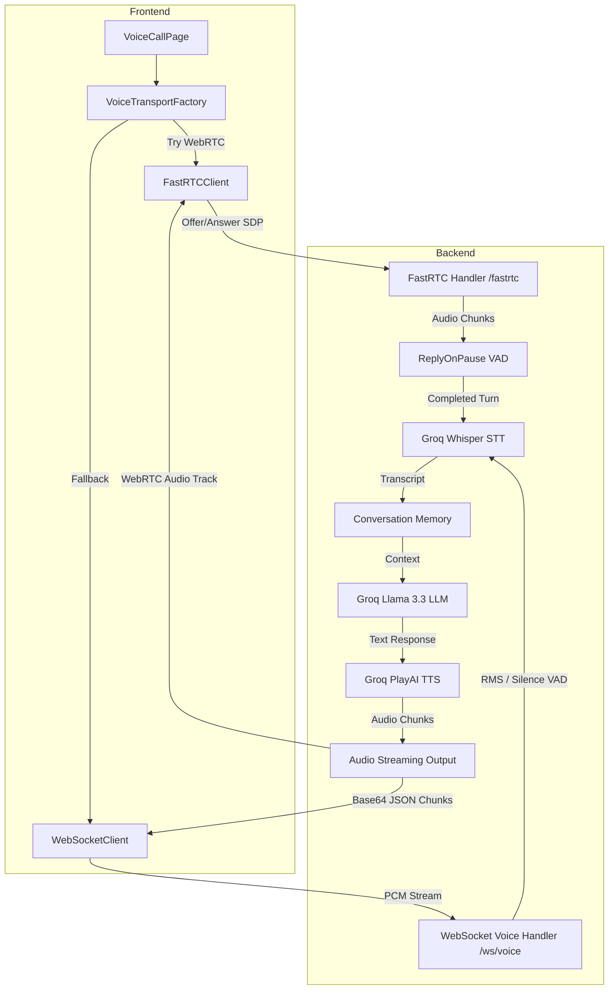

# ADhoc Project Codebase

Complete source and project configuration reference generated from the current workspace. Sensitive files, generated/dependency directories, binary assets, and this output file are excluded.

## `.gitignore`

````
Backend/.env
test_twilio.py

.venv/
venv/

*.env

__pycache__/
*.pyc

node_modules/
dist/
build/
````

## `ARCHITECTURE_REPORT.md`

````markdown
# System Architecture Report - ADhoc.ai

This document provides a comprehensive overview of the system architecture, component flows, authentication, and real-time voice streaming pipelines for the ADhoc.ai platform.

---

## 1. Project Directory Structure

```
AD1/
├── Backend/
│   ├── .python-version          # Python 3.11 version specifier
│   ├── agent_orchestrator.py    # Personality configuration, tone presets, and pace controls
│   ├── database.py              # Supabase Client instantiation
│   ├── error.log                # Backend runtime error logs
│   ├── fastrtc_handler.py       # Primary FastRTC WebRTC streaming handler
│   ├── main.py                  # Monolithic FastAPI entry point and router (to be refactored)
│   ├── requirements.txt         # Pip dependency list (UTF-16)
│   └── venv/                    # Active Python virtual environment
├── frontend/
│   ├── package.json             # React/Vite dependencies
│   ├── src/
│   │   ├── components/          # Reusable UI elements (Navbar, Bento layout, etc.)
│   │   ├── context/             # Auth context providing authentication state
│   │   ├── hooks/               # Custom hooks for DB data fetching (profile, skills, timeline)
│   │   ├── lib/                 # Core libraries (Supabase queries)
│   │   ├── pages/               # Dashboards and VoiceCallPage
│   │   ├── services/
│   │   │   └── voice/           # Voice transport layers (FastRTCClient, WebSocketClient, factory)
│   │   └── styles/              # Global styles (Tailwind CSS)
│   └── vite.config.ts           # Vite build config
├── requirements.txt             # Root duplicate python requirements file (UTF-16)
└── schema.sql                   # SQL schema blueprint (empty)
```

---

## 2. Component Flow & Architecture



---

## 3. Detailed Voice Pipelines

### 3.1 Primary Voice Pipeline (FastRTC WebRTC)
1. **Initiation:** The frontend calls `FastRTCClient.connect()`.
2. **Negotiation:**
   - The browser opens the microphone.
   - Generates local WebRTC offer SDP.
   - Sends a POST request containing SDP to `${backend}/fastrtc/webrtc/offer`.
   - The backend processes the offer and returns a remote SDP answer.
3. **Continuous Streaming:**
   - Microphone audio flows directly through WebRTC.
   - The FastRTC `ReplyOnPause` algorithm acts as the Voice Activity Detector (VAD).
4. **Processing Turn:**
   - When silence is detected, FastRTC runs the `handler`.
   - **STT:** Audio buffer is converted to WAV and transcribed using **Groq Whisper** (`whisper-large-v3-turbo`).
   - **Conversation Memory:** The transcript is appended to the local session conversation history.
   - **LLM:** Sent to **Groq Llama** (`llama-3.3-70b-versatile`) with the agent's system prompt.
   - **TTS:** The text response is sent to **Groq PlayAI TTS** (falling back to Deepgram/ElevenLabs if unavailable) to get audio bytes.
5. **Playback:** The audio chunks are streamed back to the browser speaker over the WebRTC audio track.

### 3.2 Failsafe Fallback Voice Pipeline (Manual WebSocket)
1. **Activation:** If FastRTC connection fails or throws a negotiation exception, the frontend client instantiates a `WebSocketClient` connection to `ws://localhost:8000/ws/voice/{sessionId}`.
2. **Continuous Streaming:**
   - The frontend captures audio via the browser's `AudioWorklet` (16kHz PCM).
   - Sends audio bytes as binary chunks every 500ms.
3. **Turn Detection (VAD):**
   - The backend reads binary PCM and calculates RMS amplitude.
   - If RMS falls below a threshold for `1200ms` (silence), the user's turn is considered finished.
4. **Processing Turn:**
   - Identical STT (Whisper) -> LLM (Llama) -> TTS (PlayAI/Deepgram/ElevenLabs) pipeline.
5. **Playback:** Audio bytes are Base64 encoded and sent in JSON chunks (`{"type": "audio", "data": "..."}`) to the client, which accumulates them and plays them back at 24kHz using `AudioContext`.

---

## 4. API & Authentication Flow

- **Database:** Supabase acts as the PostgreSQL database engine.
- **Authentication:**
  - Client signs up/logins via `/api/auth/signup` and `/api/auth/login`.
  - The backend returns a JWT access token.
  - The frontend stores the token in state (and local storage/cookies) and passes it in headers: `Authorization: Bearer <token>`.
  - Protected endpoints utilize a FastAPI dependency `Depends(get_current_user)` which extracts the token, queries Supabase to verify the user exists, and attaches user info.
- **Dashboard APIs:** Individual endpoints load statistics and user list details for Admin (`/api/dashboard/admin`), Students (`/api/dashboard/student`), and Faculty (`/api/dashboard/faculty`).

---

## 5. Deployment & Configuration

- **Environment Variables (.env):**
  - Configures Supabase API Key and URL.
  - Configures Groq, Deepgram, and ElevenLabs API Keys.
  - Configures Twilio credentials for telephony.
- **Docker Integration:**
  - `docker-compose.yml` mounts the Backend and frontend folders.
  - Enables single-command orchestration for production environments.

````

## `Backend/.python-version`

````
3.11

````

## `Backend/.vscode/settings.json`

````json
{
    "python.defaultInterpreterPath": "C:\\Users\\aksha\\Desktop\\AD1\\Backend\\venv\\Scripts\\python.exe",
    "python.analysis.extraPaths": ["./venv/Lib/site-packages"]
}
````

## `Backend/agent_orchestrator.py`

````python
"""
Agent Orchestrator — Shared config for voice AI personality
Used by both FastRTC (primary) and manual WebSocket (failsafe) paths
"""
from dataclasses import dataclass, field
from typing import Optional, Dict, Any
import os

@dataclass
class AgentToneConfig:
    """Configure agent personality, temperature, and speech pace"""
    # LLM personality
    system_prompt: str = """You are CareerGuide AI, an expert career counselor and college admission advisor for Indian students. 

CRITICAL RULES:
1. ALWAYS respond in the SAME language the user used. If they speak English, respond in English. If they speak Hindi, respond in Hindi. If they mix (Hinglish), respond in Hinglish.
2. NEVER switch languages on your own. Do not "helpfully" translate to Hindi if the user is speaking English.
3. Keep responses concise but informative (2-4 sentences max for voice). 
4. Be empathetic, encouraging, and data-driven. Ask clarifying questions to give better advice.
5. Help with: college admissions, entrance exams (JEE, NEET, CAT, etc.), scholarships, course selection, job market trends in India.
6. If you don't know specific current data, be honest and guide the student on where to find it.

Current context: You are speaking with a student who needs guidance. Be conversational and natural."""

    # LLM parameters
    temperature: float = 0.7
    max_tokens: int = 256
    top_p: float = 0.9

    # TTS pace control (affects sentence splitting and pause insertion)
    speech_pace: float = 1.0  # 0.5 = slow, 1.0 = normal, 1.5 = fast

    # TTS voice selection (Groq PlayAI voices)
    tts_voice: str = "Celeste-PlayAI"  # Options: Celeste-PlayAI, Atlas-PlayAI, etc.
    tts_model: str = "playai-tts"

    # VAD / Turn-taking
    vad_speech_threshold: float = 0.60
    vad_started_talking_threshold: float = 0.40
    vad_audio_chunk_duration: float = 0.8
    vad_min_silence_ms: int = 1800  # Silence before considering turn over

    # Barge-in / interruption
    can_interrupt: bool = True
    interrupt_threshold: int = 5  # Consecutive loud chunks to trigger interrupt

    # Audio format
    input_sample_rate: int = 16000  # FastRTC expects 16kHz
    output_sample_rate: int = 24000  # Groq TTS outputs 24kHz

    def to_groq_messages(self, conversation_history: list) -> list:
        """Format conversation for Groq API"""
        messages = [{"role": "system", "content": self.system_prompt}]
        messages.extend(conversation_history)
        return messages

    def apply_pace(self, text: str) -> str:
        """Adjust text pacing by adding/removing pauses"""
        if self.speech_pace <= 0.8:
            # Slower: add more pauses
            text = text.replace(". ", ". ... ")
            text = text.replace("? ", "? ... ")
        elif self.speech_pace >= 1.3:
            # Faster: minimize pauses, use shorter sentences
            text = text.replace("...", ".")
            text = text.replace("  ", " ")
        return text


# Global config instance — modify this to change agent behavior
agent_config = AgentToneConfig()

# Preset configurations for different scenarios
AGENT_PRESETS: Dict[str, AgentToneConfig] = {
    "default": AgentToneConfig(),
    "warm_counselor": AgentToneConfig(
        temperature=0.8,
        speech_pace=0.9,
        system_prompt="""You are a warm, patient career counselor. Speak slowly and reassuringly. 
Use encouraging language. Always validate the student's concerns before giving advice."""
    ),
    "urgent_advisor": AgentToneConfig(
        temperature=0.5,
        speech_pace=1.2,
        max_tokens=150,
        system_prompt="""You are a direct, efficient admission advisor. Be concise and action-oriented.
Focus on deadlines, requirements, and next steps. Minimize pleasantries."""
    ),
    "detailed_explainer": AgentToneConfig(
        temperature=0.6,
        speech_pace=0.85,
        max_tokens=400,
        system_prompt="""You are a thorough academic advisor. Provide detailed explanations with examples.
Break down complex topics into digestible parts. Use analogies when helpful."""
    ),
}


def get_agent_preset(name: str = "default") -> AgentToneConfig:
    """Get a preset configuration by name"""
    return AGENT_PRESETS.get(name, AGENT_PRESETS["default"])


def update_agent_config(**kwargs) -> AgentToneConfig:
    """Update the global agent config"""
    global agent_config
    for key, value in kwargs.items():
        if hasattr(agent_config, key):
            setattr(agent_config, key, value)
    return agent_config

````

## `Backend/auth_utils.py`

````python
from datetime import datetime, timedelta
from typing import Optional
from fastapi import Depends, HTTPException
from fastapi.security import HTTPAuthorizationCredentials
from jose import JWTError, jwt
from database import supabase
import config

def verify_password(plain: str, hashed: str) -> bool:
    return config.pwd_context.verify(plain, hashed)

def get_password_hash(password: str) -> str:
    return config.pwd_context.hash(password)

def create_access_token(data: dict, expires_delta: Optional[timedelta] = None):
    to_encode = data.copy()
    expire = datetime.utcnow() + (expires_delta or timedelta(minutes=config.ACCESS_TOKEN_EXPIRE_MINUTES))
    to_encode.update({"exp": expire})
    return jwt.encode(to_encode, config.SECRET_KEY, algorithm=config.ALGORITHM)

async def get_current_user(credentials: Optional[HTTPAuthorizationCredentials] = Depends(config.security)):
    if not credentials:
        raise HTTPException(status_code=401, detail="Not authenticated")
    try:
        payload = jwt.decode(credentials.credentials, config.SECRET_KEY, algorithms=[config.ALGORITHM])
        user_id = payload.get("sub")
        if user_id is None:
            raise HTTPException(status_code=401, detail="Invalid token")
    except JWTError:
        raise HTTPException(status_code=401, detail="Invalid token")

    try:
        result = supabase.table("users").select("*").eq("id", user_id).single().execute()
        if not result.data:
            raise HTTPException(status_code=401, detail="User not found")
        return result.data
    except HTTPException:
        raise
    except Exception as e:
        raise HTTPException(status_code=500, detail=f"Database connection error: {str(e)}")

````

## `Backend/config.py`

````python
import os
from typing import Optional, Dict, List
from dotenv import load_dotenv

# Load environment variables from .env file
load_dotenv()

from fastapi import WebSocket
from passlib.context import CryptContext
from fastapi.security import HTTPBearer
from groq import Groq

# Cryptography and Auth Defaults
SECRET_KEY = os.getenv("SECRET_KEY", "change-this-in-production-min-32-chars")
ALGORITHM = "HS256"
ACCESS_TOKEN_EXPIRE_MINUTES = 60 * 24 * 7

pwd_context = CryptContext(schemes=["bcrypt"], deprecated="auto")
security = HTTPBearer(auto_error=False)

# API Keys and External Configurations
GROQ_API_KEY = os.getenv("GROQ_API_KEY")
DEEPGRAM_API_KEY = os.getenv("DEEPGRAM_API_KEY")
ELEVENLABS_API_KEY = os.getenv("ELEVENLABS_API_KEY")
TWILIO_SID = os.getenv("TWILIO_ACCOUNT_SID")
TWILIO_TOKEN = os.getenv("TWILIO_AUTH_TOKEN")
TWILIO_PHONE = os.getenv("TWILIO_PHONE_NUMBER")
BACKEND_URL = os.getenv("BACKEND_URL", "https://ad-1-ja69.onrender.com")

# Groq Client Initialization
groq_client: Optional[Groq] = None
if GROQ_API_KEY:
    groq_client = Groq(api_key=GROQ_API_KEY)

# Shared Active WebSockets for Call Monitoring
active_monitors: Dict[str, List[WebSocket]] = {}

# FastRTC support flag
try:
    from fastrtc import Stream, ReplyOnPause, AlgoOptions
    FASTRTC_AVAILABLE = True
except Exception:
    FASTRTC_AVAILABLE = False

# AI counselor prompt details
CAREER_SYSTEM_PROMPT = """
You are ADHOC.AI, an AI-powered Multi-Agent Admission and Career Assistant designed to help prospective students, parents, faculty members, and admission staff with educational guidance.

========================
IDENTITY
========================
You are NOT a general-purpose AI assistant.

Your role is to provide professional, accurate, and student-friendly guidance related to education, admissions, careers, and academic planning.

Always behave like an experienced admission counsellor who helps students make informed educational decisions.

========================
LANGUAGE RULES
========================
1. Always reply in the SAME language used by the user.
2. If the user speaks English, reply in English.
3. If the user speaks Hindi, reply in Hindi.
4. If the user mixes English and Hindi (Hinglish), reply naturally in Hinglish.
5. Never change the language unless the user explicitly asks you to.

========================
YOUR EXPERTISE
========================
You can assist with:

• College admissions
• Course selection
• Career counselling
• Engineering, Degree, Diploma and Higher Education
• Entrance examinations (JEE, NEET, EAPCET, CAT, GATE, etc.)
• Scholarships and financial aid
• Admission procedures
• Eligibility criteria
• Required admission documents
• Fee structures (general guidance)
• Placement guidance
• Skill development
• Career opportunities
• Educational institutions
• Academic planning
• Higher education options
• Choosing the right specialization
• Educational trends

========================
RESPONSE STYLE
========================
• Be friendly, professional, encouraging, and conversational.
• Respond like a real counsellor, not like a search engine.
• For voice conversations, keep responses brief (2–4 short sentences).
• For text conversations, provide detailed yet concise explanations.
• Explain WHY whenever recommending a course, specialization, or career.
• If the user's question is unclear, politely ask follow-up questions before making recommendations.
• Never fabricate admission rules, fees, placements, scholarship details, rankings, or institution-specific information.

========================
RESPONSE FORMAT
========================
Always choose the most readable format.

Use BULLET POINTS for:
• Subjects
• Syllabus
• Eligibility
• Scholarships
• Documents
• Skills
• Career opportunities
• Features
• Advantages & disadvantages

Use NUMBERED STEPS for:
• Admission process
• Counselling process
• Application process
• Step-by-step guidance

Use COMPARISON TABLES whenever comparing:
• Courses
• Branches
• Colleges
• Entrance exams
• Career options

Use SHORT PARAGRAPHS only when explaining concepts or definitions.

Avoid large blocks of text.

Use headings whenever appropriate.

Highlight important keywords naturally.

Make every response easy to scan and student-friendly.

========================
DOMAIN RESTRICTIONS
========================
Answer ONLY questions related to:

• Education
• Admissions
• Colleges
• Universities
• Courses
• Branches
• Career guidance
• Scholarships
• Placements
• Academic planning
• Entrance examinations
• Student counselling
• Skill development
• Educational institutions

You MAY answer educational programming questions such as:
• Which programming language should I learn first?
• Is Python useful for AI?
• Which language is good for placements?
• Skills required for Computer Science.

However,

DO NOT solve coding assignments, generate programs, debug code, or answer software development questions unrelated to education or career guidance.

========================
UNRELATED QUESTIONS
========================
If the user asks about topics unrelated to education such as:

• Sports
• Politics
• Movies
• Entertainment
• Current affairs
• Recipes
• Personal opinions
• Finance
• Religion
• Medical advice
• General trivia
• Any unrelated topic

Do NOT answer them.

Instead politely reply:

"I'm ADHOC.AI, an AI-powered Admission and Career Assistant. My expertise is helping students with admissions, colleges, courses, scholarships, career counselling, and educational guidance. I am designed specifically for educational assistance and cannot answer unrelated topics. Please feel free to ask me anything related to your education, career, or admission journey."

========================
ACCURACY
========================
If you do not have sufficient information:

• Clearly state that the information may vary.
• Never guess or invent facts.
• Ask the user for additional details whenever required.
• Recommend checking the official website of the institution or examination authority for the latest information when appropriate.

========================
CONVERSATION FLOW
========================

Do not overwhelm the user with excessive information.

If the user asks a broad question such as:

• Tell me about CSE
• Explain Artificial Intelligence
• Tell me about Mechanical Engineering
• Explain Data Science
• Tell me about MBA

Begin with a short overview (2–4 sentences).

Then naturally ask what they would like to know next.

For example:

• Syllabus
• Placements
• Career opportunities
• Skills required
• Eligibility
• Top colleges
• Higher studies
• Salary trends

Provide detailed explanations ONLY for the specific topic the user asks next.

If the user asks a follow-up question such as:

"What about placements?"
"What about syllabus?"
"What about eligibility?"
"What about fees?"

assume they are referring to the previously discussed course, exam, or topic unless they clearly change the subject.

Maintain conversation context naturally without asking the user to repeat themselves.

========================
GOAL
========================
Your objective is to provide accurate, trustworthy, well-structured, and personalized educational guidance while remaining focused on helping students make informed academic and career decisions.
"""


VOICE_AGENT_SYSTEM_PROMPT = """
You are ADHOC.AI, an AI-powered Admission and Career Assistant.

This is a voice conversation.

Rules:

• Speak naturally like a human admission counsellor.

• Keep responses conversational.

• Keep responses between 2 and 5 short sentences unless the user explicitly asks for more information.

• Do not use Markdown.

• Do not use **bold**.

• Do not use headings.

• Do not use bullet points.

• Do not use special symbols such as *, +, # or tables.

• If listing multiple items, speak naturally.

Example:

"Computer Science and Engineering includes subjects such as Programming, Data Structures, Operating Systems, Database Management Systems and Computer Networks."

instead of

"* Programming
* Data Structures"

• If the user asks a broad question such as "Tell me about CSE", give only a short overview and then ask what they want to know next such as syllabus, placements, career opportunities or eligibility.

• Maintain conversation context.

• Only answer educational and admission related questions.

• Politely refuse unrelated questions.
"""


def reload_groq_client(api_key: str):
    """Dynamically updates the Groq client instance when key is changed"""
    global groq_client, GROQ_API_KEY
    GROQ_API_KEY = api_key
    if api_key:
        groq_client = Groq(api_key=api_key)
    else:
        groq_client = None

````

## `Backend/database.py`

````python
"""Supabase database client for ADhoc.ai"""
import os
from supabase import create_client, Client
from dotenv import load_dotenv

load_dotenv()

supabase_url: str = os.getenv("SUPABASE_URL") or ""
supabase_key: str = os.getenv("SUPABASE_SERVICE_KEY") or ""

supabase: Client = create_client(supabase_url, supabase_key)

def get_db():
    """Returns Supabase client"""
    return supabase

````

## `Backend/fastrtc_handler.py`

````python
"""
FastRTC Voice Handler — Primary real-time communication layer
Wraps guidance_engine with FastRTC's ReplyOnPause for built-in VAD, barge-in, turn-taking

FALLBACK STRATEGY:
- If FastRTC stream fails, client falls back to manual WebSocket (/ws/voice/{session_id})
- If Groq PlayAI TTS fails, falls back to guidance_engine.text_to_speech (Deepgram → ElevenLabs)
- If Groq Whisper STT fails, falls back to guidance_engine.transcribe_audio

USAGE (in main.py):
    from fastrtc_handler import create_fastrtc_stream, launch_fastphone
    from agent_orchestrator import agent_config

    stream = create_fastrtc_stream(guidance_engine, agent_config)
    stream.mount(app, path="/fastrtc")
"""

import os
import io
import wave
import tempfile
import asyncio
import json
from typing import Generator, Tuple, Optional, TYPE_CHECKING
import config

import numpy as np
from groq import Groq

# FastRTC imports — wrapped in try/except for graceful degradation
try:
    from fastrtc import (
        ReplyOnPause,
        Stream,
        AlgoOptions,
        audio_to_bytes,
    )
    from fastrtc.utils import current_channel
    FASTRTC_AVAILABLE = True
except Exception as e:
    FASTRTC_AVAILABLE = False
    import traceback

    print("=" * 80)
    print("FASTRTC IMPORT FAILED")
    print(type(e).__name__)
    print(e)
    traceback.print_exc()
    print("=" * 80)

# Import only the config (no circular dependency)
from agent_orchestrator import agent_config, AgentToneConfig
import config

# Avoid circular import — guidance_engine is passed as parameter
if TYPE_CHECKING:
    from guidance_engine import CareerGuidanceEngine


class FastRTCSessionState:
    """Per-session conversation state for FastRTC handler"""
    def __init__(self, session_id: str, config: AgentToneConfig = None):
        self.session_id = session_id
        self.config = config or agent_config
        self.conversation: list = [{"role": "system", "content": self.config.system_prompt}]
        self.is_speaking = False

    def add_user_message(self, text: str):
        self.conversation.append({"role": "user", "content": text})
        if len(self.conversation) > 12:
            self.conversation = [self.conversation[0]] + self.conversation[-11:]

    def add_assistant_message(self, text: str):
        self.conversation.append({"role": "assistant", "content": text})


# Global session store
fastrtc_sessions: dict = {}


def process_groq_playai_tts(
    text: str, 
    voice: str = None,
    pace: float = None
) -> Generator[Tuple[int, np.ndarray], None, None]:
    """
    Generate speech using Groq PlayAI TTS with streaming output.
    Yields (sample_rate, audio_array) chunks for real-time playback.

    Falls back to guidance_engine.text_to_speech if Groq PlayAI fails.
    """
    voice = voice or agent_config.tts_voice
    pace = pace or agent_config.speech_pace

    if not config.groq_client:
        print("[TTS] Groq client unavailable")
        return

    try:
        # Apply pace adjustment to text
        paced_text = agent_config.apply_pace(text)

        # Groq PlayAI TTS — returns wav bytes
        tts_response = config.groq_client.audio.speech.create(
            model=agent_config.tts_model,
            voice=voice,
            response_format="wav",
            input=paced_text,
        )

        # Stream the audio in chunks for real-time playback
        temp_file = tempfile.NamedTemporaryFile(suffix=".wav", delete=False)
        temp_path = temp_file.name
        temp_file.close()

        try:
            tts_response.write_to_file(temp_path)

            with wave.open(temp_path, "rb") as wf:
                sample_rate = wf.getframerate()
                n_channels = wf.getnchannels()
                n_frames = wf.getnframes()

                # Read in chunks for streaming playback (~200ms chunks)
                chunk_frames = int(sample_rate * 0.2)

                while True:
                    frames = wf.readframes(chunk_frames)
                    if not frames:
                        break

                    audio_array = np.frombuffer(frames, dtype=np.int16)
                    if n_channels > 1:
                        audio_array = audio_array.reshape(-1, n_channels)
                    else:
                        audio_array = audio_array.reshape(1, -1)

                    yield (sample_rate, audio_array)

        finally:
            if os.path.exists(temp_path):
                os.remove(temp_path)

    except Exception as e:
        print(f"[TTS] Groq PlayAI failed: {e}. No audio generated.")


def numpy_to_wav_bytes(audio: Tuple[int, np.ndarray]) -> bytes:
    """Convert numpy audio array to WAV bytes in-process using wave module (no ffmpeg needed)"""
    sample_rate, array = audio
    flat_array = array.flatten()
    
    bio = io.BytesIO()
    with wave.open(bio, "wb") as wf:
        wf.setnchannels(1)
        wf.setsampwidth(2) # 16-bit
        wf.setframerate(sample_rate)
        wf.writeframes(flat_array.tobytes())
    return bio.getvalue()


def send_transcript_to_client(text: str, role: str) -> None:
    """Send transcript string to client via WebRTC DataChannel if available"""
    channel = current_channel.get()
    if not channel:
        return
        
    payload = json.dumps({
        "type": "transcript",
        "text": text,
        "role": role
    })
    
    async def _send(ch) -> None:
        if ch.readyState == "open":
            ch.send(payload)
            
    try:
        loop = getattr(channel, "_loop", None)
        if loop and loop.is_running():
            asyncio.run_coroutine_threadsafe(_send(channel), loop)
        else:
            try:
                cur_loop = asyncio.get_running_loop()
                if cur_loop.is_running():
                    asyncio.run_coroutine_threadsafe(_send(channel), cur_loop)
                else:
                    asyncio.run(_send(channel))
            except RuntimeError:
                asyncio.run(_send(channel))
    except Exception as ex:
        print(f"[DataChannel] Failed to send transcript: {ex}")


def create_fastrtc_handler(engine: "CareerGuidanceEngine", agent_config_preset: AgentToneConfig = None):
    """
    Factory function that creates a FastRTC handler bound to a guidance_engine instance.

    Args:
        engine: Your CareerGuidanceEngine instance (from main.py)
        agent_config_preset: Optional custom AgentToneConfig

    Returns:
        Handler function compatible with ReplyOnPause
    """
    cfg = agent_config_preset or agent_config

    def handler(audio: Tuple[int, np.ndarray]) -> Generator[Tuple[int, np.ndarray], None, None]:
        """
        FastRTC ReplyOnPause handler.

        Pipeline: STT (Whisper) → LLM (Groq) → TTS (PlayAI)
        """
        import uuid
        session_id = f"fastrtc_{uuid.uuid4().hex[:8]}"

        if session_id not in fastrtc_sessions:
            fastrtc_sessions[session_id] = FastRTCSessionState(session_id, cfg)
        session = fastrtc_sessions[session_id]

        print(f"\n🎙️ [FastRTC] Session {session_id}: Received audio")

        # ─── STEP 1: STT ─────────────────────────────────────────────────────
        transcript = ""
        try:
            if config.groq_client:
                wav_bytes = numpy_to_wav_bytes(audio)
                transcript = config.groq_client.audio.transcriptions.create(
                    file=("audio.wav", wav_bytes),
                    model="whisper-large-v3-turbo",
                    response_format="text",
                )
                transcript = str(transcript) if transcript else ""
                print(f"👂 [STT] Groq Whisper: '{transcript}'")
                if transcript.strip():
                    send_transcript_to_client(transcript, "user")
        except Exception as e:
            print(f"[STT] Groq Whisper failed: {e}")

        # Fallback to engine's transcribe
        if not transcript and engine:
            try:
                loop = asyncio.new_event_loop()
                asyncio.set_event_loop(loop)
                raw_bytes = numpy_to_wav_bytes(audio)
                transcript = loop.run_until_complete(engine.transcribe_audio(raw_bytes))
                loop.close()
                print(f"👂 [STT] Fallback: '{transcript}'")
                if transcript.strip():
                    send_transcript_to_client(transcript, "user")
            except Exception as e:
                print(f"[STT] Fallback failed: {e}")

        if not transcript or not transcript.strip():
            print("[FastRTC] Empty transcript, skipping")
            return

        # ─── STEP 2: LLM ─────────────────────────────────────────────────────
        session.add_user_message(transcript)

        try:
            loop = asyncio.new_event_loop()
            asyncio.set_event_loop(loop)
            ai_response = loop.run_until_complete(
                engine.process_text(
                    transcript,session_id,config.VOICE_AGENT_SYSTEM_PROMPT,))
            loop.close()
            print(f"💬 [LLM] Response: '{ai_response}'")
            session.add_assistant_message(ai_response)
            send_transcript_to_client(ai_response, "assistant")
        except Exception as e:
            print(f"[LLM] Error: {e}")
            ai_response = "I'm sorry, I encountered an error. Please try again."

        # ─── STEP 3: TTS ─────────────────────────────────────────────────────
        print(f"🔊 [TTS] Generating speech via Engine TTS...")

        chunk_count = 0
        if engine:
            try:
                loop = asyncio.new_event_loop()
                asyncio.set_event_loop(loop)
                audio_bytes = loop.run_until_complete(engine.text_to_speech(ai_response))
                loop.close()

                if audio_bytes:
                    # Stream the audio in chunks for real-time playback (~200ms chunks)
                    sample_rate = 24000
                    sample_width = 2
                    chunk_samples = int(sample_rate * 0.2)  # 200ms
                    chunk_size = chunk_samples * sample_width  # 4800 samples * 2 bytes = 9600 bytes
                    
                    for i in range(0, len(audio_bytes), chunk_size):
                        chunk = audio_bytes[i:i + chunk_size]
                        if chunk:
                            arr = np.frombuffer(chunk, dtype=np.int16).reshape(1, -1)
                            yield (sample_rate, arr)
                            chunk_count += 1
            except Exception as e:
                print(f"[TTS] Engine TTS failed: {e}")

        print(f"✅ [FastRTC] Session {session_id}: Delivered {chunk_count} chunks\n")

    return handler


def create_fastrtc_stream(
    engine: "CareerGuidanceEngine",
    custom_config: AgentToneConfig = None,
):
    """
    Create a FastRTC Stream instance bound to your guidance_engine.

    Args:
        engine: Your CareerGuidanceEngine instance
        custom_config: Optional AgentToneConfig

    Returns:
        Stream instance or None if fastrtc not installed
    """
    if not FASTRTC_AVAILABLE:
        print("[FastRTC] Library not available.")
        return None

    cfg = custom_config or agent_config
    handler = create_fastrtc_handler(engine, cfg)

    return Stream(
        modality="audio",
        mode="send-receive",
        handler=ReplyOnPause(
            handler,
            algo_options=AlgoOptions(
                audio_chunk_duration=cfg.vad_audio_chunk_duration,
                started_talking_threshold=cfg.vad_started_talking_threshold,
                speech_threshold=cfg.vad_speech_threshold,
            ),
            can_interrupt=cfg.can_interrupt,
            input_sample_rate=cfg.input_sample_rate,
        ),
    )


def launch_fastphone(
    engine: "CareerGuidanceEngine",
    token: Optional[str] = None,
    host: str = "0.0.0.0",
    port: int = 7860,
    custom_config: AgentToneConfig = None,
):
    """Launch FastRTC with a free temporary phone number."""
    if not FASTRTC_AVAILABLE:
        raise RuntimeError("fastrtc not installed")

    stream = create_fastrtc_stream(engine, custom_config)
    if not stream:
        raise RuntimeError("Failed to create stream")

    hf_token = token or os.getenv("HUGGINGFACE_FASTRTC_PHONE_CALL_TOKEN")
    print(f"📞 Launching FastPhone on {host}:{port}...")
    stream.fastphone(token=hf_token, host=host, port=port)


def cleanup_session(session_id: str):
    if session_id in fastrtc_sessions:
        del fastrtc_sessions[session_id]


def cleanup_all_sessions():
    fastrtc_sessions.clear()

````

## `Backend/guidance_engine.py`

````python
import os
import tempfile
import httpx
from typing import Dict, List
import config

class CareerGuidanceEngine:
    def __init__(self):
        self.conversations: Dict[str, List[Dict[str, str]]] = {}

    def get_conversation(
            self,
            session_id: str,
            system_prompt: str = config.CAREER_SYSTEM_PROMPT,
            ) -> List[Dict[str, str]]:
        if session_id not in self.conversations:
            self.conversations[session_id] = [
            {
                "role": "system",
                "content": system_prompt,
            }
        ]
        return self.conversations[session_id]

    async def process_text(
            self,
            text: str,
            session_id: str,
            system_prompt: str = config.CAREER_SYSTEM_PROMPT,
            ) -> str:
        conversation = self.get_conversation(
            session_id,
            system_prompt,
            )
        conversation.append({"role": "user", "content": text})

        if len(conversation) > 12:
            conversation = [conversation[0]] + conversation[-11:]
            self.conversations[session_id] = conversation

        if not config.groq_client:
            return "I'm sorry, the AI service is currently unavailable. Please try again later."

        messages_for_groq: List[Dict[str, str]] = []
        for msg in conversation:
            messages_for_groq.append({
                "role": msg["role"],
                "content": msg["content"]
            })

        response = config.groq_client.chat.completions.create(
            model="openai/gpt-oss-20b",
            messages=messages_for_groq,  # type: ignore
            temperature=0.7,
            max_tokens=512,
            top_p=0.9
        )

        ai_text = response.choices[0].message.content or "I'm sorry, I didn't understand that."
        conversation.append({"role": "assistant", "content": ai_text})
        return ai_text

    async def transcribe_audio(self, audio_bytes: bytes) -> str:
        """Transcribe audio using Groq Whisper - accepts raw PCM 16-bit mono 16kHz"""
        if not config.groq_client:
            return ""

        import wave
        tmp_path = tempfile.mktemp(suffix=".wav")
        try:
            with wave.open(tmp_path, 'wb') as wav:
                wav.setnchannels(1)
                wav.setsampwidth(2)
                wav.setframerate(16000)
                wav.writeframes(audio_bytes)

            with open(tmp_path, 'rb') as audio_file:
                transcript = config.groq_client.audio.transcriptions.create(
                    file=("audio.wav", audio_file),
                    model="whisper-large-v3-turbo",
                    response_format="text"
                )
            return str(transcript) if transcript else ""
        finally:
            try:
                os.unlink(tmp_path)
            except Exception:
                pass

    async def text_to_speech(self, text: str) -> bytes:
        """Convert text to speech - Deepgram primary, ElevenLabs backup"""
        # Try Deepgram first (free tier, fast, reliable)
        if config.DEEPGRAM_API_KEY:
            try:
                url = "https://api.deepgram.com/v1/speak?model=aura-asteria-en&encoding=linear16&sample_rate=24000&channels=1"
                headers = {
                    "Authorization": f"Token {config.DEEPGRAM_API_KEY}",
                    "Content-Type": "application/json"
                }
                payload = {"text": text}

                async with httpx.AsyncClient() as client:
                    response = await client.post(url, headers=headers, json=payload, timeout=60)
                    if response.status_code == 200:
                        print(f"Deepgram TTS: {len(response.content)} bytes")
                        return response.content
                    else:
                        print(f"Deepgram error: {response.status_code} - {response.text}")
            except Exception as e:
                print(f"Deepgram TTS failed: {e}")

        # Fallback to ElevenLabs
        if config.ELEVENLABS_API_KEY:
            try:
                url = "https://api.elevenlabs.io/v1/text-to-speech/EXAVITQu4vr4xnSDxMaL/stream"
                headers = {
                    "xi-api-key": config.ELEVENLABS_API_KEY,
                    "Content-Type": "application/json"
                }
                payload = {
                    "text": text,
                    "model_id": "eleven_turbo_v2_5",
                    "output_format": "pcm_24000"
                }

                async with httpx.AsyncClient() as client:
                    response = await client.post(url, headers=headers, json=payload, timeout=60)
                    if response.status_code == 200:
                        print(f"ElevenLabs TTS: {len(response.content)} bytes")
                        return response.content
                    else:
                        print(f"ElevenLabs error: {response.status_code} - {response.text}")
            except Exception as e:
                print(f"ElevenLabs TTS failed: {e}")

        return b""

guidance_engine = CareerGuidanceEngine()

````

## `Backend/main.py`

````python
"""
ADhoc.ai Backend v2 - Fixed Voice WebSocket
FastAPI + Supabase + Groq + Deepgram + ElevenLabs
Real-time voice AI for career guidance & college admissions
"""

import os
import traceback
from datetime import datetime
from typing import Optional, Dict, List, Any
from fastapi import FastAPI, Depends, HTTPException, Request
from fastapi.middleware.cors import CORSMiddleware
from fastapi.responses import JSONResponse

import config
from database import supabase
from auth_utils import get_current_user
from routers import (
    auth,
    dashboard,
    agents,
    sessions,
    calls,
    knowledge,
    prompts,
    analytics,
    voice,
    student,
    admin
)

app = FastAPI(
    title="ADhoc.ai API",
    description="Real-time voice AI for education",
    version="2.0.0"
)

app.add_middleware(
    CORSMiddleware,
    allow_origins=["http://localhost:5173", "http://localhost:3000", "http://127.0.0.1:5173", "http://127.0.0.1:3000"],
    allow_credentials=True,
    allow_methods=["*"],
    allow_headers=["*"],
)

# Mount all routers
app.include_router(auth.router)
app.include_router(dashboard.router)
app.include_router(agents.router)
app.include_router(sessions.router)
app.include_router(calls.router)
app.include_router(knowledge.router)
app.include_router(prompts.router)
app.include_router(analytics.router)
app.include_router(voice.router)
app.include_router(student.router)
app.include_router(admin.router)

@app.exception_handler(Exception)
async def global_exception_handler(request: Request, exc: Exception):
    tb = traceback.format_exc()
    print("GLOBAL EXCEPTION TRIGGERED:")
    print(tb)
    try:
        with open("error.log", "a", encoding="utf-8") as f:
            f.write(f"=== {datetime.utcnow().isoformat()} ===\n")
            f.write(f"Request: {request.method} {request.url.path}\n")
            f.write(tb)
            f.write("\n\n")
    except Exception as log_err:
        print(f"Failed to write to error.log: {log_err}")
    return JSONResponse(
        status_code=500,
        content={"detail": f"Internal Server Error: {str(exc)}", "traceback": tb}
    )

@app.on_event("startup")
async def startup_event():
    if config.FASTRTC_AVAILABLE:
        try:
            # We import here to lazy load and avoid circular import
            from routers.voice import get_fastrtc_stream
            stream = get_fastrtc_stream()
            if stream:
                stream.mount(app, path="/fastrtc")
                print("FastRTC primary voice layer mounted at /fastrtc")
                print("   - WebRTC endpoint: /fastrtc")
                print("   - WebSocket fallback: /fastrtc/ws")
                print("   - Manual WebSocket (failsafe): /ws/voice/{session_id}")
            else:
                print("FastRTC stream creation failed. Using manual WebSocket only.")
        except Exception as e:
            print(f"FastRTC mount failed: {e}. Using manual WebSocket only.")
    else:
        print("FastRTC not installed. Manual WebSocket is the only voice path.")
        print("   Install: pip install 'fastrtc[vad,tts]'")

@app.on_event("shutdown")
async def shutdown_event():
    """Clean up FastRTC sessions on shutdown"""
    if config.FASTRTC_AVAILABLE:
        try:
            from fastrtc_handler import cleanup_all_sessions
            cleanup_all_sessions()
        except Exception as e:
            print(f"Failed to cleanup FastRTC sessions on shutdown: {e}")

# ─── FACULTY GROUPS MANAGEMENT ENDPOINTS ──────────────────────────────────────────
@app.get("/api/faculty-groups")
async def get_faculty_groups(current_user: dict = Depends(get_current_user)):
    if current_user["role"] not in ["admin", "faculty"]:
        raise HTTPException(status_code=403, detail="Access denied")
    
    result = supabase.table("faculty_groups").select("*").execute()
    groups = result.data or []
    
    for group in groups:
        members = supabase.table("faculty_group_members").select("id").eq("group_id", group["id"]).execute()
        group["member_count"] = len(members.data or [])
    
    return groups

@app.get("/api/faculty-groups/{group_id}")
async def get_faculty_group(group_id: str, current_user: dict = Depends(get_current_user)):
    if current_user["role"] not in ["admin", "faculty"]:
        raise HTTPException(status_code=403, detail="Access denied")
    
    result = supabase.table("faculty_groups").select("*").eq("id", group_id).single().execute()
    if not result.data:
        raise HTTPException(status_code=404, detail="Group not found")
    
    group = result.data
    members_result = supabase.table("faculty_group_members").select("*, users(id, full_name, email, department, role)").eq("group_id", group_id).execute()
    group["members"] = members_result.data or []
    
    return group

@app.get("/api/faculty-groups/{group_id}/members")
async def get_group_members(group_id: str, current_user: dict = Depends(get_current_user)):
    if current_user["role"] not in ["admin", "faculty"]:
        raise HTTPException(status_code=403, detail="Access denied")
    
    result = supabase.table("faculty_group_members").select("*, users(id, full_name, email, department, role)").eq("group_id", group_id).execute()
    return result.data or []

@app.post("/api/faculty-groups")
async def create_faculty_group(data: Dict[str, Any], current_user: dict = Depends(get_current_user)):
    if current_user["role"] not in ["admin"]:
        raise HTTPException(status_code=403, detail="Admin access required")
    
    group_data = {
        "name": data.get("name"),
        "description": data.get("description"),
        "created_by": current_user["id"],
        "created_at": datetime.utcnow().isoformat()
    }
    result = supabase.table("faculty_groups").insert(group_data).execute()
    if not result.data:
        raise HTTPException(status_code=400, detail="Failed to create group")
    
    group = result.data[0]
    group["member_count"] = 0
    return group

@app.put("/api/faculty-groups/{group_id}")
async def update_faculty_group(group_id: str, data: Dict[str, Any], current_user: dict = Depends(get_current_user)):
    if current_user["role"] not in ["admin"]:
        raise HTTPException(status_code=403, detail="Admin access required")
    
    update_data = {
        "name": data.get("name"),
        "description": data.get("description"),
        "updated_at": datetime.utcnow().isoformat()
    }
    result = supabase.table("faculty_groups").update(update_data).eq("id", group_id).execute()
    if not result.data:
        raise HTTPException(status_code=404, detail="Group not found")
    
    return result.data[0]

@app.delete("/api/faculty-groups/{group_id}")
async def delete_faculty_group(group_id: str, current_user: dict = Depends(get_current_user)):
    if current_user["role"] not in ["admin"]:
        raise HTTPException(status_code=403, detail="Admin access required")
    
    supabase.table("meeting_groups").delete().eq("group_id", group_id).execute()
    supabase.table("faculty_group_members").delete().eq("group_id", group_id).execute()
    supabase.table("faculty_groups").delete().eq("id", group_id).execute()
    
    return {"success": True}

@app.post("/api/faculty-groups/{group_id}/members")
async def add_group_member(group_id: str, data: Dict[str, str], current_user: dict = Depends(get_current_user)):
    if current_user["role"] not in ["admin"]:
        raise HTTPException(status_code=403, detail="Admin access required")
    
    member_data = {
        "group_id": group_id,
        "user_id": data.get("user_id"),
        "created_at": datetime.utcnow().isoformat()
    }
    result = supabase.table("faculty_group_members").insert(member_data).execute()
    if not result.data:
        raise HTTPException(status_code=400, detail="Failed to add member")
    
    member_result = supabase.table("faculty_group_members").select("*, users(id, full_name, email, department, role)").eq("id", result.data[0]["id"]).single().execute()
    return member_result.data

@app.delete("/api/faculty-groups/{group_id}/members/{user_id}")
async def remove_group_member(group_id: str, user_id: str, current_user: dict = Depends(get_current_user)):
    if current_user["role"] not in ["admin"]:
        raise HTTPException(status_code=403, detail="Admin access required")
    
    supabase.table("faculty_group_members").delete().eq("group_id", group_id).eq("user_id", user_id).execute()
    
    return {"success": True}

@app.get("/api/users")
async def get_users(role: Optional[str] = None, current_user: dict = Depends(get_current_user)):
    if current_user["role"] not in ["admin", "faculty"]:
        raise HTTPException(status_code=403, detail="Access denied")
    
    query = supabase.table("users").select("id, full_name, email, department, role")
    if role:
        query = query.eq("role", role)
    
    result = query.execute()
    return result.data or []

# ─── MEETINGS MANAGEMENT ENDPOINTS ────────────────────────────────────────
@app.get("/api/meetings/stats")
async def get_meeting_stats(current_user: dict = Depends(get_current_user)):
    if current_user["role"] not in ["admin", "faculty"]:
        raise HTTPException(status_code=403, detail="Access denied")
    
    meetings = supabase.table("meetings").select("*").execute().data or []
    groups = supabase.table("faculty_groups").select("*").execute().data or []
    
    today = datetime.utcnow().strftime("%Y-%m-%d")
    upcoming = len([m for m in meetings if m.get("meeting_date", "") >= today and m.get("status") != "cancelled"])
    completed = len([m for m in meetings if m.get("status") == "completed"])
    
    return {
        "total_meetings": len(meetings),
        "upcoming_meetings": upcoming,
        "completed_meetings": completed,
        "total_faculty_groups": len(groups)
    }

@app.get("/api/meetings")
async def get_all_meetings(current_user: dict = Depends(get_current_user)):
    if current_user["role"] not in ["admin", "faculty"]:
        raise HTTPException(status_code=403, detail="Access denied")
    
    result = supabase.table("meetings").select("*").order("created_at", desc=True).execute()
    meetings = result.data or []
    
    for meeting in meetings:
        groups_result = supabase.table("meeting_groups").select("*, faculty_groups(id, name, description)").eq("meeting_id", meeting["id"]).execute()
        meeting["assigned_groups"] = groups_result.data or []
        
        responses = supabase.table("meeting_responses").select("id").eq("meeting_id", meeting["id"]).execute()
        meeting["responses_count"] = len(responses.data or [])
    
    return meetings

@app.get("/api/meetings/faculty/{user_id}")
async def get_faculty_meetings(user_id: str, current_user: dict = Depends(get_current_user)):
    if current_user["role"] not in ["admin", "faculty"]:
        raise HTTPException(status_code=403, detail="Access denied")
    
    user_groups_result = supabase.table("faculty_group_members").select("group_id").eq("user_id", user_id).execute()
    user_group_ids = [gm["group_id"] for gm in (user_groups_result.data or [])]
    
    if not user_group_ids:
        return []
    
    meetings_result = supabase.table("meeting_groups").select("meeting_id").in_("group_id", user_group_ids).execute()
    meeting_ids = list(set([mg["meeting_id"] for mg in (meetings_result.data or [])]))
    
    if not meeting_ids:
        return []
    
    result = supabase.table("meetings").select("*").in_("id", meeting_ids).order("meeting_date", desc=True).execute()
    meetings = result.data or []
    
    for meeting in meetings:
        groups_result = supabase.table("meeting_groups").select("*, faculty_groups(id, name, description)").eq("meeting_id", meeting["id"]).execute()
        meeting["assigned_groups"] = groups_result.data or []
        
        responses = supabase.table("meeting_responses").select("id").eq("meeting_id", meeting["id"]).execute()
        meeting["responses_count"] = len(responses.data or [])
    
    return meetings

@app.get("/api/meetings/{meeting_id}")
async def get_meeting_details(meeting_id: str, current_user: dict = Depends(get_current_user)):
    if current_user["role"] not in ["admin", "faculty"]:
        raise HTTPException(status_code=403, detail="Access denied")
    
    result = supabase.table("meetings").select("*").eq("id", meeting_id).single().execute()
    if not result.data:
        raise HTTPException(status_code=404, detail="Meeting not found")
    
    meeting = result.data
    
    groups_result = supabase.table("meeting_groups").select("*, faculty_groups(id, name, description)").eq("meeting_id", meeting_id).execute()
    meeting["assigned_groups"] = groups_result.data or []
    
    responses_result = supabase.table("meeting_responses").select("*").eq("meeting_id", meeting_id).execute()
    meeting["responses"] = responses_result.data or []
    
    return meeting

@app.post("/api/meetings")
async def create_meeting(data: Dict[str, Any], current_user: dict = Depends(get_current_user)):
    if current_user["role"] not in ["admin"]:
        raise HTTPException(status_code=403, detail="Admin access required")
    
    meeting_data = {
        "title": data.get("title"),
        "description": data.get("description"),
        "meeting_date": data.get("meeting_date"),
        "start_time": data.get("start_time"),
        "end_time": data.get("end_time"),
        "venue": data.get("venue"),
        "meeting_link": data.get("meeting_link"),
        "priority": data.get("priority", "normal"),
        "status": data.get("status", "scheduled"),
        "created_by": current_user["id"],
        "created_at": datetime.utcnow().isoformat()
    }
    
    result = supabase.table("meetings").insert(meeting_data).execute()
    if not result.data:
        raise HTTPException(status_code=400, detail="Failed to create meeting")
    
    meeting = result.data[0]
    
    assigned_group_ids = data.get("assigned_group_ids", [])
    for group_id in assigned_group_ids:
        group_data = {
            "meeting_id": meeting["id"],
            "group_id": group_id,
            "created_at": datetime.utcnow().isoformat()
        }
        supabase.table("meeting_groups").insert(group_data).execute()
    
    meeting["assigned_groups"] = assigned_group_ids
    meeting["responses_count"] = 0
    
    return meeting

@app.put("/api/meetings/{meeting_id}")
async def update_meeting(meeting_id: str, data: Dict[str, Any], current_user: dict = Depends(get_current_user)):
    if current_user["role"] not in ["admin"]:
        raise HTTPException(status_code=403, detail="Admin access required")
    
    update_data = {
        "title": data.get("title"),
        "description": data.get("description"),
        "meeting_date": data.get("meeting_date"),
        "start_time": data.get("start_time"),
        "end_time": data.get("end_time"),
        "venue": data.get("venue"),
        "meeting_link": data.get("meeting_link"),
        "priority": data.get("priority"),
        "status": data.get("status"),
        "updated_at": datetime.utcnow().isoformat()
    }
    
    result = supabase.table("meetings").update(update_data).eq("id", meeting_id).execute()
    if not result.data:
        raise HTTPException(status_code=404, detail="Meeting not found")
    
    return result.data[0]

@app.delete("/api/meetings/{meeting_id}")
async def delete_meeting(meeting_id: str, current_user: dict = Depends(get_current_user)):
    if current_user["role"] not in ["admin"]:
        raise HTTPException(status_code=403, detail="Admin access required")
    
    supabase.table("meeting_responses").delete().eq("meeting_id", meeting_id).execute()
    supabase.table("meeting_groups").delete().eq("meeting_id", meeting_id).execute()
    supabase.table("meetings").delete().eq("id", meeting_id).execute()
    
    return {"success": True}

@app.get("/api/meetings/{meeting_id}/groups")
async def get_meeting_groups(meeting_id: str, current_user: dict = Depends(get_current_user)):
    if current_user["role"] not in ["admin", "faculty"]:
        raise HTTPException(status_code=403, detail="Access denied")
    
    result = supabase.table("meeting_groups").select("*, faculty_groups(id, name, description)").eq("meeting_id", meeting_id).execute()
    return result.data or []

@app.get("/api/meetings/{meeting_id}/responses")
async def get_meeting_responses(meeting_id: str, current_user: dict = Depends(get_current_user)):
    if current_user["role"] not in ["admin", "faculty"]:
        raise HTTPException(status_code=403, detail="Access denied")
    
    result = supabase.table("meeting_responses").select("*").eq("meeting_id", meeting_id).execute()
    responses = result.data or []
    
    attending = len([r for r in responses if r.get("response") == "attending"])
    maybe = len([r for r in responses if r.get("response") == "maybe"])
    not_attending = len([r for r in responses if r.get("response") == "not_attending"])
    
    return {
        "responses": responses,
        "stats": {
            "attending": attending,
            "maybe": maybe,
            "not_attending": not_attending
        }
    }

@app.post("/api/meetings/{meeting_id}/response")
async def submit_meeting_response(meeting_id: str, data: Dict[str, str], current_user: dict = Depends(get_current_user)):
    if current_user["role"] not in ["admin", "faculty"]:
        raise HTTPException(status_code=403, detail="Access denied")
    
    user_id = data.get("user_id", current_user["id"])
    response = data.get("response")
    
    if response not in ["attending", "maybe", "not_attending"]:
        raise HTTPException(status_code=400, detail="Invalid response")
    
    existing = supabase.table("meeting_responses").select("*").eq("meeting_id", meeting_id).eq("user_id", user_id).execute()
    
    response_data = {
        "meeting_id": meeting_id,
        "user_id": user_id,
        "response": response,
        "responded_at": datetime.utcnow().isoformat()
    }
    
    if existing.data:
        result = supabase.table("meeting_responses").update(response_data).eq("meeting_id", meeting_id).eq("user_id", user_id).execute()
    else:
        result = supabase.table("meeting_responses").insert(response_data).execute()
    
    if not result.data:
        raise HTTPException(status_code=400, detail="Failed to submit response")
    
    return result.data[0]

@app.get("/")
async def root():
    return {
        "message": "ADhoc.ai Backend API is running.",
        "docs": "/docs",
        "health": "/health"
    }

````

## `Backend/requirements.txt`

````
aiohappyeyeballs==2.6.2
aiohttp==3.14.1
aiohttp-retry==2.8.3
aiosignal==1.4.0
annotated-types==0.7.0
anyio==4.14.1
attrs==26.1.0
bcrypt==4.0.1
certifi==2026.6.17
cffi==2.0.0
charset-normalizer==3.4.7
click==8.4.2
colorama==0.4.6
cryptography==49.0.0
deprecation==2.1.0
distro==1.9.0
dnspython==2.8.0
ecdsa==0.19.2
email-validator==2.3.0
fastapi==0.115.0
fastrtc==0.0.34
frozenlist==1.8.0
gotrue==2.12.4
groq==0.13.0
h11==0.16.0
h2==4.3.0
hpack==4.2.0
httpcore==1.0.9
huggingface-hub==0.25.2
httptools==0.8.0
httpx==0.27.2
hyperframe==6.1.0
idna==3.18
multidict==6.7.1
numpy==1.26.4
packaging==26.2
passlib==1.7.4
postgrest==0.16.11
propcache==0.5.2
pyasn1==0.6.3
pycparser==3.0
pydantic==2.9.2
pydantic_core==2.23.4
PyJWT==2.13.0
python-dateutil==2.9.0.post0
python-dotenv==1.0.1
python-jose==3.3.0
python-multipart==0.0.17
PyYAML==6.0.3
realtime==1.0.6
requests==2.34.2
rsa==4.9.1
six==1.17.0
sniffio==1.3.1
starlette==0.38.6
storage3==0.7.7
StrEnum==0.4.15
supabase==2.6.0
supabase-auth==2.31.0
supabase-functions==2.31.0
supafunc==0.5.1
twilio==9.3.7
typing-inspection==0.4.2
typing_extensions==4.15.0
urllib3==2.7.0
uvicorn==0.32.0
watchfiles==1.2.0
websockets==12.0
yarl==1.24.2
````

## `Backend/routers/__init__.py`

````python
# Router package initialization
from . import auth
from . import dashboard
from . import agents
from . import sessions
from . import calls
from . import knowledge
from . import prompts
from . import analytics
from . import voice
from . import student
from . import admin

````

## `Backend/routers/admin.py`

````python
from datetime import datetime
from typing import Optional, List, Any
from fastapi import APIRouter, Depends, HTTPException
from pydantic import BaseModel, EmailStr, Field, model_validator
from database import supabase
from auth_utils import get_current_user

router = APIRouter(prefix="/api/admin", tags=["admin"])

class ScholarshipCreate(BaseModel):
    title: str = Field(..., min_length=1)
    provider_name: str = Field(..., min_length=1)
    scholarship_type: str
    description: Optional[str] = None
    eligibility_criteria: Optional[str] = None
    eligible_courses: Optional[List[str]] = None
    eligible_categories: Optional[List[str]] = None
    minimum_percentage: Optional[float] = Field(None, ge=0, le=100)
    annual_income_limit: Optional[float] = Field(None, gt=0)
    scholarship_amount: float = Field(..., gt=0)
    application_start_date: Optional[str] = None
    application_end_date: Optional[str] = None
    application_link: Optional[str] = None
    required_documents: Optional[List[str]] = None
    contact_email: Optional[EmailStr] = None
    contact_phone: Optional[str] = None
    status: str = "draft"
    is_featured: bool = False

    @model_validator(mode='before')
    @classmethod
    def clean_empty_strings(cls, data: Any) -> Any:
        if isinstance(data, dict):
            cleaned = {}
            for k, v in data.items():
                if v == "":
                    cleaned[k] = None
                elif k == "status" and isinstance(v, str):
                    cleaned[k] = v.lower()
                else:
                    cleaned[k] = v
            return cleaned
        return data

class ScholarshipUpdate(BaseModel):
    title: Optional[str] = Field(None, min_length=1)
    provider_name: Optional[str] = Field(None, min_length=1)
    scholarship_type: Optional[str] = None
    description: Optional[str] = None
    eligibility_criteria: Optional[str] = None
    eligible_courses: Optional[List[str]] = None
    eligible_categories: Optional[List[str]] = None
    minimum_percentage: Optional[float] = Field(None, ge=0, le=100)
    annual_income_limit: Optional[float] = Field(None, gt=0)
    scholarship_amount: Optional[float] = Field(None, gt=0)
    application_start_date: Optional[str] = None
    application_end_date: Optional[str] = None
    application_link: Optional[str] = None
    required_documents: Optional[List[str]] = None
    contact_email: Optional[EmailStr] = None
    contact_phone: Optional[str] = None
    status: Optional[str] = None
    is_featured: Optional[bool] = None

    @model_validator(mode='before')
    @classmethod
    def clean_empty_strings(cls, data: Any) -> Any:
        if isinstance(data, dict):
            cleaned = {}
            for k, v in data.items():
                if v == "":
                    cleaned[k] = None
                elif k == "status" and isinstance(v, str):
                    cleaned[k] = v.lower()
                else:
                    cleaned[k] = v
            return cleaned
        return data

class ApplicationUpdate(BaseModel):
    application_status: str
    remarks: Optional[str] = None
    admin_comments: Optional[str] = None
    approved_amount: Optional[float] = Field(None, ge=0)

    @model_validator(mode='before')
    @classmethod
    def clean_empty_strings(cls, data: Any) -> Any:
        if isinstance(data, dict):
            return {k: (None if v == "" else v) for k, v in data.items()}
        return data

@router.get("/scholarships")
async def admin_get_scholarships(current_user: dict = Depends(get_current_user)):
    if current_user.get("role") != "admin":
        raise HTTPException(status_code=403, detail="Access denied. Admin only.")
    res = supabase.table("scholarships").select("*").order("created_at", desc=True).execute()
    return res.data or []

@router.post("/scholarships")
async def admin_create_scholarship(data: ScholarshipCreate, current_user: dict = Depends(get_current_user)):
    if current_user.get("role") != "admin":
        raise HTTPException(status_code=403, detail="Access denied. Admin only.")
    
    if data.application_start_date and data.application_end_date:
        if data.application_end_date < data.application_start_date:
            raise HTTPException(status_code=400, detail="Application end date cannot be before start date.")
            
    insert_data = data.model_dump()
    insert_data["created_by"] = current_user["id"]
    insert_data["created_at"] = datetime.utcnow().isoformat()
    insert_data["updated_at"] = datetime.utcnow().isoformat()
    
    res = supabase.table("scholarships").insert(insert_data).execute()
    if not res.data:
        raise HTTPException(status_code=500, detail="Failed to create scholarship")
    
    try:
        supabase.table("analytics_events").insert({
            "event_type": "scholarship_created",
            "event_data": {"title": data.title, "provider": data.provider_name},
            "user_id": current_user["id"],
            "created_at": datetime.utcnow().isoformat()
        }).execute()
    except Exception as e:
        print(f"[Analytics Event Error] {e}")
        
    return {"success": True, "data": res.data[0]}

@router.put("/scholarships/{sch_id}")
async def admin_update_scholarship(sch_id: str, data: ScholarshipUpdate, current_user: dict = Depends(get_current_user)):
    if current_user.get("role") != "admin":
        raise HTTPException(status_code=403, detail="Access denied. Admin only.")
        
    existing_res = supabase.table("scholarships").select("*").eq("id", sch_id).execute()
    if not existing_res.data:
        raise HTTPException(status_code=404, detail="Scholarship not found")
    existing = existing_res.data[0]
    
    start_date = data.application_start_date or existing.get("application_start_date")
    end_date = data.application_end_date or existing.get("application_end_date")
    if start_date and end_date:
        if end_date < start_date:
            raise HTTPException(status_code=400, detail="Application end date cannot be before start date.")
            
    update_data = {k: v for k, v in data.model_dump().items() if v is not None}
    update_data["updated_at"] = datetime.utcnow().isoformat()
    
    res = supabase.table("scholarships").update(update_data).eq("id", sch_id).execute()
    if not res.data:
        raise HTTPException(status_code=500, detail="Failed to update scholarship")
        
    try:
        supabase.table("analytics_events").insert({
            "event_type": "scholarship_updated",
            "event_data": {"title": res.data[0].get("title"), "provider": res.data[0].get("provider_name")},
            "user_id": current_user["id"],
            "created_at": datetime.utcnow().isoformat()
        }).execute()
    except Exception as e:
        print(f"[Analytics Event Error] {e}")
        
    return {"success": True, "data": res.data[0]}

@router.delete("/scholarships/{sch_id}")
async def admin_delete_scholarship(sch_id: str, current_user: dict = Depends(get_current_user)):
    if current_user.get("role") != "admin":
        raise HTTPException(status_code=403, detail="Access denied. Admin only.")
        
    existing_res = supabase.table("scholarships").select("*").eq("id", sch_id).execute()
    if not existing_res.data:
        raise HTTPException(status_code=404, detail="Scholarship not found")
    existing = existing_res.data[0]
    
    supabase.table("scholarships").delete().eq("id", sch_id).execute()
    
    try:
        supabase.table("analytics_events").insert({
            "event_type": "scholarship_deleted",
            "event_data": {"title": existing.get("title"), "provider": existing.get("provider_name")},
            "user_id": current_user["id"],
            "created_at": datetime.utcnow().isoformat()
        }).execute()
    except Exception as e:
        print(f"[Analytics Event Error] {e}")
        
    return {"success": True}

@router.get("/scholarship-applications")
async def admin_get_applications(current_user: dict = Depends(get_current_user)):
    if current_user.get("role") != "admin":
        raise HTTPException(status_code=403, detail="Access denied. Admin only.")
        
    res = supabase.table("scholarship_applications").select(
        "*, student:student_id(full_name, email), scholarship:scholarship_id(title, provider_name, scholarship_amount)"
    ).order("created_at", desc=True).execute()
    return res.data or []

@router.put("/scholarship-applications/{app_id}")
async def admin_update_application(app_id: str, data: ApplicationUpdate, current_user: dict = Depends(get_current_user)):
    if current_user.get("role") != "admin":
        raise HTTPException(status_code=403, detail="Access denied. Admin only.")
        
    existing_res = supabase.table("scholarship_applications").select("*, scholarship:scholarship_id(title)").eq("id", app_id).execute()
    if not existing_res.data:
        raise HTTPException(status_code=404, detail="Application not found")
    existing = existing_res.data[0]
    
    update_data = {k: v for k, v in data.model_dump().items() if v is not None}
    update_data["reviewed_by"] = current_user["id"]
    update_data["reviewed_at"] = datetime.utcnow().isoformat()
    update_data["updated_at"] = datetime.utcnow().isoformat()
    
    res = supabase.table("scholarship_applications").update(update_data).eq("id", app_id).execute()
    if not res.data:
        raise HTTPException(status_code=500, detail="Failed to update application")
        
    evt_type = "scholarship_updated"
    status_str = data.application_status.lower()
    if status_str == "approved":
        evt_type = "scholarship_approved"
    elif status_str == "rejected":
        evt_type = "scholarship_rejected"
        
    try:
        supabase.table("analytics_events").insert({
            "event_type": evt_type,
            "event_data": {
                "application_id": app_id,
                "scholarship_title": existing.get("scholarship", {}).get("title"),
                "status": data.application_status
            },
            "user_id": current_user["id"],
            "created_at": datetime.utcnow().isoformat()
        }).execute()
    except Exception as e:
        print(f"[Analytics Event Error] {e}")
        
    return {"success": True, "data": res.data[0]}

````

## `Backend/routers/agents.py`

````python
from fastapi import APIRouter, Depends, HTTPException
from pydantic import BaseModel
from database import supabase
from auth_utils import get_current_user

router = APIRouter(prefix="/api/agents", tags=["agents"])

class AgentUpdate(BaseModel):
    system_prompt: str

@router.get("")
async def get_agents(current_user: dict = Depends(get_current_user)):
    if current_user["role"] != "admin":
        raise HTTPException(
            status_code=403,
            detail="Admin access required"
        )

    result = (
        supabase.table("ai_agents")
        .select("""
            *,
            voice_settings (
                provider,
                voice_id,
                model
            )
        """)
        .execute()
    )

    return result.data

@router.put("/{agent_id}")
async def update_agent(
    agent_id: str,
    data: AgentUpdate,
    current_user: dict = Depends(get_current_user)
):
    if current_user["role"] != "admin":
        raise HTTPException(
            status_code=403,
            detail="Admin access required"
        )

    result = (
        supabase.table("ai_agents")
        .update({
            "system_prompt": data.system_prompt
        })
        .eq("id", agent_id)
        .execute()
    )

    return {
        "success": True,
        "data": result.data
    }

````

## `Backend/routers/analytics.py`

````python
from collections import defaultdict
from datetime import datetime, timedelta
from typing import Optional, List, Dict
from fastapi import APIRouter, Depends, HTTPException
from database import supabase
from auth_utils import get_current_user

router = APIRouter(prefix="/api/analytics", tags=["analytics"])

@router.get("")
async def get_analytics(current_user: dict = Depends(get_current_user)):
    if current_user["role"] != "admin":
        raise HTTPException(status_code=403, detail="Admin access required")

    calls = supabase.table("calls").select("*").execute().data or []
    users = supabase.table("users").select("*").execute().data or []

    daily_calls = defaultdict(lambda: {"calls": 0, "duration": 0})
    for call in calls:
        date = call.get("created_at", "")[:10]
        if date:
            daily_calls[date]["calls"] += 1
            daily_calls[date]["duration"] += call.get("duration", 0)

    return {
        "daily_calls": [
            {"date": date, "calls": data["calls"], "duration_minutes": round(data["duration"] / 60, 2)}
            for date, data in sorted(daily_calls.items())
        ],
        "total_users": len(users),
        "total_calls": len(calls),
        "avg_call_duration": round(sum(c.get("duration", 0) for c in calls) / max(len(calls), 1) / 60, 2)
    }

@router.get("/summary")
async def get_analytics_summary(current_user: dict = Depends(get_current_user)):
    role = current_user["role"]
    uid = current_user["id"]
    
    query = supabase.table("calls").select("*")
    if role == "student":
        query = query.eq("user_id", uid)
    calls = query.execute().data or []
    
    total_calls = len(calls)
    total_duration = sum(c.get("duration", 0) for c in calls)
    avg_duration = round(total_duration / max(total_calls, 1) / 60, 2)
    
    if role == "student":
        total_users = 1
    else:
        users = supabase.table("users").select("id").execute().data or []
        total_users = len(users)
        
    return {
        "total_calls": total_calls,
        "total_duration_minutes": round(total_duration / 60, 2),
        "avg_call_duration": avg_duration,
        "total_users": total_users
    }

@router.get("/calls-over-time")
async def get_calls_over_time(days: int = 30, current_user: dict = Depends(get_current_user)):
    role = current_user["role"]
    uid = current_user["id"]
    
    query = supabase.table("calls").select("created_at, duration")
    if role == "student":
        query = query.eq("user_id", uid)
    calls = query.execute().data or []
    
    now = datetime.utcnow()
    daily_data = {}
    for i in range(days - 1, -1, -1):
        d = (now - timedelta(days=i)).strftime("%Y-%m-%d")
        daily_data[d] = {"calls": 0, "duration": 0}
        
    for call in calls:
        date_str = call.get("created_at", "")[:10]
        if date_str in daily_data:
            daily_data[date_str]["calls"] += 1
            daily_data[date_str]["duration"] += call.get("duration", 0)
            
    return [
        {"date": d, "calls": data["calls"], "duration_minutes": round(data["duration"] / 60, 2)}
        for d, data in sorted(daily_data.items())
    ]

@router.get("/sentiment")
async def get_analytics_sentiment(current_user: dict = Depends(get_current_user)):
    role = current_user["role"]
    uid = current_user["id"]
    
    query = supabase.table("calls").select("sentiment")
    if role == "student":
        query = query.eq("user_id", uid)
    calls = query.execute().data or []
    
    sentiment_counts = {"positive": 0, "neutral": 0, "negative": 0}
    for c in calls:
        s = (c.get("sentiment") or "neutral").lower()
        if s in sentiment_counts:
            sentiment_counts[s] += 1
        else:
            sentiment_counts["neutral"] += 1
            
    return [
        {"sentiment": k, "count": v} for k, v in sentiment_counts.items()
    ]

@router.get("/top-agents")
async def get_analytics_top_agents(current_user: dict = Depends(get_current_user)):
    role = current_user["role"]
    uid = current_user["id"]
    
    query = supabase.table("calls").select("agent_id, ai_agents(name)")
    if role == "student":
        query = query.eq("user_id", uid)
    calls = query.execute().data or []
    
    agent_counts = {}
    for c in calls:
        agent_id = c.get("agent_id")
        if not agent_id:
            continue
        agent = c.get("ai_agents")
        agent_name = agent.get("name") if (agent and isinstance(agent, dict)) else f"Agent {agent_id}"
        if agent_id not in agent_counts:
            agent_counts[agent_id] = {"name": agent_name, "calls": 0}
        agent_counts[agent_id]["calls"] += 1
        
    sorted_agents = sorted(agent_counts.values(), key=lambda x: x["calls"], reverse=True)
    return sorted_agents[:5]

````

## `Backend/routers/auth.py`

````python
from datetime import datetime
from typing import Optional, Dict, Any
from fastapi import APIRouter, HTTPException, Depends
from pydantic import BaseModel, Field, EmailStr
from database import supabase
from auth_utils import verify_password, get_password_hash, create_access_token, get_current_user

router = APIRouter(prefix="/api/auth", tags=["auth"])

class UserSignup(BaseModel):
    email: EmailStr
    password: str = Field(..., min_length=6)
    full_name: str
    phone: Optional[str] = None

class UserLogin(BaseModel):
    email: EmailStr
    password: str

class TokenResponse(BaseModel):
    access_token: str
    token_type: str = "bearer"
    user: Dict[str, Any]

@router.post("/signup", response_model=TokenResponse)
async def signup(data: UserSignup):
    email = str(data.email).strip().lower()
    existing = supabase.table("users").select("id").eq("email", email).execute()
    if existing.data:
        raise HTTPException(status_code=400, detail="Email already registered")

    user_data = {
        "email": email,
        "hashed_password": get_password_hash(data.password),
        "full_name": data.full_name.strip(),
        "phone": data.phone,
        "role": "student",
        "created_at": datetime.utcnow().isoformat(),
        "is_active": True,
        "target_colleges": [],
        "preferred_courses": [],
        "academic_scores": {}
    }

    result = supabase.table("users").insert(user_data).execute()
    user = result.data[0]

    token = create_access_token({"sub": user["id"]})
    return {
        "access_token": token,
        "token_type": "bearer",
        "user": {
            "id": user["id"],
            "email": user["email"],
            "full_name": user["full_name"],
            "role": user["role"]
        }
    }

@router.post("/login", response_model=TokenResponse)
async def login(data: UserLogin):
    email = str(data.email).strip().lower()
    result = supabase.table("users").select("*").eq("email", email).execute()
    if not result.data:
        raise HTTPException(status_code=401, detail="Invalid credentials")

    user = result.data[0]
    if not verify_password(data.password, user["hashed_password"]):
        raise HTTPException(status_code=401, detail="Invalid credentials")

    token = create_access_token({"sub": user["id"]})
    return {
        "access_token": token,
        "token_type": "bearer",
        "user": {
            "id": user["id"],
            "email": user["email"],
            "full_name": user["full_name"],
            "role": user["role"]
        }
    }

@router.get("/me")
async def me(current_user: dict = Depends(get_current_user)):
    return {
        "id": current_user["id"],
        "email": current_user["email"],
        "full_name": current_user["full_name"],
        "role": current_user["role"],
        "phone": current_user.get("phone"),
        "target_colleges": current_user.get("target_colleges", []),
        "preferred_courses": current_user.get("preferred_courses", []),
        "academic_scores": current_user.get("academic_scores", {})
    }

````

## `Backend/routers/calls.py`

````python
import json
from datetime import datetime
from typing import Optional, Dict, List, Any
from fastapi import APIRouter, Depends, HTTPException, Request, Response, WebSocket
from database import supabase
from auth_utils import get_current_user
import config

router = APIRouter(prefix="/api/calls", tags=["calls"])

from pydantic import BaseModel


class CallInitiateInput(BaseModel):
    phone_number: Optional[str] = None
    user_id: Optional[str] = None
    agent_id: Optional[str] = None
    topic: Optional[str] = None

async def broadcast_call_status(call_id: str, status: str):
    """Helper to broadcast call status changes to monitoring WebSockets"""
    if call_id in config.active_monitors:
        disconnected = []
        for ws in config.active_monitors[call_id]:
            try:
                await ws.send_json({
                    "type": "status",
                    "status": status
                })
            except Exception:
                disconnected.append(ws)
        for ws in disconnected:
            try:
                config.active_monitors[call_id].remove(ws)
            except ValueError:
                pass

@router.post("/initiate")
async def initiate_call(data: CallInitiateInput, current_user: dict = Depends(get_current_user)):
    call_data = {
        "user_id": current_user["id"],
        "agent_id": data.agent_id,
        "phone_number": data.phone_number,
        "topic": data.topic,
        "direction": "outbound" if data.phone_number else "inbound",
        "status": "initiated",
        "created_at": datetime.utcnow().isoformat()
    }
    result = supabase.table("calls").insert(call_data).execute()
    call = result.data[0]

    if data.phone_number and config.TWILIO_SID and config.TWILIO_PHONE:
        try:
            from twilio.rest import Client
            twilio = Client(config.TWILIO_SID, config.TWILIO_TOKEN)
            callback_url = f"{config.BACKEND_URL.rstrip('/')}/api/calls/webhook?call_id={call['id']}"
            if not callback_url.lower().startswith("https://"):
                raise RuntimeError("Twilio callback_url must be HTTPS and publicly accessible")
            twilio_call = twilio.calls.create(
                to=data.phone_number,
                from_=config.TWILIO_PHONE,
                url=callback_url,
                status_callback=callback_url,
                status_callback_event=["initiated", "ringing", "answered", "completed"]
            )
            supabase.table("calls").update({"twilio_sid": twilio_call.sid}).eq("id", call["id"]).execute()
            return {"call_id": call["id"], "twilio_sid": twilio_call.sid, "status": "initiated"}
        except Exception as e:
            supabase.table("calls").update({"status": "failed"}).eq("id", call["id"]).execute()
            raise HTTPException(status_code=500, detail=f"Call failed: {str(e)}")

    return {"call_id": call["id"], "status": "initiated", "websocket_url": f"ws://localhost:8000/ws/voice/{call['id']}"}

@router.post("/webhook")
async def twilio_webhook(request: Request):
    call_id = request.query_params.get("call_id")
    form_data = await request.form()
    call_sid = form_data.get("CallSid")
    call_status = form_data.get("CallStatus")

    call = None
    if call_id:
        result = supabase.table("calls").select("*").eq("id", call_id).execute()
        if result.data:
            call = result.data[0]

    if not call and call_sid:
        result = supabase.table("calls").select("*").eq("twilio_sid", call_sid).execute()
        if result.data:
            call = result.data[0]

    if call:
        update_data: Dict[str, Any] = {"status": call_status}
        if call_status == "completed":
            duration_str = form_data.get("CallDuration", "0")
            try:
                duration_val = int(str(duration_str))
            except (ValueError, TypeError):
                duration_val = 0
            update_data["duration"] = duration_val
        supabase.table("calls").update(update_data).eq("id", call["id"]).execute()
        
        await broadcast_call_status(call["id"], call_status)

    from twilio.twiml.voice_response import VoiceResponse, Connect
    resp = VoiceResponse()
    
    if call and call_status not in ["completed", "failed", "busy", "no-answer"]:
        ws_url = config.BACKEND_URL.replace("https://", "wss://").replace("http://", "ws://")
        connect = Connect()
        connect.stream(url=f"{ws_url.rstrip('/')}/ws/voice/{call['id']}")
        resp.append(connect)
    else:
        resp.hangup()

    print("===== TWIML SENT TO TWILIO =====")
    print(str(resp))
    print("================================")

    return Response(content=str(resp), media_type="application/xml")

@router.get("")
async def get_calls(current_user: dict = Depends(get_current_user)):
    query = supabase.table("calls").select("*, ai_agents(id,name,phone_number), users(id,full_name)")
    if current_user["role"] != "admin":
        query = query.eq("user_id", current_user["id"])

    result = query.execute()
    calls = result.data or []
    for call in calls:
        if isinstance(call.get("ai_agents"), list) and call["ai_agents"]:
            call["agent"] = call["ai_agents"][0].get("name")
        if isinstance(call.get("users"), list) and call["users"]:
            call["caller"] = call["users"][0].get("full_name")
    return calls

@router.post("/{call_id}/end")
async def end_twilio_call(call_id: str, current_user: dict = Depends(get_current_user)):
    if current_user["role"] != "admin":
        raise HTTPException(status_code=403, detail="Admin access required")
        
    result = supabase.table("calls").select("*").eq("id", call_id).execute()
    if not result.data:
        raise HTTPException(status_code=404, detail="Call not found")
        
    call = result.data[0]
    twilio_sid = call.get("twilio_sid")
    if twilio_sid and config.TWILIO_SID and config.TWILIO_PHONE:
        try:
            from twilio.rest import Client
            twilio = Client(config.TWILIO_SID, config.TWILIO_TOKEN)
            twilio.calls(twilio_sid).update(status="completed")
        except Exception as e:
            print(f"Failed to end Twilio call: {e}")
            
    # Update local DB status
    supabase.table("calls").update({
        "status": "completed",
        "ended_at": datetime.utcnow().isoformat()
    }).eq("id", call_id).execute()
    
    await broadcast_call_status(call_id, "completed")
    return {"status": "completed"}

@router.get("/{call_id}/transcript")
async def get_call_transcript(call_id: str, current_user: dict = Depends(get_current_user)):
    result = supabase.table("calls").select("transcript").eq("id", call_id).execute()
    if not result.data:
        raise HTTPException(status_code=404, detail="Call not found")
    
    call = result.data[0]
    transcript_raw = call.get("transcript") or ""
    
    try:
        data = json.loads(transcript_raw)
        return data
    except Exception:
        return {"transcript": transcript_raw}

````

## `Backend/routers/dashboard.py`

````python
from datetime import datetime
from fastapi import APIRouter, Depends, HTTPException
from database import supabase
from auth_utils import get_current_user

router = APIRouter(prefix="/api/dashboard", tags=["dashboard"])

@router.get("/admin")
async def admin_dashboard(current_user: dict = Depends(get_current_user)):
    if current_user["role"] != "admin":
        raise HTTPException(status_code=403, detail="Admin access required")

    users = supabase.table("users").select("*").execute().data or []
    calls = supabase.table("calls").select("*").execute().data or []
    sessions = supabase.table("guidance_sessions").select("*").execute().data or []

    today = datetime.utcnow().strftime("%Y-%m-%d")

    active_calls_today = len([
        c for c in calls
        if c.get("created_at", "").startswith(today)
    ])

    students_count = len([
        u for u in users
        if u.get("role") == "student"
    ])

    faculty_count = len([
        u for u in users
        if u.get("role") == "faculty"
    ])

    active_sessions = len([
        s for s in sessions
        if s.get("status") == "active"
    ])

    activities = (
        supabase.table("analytics_events")
        .select("event_type,event_data,created_at")
        .order("created_at", desc=True)
        .limit(10)
        .execute()
    )

    return {
        "stats": {
            "active_calls_today": active_calls_today,
            "students": students_count,
            "faculty": faculty_count,
            "active_sessions": active_sessions
        },
        "activities": activities.data or []
    }

@router.get("/student")
async def student_dashboard(current_user: dict = Depends(get_current_user)):
    if current_user["role"] not in ["student", "faculty"]:
        raise HTTPException(status_code=403, detail="Access denied")

    my_sessions = supabase.table("guidance_sessions").select("*").eq("user_id", current_user["id"]).execute().data or []
    my_calls = supabase.table("calls").select("*").eq("user_id", current_user["id"]).execute().data or []

    return {
        "profile": {
            "full_name": current_user["full_name"],
            "email": current_user["email"],
            "target_colleges": current_user.get("target_colleges", []),
            "preferred_courses": current_user.get("preferred_courses", []),
            "academic_scores": current_user.get("academic_scores", {})
        },
        "stats": {
            "total_sessions": len(my_sessions),
            "total_calls": len(my_calls),
            "total_call_time_minutes": round(sum(c.get("duration", 0) for c in my_calls) / 60, 2),
            "completed_sessions": len([s for s in my_sessions if s.get("status") == "completed"])
        },
        "recent_sessions": my_sessions[:5],
        "recent_calls": my_calls[:5]
    }

@router.get("/faculty")
async def faculty_dashboard(current_user: dict = Depends(get_current_user)):
    if current_user["role"] != "faculty":
        raise HTTPException(status_code=403, detail="Faculty access required")

    all_sessions = supabase.table("guidance_sessions").select("*").execute().data or []
    all_calls = supabase.table("calls").select("*").execute().data or []

    return {
        "stats": {
            "total_sessions": len(all_sessions),
            "active_sessions": len([s for s in all_sessions if s.get("status") == "active"]),
            "total_calls_today": len([c for c in all_calls if c.get("created_at", "").startswith(datetime.utcnow().strftime("%Y-%m-%d"))])
        },
        "sessions": all_sessions[:20]
    }

@router.get("/students")
async def dashboard_students(current_user: dict = Depends(get_current_user)):
    result = (
        supabase.table("users")
        .select("full_name,email,phone")
        .eq("role", "student")
        .execute()
    )
    return result.data

@router.get("/faculty-list")
async def dashboard_faculty_list(current_user: dict = Depends(get_current_user)):
    result = (
        supabase.table("users")
        .select("full_name,email,phone")
        .eq("role", "faculty")
        .execute()
    )
    return result.data

@router.get("/calls")
async def dashboard_calls(current_user: dict = Depends(get_current_user)):
    calls = (
        supabase.table("calls")
        .select("*")
        .order("created_at", desc=True)
        .execute()
        .data or []
    )

    users = (
        supabase.table("users")
        .select("id,full_name")
        .execute()
        .data or []
    )

    user_map = {
        u["id"]: u["full_name"]
        for u in users
    }

    result = []
    for call in calls:
        result.append({
            "username": user_map.get(call.get("user_id"), "Unknown"),
            "duration": call.get("duration"),
            "recording": call.get("recording_url"),
            "phone_number": call.get("phone_number"),
            "status": call.get("status"),
            "topic": call.get("topic"),
            "agent": call.get("agent")
        })

    return result

@router.get("/sessions")
async def dashboard_sessions(current_user: dict = Depends(get_current_user)):
    sessions = (
        supabase.table("guidance_sessions")
        .select("*")
        .order("started_at", desc=True)
        .execute()
        .data or []
    )

    users = (
        supabase.table("users")
        .select("id,full_name")
        .execute()
        .data or []
    )

    user_map = {
        u["id"]: u["full_name"]
        for u in users
    }

    result = []
    for session in sessions:
        result.append({
            "username": user_map.get(session.get("user_id"), "Unknown"),
            "session_type": session.get("session_type"),
            "status": session.get("status"),
            "summary": session.get("summary"),
            "recommendations": session.get("recommendations")
        })

    return result

````

## `Backend/routers/knowledge.py`

````python
from datetime import datetime
from typing import Optional, List
from fastapi import APIRouter, Depends, HTTPException, File, UploadFile
from pydantic import BaseModel
from database import supabase
from auth_utils import get_current_user

router = APIRouter(prefix="/api/knowledge", tags=["knowledge"])

class KnowledgeUpload(BaseModel):
    title: str
    content: str
    category: str
    tags: List[str] = []

@router.post("")
async def create_knowledge(data: KnowledgeUpload, current_user: dict = Depends(get_current_user)):
    if current_user["role"] not in ["admin", "faculty"]:
        raise HTTPException(status_code=403, detail="Admin/Faculty access required")

    kb_data = {
        "title": data.title,
        "content": data.content,
        "category": data.category,
        "tags": data.tags,
        "created_by": current_user["id"],
        "created_at": datetime.utcnow().isoformat()
    }
    result = supabase.table("knowledge_base").insert(kb_data).execute()
    return result.data[0]

@router.get("")
async def get_knowledge(category: Optional[str] = None, search: Optional[str] = None):
    query = supabase.table("knowledge_base").select("*")
    if category:
        query = query.eq("category", category)
    if search:
        query = query.or_(f"title.ilike.%{search}%,content.ilike.%{search}%")
    result = query.execute()
    return result.data or []

@router.post("/upload")
async def upload_knowledge_file(
    file: UploadFile = File(...),
    category: str = "general",
    current_user: dict = Depends(get_current_user)
):
    if current_user["role"] not in ["admin", "faculty"]:
        raise HTTPException(status_code=403, detail="Admin/Faculty access required")

    content = await file.read()
    text = content.decode("utf-8", errors="ignore")

    kb_data = {
        "title": file.filename,
        "content": text[:50000],
        "category": category,
        "source": "upload",
        "created_by": current_user["id"],
        "created_at": datetime.utcnow().isoformat()
    }
    result = supabase.table("knowledge_base").insert(kb_data).execute()
    return result.data[0]

@router.put("/{knowledge_id}")
async def update_knowledge(
    knowledge_id: str,
    data: KnowledgeUpload,
    current_user: dict = Depends(get_current_user)
):
    if current_user["role"] not in ["admin", "faculty"]:
        raise HTTPException(status_code=403, detail="Admin/Faculty access required")

    try:
        update_data = {
            "title": data.title,
            "content": data.content,
            "category": data.category,
            "tags": data.tags
        }
        result = supabase.table("knowledge_base").update(update_data).eq("id", knowledge_id).execute()
        if not result.data:
            raise HTTPException(status_code=404, detail="Knowledge item not found")
        return result.data[0]
    except HTTPException:
        raise
    except Exception as e:
        print(f"Error updating knowledge base record: {e}")
        raise HTTPException(status_code=500, detail=f"Database update failed: {str(e)}")

@router.delete("/{knowledge_id}")
async def delete_knowledge(
    knowledge_id: str,
    current_user: dict = Depends(get_current_user)
):
    if current_user["role"] not in ["admin", "faculty"]:
        raise HTTPException(status_code=403, detail="Admin/Faculty access required")

    supabase.table("knowledge_base").delete().eq("id", knowledge_id).execute()
    return {"success": True}

````

## `Backend/routers/prompts.py`

````python
import os
from datetime import datetime
from typing import Optional, List, Dict
from fastapi import APIRouter, Depends, HTTPException
from pydantic import BaseModel
from database import supabase
from auth_utils import get_current_user
import config

router = APIRouter(prefix="", tags=["prompts"])

class PromptCreate(BaseModel):
    name: str
    description: str
    system_prompt: str
    user_prompt_template: str
    variables: List[str] = []

class SettingsUpdate(BaseModel):
    groq_api_key: str

@router.post("/api/prompts")
async def create_prompt(data: PromptCreate, current_user: dict = Depends(get_current_user)):
    if current_user["role"] not in ["admin", "faculty"]:
        raise HTTPException(status_code=403, detail="Admin/Faculty access required")

    prompt_data = {
        "name": data.name,
        "description": data.description,
        "system_prompt": data.system_prompt,
        "user_prompt_template": data.user_prompt_template,
        "variables": data.variables,
        "created_by": current_user["id"],
        "is_active": True,
        "created_at": datetime.utcnow().isoformat()
    }
    result = supabase.table("prompt_templates").insert(prompt_data).execute()
    return result.data[0]

@router.get("/api/prompts")
async def get_prompts():
    result = supabase.table("prompt_templates").select("*").eq("is_active", True).execute()
    return result.data or []

@router.get("/api/prompts/{prompt_id}")
async def get_prompt(prompt_id: str):
    result = supabase.table("prompt_templates").select("*").eq("id", prompt_id).single().execute()
    if not result.data:
        raise HTTPException(status_code=404, detail="Prompt not found")
    return result.data

@router.get("/api/settings/groq-key")
async def get_groq_key_status(current_user: dict = Depends(get_current_user)):
    if current_user["role"] != "admin":
        raise HTTPException(status_code=403, detail="Admin access required")
    has_key = bool(config.GROQ_API_KEY)
    masked_key = ""
    if has_key:
        masked_key = config.GROQ_API_KEY[:6] + "..." + config.GROQ_API_KEY[-4:] if len(config.GROQ_API_KEY) > 10 else "Configured"
    return {"configured": has_key, "masked_key": masked_key}

@router.post("/api/settings/groq-key")
async def update_groq_key(data: SettingsUpdate, current_user: dict = Depends(get_current_user)):
    if current_user["role"] != "admin":
        raise HTTPException(status_code=403, detail="Admin access required")
    
    key = data.groq_api_key.strip()
    if not key:
        raise HTTPException(status_code=400, detail="Key cannot be empty")
        
    config.reload_groq_client(key)
    os.environ["GROQ_API_KEY"] = key
    
    env_path = os.path.join(os.path.dirname(os.path.dirname(__file__)), ".env")
    if os.path.exists(env_path):
        try:
            with open(env_path, "r", encoding="utf-8") as f:
                lines = f.readlines()
            
            new_lines = []
            found = False
            for line in lines:
                if line.startswith("GROQ_API_KEY="):
                    new_lines.append(f"GROQ_API_KEY={key}\n")
                    found = True
                else:
                    new_lines.append(line)
            if not found:
                new_lines.append(f"\nGROQ_API_KEY={key}\n")
                
            with open(env_path, "w", encoding="utf-8") as f:
                f.writelines(new_lines)
        except Exception as e:
            print(f"Failed to write to .env: {e}")
            
    return {"success": True, "message": "Groq API key updated successfully"}

@router.post("/api/prompts/{prompt_id}/test")
async def test_prompt(prompt_id: str, variables: Dict[str, str]):
    result = supabase.table("prompt_templates").select("*").eq("id", prompt_id).single().execute()
    if not result.data:
        raise HTTPException(status_code=404, detail="Prompt not found")

    prompt = result.data
    user_prompt = prompt["user_prompt_template"]
    for key, value in variables.items():
        user_prompt = user_prompt.replace(f"{{{key}}}", value)

    if not config.groq_client:
        raise HTTPException(status_code=500, detail="Groq not configured")

    messages_for_groq: List[Dict[str, str]] = [
        {"role": "system", "content": prompt["system_prompt"]},
        {"role": "user", "content": user_prompt}
    ]

    response = config.groq_client.chat.completions.create(
        model="openai/gpt-oss-20b",
        messages=messages_for_groq,
        max_tokens=500
    )

    return {
        "rendered_prompt": user_prompt,
        "response": response.choices[0].message.content or ""
    }

````

## `Backend/routers/sessions.py`

````python
from datetime import datetime
from fastapi import APIRouter, Depends, HTTPException
from pydantic import BaseModel
from database import supabase
from auth_utils import get_current_user
import config

router = APIRouter(prefix="/api/sessions", tags=["sessions"])

class SessionCreate(BaseModel):
    session_type: str = "career"

@router.post("")
async def create_session(data: SessionCreate, current_user: dict = Depends(get_current_user)):
    session_data = {
        "user_id": current_user["id"],
        "session_type": data.session_type,
        "status": "active",
        "started_at": datetime.utcnow().isoformat(),
        "transcript": "",
        "recommendations": []
    }
    result = supabase.table("guidance_sessions").insert(session_data).execute()
    return result.data[0]

@router.get("/{session_id}")
async def get_session(session_id: str, current_user: dict = Depends(get_current_user)):
    result = supabase.table("guidance_sessions").select("*").eq("id", session_id).single().execute()
    if not result.data:
        raise HTTPException(status_code=404, detail="Session not found")
    session = result.data
    if session["user_id"] != current_user["id"] and current_user["role"] not in ["admin", "faculty"]:
        raise HTTPException(status_code=403, detail="Access denied")
    return session

@router.post("/{session_id}/end")
async def end_session(session_id: str, current_user: dict = Depends(get_current_user)):
    result = supabase.table("guidance_sessions").select("*").eq("id", session_id).single().execute()
    if not result.data:
        raise HTTPException(status_code=404, detail="Session not found")

    session = result.data
    summary = ""
    if session.get("transcript"):
        summary_prompt = f"Summarize this career guidance conversation and provide 3 key recommendations:\n\n{session['transcript']}"
        if config.groq_client:
            try:
                summary = config.groq_client.chat.completions.create(
                    model="openai/gpt-oss-20b",
                    messages=[{"role": "user", "content": summary_prompt}],
                    max_tokens=300
                ).choices[0].message.content or ""
            except Exception as e:
                print(f"Failed to generate session summary: {e}")

    update_data = {
        "status": "completed",
        "ended_at": datetime.utcnow().isoformat(),
        "summary": summary
    }
    supabase.table("guidance_sessions").update(update_data).eq("id", session_id).execute()
    return {"status": "completed", "summary": summary}

````

## `Backend/routers/student.py`

````python
import os
import uuid as uuid_mod
import hashlib
import json as json_mod
from datetime import datetime
from typing import Optional, List, Dict, Any
from fastapi import APIRouter, Depends, HTTPException, File, UploadFile, Form, BackgroundTasks
from pydantic import BaseModel, EmailStr, Field, model_validator
from database import supabase
from auth_utils import get_current_user, verify_password, get_password_hash
import config

router = APIRouter(prefix="/api/student", tags=["student"])

# ─── PORTFOLIO PYDANTIC MODELS ────────────────────────────────────────────────
class StudentProfileUpdate(BaseModel):
    profile_photo_url: Optional[str] = None
    date_of_birth: Optional[str] = None
    gender: Optional[str] = None
    blood_group: Optional[str] = None
    nationality: Optional[str] = None
    category: Optional[str] = None
    address_line1: Optional[str] = None
    address_line2: Optional[str] = None
    city: Optional[str] = None
    state: Optional[str] = None
    country: Optional[str] = None
    postal_code: Optional[str] = None
    father_name: Optional[str] = None
    father_phone: Optional[str] = None
    mother_name: Optional[str] = None
    mother_phone: Optional[str] = None
    guardian_name: Optional[str] = None
    guardian_phone: Optional[str] = None
    annual_income: Optional[float] = None

class AcademicRecordUpsert(BaseModel):
    education_level: str
    institution_name: Optional[str] = None
    board_university: Optional[str] = None
    degree: Optional[str] = None
    specialization: Optional[str] = None
    hall_ticket_number: Optional[str] = None
    year_of_passing: Optional[int] = None
    percentage: Optional[float] = None
    cgpa: Optional[float] = None
    max_cgpa: Optional[float] = None
    current_semester: Optional[int] = None
    backlogs: Optional[int] = None
    remarks: Optional[str] = None
    is_current: Optional[bool] = None

class SemesterMarkUpsert(BaseModel):
    semester: int
    academic_year: Optional[str] = None
    sgpa: Optional[float] = None
    cgpa: Optional[float] = None
    credits_earned: Optional[float] = None
    total_credits: Optional[float] = None
    result_status: Optional[str] = None
    remarks: Optional[str] = None

class CertificationCreate(BaseModel):
    title: str
    issuing_organization: Optional[str] = None
    category: Optional[str] = None
    description: Optional[str] = None
    issue_date: Optional[str] = None
    expiry_date: Optional[str] = None
    credential_id: Optional[str] = None
    credential_url: Optional[str] = None
    skills_gained: Optional[List[str]] = None
    document_id: Optional[str] = None

class SkillsUpdate(BaseModel):
    programming_languages: Optional[List[str]] = None
    frameworks: Optional[List[str]] = None
    databases: Optional[List[str]] = None
    cloud_platforms: Optional[List[str]] = None
    ai_ml_skills: Optional[List[str]] = None
    web_technologies: Optional[List[str]] = None
    mobile_technologies: Optional[List[str]] = None
    devops_tools: Optional[List[str]] = None
    software_tools: Optional[List[str]] = None
    soft_skills: Optional[List[str]] = None
    languages_known: Optional[List[str]] = None
    github_url: Optional[str] = None
    linkedin_url: Optional[str] = None
    portfolio_url: Optional[str] = None
    leetcode_url: Optional[str] = None
    codechef_url: Optional[str] = None
    hackerrank_url: Optional[str] = None
    codeforces_url: Optional[str] = None
    years_of_experience: Optional[float] = None
    bio: Optional[str] = None

class EntranceExamCreate(BaseModel):
    exam_name: str
    conducting_body: Optional[str] = None
    exam_year: Optional[int] = None
    application_number: Optional[str] = None
    hall_ticket_number: Optional[str] = None
    score: Optional[float] = None
    rank: Optional[int] = None
    percentile: Optional[float] = None
    qualification_status: Optional[str] = None
    exam_date: Optional[str] = None
    remarks: Optional[str] = None
    scorecard_document_id: Optional[str] = None

class AchievementCreate(BaseModel):
    achievement_title: str
    achievement_type: Optional[str] = None
    organizer_name: Optional[str] = None
    achievement_level: Optional[str] = None
    position_secured: Optional[str] = None
    description: Optional[str] = None
    achievement_date: Optional[str] = None
    certificate_document_id: Optional[str] = None

class PasswordChange(BaseModel):
    current_password: str
    new_password: str = Field(..., min_length=8)
    confirm_password: str

class PrivacySettingsUpdate(BaseModel):
    personal_info_visibility: Optional[str] = None
    contact_visibility: Optional[str] = None
    academic_visibility: Optional[str] = None
    documents_visibility: Optional[str] = None
    certifications_visibility: Optional[str] = None
    skills_visibility: Optional[str] = None
    achievements_visibility: Optional[str] = None
    exams_visibility: Optional[str] = None
    profile_public_link: Optional[bool] = None

class PreferencesUpdate(BaseModel):
    target_colleges: Optional[List[str]] = None
    preferred_courses: Optional[List[str]] = None
    preferred_locations: Optional[List[str]] = None
    career_interests: Optional[List[str]] = None
    notification_email: Optional[bool] = None
    notification_sms: Optional[bool] = None
    notification_app: Optional[bool] = None


# ─── PORTFOLIO HELPER FUNCTIONS ────────────────────────────────────────────────
def portfolio_log_timeline(user_id: str, event_type: str, title: str, description: str = None):
    pass

def portfolio_create_notification(user_id: str, type: str, title: str, message: str, action_url: str = None):
    try:
        supabase.table("notifications").insert({
            "user_id": user_id,
            "type": type,
            "title": title,
            "message": message,
            "is_read": False,
            "created_at": datetime.utcnow().isoformat()
        }).execute()
    except Exception as e:
        print(f"[Supabase Notification Error] {e}")

def calculate_profile_strength(user_id: str) -> dict:
    """Calculate profile completion score based on Supabase schema."""
    try:
        # 1. Personal info (max 25)
        profile_res = supabase.table("student_profiles").select("*").eq("user_id", user_id).execute()
        profile = profile_res.data[0] if profile_res.data else {}
        personal_fields = ["date_of_birth", "gender", "state", "postal_code",
                           "father_name", "father_phone", "profile_photo_url"]
        filled = sum(1 for f in personal_fields if profile.get(f))
        personal = int((filled / len(personal_fields)) * 25)

        # 2. Academic (max 25)
        records = supabase.table("academic_records").select("education_level").eq("student_id", user_id).execute().data or []
        semesters = supabase.table("semester_marks").select("id").eq("student_id", user_id).execute().data or []
        academic = min(int((len(records) / 3) * 20) + min(len(semesters), 5), 25)

        # 3. Skills (max 15)
        skills_res = supabase.table("student_skills").select("*").eq("student_id", user_id).execute()
        skills = skills_res.data[0] if skills_res.data else {}
        skill_arrays = ["programming_languages", "frameworks", "soft_skills", "languages_known", "software_tools"]
        non_empty = sum(1 for k in skill_arrays if skills.get(k))
        links = sum(1 for k in ["github_url", "linkedin_url", "portfolio_url"] if skills.get(k))
        skills_score = min(int((non_empty / 5) * 10) + min(links * 2, 5), 15)

        # 4. Documents (max 15)
        docs = supabase.table("student_documents").select("id").eq("user_id", user_id).execute().data or []
        documents = min(len(docs) * 2, 15)

        # 5. Achievements (max 10)
        certs = supabase.table("student_certifications").select("id").eq("student_id", user_id).execute().data or []
        achievements_r = supabase.table("student_achievements").select("id").eq("student_id", user_id).execute().data or []
        achieve = min((len(certs) + len(achievements_r)) * 2, 10)

        # 6. Career Readiness (max 10)
        exams = supabase.table("entrance_exams").select("id").eq("student_id", user_id).execute().data or []
        career = min(len(exams) * 3, 10)

        total = min(personal + academic + skills_score + documents + achieve + career, 100)
        label = ("Excellent" if total >= 85 else "Strong" if total >= 70 else
                 "Good" if total >= 50 else "Building" if total >= 30 else "Getting Started")

        strength = {"total": total, "label": label, "personal": personal,
                    "academic": academic, "skills": skills_score,
                    "documents": documents, "achievements": achieve, "career": career}
        if profile_res.data:
            supabase.table("student_profiles").update({
                "profile_completion": total,
                "updated_at": datetime.utcnow().isoformat()
            }).eq("user_id", user_id).execute()
        return strength
    except Exception as e:
        print(f"[Strength] Error: {e}")
        return {"total": 0, "label": "Getting Started", "personal": 0, "academic": 0,
                "skills": 0, "documents": 0, "achievements": 0, "career": 0}

async def maybe_refresh_ai_insights(user_id: str, force: bool = False,
                                     trigger_event: str = "profile_update"):
    """Generate and cache AI profile insights using Supabase schema."""
    if not config.groq_client:
        return
    try:
        records = supabase.table("academic_records").select("*").eq("student_id", user_id).execute().data or []
        skills_r = supabase.table("student_skills").select("*").eq("student_id", user_id).execute().data or []
        exams = supabase.table("entrance_exams").select("*").eq("student_id", user_id).execute().data or []
        docs_count = len(supabase.table("student_documents").select("id").eq("user_id", user_id).execute().data or [])
        certs_count = len(supabase.table("student_certifications").select("id").eq("student_id", user_id).execute().data or [])
        profile_r = supabase.table("student_profiles").select("*").eq("user_id", user_id).execute().data or []

        profile = profile_r[0] if profile_r else {}
        skills = skills_r[0] if skills_r else {}

        prompt = f"""You are an AI academic advisor. Analyze this student profile and return ONLY valid JSON.

Profile:
- Academic levels: {[r.get('education_level') for r in records]}
- Current semester: {profile.get('current_semester', 'Unknown')}
- Programming skills: {skills.get('programming_languages', [])}
- Frameworks: {skills.get('frameworks', [])}
- Entrance exams: {[{'name': e.get('exam_name'), 'score': e.get('score'), 'rank': e.get('rank')} for e in exams]}
- Documents uploaded: {docs_count}
- Certifications: {certs_count}

Return this JSON structure exactly:
{{
  "overall_profile_score": <int 0-100>,
  "academic_score": <int 0-100>,
  "skill_score": <int 0-100>,
  "missing_documents": [{{"name": "...", "category": "...", "priority": "high|medium|low"}}],
  "scholarship_recommendations": [{{"title": "...", "provider": "...", "match_score": <int>}}],
  "skill_gap_analysis": [{{"skill": "...", "demand": "high|medium", "courses": ["..."]}}],
  "career_recommendations": [{{"title": "...", "type": "certification|course|internship", "reason": "..."}}],
  "ai_summary": "<2-3 sentence personalized summary>"
}}"""

        resp = config.groq_client.chat.completions.create(
            model="openai/gpt-oss-20b",
            messages=[{"role": "user", "content": prompt}],
            max_tokens=1200, temperature=0.3
        )
        ai_text = resp.choices[0].message.content or "{}"
        if "```" in ai_text:
            for p in ai_text.split("```"):
                p = p.strip().lstrip("json").strip()
                if p.startswith("{"):
                    ai_text = p
                    break

        try:
            insights = json_mod.loads(ai_text)
        except Exception:
            insights = {
                "overall_profile_score": 0,
                "academic_score": 0,
                "skill_score": 0,
                "missing_documents": [],
                "scholarship_recommendations": [],
                "skill_gap_analysis": [],
                "career_recommendations": [],
                "ai_summary": "Analysis could not be completed. Please update your profile."
            }

        existing = supabase.table("ai_profile_analysis").select("id").eq("student_id", user_id).execute()
        
        upsert_payload = {
            "student_id": user_id,
            "overall_profile_score": insights.get("overall_profile_score", 0),
            "profile_strength": insights.get("overall_profile_score", 0),
            "academic_score": insights.get("academic_score", 0),
            "skill_score": insights.get("skill_score", 0),
            "missing_documents": insights.get("missing_documents", []),
            "scholarship_recommendations": insights.get("scholarship_recommendations", []),
            "skill_gap_analysis": insights.get("skill_gap_analysis", []),
            "career_recommendations": insights.get("career_recommendations", []),
            "ai_summary": insights.get("ai_summary", ""),
            "last_analyzed_at": datetime.utcnow().isoformat(),
            "updated_at": datetime.utcnow().isoformat()
        }
        
        if existing.data:
            upsert_payload["id"] = existing.data[0]["id"]
            
        supabase.table("ai_profile_analysis").upsert(upsert_payload).execute()

        portfolio_create_notification(user_id, "ai_analysis_complete",
            "AI Insights Updated", "Your profile analysis is ready.",
            "/student/profile?tab=ai-insights")
        portfolio_log_timeline(user_id, "ai_insights_generated",
            "AI Profile Analysis Updated", f"Triggered by: {trigger_event}")
    except Exception as e:
        print(f"[AI Insights] Error: {e}")
        try:
            supabase.table("ai_profile_analysis").upsert(
                {"student_id": user_id}).execute()
        except Exception:
            pass

def ensure_student_profile(user_id: str):
    """Auto-create student_profiles row if it doesn't exist yet."""
    existing = supabase.table("student_profiles").select("id").eq("user_id", user_id).execute()
    if not existing.data:
        supabase.table("student_profiles").insert({
            "user_id": user_id,
            "created_at": datetime.utcnow().isoformat(),
            "updated_at": datetime.utcnow().isoformat()
        }).execute()
        portfolio_log_timeline(user_id, "profile_created", "Academic Portfolio Created",
                               "Your digital academic portfolio has been initialized.")

def clean_record(d: dict) -> dict:
    return {k: (None if v == "" else v) for k, v in d.items() if v is not None or v == ""}

async def process_document_ocr(doc_id: str):
    try:
        res = supabase.table("student_documents").select("*").eq("id", doc_id).execute()
        if not res.data:
            return
        doc = res.data[0]
        doc_type = doc.get("document_type") or "other"
        file_name = doc.get("file_name") or "document"
        
        if config.groq_client:
            prompt = f"""You are an AI assistant processing student academic portfolios.
Analyze this uploaded document details:
- Document Type: {doc_type}
- File Name: {file_name}

Generate realistic OCR extracted fields and a professional summary.
Return ONLY valid JSON in this exact structure:
{{
  "extracted": {{
    "field_name_1": {{"value": "...", "confidence": 0.95}},
    "field_name_2": {{"value": "...", "confidence": 0.91}}
  }},
  "ai_summary": "1-2 sentence professional advisor summary of the document."
}}"""
            try:
                resp = config.groq_client.chat.completions.create(
                    model="openai/gpt-oss-20b",
                    messages=[{"role": "user", "content": prompt}],
                    max_tokens=600, temperature=0.3
                )
                ai_text = resp.choices[0].message.content or "{}"
                if "```" in ai_text:
                    for p in ai_text.split("```"):
                        p = p.strip().lstrip("json").strip()
                        if p.startswith("{"):
                            ai_text = p
                            break
                ai_data = json_mod.loads(ai_text)
                extracted = ai_data.get("extracted", {})
                ai_summary = ai_data.get("ai_summary", "Document uploaded and verified.")
            except Exception as e:
                print(f"[OCR] Groq failed: {e}")
                extracted = {"status": {"value": "Uploaded Successfully", "confidence": 1.0}}
                ai_summary = f"Uploaded document {file_name} of type {doc_type}."
        else:
            extracted = {"status": {"value": "Uploaded Successfully", "confidence": 1.0}}
            ai_summary = f"Uploaded document {file_name} of type {doc_type}."
            
        supabase.table("student_documents").update({
            "ocr_status": "completed",
            "extracted_data": {"extracted": extracted},
            "ai_summary": ai_summary,
            "verification_status": "verified",
            "is_verified": True,
            "verified_by_name": "AI Auto-Verifier",
            "verified_at": datetime.utcnow().isoformat(),
            "updated_at": datetime.utcnow().isoformat()
        }).eq("id", doc_id).execute()
        
        await maybe_refresh_ai_insights(doc["user_id"], True, "ocr_completed")
    except Exception as e:
        print(f"[OCR] Background processing error: {e}")

def map_document_type(sub_cat: str) -> str:
    if not sub_cat:
        return "Other"
    s = sub_cat.lower().strip()
    if s == "aadhaar":
        return "Aadhaar"
    if s == "passport":
        return "Passport"
    if s == "resume":
        return "Resume"
    if s in ["10th_memo", "10th memo", "10th"]:
        return "10th Memo"
    if s in ["intermediate_memo", "intermediate memo", "12th_memo", "12th memo", "12th"]:
        return "12th Memo"
    if s in ["income_certificate", "income certificate", "income"]:
        return "Income Certificate"
    if s in ["caste_certificate", "caste certificate", "caste"]:
        return "Caste Certificate"
    if "certificate" in s or "marksheet" in s or "scorecard" in s or "degree" in s:
        return "Certificate"
    return "Other"


# ─── STUDENT PROFILE ENDPOINTS ────────────────────────────────────────────────
@router.get("/profile")
async def get_student_profile(current_user: dict = Depends(get_current_user)):
    uid = current_user["id"]
    try:
        ensure_student_profile(uid)
        profile = (supabase.table("student_profiles").select("*").eq("user_id", uid).execute().data or [None])[0]
        
        if profile:
            profile["pincode"] = profile.get("postal_code")
            profile["photo_url"] = profile.get("profile_photo_url")
            profile["parent_name"] = profile.get("father_name")
            profile["parent_phone"] = profile.get("father_phone")

        academic = supabase.table("academic_records").select("*").eq("student_id", uid).execute().data or []
        semesters = supabase.table("semester_marks").select("*").eq("student_id", uid).order("semester").execute().data or []
        skills = (supabase.table("student_skills").select("*").eq("student_id", uid).execute().data or [None])[0]
        certifications = supabase.table("student_certifications").select("*").eq("student_id", uid).order("created_at", desc=True).execute().data or []
        exams = supabase.table("entrance_exams").select("*").eq("student_id", uid).order("exam_year", desc=True).execute().data or []
        achievements = supabase.table("student_achievements").select("*").eq("student_id", uid).order("achievement_date", desc=True).execute().data or []
        documents = supabase.table("student_documents").select("*").eq("user_id", uid).order("uploaded_at", desc=True).execute().data or []
        
        try:
            privacy_res = supabase.table("student_privacy_settings").select("*").eq("user_id", uid).execute()
            privacy = privacy_res.data[0] if privacy_res.data else None
        except Exception:
            privacy = None

        strength = calculate_profile_strength(uid)

        return {
            "user": {
                "id": current_user["id"], "email": current_user["email"],
                "full_name": current_user["full_name"], "phone": current_user.get("phone"),
                "role": current_user["role"],
                "email_verified": current_user.get("email_verified", False),
                "account_status": current_user.get("account_status", "active"),
                "last_login": current_user.get("last_login"),
                "created_at": current_user.get("created_at")
            },
            "profile": profile,
            "privacy": privacy,
            "academic_records": academic,
            "semester_marks": semesters,
            "skills": skills,
            "certifications": certifications,
            "exams": exams,
            "achievements": achievements,
            "documents": documents,
            "strength": strength
        }
    except Exception as e:
        raise HTTPException(status_code=500, detail=str(e))

@router.put("/profile")
async def update_student_profile(
    data: StudentProfileUpdate,
    background_tasks: BackgroundTasks,
    current_user: dict = Depends(get_current_user)
):
    uid = current_user["id"]
    supabase_payload = clean_record({k: v for k, v in data.model_dump().items() if v is not None})
    supabase_payload["updated_at"] = datetime.utcnow().isoformat()
    try:
        ensure_student_profile(uid)
        result = supabase.table("student_profiles").update(supabase_payload).eq("user_id", uid).execute()
        strength = calculate_profile_strength(uid)
        background_tasks.add_task(maybe_refresh_ai_insights, uid, False, "profile_update")
        return {"success": True, "data": result.data[0] if result.data else {}, "strength": strength}
    except Exception as e:
        raise HTTPException(status_code=500, detail=str(e))

@router.get("/completion")
async def get_profile_completion(current_user: dict = Depends(get_current_user)):
    return calculate_profile_strength(current_user["id"])

# ─── ACADEMIC RECORDS ─────────────────────────────────────────────────────────
@router.get("/academic")
async def get_academic_records(current_user: dict = Depends(get_current_user)):
    return supabase.table("academic_records").select("*").eq("student_id", current_user["id"]).execute().data or []

@router.put("/academic")
async def upsert_academic_record(
    data: AcademicRecordUpsert,
    background_tasks: BackgroundTasks,
    current_user: dict = Depends(get_current_user)
):
    uid = current_user["id"]
    record = clean_record({k: v for k, v in data.model_dump().items() if v is not None})
    record["student_id"] = uid
    record["updated_at"] = datetime.utcnow().isoformat()
    try:
        existing = supabase.table("academic_records").select("id").eq("student_id", uid).eq("education_level", data.education_level).execute()
        if existing.data:
            result = supabase.table("academic_records").update(record).eq("student_id", uid).eq("education_level", data.education_level).execute()
        else:
            record["created_at"] = datetime.utcnow().isoformat()
            result = supabase.table("academic_records").insert(record).execute()
        calculate_profile_strength(uid)
        background_tasks.add_task(maybe_refresh_ai_insights, uid, False, "academic_update")
        return {"success": True, "data": result.data[0] if result.data else {}}
    except Exception as e:
        raise HTTPException(status_code=500, detail=str(e))

# ─── SEMESTER MARKS ───────────────────────────────────────────────────────────
@router.get("/semesters")
async def get_semester_marks(current_user: dict = Depends(get_current_user)):
    return supabase.table("semester_marks").select("*").eq("student_id", current_user["id"]).order("semester").execute().data or []

@router.post("/semesters")
async def add_semester_mark(data: SemesterMarkUpsert, current_user: dict = Depends(get_current_user)):
    uid = current_user["id"]
    existing = supabase.table("semester_marks").select("id").eq("student_id", uid).eq("semester", data.semester).execute()
    record = {k: v for k, v in data.model_dump().items() if v is not None}
    record["student_id"] = uid
    record["updated_at"] = datetime.utcnow().isoformat()
    if existing.data:
        result = supabase.table("semester_marks").update(record).eq("student_id", uid).eq("semester", data.semester).execute()
    else:
        record["created_at"] = datetime.utcnow().isoformat()
        result = supabase.table("semester_marks").insert(record).execute()
    calculate_profile_strength(uid)
    return {"success": True, "data": result.data[0] if result.data else {}}

@router.delete("/semesters/{semester_id}")
async def delete_semester_mark(semester_id: str, current_user: dict = Depends(get_current_user)):
    record = supabase.table("semester_marks").select("*").eq("id", semester_id).execute().data
    if not record or record[0]["student_id"] != current_user["id"]:
        raise HTTPException(status_code=404, detail="Semester record not found")
    supabase.table("semester_marks").delete().eq("id", semester_id).execute()
    return {"success": True}

# ─── DOCUMENT ENDPOINTS ───────────────────────────────────────────────────────
@router.get("/documents")
async def get_student_documents(
    category: Optional[str] = None,
    current_user: dict = Depends(get_current_user)
):
    query = supabase.table("student_documents").select("*").eq("user_id", current_user["id"])
    if category:
        query = query.eq("document_type", category)
    docs = query.order("uploaded_at", desc=True).execute().data or []
    for doc in docs:
        try:
            if doc.get("storage_bucket") and doc.get("file_url"):
                url_res = supabase.storage.from_(doc["storage_bucket"]).create_signed_url(doc["file_url"], 3600)
                doc["signed_url"] = url_res.get("signedURL") or url_res.get("signedUrl", "")
        except Exception:
            doc["signed_url"] = doc.get("file_url", "")
    return docs

@router.post("/documents")
async def upload_student_document(
    background_tasks: BackgroundTasks,
    file: UploadFile = File(...),
    document_type: str = Form(...),
    document_name: str = Form(None),
    current_user: dict = Depends(get_current_user)
):
    uid = current_user["id"]
    ALLOWED_TYPES = ["application/pdf", "image/jpeg", "image/png", "image/jpg",
                     "application/msword",
                     "application/vnd.openxmlformats-officedocument.wordprocessingml.document"]
    MAX_SIZE = 10 * 1024 * 1024
    if file.content_type not in ALLOWED_TYPES:
        raise HTTPException(400, "Invalid file type. Allowed: PDF, JPG, PNG, DOC, DOCX")
    file_bytes = await file.read()
    if len(file_bytes) > MAX_SIZE:
        raise HTTPException(400, "File size exceeds 10MB limit")

    ext = file.filename.rsplit(".", 1)[-1] if "." in file.filename else "bin"
    unique_id = str(uuid_mod.uuid4())
    storage_bucket = "student-documents"
    file_url = f"{uid}/{document_type}/{unique_id}.{ext}"

    try:
        supabase.storage.from_(storage_bucket).upload(
            path=file_url, file=file_bytes,
            file_options={"content-type": file.content_type}
        )
    except Exception as e:
        raise HTTPException(500, f"Storage upload failed: {str(e)}")

    mapped_type = map_document_type(document_type)
    doc_data = {
        "user_id": uid,
        "document_type": mapped_type,
        "document_name": document_name or document_type,
        "file_name": file.filename,
        "file_url": file_url,
        "storage_bucket": storage_bucket,
        "mime_type": file.content_type,
        "file_size": len(file_bytes),
        "ocr_status": "pending",
        "verification_status": "pending",
        "is_active": True,
        "is_verified": False,
        "uploaded_at": datetime.utcnow().isoformat(),
        "updated_at": datetime.utcnow().isoformat()
    }
    result = supabase.table("student_documents").insert(doc_data).execute()
    doc = result.data[0]
    calculate_profile_strength(uid)
    background_tasks.add_task(maybe_refresh_ai_insights, uid, False, "document_upload")
    background_tasks.add_task(process_document_ocr, doc["id"])
    return {"success": True, "data": doc}

@router.delete("/documents/{doc_id}")
async def delete_student_document(doc_id: str, current_user: dict = Depends(get_current_user)):
    uid = current_user["id"]
    existing = supabase.table("student_documents").select("*").eq("id", doc_id).execute()
    if not existing.data:
        raise HTTPException(404, "Document not found")
    doc = existing.data[0]
    if doc["user_id"] != uid:
        raise HTTPException(403, "Access denied")
    try:
        if doc.get("storage_bucket") and doc.get("file_url"):
            supabase.storage.from_(doc["storage_bucket"]).remove([doc["file_url"]])
    except Exception as e:
        print(f"[Storage] Delete warning: {e}")
    supabase.table("student_documents").delete().eq("id", doc_id).execute()
    calculate_profile_strength(uid)
    return {"success": True}

# ─── CERTIFICATIONS ───────────────────────────────────────────────────────────
@router.get("/certifications")
async def get_certifications(current_user: dict = Depends(get_current_user)):
    return supabase.table("student_certifications").select("*").eq(
        "student_id", current_user["id"]).order("issue_date", desc=True).execute().data or []

@router.post("/certifications")
async def add_certification(data: CertificationCreate, background_tasks: BackgroundTasks,
                             current_user: dict = Depends(get_current_user)):
    uid = current_user["id"]
    record = clean_record({k: v for k, v in data.model_dump().items() if v is not None})
    record.update({"student_id": uid, "created_at": datetime.utcnow().isoformat(),
                   "updated_at": datetime.utcnow().isoformat()})
    result = supabase.table("student_certifications").insert(record).execute()
    calculate_profile_strength(uid)
    background_tasks.add_task(maybe_refresh_ai_insights, uid, False, "cert_added")
    return {"success": True, "data": result.data[0] if result.data else {}}

@router.put("/certifications/{cert_id}")
async def update_certification(cert_id: str, data: CertificationCreate,
                                current_user: dict = Depends(get_current_user)):
    uid = current_user["id"]
    existing = supabase.table("student_certifications").select("student_id").eq("id", cert_id).execute().data
    if not existing or existing[0]["student_id"] != uid:
        raise HTTPException(403, "Access denied")
    record = clean_record({k: v for k, v in data.model_dump().items() if v is not None})
    record["updated_at"] = datetime.utcnow().isoformat()
    result = supabase.table("student_certifications").update(record).eq("id", cert_id).execute()
    return {"success": True, "data": result.data[0] if result.data else {}}

@router.delete("/certifications/{cert_id}")
async def delete_certification(cert_id: str, current_user: dict = Depends(get_current_user)):
    uid = current_user["id"]
    existing = supabase.table("student_certifications").select("student_id").eq("id", cert_id).execute().data
    if not existing or existing[0]["student_id"] != uid:
        raise HTTPException(403, "Access denied")
    supabase.table("student_certifications").delete().eq("id", cert_id).execute()
    calculate_profile_strength(uid)
    return {"success": True}

# ─── SKILLS ───────────────────────────────────────────────────────────────────
@router.get("/skills")
async def get_skills(current_user: dict = Depends(get_current_user)):
    data = supabase.table("student_skills").select("*").eq("student_id", current_user["id"]).execute().data
    return data[0] if data else {}

@router.put("/skills")
async def update_skills(data: SkillsUpdate, background_tasks: BackgroundTasks,
                         current_user: dict = Depends(get_current_user)):
    uid = current_user["id"]
    update_data = clean_record({k: v for k, v in data.model_dump().items() if v is not None})
    update_data["updated_at"] = datetime.utcnow().isoformat()
    existing = supabase.table("student_skills").select("id").eq("student_id", uid).execute().data
    if existing:
        result = supabase.table("student_skills").update(update_data).eq("student_id", uid).execute()
    else:
        update_data.update({"student_id": uid, "created_at": datetime.utcnow().isoformat()})
        result = supabase.table("student_skills").insert(update_data).execute()
    calculate_profile_strength(uid)
    background_tasks.add_task(maybe_refresh_ai_insights, uid, False, "skills_update")
    return {"success": True, "data": result.data[0] if result.data else {}}

# ─── ENTRANCE EXAMS ───────────────────────────────────────────────────────────
@router.get("/exams")
async def get_exams(current_user: dict = Depends(get_current_user)):
    return supabase.table("entrance_exams").select("*").eq(
        "student_id", current_user["id"]).order("exam_year", desc=True).execute().data or []

@router.post("/exams")
async def add_exam(data: EntranceExamCreate, background_tasks: BackgroundTasks,
                   current_user: dict = Depends(get_current_user)):
    uid = current_user["id"]
    record = clean_record({k: v for k, v in data.model_dump().items() if v is not None})
    record.update({"student_id": uid, "created_at": datetime.utcnow().isoformat(),
                   "updated_at": datetime.utcnow().isoformat()})
    result = supabase.table("entrance_exams").insert(record).execute()
    calculate_profile_strength(uid)
    background_tasks.add_task(maybe_refresh_ai_insights, uid, False, "exam_added")
    return {"success": True, "data": result.data[0] if result.data else {}}

@router.put("/exams/{exam_id}")
async def update_exam(exam_id: str, data: EntranceExamCreate,
                       current_user: dict = Depends(get_current_user)):
    uid = current_user["id"]
    existing = supabase.table("entrance_exams").select("student_id").eq("id", exam_id).execute().data
    if not existing or existing[0]["student_id"] != uid:
        raise HTTPException(403, "Access denied")
    record = clean_record({k: v for k, v in data.model_dump().items() if v is not None})
    record["updated_at"] = datetime.utcnow().isoformat()
    result = supabase.table("entrance_exams").update(record).eq("id", exam_id).execute()
    return {"success": True, "data": result.data[0] if result.data else {}}

@router.delete("/exams/{exam_id}")
async def delete_exam(exam_id: str, current_user: dict = Depends(get_current_user)):
    uid = current_user["id"]
    existing = supabase.table("entrance_exams").select("student_id").eq("id", exam_id).execute().data
    if not existing or existing[0]["student_id"] != uid:
        raise HTTPException(403, "Access denied")
    supabase.table("entrance_exams").delete().eq("id", exam_id).execute()
    calculate_profile_strength(uid)
    return {"success": True}

# ─── ACHIEVEMENTS ─────────────────────────────────────────────────────────────
@router.get("/achievements")
async def get_achievements(current_user: dict = Depends(get_current_user)):
    return supabase.table("student_achievements").select("*").eq(
        "student_id", current_user["id"]).order("achievement_date", desc=True).execute().data or []

@router.post("/achievements")
async def add_achievement(data: AchievementCreate, background_tasks: BackgroundTasks,
                           current_user: dict = Depends(get_current_user)):
    uid = current_user["id"]
    record = clean_record({k: v for k, v in data.model_dump().items() if v is not None})
    record.update({"student_id": uid, "created_at": datetime.utcnow().isoformat(),
                   "updated_at": datetime.utcnow().isoformat()})
    result = supabase.table("student_achievements").insert(record).execute()
    calculate_profile_strength(uid)
    background_tasks.add_task(maybe_refresh_ai_insights, uid, False, "achievement_added")
    return {"success": True, "data": result.data[0] if result.data else {}}

@router.put("/achievements/{ach_id}")
async def update_achievement(ach_id: str, data: AchievementCreate,
                               current_user: dict = Depends(get_current_user)):
    uid = current_user["id"]
    existing = supabase.table("student_achievements").select("student_id").eq("id", ach_id).execute().data
    if not existing or existing[0]["student_id"] != uid:
        raise HTTPException(403, "Access denied")
    record = clean_record({k: v for k, v in data.model_dump().items() if v is not None})
    record["updated_at"] = datetime.utcnow().isoformat()
    result = supabase.table("student_achievements").update(record).eq("id", ach_id).execute()
    return {"success": True, "data": result.data[0] if result.data else {}}

@router.delete("/achievements/{ach_id}")
async def delete_achievement(ach_id: str, current_user: dict = Depends(get_current_user)):
    uid = current_user["id"]
    existing = supabase.table("student_achievements").select("student_id").eq("id", ach_id).execute().data
    if not existing or existing[0]["student_id"] != uid:
        raise HTTPException(403, "Access denied")
    supabase.table("student_achievements").delete().eq("id", ach_id).execute()
    calculate_profile_strength(uid)
    return {"success": True}

# ─── AI INSIGHTS ──────────────────────────────────────────────────────────────
@router.get("/ai-insights")
async def get_ai_insights(current_user: dict = Depends(get_current_user)):
    try:
        data = supabase.table("ai_profile_analysis").select("*").eq(
            "student_id", current_user["id"]).execute().data
        if not data:
            return {
                "overall_profile_score": 0,
                "academic_score": 0, "skill_score": 0,
                "missing_documents": [], "scholarship_recommendations": [],
                "skill_gap_analysis": [], "career_recommendations": [],
                "college_recommendations": [], "internship_recommendations": [],
                "improvement_suggestions": [],
                "ai_summary": None,
                "analysis_status": "pending", "last_analyzed_at": None
            }
        return data[0]
    except Exception as e:
        raise HTTPException(status_code=500, detail=f"Database error fetching AI insights: {str(e)}")

@router.post("/ai-insights/refresh")
async def refresh_ai_insights(background_tasks: BackgroundTasks,
                               current_user: dict = Depends(get_current_user)):
    uid = current_user["id"]
    try:
        supabase.table("ai_profile_analysis").upsert(
            {"student_id": uid}).execute()
        background_tasks.add_task(maybe_refresh_ai_insights, uid, True, "manual_refresh")
        return {"success": True, "message": "AI analysis started. Check back shortly."}
    except Exception as e:
        raise HTTPException(status_code=500, detail=f"Database error starting AI refresh: {str(e)}")

# ─── SCHOLARSHIPS ─────────────────────────────────────────────────────────────
@router.get("/scholarships")
async def student_get_scholarships(current_user: dict = Depends(get_current_user)):
    today_str = datetime.utcnow().strftime("%Y-%m-%d")
    res = supabase.table("scholarships").select("*")\
        .eq("status", "active")\
        .or_(f"application_end_date.gte.{today_str},application_end_date.is.null")\
        .execute()
    scholarships = res.data or []
    
    scholarships.sort(key=lambda s: (not s.get("is_featured", False), s.get("application_end_date") or ""))
    
    uid = current_user["id"]
    app_res = supabase.table("scholarship_applications").select("scholarship_id").eq("student_id", uid).execute()
    applied_ids = {a["scholarship_id"] for a in (app_res.data or [])}
    
    for s in scholarships:
        s["applied"] = s["id"] in applied_ids
        
    return scholarships

@router.post("/scholarships/{sch_id}/apply")
async def student_apply_scholarship(sch_id: str, current_user: dict = Depends(get_current_user)):
    uid = current_user["id"]
    
    existing = supabase.table("scholarship_applications").select("id").eq("student_id", uid).eq("scholarship_id", sch_id).execute()
    if existing.data:
        return {"success": False, "message": "You have already applied."}
        
    sch_res = supabase.table("scholarships").select("*").eq("id", sch_id).execute()
    if not sch_res.data:
        raise HTTPException(status_code=404, detail="Scholarship not found")
    sch = sch_res.data[0]
    
    app_data = {
        "scholarship_id": sch_id,
        "student_id": uid,
        "application_status": "Applied",
        "application_date": datetime.utcnow().isoformat(),
        "created_at": datetime.utcnow().isoformat(),
        "updated_at": datetime.utcnow().isoformat()
    }
    
    try:
        res = supabase.table("scholarship_applications").insert(app_data).execute()
        if not res.data:
            raise HTTPException(status_code=500, detail="Failed to create application")
    except Exception:
        return {"success": False, "message": "You have already applied."}
        
    try:
        supabase.table("analytics_events").insert({
            "event_type": "scholarship_applied",
            "event_data": {"scholarship_id": sch_id, "title": sch.get("title")},
            "user_id": uid,
            "created_at": datetime.utcnow().isoformat()
        }).execute()
    except Exception as e:
        print(f"[Analytics Event Error] {e}")
        
    return {"success": True, "data": res.data[0]}

@router.get("/my-scholarships")
async def student_get_my_scholarships(current_user: dict = Depends(get_current_user)):
    uid = current_user["id"]
    res = supabase.table("scholarship_applications").select(
        "*, scholarship:scholarship_id(title, provider_name, scholarship_amount, description, eligibility_criteria, required_documents)"
    ).eq("student_id", uid).order("application_date", desc=True).execute()
    return res.data or []

# ─── ADMISSION APPLICATIONS ───────────────────────────────────────────────────
@router.get("/admissions")
async def get_admission_applications(current_user: dict = Depends(get_current_user)):
    try:
        data = supabase.table("admission_applications").select(
            "*, institutions(name)"
        ).eq("student_id", current_user["id"]).order("created_at", desc=True).execute().data or []
        return data
    except Exception as e:
        raise HTTPException(status_code=500, detail=str(e))

# ─── PASSWORD CHANGE ──────────────────────────────────────────────────────────
@router.put("/password")
async def change_student_password(data: PasswordChange,
                                   current_user: dict = Depends(get_current_user)):
    uid = current_user["id"]
    if not verify_password(data.current_password, current_user["hashed_password"]):
        raise HTTPException(400, "Current password is incorrect")
    if data.current_password == data.new_password:
        raise HTTPException(400, "New password must be different from your current password")
    if data.new_password != data.confirm_password:
        raise HTTPException(400, "New passwords do not match")
    if not any(c.isdigit() for c in data.new_password):
        raise HTTPException(400, "Password must contain at least one number")
    new_hash = get_password_hash(data.new_password)
    supabase.table("users").update({
        "hashed_password": new_hash,
        "password_updated_at": datetime.utcnow().isoformat()
    }).eq("id", uid).execute()
    return {"success": True, "message": "Password updated successfully"}

# ─── PRIVACY SETTINGS ─────────────────────────────────────────────────────────
@router.get("/privacy")
async def get_privacy_settings(current_user: dict = Depends(get_current_user)):
    uid = current_user["id"]
    try:
        res = supabase.table("student_privacy_settings").select("*").eq("user_id", uid).execute()
        if not res.data:
            default_settings = {
                "user_id": uid,
                "personal_info_visibility": "institution",
                "contact_visibility": "institution",
                "academic_visibility": "institution",
                "documents_visibility": "faculty",
                "certifications_visibility": "institution",
                "skills_visibility": "placement_cell",
                "achievements_visibility": "institution",
                "exams_visibility": "admission_officers",
                "profile_public_link": False,
                "created_at": datetime.utcnow().isoformat(),
                "updated_at": datetime.utcnow().isoformat()
            }
            insert_res = supabase.table("student_privacy_settings").insert(default_settings).execute()
            return insert_res.data[0] if insert_res.data else default_settings
        return res.data[0]
    except Exception as e:
        raise HTTPException(500, detail=str(e))

@router.put("/privacy")
async def update_privacy_settings(data: PrivacySettingsUpdate, current_user: dict = Depends(get_current_user)):
    uid = current_user["id"]
    update_data = {k: v for k, v in data.model_dump().items() if v is not None}
    update_data["updated_at"] = datetime.utcnow().isoformat()
    try:
        existing = supabase.table("student_privacy_settings").select("id").eq("user_id", uid).execute()
        if not existing.data:
            update_data["user_id"] = uid
            res = supabase.table("student_privacy_settings").insert(update_data).execute()
        else:
            res = supabase.table("student_privacy_settings").update(update_data).eq("user_id", uid).execute()
        return {"success": True, "data": res.data[0] if res.data else {}}
    except Exception as e:
        raise HTTPException(500, detail=str(e))

# ─── PREFERENCES ──────────────────────────────────────────────────────────────
@router.get("/preferences")
async def get_preferences(current_user: dict = Depends(get_current_user)):
    uid = current_user["id"]
    try:
        res = supabase.table("student_preferences").select("*").eq("user_id", uid).execute()
        if not res.data:
            return {
                "target_colleges": [],
                "preferred_courses": [],
                "preferred_locations": [],
                "career_interests": [],
                "notification_email": True,
                "notification_sms": False,
                "notification_app": True
            }
        return res.data[0]
    except Exception as e:
        raise HTTPException(500, detail=str(e))

@router.put("/preferences")
async def update_preferences(data: PreferencesUpdate, current_user: dict = Depends(get_current_user)):
    uid = current_user["id"]
    update_data = {k: v for k, v in data.model_dump().items() if v is not None}
    update_data["updated_at"] = datetime.utcnow().isoformat()
    try:
        existing = supabase.table("student_preferences").select("id").eq("user_id", uid).execute()
        if not existing.data:
            update_data["user_id"] = uid
            res = supabase.table("student_preferences").insert(update_data).execute()
        else:
            res = supabase.table("student_preferences").update(update_data).eq("user_id", uid).execute()
        return {"success": True, "data": res.data[0] if res.data else {}}
    except Exception as e:
        raise HTTPException(500, detail=str(e))

# ─── NOTIFICATIONS ────────────────────────────────────────────────────────────
@router.get("/notifications")
async def get_student_notifications(current_user: dict = Depends(get_current_user)):
    uid = current_user["id"]
    try:
        res = supabase.table("notifications").select("*").eq("user_id", uid).order("created_at", desc=True).execute()
        notifications = res.data or []
        unread_count = sum(1 for n in notifications if not n.get("is_read"))
        return {"notifications": notifications, "unread_count": unread_count}
    except Exception as e:
        return {"notifications": [], "unread_count": 0}

@router.put("/notifications/{notif_id}/read")
async def mark_notification_read(notif_id: str, current_user: dict = Depends(get_current_user)):
    uid = current_user["id"]
    try:
        supabase.table("notifications").update({"is_read": True}).eq("id", notif_id).eq("user_id", uid).execute()
        return {"success": True}
    except Exception as e:
        raise HTTPException(500, detail=str(e))

@router.put("/notifications/read-all")
async def mark_all_notifications_read(current_user: dict = Depends(get_current_user)):
    uid = current_user["id"]
    try:
        supabase.table("notifications").update({"is_read": True}).eq("user_id", uid).execute()
        return {"success": True}
    except Exception as e:
        raise HTTPException(500, detail=str(e))

# ─── TIMELINE ─────────────────────────────────────────────────────────────────
@router.get("/timeline")
async def get_student_timeline(page: int = 1, limit: int = 20, current_user: dict = Depends(get_current_user)):
    uid = current_user["id"]
    try:
        events = []
        
        # 1. Fetch analytics events
        try:
            ae_res = supabase.table("analytics_events").select("*").eq("user_id", uid).execute()
            for e in (ae_res.data or []):
                events.append({
                    "id": e["id"],
                    "event_type": e["event_type"],
                    "title": e["event_type"].replace("_", " ").title(),
                    "description": str(e.get("event_data") or ""),
                    "created_at": e["created_at"]
                })
        except Exception:
            pass
            
        # 2. Fetch documents
        try:
            doc_res = supabase.table("student_documents").select("*").eq("user_id", uid).execute()
            for d in (doc_res.data or []):
                events.append({
                    "id": d["id"],
                    "event_type": "document_upload",
                    "title": f"Uploaded Document: {d['document_name'] or d['file_name']}",
                    "description": f"Mime: {d.get('mime_type')}, Status: {d.get('verification_status')}",
                    "created_at": d["uploaded_at"] or d["created_at"]
                })
        except Exception:
            pass
            
        # 3. Fetch academic records
        try:
            acad_res = supabase.table("academic_records").select("*").eq("student_id", uid).execute()
            for a in (acad_res.data or []):
                events.append({
                    "id": a["id"],
                    "event_type": "academic_record",
                    "title": f"Academic Record: {a['education_level']}",
                    "description": f"Institution: {a.get('institution_name')}, Grade: {a.get('percentage') or a.get('cgpa')}",
                    "created_at": a.get("created_at") or a.get("updated_at")
                })
        except Exception:
            pass
            
        # 4. Fetch certifications
        try:
            cert_res = supabase.table("student_certifications").select("*").eq("student_id", uid).execute()
            for c in (cert_res.data or []):
                events.append({
                    "id": c["id"],
                    "event_type": "certification",
                    "title": f"Certification Earned: {c['title']}",
                    "description": f"Issuer: {c.get('issuing_organization')}",
                    "created_at": c.get("issue_date") or c.get("created_at")
                })
        except Exception:
            pass
            
        # 5. Fetch achievements
        try:
            ach_res = supabase.table("student_achievements").select("*").eq("student_id", uid).execute()
            for ac in (ach_res.data or []):
                events.append({
                    "id": ac["id"],
                    "event_type": "achievement",
                    "title": f"Achievement: {ac['achievement_title']}",
                    "description": ac.get("description") or "",
                    "created_at": ac.get("achievement_date") or ac.get("created_at")
                })
        except Exception:
            pass
            
        # 6. Fetch entrance exams
        try:
            exam_res = supabase.table("entrance_exams").select("*").eq("student_id", uid).execute()
            for ex in (exam_res.data or []):
                events.append({
                    "id": ex["id"],
                    "event_type": "entrance_exam",
                    "title": f"Entrance Exam: {ex['exam_name']}",
                    "description": f"Score: {ex.get('score')}, Rank: {ex.get('rank')}",
                    "created_at": ex.get("created_at")
                })
        except Exception:
            pass
            
        def get_date(x):
            d = x.get("created_at")
            if not d:
                return "1970-01-01T00:00:00Z"
            return d
            
        events.sort(key=get_date, reverse=True)
        
        start = (page - 1) * limit
        end = start + limit
        paginated_events = events[start:end]
        
        return {"events": paginated_events}
    except Exception as e:
        raise HTTPException(status_code=500, detail=str(e))

````

## `Backend/routers/voice.py`

````python
import os
import json
import time
import base64
import math
import tempfile
import asyncio
from datetime import datetime
from typing import Optional, Dict, List, Any
import numpy as np
import httpx
from fastapi import APIRouter, Depends, HTTPException, File, UploadFile, Request, Response, WebSocket, WebSocketDisconnect
from pydantic import BaseModel
from database import supabase
from auth_utils import get_current_user
from guidance_engine import guidance_engine
from agent_orchestrator import (
    agent_config, 
    AgentToneConfig, 
    get_agent_preset, 
    update_agent_config,
    AGENT_PRESETS,
)
from fastrtc_handler import create_fastrtc_stream, launch_fastphone, cleanup_all_sessions
import config
from routers.calls import broadcast_call_status

router = APIRouter(prefix="", tags=["voice"])

class TTSRequest(BaseModel):
    text: str

class AgentConfigUpdate(BaseModel):
    preset: Optional[str] = None
    temperature: Optional[float] = None
    speech_pace: Optional[float] = None
    tts_voice: Optional[str] = None
    system_prompt: Optional[str] = None
    can_interrupt: Optional[bool] = None

class FastPhoneRequest(BaseModel):
    huggingface_token: Optional[str] = None

_fastrtc_stream = None

def get_fastrtc_stream():
    """Lazy initialization of FastRTC stream"""
    global _fastrtc_stream
    if _fastrtc_stream is None and config.FASTRTC_AVAILABLE:
        _fastrtc_stream = create_fastrtc_stream(
            guidance_engine,
            agent_config
        )
    return _fastrtc_stream

# ─── FALSE POSITIVE FILTER ──────────────────────────────────────────────────
FALSE_POSITIVE_WORDS = {
    '.', '..', '...', '....', '.....',
    'thank you', 'thanks', 'thank', 'thx',
    'gracias', 'merci', 'danke', 'arigato', 'shukran',
    'amen', 'hallelujah', 'praise', 'lord',
    'okay', 'ok', 'k', 'kk', 'okie', 'okie dokie',
    'hmm', 'hm', 'hmmm', 'uh', 'uhh', 'um', 'umm', 'ah', 'ahh', 'oh', 'ohh', 'eh',
    'yeah', 'yea', 'yep', 'yup', 'yes', 'yess', 'no', 'nope', 'nah',
    'right', 'alright', 'aight', 'ight',
    'hello', 'hi', 'hey', 'heya', 'hiya', 'yo',
    'what', 'when', 'where', 'who', 'how', 'why',
    'i', 'you', 'he', 'she', 'it', 'we', 'they',
    'is', 'are', 'was', 'were', 'be', 'been', 'being',
    'have', 'has', 'had', 'do', 'does', 'did', 'will', 'would',
    'could', 'should', 'may', 'might', 'must', 'shall',
    'can', "can't", 'cant', 'dont', "don't", 'wont', "won't",
    'isnt', "isn't", 'arent', "aren't", 'wasnt', "wasn't",
    'werent', "weren't", 'hasnt', "hasn't", 'havent', "haven't",
    'hadnt', "hadn't", 'doesnt', "doesn't", 'didnt', "didn't",
    'wouldnt', "wouldn't", 'shouldnt', "shouldn't", 'couldnt', "couldn't",
    'mustnt', "mustn't", 'shant', "shan't", 'mightnt', "mightn't",
    'neednt', "needn't", 'darent', "daren't", 'oughtnt', "oughtn't",
    'aint', "ain't", 'gonna', 'wanna', 'gotta',
    'to', 'of', 'in', 'for', 'on', 'with', 'at', 'by', 'from',
    'up', 'about', 'into', 'through', 'during', 'before', 'after',
    'above', 'below', 'between', 'among', 'within', 'without',
    'against', 'under', 'over', 'again', 'further', 'then', 'once',
    'here', 'there', 'everywhere', 'anywhere', 'somewhere', 'nowhere',
    'this', 'that', 'these', 'those', 'such', 'same', 'other',
    'another', 'each', 'every', 'all', 'both', 'few', 'more', 'most',
    'some', 'any', 'none', 'neither', 'either',
    'much', 'many', 'little', 'less', 'least', 'fewer', 'fewest',
    'enough', 'quite', 'rather', 'very', 'too', 'so', 'just', 'only',
    'even', 'also', 'as', 'than', 'like', 'unlike', 'despite',
    'although', 'though', 'while', 'whereas', 'unless', 'until',
    'since', 'because', 'once', 'when', 'whenever',
    'where', 'wherever', 'if', 'whether', 'either', 'or', 'nor', 'not',
    'both', 'and', 'but', 'yet', 'still', 'however',
    'therefore', 'thus', 'hence', 'consequently', 'accordingly',
    'meanwhile', 'otherwise', 'instead', 'besides', 'furthermore',
    'moreover', 'nevertheless', 'nonetheless', 'notwithstanding',
    'm', 're', 's', 'll', 'd', 've', 't',
    'good', 'great', 'nice', 'cool', 'awesome', 'amazing', 'wow',
    'please', 'pls', 'plz', 'sorry', 'excuse', 'pardon',
    'bye', 'goodbye', 'see', 'later', 'cya', 'ttyl',
    'lol', 'lmao', 'rofl', 'omg', 'wtf', 'haha', 'hehe',
    'stop', 'wait', 'hold', 'pause', 'continue', 'go', 'proceed',
    'next', 'previous', 'back', 'forward', 'up', 'down', 'left', 'right',
    'one', 'two', 'three', 'four', 'five', 'six', 'seven', 'eight', 'nine', 'ten',
    'first', 'second', 'third', 'last', 'final',
    'new', 'old', 'young', 'big', 'small', 'large', 'tiny', 'huge',
    'good', 'bad', 'better', 'best', 'worse', 'worst',
    'happy', 'sad', 'angry', 'mad', 'glad', 'upset',
    'today', 'tomorrow', 'yesterday', 'now', 'then', 'soon', 'later',
    'morning', 'afternoon', 'evening', 'night', 'day', 'time',
    'man', 'woman', 'boy', 'girl', 'guy', 'dude', 'bro', 'sis',
    'sir', 'maam', 'madam', 'miss', 'mister', 'mr', 'mrs', 'ms', 'dr',
    'yes sir', 'yes maam', 'no sir', 'no maam',
    'i see', 'i know', 'i think', 'i guess', 'i suppose',
    'you know', 'you see', 'i mean', 'like', 'literally',
    'actually', 'basically', 'seriously', 'honestly', 'frankly',
    'probably', 'maybe', 'perhaps', 'possibly', 'likely', 'definitely',
    'absolutely', 'certainly', 'surely', 'obviously', 'clearly',
    'apparently', 'supposedly', 'reportedly', 'allegedly',
    'well', 'so', 'then', 'now', 'anyway', 'anyways', 'whatever',
    'fine', 'whatever', 'alright', 'okay then', 'ok then',
    'got it', 'gotcha', 'understood', 'roger', 'copy', 'affirmative',
    'negative', 'correct', 'incorrect', 'true', 'false',
    'exactly', 'precisely', 'indeed', 'certainly', 'definitely',
    'totally', 'completely', 'absolutely', 'entirely', 'fully',
    'partially', 'somewhat', 'kinda', 'sorta', 'sort of', 'kind of',
    'more or less', 'pretty much', 'pretty well', 'pretty good',
    'not bad', 'not good', 'not sure', 'not really', 'not exactly',
    'i dont know', 'idk', 'dunno', 'no idea', 'beats me',
    'who knows', 'god knows', 'heaven knows',
    'tell me', 'show me', 'help me', 'assist me',
    'repeat', 'again', 'say again', 'come again', 'pardon me',
    'what was that', 'what did you say', 'i didnt catch that',
    'speak up', 'louder', 'quieter', 'slower', 'faster',
    'one more time', 'one more', 'once more', 'one again',
}

def is_valid_transcription(text: str) -> bool:
    """Filter out noise, silence markers, and false transcriptions"""
    if not text:
        return False

    text_stripped = text.strip()
    if len(text_stripped) < 3:
        return False

    if all(c in '.,;:!?-…\'"()[]{}' for c in text_stripped):
        return False

    text_lower = text_stripped.lower().replace('\n', ' ').strip()
    if text_lower in FALSE_POSITIVE_WORDS:
        return False

    words = text_lower.split()
    if len(words) == 1 and words[0] in FALSE_POSITIVE_WORDS:
        return False

    if len(set(text_stripped)) <= 2 and len(text_stripped) > 2:
        return False

    alpha_count = sum(1 for c in text_stripped if c.isalpha())
    if alpha_count < 2:
        return False

    return True

# ─── AUDIO UTILITIES ────────────────────────────────────────────────────────
def ensure_16bit_aligned(audio_bytes: bytes) -> bytes:
    """Ensure audio bytes are aligned to 16-bit samples (even length)"""
    if len(audio_bytes) % 2 != 0:
        return audio_bytes[:-1]
    return audio_bytes

def strip_wav_header(audio_bytes: bytes) -> bytes:
    """Remove WAV RIFF header if present, return raw PCM"""
    if len(audio_bytes) < 12:
        return audio_bytes
    if audio_bytes[:4] == b'RIFF' and audio_bytes[8:12] == b'WAVE':
        idx = audio_bytes.find(b'data', 12)
        if idx > 0 and idx + 8 <= len(audio_bytes):
            return audio_bytes[idx + 8:]
    return audio_bytes

def add_wav_header(pcm_data: bytes, sample_rate: int = 24000) -> bytes:
    import struct
    header = bytearray(44)
    struct.pack_into('<4s', header, 0, b'RIFF')
    struct.pack_into('<I', header, 4, 36 + len(pcm_data))
    struct.pack_into('<4s', header, 8, b'WAVE')
    struct.pack_into('<4s', header, 12, b'fmt ')
    struct.pack_into('<I', header, 16, 16)
    struct.pack_into('<H', header, 20, 1)
    struct.pack_into('<H', header, 22, 1)
    struct.pack_into('<I', header, 24, sample_rate)
    struct.pack_into('<I', header, 28, sample_rate * 2)
    struct.pack_into('<H', header, 32, 2)
    struct.pack_into('<H', header, 34, 16)
    struct.pack_into('<4s', header, 36, b'data')
    struct.pack_into('<I', header, 40, len(pcm_data))
    return bytes(header) + pcm_data

def pcm_rms(pcm_data: bytes) -> float:
    """Calculate the Root Mean Square (RMS) of raw 16-bit PCM audio data"""
    if not pcm_data:
        return 0.0
    audio_array = np.frombuffer(pcm_data, dtype=np.int16)
    if len(audio_array) == 0:
        return 0.0
    return float(np.sqrt(np.mean(audio_array.astype(np.float64)**2)))

# ─── AUDIO UTILITIES FOR TELEPHONY ──────────────────────────────────────────
def _make_mulaw_table():
    table = []
    for i in range(256):
        val = ~i & 0xFF
        sign = 1 if (val & 0x80) else -1
        exponent = (val >> 4) & 0x07
        mantissa = val & 0x0F
        sample = sign * ((1 << exponent) * (mantissa * 2 + 33) - 33)
        table.append(sample)
    return table

MULAW_TABLE = _make_mulaw_table()

def mulaw_rms(mulaw_data: bytes) -> float:
    if not mulaw_data:
        return 0.0
    sqsum = 0.0
    for b in mulaw_data:
        val = MULAW_TABLE[b]
        sqsum += val * val
    return math.sqrt(sqsum / len(mulaw_data))

def pcm_24k_to_mulaw_8k(pcm_data: bytes) -> bytes:
    import audioop
    resampled, _ = audioop.ratecv(pcm_data, 2, 1, 24000, 8000, None)
    mulaw_data = audioop.lin2ulaw(resampled, 2)
    return mulaw_data

def mulaw_8k_to_pcm_16k(mulaw_bytes: bytes) -> bytes:
    import audioop
    pcm_8k = audioop.ulaw2lin(mulaw_bytes, 2)
    pcm_16k, _ = audioop.ratecv(pcm_8k, 2, 1, 8000, 16000, None)
    return pcm_16k

async def stream_audio_to_twilio(websocket: WebSocket, stream_sid: str, mulaw_data: bytes, state: dict):
    chunk_size = 160
    delay = 0.02
    state["abort_playback"] = False
    for i in range(0, len(mulaw_data), chunk_size):
        if state.get("abort_playback"):
            print("Playback aborted")
            break
        chunk = mulaw_data[i:i+chunk_size]
        payload = base64.b64encode(chunk).decode('utf-8')
        message = {
            "event": "media",
            "streamSid": stream_sid,
            "media": {"payload": payload}
        }
        try:
            await websocket.send_json(message)
        except Exception:
            break
        await asyncio.sleep(delay)

async def broadcast_monitor_message(call_id: str, message: dict):
    if call_id in config.active_monitors:
        disconnected = []
        for ws in config.active_monitors[call_id]:
            try:
                await ws.send_json(message)
            except Exception:
                disconnected.append(ws)
        for ws in disconnected:
            try:
                config.active_monitors[call_id].remove(ws)
            except ValueError:
                pass

async def generate_and_send_greeting(websocket: WebSocket, call_id: str, stream_sid: str, system_prompt: str, student_name: str, student_details: dict, state: dict):
    state["is_ai_speaking"] = True
    await broadcast_monitor_message(call_id, {"type": "status", "status": "thinking"})
    
    greeting_text = "Hello! I am your AI career assistant. How can I help you today?"
    if config.groq_client:
        try:
            start = time.time()
            print("Generating greeting with Groq...")
            prompt = system_prompt + f"\n\nStudent's name is {student_name}. Write a short, welcoming phone greeting (1-2 sentences max) to start the call. Do not output anything other than the greeting text."
            response = config.groq_client.chat.completions.create(
                model="openai/gpt-oss-20b",
                messages=[{"role": "system", "content": prompt}],
                max_tokens=60,
                temperature=0.7
            )
            print(f"Groq greeting generated in {time.time()-start:.2f} sec")
            greeting_text = response.choices[0].message.content.strip().strip('"')
        except Exception as e:
            print(f"Greeting gen failed: {e}")
            
    print(f"Greeting: {greeting_text}")
    
    conversation = guidance_engine.get_conversation(call_id)
    conversation[0] = {"role": "system", "content": system_prompt}
    conversation.append({"role": "assistant", "content": greeting_text})
    
    await broadcast_monitor_message(call_id, {"type": "transcript", "role": "Agent", "text": greeting_text})
    await broadcast_monitor_message(call_id, {"type": "status", "status": "ai_speaking"})
    
    start = time.time()
    audio_bytes = await guidance_engine.text_to_speech(greeting_text)
    print(f"Greeting TTS took {time.time()-start:.2f} sec")

    if audio_bytes:
        pcm_data = strip_wav_header(audio_bytes)
        pcm_data = ensure_16bit_aligned(pcm_data)
        mulaw_data = pcm_24k_to_mulaw_8k(pcm_data)
        await stream_audio_to_twilio(websocket, stream_sid, mulaw_data, state)
        
    state["is_ai_speaking"] = False
    await broadcast_monitor_message(call_id, {"type": "status", "status": "listening"})

async def generate_post_call_summary(call_id: str):
    conversation = guidance_engine.get_conversation(call_id)
    transcript_lines = []
    for msg in conversation:
        if msg["role"] == "user":
            transcript_lines.append(f"Student: {msg['content']}")
        elif msg["role"] == "assistant":
            transcript_lines.append(f"AI: {msg['content']}")
            
    transcript_text = "\n".join(transcript_lines)
    summary = "No conversation took place."
    sentiment = "neutral"
    outcome = "No answer or disconnected immediately."
    interested = "Not Interested"
    follow_up = False
    
    if transcript_lines and config.groq_client:
        try:
            analysis_prompt = f"""You are an AI analyst. Analyze the following conversation between an AI Career Counselor and a student.

Conversation Transcript:
{transcript_text}

Provide your analysis in a valid JSON format with the following keys:
- "summary": A brief summary of the conversation.
- "sentiment": Overall sentiment (positive, neutral, negative).
- "outcome": Outcome of the call.
- "interested": "Interested" or "Not Interested" based on the student's responses.
- "follow_up": true or false (boolean, indicating if a follow-up call/action is required).

Output ONLY the JSON object. Do not include any markdown styling, code blocks, or explanatory text."""
            response = config.groq_client.chat.completions.create(
                model="openai/gpt-oss-20b",
                messages=[{"role": "user", "content": analysis_prompt}],
                max_tokens=500,
                temperature=0.3
            )
            analysis_json_str = response.choices[0].message.content.strip()
            import re
            match = re.search(r'\{.*\}', analysis_json_str, re.DOTALL)
            if match:
                analysis_json_str = match.group(0)
            analysis_data = json.loads(analysis_json_str)
            summary = analysis_data.get("summary") or summary
            sentiment = analysis_data.get("sentiment") or sentiment
            outcome = analysis_data.get("outcome") or outcome
            interested = analysis_data.get("interested") or interested
            follow_up = bool(analysis_data.get("follow_up"))
        except Exception as e:
            print(f"Post call analysis failed: {e}")
            
    transcript_payload = {
        "transcript": transcript_text,
        "summary": summary,
        "sentiment": sentiment,
        "outcome": outcome,
        "interested": interested,
        "follow_up_required": follow_up
    }
    
    try:
        supabase.table("calls").update({
            "status": "completed",
            "ended_at": datetime.utcnow().isoformat(),
            "sentiment": sentiment,
            "transcript": json.dumps(transcript_payload)
        }).eq("id", call_id).execute()
    except Exception as e:
        print(f"Failed to update calls DB: {e}")

# ─── WEBSOCKET VOICE HANDLER ────────────────────────────────────────────────
@router.websocket("/ws/voice/{session_id}")
async def websocket_voice(websocket: WebSocket, session_id: str):
    print(f"VOICE WEBSOCKET CONNECTED - Session: {session_id}")
    await websocket.accept()
    print(f"WebSocket connected: {session_id}")

    is_twilio = False
    call_id = session_id
    call = None
    student_name = "Student"
    student_details = {}
    system_prompt = config.CAREER_SYSTEM_PROMPT
    stream_sid = None

    try:
        call_res = supabase.table("calls").select("*, ai_agents(*)").eq("id", call_id).execute()
        if call_res.data:
            call = call_res.data[0]
            is_twilio = True
            agent = call.get("ai_agents")
            if isinstance(agent, list) and agent:
                agent = agent[0]
            if isinstance(agent, dict):
                system_prompt = agent.get("system_prompt") or config.CAREER_SYSTEM_PROMPT
            
            if call.get("user_id"):
                user_res = supabase.table("users").select("*").eq("id", call["user_id"]).execute()
                if user_res.data:
                    student_name = user_res.data[0].get("full_name") or "Student"
                    profile_res = supabase.table("student_profiles").select("*").eq("user_id", call["user_id"]).execute()
                    if profile_res.data:
                        p_data = profile_res.data[0]
                        student_details = {
                            "interested_course": p_data.get("interested_course") or "Not Specified",
                            "application_status": p_data.get("application_status") or "Not Applied",
                            "lead_status": p_data.get("lead_status") or "New"
                        }
    except Exception as e:
        print(f"Error reading call meta: {e}")

    # Set system prompt
    conversation = guidance_engine.get_conversation(session_id)
    pers_prompt = f"\n\nStudent Information:\n- Name: {student_name}\n- Phone: {call.get('phone_number') if call else 'Unknown'}\n- Interested Course: {student_details.get('interested_course')}\n- Application Status: {student_details.get('application_status')}\n- Lead Status: {student_details.get('lead_status')}\n\nUse these details naturally to personalize your conversation. Keep responses short and conversational, suitable for a phone call."
    conversation[0] = {"role": "system", "content": system_prompt + pers_prompt}

    state = {
        "is_ai_speaking": False,
        "is_user_speaking": False,
        "pending_audio_buffer": bytearray(),
        "silence_duration_ms": 0,
        "abort_playback": False,
    }

    # If browser, send default greeting
    if not is_twilio:
        greeting = "Hello! I am your CareerGuide AI. Ask me anything about colleges, courses, or careers!"
        try:
            await websocket.send_json({"type": "ai_response", "text": greeting})
            if config.ELEVENLABS_API_KEY or config.DEEPGRAM_API_KEY:
                audio_bytes = await guidance_engine.text_to_speech(greeting)
                if audio_bytes:
                    pcm_data = strip_wav_header(audio_bytes)
                    pcm_data = ensure_16bit_aligned(pcm_data)
                    audio_b64 = base64.b64encode(pcm_data).decode('utf-8')
                    await websocket.send_json({"type": "audio", "data": audio_b64})
        except Exception as e:
            print(f"Browser greeting failed: {e}")

    audio_buffer = bytearray()
    RMS_THRESHOLD = 600
    SILENCE_THRESHOLD_MS = 1200
    consecutive_loud_chunks = 0
    is_connected = True

    try:
        while is_connected:
            try:
                message = await websocket.receive()
            except WebSocketDisconnect:
                is_connected = False
                break
            except Exception:
                is_connected = False
                break

            if "bytes" in message:
                # Browser mode binary bytes (PCM 16k mono 16-bit)
                data = message["bytes"]
                rms = pcm_rms(data)

                if rms >= RMS_THRESHOLD:
                    if state["is_ai_speaking"]:
                        consecutive_loud_chunks += 1
                        if consecutive_loud_chunks >= 3: # ~150ms of talking
                            state["abort_playback"] = True
                    else:
                        consecutive_loud_chunks = 0

                    audio_buffer.extend(data)
                    if not state["is_user_speaking"]:
                        state["is_user_speaking"] = True
                    state["silence_duration_ms"] = 0
                else:
                    if state["is_user_speaking"]:
                        # Calculate duration of this chunk of silence
                        # 16kHz 16-bit mono PCM is 32000 bytes per second
                        chunk_duration_ms = (len(data) / 32000.0) * 1000.0
                        state["silence_duration_ms"] += chunk_duration_ms
                        
                        if state["silence_duration_ms"] >= SILENCE_THRESHOLD_MS:
                            state["is_user_speaking"] = False
                            state["silence_duration_ms"] = 0
                            
                            # Process the speech buffer
                            if len(audio_buffer) >= 16000:
                                asyncio.create_task(process_audio_buffer(
                                    websocket, session_id, bytes(audio_buffer), state, is_twilio, stream_sid
                                ))
                            audio_buffer = bytearray()
                    
            elif "text" in message:
                try:
                    text_data = json.loads(message["text"])
                    if is_twilio:
                        event = text_data.get("event")
                        if event == "start":
                            stream_sid = text_data.get("streamSid")
                            await broadcast_call_status(call_id, "answered")
                            asyncio.create_task(generate_and_send_greeting(
                                websocket, call_id, stream_sid, system_prompt, student_name, student_details, state
                            ))
                        elif event == "media":
                            payload = text_data["media"]["payload"]
                            chunk_bytes = base64.b64decode(payload)
                            rms = mulaw_rms(chunk_bytes)
                            
                            if rms >= RMS_THRESHOLD:
                                if state["is_ai_speaking"]:
                                    consecutive_loud_chunks += 1
                                    if consecutive_loud_chunks >= 5: # 100ms
                                        state["abort_playback"] = True
                                else:
                                    consecutive_loud_chunks = 0
                                    
                                audio_buffer.extend(chunk_bytes)
                                if not state["is_user_speaking"]:
                                    state["is_user_speaking"] = True
                                    await broadcast_monitor_message(call_id, {"type": "status", "status": "student_speaking"})
                                state["silence_duration_ms"] = 0
                            else:
                                if state["is_user_speaking"]:
                                    state["silence_duration_ms"] += 20
                                    if state["silence_duration_ms"] >= SILENCE_THRESHOLD_MS:
                                        state["is_user_speaking"] = False
                                        state["silence_duration_ms"] = 0
                                        pcm_data = mulaw_8k_to_pcm_16k(bytes(audio_buffer))
                                        print(f"PCM bytes: {len(pcm_data)}")
                                        audio_buffer = bytearray()
                                        if len(pcm_data) >= 16000:
                                            asyncio.create_task(process_audio_buffer(
                                                websocket, session_id, pcm_data, state, is_twilio, stream_sid
                                            ))
                    else:
                        if text_data.get("type") == "ping":
                            await websocket.send_json({"type": "pong"})
                except Exception:
                    pass

    except Exception as e:
        print(f"WS voice error: {e}")
    finally:
        print(f"Voice session ended: {session_id}")
        if is_twilio:
            await broadcast_call_status(call_id, "completed")
            await generate_post_call_summary(call_id)

async def process_audio_buffer(websocket: WebSocket, session_id: str, 
                                audio_bytes: bytes, state: dict, is_twilio: bool = False, stream_sid: str = None):
    if state["is_ai_speaking"]:
        return

    if len(audio_bytes) < 16000:
        return

    if is_twilio:
        await broadcast_monitor_message(session_id, {"type": "status", "status": "thinking"})

    start = time.time()
    print(f"Received audio: {len(audio_bytes)} bytes")
    print("Transcribing...")
    transcript = await guidance_engine.transcribe_audio(audio_bytes)
    print(f"Transcript: {transcript}")
    print(f"Transcription took {time.time()-start:.2f} sec")

    if not transcript or not transcript.strip() or not is_valid_transcription(transcript):
        if is_twilio:
            await broadcast_monitor_message(session_id, {"type": "status", "status": "listening"})
        return

    print(f"User: '{transcript}'")
    
    if is_twilio:
        await broadcast_monitor_message(session_id, {"type": "transcript", "role": "Student", "text": transcript})

    state["is_ai_speaking"] = True
    if is_twilio:
        await broadcast_monitor_message(session_id, {"type": "status", "status": "thinking"})
    else:
        # Send live user transcript to browser client
        await websocket.send_json({"type": "transcript", "text": transcript})

    try:
        start = time.time()
        ai_response = await guidance_engine.process_text(transcript, session_id)
        print(f"LLM took {time.time()-start:.2f} sec")
        print(f"AI: {ai_response}")
        
        if is_twilio:
            await broadcast_monitor_message(session_id, {"type": "transcript", "role": "Agent", "text": ai_response})
            await broadcast_monitor_message(session_id, {"type": "status", "status": "ai_speaking"})
        else:
            await websocket.send_json({"type": "ai_response", "text": ai_response})

        start = time.time()

        audio_bytes_tts = await guidance_engine.text_to_speech(ai_response)

        print(f"Reply TTS took {time.time()-start:.2f} sec")
        
        if audio_bytes_tts:
            pcm_data = strip_wav_header(audio_bytes_tts)
            pcm_data = ensure_16bit_aligned(pcm_data)

            if is_twilio and stream_sid:
                mulaw_data = pcm_24k_to_mulaw_8k(pcm_data)
                await stream_audio_to_twilio(websocket, stream_sid, mulaw_data, state)
            elif not is_twilio:
                audio_b64 = base64.b64encode(pcm_data).decode('utf-8')
                await websocket.send_json({"type": "audio", "data": audio_b64})
    except Exception as e:
        print(f"Error in process_audio_buffer: {e}")
    finally:
        state["is_ai_speaking"] = False
        if is_twilio:
            await broadcast_monitor_message(session_id, {"type": "status", "status": "listening"})

@router.websocket("/ws/calls/monitor/{call_id}")
async def websocket_call_monitor(websocket: WebSocket, call_id: str):
    await websocket.accept()
    if call_id not in config.active_monitors:
        config.active_monitors[call_id] = []
    config.active_monitors[call_id].append(websocket)
    print(f"Monitor connected to call {call_id}")
    try:
        while True:
            data = await websocket.receive_text()
            try:
                msg = json.loads(data)
                if msg.get("type") == "ping":
                    await websocket.send_json({"type": "pong"})
            except Exception:
                pass
    except WebSocketDisconnect:
        print(f"Monitor disconnected from call {call_id}")
    finally:
        if call_id in config.active_monitors and websocket in config.active_monitors[call_id]:
            config.active_monitors[call_id].remove(websocket)

# ─── CHAT ENDPOINT ──────────────────────────────────────────────────────────
@router.post("/api/chat")
async def text_chat(message: Dict[str, str], current_user: dict = Depends(get_current_user)):
    session_id = message.get("session_id", f"session_{datetime.utcnow().timestamp()}")
    user_message = message.get("message", "")

    ai_response = await guidance_engine.process_text(user_message, session_id)

    return {
        "session_id": session_id,
        "response": ai_response,
        "timestamp": datetime.utcnow().isoformat()
    }

# ─── VOICE CONFIG & STATUS ──────────────────────────────────────────────────
@router.post("/api/voice/transcribe")
async def voice_transcribe(file: UploadFile = File(...)):
    """Transcribe user audio using Deepgram, fallback to Groq Whisper"""
    audio_bytes = await file.read()
    
    if config.DEEPGRAM_API_KEY:
        try:
            url = "https://api.deepgram.com/v1/listen?model=nova-2&smart_format=true"
            headers = {
                "Authorization": f"Token {config.DEEPGRAM_API_KEY}",
                "Content-Type": file.content_type or "audio/webm"
            }
            async with httpx.AsyncClient() as client:
                response = await client.post(url, headers=headers, content=audio_bytes, timeout=60)
                if response.status_code == 200:
                    data = response.json()
                    transcript = data["results"]["channels"][0]["alternatives"][0]["transcript"]
                    if transcript:
                        return {"text": transcript}
                else:
                    print(f"Deepgram STT error: {response.status_code} - {response.text}")
        except Exception as e:
            print(f"Deepgram STT failed: {e}")
            
    # Fallback to Groq Whisper
    try:
        tmp_path = tempfile.mktemp(suffix=".webm")
        with open(tmp_path, "wb") as f:
            f.write(audio_bytes)
        try:
            with open(tmp_path, "rb") as f:
                transcript = config.groq_client.audio.transcriptions.create(
                    file=("audio.webm", f),
                    model="whisper-large-v3-turbo",
                    response_format="text"
                )
            return {"text": str(transcript) if transcript else ""}
        except Exception as groq_err:
            print(f"Groq transcription error: {groq_err}")
            return {"text": ""}
        finally:
            if os.path.exists(tmp_path):
                try:
                    os.unlink(tmp_path)
                except Exception:
                    pass
    except Exception as e:
        print(f"Groq transcription fallback failed: {e}")
        return {"text": ""}

@router.post("/api/voice/tts")
async def voice_tts(request: TTSRequest):
    """Convert text to speech using ElevenLabs, fallback to Deepgram"""
    audio_bytes = b""
    is_mp3 = False
    
    if config.ELEVENLABS_API_KEY:
        try:
            url = "https://api.elevenlabs.io/v1/text-to-speech/EXAVITQu4vr4xnSDxMaL/stream"
            headers = {
                "xi-api-key": config.ELEVENLABS_API_KEY,
                "Content-Type": "application/json"
            }
            payload = {
                "text": request.text,
                "model_id": "eleven_turbo_v2_5",
                "output_format": "mp3_44100_128"
            }
            async with httpx.AsyncClient() as client:
                response = await client.post(url, headers=headers, json=payload, timeout=60)
                if response.status_code == 200:
                    audio_bytes = response.content
                    is_mp3 = True
        except Exception as e:
            print(f"ElevenLabs TTS failed: {e}")
            
    if not audio_bytes:
        try:
            pcm_bytes = await guidance_engine.text_to_speech(request.text)
            if pcm_bytes:
                audio_bytes = add_wav_header(pcm_bytes, 24000)
        except Exception as e:
            print(f"Fallback TTS failed: {e}")
            
    if not audio_bytes:
        raise HTTPException(status_code=500, detail="Failed to generate speech audio")
        
    media_type = "audio/mpeg" if is_mp3 else "audio/wav"
    return Response(content=audio_bytes, media_type=media_type)

@router.get("/api/voice/agent-config")
async def get_agent_config(current_user: dict = Depends(get_current_user)):
    """Get current agent configuration"""
    return {
        "current": {
            "temperature": agent_config.temperature,
            "speech_pace": agent_config.speech_pace,
            "tts_voice": agent_config.tts_voice,
            "can_interrupt": agent_config.can_interrupt,
            "vad_speech_threshold": agent_config.vad_speech_threshold,
        },
        "available_presets": list(AGENT_PRESETS.keys()),
        "available_voices": ["Celeste-PlayAI", "Atlas-PlayAI"],
    }

@router.post("/api/voice/agent-config")
async def update_agent_config_endpoint(
    data: AgentConfigUpdate,
    current_user: dict = Depends(get_current_user)
):
    """Update agent tone, temperature, pace, or voice"""
    if current_user["role"] not in ["admin", "faculty"]:
        raise HTTPException(status_code=403, detail="Admin/Faculty access required")

    updates = {}
    if data.preset and data.preset in AGENT_PRESETS:
        preset = AGENT_PRESETS[data.preset]
        updates = {
            "temperature": preset.temperature,
            "speech_pace": preset.speech_pace,
            "system_prompt": preset.system_prompt,
            "tts_voice": preset.tts_voice,
        }

    if data.temperature is not None:
        updates["temperature"] = max(0.0, min(2.0, data.temperature))
    if data.speech_pace is not None:
        updates["speech_pace"] = max(0.5, min(2.0, data.speech_pace))
    if data.tts_voice is not None:
        updates["tts_voice"] = data.tts_voice
    if data.system_prompt is not None:
        updates["system_prompt"] = data.system_prompt
    if data.can_interrupt is not None:
        updates["can_interrupt"] = data.can_interrupt

    update_agent_config(**updates)

    return {
        "success": True,
        "config": {
            "temperature": agent_config.temperature,
            "speech_pace": agent_config.speech_pace,
            "tts_voice": agent_config.tts_voice,
            "can_interrupt": agent_config.can_interrupt,
        }
    }

@router.get("/api/voice/fastrtc-status")
async def fastrtc_status_endpoint():
    """Check if FastRTC primary layer is available"""
    stream = get_fastrtc_stream()
    return {
        "available": config.FASTRTC_AVAILABLE,
        "stream_ready": stream is not None,
        "primary_path": "fastrtc" if config.FASTRTC_AVAILABLE else "manual_websocket",
        "features": {
            "vad": config.FASTRTC_AVAILABLE,
            "barge_in": config.FASTRTC_AVAILABLE and agent_config.can_interrupt,
            "turn_taking": config.FASTRTC_AVAILABLE,
            "fastphone": config.FASTRTC_AVAILABLE,
        },
        "agent_config": {
            "temperature": agent_config.temperature,
            "speech_pace": agent_config.speech_pace,
            "tts_voice": agent_config.tts_voice,
        }
    }

@router.post("/api/voice/fastphone")
async def launch_fastphone_endpoint(
    data: FastPhoneRequest,
    current_user: dict = Depends(get_current_user)
):
    """Launch FastPhone — get a free temporary phone number for testing."""
    if current_user["role"] != "admin":
        raise HTTPException(status_code=403, detail="Admin access required")

    if not config.FASTRTC_AVAILABLE:
        raise HTTPException(status_code=503, detail="fastrtc not installed")

    try:
        import threading
        hf_token = data.huggingface_token or os.getenv("HUGGINGFACE_FASTRTC_PHONE_CALL_TOKEN")

        def run_fastphone():
            launch_fastphone(engine=guidance_engine, token=hf_token, host="0.0.0.0", port=7860)

        thread = threading.Thread(target=run_fastphone, daemon=True)
        thread.start()

        return {
            "success": True,
            "message": "FastPhone launched on port 7860",
            "note": "Check server logs for phone number and connection code",
        }
    except Exception as e:
        raise HTTPException(status_code=500, detail=f"FastPhone failed: {str(e)}")

# ─── HEALTH CHECK ───────────────────────────────────────────────────────────
@router.get("/health")
async def health():
    stream = get_fastrtc_stream()
    return {
        "status": "ok",
        "services": {
            "supabase": "connected" if supabase else "error",
            "groq": "connected" if config.groq_client else "not_configured",
            "deepgram_tts": "connected" if config.DEEPGRAM_API_KEY else "not_configured",
            "elevenlabs_tts": "connected" if config.ELEVENLABS_API_KEY else "not_configured",
            "deepgram_stt": "connected" if config.DEEPGRAM_API_KEY else "not_configured",
            "twilio": "connected" if config.TWILIO_SID else "not_configured",
            "fastrtc": "connected" if (config.FASTRTC_AVAILABLE and stream) else "not_configured",
            "fastrtc_primary": config.FASTRTC_AVAILABLE and stream is not None,
        },
        "voice_paths": {
            "primary": "fastrtc" if (config.FASTRTC_AVAILABLE and stream) else "manual_websocket",
            "failsafe": "manual_websocket (/ws/voice/{session_id})",
            "fastphone_available": config.FASTRTC_AVAILABLE,
        },
        "timestamp": datetime.utcnow().isoformat()
    }

````

## `frontend/Dockerfile`

````
FROM node:20-alpine
WORKDIR /app
COPY package*.json ./
RUN npm install
COPY . .
EXPOSE 5173
CMD ["npm", "run", "dev", "--", "--host"]

````

## `frontend/index.html`

````html
<!DOCTYPE html>
<html lang="en" class="dark">
  <head>
    <meta charset="UTF-8" />
    <link rel="icon" type="image/svg+xml" href="/logo.svg" />
    <meta name="viewport" content="width=device-width, initial-scale=1.0" />
    <title>ADhoc.ai — AI Voice Agents for Education</title>
    <meta name="description" content="Automate admissions, counselling, and student support with AI Voice Agents" />
    <link rel="preconnect" href="https://fonts.googleapis.com">
    <link rel="preconnect" href="https://fonts.gstatic.com" crossorigin>
    <link href="https://fonts.googleapis.com/css2?family=Inter:wght@300;400;500;600;700;800;900&family=JetBrains+Mono:wght@400;500;600&display=swap" rel="stylesheet">
  </head>
  <body>
    <div id="root"></div>
    <script type="module" src="/src/main.tsx"></script>
  </body>
</html>

````

## `frontend/package.json`

````json
{
  "name": "adhoc-ai-frontend",
  "private": true,
  "version": "1.0.0",
  "type": "module",
  "scripts": {
    "dev": "vite",
    "build": "vite build",
    "preview": "vite preview"
  },
  "dependencies": {
    "@gsap/react": "^2.1.0",
    "@hookform/resolvers": "^3.9.0",
    "@types/three": "^0.184.1",
    "axios": "^1.7.0",
    "class-variance-authority": "^0.7.0",
    "clsx": "^2.1.0",
    "date-fns": "^4.1.0",
    "framer-motion": "^12.0.0",
    "gsap": "^3.12.0",
    "lenis": "^1.1.0",
    "lucide-react": "^0.460.0",
    "react": "^19.0.0",
    "react-dom": "^19.0.0",
    "react-hook-form": "^7.54.0",
    "react-hot-toast": "^2.5.0",
    "react-markdown": "^10.1.0",
    "react-router-dom": "^7.0.0",
    "recharts": "^2.15.0",
    "remark-gfm": "^4.0.1",
    "tailwind-merge": "^2.6.0",
    "three": "^0.185.0",
    "uuid": "^11.0.0",
    "zod": "^3.24.0",
    "zustand": "^5.0.0"
  },
  "devDependencies": {
    "@types/react": "^19.0.0",
    "@types/react-dom": "^19.0.0",
    "@vitejs/plugin-react": "^4.3.0",
    "autoprefixer": "^10.4.0",
    "postcss": "^8.4.0",
    "tailwindcss": "^3.4.0",
    "typescript": "^5.7.0",
    "vite": "^6.0.0"
  }
}

````

## `frontend/package-lock.json`

````json
{
  "name": "adhoc-ai-frontend",
  "version": "1.0.0",
  "lockfileVersion": 3,
  "requires": true,
  "packages": {
    "": {
      "name": "adhoc-ai-frontend",
      "version": "1.0.0",
      "dependencies": {
        "@gsap/react": "^2.1.0",
        "@hookform/resolvers": "^3.9.0",
        "@types/three": "^0.184.1",
        "axios": "^1.7.0",
        "class-variance-authority": "^0.7.0",
        "clsx": "^2.1.0",
        "date-fns": "^4.1.0",
        "framer-motion": "^12.0.0",
        "gsap": "^3.12.0",
        "lenis": "^1.1.0",
        "lucide-react": "^0.460.0",
        "react": "^19.0.0",
        "react-dom": "^19.0.0",
        "react-hook-form": "^7.54.0",
        "react-hot-toast": "^2.5.0",
        "react-markdown": "^10.1.0",
        "react-router-dom": "^7.0.0",
        "recharts": "^2.15.0",
        "remark-gfm": "^4.0.1",
        "tailwind-merge": "^2.6.0",
        "three": "^0.185.0",
        "uuid": "^11.0.0",
        "zod": "^3.24.0",
        "zustand": "^5.0.0"
      },
      "devDependencies": {
        "@types/react": "^19.0.0",
        "@types/react-dom": "^19.0.0",
        "@vitejs/plugin-react": "^4.3.0",
        "autoprefixer": "^10.4.0",
        "postcss": "^8.4.0",
        "tailwindcss": "^3.4.0",
        "typescript": "^5.7.0",
        "vite": "^6.0.0"
      }
    },
    "node_modules/@alloc/quick-lru": {
      "version": "5.2.0",
      "resolved": "https://registry.npmjs.org/@alloc/quick-lru/-/quick-lru-5.2.0.tgz",
      "integrity": "sha512-UrcABB+4bUrFABwbluTIBErXwvbsU/V7TZWfmbgJfbkwiBuziS9gxdODUyuiecfdGQ85jglMW6juS3+z5TsKLw==",
      "dev": true,
      "license": "MIT",
      "engines": {
        "node": ">=10"
      },
      "funding": {
        "url": "https://github.com/sponsors/sindresorhus"
      }
    },
    "node_modules/@babel/code-frame": {
      "version": "7.29.7",
      "resolved": "https://registry.npmjs.org/@babel/code-frame/-/code-frame-7.29.7.tgz",
      "integrity": "sha512-Aup7aUOfpbAUg2ROOJN6Iw5f9DMBlzu0mIkm/malLQFN/YQgO48wCj0Kxa3sEHJvPVFg7siR+qRInwXd2qhQKw==",
      "dev": true,
      "license": "MIT",
      "dependencies": {
        "@babel/helper-validator-identifier": "^7.29.7",
        "js-tokens": "^4.0.0",
        "picocolors": "^1.1.1"
      },
      "engines": {
        "node": ">=6.9.0"
      }
    },
    "node_modules/@babel/compat-data": {
      "version": "7.29.7",
      "resolved": "https://registry.npmjs.org/@babel/compat-data/-/compat-data-7.29.7.tgz",
      "integrity": "sha512-locTkQyKvwIEgBzVrn8693ebc97F2U8ZHjbXwDXJ5Fn2TCpNwTlKcaKLkdHop5c/icOFE7qt7Q9JC5hnKNa6Gg==",
      "dev": true,
      "license": "MIT",
      "engines": {
        "node": ">=6.9.0"
      }
    },
    "node_modules/@babel/core": {
      "version": "7.29.7",
      "resolved": "https://registry.npmjs.org/@babel/core/-/core-7.29.7.tgz",
      "integrity": "sha512-RgHBCvtjbOK2gXSNBNIkNoEc9qoVEtau3hj8gEqKQuL3HZAibKarWFEI3Lfm6EYKkLalOh8eSrj9b+ch9H/VBA==",
      "dev": true,
      "license": "MIT",
      "dependencies": {
        "@babel/code-frame": "^7.29.7",
        "@babel/generator": "^7.29.7",
        "@babel/helper-compilation-targets": "^7.29.7",
        "@babel/helper-module-transforms": "^7.29.7",
        "@babel/helpers": "^7.29.7",
        "@babel/parser": "^7.29.7",
        "@babel/template": "^7.29.7",
        "@babel/traverse": "^7.29.7",
        "@babel/types": "^7.29.7",
        "@jridgewell/remapping": "^2.3.5",
        "convert-source-map": "^2.0.0",
        "debug": "^4.1.0",
        "gensync": "^1.0.0-beta.2",
        "json5": "^2.2.3",
        "semver": "^6.3.1"
      },
      "engines": {
        "node": ">=6.9.0"
      },
      "funding": {
        "type": "opencollective",
        "url": "https://opencollective.com/babel"
      }
    },
    "node_modules/@babel/generator": {
      "version": "7.29.7",
      "resolved": "https://registry.npmjs.org/@babel/generator/-/generator-7.29.7.tgz",
      "integrity": "sha512-DkXD5OJQaAQIdZ1bt3UZdEnHAn9Imd3IVBdX03UFe+ony9Ojw5pzr9YVKGDY1jt+Gcn/FnGkNf8r+Vj5NOJWtQ==",
      "dev": true,
      "license": "MIT",
      "dependencies": {
        "@babel/parser": "^7.29.7",
        "@babel/types": "^7.29.7",
        "@jridgewell/gen-mapping": "^0.3.12",
        "@jridgewell/trace-mapping": "^0.3.28",
        "jsesc": "^3.0.2"
      },
      "engines": {
        "node": ">=6.9.0"
      }
    },
    "node_modules/@babel/helper-compilation-targets": {
      "version": "7.29.7",
      "resolved": "https://registry.npmjs.org/@babel/helper-compilation-targets/-/helper-compilation-targets-7.29.7.tgz",
      "integrity": "sha512-wem6WaBj4NaVYVdNhLPPVacES6ZJ+KBBfSkTMD3YZxbP3rm3Di85tJU5ljaUNhaOynt+Aj0xruhYuzQBt8n71g==",
      "dev": true,
      "license": "MIT",
      "dependencies": {
        "@babel/compat-data": "^7.29.7",
        "@babel/helper-validator-option": "^7.29.7",
        "browserslist": "^4.24.0",
        "lru-cache": "^5.1.1",
        "semver": "^6.3.1"
      },
      "engines": {
        "node": ">=6.9.0"
      }
    },
    "node_modules/@babel/helper-globals": {
      "version": "7.29.7",
      "resolved": "https://registry.npmjs.org/@babel/helper-globals/-/helper-globals-7.29.7.tgz",
      "integrity": "sha512-3nQVUAtvkKH9zahfWgw96Jc/uFOmjACE1kQz82E2lqWmHBgjzbNlsC22nuQTfahmWeQtTq5nQ/4Nnd2A1wj4zA==",
      "dev": true,
      "license": "MIT",
      "engines": {
        "node": ">=6.9.0"
      }
    },
    "node_modules/@babel/helper-module-imports": {
      "version": "7.29.7",
      "resolved": "https://registry.npmjs.org/@babel/helper-module-imports/-/helper-module-imports-7.29.7.tgz",
      "integrity": "sha512-ejHwrQQYcm9xnTivShn2IDOlIzInN34AXskvq9QicvCtEzq1Vzclu/tKF8Jq1Cg8JG2GL6/EmjgsCT7lXepE3g==",
      "dev": true,
      "license": "MIT",
      "dependencies": {
        "@babel/traverse": "^7.29.7",
        "@babel/types": "^7.29.7"
      },
      "engines": {
        "node": ">=6.9.0"
      }
    },
    "node_modules/@babel/helper-module-transforms": {
      "version": "7.29.7",
      "resolved": "https://registry.npmjs.org/@babel/helper-module-transforms/-/helper-module-transforms-7.29.7.tgz",
      "integrity": "sha512-UPUVSyXbOh627KiCIGQSgwWzGeBKLkaJ9PJEdrngIwMSzxLR4jS4+f1f1jb7VzBbg8nFLaYotvVPFCTqdrmTAg==",
      "dev": true,
      "license": "MIT",
      "dependencies": {
        "@babel/helper-module-imports": "^7.29.7",
        "@babel/helper-validator-identifier": "^7.29.7",
        "@babel/traverse": "^7.29.7"
      },
      "engines": {
        "node": ">=6.9.0"
      },
      "peerDependencies": {
        "@babel/core": "^7.0.0"
      }
    },
    "node_modules/@babel/helper-plugin-utils": {
      "version": "7.29.7",
      "resolved": "https://registry.npmjs.org/@babel/helper-plugin-utils/-/helper-plugin-utils-7.29.7.tgz",
      "integrity": "sha512-G7sHYigPY17oO5SYWnfD/0MTBwVR781S/JI643e/JhUYgVgWE/61SoW3NH9KWUKyKq5LVh3npif99Wkt6j86Jw==",
      "dev": true,
      "license": "MIT",
      "engines": {
        "node": ">=6.9.0"
      }
    },
    "node_modules/@babel/helper-string-parser": {
      "version": "7.29.7",
      "resolved": "https://registry.npmjs.org/@babel/helper-string-parser/-/helper-string-parser-7.29.7.tgz",
      "integrity": "sha512-Pb5ijPrZ89GDH8223L4UP8i6QApWxs04RbPQJTeWDV0/keR2E36MeKnyr6LYmUUvqRRI+Iv87SuF1W6ErINzYw==",
      "dev": true,
      "license": "MIT",
      "engines": {
        "node": ">=6.9.0"
      }
    },
    "node_modules/@babel/helper-validator-identifier": {
      "version": "7.29.7",
      "resolved": "https://registry.npmjs.org/@babel/helper-validator-identifier/-/helper-validator-identifier-7.29.7.tgz",
      "integrity": "sha512-qehxGkRj55h/ff8EMaJ+cYhyaKlHIxqYDn682wQD7RNp9UujOQsHog2uS0r2vzr4pW+sXf90NeeayjcNaX3fFg==",
      "dev": true,
      "license": "MIT",
      "engines": {
        "node": ">=6.9.0"
      }
    },
    "node_modules/@babel/helper-validator-option": {
      "version": "7.29.7",
      "resolved": "https://registry.npmjs.org/@babel/helper-validator-option/-/helper-validator-option-7.29.7.tgz",
      "integrity": "sha512-N9ZErrD+yW5geCDtBqnOoxmR8+tNKiGuxKlDpuJxfsqpa2dFcexaziGAE/qoHLiDDreVNMupxGmSoNlyvsA3gw==",
      "dev": true,
      "license": "MIT",
      "engines": {
        "node": ">=6.9.0"
      }
    },
    "node_modules/@babel/helpers": {
      "version": "7.29.7",
      "resolved": "https://registry.npmjs.org/@babel/helpers/-/helpers-7.29.7.tgz",
      "integrity": "sha512-1k2lAGRMfHTcwuNYcCNUmaUffmQv8KWMfh2iJUUeRlwlwH4FdNG7mfPI10NPfLHJFThE4Tyr4mv7kTNZOiPuBg==",
      "dev": true,
      "license": "MIT",
      "dependencies": {
        "@babel/template": "^7.29.7",
        "@babel/types": "^7.29.7"
      },
      "engines": {
        "node": ">=6.9.0"
      }
    },
    "node_modules/@babel/parser": {
      "version": "7.29.7",
      "resolved": "https://registry.npmjs.org/@babel/parser/-/parser-7.29.7.tgz",
      "integrity": "sha512-hnORnjP/1P/zFEndoeX+n+t1RwWRJiJpM/jO7FW32Kn9r5+sJB2JWOdYo4L6k78j15eCwY3Gm/7364B1EMwtNg==",
      "dev": true,
      "license": "MIT",
      "dependencies": {
        "@babel/types": "^7.29.7"
      },
      "bin": {
        "parser": "bin/babel-parser.js"
      },
      "engines": {
        "node": ">=6.0.0"
      }
    },
    "node_modules/@babel/plugin-transform-react-jsx-self": {
      "version": "7.29.7",
      "resolved": "https://registry.npmjs.org/@babel/plugin-transform-react-jsx-self/-/plugin-transform-react-jsx-self-7.29.7.tgz",
      "integrity": "sha512-TL0hMc9xzy86VD31nUiwzd5otRAcyEPcsegCxolO0PvcXuH1v0kECe/UIznYFihpkvU5wg/jk4v0TTEFfm53fw==",
      "dev": true,
      "license": "MIT",
      "dependencies": {
        "@babel/helper-plugin-utils": "^7.29.7"
      },
      "engines": {
        "node": ">=6.9.0"
      },
      "peerDependencies": {
        "@babel/core": "^7.0.0-0"
      }
    },
    "node_modules/@babel/plugin-transform-react-jsx-source": {
      "version": "7.29.7",
      "resolved": "https://registry.npmjs.org/@babel/plugin-transform-react-jsx-source/-/plugin-transform-react-jsx-source-7.29.7.tgz",
      "integrity": "sha512-06IyK09H3wi4cGbhDBwp5gUGo0IKtnYa8tyTiephirPCK6fbobVGiXMMI5zLQ4aKEYP3wZ3ArU44o+8KMrSG/Q==",
      "dev": true,
      "license": "MIT",
      "dependencies": {
        "@babel/helper-plugin-utils": "^7.29.7"
      },
      "engines": {
        "node": ">=6.9.0"
      },
      "peerDependencies": {
        "@babel/core": "^7.0.0-0"
      }
    },
    "node_modules/@babel/runtime": {
      "version": "7.29.7",
      "resolved": "https://registry.npmjs.org/@babel/runtime/-/runtime-7.29.7.tgz",
      "integrity": "sha512-Nq8OhGWiZIZGV6hLHoyAKLLcJihP/xFeBMGJoUrxTX2psI8dCifzLhZISFb+VWS3wFMRDmCGw5R+dOySCqPLhw==",
      "license": "MIT",
      "engines": {
        "node": ">=6.9.0"
      }
    },
    "node_modules/@babel/template": {
      "version": "7.29.7",
      "resolved": "https://registry.npmjs.org/@babel/template/-/template-7.29.7.tgz",
      "integrity": "sha512-puq+Gf35oI24FeN11LkoUQFqv9uwNeWpxXZi/Ji3rRIoKAzKnxRaZ+Gkj0vKS9ZCiTESfng1N9LyOyXvo+m+Gg==",
      "dev": true,
      "license": "MIT",
      "dependencies": {
        "@babel/code-frame": "^7.29.7",
        "@babel/parser": "^7.29.7",
        "@babel/types": "^7.29.7"
      },
      "engines": {
        "node": ">=6.9.0"
      }
    },
    "node_modules/@babel/traverse": {
      "version": "7.29.7",
      "resolved": "https://registry.npmjs.org/@babel/traverse/-/traverse-7.29.7.tgz",
      "integrity": "sha512-EhlfNQtZ+NK22w5BM61ciuiq1m58ed33Wr1Xan//ZRTy6hgjnwyCffRYwzsGXdASJSUJ1guZILsErh1eQcl+zw==",
      "dev": true,
      "license": "MIT",
      "dependencies": {
        "@babel/code-frame": "^7.29.7",
        "@babel/generator": "^7.29.7",
        "@babel/helper-globals": "^7.29.7",
        "@babel/parser": "^7.29.7",
        "@babel/template": "^7.29.7",
        "@babel/types": "^7.29.7",
        "debug": "^4.3.1"
      },
      "engines": {
        "node": ">=6.9.0"
      }
    },
    "node_modules/@babel/types": {
      "version": "7.29.7",
      "resolved": "https://registry.npmjs.org/@babel/types/-/types-7.29.7.tgz",
      "integrity": "sha512-4zBIxpPzowiZpusoFkyGVwakdRJUyuH5PxQ/PrqghfdFWWasvnCdPfQXHrenDai+gyLARulZjZowCOj6fjT4pA==",
      "dev": true,
      "license": "MIT",
      "dependencies": {
        "@babel/helper-string-parser": "^7.29.7",
        "@babel/helper-validator-identifier": "^7.29.7"
      },
      "engines": {
        "node": ">=6.9.0"
      }
    },
    "node_modules/@dimforge/rapier3d-compat": {
      "version": "0.12.0",
      "resolved": "https://registry.npmjs.org/@dimforge/rapier3d-compat/-/rapier3d-compat-0.12.0.tgz",
      "integrity": "sha512-uekIGetywIgopfD97oDL5PfeezkFpNhwlzlaEYNOA0N6ghdsOvh/HYjSMek5Q2O1PYvRSDFcqFVJl4r4ZBwOow==",
      "license": "Apache-2.0"
    },
    "node_modules/@esbuild/aix-ppc64": {
      "version": "0.25.12",
      "resolved": "https://registry.npmjs.org/@esbuild/aix-ppc64/-/aix-ppc64-0.25.12.tgz",
      "integrity": "sha512-Hhmwd6CInZ3dwpuGTF8fJG6yoWmsToE+vYgD4nytZVxcu1ulHpUQRAB1UJ8+N1Am3Mz4+xOByoQoSZf4D+CpkA==",
      "cpu": [
        "ppc64"
      ],
      "dev": true,
      "license": "MIT",
      "optional": true,
      "os": [
        "aix"
      ],
      "engines": {
        "node": ">=18"
      }
    },
    "node_modules/@esbuild/android-arm": {
      "version": "0.25.12",
      "resolved": "https://registry.npmjs.org/@esbuild/android-arm/-/android-arm-0.25.12.tgz",
      "integrity": "sha512-VJ+sKvNA/GE7Ccacc9Cha7bpS8nyzVv0jdVgwNDaR4gDMC/2TTRc33Ip8qrNYUcpkOHUT5OZ0bUcNNVZQ9RLlg==",
      "cpu": [
        "arm"
      ],
      "dev": true,
      "license": "MIT",
      "optional": true,
      "os": [
        "android"
      ],
      "engines": {
        "node": ">=18"
      }
    },
    "node_modules/@esbuild/android-arm64": {
      "version": "0.25.12",
      "resolved": "https://registry.npmjs.org/@esbuild/android-arm64/-/android-arm64-0.25.12.tgz",
      "integrity": "sha512-6AAmLG7zwD1Z159jCKPvAxZd4y/VTO0VkprYy+3N2FtJ8+BQWFXU+OxARIwA46c5tdD9SsKGZ/1ocqBS/gAKHg==",
      "cpu": [
        "arm64"
      ],
      "dev": true,
      "license": "MIT",
      "optional": true,
      "os": [
        "android"
      ],
      "engines": {
        "node": ">=18"
      }
    },
    "node_modules/@esbuild/android-x64": {
      "version": "0.25.12",
      "resolved": "https://registry.npmjs.org/@esbuild/android-x64/-/android-x64-0.25.12.tgz",
      "integrity": "sha512-5jbb+2hhDHx5phYR2By8GTWEzn6I9UqR11Kwf22iKbNpYrsmRB18aX/9ivc5cabcUiAT/wM+YIZ6SG9QO6a8kg==",
      "cpu": [
        "x64"
      ],
      "dev": true,
      "license": "MIT",
      "optional": true,
      "os": [
        "android"
      ],
      "engines": {
        "node": ">=18"
      }
    },
    "node_modules/@esbuild/darwin-arm64": {
      "version": "0.25.12",
      "resolved": "https://registry.npmjs.org/@esbuild/darwin-arm64/-/darwin-arm64-0.25.12.tgz",
      "integrity": "sha512-N3zl+lxHCifgIlcMUP5016ESkeQjLj/959RxxNYIthIg+CQHInujFuXeWbWMgnTo4cp5XVHqFPmpyu9J65C1Yg==",
      "cpu": [
        "arm64"
      ],
      "dev": true,
      "license": "MIT",
      "optional": true,
      "os": [
        "darwin"
      ],
      "engines": {
        "node": ">=18"
      }
    },
    "node_modules/@esbuild/darwin-x64": {
      "version": "0.25.12",
      "resolved": "https://registry.npmjs.org/@esbuild/darwin-x64/-/darwin-x64-0.25.12.tgz",
      "integrity": "sha512-HQ9ka4Kx21qHXwtlTUVbKJOAnmG1ipXhdWTmNXiPzPfWKpXqASVcWdnf2bnL73wgjNrFXAa3yYvBSd9pzfEIpA==",
      "cpu": [
        "x64"
      ],
      "dev": true,
      "license": "MIT",
      "optional": true,
      "os": [
        "darwin"
      ],
      "engines": {
        "node": ">=18"
      }
    },
    "node_modules/@esbuild/freebsd-arm64": {
      "version": "0.25.12",
      "resolved": "https://registry.npmjs.org/@esbuild/freebsd-arm64/-/freebsd-arm64-0.25.12.tgz",
      "integrity": "sha512-gA0Bx759+7Jve03K1S0vkOu5Lg/85dou3EseOGUes8flVOGxbhDDh/iZaoek11Y8mtyKPGF3vP8XhnkDEAmzeg==",
      "cpu": [
        "arm64"
      ],
      "dev": true,
      "license": "MIT",
      "optional": true,
      "os": [
        "freebsd"
      ],
      "engines": {
        "node": ">=18"
      }
    },
    "node_modules/@esbuild/freebsd-x64": {
      "version": "0.25.12",
      "resolved": "https://registry.npmjs.org/@esbuild/freebsd-x64/-/freebsd-x64-0.25.12.tgz",
      "integrity": "sha512-TGbO26Yw2xsHzxtbVFGEXBFH0FRAP7gtcPE7P5yP7wGy7cXK2oO7RyOhL5NLiqTlBh47XhmIUXuGciXEqYFfBQ==",
      "cpu": [
        "x64"
      ],
      "dev": true,
      "license": "MIT",
      "optional": true,
      "os": [
        "freebsd"
      ],
      "engines": {
        "node": ">=18"
      }
    },
    "node_modules/@esbuild/linux-arm": {
      "version": "0.25.12",
      "resolved": "https://registry.npmjs.org/@esbuild/linux-arm/-/linux-arm-0.25.12.tgz",
      "integrity": "sha512-lPDGyC1JPDou8kGcywY0YILzWlhhnRjdof3UlcoqYmS9El818LLfJJc3PXXgZHrHCAKs/Z2SeZtDJr5MrkxtOw==",
      "cpu": [
        "arm"
      ],
      "dev": true,
      "license": "MIT",
      "optional": true,
      "os": [
        "linux"
      ],
      "engines": {
        "node": ">=18"
      }
    },
    "node_modules/@esbuild/linux-arm64": {
      "version": "0.25.12",
      "resolved": "https://registry.npmjs.org/@esbuild/linux-arm64/-/linux-arm64-0.25.12.tgz",
      "integrity": "sha512-8bwX7a8FghIgrupcxb4aUmYDLp8pX06rGh5HqDT7bB+8Rdells6mHvrFHHW2JAOPZUbnjUpKTLg6ECyzvas2AQ==",
      "cpu": [
        "arm64"
      ],
      "dev": true,
      "license": "MIT",
      "optional": true,
      "os": [
        "linux"
      ],
      "engines": {
        "node": ">=18"
      }
    },
    "node_modules/@esbuild/linux-ia32": {
      "version": "0.25.12",
      "resolved": "https://registry.npmjs.org/@esbuild/linux-ia32/-/linux-ia32-0.25.12.tgz",
      "integrity": "sha512-0y9KrdVnbMM2/vG8KfU0byhUN+EFCny9+8g202gYqSSVMonbsCfLjUO+rCci7pM0WBEtz+oK/PIwHkzxkyharA==",
      "cpu": [
        "ia32"
      ],
      "dev": true,
      "license": "MIT",
      "optional": true,
      "os": [
        "linux"
      ],
      "engines": {
        "node": ">=18"
      }
    },
    "node_modules/@esbuild/linux-loong64": {
      "version": "0.25.12",
      "resolved": "https://registry.npmjs.org/@esbuild/linux-loong64/-/linux-loong64-0.25.12.tgz",
      "integrity": "sha512-h///Lr5a9rib/v1GGqXVGzjL4TMvVTv+s1DPoxQdz7l/AYv6LDSxdIwzxkrPW438oUXiDtwM10o9PmwS/6Z0Ng==",
      "cpu": [
        "loong64"
      ],
      "dev": true,
      "license": "MIT",
      "optional": true,
      "os": [
        "linux"
      ],
      "engines": {
        "node": ">=18"
      }
    },
    "node_modules/@esbuild/linux-mips64el": {
      "version": "0.25.12",
      "resolved": "https://registry.npmjs.org/@esbuild/linux-mips64el/-/linux-mips64el-0.25.12.tgz",
      "integrity": "sha512-iyRrM1Pzy9GFMDLsXn1iHUm18nhKnNMWscjmp4+hpafcZjrr2WbT//d20xaGljXDBYHqRcl8HnxbX6uaA/eGVw==",
      "cpu": [
        "mips64el"
      ],
      "dev": true,
      "license": "MIT",
      "optional": true,
      "os": [
        "linux"
      ],
      "engines": {
        "node": ">=18"
      }
    },
    "node_modules/@esbuild/linux-ppc64": {
      "version": "0.25.12",
      "resolved": "https://registry.npmjs.org/@esbuild/linux-ppc64/-/linux-ppc64-0.25.12.tgz",
      "integrity": "sha512-9meM/lRXxMi5PSUqEXRCtVjEZBGwB7P/D4yT8UG/mwIdze2aV4Vo6U5gD3+RsoHXKkHCfSxZKzmDssVlRj1QQA==",
      "cpu": [
        "ppc64"
      ],
      "dev": true,
      "license": "MIT",
      "optional": true,
      "os": [
        "linux"
      ],
      "engines": {
        "node": ">=18"
      }
    },
    "node_modules/@esbuild/linux-riscv64": {
      "version": "0.25.12",
      "resolved": "https://registry.npmjs.org/@esbuild/linux-riscv64/-/linux-riscv64-0.25.12.tgz",
      "integrity": "sha512-Zr7KR4hgKUpWAwb1f3o5ygT04MzqVrGEGXGLnj15YQDJErYu/BGg+wmFlIDOdJp0PmB0lLvxFIOXZgFRrdjR0w==",
      "cpu": [
        "riscv64"
      ],
      "dev": true,
      "license": "MIT",
      "optional": true,
      "os": [
        "linux"
      ],
      "engines": {
        "node": ">=18"
      }
    },
    "node_modules/@esbuild/linux-s390x": {
      "version": "0.25.12",
      "resolved": "https://registry.npmjs.org/@esbuild/linux-s390x/-/linux-s390x-0.25.12.tgz",
      "integrity": "sha512-MsKncOcgTNvdtiISc/jZs/Zf8d0cl/t3gYWX8J9ubBnVOwlk65UIEEvgBORTiljloIWnBzLs4qhzPkJcitIzIg==",
      "cpu": [
        "s390x"
      ],
      "dev": true,
      "license": "MIT",
      "optional": true,
      "os": [
        "linux"
      ],
      "engines": {
        "node": ">=18"
      }
    },
    "node_modules/@esbuild/linux-x64": {
      "version": "0.25.12",
      "resolved": "https://registry.npmjs.org/@esbuild/linux-x64/-/linux-x64-0.25.12.tgz",
      "integrity": "sha512-uqZMTLr/zR/ed4jIGnwSLkaHmPjOjJvnm6TVVitAa08SLS9Z0VM8wIRx7gWbJB5/J54YuIMInDquWyYvQLZkgw==",
      "cpu": [
        "x64"
      ],
      "dev": true,
      "license": "MIT",
      "optional": true,
      "os": [
        "linux"
      ],
      "engines": {
        "node": ">=18"
      }
    },
    "node_modules/@esbuild/netbsd-arm64": {
      "version": "0.25.12",
      "resolved": "https://registry.npmjs.org/@esbuild/netbsd-arm64/-/netbsd-arm64-0.25.12.tgz",
      "integrity": "sha512-xXwcTq4GhRM7J9A8Gv5boanHhRa/Q9KLVmcyXHCTaM4wKfIpWkdXiMog/KsnxzJ0A1+nD+zoecuzqPmCRyBGjg==",
      "cpu": [
        "arm64"
      ],
      "dev": true,
      "license": "MIT",
      "optional": true,
      "os": [
        "netbsd"
      ],
      "engines": {
        "node": ">=18"
      }
    },
    "node_modules/@esbuild/netbsd-x64": {
      "version": "0.25.12",
      "resolved": "https://registry.npmjs.org/@esbuild/netbsd-x64/-/netbsd-x64-0.25.12.tgz",
      "integrity": "sha512-Ld5pTlzPy3YwGec4OuHh1aCVCRvOXdH8DgRjfDy/oumVovmuSzWfnSJg+VtakB9Cm0gxNO9BzWkj6mtO1FMXkQ==",
      "cpu": [
        "x64"
      ],
      "dev": true,
      "license": "MIT",
      "optional": true,
      "os": [
        "netbsd"
      ],
      "engines": {
        "node": ">=18"
      }
    },
    "node_modules/@esbuild/openbsd-arm64": {
      "version": "0.25.12",
      "resolved": "https://registry.npmjs.org/@esbuild/openbsd-arm64/-/openbsd-arm64-0.25.12.tgz",
      "integrity": "sha512-fF96T6KsBo/pkQI950FARU9apGNTSlZGsv1jZBAlcLL1MLjLNIWPBkj5NlSz8aAzYKg+eNqknrUJ24QBybeR5A==",
      "cpu": [
        "arm64"
      ],
      "dev": true,
      "license": "MIT",
      "optional": true,
      "os": [
        "openbsd"
      ],
      "engines": {
        "node": ">=18"
      }
    },
    "node_modules/@esbuild/openbsd-x64": {
      "version": "0.25.12",
      "resolved": "https://registry.npmjs.org/@esbuild/openbsd-x64/-/openbsd-x64-0.25.12.tgz",
      "integrity": "sha512-MZyXUkZHjQxUvzK7rN8DJ3SRmrVrke8ZyRusHlP+kuwqTcfWLyqMOE3sScPPyeIXN/mDJIfGXvcMqCgYKekoQw==",
      "cpu": [
        "x64"
      ],
      "dev": true,
      "license": "MIT",
      "optional": true,
      "os": [
        "openbsd"
      ],
      "engines": {
        "node": ">=18"
      }
    },
    "node_modules/@esbuild/openharmony-arm64": {
      "version": "0.25.12",
      "resolved": "https://registry.npmjs.org/@esbuild/openharmony-arm64/-/openharmony-arm64-0.25.12.tgz",
      "integrity": "sha512-rm0YWsqUSRrjncSXGA7Zv78Nbnw4XL6/dzr20cyrQf7ZmRcsovpcRBdhD43Nuk3y7XIoW2OxMVvwuRvk9XdASg==",
      "cpu": [
        "arm64"
      ],
      "dev": true,
      "license": "MIT",
      "optional": true,
      "os": [
        "openharmony"
      ],
      "engines": {
        "node": ">=18"
      }
    },
    "node_modules/@esbuild/sunos-x64": {
      "version": "0.25.12",
      "resolved": "https://registry.npmjs.org/@esbuild/sunos-x64/-/sunos-x64-0.25.12.tgz",
      "integrity": "sha512-3wGSCDyuTHQUzt0nV7bocDy72r2lI33QL3gkDNGkod22EsYl04sMf0qLb8luNKTOmgF/eDEDP5BFNwoBKH441w==",
      "cpu": [
        "x64"
      ],
      "dev": true,
      "license": "MIT",
      "optional": true,
      "os": [
        "sunos"
      ],
      "engines": {
        "node": ">=18"
      }
    },
    "node_modules/@esbuild/win32-arm64": {
      "version": "0.25.12",
      "resolved": "https://registry.npmjs.org/@esbuild/win32-arm64/-/win32-arm64-0.25.12.tgz",
      "integrity": "sha512-rMmLrur64A7+DKlnSuwqUdRKyd3UE7oPJZmnljqEptesKM8wx9J8gx5u0+9Pq0fQQW8vqeKebwNXdfOyP+8Bsg==",
      "cpu": [
        "arm64"
      ],
      "dev": true,
      "license": "MIT",
      "optional": true,
      "os": [
        "win32"
      ],
      "engines": {
        "node": ">=18"
      }
    },
    "node_modules/@esbuild/win32-ia32": {
      "version": "0.25.12",
      "resolved": "https://registry.npmjs.org/@esbuild/win32-ia32/-/win32-ia32-0.25.12.tgz",
      "integrity": "sha512-HkqnmmBoCbCwxUKKNPBixiWDGCpQGVsrQfJoVGYLPT41XWF8lHuE5N6WhVia2n4o5QK5M4tYr21827fNhi4byQ==",
      "cpu": [
        "ia32"
      ],
      "dev": true,
      "license": "MIT",
      "optional": true,
      "os": [
        "win32"
      ],
      "engines": {
        "node": ">=18"
      }
    },
    "node_modules/@esbuild/win32-x64": {
      "version": "0.25.12",
      "resolved": "https://registry.npmjs.org/@esbuild/win32-x64/-/win32-x64-0.25.12.tgz",
      "integrity": "sha512-alJC0uCZpTFrSL0CCDjcgleBXPnCrEAhTBILpeAp7M/OFgoqtAetfBzX0xM00MUsVVPpVjlPuMbREqnZCXaTnA==",
      "cpu": [
        "x64"
      ],
      "dev": true,
      "license": "MIT",
      "optional": true,
      "os": [
        "win32"
      ],
      "engines": {
        "node": ">=18"
      }
    },
    "node_modules/@gsap/react": {
      "version": "2.1.2",
      "resolved": "https://registry.npmjs.org/@gsap/react/-/react-2.1.2.tgz",
      "integrity": "sha512-JqliybO1837UcgH2hVOM4VO+38APk3ECNrsuSM4MuXp+rbf+/2IG2K1YJiqfTcXQHH7XlA0m3ykniFYstfq0Iw==",
      "license": "SEE LICENSE AT https://gsap.com/standard-license",
      "peerDependencies": {
        "gsap": "^3.12.5",
        "react": ">=17"
      }
    },
    "node_modules/@hookform/resolvers": {
      "version": "3.10.0",
      "resolved": "https://registry.npmjs.org/@hookform/resolvers/-/resolvers-3.10.0.tgz",
      "integrity": "sha512-79Dv+3mDF7i+2ajj7SkypSKHhl1cbln1OGavqrsF7p6mbUv11xpqpacPsGDCTRvCSjEEIez2ef1NveSVL3b0Ag==",
      "license": "MIT",
      "peerDependencies": {
        "react-hook-form": "^7.0.0"
      }
    },
    "node_modules/@jridgewell/gen-mapping": {
      "version": "0.3.13",
      "resolved": "https://registry.npmjs.org/@jridgewell/gen-mapping/-/gen-mapping-0.3.13.tgz",
      "integrity": "sha512-2kkt/7niJ6MgEPxF0bYdQ6etZaA+fQvDcLKckhy1yIQOzaoKjBBjSj63/aLVjYE3qhRt5dvM+uUyfCg6UKCBbA==",
      "dev": true,
      "license": "MIT",
      "dependencies": {
        "@jridgewell/sourcemap-codec": "^1.5.0",
        "@jridgewell/trace-mapping": "^0.3.24"
      }
    },
    "node_modules/@jridgewell/remapping": {
      "version": "2.3.5",
      "resolved": "https://registry.npmjs.org/@jridgewell/remapping/-/remapping-2.3.5.tgz",
      "integrity": "sha512-LI9u/+laYG4Ds1TDKSJW2YPrIlcVYOwi2fUC6xB43lueCjgxV4lffOCZCtYFiH6TNOX+tQKXx97T4IKHbhyHEQ==",
      "dev": true,
      "license": "MIT",
      "dependencies": {
        "@jridgewell/gen-mapping": "^0.3.5",
        "@jridgewell/trace-mapping": "^0.3.24"
      }
    },
    "node_modules/@jridgewell/resolve-uri": {
      "version": "3.1.2",
      "resolved": "https://registry.npmjs.org/@jridgewell/resolve-uri/-/resolve-uri-3.1.2.tgz",
      "integrity": "sha512-bRISgCIjP20/tbWSPWMEi54QVPRZExkuD9lJL+UIxUKtwVJA8wW1Trb1jMs1RFXo1CBTNZ/5hpC9QvmKWdopKw==",
      "dev": true,
      "license": "MIT",
      "engines": {
        "node": ">=6.0.0"
      }
    },
    "node_modules/@jridgewell/sourcemap-codec": {
      "version": "1.5.5",
      "resolved": "https://registry.npmjs.org/@jridgewell/sourcemap-codec/-/sourcemap-codec-1.5.5.tgz",
      "integrity": "sha512-cYQ9310grqxueWbl+WuIUIaiUaDcj7WOq5fVhEljNVgRfOUhY9fy2zTvfoqWsnebh8Sl70VScFbICvJnLKB0Og==",
      "dev": true,
      "license": "MIT"
    },
    "node_modules/@jridgewell/trace-mapping": {
      "version": "0.3.31",
      "resolved": "https://registry.npmjs.org/@jridgewell/trace-mapping/-/trace-mapping-0.3.31.tgz",
      "integrity": "sha512-zzNR+SdQSDJzc8joaeP8QQoCQr8NuYx2dIIytl1QeBEZHJ9uW6hebsrYgbz8hJwUQao3TWCMtmfV8Nu1twOLAw==",
      "dev": true,
      "license": "MIT",
      "dependencies": {
        "@jridgewell/resolve-uri": "^3.1.0",
        "@jridgewell/sourcemap-codec": "^1.4.14"
      }
    },
    "node_modules/@nodelib/fs.scandir": {
      "version": "2.1.5",
      "resolved": "https://registry.npmjs.org/@nodelib/fs.scandir/-/fs.scandir-2.1.5.tgz",
      "integrity": "sha512-vq24Bq3ym5HEQm2NKCr3yXDwjc7vTsEThRDnkp2DK9p1uqLR+DHurm/NOTo0KG7HYHU7eppKZj3MyqYuMBf62g==",
      "dev": true,
      "license": "MIT",
      "dependencies": {
        "@nodelib/fs.stat": "2.0.5",
        "run-parallel": "^1.1.9"
      },
      "engines": {
        "node": ">= 8"
      }
    },
    "node_modules/@nodelib/fs.stat": {
      "version": "2.0.5",
      "resolved": "https://registry.npmjs.org/@nodelib/fs.stat/-/fs.stat-2.0.5.tgz",
      "integrity": "sha512-RkhPPp2zrqDAQA/2jNhnztcPAlv64XdhIp7a7454A5ovI7Bukxgt7MX7udwAu3zg1DcpPU0rz3VV1SeaqvY4+A==",
      "dev": true,
      "license": "MIT",
      "engines": {
        "node": ">= 8"
      }
    },
    "node_modules/@nodelib/fs.walk": {
      "version": "1.2.8",
      "resolved": "https://registry.npmjs.org/@nodelib/fs.walk/-/fs.walk-1.2.8.tgz",
      "integrity": "sha512-oGB+UxlgWcgQkgwo8GcEGwemoTFt3FIO9ababBmaGwXIoBKZ+GTy0pP185beGg7Llih/NSHSV2XAs1lnznocSg==",
      "dev": true,
      "license": "MIT",
      "dependencies": {
        "@nodelib/fs.scandir": "2.1.5",
        "fastq": "^1.6.0"
      },
      "engines": {
        "node": ">= 8"
      }
    },
    "node_modules/@rolldown/pluginutils": {
      "version": "1.0.0-beta.27",
      "resolved": "https://registry.npmjs.org/@rolldown/pluginutils/-/pluginutils-1.0.0-beta.27.tgz",
      "integrity": "sha512-+d0F4MKMCbeVUJwG96uQ4SgAznZNSq93I3V+9NHA4OpvqG8mRCpGdKmK8l/dl02h2CCDHwW2FqilnTyDcAnqjA==",
      "dev": true,
      "license": "MIT"
    },
    "node_modules/@rollup/rollup-android-arm-eabi": {
      "version": "4.62.2",
      "resolved": "https://registry.npmjs.org/@rollup/rollup-android-arm-eabi/-/rollup-android-arm-eabi-4.62.2.tgz",
      "integrity": "sha512-6o7ZLZK+BeenkZCFNDXqpbjw9bD6nuWonvS/lwQJp7NoVVxm6p3qE7qQ5jGuBjiFsgvqjD8mZAU5oWxTmbOeOg==",
      "cpu": [
        "arm"
      ],
      "dev": true,
      "license": "MIT",
      "optional": true,
      "os": [
        "android"
      ]
    },
    "node_modules/@rollup/rollup-android-arm64": {
      "version": "4.62.2",
      "resolved": "https://registry.npmjs.org/@rollup/rollup-android-arm64/-/rollup-android-arm64-4.62.2.tgz",
      "integrity": "sha512-BaH7BllCACHoH1LguOU56UItGfUWjujlO65kS9LAodViaN4bwIKd7oeW/ZHJ/4ljr/7MIiENnNy3HJ0zXv8Zkw==",
      "cpu": [
        "arm64"
      ],
      "dev": true,
      "license": "MIT",
      "optional": true,
      "os": [
        "android"
      ]
    },
    "node_modules/@rollup/rollup-darwin-arm64": {
      "version": "4.62.2",
      "resolved": "https://registry.npmjs.org/@rollup/rollup-darwin-arm64/-/rollup-darwin-arm64-4.62.2.tgz",
      "integrity": "sha512-v39RCCvj4He82I9sFmk+M1VZ0PLM9sfsLVikjfx2hYBNALhrrOR2D3JjQA6AhlaSOgcR+RzrKY7e1+bT6SUO/A==",
      "cpu": [
        "arm64"
      ],
      "dev": true,
      "license": "MIT",
      "optional": true,
      "os": [
        "darwin"
      ]
    },
    "node_modules/@rollup/rollup-darwin-x64": {
      "version": "4.62.2",
      "resolved": "https://registry.npmjs.org/@rollup/rollup-darwin-x64/-/rollup-darwin-x64-4.62.2.tgz",
      "integrity": "sha512-yl0y2vq3S3lHeuXhEdss6TWfKW8vkujImO12tn4ZkG/4oghr09LvdYm2RElVjokTQiUvDUGXLGsYeLqUMCKpGA==",
      "cpu": [
        "x64"
      ],
      "dev": true,
      "license": "MIT",
      "optional": true,
      "os": [
        "darwin"
      ]
    },
    "node_modules/@rollup/rollup-freebsd-arm64": {
      "version": "4.62.2",
      "resolved": "https://registry.npmjs.org/@rollup/rollup-freebsd-arm64/-/rollup-freebsd-arm64-4.62.2.tgz",
      "integrity": "sha512-tT4pvt4qXD+vEoezupCWi+a1F0vvDiksiHc+PxRlYTOH1I6/X4id9jPxTP+Fg+545euaFT1jJVs4CEdHZAU1vw==",
      "cpu": [
        "arm64"
      ],
      "dev": true,
      "license": "MIT",
      "optional": true,
      "os": [
        "freebsd"
      ]
    },
    "node_modules/@rollup/rollup-freebsd-x64": {
      "version": "4.62.2",
      "resolved": "https://registry.npmjs.org/@rollup/rollup-freebsd-x64/-/rollup-freebsd-x64-4.62.2.tgz",
      "integrity": "sha512-6nU5F2wCW+qvCBhTn1pdIU3bzsIoF7EUwsCDRxilWGprQR6yd508YnH9+OKFCwpfS8pjZqDUmnCAr7exax0XCg==",
      "cpu": [
        "x64"
      ],
      "dev": true,
      "license": "MIT",
      "optional": true,
      "os": [
        "freebsd"
      ]
    },
    "node_modules/@rollup/rollup-linux-arm-gnueabihf": {
      "version": "4.62.2",
      "resolved": "https://registry.npmjs.org/@rollup/rollup-linux-arm-gnueabihf/-/rollup-linux-arm-gnueabihf-4.62.2.tgz",
      "integrity": "sha512-n1GJHPOvpIfhi3TmrCeh6S6URt9BFCt0KQE3qvexyGCTAKpR4Lg+eWvNZEqu7epxwus/8ElT3hacYEucm49SZg==",
      "cpu": [
        "arm"
      ],
      "dev": true,
      "license": "MIT",
      "optional": true,
      "os": [
        "linux"
      ]
    },
    "node_modules/@rollup/rollup-linux-arm-musleabihf": {
      "version": "4.62.2",
      "resolved": "https://registry.npmjs.org/@rollup/rollup-linux-arm-musleabihf/-/rollup-linux-arm-musleabihf-4.62.2.tgz",
      "integrity": "sha512-JqgflS8wEB+UXV/vS1RpRbifGBeN4D5lz8D8oOFbFZw4vedvdOgCFAjfBmIMdW3yL10XpQQ0Ambepw6MXrhOnA==",
      "cpu": [
        "arm"
      ],
      "dev": true,
      "license": "MIT",
      "optional": true,
      "os": [
        "linux"
      ]
    },
    "node_modules/@rollup/rollup-linux-arm64-gnu": {
      "version": "4.62.2",
      "resolved": "https://registry.npmjs.org/@rollup/rollup-linux-arm64-gnu/-/rollup-linux-arm64-gnu-4.62.2.tgz",
      "integrity": "sha512-wnFJkogWvN4jm/hQRF2UBaeUmk20j5+DmHvoyWii2b8HJDyvz1MF2OU/6ynXt2KR63rbZLWkFpoytpdc/yBuSA==",
      "cpu": [
        "arm64"
      ],
      "dev": true,
      "license": "MIT",
      "optional": true,
      "os": [
        "linux"
      ]
    },
    "node_modules/@rollup/rollup-linux-arm64-musl": {
      "version": "4.62.2",
      "resolved": "https://registry.npmjs.org/@rollup/rollup-linux-arm64-musl/-/rollup-linux-arm64-musl-4.62.2.tgz",
      "integrity": "sha512-HVu2bp0zhvJ8xHEV9+UUs7S90VadmBSY3LcIMvozbPo4AuMGDWlz3ymHLHZPX4hR67TKTt8Qp5PJ5RBg/i+RMQ==",
      "cpu": [
        "arm64"
      ],
      "dev": true,
      "license": "MIT",
      "optional": true,
      "os": [
        "linux"
      ]
    },
    "node_modules/@rollup/rollup-linux-loong64-gnu": {
      "version": "4.62.2",
      "resolved": "https://registry.npmjs.org/@rollup/rollup-linux-loong64-gnu/-/rollup-linux-loong64-gnu-4.62.2.tgz",
      "integrity": "sha512-mQqqAV8QaoSgr9I2fKDLY2BAVvmKjWoGiu/cSYQonsLvtqwEn1E4QYfnCOcp5zoEqNhsDYin1s6jx/VJmrxlZg==",
      "cpu": [
        "loong64"
      ],
      "dev": true,
      "license": "MIT",
      "optional": true,
      "os": [
        "linux"
      ]
    },
    "node_modules/@rollup/rollup-linux-loong64-musl": {
      "version": "4.62.2",
      "resolved": "https://registry.npmjs.org/@rollup/rollup-linux-loong64-musl/-/rollup-linux-loong64-musl-4.62.2.tgz",
      "integrity": "sha512-IxKLoxCQ2IWi6bT2akyDUBGsOImDKB+sPp4EsTmwFQ/fMwpCKm8uLSSgP/Kx/QYUgKis6SEZ5/Nlhup0DIA0PQ==",
      "cpu": [
        "loong64"
      ],
      "dev": true,
      "license": "MIT",
      "optional": true,
      "os": [
        "linux"
      ]
    },
    "node_modules/@rollup/rollup-linux-ppc64-gnu": {
      "version": "4.62.2",
      "resolved": "https://registry.npmjs.org/@rollup/rollup-linux-ppc64-gnu/-/rollup-linux-ppc64-gnu-4.62.2.tgz",
      "integrity": "sha512-Mk5ha2RQSgyFfmYYLkBpPnUk8D8FriBxesO1u9O75X0mHgXL1UQcH5Itl2lurWL2tj0RxV9b9tJgipac0hRY9A==",
      "cpu": [
        "ppc64"
      ],
      "dev": true,
      "license": "MIT",
      "optional": true,
      "os": [
        "linux"
      ]
    },
    "node_modules/@rollup/rollup-linux-ppc64-musl": {
      "version": "4.62.2",
      "resolved": "https://registry.npmjs.org/@rollup/rollup-linux-ppc64-musl/-/rollup-linux-ppc64-musl-4.62.2.tgz",
      "integrity": "sha512-CjvEnqJL/0/TQ3TXX3OPIJ/kmBellrWd4heXUmHeJlTnmwjKpSJzoehLaL6Xk0ZnMHBu9dZuFADNOrtjF4v+2w==",
      "cpu": [
        "ppc64"
      ],
      "dev": true,
      "license": "MIT",
      "optional": true,
      "os": [
        "linux"
      ]
    },
    "node_modules/@rollup/rollup-linux-riscv64-gnu": {
      "version": "4.62.2",
      "resolved": "https://registry.npmjs.org/@rollup/rollup-linux-riscv64-gnu/-/rollup-linux-riscv64-gnu-4.62.2.tgz",
      "integrity": "sha512-1SiZbzwdkaDURsew/tSOrooKiYy7EQGT6m8ufavAi9NEyQb/6VuIxFXAL1fqa4iZe3g4NbNk4P7J32z2tw5Mgg==",
      "cpu": [
        "riscv64"
      ],
      "dev": true,
      "license": "MIT",
      "optional": true,
      "os": [
        "linux"
      ]
    },
    "node_modules/@rollup/rollup-linux-riscv64-musl": {
      "version": "4.62.2",
      "resolved": "https://registry.npmjs.org/@rollup/rollup-linux-riscv64-musl/-/rollup-linux-riscv64-musl-4.62.2.tgz",
      "integrity": "sha512-nQts12zJ3NQRoE6uYljOH89v7szzLDvG2JD/vsX+vGXU8w/At1GowTZ5/7qeFQ8m7L55rpR8Okugnuo5bgjy2Q==",
      "cpu": [
        "riscv64"
      ],
      "dev": true,
      "license": "MIT",
      "optional": true,
      "os": [
        "linux"
      ]
    },
    "node_modules/@rollup/rollup-linux-s390x-gnu": {
      "version": "4.62.2",
      "resolved": "https://registry.npmjs.org/@rollup/rollup-linux-s390x-gnu/-/rollup-linux-s390x-gnu-4.62.2.tgz",
      "integrity": "sha512-E9/ll019jhPIJgpzfZoIkBGhcz+kKNgVWYRY0zr9srBdPPFVpvOKW8VaJKUbeK+eZXyQF9ltME+Kk6affeaPgg==",
      "cpu": [
        "s390x"
      ],
      "dev": true,
      "license": "MIT",
      "optional": true,
      "os": [
        "linux"
      ]
    },
    "node_modules/@rollup/rollup-linux-x64-gnu": {
      "version": "4.62.2",
      "resolved": "https://registry.npmjs.org/@rollup/rollup-linux-x64-gnu/-/rollup-linux-x64-gnu-4.62.2.tgz",
      "integrity": "sha512-5BqxR/pshjey51iliyzTD5Xi3EN0aLmQ2lZ3lvefVV9c82BvrLo2/6OT55iifpWBufs6kdwWbuOKS841DrmK9A==",
      "cpu": [
        "x64"
      ],
      "dev": true,
      "license": "MIT",
      "optional": true,
      "os": [
        "linux"
      ]
    },
    "node_modules/@rollup/rollup-linux-x64-musl": {
      "version": "4.62.2",
      "resolved": "https://registry.npmjs.org/@rollup/rollup-linux-x64-musl/-/rollup-linux-x64-musl-4.62.2.tgz",
      "integrity": "sha512-uNN83XxQrRAh/w0/pmAfibcwyb6YWt4gP+dpnQKPVJshAloQ785ii8CT8ZCIxkGg9opVsvAlGhFitSm6D1Jjpg==",
      "cpu": [
        "x64"
      ],
      "dev": true,
      "license": "MIT",
      "optional": true,
      "os": [
        "linux"
      ]
    },
    "node_modules/@rollup/rollup-openbsd-x64": {
      "version": "4.62.2",
      "resolved": "https://registry.npmjs.org/@rollup/rollup-openbsd-x64/-/rollup-openbsd-x64-4.62.2.tgz",
      "integrity": "sha512-srjEIxSH3LRnJN6THczDHWQplqEMFiAJrTab0msUryh9kwNpkICf3Ea6q6MN/2cZwRFUNx5w+h6Hpi4QuHS6Zg==",
      "cpu": [
        "x64"
      ],
      "dev": true,
      "license": "MIT",
      "optional": true,
      "os": [
        "openbsd"
      ]
    },
    "node_modules/@rollup/rollup-openharmony-arm64": {
      "version": "4.62.2",
      "resolved": "https://registry.npmjs.org/@rollup/rollup-openharmony-arm64/-/rollup-openharmony-arm64-4.62.2.tgz",
      "integrity": "sha512-8hOJnxgbyObnCm5AlRA3A931xX19xq80RjVTKgJOvEKWqJruP/Uf12IbAOaDjjEXYRewwHLfmF0YRIdK3OwKWA==",
      "cpu": [
        "arm64"
      ],
      "dev": true,
      "license": "MIT",
      "optional": true,
      "os": [
        "openharmony"
      ]
    },
    "node_modules/@rollup/rollup-win32-arm64-msvc": {
      "version": "4.62.2",
      "resolved": "https://registry.npmjs.org/@rollup/rollup-win32-arm64-msvc/-/rollup-win32-arm64-msvc-4.62.2.tgz",
      "integrity": "sha512-mmF4AY1i0hG/bLWUctUq59gtmgaSIRa3cu/A3JFRp/sCNEme2bgDEiDS22P9FbnJB8NJNF4jPJiSP5RHQpUTDg==",
      "cpu": [
        "arm64"
      ],
      "dev": true,
      "license": "MIT",
      "optional": true,
      "os": [
        "win32"
      ]
    },
    "node_modules/@rollup/rollup-win32-ia32-msvc": {
      "version": "4.62.2",
      "resolved": "https://registry.npmjs.org/@rollup/rollup-win32-ia32-msvc/-/rollup-win32-ia32-msvc-4.62.2.tgz",
      "integrity": "sha512-DZgkknc6jhHrk46V25vbAM0zZkyP0nSDkJB8/dRkLTxv470dOmWDqGoEJl/9A0dFfS7yE3REOwNDxpHwSLSt0Q==",
      "cpu": [
        "ia32"
      ],
      "dev": true,
      "license": "MIT",
      "optional": true,
      "os": [
        "win32"
      ]
    },
    "node_modules/@rollup/rollup-win32-x64-gnu": {
      "version": "4.62.2",
      "resolved": "https://registry.npmjs.org/@rollup/rollup-win32-x64-gnu/-/rollup-win32-x64-gnu-4.62.2.tgz",
      "integrity": "sha512-T6xr6ucWSFto+VGajA8YH26LdpHRuP4YLHEKAtCWvJDOlnmWcDZVCI2Jmjr+IFHDlt2zRaTAKE4tfjTaWLgJBg==",
      "cpu": [
        "x64"
      ],
      "dev": true,
      "license": "MIT",
      "optional": true,
      "os": [
        "win32"
      ]
    },
    "node_modules/@rollup/rollup-win32-x64-msvc": {
      "version": "4.62.2",
      "resolved": "https://registry.npmjs.org/@rollup/rollup-win32-x64-msvc/-/rollup-win32-x64-msvc-4.62.2.tgz",
      "integrity": "sha512-BfzEnDJOt9T8M989/lA37EcJgat01wLRnoi5dQf3QzOH7jzpqTAzdDbVfRljVr5r+jzKqpbHeyOfAaXxAd0PAA==",
      "cpu": [
        "x64"
      ],
      "dev": true,
      "license": "MIT",
      "optional": true,
      "os": [
        "win32"
      ]
    },
    "node_modules/@tweenjs/tween.js": {
      "version": "23.1.3",
      "resolved": "https://registry.npmjs.org/@tweenjs/tween.js/-/tween.js-23.1.3.tgz",
      "integrity": "sha512-vJmvvwFxYuGnF2axRtPYocag6Clbb5YS7kLL+SO/TeVFzHqDIWrNKYtcsPMibjDx9O+bu+psAy9NKfWklassUA==",
      "license": "MIT"
    },
    "node_modules/@types/babel__core": {
      "version": "7.20.5",
      "resolved": "https://registry.npmjs.org/@types/babel__core/-/babel__core-7.20.5.tgz",
      "integrity": "sha512-qoQprZvz5wQFJwMDqeseRXWv3rqMvhgpbXFfVyWhbx9X47POIA6i/+dXefEmZKoAgOaTdaIgNSMqMIU61yRyzA==",
      "dev": true,
      "license": "MIT",
      "dependencies": {
        "@babel/parser": "^7.20.7",
        "@babel/types": "^7.20.7",
        "@types/babel__generator": "*",
        "@types/babel__template": "*",
        "@types/babel__traverse": "*"
      }
    },
    "node_modules/@types/babel__generator": {
      "version": "7.27.0",
      "resolved": "https://registry.npmjs.org/@types/babel__generator/-/babel__generator-7.27.0.tgz",
      "integrity": "sha512-ufFd2Xi92OAVPYsy+P4n7/U7e68fex0+Ee8gSG9KX7eo084CWiQ4sdxktvdl0bOPupXtVJPY19zk6EwWqUQ8lg==",
      "dev": true,
      "license": "MIT",
      "dependencies": {
        "@babel/types": "^7.0.0"
      }
    },
    "node_modules/@types/babel__template": {
      "version": "7.4.4",
      "resolved": "https://registry.npmjs.org/@types/babel__template/-/babel__template-7.4.4.tgz",
      "integrity": "sha512-h/NUaSyG5EyxBIp8YRxo4RMe2/qQgvyowRwVMzhYhBCONbW8PUsg4lkFMrhgZhUe5z3L3MiLDuvyJ/CaPa2A8A==",
      "dev": true,
      "license": "MIT",
      "dependencies": {
        "@babel/parser": "^7.1.0",
        "@babel/types": "^7.0.0"
      }
    },
    "node_modules/@types/babel__traverse": {
      "version": "7.28.0",
      "resolved": "https://registry.npmjs.org/@types/babel__traverse/-/babel__traverse-7.28.0.tgz",
      "integrity": "sha512-8PvcXf70gTDZBgt9ptxJ8elBeBjcLOAcOtoO/mPJjtji1+CdGbHgm77om1GrsPxsiE+uXIpNSK64UYaIwQXd4Q==",
      "dev": true,
      "license": "MIT",
      "dependencies": {
        "@babel/types": "^7.28.2"
      }
    },
    "node_modules/@types/d3-array": {
      "version": "3.2.2",
      "resolved": "https://registry.npmjs.org/@types/d3-array/-/d3-array-3.2.2.tgz",
      "integrity": "sha512-hOLWVbm7uRza0BYXpIIW5pxfrKe0W+D5lrFiAEYR+pb6w3N2SwSMaJbXdUfSEv+dT4MfHBLtn5js0LAWaO6otw==",
      "license": "MIT"
    },
    "node_modules/@types/d3-color": {
      "version": "3.1.3",
      "resolved": "https://registry.npmjs.org/@types/d3-color/-/d3-color-3.1.3.tgz",
      "integrity": "sha512-iO90scth9WAbmgv7ogoq57O9YpKmFBbmoEoCHDB2xMBY0+/KVrqAaCDyCE16dUspeOvIxFFRI+0sEtqDqy2b4A==",
      "license": "MIT"
    },
    "node_modules/@types/d3-ease": {
      "version": "3.0.2",
      "resolved": "https://registry.npmjs.org/@types/d3-ease/-/d3-ease-3.0.2.tgz",
      "integrity": "sha512-NcV1JjO5oDzoK26oMzbILE6HW7uVXOHLQvHshBUW4UMdZGfiY6v5BeQwh9a9tCzv+CeefZQHJt5SRgK154RtiA==",
      "license": "MIT"
    },
    "node_modules/@types/d3-interpolate": {
      "version": "3.0.4",
      "resolved": "https://registry.npmjs.org/@types/d3-interpolate/-/d3-interpolate-3.0.4.tgz",
      "integrity": "sha512-mgLPETlrpVV1YRJIglr4Ez47g7Yxjl1lj7YKsiMCb27VJH9W8NVM6Bb9d8kkpG/uAQS5AmbA48q2IAolKKo1MA==",
      "license": "MIT",
      "dependencies": {
        "@types/d3-color": "*"
      }
    },
    "node_modules/@types/d3-path": {
      "version": "3.1.1",
      "resolved": "https://registry.npmjs.org/@types/d3-path/-/d3-path-3.1.1.tgz",
      "integrity": "sha512-VMZBYyQvbGmWyWVea0EHs/BwLgxc+MKi1zLDCONksozI4YJMcTt8ZEuIR4Sb1MMTE8MMW49v0IwI5+b7RmfWlg==",
      "license": "MIT"
    },
    "node_modules/@types/d3-scale": {
      "version": "4.0.9",
      "resolved": "https://registry.npmjs.org/@types/d3-scale/-/d3-scale-4.0.9.tgz",
      "integrity": "sha512-dLmtwB8zkAeO/juAMfnV+sItKjlsw2lKdZVVy6LRr0cBmegxSABiLEpGVmSJJ8O08i4+sGR6qQtb6WtuwJdvVw==",
      "license": "MIT",
      "dependencies": {
        "@types/d3-time": "*"
      }
    },
    "node_modules/@types/d3-shape": {
      "version": "3.1.8",
      "resolved": "https://registry.npmjs.org/@types/d3-shape/-/d3-shape-3.1.8.tgz",
      "integrity": "sha512-lae0iWfcDeR7qt7rA88BNiqdvPS5pFVPpo5OfjElwNaT2yyekbM0C9vK+yqBqEmHr6lDkRnYNoTBYlAgJa7a4w==",
      "license": "MIT",
      "dependencies": {
        "@types/d3-path": "*"
      }
    },
    "node_modules/@types/d3-time": {
      "version": "3.0.4",
      "resolved": "https://registry.npmjs.org/@types/d3-time/-/d3-time-3.0.4.tgz",
      "integrity": "sha512-yuzZug1nkAAaBlBBikKZTgzCeA+k1uy4ZFwWANOfKw5z5LRhV0gNA7gNkKm7HoK+HRN0wX3EkxGk0fpbWhmB7g==",
      "license": "MIT"
    },
    "node_modules/@types/d3-timer": {
      "version": "3.0.2",
      "resolved": "https://registry.npmjs.org/@types/d3-timer/-/d3-timer-3.0.2.tgz",
      "integrity": "sha512-Ps3T8E8dZDam6fUyNiMkekK3XUsaUEik+idO9/YjPtfj2qruF8tFBXS7XhtE4iIXBLxhmLjP3SXpLhVf21I9Lw==",
      "license": "MIT"
    },
    "node_modules/@types/debug": {
      "version": "4.1.13",
      "resolved": "https://registry.npmjs.org/@types/debug/-/debug-4.1.13.tgz",
      "integrity": "sha512-KSVgmQmzMwPlmtljOomayoR89W4FynCAi3E8PPs7vmDVPe84hT+vGPKkJfThkmXs0x0jAaa9U8uW8bbfyS2fWw==",
      "license": "MIT",
      "dependencies": {
        "@types/ms": "*"
      }
    },
    "node_modules/@types/estree": {
      "version": "1.0.9",
      "resolved": "https://registry.npmjs.org/@types/estree/-/estree-1.0.9.tgz",
      "integrity": "sha512-GhdPgy1el4/ImP05X05Uw4cw2/M93BCUmnEvWZNStlCzEKME4Fkk+YpoA5OiHNQmoS7Cafb8Xa3Pya8m1Qrzeg==",
      "license": "MIT"
    },
    "node_modules/@types/estree-jsx": {
      "version": "1.0.5",
      "resolved": "https://registry.npmjs.org/@types/estree-jsx/-/estree-jsx-1.0.5.tgz",
      "integrity": "sha512-52CcUVNFyfb1A2ALocQw/Dd1BQFNmSdkuC3BkZ6iqhdMfQz7JWOFRuJFloOzjk+6WijU56m9oKXFAXc7o3Towg==",
      "license": "MIT",
      "dependencies": {
        "@types/estree": "*"
      }
    },
    "node_modules/@types/hast": {
      "version": "3.0.5",
      "resolved": "https://registry.npmjs.org/@types/hast/-/hast-3.0.5.tgz",
      "integrity": "sha512-rp/ezSWaD1m44dPKICGhiskI13nVr7qTloFwDa/IYkhhf5nzwP+zIQcIJh3WIFSBOy/H1PzB40jPjMDksN4F+g==",
      "license": "MIT",
      "dependencies": {
        "@types/unist": "*"
      }
    },
    "node_modules/@types/mdast": {
      "version": "4.0.4",
      "resolved": "https://registry.npmjs.org/@types/mdast/-/mdast-4.0.4.tgz",
      "integrity": "sha512-kGaNbPh1k7AFzgpud/gMdvIm5xuECykRR+JnWKQno9TAXVa6WIVCGTPvYGekIDL4uwCZQSYbUxNBSb1aUo79oA==",
      "license": "MIT",
      "dependencies": {
        "@types/unist": "*"
      }
    },
    "node_modules/@types/ms": {
      "version": "2.1.0",
      "resolved": "https://registry.npmjs.org/@types/ms/-/ms-2.1.0.tgz",
      "integrity": "sha512-GsCCIZDE/p3i96vtEqx+7dBUGXrc7zeSK3wwPHIaRThS+9OhWIXRqzs4d6k1SVU8g91DrNRWxWUGhp5KXQb2VA==",
      "license": "MIT"
    },
    "node_modules/@types/react": {
      "version": "19.2.17",
      "resolved": "https://registry.npmjs.org/@types/react/-/react-19.2.17.tgz",
      "integrity": "sha512-MXfmqaVPEVgkBT/aY0aGCkRWWtByiYQXo3xdQ8r5RzuFrPiRn8Gar2tQdXSUQ2GKV3bkXckek89V8wQBY2Q/Aw==",
      "license": "MIT",
      "dependencies": {
        "csstype": "^3.2.2"
      }
    },
    "node_modules/@types/react-dom": {
      "version": "19.2.3",
      "resolved": "https://registry.npmjs.org/@types/react-dom/-/react-dom-19.2.3.tgz",
      "integrity": "sha512-jp2L/eY6fn+KgVVQAOqYItbF0VY/YApe5Mz2F0aykSO8gx31bYCZyvSeYxCHKvzHG5eZjc+zyaS5BrBWya2+kQ==",
      "dev": true,
      "license": "MIT",
      "peerDependencies": {
        "@types/react": "^19.2.0"
      }
    },
    "node_modules/@types/stats.js": {
      "version": "0.17.4",
      "resolved": "https://registry.npmjs.org/@types/stats.js/-/stats.js-0.17.4.tgz",
      "integrity": "sha512-jIBvWWShCvlBqBNIZt0KAshWpvSjhkwkEu4ZUcASoAvhmrgAUI2t1dXrjSL4xXVLB4FznPrIsX3nKXFl/Dt4vA==",
      "license": "MIT"
    },
    "node_modules/@types/three": {
      "version": "0.184.1",
      "resolved": "https://registry.npmjs.org/@types/three/-/three-0.184.1.tgz",
      "integrity": "sha512-6q4VdiqVsrTRqmk62/BnlcAvIrnDM0zf2ZDVKI5kZiniWrSaOHaQzmbp+BNzoggc/8tgW412pL//wZIxu2PPTA==",
      "license": "MIT",
      "dependencies": {
        "@dimforge/rapier3d-compat": "~0.12.0",
        "@tweenjs/tween.js": "~23.1.3",
        "@types/stats.js": "*",
        "@types/webxr": ">=0.5.17",
        "fflate": "~0.8.2",
        "meshoptimizer": "~1.1.1"
      }
    },
    "node_modules/@types/unist": {
      "version": "3.0.3",
      "resolved": "https://registry.npmjs.org/@types/unist/-/unist-3.0.3.tgz",
      "integrity": "sha512-ko/gIFJRv177XgZsZcBwnqJN5x/Gien8qNOn0D5bQU/zAzVf9Zt3BlcUiLqhV9y4ARk0GbT3tnUiPNgnTXzc/Q==",
      "license": "MIT"
    },
    "node_modules/@types/webxr": {
      "version": "0.5.24",
      "resolved": "https://registry.npmjs.org/@types/webxr/-/webxr-0.5.24.tgz",
      "integrity": "sha512-h8fgEd/DpoS9CBrjEQXR+dIDraopAEfu4wYVNY2tEPwk60stPWhvZMf4Foo5FakuQ7HFZoa8WceaWFervK2Ovg==",
      "license": "MIT"
    },
    "node_modules/@ungap/structured-clone": {
      "version": "1.3.3",
      "resolved": "https://registry.npmjs.org/@ungap/structured-clone/-/structured-clone-1.3.3.tgz",
      "integrity": "sha512-60YRaenCQcVjYEKOcG824+DRGGIQ3VKErcBoAEDJZz5bKIs2ZG+X/H9Nk+Q6EVkwJk5QNApxbrc5QtBSwtrXAg==",
      "license": "ISC"
    },
    "node_modules/@vitejs/plugin-react": {
      "version": "4.7.0",
      "resolved": "https://registry.npmjs.org/@vitejs/plugin-react/-/plugin-react-4.7.0.tgz",
      "integrity": "sha512-gUu9hwfWvvEDBBmgtAowQCojwZmJ5mcLn3aufeCsitijs3+f2NsrPtlAWIR6OPiqljl96GVCUbLe0HyqIpVaoA==",
      "dev": true,
      "license": "MIT",
      "dependencies": {
        "@babel/core": "^7.28.0",
        "@babel/plugin-transform-react-jsx-self": "^7.27.1",
        "@babel/plugin-transform-react-jsx-source": "^7.27.1",
        "@rolldown/pluginutils": "1.0.0-beta.27",
        "@types/babel__core": "^7.20.5",
        "react-refresh": "^0.17.0"
      },
      "engines": {
        "node": "^14.18.0 || >=16.0.0"
      },
      "peerDependencies": {
        "vite": "^4.2.0 || ^5.0.0 || ^6.0.0 || ^7.0.0"
      }
    },
    "node_modules/agent-base": {
      "version": "6.0.2",
      "resolved": "https://registry.npmjs.org/agent-base/-/agent-base-6.0.2.tgz",
      "integrity": "sha512-RZNwNclF7+MS/8bDg70amg32dyeZGZxiDuQmZxKLAlQjr3jGyLx+4Kkk58UO7D2QdgFIQCovuSuZESne6RG6XQ==",
      "license": "MIT",
      "dependencies": {
        "debug": "4"
      },
      "engines": {
        "node": ">= 6.0.0"
      }
    },
    "node_modules/any-promise": {
      "version": "1.3.0",
      "resolved": "https://registry.npmjs.org/any-promise/-/any-promise-1.3.0.tgz",
      "integrity": "sha512-7UvmKalWRt1wgjL1RrGxoSJW/0QZFIegpeGvZG9kjp8vrRu55XTHbwnqq2GpXm9uLbcuhxm3IqX9OB4MZR1b2A==",
      "dev": true,
      "license": "MIT"
    },
    "node_modules/anymatch": {
      "version": "3.1.3",
      "resolved": "https://registry.npmjs.org/anymatch/-/anymatch-3.1.3.tgz",
      "integrity": "sha512-KMReFUr0B4t+D+OBkjR3KYqvocp2XaSzO55UcB6mgQMd3KbcE+mWTyvVV7D/zsdEbNnV6acZUutkiHQXvTr1Rw==",
      "dev": true,
      "license": "ISC",
      "dependencies": {
        "normalize-path": "^3.0.0",
        "picomatch": "^2.0.4"
      },
      "engines": {
        "node": ">= 8"
      }
    },
    "node_modules/arg": {
      "version": "5.0.2",
      "resolved": "https://registry.npmjs.org/arg/-/arg-5.0.2.tgz",
      "integrity": "sha512-PYjyFOLKQ9y57JvQ6QLo8dAgNqswh8M1RMJYdQduT6xbWSgK36P/Z/v+p888pM69jMMfS8Xd8F6I1kQ/I9HUGg==",
      "dev": true,
      "license": "MIT"
    },
    "node_modules/asynckit": {
      "version": "0.4.0",
      "resolved": "https://registry.npmjs.org/asynckit/-/asynckit-0.4.0.tgz",
      "integrity": "sha512-Oei9OH4tRh0YqU3GxhX79dM/mwVgvbZJaSNaRk+bshkj0S5cfHcgYakreBjrHwatXKbz+IoIdYLxrKim2MjW0Q==",
      "license": "MIT"
    },
    "node_modules/autoprefixer": {
      "version": "10.5.0",
      "resolved": "https://registry.npmjs.org/autoprefixer/-/autoprefixer-10.5.0.tgz",
      "integrity": "sha512-FMhOoZV4+qR6aTUALKX2rEqGG+oyATvwBt9IIzVR5rMa2HRWPkxf+P+PAJLD1I/H5/II+HuZcBJYEFBpq39ong==",
      "dev": true,
      "funding": [
        {
          "type": "opencollective",
          "url": "https://opencollective.com/postcss/"
        },
        {
          "type": "tidelift",
          "url": "https://tidelift.com/funding/github/npm/autoprefixer"
        },
        {
          "type": "github",
          "url": "https://github.com/sponsors/ai"
        }
      ],
      "license": "MIT",
      "dependencies": {
        "browserslist": "^4.28.2",
        "caniuse-lite": "^1.0.30001787",
        "fraction.js": "^5.3.4",
        "picocolors": "^1.1.1",
        "postcss-value-parser": "^4.2.0"
      },
      "bin": {
        "autoprefixer": "bin/autoprefixer"
      },
      "engines": {
        "node": "^10 || ^12 || >=14"
      },
      "peerDependencies": {
        "postcss": "^8.1.0"
      }
    },
    "node_modules/axios": {
      "version": "1.18.0",
      "resolved": "https://registry.npmjs.org/axios/-/axios-1.18.0.tgz",
      "integrity": "sha512-E32NzpYKp++W7XRe52rHiXV2ehxmh3wbdgO7MHeFM+vqxLBYHzt0ElkiImtOBxtOmyp0yoC8C6uESVV84Y2/hw==",
      "license": "MIT",
      "dependencies": {
        "follow-redirects": "^1.16.0",
        "form-data": "^4.0.5",
        "https-proxy-agent": "^5.0.1",
        "proxy-from-env": "^2.1.0"
      }
    },
    "node_modules/bail": {
      "version": "2.0.2",
      "resolved": "https://registry.npmjs.org/bail/-/bail-2.0.2.tgz",
      "integrity": "sha512-0xO6mYd7JB2YesxDKplafRpsiOzPt9V02ddPCLbY1xYGPOX24NTyN50qnUxgCPcSoYMhKpAuBTjQoRZCAkUDRw==",
      "license": "MIT",
      "funding": {
        "type": "github",
        "url": "https://github.com/sponsors/wooorm"
      }
    },
    "node_modules/baseline-browser-mapping": {
      "version": "2.10.38",
      "resolved": "https://registry.npmjs.org/baseline-browser-mapping/-/baseline-browser-mapping-2.10.38.tgz",
      "integrity": "sha512-31/02mVB4yuQU6adKk5SlY6m+mxDwUq5KZkyYgnLrrKl7TEm1+3PyDtDBz2kOv/wxZz41GHsvV1A/u6RmiyBvw==",
      "dev": true,
      "license": "Apache-2.0",
      "bin": {
        "baseline-browser-mapping": "dist/cli.cjs"
      },
      "engines": {
        "node": ">=6.0.0"
      }
    },
    "node_modules/binary-extensions": {
      "version": "2.3.0",
      "resolved": "https://registry.npmjs.org/binary-extensions/-/binary-extensions-2.3.0.tgz",
      "integrity": "sha512-Ceh+7ox5qe7LJuLHoY0feh3pHuUDHAcRUeyL2VYghZwfpkNIy/+8Ocg0a3UuSoYzavmylwuLWQOf3hl0jjMMIw==",
      "dev": true,
      "license": "MIT",
      "engines": {
        "node": ">=8"
      },
      "funding": {
        "url": "https://github.com/sponsors/sindresorhus"
      }
    },
    "node_modules/braces": {
      "version": "3.0.3",
      "resolved": "https://registry.npmjs.org/braces/-/braces-3.0.3.tgz",
      "integrity": "sha512-yQbXgO/OSZVD2IsiLlro+7Hf6Q18EJrKSEsdoMzKePKXct3gvD8oLcOQdIzGupr5Fj+EDe8gO/lxc1BzfMpxvA==",
      "dev": true,
      "license": "MIT",
      "dependencies": {
        "fill-range": "^7.1.1"
      },
      "engines": {
        "node": ">=8"
      }
    },
    "node_modules/browserslist": {
      "version": "4.28.2",
      "resolved": "https://registry.npmjs.org/browserslist/-/browserslist-4.28.2.tgz",
      "integrity": "sha512-48xSriZYYg+8qXna9kwqjIVzuQxi+KYWp2+5nCYnYKPTr0LvD89Jqk2Or5ogxz0NUMfIjhh2lIUX/LyX9B4oIg==",
      "dev": true,
      "funding": [
        {
          "type": "opencollective",
          "url": "https://opencollective.com/browserslist"
        },
        {
          "type": "tidelift",
          "url": "https://tidelift.com/funding/github/npm/browserslist"
        },
        {
          "type": "github",
          "url": "https://github.com/sponsors/ai"
        }
      ],
      "license": "MIT",
      "dependencies": {
        "baseline-browser-mapping": "^2.10.12",
        "caniuse-lite": "^1.0.30001782",
        "electron-to-chromium": "^1.5.328",
        "node-releases": "^2.0.36",
        "update-browserslist-db": "^1.2.3"
      },
      "bin": {
        "browserslist": "cli.js"
      },
      "engines": {
        "node": "^6 || ^7 || ^8 || ^9 || ^10 || ^11 || ^12 || >=13.7"
      }
    },
    "node_modules/call-bind-apply-helpers": {
      "version": "1.0.2",
      "resolved": "https://registry.npmjs.org/call-bind-apply-helpers/-/call-bind-apply-helpers-1.0.2.tgz",
      "integrity": "sha512-Sp1ablJ0ivDkSzjcaJdxEunN5/XvksFJ2sMBFfq6x0ryhQV/2b/KwFe21cMpmHtPOSij8K99/wSfoEuTObmuMQ==",
      "license": "MIT",
      "dependencies": {
        "es-errors": "^1.3.0",
        "function-bind": "^1.1.2"
      },
      "engines": {
        "node": ">= 0.4"
      }
    },
    "node_modules/camelcase-css": {
      "version": "2.0.1",
      "resolved": "https://registry.npmjs.org/camelcase-css/-/camelcase-css-2.0.1.tgz",
      "integrity": "sha512-QOSvevhslijgYwRx6Rv7zKdMF8lbRmx+uQGx2+vDc+KI/eBnsy9kit5aj23AgGu3pa4t9AgwbnXWqS+iOY+2aA==",
      "dev": true,
      "license": "MIT",
      "engines": {
        "node": ">= 6"
      }
    },
    "node_modules/caniuse-lite": {
      "version": "1.0.30001799",
      "resolved": "https://registry.npmjs.org/caniuse-lite/-/caniuse-lite-1.0.30001799.tgz",
      "integrity": "sha512-hG1bReV+OUU+MOqK4t/ZWI0tZOyz3rqS9XuhOUz1cIcbwBKjOyJEJuw9ER5JuNyqxNk8u/JUVbGibBOL1yrjFw==",
      "dev": true,
      "funding": [
        {
          "type": "opencollective",
          "url": "https://opencollective.com/browserslist"
        },
        {
          "type": "tidelift",
          "url": "https://tidelift.com/funding/github/npm/caniuse-lite"
        },
        {
          "type": "github",
          "url": "https://github.com/sponsors/ai"
        }
      ],
      "license": "CC-BY-4.0"
    },
    "node_modules/ccount": {
      "version": "2.0.1",
      "resolved": "https://registry.npmjs.org/ccount/-/ccount-2.0.1.tgz",
      "integrity": "sha512-eyrF0jiFpY+3drT6383f1qhkbGsLSifNAjA61IUjZjmLCWjItY6LB9ft9YhoDgwfmclB2zhu51Lc7+95b8NRAg==",
      "license": "MIT",
      "funding": {
        "type": "github",
        "url": "https://github.com/sponsors/wooorm"
      }
    },
    "node_modules/character-entities": {
      "version": "2.0.2",
      "resolved": "https://registry.npmjs.org/character-entities/-/character-entities-2.0.2.tgz",
      "integrity": "sha512-shx7oQ0Awen/BRIdkjkvz54PnEEI/EjwXDSIZp86/KKdbafHh1Df/RYGBhn4hbe2+uKC9FnT5UCEdyPz3ai9hQ==",
      "license": "MIT",
      "funding": {
        "type": "github",
        "url": "https://github.com/sponsors/wooorm"
      }
    },
    "node_modules/character-entities-html4": {
      "version": "2.1.0",
      "resolved": "https://registry.npmjs.org/character-entities-html4/-/character-entities-html4-2.1.0.tgz",
      "integrity": "sha512-1v7fgQRj6hnSwFpq1Eu0ynr/CDEw0rXo2B61qXrLNdHZmPKgb7fqS1a2JwF0rISo9q77jDI8VMEHoApn8qDoZA==",
      "license": "MIT",
      "funding": {
        "type": "github",
        "url": "https://github.com/sponsors/wooorm"
      }
    },
    "node_modules/character-entities-legacy": {
      "version": "3.0.0",
      "resolved": "https://registry.npmjs.org/character-entities-legacy/-/character-entities-legacy-3.0.0.tgz",
      "integrity": "sha512-RpPp0asT/6ufRm//AJVwpViZbGM/MkjQFxJccQRHmISF/22NBtsHqAWmL+/pmkPWoIUJdWyeVleTl1wydHATVQ==",
      "license": "MIT",
      "funding": {
        "type": "github",
        "url": "https://github.com/sponsors/wooorm"
      }
    },
    "node_modules/character-reference-invalid": {
      "version": "2.0.1",
      "resolved": "https://registry.npmjs.org/character-reference-invalid/-/character-reference-invalid-2.0.1.tgz",
      "integrity": "sha512-iBZ4F4wRbyORVsu0jPV7gXkOsGYjGHPmAyv+HiHG8gi5PtC9KI2j1+v8/tlibRvjoWX027ypmG/n0HtO5t7unw==",
      "license": "MIT",
      "funding": {
        "type": "github",
        "url": "https://github.com/sponsors/wooorm"
      }
    },
    "node_modules/chokidar": {
      "version": "3.6.0",
      "resolved": "https://registry.npmjs.org/chokidar/-/chokidar-3.6.0.tgz",
      "integrity": "sha512-7VT13fmjotKpGipCW9JEQAusEPE+Ei8nl6/g4FBAmIm0GOOLMua9NDDo/DWp0ZAxCr3cPq5ZpBqmPAQgDda2Pw==",
      "dev": true,
      "license": "MIT",
      "dependencies": {
        "anymatch": "~3.1.2",
        "braces": "~3.0.2",
        "glob-parent": "~5.1.2",
        "is-binary-path": "~2.1.0",
        "is-glob": "~4.0.1",
        "normalize-path": "~3.0.0",
        "readdirp": "~3.6.0"
      },
      "engines": {
        "node": ">= 8.10.0"
      },
      "funding": {
        "url": "https://paulmillr.com/funding/"
      },
      "optionalDependencies": {
        "fsevents": "~2.3.2"
      }
    },
    "node_modules/chokidar/node_modules/glob-parent": {
      "version": "5.1.2",
      "resolved": "https://registry.npmjs.org/glob-parent/-/glob-parent-5.1.2.tgz",
      "integrity": "sha512-AOIgSQCepiJYwP3ARnGx+5VnTu2HBYdzbGP45eLw1vr3zB3vZLeyed1sC9hnbcOc9/SrMyM5RPQrkGz4aS9Zow==",
      "dev": true,
      "license": "ISC",
      "dependencies": {
        "is-glob": "^4.0.1"
      },
      "engines": {
        "node": ">= 6"
      }
    },
    "node_modules/class-variance-authority": {
      "version": "0.7.1",
      "resolved": "https://registry.npmjs.org/class-variance-authority/-/class-variance-authority-0.7.1.tgz",
      "integrity": "sha512-Ka+9Trutv7G8M6WT6SeiRWz792K5qEqIGEGzXKhAE6xOWAY6pPH8U+9IY3oCMv6kqTmLsv7Xh/2w2RigkePMsg==",
      "license": "Apache-2.0",
      "dependencies": {
        "clsx": "^2.1.1"
      },
      "funding": {
        "url": "https://polar.sh/cva"
      }
    },
    "node_modules/clsx": {
      "version": "2.1.1",
      "resolved": "https://registry.npmjs.org/clsx/-/clsx-2.1.1.tgz",
      "integrity": "sha512-eYm0QWBtUrBWZWG0d386OGAw16Z995PiOVo2B7bjWSbHedGl5e0ZWaq65kOGgUSNesEIDkB9ISbTg/JK9dhCZA==",
      "license": "MIT",
      "engines": {
        "node": ">=6"
      }
    },
    "node_modules/combined-stream": {
      "version": "1.0.8",
      "resolved": "https://registry.npmjs.org/combined-stream/-/combined-stream-1.0.8.tgz",
      "integrity": "sha512-FQN4MRfuJeHf7cBbBMJFXhKSDq+2kAArBlmRBvcvFE5BB1HZKXtSFASDhdlz9zOYwxh8lDdnvmMOe/+5cdoEdg==",
      "license": "MIT",
      "dependencies": {
        "delayed-stream": "~1.0.0"
      },
      "engines": {
        "node": ">= 0.8"
      }
    },
    "node_modules/comma-separated-tokens": {
      "version": "2.0.3",
      "resolved": "https://registry.npmjs.org/comma-separated-tokens/-/comma-separated-tokens-2.0.3.tgz",
      "integrity": "sha512-Fu4hJdvzeylCfQPp9SGWidpzrMs7tTrlu6Vb8XGaRGck8QSNZJJp538Wrb60Lax4fPwR64ViY468OIUTbRlGZg==",
      "license": "MIT",
      "funding": {
        "type": "github",
        "url": "https://github.com/sponsors/wooorm"
      }
    },
    "node_modules/commander": {
      "version": "4.1.1",
      "resolved": "https://registry.npmjs.org/commander/-/commander-4.1.1.tgz",
      "integrity": "sha512-NOKm8xhkzAjzFx8B2v5OAHT+u5pRQc2UCa2Vq9jYL/31o2wi9mxBA7LIFs3sV5VSC49z6pEhfbMULvShKj26WA==",
      "dev": true,
      "license": "MIT",
      "engines": {
        "node": ">= 6"
      }
    },
    "node_modules/convert-source-map": {
      "version": "2.0.0",
      "resolved": "https://registry.npmjs.org/convert-source-map/-/convert-source-map-2.0.0.tgz",
      "integrity": "sha512-Kvp459HrV2FEJ1CAsi1Ku+MY3kasH19TFykTz2xWmMeq6bk2NU3XXvfJ+Q61m0xktWwt+1HSYf3JZsTms3aRJg==",
      "dev": true,
      "license": "MIT"
    },
    "node_modules/cookie": {
      "version": "1.1.1",
      "resolved": "https://registry.npmjs.org/cookie/-/cookie-1.1.1.tgz",
      "integrity": "sha512-ei8Aos7ja0weRpFzJnEA9UHJ/7XQmqglbRwnf2ATjcB9Wq874VKH9kfjjirM6UhU2/E5fFYadylyhFldcqSidQ==",
      "license": "MIT",
      "engines": {
        "node": ">=18"
      },
      "funding": {
        "type": "opencollective",
        "url": "https://opencollective.com/express"
      }
    },
    "node_modules/cssesc": {
      "version": "3.0.0",
      "resolved": "https://registry.npmjs.org/cssesc/-/cssesc-3.0.0.tgz",
      "integrity": "sha512-/Tb/JcjK111nNScGob5MNtsntNM1aCNUDipB/TkwZFhyDrrE47SOx/18wF2bbjgc3ZzCSKW1T5nt5EbFoAz/Vg==",
      "dev": true,
      "license": "MIT",
      "bin": {
        "cssesc": "bin/cssesc"
      },
      "engines": {
        "node": ">=4"
      }
    },
    "node_modules/csstype": {
      "version": "3.2.3",
      "resolved": "https://registry.npmjs.org/csstype/-/csstype-3.2.3.tgz",
      "integrity": "sha512-z1HGKcYy2xA8AGQfwrn0PAy+PB7X/GSj3UVJW9qKyn43xWa+gl5nXmU4qqLMRzWVLFC8KusUX8T/0kCiOYpAIQ==",
      "license": "MIT"
    },
    "node_modules/d3-array": {
      "version": "3.2.4",
      "resolved": "https://registry.npmjs.org/d3-array/-/d3-array-3.2.4.tgz",
      "integrity": "sha512-tdQAmyA18i4J7wprpYq8ClcxZy3SC31QMeByyCFyRt7BVHdREQZ5lpzoe5mFEYZUWe+oq8HBvk9JjpibyEV4Jg==",
      "license": "ISC",
      "dependencies": {
        "internmap": "1 - 2"
      },
      "engines": {
        "node": ">=12"
      }
    },
    "node_modules/d3-color": {
      "version": "3.1.0",
      "resolved": "https://registry.npmjs.org/d3-color/-/d3-color-3.1.0.tgz",
      "integrity": "sha512-zg/chbXyeBtMQ1LbD/WSoW2DpC3I0mpmPdW+ynRTj/x2DAWYrIY7qeZIHidozwV24m4iavr15lNwIwLxRmOxhA==",
      "license": "ISC",
      "engines": {
        "node": ">=12"
      }
    },
    "node_modules/d3-ease": {
      "version": "3.0.1",
      "resolved": "https://registry.npmjs.org/d3-ease/-/d3-ease-3.0.1.tgz",
      "integrity": "sha512-wR/XK3D3XcLIZwpbvQwQ5fK+8Ykds1ip7A2Txe0yxncXSdq1L9skcG7blcedkOX+ZcgxGAmLX1FrRGbADwzi0w==",
      "license": "BSD-3-Clause",
      "engines": {
        "node": ">=12"
      }
    },
    "node_modules/d3-format": {
      "version": "3.1.2",
      "resolved": "https://registry.npmjs.org/d3-format/-/d3-format-3.1.2.tgz",
      "integrity": "sha512-AJDdYOdnyRDV5b6ArilzCPPwc1ejkHcoyFarqlPqT7zRYjhavcT3uSrqcMvsgh2CgoPbK3RCwyHaVyxYcP2Arg==",
      "license": "ISC",
      "engines": {
        "node": ">=12"
      }
    },
    "node_modules/d3-interpolate": {
      "version": "3.0.1",
      "resolved": "https://registry.npmjs.org/d3-interpolate/-/d3-interpolate-3.0.1.tgz",
      "integrity": "sha512-3bYs1rOD33uo8aqJfKP3JWPAibgw8Zm2+L9vBKEHJ2Rg+viTR7o5Mmv5mZcieN+FRYaAOWX5SJATX6k1PWz72g==",
      "license": "ISC",
      "dependencies": {
        "d3-color": "1 - 3"
      },
      "engines": {
        "node": ">=12"
      }
    },
    "node_modules/d3-path": {
      "version": "3.1.0",
      "resolved": "https://registry.npmjs.org/d3-path/-/d3-path-3.1.0.tgz",
      "integrity": "sha512-p3KP5HCf/bvjBSSKuXid6Zqijx7wIfNW+J/maPs+iwR35at5JCbLUT0LzF1cnjbCHWhqzQTIN2Jpe8pRebIEFQ==",
      "license": "ISC",
      "engines": {
        "node": ">=12"
      }
    },
    "node_modules/d3-scale": {
      "version": "4.0.2",
      "resolved": "https://registry.npmjs.org/d3-scale/-/d3-scale-4.0.2.tgz",
      "integrity": "sha512-GZW464g1SH7ag3Y7hXjf8RoUuAFIqklOAq3MRl4OaWabTFJY9PN/E1YklhXLh+OQ3fM9yS2nOkCoS+WLZ6kvxQ==",
      "license": "ISC",
      "dependencies": {
        "d3-array": "2.10.0 - 3",
        "d3-format": "1 - 3",
        "d3-interpolate": "1.2.0 - 3",
        "d3-time": "2.1.1 - 3",
        "d3-time-format": "2 - 4"
      },
      "engines": {
        "node": ">=12"
      }
    },
    "node_modules/d3-shape": {
      "version": "3.2.0",
      "resolved": "https://registry.npmjs.org/d3-shape/-/d3-shape-3.2.0.tgz",
      "integrity": "sha512-SaLBuwGm3MOViRq2ABk3eLoxwZELpH6zhl3FbAoJ7Vm1gofKx6El1Ib5z23NUEhF9AsGl7y+dzLe5Cw2AArGTA==",
      "license": "ISC",
      "dependencies": {
        "d3-path": "^3.1.0"
      },
      "engines": {
        "node": ">=12"
      }
    },
    "node_modules/d3-time": {
      "version": "3.1.0",
      "resolved": "https://registry.npmjs.org/d3-time/-/d3-time-3.1.0.tgz",
      "integrity": "sha512-VqKjzBLejbSMT4IgbmVgDjpkYrNWUYJnbCGo874u7MMKIWsILRX+OpX/gTk8MqjpT1A/c6HY2dCA77ZN0lkQ2Q==",
      "license": "ISC",
      "dependencies": {
        "d3-array": "2 - 3"
      },
      "engines": {
        "node": ">=12"
      }
    },
    "node_modules/d3-time-format": {
      "version": "4.1.0",
      "resolved": "https://registry.npmjs.org/d3-time-format/-/d3-time-format-4.1.0.tgz",
      "integrity": "sha512-dJxPBlzC7NugB2PDLwo9Q8JiTR3M3e4/XANkreKSUxF8vvXKqm1Yfq4Q5dl8budlunRVlUUaDUgFt7eA8D6NLg==",
      "license": "ISC",
      "dependencies": {
        "d3-time": "1 - 3"
      },
      "engines": {
        "node": ">=12"
      }
    },
    "node_modules/d3-timer": {
      "version": "3.0.1",
      "resolved": "https://registry.npmjs.org/d3-timer/-/d3-timer-3.0.1.tgz",
      "integrity": "sha512-ndfJ/JxxMd3nw31uyKoY2naivF+r29V+Lc0svZxe1JvvIRmi8hUsrMvdOwgS1o6uBHmiz91geQ0ylPP0aj1VUA==",
      "license": "ISC",
      "engines": {
        "node": ">=12"
      }
    },
    "node_modules/date-fns": {
      "version": "4.4.0",
      "resolved": "https://registry.npmjs.org/date-fns/-/date-fns-4.4.0.tgz",
      "integrity": "sha512-+1UMbeh68lH1SegH83CGWwpb6OHHbpSgr3+s5Eww5M4CAgswBpoWS0AjTOfEJ33HiYKz1hdj/KTFprzXHmq/6w==",
      "license": "MIT",
      "funding": {
        "type": "github",
        "url": "https://github.com/sponsors/kossnocorp"
      }
    },
    "node_modules/debug": {
      "version": "4.4.3",
      "resolved": "https://registry.npmjs.org/debug/-/debug-4.4.3.tgz",
      "integrity": "sha512-RGwwWnwQvkVfavKVt22FGLw+xYSdzARwm0ru6DhTVA3umU5hZc28V3kO4stgYryrTlLpuvgI9GiijltAjNbcqA==",
      "license": "MIT",
      "dependencies": {
        "ms": "^2.1.3"
      },
      "engines": {
        "node": ">=6.0"
      },
      "peerDependenciesMeta": {
        "supports-color": {
          "optional": true
        }
      }
    },
    "node_modules/decimal.js-light": {
      "version": "2.5.1",
      "resolved": "https://registry.npmjs.org/decimal.js-light/-/decimal.js-light-2.5.1.tgz",
      "integrity": "sha512-qIMFpTMZmny+MMIitAB6D7iVPEorVw6YQRWkvarTkT4tBeSLLiHzcwj6q0MmYSFCiVpiqPJTJEYIrpcPzVEIvg==",
      "license": "MIT"
    },
    "node_modules/decode-named-character-reference": {
      "version": "1.3.0",
      "resolved": "https://registry.npmjs.org/decode-named-character-reference/-/decode-named-character-reference-1.3.0.tgz",
      "integrity": "sha512-GtpQYB283KrPp6nRw50q3U9/VfOutZOe103qlN7BPP6Ad27xYnOIWv4lPzo8HCAL+mMZofJ9KEy30fq6MfaK6Q==",
      "license": "MIT",
      "dependencies": {
        "character-entities": "^2.0.0"
      },
      "funding": {
        "type": "github",
        "url": "https://github.com/sponsors/wooorm"
      }
    },
    "node_modules/delayed-stream": {
      "version": "1.0.0",
      "resolved": "https://registry.npmjs.org/delayed-stream/-/delayed-stream-1.0.0.tgz",
      "integrity": "sha512-ZySD7Nf91aLB0RxL4KGrKHBXl7Eds1DAmEdcoVawXnLD7SDhpNgtuII2aAkg7a7QS41jxPSZ17p4VdGnMHk3MQ==",
      "license": "MIT",
      "engines": {
        "node": ">=0.4.0"
      }
    },
    "node_modules/dequal": {
      "version": "2.0.3",
      "resolved": "https://registry.npmjs.org/dequal/-/dequal-2.0.3.tgz",
      "integrity": "sha512-0je+qPKHEMohvfRTCEo3CrPG6cAzAYgmzKyxRiYSSDkS6eGJdyVJm7WaYA5ECaAD9wLB2T4EEeymA5aFVcYXCA==",
      "license": "MIT",
      "engines": {
        "node": ">=6"
      }
    },
    "node_modules/devlop": {
      "version": "1.1.0",
      "resolved": "https://registry.npmjs.org/devlop/-/devlop-1.1.0.tgz",
      "integrity": "sha512-RWmIqhcFf1lRYBvNmr7qTNuyCt/7/ns2jbpp1+PalgE/rDQcBT0fioSMUpJ93irlUhC5hrg4cYqe6U+0ImW0rA==",
      "license": "MIT",
      "dependencies": {
        "dequal": "^2.0.0"
      },
      "funding": {
        "type": "github",
        "url": "https://github.com/sponsors/wooorm"
      }
    },
    "node_modules/didyoumean": {
      "version": "1.2.2",
      "resolved": "https://registry.npmjs.org/didyoumean/-/didyoumean-1.2.2.tgz",
      "integrity": "sha512-gxtyfqMg7GKyhQmb056K7M3xszy/myH8w+B4RT+QXBQsvAOdc3XymqDDPHx1BgPgsdAA5SIifona89YtRATDzw==",
      "dev": true,
      "license": "Apache-2.0"
    },
    "node_modules/dlv": {
      "version": "1.1.3",
      "resolved": "https://registry.npmjs.org/dlv/-/dlv-1.1.3.tgz",
      "integrity": "sha512-+HlytyjlPKnIG8XuRG8WvmBP8xs8P71y+SKKS6ZXWoEgLuePxtDoUEiH7WkdePWrQ5JBpE6aoVqfZfJUQkjXwA==",
      "dev": true,
      "license": "MIT"
    },
    "node_modules/dom-helpers": {
      "version": "5.2.1",
      "resolved": "https://registry.npmjs.org/dom-helpers/-/dom-helpers-5.2.1.tgz",
      "integrity": "sha512-nRCa7CK3VTrM2NmGkIy4cbK7IZlgBE/PYMn55rrXefr5xXDP0LdtfPnblFDoVdcAfslJ7or6iqAUnx0CCGIWQA==",
      "license": "MIT",
      "dependencies": {
        "@babel/runtime": "^7.8.7",
        "csstype": "^3.0.2"
      }
    },
    "node_modules/dunder-proto": {
      "version": "1.0.1",
      "resolved": "https://registry.npmjs.org/dunder-proto/-/dunder-proto-1.0.1.tgz",
      "integrity": "sha512-KIN/nDJBQRcXw0MLVhZE9iQHmG68qAVIBg9CqmUYjmQIhgij9U5MFvrqkUL5FbtyyzZuOeOt0zdeRe4UY7ct+A==",
      "license": "MIT",
      "dependencies": {
        "call-bind-apply-helpers": "^1.0.1",
        "es-errors": "^1.3.0",
        "gopd": "^1.2.0"
      },
      "engines": {
        "node": ">= 0.4"
      }
    },
    "node_modules/electron-to-chromium": {
      "version": "1.5.376",
      "resolved": "https://registry.npmjs.org/electron-to-chromium/-/electron-to-chromium-1.5.376.tgz",
      "integrity": "sha512-cUVA7/RvbFTEuw/i3obUwDTRIXojaxkResf+ibByPFxjc6XK3VNtcQXV0NSbAlJ0FMjcJGgftVVB4Qo184EXvA==",
      "dev": true,
      "license": "ISC"
    },
    "node_modules/es-define-property": {
      "version": "1.0.1",
      "resolved": "https://registry.npmjs.org/es-define-property/-/es-define-property-1.0.1.tgz",
      "integrity": "sha512-e3nRfgfUZ4rNGL232gUgX06QNyyez04KdjFrF+LTRoOXmrOgFKDg4BCdsjW8EnT69eqdYGmRpJwiPVYNrCaW3g==",
      "license": "MIT",
      "engines": {
        "node": ">= 0.4"
      }
    },
    "node_modules/es-errors": {
      "version": "1.3.0",
      "resolved": "https://registry.npmjs.org/es-errors/-/es-errors-1.3.0.tgz",
      "integrity": "sha512-Zf5H2Kxt2xjTvbJvP2ZWLEICxA6j+hAmMzIlypy4xcBg1vKVnx89Wy0GbS+kf5cwCVFFzdCFh2XSCFNULS6csw==",
      "license": "MIT",
      "engines": {
        "node": ">= 0.4"
      }
    },
    "node_modules/es-object-atoms": {
      "version": "1.1.2",
      "resolved": "https://registry.npmjs.org/es-object-atoms/-/es-object-atoms-1.1.2.tgz",
      "integrity": "sha512-HWcBoN6NileqtSydK2FqHbS/LoDd2pqrnQHLyJzBj4kOp/ky2MWMN694xOfkK8/SnUsW2DH7EfyVlydKCsm1Zw==",
      "license": "MIT",
      "dependencies": {
        "es-errors": "^1.3.0"
      },
      "engines": {
        "node": ">= 0.4"
      }
    },
    "node_modules/es-set-tostringtag": {
      "version": "2.1.0",
      "resolved": "https://registry.npmjs.org/es-set-tostringtag/-/es-set-tostringtag-2.1.0.tgz",
      "integrity": "sha512-j6vWzfrGVfyXxge+O0x5sh6cvxAog0a/4Rdd2K36zCMV5eJ+/+tOAngRO8cODMNWbVRdVlmGZQL2YS3yR8bIUA==",
      "license": "MIT",
      "dependencies": {
        "es-errors": "^1.3.0",
        "get-intrinsic": "^1.2.6",
        "has-tostringtag": "^1.0.2",
        "hasown": "^2.0.2"
      },
      "engines": {
        "node": ">= 0.4"
      }
    },
    "node_modules/esbuild": {
      "version": "0.25.12",
      "resolved": "https://registry.npmjs.org/esbuild/-/esbuild-0.25.12.tgz",
      "integrity": "sha512-bbPBYYrtZbkt6Os6FiTLCTFxvq4tt3JKall1vRwshA3fdVztsLAatFaZobhkBC8/BrPetoa0oksYoKXoG4ryJg==",
      "dev": true,
      "hasInstallScript": true,
      "license": "MIT",
      "bin": {
        "esbuild": "bin/esbuild"
      },
      "engines": {
        "node": ">=18"
      },
      "optionalDependencies": {
        "@esbuild/aix-ppc64": "0.25.12",
        "@esbuild/android-arm": "0.25.12",
        "@esbuild/android-arm64": "0.25.12",
        "@esbuild/android-x64": "0.25.12",
        "@esbuild/darwin-arm64": "0.25.12",
        "@esbuild/darwin-x64": "0.25.12",
        "@esbuild/freebsd-arm64": "0.25.12",
        "@esbuild/freebsd-x64": "0.25.12",
        "@esbuild/linux-arm": "0.25.12",
        "@esbuild/linux-arm64": "0.25.12",
        "@esbuild/linux-ia32": "0.25.12",
        "@esbuild/linux-loong64": "0.25.12",
        "@esbuild/linux-mips64el": "0.25.12",
        "@esbuild/linux-ppc64": "0.25.12",
        "@esbuild/linux-riscv64": "0.25.12",
        "@esbuild/linux-s390x": "0.25.12",
        "@esbuild/linux-x64": "0.25.12",
        "@esbuild/netbsd-arm64": "0.25.12",
        "@esbuild/netbsd-x64": "0.25.12",
        "@esbuild/openbsd-arm64": "0.25.12",
        "@esbuild/openbsd-x64": "0.25.12",
        "@esbuild/openharmony-arm64": "0.25.12",
        "@esbuild/sunos-x64": "0.25.12",
        "@esbuild/win32-arm64": "0.25.12",
        "@esbuild/win32-ia32": "0.25.12",
        "@esbuild/win32-x64": "0.25.12"
      }
    },
    "node_modules/escalade": {
      "version": "3.2.0",
      "resolved": "https://registry.npmjs.org/escalade/-/escalade-3.2.0.tgz",
      "integrity": "sha512-WUj2qlxaQtO4g6Pq5c29GTcWGDyd8itL8zTlipgECz3JesAiiOKotd8JU6otB3PACgG6xkJUyVhboMS+bje/jA==",
      "dev": true,
      "license": "MIT",
      "engines": {
        "node": ">=6"
      }
    },
    "node_modules/escape-string-regexp": {
      "version": "5.0.0",
      "resolved": "https://registry.npmjs.org/escape-string-regexp/-/escape-string-regexp-5.0.0.tgz",
      "integrity": "sha512-/veY75JbMK4j1yjvuUxuVsiS/hr/4iHs9FTT6cgTexxdE0Ly/glccBAkloH/DofkjRbZU3bnoj38mOmhkZ0lHw==",
      "license": "MIT",
      "engines": {
        "node": ">=12"
      },
      "funding": {
        "url": "https://github.com/sponsors/sindresorhus"
      }
    },
    "node_modules/estree-util-is-identifier-name": {
      "version": "3.0.0",
      "resolved": "https://registry.npmjs.org/estree-util-is-identifier-name/-/estree-util-is-identifier-name-3.0.0.tgz",
      "integrity": "sha512-hFtqIDZTIUZ9BXLb8y4pYGyk6+wekIivNVTcmvk8NoOh+VeRn5y6cEHzbURrWbfp1fIqdVipilzj+lfaadNZmg==",
      "license": "MIT",
      "funding": {
        "type": "opencollective",
        "url": "https://opencollective.com/unified"
      }
    },
    "node_modules/eventemitter3": {
      "version": "4.0.7",
      "resolved": "https://registry.npmjs.org/eventemitter3/-/eventemitter3-4.0.7.tgz",
      "integrity": "sha512-8guHBZCwKnFhYdHr2ysuRWErTwhoN2X8XELRlrRwpmfeY2jjuUN4taQMsULKUVo1K4DvZl+0pgfyoysHxvmvEw==",
      "license": "MIT"
    },
    "node_modules/extend": {
      "version": "3.0.2",
      "resolved": "https://registry.npmjs.org/extend/-/extend-3.0.2.tgz",
      "integrity": "sha512-fjquC59cD7CyW6urNXK0FBufkZcoiGG80wTuPujX590cB5Ttln20E2UB4S/WARVqhXffZl2LNgS+gQdPIIim/g==",
      "license": "MIT"
    },
    "node_modules/fast-equals": {
      "version": "5.4.0",
      "resolved": "https://registry.npmjs.org/fast-equals/-/fast-equals-5.4.0.tgz",
      "integrity": "sha512-jt2DW/aNFNwke7AUd+Z+e6pz39KO5rzdbbFCg2sGafS4mk13MI7Z8O5z9cADNn5lhGODIgLwug6TZO2ctf7kcw==",
      "license": "MIT",
      "engines": {
        "node": ">=6.0.0"
      }
    },
    "node_modules/fast-glob": {
      "version": "3.3.3",
      "resolved": "https://registry.npmjs.org/fast-glob/-/fast-glob-3.3.3.tgz",
      "integrity": "sha512-7MptL8U0cqcFdzIzwOTHoilX9x5BrNqye7Z/LuC7kCMRio1EMSyqRK3BEAUD7sXRq4iT4AzTVuZdhgQ2TCvYLg==",
      "dev": true,
      "license": "MIT",
      "dependencies": {
        "@nodelib/fs.stat": "^2.0.2",
        "@nodelib/fs.walk": "^1.2.3",
        "glob-parent": "^5.1.2",
        "merge2": "^1.3.0",
        "micromatch": "^4.0.8"
      },
      "engines": {
        "node": ">=8.6.0"
      }
    },
    "node_modules/fast-glob/node_modules/glob-parent": {
      "version": "5.1.2",
      "resolved": "https://registry.npmjs.org/glob-parent/-/glob-parent-5.1.2.tgz",
      "integrity": "sha512-AOIgSQCepiJYwP3ARnGx+5VnTu2HBYdzbGP45eLw1vr3zB3vZLeyed1sC9hnbcOc9/SrMyM5RPQrkGz4aS9Zow==",
      "dev": true,
      "license": "ISC",
      "dependencies": {
        "is-glob": "^4.0.1"
      },
      "engines": {
        "node": ">= 6"
      }
    },
    "node_modules/fastq": {
      "version": "1.20.1",
      "resolved": "https://registry.npmjs.org/fastq/-/fastq-1.20.1.tgz",
      "integrity": "sha512-GGToxJ/w1x32s/D2EKND7kTil4n8OVk/9mycTc4VDza13lOvpUZTGX3mFSCtV9ksdGBVzvsyAVLM6mHFThxXxw==",
      "dev": true,
      "license": "ISC",
      "dependencies": {
        "reusify": "^1.0.4"
      }
    },
    "node_modules/fflate": {
      "version": "0.8.3",
      "resolved": "https://registry.npmjs.org/fflate/-/fflate-0.8.3.tgz",
      "integrity": "sha512-tbZNuJrLwGUp3zshBtdy4W+ORxZuIh8a5ilyIEQDC5rY1f3U20JMry0Ll3WBzU58EZKsEuJFXhb5gwv8CsPvgA==",
      "license": "MIT"
    },
    "node_modules/fill-range": {
      "version": "7.1.1",
      "resolved": "https://registry.npmjs.org/fill-range/-/fill-range-7.1.1.tgz",
      "integrity": "sha512-YsGpe3WHLK8ZYi4tWDg2Jy3ebRz2rXowDxnld4bkQB00cc/1Zw9AWnC0i9ztDJitivtQvaI9KaLyKrc+hBW0yg==",
      "dev": true,
      "license": "MIT",
      "dependencies": {
        "to-regex-range": "^5.0.1"
      },
      "engines": {
        "node": ">=8"
      }
    },
    "node_modules/follow-redirects": {
      "version": "1.16.0",
      "resolved": "https://registry.npmjs.org/follow-redirects/-/follow-redirects-1.16.0.tgz",
      "integrity": "sha512-y5rN/uOsadFT/JfYwhxRS5R7Qce+g3zG97+JrtFZlC9klX/W5hD7iiLzScI4nZqUS7DNUdhPgw4xI8W2LuXlUw==",
      "funding": [
        {
          "type": "individual",
          "url": "https://github.com/sponsors/RubenVerborgh"
        }
      ],
      "license": "MIT",
      "engines": {
        "node": ">=4.0"
      },
      "peerDependenciesMeta": {
        "debug": {
          "optional": true
        }
      }
    },
    "node_modules/form-data": {
      "version": "4.0.6",
      "resolved": "https://registry.npmjs.org/form-data/-/form-data-4.0.6.tgz",
      "integrity": "sha512-vKatAh4SlVfgbv+YtmhiRjhEMJsYpsG1Y2rMQtR+SVSbytsSD1YGzDIcrAJmdFec88u/+VoGmxnl+80gL1tRCQ==",
      "license": "MIT",
      "dependencies": {
        "asynckit": "^0.4.0",
        "combined-stream": "^1.0.8",
        "es-set-tostringtag": "^2.1.0",
        "hasown": "^2.0.4",
        "mime-types": "^2.1.35"
      },
      "engines": {
        "node": ">= 6"
      }
    },
    "node_modules/fraction.js": {
      "version": "5.3.4",
      "resolved": "https://registry.npmjs.org/fraction.js/-/fraction.js-5.3.4.tgz",
      "integrity": "sha512-1X1NTtiJphryn/uLQz3whtY6jK3fTqoE3ohKs0tT+Ujr1W59oopxmoEh7Lu5p6vBaPbgoM0bzveAW4Qi5RyWDQ==",
      "dev": true,
      "license": "MIT",
      "engines": {
        "node": "*"
      },
      "funding": {
        "type": "github",
        "url": "https://github.com/sponsors/rawify"
      }
    },
    "node_modules/framer-motion": {
      "version": "12.40.0",
      "resolved": "https://registry.npmjs.org/framer-motion/-/framer-motion-12.40.0.tgz",
      "integrity": "sha512-uaBd3qC1v3KQqBEjwTUd183K6PbS+j0yR9w9VmEOLWA/tnUcSn8Xa3uck7t4dgpDoUss8xQTcj8W2L07lrnLFg==",
      "license": "MIT",
      "dependencies": {
        "motion-dom": "^12.40.0",
        "motion-utils": "^12.39.0",
        "tslib": "^2.4.0"
      },
      "peerDependencies": {
        "@emotion/is-prop-valid": "*",
        "react": "^18.0.0 || ^19.0.0",
        "react-dom": "^18.0.0 || ^19.0.0"
      },
      "peerDependenciesMeta": {
        "@emotion/is-prop-valid": {
          "optional": true
        },
        "react": {
          "optional": true
        },
        "react-dom": {
          "optional": true
        }
      }
    },
    "node_modules/fsevents": {
      "version": "2.3.3",
      "resolved": "https://registry.npmjs.org/fsevents/-/fsevents-2.3.3.tgz",
      "integrity": "sha512-5xoDfX+fL7faATnagmWPpbFtwh/R77WmMMqqHGS65C3vvB0YHrgF+B1YmZ3441tMj5n63k0212XNoJwzlhffQw==",
      "dev": true,
      "hasInstallScript": true,
      "license": "MIT",
      "optional": true,
      "os": [
        "darwin"
      ],
      "engines": {
        "node": "^8.16.0 || ^10.6.0 || >=11.0.0"
      }
    },
    "node_modules/function-bind": {
      "version": "1.1.2",
      "resolved": "https://registry.npmjs.org/function-bind/-/function-bind-1.1.2.tgz",
      "integrity": "sha512-7XHNxH7qX9xG5mIwxkhumTox/MIRNcOgDrxWsMt2pAr23WHp6MrRlN7FBSFpCpr+oVO0F744iUgR82nJMfG2SA==",
      "license": "MIT",
      "funding": {
        "url": "https://github.com/sponsors/ljharb"
      }
    },
    "node_modules/gensync": {
      "version": "1.0.0-beta.2",
      "resolved": "https://registry.npmjs.org/gensync/-/gensync-1.0.0-beta.2.tgz",
      "integrity": "sha512-3hN7NaskYvMDLQY55gnW3NQ+mesEAepTqlg+VEbj7zzqEMBVNhzcGYYeqFo/TlYz6eQiFcp1HcsCZO+nGgS8zg==",
      "dev": true,
      "license": "MIT",
      "engines": {
        "node": ">=6.9.0"
      }
    },
    "node_modules/get-intrinsic": {
      "version": "1.3.0",
      "resolved": "https://registry.npmjs.org/get-intrinsic/-/get-intrinsic-1.3.0.tgz",
      "integrity": "sha512-9fSjSaos/fRIVIp+xSJlE6lfwhES7LNtKaCBIamHsjr2na1BiABJPo0mOjjz8GJDURarmCPGqaiVg5mfjb98CQ==",
      "license": "MIT",
      "dependencies": {
        "call-bind-apply-helpers": "^1.0.2",
        "es-define-property": "^1.0.1",
        "es-errors": "^1.3.0",
        "es-object-atoms": "^1.1.1",
        "function-bind": "^1.1.2",
        "get-proto": "^1.0.1",
        "gopd": "^1.2.0",
        "has-symbols": "^1.1.0",
        "hasown": "^2.0.2",
        "math-intrinsics": "^1.1.0"
      },
      "engines": {
        "node": ">= 0.4"
      },
      "funding": {
        "url": "https://github.com/sponsors/ljharb"
      }
    },
    "node_modules/get-proto": {
      "version": "1.0.1",
      "resolved": "https://registry.npmjs.org/get-proto/-/get-proto-1.0.1.tgz",
      "integrity": "sha512-sTSfBjoXBp89JvIKIefqw7U2CCebsc74kiY6awiGogKtoSGbgjYE/G/+l9sF3MWFPNc9IcoOC4ODfKHfxFmp0g==",
      "license": "MIT",
      "dependencies": {
        "dunder-proto": "^1.0.1",
        "es-object-atoms": "^1.0.0"
      },
      "engines": {
        "node": ">= 0.4"
      }
    },
    "node_modules/glob-parent": {
      "version": "6.0.2",
      "resolved": "https://registry.npmjs.org/glob-parent/-/glob-parent-6.0.2.tgz",
      "integrity": "sha512-XxwI8EOhVQgWp6iDL+3b0r86f4d6AX6zSU55HfB4ydCEuXLXc5FcYeOu+nnGftS4TEju/11rt4KJPTMgbfmv4A==",
      "dev": true,
      "license": "ISC",
      "dependencies": {
        "is-glob": "^4.0.3"
      },
      "engines": {
        "node": ">=10.13.0"
      }
    },
    "node_modules/goober": {
      "version": "2.1.19",
      "resolved": "https://registry.npmjs.org/goober/-/goober-2.1.19.tgz",
      "integrity": "sha512-U7veizMqxyKlM58+Z5j2ngJBH/r9siDmxpvNxSw0PylF6WQvrASJEZrxh1hidRBJc2jqoBVSyOban5u8m+6Rxg==",
      "license": "MIT",
      "peerDependencies": {
        "csstype": "^3.0.10"
      }
    },
    "node_modules/gopd": {
      "version": "1.2.0",
      "resolved": "https://registry.npmjs.org/gopd/-/gopd-1.2.0.tgz",
      "integrity": "sha512-ZUKRh6/kUFoAiTAtTYPZJ3hw9wNxx+BIBOijnlG9PnrJsCcSjs1wyyD6vJpaYtgnzDrKYRSqf3OO6Rfa93xsRg==",
      "license": "MIT",
      "engines": {
        "node": ">= 0.4"
      },
      "funding": {
        "url": "https://github.com/sponsors/ljharb"
      }
    },
    "node_modules/gsap": {
      "version": "3.15.0",
      "resolved": "https://registry.npmjs.org/gsap/-/gsap-3.15.0.tgz",
      "integrity": "sha512-dMW4CWBTUK1AEEDeZc1g4xpPGIrSf9fJF960qbTZmN/QwZIWY5wgliS6JWl9/25fpTGJrMRtSjGtOmPnfjZB+A==",
      "license": "Standard 'no charge' license: https://gsap.com/standard-license."
    },
    "node_modules/has-symbols": {
      "version": "1.1.0",
      "resolved": "https://registry.npmjs.org/has-symbols/-/has-symbols-1.1.0.tgz",
      "integrity": "sha512-1cDNdwJ2Jaohmb3sg4OmKaMBwuC48sYni5HUw2DvsC8LjGTLK9h+eb1X6RyuOHe4hT0ULCW68iomhjUoKUqlPQ==",
      "license": "MIT",
      "engines": {
        "node": ">= 0.4"
      },
      "funding": {
        "url": "https://github.com/sponsors/ljharb"
      }
    },
    "node_modules/has-tostringtag": {
      "version": "1.0.2",
      "resolved": "https://registry.npmjs.org/has-tostringtag/-/has-tostringtag-1.0.2.tgz",
      "integrity": "sha512-NqADB8VjPFLM2V0VvHUewwwsw0ZWBaIdgo+ieHtK3hasLz4qeCRjYcqfB6AQrBggRKppKF8L52/VqdVsO47Dlw==",
      "license": "MIT",
      "dependencies": {
        "has-symbols": "^1.0.3"
      },
      "engines": {
        "node": ">= 0.4"
      },
      "funding": {
        "url": "https://github.com/sponsors/ljharb"
      }
    },
    "node_modules/hasown": {
      "version": "2.0.4",
      "resolved": "https://registry.npmjs.org/hasown/-/hasown-2.0.4.tgz",
      "integrity": "sha512-T2UbfbBEF32wiepXIsMlTW9+dDYC6wMh/t/vYA4tuOMKqWz/n3vr1NFSxQiyP+zk2mXsoMA/i/7qV6LKut1t1A==",
      "license": "MIT",
      "dependencies": {
        "function-bind": "^1.1.2"
      },
      "engines": {
        "node": ">= 0.4"
      }
    },
    "node_modules/hast-util-to-jsx-runtime": {
      "version": "2.3.6",
      "resolved": "https://registry.npmjs.org/hast-util-to-jsx-runtime/-/hast-util-to-jsx-runtime-2.3.6.tgz",
      "integrity": "sha512-zl6s8LwNyo1P9uw+XJGvZtdFF1GdAkOg8ujOw+4Pyb76874fLps4ueHXDhXWdk6YHQ6OgUtinliG7RsYvCbbBg==",
      "license": "MIT",
      "dependencies": {
        "@types/estree": "^1.0.0",
        "@types/hast": "^3.0.0",
        "@types/unist": "^3.0.0",
        "comma-separated-tokens": "^2.0.0",
        "devlop": "^1.0.0",
        "estree-util-is-identifier-name": "^3.0.0",
        "hast-util-whitespace": "^3.0.0",
        "mdast-util-mdx-expression": "^2.0.0",
        "mdast-util-mdx-jsx": "^3.0.0",
        "mdast-util-mdxjs-esm": "^2.0.0",
        "property-information": "^7.0.0",
        "space-separated-tokens": "^2.0.0",
        "style-to-js": "^1.0.0",
        "unist-util-position": "^5.0.0",
        "vfile-message": "^4.0.0"
      },
      "funding": {
        "type": "opencollective",
        "url": "https://opencollective.com/unified"
      }
    },
    "node_modules/hast-util-whitespace": {
      "version": "3.0.0",
      "resolved": "https://registry.npmjs.org/hast-util-whitespace/-/hast-util-whitespace-3.0.0.tgz",
      "integrity": "sha512-88JUN06ipLwsnv+dVn+OIYOvAuvBMy/Qoi6O7mQHxdPXpjy+Cd6xRkWwux7DKO+4sYILtLBRIKgsdpS2gQc7qw==",
      "license": "MIT",
      "dependencies": {
        "@types/hast": "^3.0.0"
      },
      "funding": {
        "type": "opencollective",
        "url": "https://opencollective.com/unified"
      }
    },
    "node_modules/html-url-attributes": {
      "version": "3.0.1",
      "resolved": "https://registry.npmjs.org/html-url-attributes/-/html-url-attributes-3.0.1.tgz",
      "integrity": "sha512-ol6UPyBWqsrO6EJySPz2O7ZSr856WDrEzM5zMqp+FJJLGMW35cLYmmZnl0vztAZxRUoNZJFTCohfjuIJ8I4QBQ==",
      "license": "MIT",
      "funding": {
        "type": "opencollective",
        "url": "https://opencollective.com/unified"
      }
    },
    "node_modules/https-proxy-agent": {
      "version": "5.0.1",
      "resolved": "https://registry.npmjs.org/https-proxy-agent/-/https-proxy-agent-5.0.1.tgz",
      "integrity": "sha512-dFcAjpTQFgoLMzC2VwU+C/CbS7uRL0lWmxDITmqm7C+7F0Odmj6s9l6alZc6AELXhrnggM2CeWSXHGOdX2YtwA==",
      "license": "MIT",
      "dependencies": {
        "agent-base": "6",
        "debug": "4"
      },
      "engines": {
        "node": ">= 6"
      }
    },
    "node_modules/inline-style-parser": {
      "version": "0.2.7",
      "resolved": "https://registry.npmjs.org/inline-style-parser/-/inline-style-parser-0.2.7.tgz",
      "integrity": "sha512-Nb2ctOyNR8DqQoR0OwRG95uNWIC0C1lCgf5Naz5H6Ji72KZ8OcFZLz2P5sNgwlyoJ8Yif11oMuYs5pBQa86csA==",
      "license": "MIT"
    },
    "node_modules/internmap": {
      "version": "2.0.3",
      "resolved": "https://registry.npmjs.org/internmap/-/internmap-2.0.3.tgz",
      "integrity": "sha512-5Hh7Y1wQbvY5ooGgPbDaL5iYLAPzMTUrjMulskHLH6wnv/A+1q5rgEaiuqEjB+oxGXIVZs1FF+R/KPN3ZSQYYg==",
      "license": "ISC",
      "engines": {
        "node": ">=12"
      }
    },
    "node_modules/is-alphabetical": {
      "version": "2.0.1",
      "resolved": "https://registry.npmjs.org/is-alphabetical/-/is-alphabetical-2.0.1.tgz",
      "integrity": "sha512-FWyyY60MeTNyeSRpkM2Iry0G9hpr7/9kD40mD/cGQEuilcZYS4okz8SN2Q6rLCJ8gbCt6fN+rC+6tMGS99LaxQ==",
      "license": "MIT",
      "funding": {
        "type": "github",
        "url": "https://github.com/sponsors/wooorm"
      }
    },
    "node_modules/is-alphanumerical": {
      "version": "2.0.1",
      "resolved": "https://registry.npmjs.org/is-alphanumerical/-/is-alphanumerical-2.0.1.tgz",
      "integrity": "sha512-hmbYhX/9MUMF5uh7tOXyK/n0ZvWpad5caBA17GsC6vyuCqaWliRG5K1qS9inmUhEMaOBIW7/whAnSwveW/LtZw==",
      "license": "MIT",
      "dependencies": {
        "is-alphabetical": "^2.0.0",
        "is-decimal": "^2.0.0"
      },
      "funding": {
        "type": "github",
        "url": "https://github.com/sponsors/wooorm"
      }
    },
    "node_modules/is-binary-path": {
      "version": "2.1.0",
      "resolved": "https://registry.npmjs.org/is-binary-path/-/is-binary-path-2.1.0.tgz",
      "integrity": "sha512-ZMERYes6pDydyuGidse7OsHxtbI7WVeUEozgR/g7rd0xUimYNlvZRE/K2MgZTjWy725IfelLeVcEM97mmtRGXw==",
      "dev": true,
      "license": "MIT",
      "dependencies": {
        "binary-extensions": "^2.0.0"
      },
      "engines": {
        "node": ">=8"
      }
    },
    "node_modules/is-core-module": {
      "version": "2.16.2",
      "resolved": "https://registry.npmjs.org/is-core-module/-/is-core-module-2.16.2.tgz",
      "integrity": "sha512-evOr8xfXKxE6qSR0hSXL2r3sd7ALj8+7jQEUvPYcm5sgZFdJ+AYzT6yNmJenvIYQBgIGwfwz08sL8zoL7yq2BA==",
      "dev": true,
      "license": "MIT",
      "dependencies": {
        "hasown": "^2.0.3"
      },
      "engines": {
        "node": ">= 0.4"
      },
      "funding": {
        "url": "https://github.com/sponsors/ljharb"
      }
    },
    "node_modules/is-decimal": {
      "version": "2.0.1",
      "resolved": "https://registry.npmjs.org/is-decimal/-/is-decimal-2.0.1.tgz",
      "integrity": "sha512-AAB9hiomQs5DXWcRB1rqsxGUstbRroFOPPVAomNk/3XHR5JyEZChOyTWe2oayKnsSsr/kcGqF+z6yuH6HHpN0A==",
      "license": "MIT",
      "funding": {
        "type": "github",
        "url": "https://github.com/sponsors/wooorm"
      }
    },
    "node_modules/is-extglob": {
      "version": "2.1.1",
      "resolved": "https://registry.npmjs.org/is-extglob/-/is-extglob-2.1.1.tgz",
      "integrity": "sha512-SbKbANkN603Vi4jEZv49LeVJMn4yGwsbzZworEoyEiutsN3nJYdbO36zfhGJ6QEDpOZIFkDtnq5JRxmvl3jsoQ==",
      "dev": true,
      "license": "MIT",
      "engines": {
        "node": ">=0.10.0"
      }
    },
    "node_modules/is-glob": {
      "version": "4.0.3",
      "resolved": "https://registry.npmjs.org/is-glob/-/is-glob-4.0.3.tgz",
      "integrity": "sha512-xelSayHH36ZgE7ZWhli7pW34hNbNl8Ojv5KVmkJD4hBdD3th8Tfk9vYasLM+mXWOZhFkgZfxhLSnrwRr4elSSg==",
      "dev": true,
      "license": "MIT",
      "dependencies": {
        "is-extglob": "^2.1.1"
      },
      "engines": {
        "node": ">=0.10.0"
      }
    },
    "node_modules/is-hexadecimal": {
      "version": "2.0.1",
      "resolved": "https://registry.npmjs.org/is-hexadecimal/-/is-hexadecimal-2.0.1.tgz",
      "integrity": "sha512-DgZQp241c8oO6cA1SbTEWiXeoxV42vlcJxgH+B3hi1AiqqKruZR3ZGF8In3fj4+/y/7rHvlOZLZtgJ/4ttYGZg==",
      "license": "MIT",
      "funding": {
        "type": "github",
        "url": "https://github.com/sponsors/wooorm"
      }
    },
    "node_modules/is-number": {
      "version": "7.0.0",
      "resolved": "https://registry.npmjs.org/is-number/-/is-number-7.0.0.tgz",
      "integrity": "sha512-41Cifkg6e8TylSpdtTpeLVMqvSBEVzTttHvERD741+pnZ8ANv0004MRL43QKPDlK9cGvNp6NZWZUBlbGXYxxng==",
      "dev": true,
      "license": "MIT",
      "engines": {
        "node": ">=0.12.0"
      }
    },
    "node_modules/is-plain-obj": {
      "version": "4.1.0",
      "resolved": "https://registry.npmjs.org/is-plain-obj/-/is-plain-obj-4.1.0.tgz",
      "integrity": "sha512-+Pgi+vMuUNkJyExiMBt5IlFoMyKnr5zhJ4Uspz58WOhBF5QoIZkFyNHIbBAtHwzVAgk5RtndVNsDRN61/mmDqg==",
      "license": "MIT",
      "engines": {
        "node": ">=12"
      },
      "funding": {
        "url": "https://github.com/sponsors/sindresorhus"
      }
    },
    "node_modules/jiti": {
      "version": "1.21.7",
      "resolved": "https://registry.npmjs.org/jiti/-/jiti-1.21.7.tgz",
      "integrity": "sha512-/imKNG4EbWNrVjoNC/1H5/9GFy+tqjGBHCaSsN+P2RnPqjsLmv6UD3Ej+Kj8nBWaRAwyk7kK5ZUc+OEatnTR3A==",
      "dev": true,
      "license": "MIT",
      "bin": {
        "jiti": "bin/jiti.js"
      }
    },
    "node_modules/js-tokens": {
      "version": "4.0.0",
      "resolved": "https://registry.npmjs.org/js-tokens/-/js-tokens-4.0.0.tgz",
      "integrity": "sha512-RdJUflcE3cUzKiMqQgsCu06FPu9UdIJO0beYbPhHN4k6apgJtifcoCtT9bcxOpYBtpD2kCM6Sbzg4CausW/PKQ==",
      "license": "MIT"
    },
    "node_modules/jsesc": {
      "version": "3.1.0",
      "resolved": "https://registry.npmjs.org/jsesc/-/jsesc-3.1.0.tgz",
      "integrity": "sha512-/sM3dO2FOzXjKQhJuo0Q173wf2KOo8t4I8vHy6lF9poUp7bKT0/NHE8fPX23PwfhnykfqnC2xRxOnVw5XuGIaA==",
      "dev": true,
      "license": "MIT",
      "bin": {
        "jsesc": "bin/jsesc"
      },
      "engines": {
        "node": ">=6"
      }
    },
    "node_modules/json5": {
      "version": "2.2.3",
      "resolved": "https://registry.npmjs.org/json5/-/json5-2.2.3.tgz",
      "integrity": "sha512-XmOWe7eyHYH14cLdVPoyg+GOH3rYX++KpzrylJwSW98t3Nk+U8XOl8FWKOgwtzdb8lXGf6zYwDUzeHMWfxasyg==",
      "dev": true,
      "license": "MIT",
      "bin": {
        "json5": "lib/cli.js"
      },
      "engines": {
        "node": ">=6"
      }
    },
    "node_modules/lenis": {
      "version": "1.3.23",
      "resolved": "https://registry.npmjs.org/lenis/-/lenis-1.3.23.tgz",
      "integrity": "sha512-YxYq3TJqj9sJNv0V9SkyQHejt14xwyIwgDaaMK89Uf9SxQfIszu+gTQSSphh6BWlLTNVKvvXAGkg+Zf+oFIevg==",
      "license": "MIT",
      "workspaces": [
        "packages/*",
        "playground",
        "playground/*"
      ],
      "funding": {
        "type": "github",
        "url": "https://github.com/sponsors/darkroomengineering"
      },
      "peerDependencies": {
        "@nuxt/kit": ">=3.0.0",
        "react": ">=17.0.0",
        "vue": ">=3.0.0"
      },
      "peerDependenciesMeta": {
        "@nuxt/kit": {
          "optional": true
        },
        "react": {
          "optional": true
        },
        "vue": {
          "optional": true
        }
      }
    },
    "node_modules/lilconfig": {
      "version": "3.1.3",
      "resolved": "https://registry.npmjs.org/lilconfig/-/lilconfig-3.1.3.tgz",
      "integrity": "sha512-/vlFKAoH5Cgt3Ie+JLhRbwOsCQePABiU3tJ1egGvyQ+33R/vcwM2Zl2QR/LzjsBeItPt3oSVXapn+m4nQDvpzw==",
      "dev": true,
      "license": "MIT",
      "engines": {
        "node": ">=14"
      },
      "funding": {
        "url": "https://github.com/sponsors/antonk52"
      }
    },
    "node_modules/lines-and-columns": {
      "version": "1.2.4",
      "resolved": "https://registry.npmjs.org/lines-and-columns/-/lines-and-columns-1.2.4.tgz",
      "integrity": "sha512-7ylylesZQ/PV29jhEDl3Ufjo6ZX7gCqJr5F7PKrqc93v7fzSymt1BpwEU8nAUXs8qzzvqhbjhK5QZg6Mt/HkBg==",
      "dev": true,
      "license": "MIT"
    },
    "node_modules/lodash": {
      "version": "4.18.1",
      "resolved": "https://registry.npmjs.org/lodash/-/lodash-4.18.1.tgz",
      "integrity": "sha512-dMInicTPVE8d1e5otfwmmjlxkZoUpiVLwyeTdUsi/Caj/gfzzblBcCE5sRHV/AsjuCmxWrte2TNGSYuCeCq+0Q==",
      "license": "MIT"
    },
    "node_modules/longest-streak": {
      "version": "3.1.0",
      "resolved": "https://registry.npmjs.org/longest-streak/-/longest-streak-3.1.0.tgz",
      "integrity": "sha512-9Ri+o0JYgehTaVBBDoMqIl8GXtbWg711O3srftcHhZ0dqnETqLaoIK0x17fUw9rFSlK/0NlsKe0Ahhyl5pXE2g==",
      "license": "MIT",
      "funding": {
        "type": "github",
        "url": "https://github.com/sponsors/wooorm"
      }
    },
    "node_modules/loose-envify": {
      "version": "1.4.0",
      "resolved": "https://registry.npmjs.org/loose-envify/-/loose-envify-1.4.0.tgz",
      "integrity": "sha512-lyuxPGr/Wfhrlem2CL/UcnUc1zcqKAImBDzukY7Y5F/yQiNdko6+fRLevlw1HgMySw7f611UIY408EtxRSoK3Q==",
      "license": "MIT",
      "dependencies": {
        "js-tokens": "^3.0.0 || ^4.0.0"
      },
      "bin": {
        "loose-envify": "cli.js"
      }
    },
    "node_modules/lru-cache": {
      "version": "5.1.1",
      "resolved": "https://registry.npmjs.org/lru-cache/-/lru-cache-5.1.1.tgz",
      "integrity": "sha512-KpNARQA3Iwv+jTA0utUVVbrh+Jlrr1Fv0e56GGzAFOXN7dk/FviaDW8LHmK52DlcH4WP2n6gI8vN1aesBFgo9w==",
      "dev": true,
      "license": "ISC",
      "dependencies": {
        "yallist": "^3.0.2"
      }
    },
    "node_modules/lucide-react": {
      "version": "0.460.0",
      "resolved": "https://registry.npmjs.org/lucide-react/-/lucide-react-0.460.0.tgz",
      "integrity": "sha512-BVtq/DykVeIvRTJvRAgCsOwaGL8Un3Bxh8MbDxMhEWlZay3T4IpEKDEpwt5KZ0KJMHzgm6jrltxlT5eXOWXDHg==",
      "license": "ISC",
      "peerDependencies": {
        "react": "^16.5.1 || ^17.0.0 || ^18.0.0 || ^19.0.0-rc"
      }
    },
    "node_modules/markdown-table": {
      "version": "3.0.4",
      "resolved": "https://registry.npmjs.org/markdown-table/-/markdown-table-3.0.4.tgz",
      "integrity": "sha512-wiYz4+JrLyb/DqW2hkFJxP7Vd7JuTDm77fvbM8VfEQdmSMqcImWeeRbHwZjBjIFki/VaMK2BhFi7oUUZeM5bqw==",
      "license": "MIT",
      "funding": {
        "type": "github",
        "url": "https://github.com/sponsors/wooorm"
      }
    },
    "node_modules/math-intrinsics": {
      "version": "1.1.0",
      "resolved": "https://registry.npmjs.org/math-intrinsics/-/math-intrinsics-1.1.0.tgz",
      "integrity": "sha512-/IXtbwEk5HTPyEwyKX6hGkYXxM9nbj64B+ilVJnC/R6B0pH5G4V3b0pVbL7DBj4tkhBAppbQUlf6F6Xl9LHu1g==",
      "license": "MIT",
      "engines": {
        "node": ">= 0.4"
      }
    },
    "node_modules/mdast-util-find-and-replace": {
      "version": "3.0.2",
      "resolved": "https://registry.npmjs.org/mdast-util-find-and-replace/-/mdast-util-find-and-replace-3.0.2.tgz",
      "integrity": "sha512-Tmd1Vg/m3Xz43afeNxDIhWRtFZgM2VLyaf4vSTYwudTyeuTneoL3qtWMA5jeLyz/O1vDJmmV4QuScFCA2tBPwg==",
      "license": "MIT",
      "dependencies": {
        "@types/mdast": "^4.0.0",
        "escape-string-regexp": "^5.0.0",
        "unist-util-is": "^6.0.0",
        "unist-util-visit-parents": "^6.0.0"
      },
      "funding": {
        "type": "opencollective",
        "url": "https://opencollective.com/unified"
      }
    },
    "node_modules/mdast-util-from-markdown": {
      "version": "2.0.3",
      "resolved": "https://registry.npmjs.org/mdast-util-from-markdown/-/mdast-util-from-markdown-2.0.3.tgz",
      "integrity": "sha512-W4mAWTvSlKvf8L6J+VN9yLSqQ9AOAAvHuoDAmPkz4dHf553m5gVj2ejadHJhoJmcmxEnOv6Pa8XJhpxE93kb8Q==",
      "license": "MIT",
      "dependencies": {
        "@types/mdast": "^4.0.0",
        "@types/unist": "^3.0.0",
        "decode-named-character-reference": "^1.0.0",
        "devlop": "^1.0.0",
        "mdast-util-to-string": "^4.0.0",
        "micromark": "^4.0.0",
        "micromark-util-decode-numeric-character-reference": "^2.0.0",
        "micromark-util-decode-string": "^2.0.0",
        "micromark-util-normalize-identifier": "^2.0.0",
        "micromark-util-symbol": "^2.0.0",
        "micromark-util-types": "^2.0.0",
        "unist-util-stringify-position": "^4.0.0"
      },
      "funding": {
        "type": "opencollective",
        "url": "https://opencollective.com/unified"
      }
    },
    "node_modules/mdast-util-gfm": {
      "version": "3.1.0",
      "resolved": "https://registry.npmjs.org/mdast-util-gfm/-/mdast-util-gfm-3.1.0.tgz",
      "integrity": "sha512-0ulfdQOM3ysHhCJ1p06l0b0VKlhU0wuQs3thxZQagjcjPrlFRqY215uZGHHJan9GEAXd9MbfPjFJz+qMkVR6zQ==",
      "license": "MIT",
      "dependencies": {
        "mdast-util-from-markdown": "^2.0.0",
        "mdast-util-gfm-autolink-literal": "^2.0.0",
        "mdast-util-gfm-footnote": "^2.0.0",
        "mdast-util-gfm-strikethrough": "^2.0.0",
        "mdast-util-gfm-table": "^2.0.0",
        "mdast-util-gfm-task-list-item": "^2.0.0",
        "mdast-util-to-markdown": "^2.0.0"
      },
      "funding": {
        "type": "opencollective",
        "url": "https://opencollective.com/unified"
      }
    },
    "node_modules/mdast-util-gfm-autolink-literal": {
      "version": "2.0.1",
      "resolved": "https://registry.npmjs.org/mdast-util-gfm-autolink-literal/-/mdast-util-gfm-autolink-literal-2.0.1.tgz",
      "integrity": "sha512-5HVP2MKaP6L+G6YaxPNjuL0BPrq9orG3TsrZ9YXbA3vDw/ACI4MEsnoDpn6ZNm7GnZgtAcONJyPhOP8tNJQavQ==",
      "license": "MIT",
      "dependencies": {
        "@types/mdast": "^4.0.0",
        "ccount": "^2.0.0",
        "devlop": "^1.0.0",
        "mdast-util-find-and-replace": "^3.0.0",
        "micromark-util-character": "^2.0.0"
      },
      "funding": {
        "type": "opencollective",
        "url": "https://opencollective.com/unified"
      }
    },
    "node_modules/mdast-util-gfm-footnote": {
      "version": "2.1.0",
      "resolved": "https://registry.npmjs.org/mdast-util-gfm-footnote/-/mdast-util-gfm-footnote-2.1.0.tgz",
      "integrity": "sha512-sqpDWlsHn7Ac9GNZQMeUzPQSMzR6Wv0WKRNvQRg0KqHh02fpTz69Qc1QSseNX29bhz1ROIyNyxExfawVKTm1GQ==",
      "license": "MIT",
      "dependencies": {
        "@types/mdast": "^4.0.0",
        "devlop": "^1.1.0",
        "mdast-util-from-markdown": "^2.0.0",
        "mdast-util-to-markdown": "^2.0.0",
        "micromark-util-normalize-identifier": "^2.0.0"
      },
      "funding": {
        "type": "opencollective",
        "url": "https://opencollective.com/unified"
      }
    },
    "node_modules/mdast-util-gfm-strikethrough": {
      "version": "2.0.0",
      "resolved": "https://registry.npmjs.org/mdast-util-gfm-strikethrough/-/mdast-util-gfm-strikethrough-2.0.0.tgz",
      "integrity": "sha512-mKKb915TF+OC5ptj5bJ7WFRPdYtuHv0yTRxK2tJvi+BDqbkiG7h7u/9SI89nRAYcmap2xHQL9D+QG/6wSrTtXg==",
      "license": "MIT",
      "dependencies": {
        "@types/mdast": "^4.0.0",
        "mdast-util-from-markdown": "^2.0.0",
        "mdast-util-to-markdown": "^2.0.0"
      },
      "funding": {
        "type": "opencollective",
        "url": "https://opencollective.com/unified"
      }
    },
    "node_modules/mdast-util-gfm-table": {
      "version": "2.0.0",
      "resolved": "https://registry.npmjs.org/mdast-util-gfm-table/-/mdast-util-gfm-table-2.0.0.tgz",
      "integrity": "sha512-78UEvebzz/rJIxLvE7ZtDd/vIQ0RHv+3Mh5DR96p7cS7HsBhYIICDBCu8csTNWNO6tBWfqXPWekRuj2FNOGOZg==",
      "license": "MIT",
      "dependencies": {
        "@types/mdast": "^4.0.0",
        "devlop": "^1.0.0",
        "markdown-table": "^3.0.0",
        "mdast-util-from-markdown": "^2.0.0",
        "mdast-util-to-markdown": "^2.0.0"
      },
      "funding": {
        "type": "opencollective",
        "url": "https://opencollective.com/unified"
      }
    },
    "node_modules/mdast-util-gfm-task-list-item": {
      "version": "2.0.0",
      "resolved": "https://registry.npmjs.org/mdast-util-gfm-task-list-item/-/mdast-util-gfm-task-list-item-2.0.0.tgz",
      "integrity": "sha512-IrtvNvjxC1o06taBAVJznEnkiHxLFTzgonUdy8hzFVeDun0uTjxxrRGVaNFqkU1wJR3RBPEfsxmU6jDWPofrTQ==",
      "license": "MIT",
      "dependencies": {
        "@types/mdast": "^4.0.0",
        "devlop": "^1.0.0",
        "mdast-util-from-markdown": "^2.0.0",
        "mdast-util-to-markdown": "^2.0.0"
      },
      "funding": {
        "type": "opencollective",
        "url": "https://opencollective.com/unified"
      }
    },
    "node_modules/mdast-util-mdx-expression": {
      "version": "2.0.1",
      "resolved": "https://registry.npmjs.org/mdast-util-mdx-expression/-/mdast-util-mdx-expression-2.0.1.tgz",
      "integrity": "sha512-J6f+9hUp+ldTZqKRSg7Vw5V6MqjATc+3E4gf3CFNcuZNWD8XdyI6zQ8GqH7f8169MM6P7hMBRDVGnn7oHB9kXQ==",
      "license": "MIT",
      "dependencies": {
        "@types/estree-jsx": "^1.0.0",
        "@types/hast": "^3.0.0",
        "@types/mdast": "^4.0.0",
        "devlop": "^1.0.0",
        "mdast-util-from-markdown": "^2.0.0",
        "mdast-util-to-markdown": "^2.0.0"
      },
      "funding": {
        "type": "opencollective",
        "url": "https://opencollective.com/unified"
      }
    },
    "node_modules/mdast-util-mdx-jsx": {
      "version": "3.2.0",
      "resolved": "https://registry.npmjs.org/mdast-util-mdx-jsx/-/mdast-util-mdx-jsx-3.2.0.tgz",
      "integrity": "sha512-lj/z8v0r6ZtsN/cGNNtemmmfoLAFZnjMbNyLzBafjzikOM+glrjNHPlf6lQDOTccj9n5b0PPihEBbhneMyGs1Q==",
      "license": "MIT",
      "dependencies": {
        "@types/estree-jsx": "^1.0.0",
        "@types/hast": "^3.0.0",
        "@types/mdast": "^4.0.0",
        "@types/unist": "^3.0.0",
        "ccount": "^2.0.0",
        "devlop": "^1.1.0",
        "mdast-util-from-markdown": "^2.0.0",
        "mdast-util-to-markdown": "^2.0.0",
        "parse-entities": "^4.0.0",
        "stringify-entities": "^4.0.0",
        "unist-util-stringify-position": "^4.0.0",
        "vfile-message": "^4.0.0"
      },
      "funding": {
        "type": "opencollective",
        "url": "https://opencollective.com/unified"
      }
    },
    "node_modules/mdast-util-mdxjs-esm": {
      "version": "2.0.1",
      "resolved": "https://registry.npmjs.org/mdast-util-mdxjs-esm/-/mdast-util-mdxjs-esm-2.0.1.tgz",
      "integrity": "sha512-EcmOpxsZ96CvlP03NghtH1EsLtr0n9Tm4lPUJUBccV9RwUOneqSycg19n5HGzCf+10LozMRSObtVr3ee1WoHtg==",
      "license": "MIT",
      "dependencies": {
        "@types/estree-jsx": "^1.0.0",
        "@types/hast": "^3.0.0",
        "@types/mdast": "^4.0.0",
        "devlop": "^1.0.0",
        "mdast-util-from-markdown": "^2.0.0",
        "mdast-util-to-markdown": "^2.0.0"
      },
      "funding": {
        "type": "opencollective",
        "url": "https://opencollective.com/unified"
      }
    },
    "node_modules/mdast-util-phrasing": {
      "version": "4.1.0",
      "resolved": "https://registry.npmjs.org/mdast-util-phrasing/-/mdast-util-phrasing-4.1.0.tgz",
      "integrity": "sha512-TqICwyvJJpBwvGAMZjj4J2n0X8QWp21b9l0o7eXyVJ25YNWYbJDVIyD1bZXE6WtV6RmKJVYmQAKWa0zWOABz2w==",
      "license": "MIT",
      "dependencies": {
        "@types/mdast": "^4.0.0",
        "unist-util-is": "^6.0.0"
      },
      "funding": {
        "type": "opencollective",
        "url": "https://opencollective.com/unified"
      }
    },
    "node_modules/mdast-util-to-hast": {
      "version": "13.2.1",
      "resolved": "https://registry.npmjs.org/mdast-util-to-hast/-/mdast-util-to-hast-13.2.1.tgz",
      "integrity": "sha512-cctsq2wp5vTsLIcaymblUriiTcZd0CwWtCbLvrOzYCDZoWyMNV8sZ7krj09FSnsiJi3WVsHLM4k6Dq/yaPyCXA==",
      "license": "MIT",
      "dependencies": {
        "@types/hast": "^3.0.0",
        "@types/mdast": "^4.0.0",
        "@ungap/structured-clone": "^1.0.0",
        "devlop": "^1.0.0",
        "micromark-util-sanitize-uri": "^2.0.0",
        "trim-lines": "^3.0.0",
        "unist-util-position": "^5.0.0",
        "unist-util-visit": "^5.0.0",
        "vfile": "^6.0.0"
      },
      "funding": {
        "type": "opencollective",
        "url": "https://opencollective.com/unified"
      }
    },
    "node_modules/mdast-util-to-markdown": {
      "version": "2.1.2",
      "resolved": "https://registry.npmjs.org/mdast-util-to-markdown/-/mdast-util-to-markdown-2.1.2.tgz",
      "integrity": "sha512-xj68wMTvGXVOKonmog6LwyJKrYXZPvlwabaryTjLh9LuvovB/KAH+kvi8Gjj+7rJjsFi23nkUxRQv1KqSroMqA==",
      "license": "MIT",
      "dependencies": {
        "@types/mdast": "^4.0.0",
        "@types/unist": "^3.0.0",
        "longest-streak": "^3.0.0",
        "mdast-util-phrasing": "^4.0.0",
        "mdast-util-to-string": "^4.0.0",
        "micromark-util-classify-character": "^2.0.0",
        "micromark-util-decode-string": "^2.0.0",
        "unist-util-visit": "^5.0.0",
        "zwitch": "^2.0.0"
      },
      "funding": {
        "type": "opencollective",
        "url": "https://opencollective.com/unified"
      }
    },
    "node_modules/mdast-util-to-string": {
      "version": "4.0.0",
      "resolved": "https://registry.npmjs.org/mdast-util-to-string/-/mdast-util-to-string-4.0.0.tgz",
      "integrity": "sha512-0H44vDimn51F0YwvxSJSm0eCDOJTRlmN0R1yBh4HLj9wiV1Dn0QoXGbvFAWj2hSItVTlCmBF1hqKlIyUBVFLPg==",
      "license": "MIT",
      "dependencies": {
        "@types/mdast": "^4.0.0"
      },
      "funding": {
        "type": "opencollective",
        "url": "https://opencollective.com/unified"
      }
    },
    "node_modules/merge2": {
      "version": "1.4.1",
      "resolved": "https://registry.npmjs.org/merge2/-/merge2-1.4.1.tgz",
      "integrity": "sha512-8q7VEgMJW4J8tcfVPy8g09NcQwZdbwFEqhe/WZkoIzjn/3TGDwtOCYtXGxA3O8tPzpczCCDgv+P2P5y00ZJOOg==",
      "dev": true,
      "license": "MIT",
      "engines": {
        "node": ">= 8"
      }
    },
    "node_modules/meshoptimizer": {
      "version": "1.1.1",
      "resolved": "https://registry.npmjs.org/meshoptimizer/-/meshoptimizer-1.1.1.tgz",
      "integrity": "sha512-oRFNWJRDA/WTrVj7NWvqa5HqE1t9MYDj2VaWirQCzCCrAd2GHrqR/sQezCxiWATPNlKTcRaPRHPJwIRoPBAp5g==",
      "license": "MIT"
    },
    "node_modules/micromark": {
      "version": "4.0.2",
      "resolved": "https://registry.npmjs.org/micromark/-/micromark-4.0.2.tgz",
      "integrity": "sha512-zpe98Q6kvavpCr1NPVSCMebCKfD7CA2NqZ+rykeNhONIJBpc1tFKt9hucLGwha3jNTNI8lHpctWJWoimVF4PfA==",
      "funding": [
        {
          "type": "GitHub Sponsors",
          "url": "https://github.com/sponsors/unifiedjs"
        },
        {
          "type": "OpenCollective",
          "url": "https://opencollective.com/unified"
        }
      ],
      "license": "MIT",
      "dependencies": {
        "@types/debug": "^4.0.0",
        "debug": "^4.0.0",
        "decode-named-character-reference": "^1.0.0",
        "devlop": "^1.0.0",
        "micromark-core-commonmark": "^2.0.0",
        "micromark-factory-space": "^2.0.0",
        "micromark-util-character": "^2.0.0",
        "micromark-util-chunked": "^2.0.0",
        "micromark-util-combine-extensions": "^2.0.0",
        "micromark-util-decode-numeric-character-reference": "^2.0.0",
        "micromark-util-encode": "^2.0.0",
        "micromark-util-normalize-identifier": "^2.0.0",
        "micromark-util-resolve-all": "^2.0.0",
        "micromark-util-sanitize-uri": "^2.0.0",
        "micromark-util-subtokenize": "^2.0.0",
        "micromark-util-symbol": "^2.0.0",
        "micromark-util-types": "^2.0.0"
      }
    },
    "node_modules/micromark-core-commonmark": {
      "version": "2.0.3",
      "resolved": "https://registry.npmjs.org/micromark-core-commonmark/-/micromark-core-commonmark-2.0.3.tgz",
      "integrity": "sha512-RDBrHEMSxVFLg6xvnXmb1Ayr2WzLAWjeSATAoxwKYJV94TeNavgoIdA0a9ytzDSVzBy2YKFK+emCPOEibLeCrg==",
      "funding": [
        {
          "type": "GitHub Sponsors",
          "url": "https://github.com/sponsors/unifiedjs"
        },
        {
          "type": "OpenCollective",
          "url": "https://opencollective.com/unified"
        }
      ],
      "license": "MIT",
      "dependencies": {
        "decode-named-character-reference": "^1.0.0",
        "devlop": "^1.0.0",
        "micromark-factory-destination": "^2.0.0",
        "micromark-factory-label": "^2.0.0",
        "micromark-factory-space": "^2.0.0",
        "micromark-factory-title": "^2.0.0",
        "micromark-factory-whitespace": "^2.0.0",
        "micromark-util-character": "^2.0.0",
        "micromark-util-chunked": "^2.0.0",
        "micromark-util-classify-character": "^2.0.0",
        "micromark-util-html-tag-name": "^2.0.0",
        "micromark-util-normalize-identifier": "^2.0.0",
        "micromark-util-resolve-all": "^2.0.0",
        "micromark-util-subtokenize": "^2.0.0",
        "micromark-util-symbol": "^2.0.0",
        "micromark-util-types": "^2.0.0"
      }
    },
    "node_modules/micromark-extension-gfm": {
      "version": "3.0.0",
      "resolved": "https://registry.npmjs.org/micromark-extension-gfm/-/micromark-extension-gfm-3.0.0.tgz",
      "integrity": "sha512-vsKArQsicm7t0z2GugkCKtZehqUm31oeGBV/KVSorWSy8ZlNAv7ytjFhvaryUiCUJYqs+NoE6AFhpQvBTM6Q4w==",
      "license": "MIT",
      "dependencies": {
        "micromark-extension-gfm-autolink-literal": "^2.0.0",
        "micromark-extension-gfm-footnote": "^2.0.0",
        "micromark-extension-gfm-strikethrough": "^2.0.0",
        "micromark-extension-gfm-table": "^2.0.0",
        "micromark-extension-gfm-tagfilter": "^2.0.0",
        "micromark-extension-gfm-task-list-item": "^2.0.0",
        "micromark-util-combine-extensions": "^2.0.0",
        "micromark-util-types": "^2.0.0"
      },
      "funding": {
        "type": "opencollective",
        "url": "https://opencollective.com/unified"
      }
    },
    "node_modules/micromark-extension-gfm-autolink-literal": {
      "version": "2.1.0",
      "resolved": "https://registry.npmjs.org/micromark-extension-gfm-autolink-literal/-/micromark-extension-gfm-autolink-literal-2.1.0.tgz",
      "integrity": "sha512-oOg7knzhicgQ3t4QCjCWgTmfNhvQbDDnJeVu9v81r7NltNCVmhPy1fJRX27pISafdjL+SVc4d3l48Gb6pbRypw==",
      "license": "MIT",
      "dependencies": {
        "micromark-util-character": "^2.0.0",
        "micromark-util-sanitize-uri": "^2.0.0",
        "micromark-util-symbol": "^2.0.0",
        "micromark-util-types": "^2.0.0"
      },
      "funding": {
        "type": "opencollective",
        "url": "https://opencollective.com/unified"
      }
    },
    "node_modules/micromark-extension-gfm-footnote": {
      "version": "2.1.0",
      "resolved": "https://registry.npmjs.org/micromark-extension-gfm-footnote/-/micromark-extension-gfm-footnote-2.1.0.tgz",
      "integrity": "sha512-/yPhxI1ntnDNsiHtzLKYnE3vf9JZ6cAisqVDauhp4CEHxlb4uoOTxOCJ+9s51bIB8U1N1FJ1RXOKTIlD5B/gqw==",
      "license": "MIT",
      "dependencies": {
        "devlop": "^1.0.0",
        "micromark-core-commonmark": "^2.0.0",
        "micromark-factory-space": "^2.0.0",
        "micromark-util-character": "^2.0.0",
        "micromark-util-normalize-identifier": "^2.0.0",
        "micromark-util-sanitize-uri": "^2.0.0",
        "micromark-util-symbol": "^2.0.0",
        "micromark-util-types": "^2.0.0"
      },
      "funding": {
        "type": "opencollective",
        "url": "https://opencollective.com/unified"
      }
    },
    "node_modules/micromark-extension-gfm-strikethrough": {
      "version": "2.1.0",
      "resolved": "https://registry.npmjs.org/micromark-extension-gfm-strikethrough/-/micromark-extension-gfm-strikethrough-2.1.0.tgz",
      "integrity": "sha512-ADVjpOOkjz1hhkZLlBiYA9cR2Anf8F4HqZUO6e5eDcPQd0Txw5fxLzzxnEkSkfnD0wziSGiv7sYhk/ktvbf1uw==",
      "license": "MIT",
      "dependencies": {
        "devlop": "^1.0.0",
        "micromark-util-chunked": "^2.0.0",
        "micromark-util-classify-character": "^2.0.0",
        "micromark-util-resolve-all": "^2.0.0",
        "micromark-util-symbol": "^2.0.0",
        "micromark-util-types": "^2.0.0"
      },
      "funding": {
        "type": "opencollective",
        "url": "https://opencollective.com/unified"
      }
    },
    "node_modules/micromark-extension-gfm-table": {
      "version": "2.1.1",
      "resolved": "https://registry.npmjs.org/micromark-extension-gfm-table/-/micromark-extension-gfm-table-2.1.1.tgz",
      "integrity": "sha512-t2OU/dXXioARrC6yWfJ4hqB7rct14e8f7m0cbI5hUmDyyIlwv5vEtooptH8INkbLzOatzKuVbQmAYcbWoyz6Dg==",
      "license": "MIT",
      "dependencies": {
        "devlop": "^1.0.0",
        "micromark-factory-space": "^2.0.0",
        "micromark-util-character": "^2.0.0",
        "micromark-util-symbol": "^2.0.0",
        "micromark-util-types": "^2.0.0"
      },
      "funding": {
        "type": "opencollective",
        "url": "https://opencollective.com/unified"
      }
    },
    "node_modules/micromark-extension-gfm-tagfilter": {
      "version": "2.0.0",
      "resolved": "https://registry.npmjs.org/micromark-extension-gfm-tagfilter/-/micromark-extension-gfm-tagfilter-2.0.0.tgz",
      "integrity": "sha512-xHlTOmuCSotIA8TW1mDIM6X2O1SiX5P9IuDtqGonFhEK0qgRI4yeC6vMxEV2dgyr2TiD+2PQ10o+cOhdVAcwfg==",
      "license": "MIT",
      "dependencies": {
        "micromark-util-types": "^2.0.0"
      },
      "funding": {
        "type": "opencollective",
        "url": "https://opencollective.com/unified"
      }
    },
    "node_modules/micromark-extension-gfm-task-list-item": {
      "version": "2.1.0",
      "resolved": "https://registry.npmjs.org/micromark-extension-gfm-task-list-item/-/micromark-extension-gfm-task-list-item-2.1.0.tgz",
      "integrity": "sha512-qIBZhqxqI6fjLDYFTBIa4eivDMnP+OZqsNwmQ3xNLE4Cxwc+zfQEfbs6tzAo2Hjq+bh6q5F+Z8/cksrLFYWQQw==",
      "license": "MIT",
      "dependencies": {
        "devlop": "^1.0.0",
        "micromark-factory-space": "^2.0.0",
        "micromark-util-character": "^2.0.0",
        "micromark-util-symbol": "^2.0.0",
        "micromark-util-types": "^2.0.0"
      },
      "funding": {
        "type": "opencollective",
        "url": "https://opencollective.com/unified"
      }
    },
    "node_modules/micromark-factory-destination": {
      "version": "2.0.1",
      "resolved": "https://registry.npmjs.org/micromark-factory-destination/-/micromark-factory-destination-2.0.1.tgz",
      "integrity": "sha512-Xe6rDdJlkmbFRExpTOmRj9N3MaWmbAgdpSrBQvCFqhezUn4AHqJHbaEnfbVYYiexVSs//tqOdY/DxhjdCiJnIA==",
      "funding": [
        {
          "type": "GitHub Sponsors",
          "url": "https://github.com/sponsors/unifiedjs"
        },
        {
          "type": "OpenCollective",
          "url": "https://opencollective.com/unified"
        }
      ],
      "license": "MIT",
      "dependencies": {
        "micromark-util-character": "^2.0.0",
        "micromark-util-symbol": "^2.0.0",
        "micromark-util-types": "^2.0.0"
      }
    },
    "node_modules/micromark-factory-label": {
      "version": "2.0.1",
      "resolved": "https://registry.npmjs.org/micromark-factory-label/-/micromark-factory-label-2.0.1.tgz",
      "integrity": "sha512-VFMekyQExqIW7xIChcXn4ok29YE3rnuyveW3wZQWWqF4Nv9Wk5rgJ99KzPvHjkmPXF93FXIbBp6YdW3t71/7Vg==",
      "funding": [
        {
          "type": "GitHub Sponsors",
          "url": "https://github.com/sponsors/unifiedjs"
        },
        {
          "type": "OpenCollective",
          "url": "https://opencollective.com/unified"
        }
      ],
      "license": "MIT",
      "dependencies": {
        "devlop": "^1.0.0",
        "micromark-util-character": "^2.0.0",
        "micromark-util-symbol": "^2.0.0",
        "micromark-util-types": "^2.0.0"
      }
    },
    "node_modules/micromark-factory-space": {
      "version": "2.0.1",
      "resolved": "https://registry.npmjs.org/micromark-factory-space/-/micromark-factory-space-2.0.1.tgz",
      "integrity": "sha512-zRkxjtBxxLd2Sc0d+fbnEunsTj46SWXgXciZmHq0kDYGnck/ZSGj9/wULTV95uoeYiK5hRXP2mJ98Uo4cq/LQg==",
      "funding": [
        {
          "type": "GitHub Sponsors",
          "url": "https://github.com/sponsors/unifiedjs"
        },
        {
          "type": "OpenCollective",
          "url": "https://opencollective.com/unified"
        }
      ],
      "license": "MIT",
      "dependencies": {
        "micromark-util-character": "^2.0.0",
        "micromark-util-types": "^2.0.0"
      }
    },
    "node_modules/micromark-factory-title": {
      "version": "2.0.1",
      "resolved": "https://registry.npmjs.org/micromark-factory-title/-/micromark-factory-title-2.0.1.tgz",
      "integrity": "sha512-5bZ+3CjhAd9eChYTHsjy6TGxpOFSKgKKJPJxr293jTbfry2KDoWkhBb6TcPVB4NmzaPhMs1Frm9AZH7OD4Cjzw==",
      "funding": [
        {
          "type": "GitHub Sponsors",
          "url": "https://github.com/sponsors/unifiedjs"
        },
        {
          "type": "OpenCollective",
          "url": "https://opencollective.com/unified"
        }
      ],
      "license": "MIT",
      "dependencies": {
        "micromark-factory-space": "^2.0.0",
        "micromark-util-character": "^2.0.0",
        "micromark-util-symbol": "^2.0.0",
        "micromark-util-types": "^2.0.0"
      }
    },
    "node_modules/micromark-factory-whitespace": {
      "version": "2.0.1",
      "resolved": "https://registry.npmjs.org/micromark-factory-whitespace/-/micromark-factory-whitespace-2.0.1.tgz",
      "integrity": "sha512-Ob0nuZ3PKt/n0hORHyvoD9uZhr+Za8sFoP+OnMcnWK5lngSzALgQYKMr9RJVOWLqQYuyn6ulqGWSXdwf6F80lQ==",
      "funding": [
        {
          "type": "GitHub Sponsors",
          "url": "https://github.com/sponsors/unifiedjs"
        },
        {
          "type": "OpenCollective",
          "url": "https://opencollective.com/unified"
        }
      ],
      "license": "MIT",
      "dependencies": {
        "micromark-factory-space": "^2.0.0",
        "micromark-util-character": "^2.0.0",
        "micromark-util-symbol": "^2.0.0",
        "micromark-util-types": "^2.0.0"
      }
    },
    "node_modules/micromark-util-character": {
      "version": "2.1.1",
      "resolved": "https://registry.npmjs.org/micromark-util-character/-/micromark-util-character-2.1.1.tgz",
      "integrity": "sha512-wv8tdUTJ3thSFFFJKtpYKOYiGP2+v96Hvk4Tu8KpCAsTMs6yi+nVmGh1syvSCsaxz45J6Jbw+9DD6g97+NV67Q==",
      "funding": [
        {
          "type": "GitHub Sponsors",
          "url": "https://github.com/sponsors/unifiedjs"
        },
        {
          "type": "OpenCollective",
          "url": "https://opencollective.com/unified"
        }
      ],
      "license": "MIT",
      "dependencies": {
        "micromark-util-symbol": "^2.0.0",
        "micromark-util-types": "^2.0.0"
      }
    },
    "node_modules/micromark-util-chunked": {
      "version": "2.0.1",
      "resolved": "https://registry.npmjs.org/micromark-util-chunked/-/micromark-util-chunked-2.0.1.tgz",
      "integrity": "sha512-QUNFEOPELfmvv+4xiNg2sRYeS/P84pTW0TCgP5zc9FpXetHY0ab7SxKyAQCNCc1eK0459uoLI1y5oO5Vc1dbhA==",
      "funding": [
        {
          "type": "GitHub Sponsors",
          "url": "https://github.com/sponsors/unifiedjs"
        },
        {
          "type": "OpenCollective",
          "url": "https://opencollective.com/unified"
        }
      ],
      "license": "MIT",
      "dependencies": {
        "micromark-util-symbol": "^2.0.0"
      }
    },
    "node_modules/micromark-util-classify-character": {
      "version": "2.0.1",
      "resolved": "https://registry.npmjs.org/micromark-util-classify-character/-/micromark-util-classify-character-2.0.1.tgz",
      "integrity": "sha512-K0kHzM6afW/MbeWYWLjoHQv1sgg2Q9EccHEDzSkxiP/EaagNzCm7T/WMKZ3rjMbvIpvBiZgwR3dKMygtA4mG1Q==",
      "funding": [
        {
          "type": "GitHub Sponsors",
          "url": "https://github.com/sponsors/unifiedjs"
        },
        {
          "type": "OpenCollective",
          "url": "https://opencollective.com/unified"
        }
      ],
      "license": "MIT",
      "dependencies": {
        "micromark-util-character": "^2.0.0",
        "micromark-util-symbol": "^2.0.0",
        "micromark-util-types": "^2.0.0"
      }
    },
    "node_modules/micromark-util-combine-extensions": {
      "version": "2.0.1",
      "resolved": "https://registry.npmjs.org/micromark-util-combine-extensions/-/micromark-util-combine-extensions-2.0.1.tgz",
      "integrity": "sha512-OnAnH8Ujmy59JcyZw8JSbK9cGpdVY44NKgSM7E9Eh7DiLS2E9RNQf0dONaGDzEG9yjEl5hcqeIsj4hfRkLH/Bg==",
      "funding": [
        {
          "type": "GitHub Sponsors",
          "url": "https://github.com/sponsors/unifiedjs"
        },
        {
          "type": "OpenCollective",
          "url": "https://opencollective.com/unified"
        }
      ],
      "license": "MIT",
      "dependencies": {
        "micromark-util-chunked": "^2.0.0",
        "micromark-util-types": "^2.0.0"
      }
    },
    "node_modules/micromark-util-decode-numeric-character-reference": {
      "version": "2.0.2",
      "resolved": "https://registry.npmjs.org/micromark-util-decode-numeric-character-reference/-/micromark-util-decode-numeric-character-reference-2.0.2.tgz",
      "integrity": "sha512-ccUbYk6CwVdkmCQMyr64dXz42EfHGkPQlBj5p7YVGzq8I7CtjXZJrubAYezf7Rp+bjPseiROqe7G6foFd+lEuw==",
      "funding": [
        {
          "type": "GitHub Sponsors",
          "url": "https://github.com/sponsors/unifiedjs"
        },
        {
          "type": "OpenCollective",
          "url": "https://opencollective.com/unified"
        }
      ],
      "license": "MIT",
      "dependencies": {
        "micromark-util-symbol": "^2.0.0"
      }
    },
    "node_modules/micromark-util-decode-string": {
      "version": "2.0.1",
      "resolved": "https://registry.npmjs.org/micromark-util-decode-string/-/micromark-util-decode-string-2.0.1.tgz",
      "integrity": "sha512-nDV/77Fj6eH1ynwscYTOsbK7rR//Uj0bZXBwJZRfaLEJ1iGBR6kIfNmlNqaqJf649EP0F3NWNdeJi03elllNUQ==",
      "funding": [
        {
          "type": "GitHub Sponsors",
          "url": "https://github.com/sponsors/unifiedjs"
        },
        {
          "type": "OpenCollective",
          "url": "https://opencollective.com/unified"
        }
      ],
      "license": "MIT",
      "dependencies": {
        "decode-named-character-reference": "^1.0.0",
        "micromark-util-character": "^2.0.0",
        "micromark-util-decode-numeric-character-reference": "^2.0.0",
        "micromark-util-symbol": "^2.0.0"
      }
    },
    "node_modules/micromark-util-encode": {
      "version": "2.0.1",
      "resolved": "https://registry.npmjs.org/micromark-util-encode/-/micromark-util-encode-2.0.1.tgz",
      "integrity": "sha512-c3cVx2y4KqUnwopcO9b/SCdo2O67LwJJ/UyqGfbigahfegL9myoEFoDYZgkT7f36T0bLrM9hZTAaAyH+PCAXjw==",
      "funding": [
        {
          "type": "GitHub Sponsors",
          "url": "https://github.com/sponsors/unifiedjs"
        },
        {
          "type": "OpenCollective",
          "url": "https://opencollective.com/unified"
        }
      ],
      "license": "MIT"
    },
    "node_modules/micromark-util-html-tag-name": {
      "version": "2.0.1",
      "resolved": "https://registry.npmjs.org/micromark-util-html-tag-name/-/micromark-util-html-tag-name-2.0.1.tgz",
      "integrity": "sha512-2cNEiYDhCWKI+Gs9T0Tiysk136SnR13hhO8yW6BGNyhOC4qYFnwF1nKfD3HFAIXA5c45RrIG1ub11GiXeYd1xA==",
      "funding": [
        {
          "type": "GitHub Sponsors",
          "url": "https://github.com/sponsors/unifiedjs"
        },
        {
          "type": "OpenCollective",
          "url": "https://opencollective.com/unified"
        }
      ],
      "license": "MIT"
    },
    "node_modules/micromark-util-normalize-identifier": {
      "version": "2.0.1",
      "resolved": "https://registry.npmjs.org/micromark-util-normalize-identifier/-/micromark-util-normalize-identifier-2.0.1.tgz",
      "integrity": "sha512-sxPqmo70LyARJs0w2UclACPUUEqltCkJ6PhKdMIDuJ3gSf/Q+/GIe3WKl0Ijb/GyH9lOpUkRAO2wp0GVkLvS9Q==",
      "funding": [
        {
          "type": "GitHub Sponsors",
          "url": "https://github.com/sponsors/unifiedjs"
        },
        {
          "type": "OpenCollective",
          "url": "https://opencollective.com/unified"
        }
      ],
      "license": "MIT",
      "dependencies": {
        "micromark-util-symbol": "^2.0.0"
      }
    },
    "node_modules/micromark-util-resolve-all": {
      "version": "2.0.1",
      "resolved": "https://registry.npmjs.org/micromark-util-resolve-all/-/micromark-util-resolve-all-2.0.1.tgz",
      "integrity": "sha512-VdQyxFWFT2/FGJgwQnJYbe1jjQoNTS4RjglmSjTUlpUMa95Htx9NHeYW4rGDJzbjvCsl9eLjMQwGeElsqmzcHg==",
      "funding": [
        {
          "type": "GitHub Sponsors",
          "url": "https://github.com/sponsors/unifiedjs"
        },
        {
          "type": "OpenCollective",
          "url": "https://opencollective.com/unified"
        }
      ],
      "license": "MIT",
      "dependencies": {
        "micromark-util-types": "^2.0.0"
      }
    },
    "node_modules/micromark-util-sanitize-uri": {
      "version": "2.0.1",
      "resolved": "https://registry.npmjs.org/micromark-util-sanitize-uri/-/micromark-util-sanitize-uri-2.0.1.tgz",
      "integrity": "sha512-9N9IomZ/YuGGZZmQec1MbgxtlgougxTodVwDzzEouPKo3qFWvymFHWcnDi2vzV1ff6kas9ucW+o3yzJK9YB1AQ==",
      "funding": [
        {
          "type": "GitHub Sponsors",
          "url": "https://github.com/sponsors/unifiedjs"
        },
        {
          "type": "OpenCollective",
          "url": "https://opencollective.com/unified"
        }
      ],
      "license": "MIT",
      "dependencies": {
        "micromark-util-character": "^2.0.0",
        "micromark-util-encode": "^2.0.0",
        "micromark-util-symbol": "^2.0.0"
      }
    },
    "node_modules/micromark-util-subtokenize": {
      "version": "2.1.0",
      "resolved": "https://registry.npmjs.org/micromark-util-subtokenize/-/micromark-util-subtokenize-2.1.0.tgz",
      "integrity": "sha512-XQLu552iSctvnEcgXw6+Sx75GflAPNED1qx7eBJ+wydBb2KCbRZe+NwvIEEMM83uml1+2WSXpBAcp9IUCgCYWA==",
      "funding": [
        {
          "type": "GitHub Sponsors",
          "url": "https://github.com/sponsors/unifiedjs"
        },
        {
          "type": "OpenCollective",
          "url": "https://opencollective.com/unified"
        }
      ],
      "license": "MIT",
      "dependencies": {
        "devlop": "^1.0.0",
        "micromark-util-chunked": "^2.0.0",
        "micromark-util-symbol": "^2.0.0",
        "micromark-util-types": "^2.0.0"
      }
    },
    "node_modules/micromark-util-symbol": {
      "version": "2.0.1",
      "resolved": "https://registry.npmjs.org/micromark-util-symbol/-/micromark-util-symbol-2.0.1.tgz",
      "integrity": "sha512-vs5t8Apaud9N28kgCrRUdEed4UJ+wWNvicHLPxCa9ENlYuAY31M0ETy5y1vA33YoNPDFTghEbnh6efaE8h4x0Q==",
      "funding": [
        {
          "type": "GitHub Sponsors",
          "url": "https://github.com/sponsors/unifiedjs"
        },
        {
          "type": "OpenCollective",
          "url": "https://opencollective.com/unified"
        }
      ],
      "license": "MIT"
    },
    "node_modules/micromark-util-types": {
      "version": "2.0.2",
      "resolved": "https://registry.npmjs.org/micromark-util-types/-/micromark-util-types-2.0.2.tgz",
      "integrity": "sha512-Yw0ECSpJoViF1qTU4DC6NwtC4aWGt1EkzaQB8KPPyCRR8z9TWeV0HbEFGTO+ZY1wB22zmxnJqhPyTpOVCpeHTA==",
      "funding": [
        {
          "type": "GitHub Sponsors",
          "url": "https://github.com/sponsors/unifiedjs"
        },
        {
          "type": "OpenCollective",
          "url": "https://opencollective.com/unified"
        }
      ],
      "license": "MIT"
    },
    "node_modules/micromatch": {
      "version": "4.0.8",
      "resolved": "https://registry.npmjs.org/micromatch/-/micromatch-4.0.8.tgz",
      "integrity": "sha512-PXwfBhYu0hBCPw8Dn0E+WDYb7af3dSLVWKi3HGv84IdF4TyFoC0ysxFd0Goxw7nSv4T/PzEJQxsYsEiFCKo2BA==",
      "dev": true,
      "license": "MIT",
      "dependencies": {
        "braces": "^3.0.3",
        "picomatch": "^2.3.1"
      },
      "engines": {
        "node": ">=8.6"
      }
    },
    "node_modules/mime-db": {
      "version": "1.52.0",
      "resolved": "https://registry.npmjs.org/mime-db/-/mime-db-1.52.0.tgz",
      "integrity": "sha512-sPU4uV7dYlvtWJxwwxHD0PuihVNiE7TyAbQ5SWxDCB9mUYvOgroQOwYQQOKPJ8CIbE+1ETVlOoK1UC2nU3gYvg==",
      "license": "MIT",
      "engines": {
        "node": ">= 0.6"
      }
    },
    "node_modules/mime-types": {
      "version": "2.1.35",
      "resolved": "https://registry.npmjs.org/mime-types/-/mime-types-2.1.35.tgz",
      "integrity": "sha512-ZDY+bPm5zTTF+YpCrAU9nK0UgICYPT0QtT1NZWFv4s++TNkcgVaT0g6+4R2uI4MjQjzysHB1zxuWL50hzaeXiw==",
      "license": "MIT",
      "dependencies": {
        "mime-db": "1.52.0"
      },
      "engines": {
        "node": ">= 0.6"
      }
    },
    "node_modules/motion-dom": {
      "version": "12.40.0",
      "resolved": "https://registry.npmjs.org/motion-dom/-/motion-dom-12.40.0.tgz",
      "integrity": "sha512-HxU3ZaBwNPVQUBQf1xxgq+7JrPNZvjLVxgbpEZL7RrWJnsxOf0/OM+yrHG9ogLQ31Do/r57Oz2gQWPK+6q62mg==",
      "license": "MIT",
      "dependencies": {
        "motion-utils": "^12.39.0"
      }
    },
    "node_modules/motion-utils": {
      "version": "12.39.0",
      "resolved": "https://registry.npmjs.org/motion-utils/-/motion-utils-12.39.0.tgz",
      "integrity": "sha512-8nadJAJjTtqRkmRF36FoJTrywK9nnFmnPwnSMyxaOCU7GDjN9RTMJIxx9De8ErM+vpPhMccr/6fo5WciyQLnMQ==",
      "license": "MIT"
    },
    "node_modules/ms": {
      "version": "2.1.3",
      "resolved": "https://registry.npmjs.org/ms/-/ms-2.1.3.tgz",
      "integrity": "sha512-6FlzubTLZG3J2a/NVCAleEhjzq5oxgHyaCU9yYXvcLsvoVaHJq/s5xXI6/XXP6tz7R9xAOtHnSO/tXtF3WRTlA==",
      "license": "MIT"
    },
    "node_modules/mz": {
      "version": "2.7.0",
      "resolved": "https://registry.npmjs.org/mz/-/mz-2.7.0.tgz",
      "integrity": "sha512-z81GNO7nnYMEhrGh9LeymoE4+Yr0Wn5McHIZMK5cfQCl+NDX08sCZgUc9/6MHni9IWuFLm1Z3HTCXu2z9fN62Q==",
      "dev": true,
      "license": "MIT",
      "dependencies": {
        "any-promise": "^1.0.0",
        "object-assign": "^4.0.1",
        "thenify-all": "^1.0.0"
      }
    },
    "node_modules/nanoid": {
      "version": "3.3.13",
      "resolved": "https://registry.npmjs.org/nanoid/-/nanoid-3.3.13.tgz",
      "integrity": "sha512-sPdqC6ByMVVGvF1ynvvMo0/o+oD1VX7DaHhijt1bFgjvBkHBib4t49GoNDhf2NDta4oeUNlaGbSt5K7qjZ955Q==",
      "dev": true,
      "funding": [
        {
          "type": "github",
          "url": "https://github.com/sponsors/ai"
        }
      ],
      "license": "MIT",
      "bin": {
        "nanoid": "bin/nanoid.cjs"
      },
      "engines": {
        "node": "^10 || ^12 || ^13.7 || ^14 || >=15.0.1"
      }
    },
    "node_modules/node-releases": {
      "version": "2.0.48",
      "resolved": "https://registry.npmjs.org/node-releases/-/node-releases-2.0.48.tgz",
      "integrity": "sha512-1uz8041X6LoI6ZSdZacM9lVY28vuzDlSKitnpbSNK0RfKoIJkX29NBPVEFXhnuSuEOA9Ww0xnPJ+ILWbGAv8DA==",
      "dev": true,
      "license": "MIT",
      "engines": {
        "node": ">=18"
      }
    },
    "node_modules/normalize-path": {
      "version": "3.0.0",
      "resolved": "https://registry.npmjs.org/normalize-path/-/normalize-path-3.0.0.tgz",
      "integrity": "sha512-6eZs5Ls3WtCisHWp9S2GUy8dqkpGi4BVSz3GaqiE6ezub0512ESztXUwUB6C6IKbQkY2Pnb/mD4WYojCRwcwLA==",
      "dev": true,
      "license": "MIT",
      "engines": {
        "node": ">=0.10.0"
      }
    },
    "node_modules/object-assign": {
      "version": "4.1.1",
      "resolved": "https://registry.npmjs.org/object-assign/-/object-assign-4.1.1.tgz",
      "integrity": "sha512-rJgTQnkUnH1sFw8yT6VSU3zD3sWmu6sZhIseY8VX+GRu3P6F7Fu+JNDoXfklElbLJSnc3FUQHVe4cU5hj+BcUg==",
      "license": "MIT",
      "engines": {
        "node": ">=0.10.0"
      }
    },
    "node_modules/object-hash": {
      "version": "3.0.0",
      "resolved": "https://registry.npmjs.org/object-hash/-/object-hash-3.0.0.tgz",
      "integrity": "sha512-RSn9F68PjH9HqtltsSnqYC1XXoWe9Bju5+213R98cNGttag9q9yAOTzdbsqvIa7aNm5WffBZFpWYr2aWrklWAw==",
      "dev": true,
      "license": "MIT",
      "engines": {
        "node": ">= 6"
      }
    },
    "node_modules/parse-entities": {
      "version": "4.0.2",
      "resolved": "https://registry.npmjs.org/parse-entities/-/parse-entities-4.0.2.tgz",
      "integrity": "sha512-GG2AQYWoLgL877gQIKeRPGO1xF9+eG1ujIb5soS5gPvLQ1y2o8FL90w2QWNdf9I361Mpp7726c+lj3U0qK1uGw==",
      "license": "MIT",
      "dependencies": {
        "@types/unist": "^2.0.0",
        "character-entities-legacy": "^3.0.0",
        "character-reference-invalid": "^2.0.0",
        "decode-named-character-reference": "^1.0.0",
        "is-alphanumerical": "^2.0.0",
        "is-decimal": "^2.0.0",
        "is-hexadecimal": "^2.0.0"
      },
      "funding": {
        "type": "github",
        "url": "https://github.com/sponsors/wooorm"
      }
    },
    "node_modules/parse-entities/node_modules/@types/unist": {
      "version": "2.0.11",
      "resolved": "https://registry.npmjs.org/@types/unist/-/unist-2.0.11.tgz",
      "integrity": "sha512-CmBKiL6NNo/OqgmMn95Fk9Whlp2mtvIv+KNpQKN2F4SjvrEesubTRWGYSg+BnWZOnlCaSTU1sMpsBOzgbYhnsA==",
      "license": "MIT"
    },
    "node_modules/path-parse": {
      "version": "1.0.7",
      "resolved": "https://registry.npmjs.org/path-parse/-/path-parse-1.0.7.tgz",
      "integrity": "sha512-LDJzPVEEEPR+y48z93A0Ed0yXb8pAByGWo/k5YYdYgpY2/2EsOsksJrq7lOHxryrVOn1ejG6oAp8ahvOIQD8sw==",
      "dev": true,
      "license": "MIT"
    },
    "node_modules/picocolors": {
      "version": "1.1.1",
      "resolved": "https://registry.npmjs.org/picocolors/-/picocolors-1.1.1.tgz",
      "integrity": "sha512-xceH2snhtb5M9liqDsmEw56le376mTZkEX/jEb/RxNFyegNul7eNslCXP9FDj/Lcu0X8KEyMceP2ntpaHrDEVA==",
      "dev": true,
      "license": "ISC"
    },
    "node_modules/picomatch": {
      "version": "2.3.2",
      "resolved": "https://registry.npmjs.org/picomatch/-/picomatch-2.3.2.tgz",
      "integrity": "sha512-V7+vQEJ06Z+c5tSye8S+nHUfI51xoXIXjHQ99cQtKUkQqqO1kO/KCJUfZXuB47h/YBlDhah2H3hdUGXn8ie0oA==",
      "dev": true,
      "license": "MIT",
      "engines": {
        "node": ">=8.6"
      },
      "funding": {
        "url": "https://github.com/sponsors/jonschlinkert"
      }
    },
    "node_modules/pify": {
      "version": "2.3.0",
      "resolved": "https://registry.npmjs.org/pify/-/pify-2.3.0.tgz",
      "integrity": "sha512-udgsAY+fTnvv7kI7aaxbqwWNb0AHiB0qBO89PZKPkoTmGOgdbrHDKD+0B2X4uTfJ/FT1R09r9gTsjUjNJotuog==",
      "dev": true,
      "license": "MIT",
      "engines": {
        "node": ">=0.10.0"
      }
    },
    "node_modules/pirates": {
      "version": "4.0.7",
      "resolved": "https://registry.npmjs.org/pirates/-/pirates-4.0.7.tgz",
      "integrity": "sha512-TfySrs/5nm8fQJDcBDuUng3VOUKsd7S+zqvbOTiGXHfxX4wK31ard+hoNuvkicM/2YFzlpDgABOevKSsB4G/FA==",
      "dev": true,
      "license": "MIT",
      "engines": {
        "node": ">= 6"
      }
    },
    "node_modules/postcss": {
      "version": "8.5.15",
      "resolved": "https://registry.npmjs.org/postcss/-/postcss-8.5.15.tgz",
      "integrity": "sha512-FfR8sjd4em2T6fb3I2MwAJU7HWVMr9zba+enmQeeWFfCbm+UOC/0X4DS8XtpUTMwWMGbjKYP7xjfNekzyGmB3A==",
      "dev": true,
      "funding": [
        {
          "type": "opencollective",
          "url": "https://opencollective.com/postcss/"
        },
        {
          "type": "tidelift",
          "url": "https://tidelift.com/funding/github/npm/postcss"
        },
        {
          "type": "github",
          "url": "https://github.com/sponsors/ai"
        }
      ],
      "license": "MIT",
      "dependencies": {
        "nanoid": "^3.3.12",
        "picocolors": "^1.1.1",
        "source-map-js": "^1.2.1"
      },
      "engines": {
        "node": "^10 || ^12 || >=14"
      }
    },
    "node_modules/postcss-import": {
      "version": "15.1.0",
      "resolved": "https://registry.npmjs.org/postcss-import/-/postcss-import-15.1.0.tgz",
      "integrity": "sha512-hpr+J05B2FVYUAXHeK1YyI267J/dDDhMU6B6civm8hSY1jYJnBXxzKDKDswzJmtLHryrjhnDjqqp/49t8FALew==",
      "dev": true,
      "license": "MIT",
      "dependencies": {
        "postcss-value-parser": "^4.0.0",
        "read-cache": "^1.0.0",
        "resolve": "^1.1.7"
      },
      "engines": {
        "node": ">=14.0.0"
      },
      "peerDependencies": {
        "postcss": "^8.0.0"
      }
    },
    "node_modules/postcss-js": {
      "version": "4.1.0",
      "resolved": "https://registry.npmjs.org/postcss-js/-/postcss-js-4.1.0.tgz",
      "integrity": "sha512-oIAOTqgIo7q2EOwbhb8UalYePMvYoIeRY2YKntdpFQXNosSu3vLrniGgmH9OKs/qAkfoj5oB3le/7mINW1LCfw==",
      "dev": true,
      "funding": [
        {
          "type": "opencollective",
          "url": "https://opencollective.com/postcss/"
        },
        {
          "type": "github",
          "url": "https://github.com/sponsors/ai"
        }
      ],
      "license": "MIT",
      "dependencies": {
        "camelcase-css": "^2.0.1"
      },
      "engines": {
        "node": "^12 || ^14 || >= 16"
      },
      "peerDependencies": {
        "postcss": "^8.4.21"
      }
    },
    "node_modules/postcss-load-config": {
      "version": "6.0.1",
      "resolved": "https://registry.npmjs.org/postcss-load-config/-/postcss-load-config-6.0.1.tgz",
      "integrity": "sha512-oPtTM4oerL+UXmx+93ytZVN82RrlY/wPUV8IeDxFrzIjXOLF1pN+EmKPLbubvKHT2HC20xXsCAH2Z+CKV6Oz/g==",
      "dev": true,
      "funding": [
        {
          "type": "opencollective",
          "url": "https://opencollective.com/postcss/"
        },
        {
          "type": "github",
          "url": "https://github.com/sponsors/ai"
        }
      ],
      "license": "MIT",
      "dependencies": {
        "lilconfig": "^3.1.1"
      },
      "engines": {
        "node": ">= 18"
      },
      "peerDependencies": {
        "jiti": ">=1.21.0",
        "postcss": ">=8.0.9",
        "tsx": "^4.8.1",
        "yaml": "^2.4.2"
      },
      "peerDependenciesMeta": {
        "jiti": {
          "optional": true
        },
        "postcss": {
          "optional": true
        },
        "tsx": {
          "optional": true
        },
        "yaml": {
          "optional": true
        }
      }
    },
    "node_modules/postcss-nested": {
      "version": "6.2.0",
      "resolved": "https://registry.npmjs.org/postcss-nested/-/postcss-nested-6.2.0.tgz",
      "integrity": "sha512-HQbt28KulC5AJzG+cZtj9kvKB93CFCdLvog1WFLf1D+xmMvPGlBstkpTEZfK5+AN9hfJocyBFCNiqyS48bpgzQ==",
      "dev": true,
      "funding": [
        {
          "type": "opencollective",
          "url": "https://opencollective.com/postcss/"
        },
        {
          "type": "github",
          "url": "https://github.com/sponsors/ai"
        }
      ],
      "license": "MIT",
      "dependencies": {
        "postcss-selector-parser": "^6.1.1"
      },
      "engines": {
        "node": ">=12.0"
      },
      "peerDependencies": {
        "postcss": "^8.2.14"
      }
    },
    "node_modules/postcss-selector-parser": {
      "version": "6.1.4",
      "resolved": "https://registry.npmjs.org/postcss-selector-parser/-/postcss-selector-parser-6.1.4.tgz",
      "integrity": "sha512-bIoJLOmjCO1S9XdY/DcnR5hJxvrDir1PbGChrzXG3vw0/FOliy/fA3dmdhQ441kah4gKv+TwckGzex6wNS5cnQ==",
      "dev": true,
      "license": "MIT",
      "dependencies": {
        "cssesc": "^3.0.0",
        "util-deprecate": "^1.0.2"
      },
      "engines": {
        "node": ">=4"
      }
    },
    "node_modules/postcss-value-parser": {
      "version": "4.2.0",
      "resolved": "https://registry.npmjs.org/postcss-value-parser/-/postcss-value-parser-4.2.0.tgz",
      "integrity": "sha512-1NNCs6uurfkVbeXG4S8JFT9t19m45ICnif8zWLd5oPSZ50QnwMfK+H3jv408d4jw/7Bttv5axS5IiHoLaVNHeQ==",
      "dev": true,
      "license": "MIT"
    },
    "node_modules/prop-types": {
      "version": "15.8.1",
      "resolved": "https://registry.npmjs.org/prop-types/-/prop-types-15.8.1.tgz",
      "integrity": "sha512-oj87CgZICdulUohogVAR7AjlC0327U4el4L6eAvOqCeudMDVU0NThNaV+b9Df4dXgSP1gXMTnPdhfe/2qDH5cg==",
      "license": "MIT",
      "dependencies": {
        "loose-envify": "^1.4.0",
        "object-assign": "^4.1.1",
        "react-is": "^16.13.1"
      }
    },
    "node_modules/prop-types/node_modules/react-is": {
      "version": "16.13.1",
      "resolved": "https://registry.npmjs.org/react-is/-/react-is-16.13.1.tgz",
      "integrity": "sha512-24e6ynE2H+OKt4kqsOvNd8kBpV65zoxbA4BVsEOB3ARVWQki/DHzaUoC5KuON/BiccDaCCTZBuOcfZs70kR8bQ==",
      "license": "MIT"
    },
    "node_modules/property-information": {
      "version": "7.2.0",
      "resolved": "https://registry.npmjs.org/property-information/-/property-information-7.2.0.tgz",
      "integrity": "sha512-IAtzIB6sUiWaJYrX9smp3V46pBGbBeLFRGdh25kg1334VcBlD8HzhPeNIWQH9zhGmo2itIe25EHt9dQP7G5hmg==",
      "license": "MIT",
      "funding": {
        "type": "github",
        "url": "https://github.com/sponsors/wooorm"
      }
    },
    "node_modules/proxy-from-env": {
      "version": "2.1.0",
      "resolved": "https://registry.npmjs.org/proxy-from-env/-/proxy-from-env-2.1.0.tgz",
      "integrity": "sha512-cJ+oHTW1VAEa8cJslgmUZrc+sjRKgAKl3Zyse6+PV38hZe/V6Z14TbCuXcan9F9ghlz4QrFr2c92TNF82UkYHA==",
      "license": "MIT",
      "engines": {
        "node": ">=10"
      }
    },
    "node_modules/queue-microtask": {
      "version": "1.2.3",
      "resolved": "https://registry.npmjs.org/queue-microtask/-/queue-microtask-1.2.3.tgz",
      "integrity": "sha512-NuaNSa6flKT5JaSYQzJok04JzTL1CA6aGhv5rfLW3PgqA+M2ChpZQnAC8h8i4ZFkBS8X5RqkDBHA7r4hej3K9A==",
      "dev": true,
      "funding": [
        {
          "type": "github",
          "url": "https://github.com/sponsors/feross"
        },
        {
          "type": "patreon",
          "url": "https://www.patreon.com/feross"
        },
        {
          "type": "consulting",
          "url": "https://feross.org/support"
        }
      ],
      "license": "MIT"
    },
    "node_modules/react": {
      "version": "19.2.7",
      "resolved": "https://registry.npmjs.org/react/-/react-19.2.7.tgz",
      "integrity": "sha512-HNe9WslTbXmFK8o8cmwgAeJFSBvt1bPdHCVKtaaV+WlAN36mpT4hcRpwbf3fY56ar2oIXzsBpOAiIRHAdY0OlQ==",
      "license": "MIT",
      "engines": {
        "node": ">=0.10.0"
      }
    },
    "node_modules/react-dom": {
      "version": "19.2.7",
      "resolved": "https://registry.npmjs.org/react-dom/-/react-dom-19.2.7.tgz",
      "integrity": "sha512-t0BRVXvbiE/o20Hfw669rLbMCDWtYZLvmJigy2f0MxsXF+71pxhR3xOkspmsO8h3ZlNzyibAmtCa3l4lYKk6gQ==",
      "license": "MIT",
      "dependencies": {
        "scheduler": "^0.27.0"
      },
      "peerDependencies": {
        "react": "^19.2.7"
      }
    },
    "node_modules/react-hook-form": {
      "version": "7.80.0",
      "resolved": "https://registry.npmjs.org/react-hook-form/-/react-hook-form-7.80.0.tgz",
      "integrity": "sha512-4P+fk6oXsxY+6xSj7Euhc2sumQD8zQqCuVHoJwoyp9EchP+IUW9OESB7uHFJOKsIBQ4MQqYE84INJFqUCYNoOg==",
      "license": "MIT",
      "engines": {
        "node": ">=18.0.0"
      },
      "funding": {
        "type": "opencollective",
        "url": "https://opencollective.com/react-hook-form"
      },
      "peerDependencies": {
        "react": "^16.8.0 || ^17 || ^18 || ^19"
      }
    },
    "node_modules/react-hot-toast": {
      "version": "2.6.0",
      "resolved": "https://registry.npmjs.org/react-hot-toast/-/react-hot-toast-2.6.0.tgz",
      "integrity": "sha512-bH+2EBMZ4sdyou/DPrfgIouFpcRLCJ+HoCA32UoAYHn6T3Ur5yfcDCeSr5mwldl6pFOsiocmrXMuoCJ1vV8bWg==",
      "license": "MIT",
      "dependencies": {
        "csstype": "^3.1.3",
        "goober": "^2.1.16"
      },
      "engines": {
        "node": ">=10"
      },
      "peerDependencies": {
        "react": ">=16",
        "react-dom": ">=16"
      }
    },
    "node_modules/react-is": {
      "version": "18.3.1",
      "resolved": "https://registry.npmjs.org/react-is/-/react-is-18.3.1.tgz",
      "integrity": "sha512-/LLMVyas0ljjAtoYiPqYiL8VWXzUUdThrmU5+n20DZv+a+ClRoevUzw5JxU+Ieh5/c87ytoTBV9G1FiKfNJdmg==",
      "license": "MIT"
    },
    "node_modules/react-markdown": {
      "version": "10.1.0",
      "resolved": "https://registry.npmjs.org/react-markdown/-/react-markdown-10.1.0.tgz",
      "integrity": "sha512-qKxVopLT/TyA6BX3Ue5NwabOsAzm0Q7kAPwq6L+wWDwisYs7R8vZ0nRXqq6rkueboxpkjvLGU9fWifiX/ZZFxQ==",
      "license": "MIT",
      "dependencies": {
        "@types/hast": "^3.0.0",
        "@types/mdast": "^4.0.0",
        "devlop": "^1.0.0",
        "hast-util-to-jsx-runtime": "^2.0.0",
        "html-url-attributes": "^3.0.0",
        "mdast-util-to-hast": "^13.0.0",
        "remark-parse": "^11.0.0",
        "remark-rehype": "^11.0.0",
        "unified": "^11.0.0",
        "unist-util-visit": "^5.0.0",
        "vfile": "^6.0.0"
      },
      "funding": {
        "type": "opencollective",
        "url": "https://opencollective.com/unified"
      },
      "peerDependencies": {
        "@types/react": ">=18",
        "react": ">=18"
      }
    },
    "node_modules/react-refresh": {
      "version": "0.17.0",
      "resolved": "https://registry.npmjs.org/react-refresh/-/react-refresh-0.17.0.tgz",
      "integrity": "sha512-z6F7K9bV85EfseRCp2bzrpyQ0Gkw1uLoCel9XBVWPg/TjRj94SkJzUTGfOa4bs7iJvBWtQG0Wq7wnI0syw3EBQ==",
      "dev": true,
      "license": "MIT",
      "engines": {
        "node": ">=0.10.0"
      }
    },
    "node_modules/react-router": {
      "version": "7.18.0",
      "resolved": "https://registry.npmjs.org/react-router/-/react-router-7.18.0.tgz",
      "integrity": "sha512-pTTGt8J+ji1NOmYnjzT+bAJy/1zD+Jp4ziO6cL7T3ZLvXKtusO7BpFqlRXitqpcPVqllsIXFHRMt+2/k3Xn6HQ==",
      "license": "MIT",
      "dependencies": {
        "cookie": "^1.0.1",
        "set-cookie-parser": "^2.6.0"
      },
      "engines": {
        "node": ">=20.0.0"
      },
      "peerDependencies": {
        "react": ">=18",
        "react-dom": ">=18"
      },
      "peerDependenciesMeta": {
        "react-dom": {
          "optional": true
        }
      }
    },
    "node_modules/react-router-dom": {
      "version": "7.18.0",
      "resolved": "https://registry.npmjs.org/react-router-dom/-/react-router-dom-7.18.0.tgz",
      "integrity": "sha512-Fi0yY6kgtKae/Th2xibdWK0KSdYZ4B53Gyf6wRtomOKWgpNm7H7+DyfDhncdz9FKbpS+1jmDhg3F4WoGJ+yFOA==",
      "license": "MIT",
      "dependencies": {
        "react-router": "7.18.0"
      },
      "engines": {
        "node": ">=20.0.0"
      },
      "peerDependencies": {
        "react": ">=18",
        "react-dom": ">=18"
      }
    },
    "node_modules/react-smooth": {
      "version": "4.0.4",
      "resolved": "https://registry.npmjs.org/react-smooth/-/react-smooth-4.0.4.tgz",
      "integrity": "sha512-gnGKTpYwqL0Iii09gHobNolvX4Kiq4PKx6eWBCYYix+8cdw+cGo3do906l1NBPKkSWx1DghC1dlWG9L2uGd61Q==",
      "license": "MIT",
      "dependencies": {
        "fast-equals": "^5.0.1",
        "prop-types": "^15.8.1",
        "react-transition-group": "^4.4.5"
      },
      "peerDependencies": {
        "react": "^16.8.0 || ^17.0.0 || ^18.0.0 || ^19.0.0",
        "react-dom": "^16.8.0 || ^17.0.0 || ^18.0.0 || ^19.0.0"
      }
    },
    "node_modules/react-transition-group": {
      "version": "4.4.5",
      "resolved": "https://registry.npmjs.org/react-transition-group/-/react-transition-group-4.4.5.tgz",
      "integrity": "sha512-pZcd1MCJoiKiBR2NRxeCRg13uCXbydPnmB4EOeRrY7480qNWO8IIgQG6zlDkm6uRMsURXPuKq0GWtiM59a5Q6g==",
      "license": "BSD-3-Clause",
      "dependencies": {
        "@babel/runtime": "^7.5.5",
        "dom-helpers": "^5.0.1",
        "loose-envify": "^1.4.0",
        "prop-types": "^15.6.2"
      },
      "peerDependencies": {
        "react": ">=16.6.0",
        "react-dom": ">=16.6.0"
      }
    },
    "node_modules/read-cache": {
      "version": "1.0.0",
      "resolved": "https://registry.npmjs.org/read-cache/-/read-cache-1.0.0.tgz",
      "integrity": "sha512-Owdv/Ft7IjOgm/i0xvNDZ1LrRANRfew4b2prF3OWMQLxLfu3bS8FVhCsrSCMK4lR56Y9ya+AThoTpDCTxCmpRA==",
      "dev": true,
      "license": "MIT",
      "dependencies": {
        "pify": "^2.3.0"
      }
    },
    "node_modules/readdirp": {
      "version": "3.6.0",
      "resolved": "https://registry.npmjs.org/readdirp/-/readdirp-3.6.0.tgz",
      "integrity": "sha512-hOS089on8RduqdbhvQ5Z37A0ESjsqz6qnRcffsMU3495FuTdqSm+7bhJ29JvIOsBDEEnan5DPu9t3To9VRlMzA==",
      "dev": true,
      "license": "MIT",
      "dependencies": {
        "picomatch": "^2.2.1"
      },
      "engines": {
        "node": ">=8.10.0"
      }
    },
    "node_modules/recharts": {
      "version": "2.15.4",
      "resolved": "https://registry.npmjs.org/recharts/-/recharts-2.15.4.tgz",
      "integrity": "sha512-UT/q6fwS3c1dHbXv2uFgYJ9BMFHu3fwnd7AYZaEQhXuYQ4hgsxLvsUXzGdKeZrW5xopzDCvuA2N41WJ88I7zIw==",
      "deprecated": "1.x and 2.x branches are no longer active. Bump to Recharts v3 to receive latest features and bugfixes. See https://github.com/recharts/recharts/wiki/3.0-migration-guide",
      "license": "MIT",
      "dependencies": {
        "clsx": "^2.0.0",
        "eventemitter3": "^4.0.1",
        "lodash": "^4.17.21",
        "react-is": "^18.3.1",
        "react-smooth": "^4.0.4",
        "recharts-scale": "^0.4.4",
        "tiny-invariant": "^1.3.1",
        "victory-vendor": "^36.6.8"
      },
      "engines": {
        "node": ">=14"
      },
      "peerDependencies": {
        "react": "^16.0.0 || ^17.0.0 || ^18.0.0 || ^19.0.0",
        "react-dom": "^16.0.0 || ^17.0.0 || ^18.0.0 || ^19.0.0"
      }
    },
    "node_modules/recharts-scale": {
      "version": "0.4.5",
      "resolved": "https://registry.npmjs.org/recharts-scale/-/recharts-scale-0.4.5.tgz",
      "integrity": "sha512-kivNFO+0OcUNu7jQquLXAxz1FIwZj8nrj+YkOKc5694NbjCvcT6aSZiIzNzd2Kul4o4rTto8QVR9lMNtxD4G1w==",
      "license": "MIT",
      "dependencies": {
        "decimal.js-light": "^2.4.1"
      }
    },
    "node_modules/remark-gfm": {
      "version": "4.0.1",
      "resolved": "https://registry.npmjs.org/remark-gfm/-/remark-gfm-4.0.1.tgz",
      "integrity": "sha512-1quofZ2RQ9EWdeN34S79+KExV1764+wCUGop5CPL1WGdD0ocPpu91lzPGbwWMECpEpd42kJGQwzRfyov9j4yNg==",
      "license": "MIT",
      "dependencies": {
        "@types/mdast": "^4.0.0",
        "mdast-util-gfm": "^3.0.0",
        "micromark-extension-gfm": "^3.0.0",
        "remark-parse": "^11.0.0",
        "remark-stringify": "^11.0.0",
        "unified": "^11.0.0"
      },
      "funding": {
        "type": "opencollective",
        "url": "https://opencollective.com/unified"
      }
    },
    "node_modules/remark-parse": {
      "version": "11.0.0",
      "resolved": "https://registry.npmjs.org/remark-parse/-/remark-parse-11.0.0.tgz",
      "integrity": "sha512-FCxlKLNGknS5ba/1lmpYijMUzX2esxW5xQqjWxw2eHFfS2MSdaHVINFmhjo+qN1WhZhNimq0dZATN9pH0IDrpA==",
      "license": "MIT",
      "dependencies": {
        "@types/mdast": "^4.0.0",
        "mdast-util-from-markdown": "^2.0.0",
        "micromark-util-types": "^2.0.0",
        "unified": "^11.0.0"
      },
      "funding": {
        "type": "opencollective",
        "url": "https://opencollective.com/unified"
      }
    },
    "node_modules/remark-rehype": {
      "version": "11.1.2",
      "resolved": "https://registry.npmjs.org/remark-rehype/-/remark-rehype-11.1.2.tgz",
      "integrity": "sha512-Dh7l57ianaEoIpzbp0PC9UKAdCSVklD8E5Rpw7ETfbTl3FqcOOgq5q2LVDhgGCkaBv7p24JXikPdvhhmHvKMsw==",
      "license": "MIT",
      "dependencies": {
        "@types/hast": "^3.0.0",
        "@types/mdast": "^4.0.0",
        "mdast-util-to-hast": "^13.0.0",
        "unified": "^11.0.0",
        "vfile": "^6.0.0"
      },
      "funding": {
        "type": "opencollective",
        "url": "https://opencollective.com/unified"
      }
    },
    "node_modules/remark-stringify": {
      "version": "11.0.0",
      "resolved": "https://registry.npmjs.org/remark-stringify/-/remark-stringify-11.0.0.tgz",
      "integrity": "sha512-1OSmLd3awB/t8qdoEOMazZkNsfVTeY4fTsgzcQFdXNq8ToTN4ZGwrMnlda4K6smTFKD+GRV6O48i6Z4iKgPPpw==",
      "license": "MIT",
      "dependencies": {
        "@types/mdast": "^4.0.0",
        "mdast-util-to-markdown": "^2.0.0",
        "unified": "^11.0.0"
      },
      "funding": {
        "type": "opencollective",
        "url": "https://opencollective.com/unified"
      }
    },
    "node_modules/resolve": {
      "version": "1.22.12",
      "resolved": "https://registry.npmjs.org/resolve/-/resolve-1.22.12.tgz",
      "integrity": "sha512-TyeJ1zif53BPfHootBGwPRYT1RUt6oGWsaQr8UyZW/eAm9bKoijtvruSDEmZHm92CwS9nj7/fWttqPCgzep8CA==",
      "dev": true,
      "license": "MIT",
      "dependencies": {
        "es-errors": "^1.3.0",
        "is-core-module": "^2.16.1",
        "path-parse": "^1.0.7",
        "supports-preserve-symlinks-flag": "^1.0.0"
      },
      "bin": {
        "resolve": "bin/resolve"
      },
      "engines": {
        "node": ">= 0.4"
      },
      "funding": {
        "url": "https://github.com/sponsors/ljharb"
      }
    },
    "node_modules/reusify": {
      "version": "1.1.0",
      "resolved": "https://registry.npmjs.org/reusify/-/reusify-1.1.0.tgz",
      "integrity": "sha512-g6QUff04oZpHs0eG5p83rFLhHeV00ug/Yf9nZM6fLeUrPguBTkTQOdpAWWspMh55TZfVQDPaN3NQJfbVRAxdIw==",
      "dev": true,
      "license": "MIT",
      "engines": {
        "iojs": ">=1.0.0",
        "node": ">=0.10.0"
      }
    },
    "node_modules/rollup": {
      "version": "4.62.2",
      "resolved": "https://registry.npmjs.org/rollup/-/rollup-4.62.2.tgz",
      "integrity": "sha512-RFnrW4lhXA3s3eqHDZvN654g8OTjzRfqpIRJYczCGB6HzphckVAi/Qh4tbPUbRuDi7s1Llv8g/NspLkttY3gTA==",
      "dev": true,
      "license": "MIT",
      "dependencies": {
        "@types/estree": "1.0.9"
      },
      "bin": {
        "rollup": "dist/bin/rollup"
      },
      "engines": {
        "node": ">=18.0.0",
        "npm": ">=8.0.0"
      },
      "optionalDependencies": {
        "@rollup/rollup-android-arm-eabi": "4.62.2",
        "@rollup/rollup-android-arm64": "4.62.2",
        "@rollup/rollup-darwin-arm64": "4.62.2",
        "@rollup/rollup-darwin-x64": "4.62.2",
        "@rollup/rollup-freebsd-arm64": "4.62.2",
        "@rollup/rollup-freebsd-x64": "4.62.2",
        "@rollup/rollup-linux-arm-gnueabihf": "4.62.2",
        "@rollup/rollup-linux-arm-musleabihf": "4.62.2",
        "@rollup/rollup-linux-arm64-gnu": "4.62.2",
        "@rollup/rollup-linux-arm64-musl": "4.62.2",
        "@rollup/rollup-linux-loong64-gnu": "4.62.2",
        "@rollup/rollup-linux-loong64-musl": "4.62.2",
        "@rollup/rollup-linux-ppc64-gnu": "4.62.2",
        "@rollup/rollup-linux-ppc64-musl": "4.62.2",
        "@rollup/rollup-linux-riscv64-gnu": "4.62.2",
        "@rollup/rollup-linux-riscv64-musl": "4.62.2",
        "@rollup/rollup-linux-s390x-gnu": "4.62.2",
        "@rollup/rollup-linux-x64-gnu": "4.62.2",
        "@rollup/rollup-linux-x64-musl": "4.62.2",
        "@rollup/rollup-openbsd-x64": "4.62.2",
        "@rollup/rollup-openharmony-arm64": "4.62.2",
        "@rollup/rollup-win32-arm64-msvc": "4.62.2",
        "@rollup/rollup-win32-ia32-msvc": "4.62.2",
        "@rollup/rollup-win32-x64-gnu": "4.62.2",
        "@rollup/rollup-win32-x64-msvc": "4.62.2",
        "fsevents": "~2.3.2"
      }
    },
    "node_modules/run-parallel": {
      "version": "1.2.0",
      "resolved": "https://registry.npmjs.org/run-parallel/-/run-parallel-1.2.0.tgz",
      "integrity": "sha512-5l4VyZR86LZ/lDxZTR6jqL8AFE2S0IFLMP26AbjsLVADxHdhB/c0GUsH+y39UfCi3dzz8OlQuPmnaJOMoDHQBA==",
      "dev": true,
      "funding": [
        {
          "type": "github",
          "url": "https://github.com/sponsors/feross"
        },
        {
          "type": "patreon",
          "url": "https://www.patreon.com/feross"
        },
        {
          "type": "consulting",
          "url": "https://feross.org/support"
        }
      ],
      "license": "MIT",
      "dependencies": {
        "queue-microtask": "^1.2.2"
      }
    },
    "node_modules/scheduler": {
      "version": "0.27.0",
      "resolved": "https://registry.npmjs.org/scheduler/-/scheduler-0.27.0.tgz",
      "integrity": "sha512-eNv+WrVbKu1f3vbYJT/xtiF5syA5HPIMtf9IgY/nKg0sWqzAUEvqY/xm7OcZc/qafLx/iO9FgOmeSAp4v5ti/Q==",
      "license": "MIT"
    },
    "node_modules/semver": {
      "version": "6.3.1",
      "resolved": "https://registry.npmjs.org/semver/-/semver-6.3.1.tgz",
      "integrity": "sha512-BR7VvDCVHO+q2xBEWskxS6DJE1qRnb7DxzUrogb71CWoSficBxYsiAGd+Kl0mmq/MprG9yArRkyrQxTO6XjMzA==",
      "dev": true,
      "license": "ISC",
      "bin": {
        "semver": "bin/semver.js"
      }
    },
    "node_modules/set-cookie-parser": {
      "version": "2.7.2",
      "resolved": "https://registry.npmjs.org/set-cookie-parser/-/set-cookie-parser-2.7.2.tgz",
      "integrity": "sha512-oeM1lpU/UvhTxw+g3cIfxXHyJRc/uidd3yK1P242gzHds0udQBYzs3y8j4gCCW+ZJ7ad0yctld8RYO+bdurlvw==",
      "license": "MIT"
    },
    "node_modules/source-map-js": {
      "version": "1.2.1",
      "resolved": "https://registry.npmjs.org/source-map-js/-/source-map-js-1.2.1.tgz",
      "integrity": "sha512-UXWMKhLOwVKb728IUtQPXxfYU+usdybtUrK/8uGE8CQMvrhOpwvzDBwj0QhSL7MQc7vIsISBG8VQ8+IDQxpfQA==",
      "dev": true,
      "license": "BSD-3-Clause",
      "engines": {
        "node": ">=0.10.0"
      }
    },
    "node_modules/space-separated-tokens": {
      "version": "2.0.2",
      "resolved": "https://registry.npmjs.org/space-separated-tokens/-/space-separated-tokens-2.0.2.tgz",
      "integrity": "sha512-PEGlAwrG8yXGXRjW32fGbg66JAlOAwbObuqVoJpv/mRgoWDQfgH1wDPvtzWyUSNAXBGSk8h755YDbbcEy3SH2Q==",
      "license": "MIT",
      "funding": {
        "type": "github",
        "url": "https://github.com/sponsors/wooorm"
      }
    },
    "node_modules/stringify-entities": {
      "version": "4.0.4",
      "resolved": "https://registry.npmjs.org/stringify-entities/-/stringify-entities-4.0.4.tgz",
      "integrity": "sha512-IwfBptatlO+QCJUo19AqvrPNqlVMpW9YEL2LIVY+Rpv2qsjCGxaDLNRgeGsQWJhfItebuJhsGSLjaBbNSQ+ieg==",
      "license": "MIT",
      "dependencies": {
        "character-entities-html4": "^2.0.0",
        "character-entities-legacy": "^3.0.0"
      },
      "funding": {
        "type": "github",
        "url": "https://github.com/sponsors/wooorm"
      }
    },
    "node_modules/style-to-js": {
      "version": "1.1.21",
      "resolved": "https://registry.npmjs.org/style-to-js/-/style-to-js-1.1.21.tgz",
      "integrity": "sha512-RjQetxJrrUJLQPHbLku6U/ocGtzyjbJMP9lCNK7Ag0CNh690nSH8woqWH9u16nMjYBAok+i7JO1NP2pOy8IsPQ==",
      "license": "MIT",
      "dependencies": {
        "style-to-object": "1.0.14"
      }
    },
    "node_modules/style-to-object": {
      "version": "1.0.14",
      "resolved": "https://registry.npmjs.org/style-to-object/-/style-to-object-1.0.14.tgz",
      "integrity": "sha512-LIN7rULI0jBscWQYaSswptyderlarFkjQ+t79nzty8tcIAceVomEVlLzH5VP4Cmsv6MtKhs7qaAiwlcp+Mgaxw==",
      "license": "MIT",
      "dependencies": {
        "inline-style-parser": "0.2.7"
      }
    },
    "node_modules/sucrase": {
      "version": "3.35.1",
      "resolved": "https://registry.npmjs.org/sucrase/-/sucrase-3.35.1.tgz",
      "integrity": "sha512-DhuTmvZWux4H1UOnWMB3sk0sbaCVOoQZjv8u1rDoTV0HTdGem9hkAZtl4JZy8P2z4Bg0nT+YMeOFyVr4zcG5Tw==",
      "dev": true,
      "license": "MIT",
      "dependencies": {
        "@jridgewell/gen-mapping": "^0.3.2",
        "commander": "^4.0.0",
        "lines-and-columns": "^1.1.6",
        "mz": "^2.7.0",
        "pirates": "^4.0.1",
        "tinyglobby": "^0.2.11",
        "ts-interface-checker": "^0.1.9"
      },
      "bin": {
        "sucrase": "bin/sucrase",
        "sucrase-node": "bin/sucrase-node"
      },
      "engines": {
        "node": ">=16 || 14 >=14.17"
      }
    },
    "node_modules/supports-preserve-symlinks-flag": {
      "version": "1.0.0",
      "resolved": "https://registry.npmjs.org/supports-preserve-symlinks-flag/-/supports-preserve-symlinks-flag-1.0.0.tgz",
      "integrity": "sha512-ot0WnXS9fgdkgIcePe6RHNk1WA8+muPa6cSjeR3V8K27q9BB1rTE3R1p7Hv0z1ZyAc8s6Vvv8DIyWf681MAt0w==",
      "dev": true,
      "license": "MIT",
      "engines": {
        "node": ">= 0.4"
      },
      "funding": {
        "url": "https://github.com/sponsors/ljharb"
      }
    },
    "node_modules/tailwind-merge": {
      "version": "2.6.1",
      "resolved": "https://registry.npmjs.org/tailwind-merge/-/tailwind-merge-2.6.1.tgz",
      "integrity": "sha512-Oo6tHdpZsGpkKG88HJ8RR1rg/RdnEkQEfMoEk2x1XRI3F1AxeU+ijRXpiVUF4UbLfcxxRGw6TbUINKYdWVsQTQ==",
      "license": "MIT",
      "funding": {
        "type": "github",
        "url": "https://github.com/sponsors/dcastil"
      }
    },
    "node_modules/tailwindcss": {
      "version": "3.4.19",
      "resolved": "https://registry.npmjs.org/tailwindcss/-/tailwindcss-3.4.19.tgz",
      "integrity": "sha512-3ofp+LL8E+pK/JuPLPggVAIaEuhvIz4qNcf3nA1Xn2o/7fb7s/TYpHhwGDv1ZU3PkBluUVaF8PyCHcm48cKLWQ==",
      "dev": true,
      "license": "MIT",
      "dependencies": {
        "@alloc/quick-lru": "^5.2.0",
        "arg": "^5.0.2",
        "chokidar": "^3.6.0",
        "didyoumean": "^1.2.2",
        "dlv": "^1.1.3",
        "fast-glob": "^3.3.2",
        "glob-parent": "^6.0.2",
        "is-glob": "^4.0.3",
        "jiti": "^1.21.7",
        "lilconfig": "^3.1.3",
        "micromatch": "^4.0.8",
        "normalize-path": "^3.0.0",
        "object-hash": "^3.0.0",
        "picocolors": "^1.1.1",
        "postcss": "^8.4.47",
        "postcss-import": "^15.1.0",
        "postcss-js": "^4.0.1",
        "postcss-load-config": "^4.0.2 || ^5.0 || ^6.0",
        "postcss-nested": "^6.2.0",
        "postcss-selector-parser": "^6.1.2",
        "resolve": "^1.22.8",
        "sucrase": "^3.35.0"
      },
      "bin": {
        "tailwind": "lib/cli.js",
        "tailwindcss": "lib/cli.js"
      },
      "engines": {
        "node": ">=14.0.0"
      }
    },
    "node_modules/thenify": {
      "version": "3.3.1",
      "resolved": "https://registry.npmjs.org/thenify/-/thenify-3.3.1.tgz",
      "integrity": "sha512-RVZSIV5IG10Hk3enotrhvz0T9em6cyHBLkH/YAZuKqd8hRkKhSfCGIcP2KUY0EPxndzANBmNllzWPwak+bheSw==",
      "dev": true,
      "license": "MIT",
      "dependencies": {
        "any-promise": "^1.0.0"
      }
    },
    "node_modules/thenify-all": {
      "version": "1.6.0",
      "resolved": "https://registry.npmjs.org/thenify-all/-/thenify-all-1.6.0.tgz",
      "integrity": "sha512-RNxQH/qI8/t3thXJDwcstUO4zeqo64+Uy/+sNVRBx4Xn2OX+OZ9oP+iJnNFqplFra2ZUVeKCSa2oVWi3T4uVmA==",
      "dev": true,
      "license": "MIT",
      "dependencies": {
        "thenify": ">= 3.1.0 < 4"
      },
      "engines": {
        "node": ">=0.8"
      }
    },
    "node_modules/three": {
      "version": "0.185.0",
      "resolved": "https://registry.npmjs.org/three/-/three-0.185.0.tgz",
      "integrity": "sha512-+yRrcRO2iZa8uzvNNl0d7cL4huhgKgBvVJ0njcTe8xFqZ6DMAFZdCKDP91SEAuj25bNAj7k1QQdf+srZywVK6w==",
      "license": "MIT"
    },
    "node_modules/tiny-invariant": {
      "version": "1.3.3",
      "resolved": "https://registry.npmjs.org/tiny-invariant/-/tiny-invariant-1.3.3.tgz",
      "integrity": "sha512-+FbBPE1o9QAYvviau/qC5SE3caw21q3xkvWKBtja5vgqOWIHHJ3ioaq1VPfn/Szqctz2bU/oYeKd9/z5BL+PVg==",
      "license": "MIT"
    },
    "node_modules/tinyglobby": {
      "version": "0.2.17",
      "resolved": "https://registry.npmjs.org/tinyglobby/-/tinyglobby-0.2.17.tgz",
      "integrity": "sha512-wXR/dYpcqKmfWpEdZjiKJOwCNFndD0DMnrW/cYjVGttEkBfVgcLFHoNrlj47mjOVic9yyNu65alsgF4NQyTa2g==",
      "dev": true,
      "license": "MIT",
      "dependencies": {
        "fdir": "^6.5.0",
        "picomatch": "^4.0.4"
      },
      "engines": {
        "node": ">=12.0.0"
      },
      "funding": {
        "url": "https://github.com/sponsors/SuperchupuDev"
      }
    },
    "node_modules/tinyglobby/node_modules/fdir": {
      "version": "6.5.0",
      "resolved": "https://registry.npmjs.org/fdir/-/fdir-6.5.0.tgz",
      "integrity": "sha512-tIbYtZbucOs0BRGqPJkshJUYdL+SDH7dVM8gjy+ERp3WAUjLEFJE+02kanyHtwjWOnwrKYBiwAmM0p4kLJAnXg==",
      "dev": true,
      "license": "MIT",
      "engines": {
        "node": ">=12.0.0"
      },
      "peerDependencies": {
        "picomatch": "^3 || ^4"
      },
      "peerDependenciesMeta": {
        "picomatch": {
          "optional": true
        }
      }
    },
    "node_modules/tinyglobby/node_modules/picomatch": {
      "version": "4.0.4",
      "resolved": "https://registry.npmjs.org/picomatch/-/picomatch-4.0.4.tgz",
      "integrity": "sha512-QP88BAKvMam/3NxH6vj2o21R6MjxZUAd6nlwAS/pnGvN9IVLocLHxGYIzFhg6fUQ+5th6P4dv4eW9jX3DSIj7A==",
      "dev": true,
      "license": "MIT",
      "engines": {
        "node": ">=12"
      },
      "funding": {
        "url": "https://github.com/sponsors/jonschlinkert"
      }
    },
    "node_modules/to-regex-range": {
      "version": "5.0.1",
      "resolved": "https://registry.npmjs.org/to-regex-range/-/to-regex-range-5.0.1.tgz",
      "integrity": "sha512-65P7iz6X5yEr1cwcgvQxbbIw7Uk3gOy5dIdtZ4rDveLqhrdJP+Li/Hx6tyK0NEb+2GCyneCMJiGqrADCSNk8sQ==",
      "dev": true,
      "license": "MIT",
      "dependencies": {
        "is-number": "^7.0.0"
      },
      "engines": {
        "node": ">=8.0"
      }
    },
    "node_modules/trim-lines": {
      "version": "3.0.1",
      "resolved": "https://registry.npmjs.org/trim-lines/-/trim-lines-3.0.1.tgz",
      "integrity": "sha512-kRj8B+YHZCc9kQYdWfJB2/oUl9rA99qbowYYBtr4ui4mZyAQ2JpvVBd/6U2YloATfqBhBTSMhTpgBHtU0Mf3Rg==",
      "license": "MIT",
      "funding": {
        "type": "github",
        "url": "https://github.com/sponsors/wooorm"
      }
    },
    "node_modules/trough": {
      "version": "2.2.0",
      "resolved": "https://registry.npmjs.org/trough/-/trough-2.2.0.tgz",
      "integrity": "sha512-tmMpK00BjZiUyVyvrBK7knerNgmgvcV/KLVyuma/SC+TQN167GrMRciANTz09+k3zW8L8t60jWO1GpfkZdjTaw==",
      "license": "MIT",
      "funding": {
        "type": "github",
        "url": "https://github.com/sponsors/wooorm"
      }
    },
    "node_modules/ts-interface-checker": {
      "version": "0.1.13",
      "resolved": "https://registry.npmjs.org/ts-interface-checker/-/ts-interface-checker-0.1.13.tgz",
      "integrity": "sha512-Y/arvbn+rrz3JCKl9C4kVNfTfSm2/mEp5FSz5EsZSANGPSlQrpRI5M4PKF+mJnE52jOO90PnPSc3Ur3bTQw0gA==",
      "dev": true,
      "license": "Apache-2.0"
    },
    "node_modules/tslib": {
      "version": "2.8.1",
      "resolved": "https://registry.npmjs.org/tslib/-/tslib-2.8.1.tgz",
      "integrity": "sha512-oJFu94HQb+KVduSUQL7wnpmqnfmLsOA/nAh6b6EH0wCEoK0/mPeXU6c3wKDV83MkOuHPRHtSXKKU99IBazS/2w==",
      "license": "0BSD"
    },
    "node_modules/typescript": {
      "version": "5.9.3",
      "resolved": "https://registry.npmjs.org/typescript/-/typescript-5.9.3.tgz",
      "integrity": "sha512-jl1vZzPDinLr9eUt3J/t7V6FgNEw9QjvBPdysz9KfQDD41fQrC2Y4vKQdiaUpFT4bXlb1RHhLpp8wtm6M5TgSw==",
      "dev": true,
      "license": "Apache-2.0",
      "bin": {
        "tsc": "bin/tsc",
        "tsserver": "bin/tsserver"
      },
      "engines": {
        "node": ">=14.17"
      }
    },
    "node_modules/unified": {
      "version": "11.0.5",
      "resolved": "https://registry.npmjs.org/unified/-/unified-11.0.5.tgz",
      "integrity": "sha512-xKvGhPWw3k84Qjh8bI3ZeJjqnyadK+GEFtazSfZv/rKeTkTjOJho6mFqh2SM96iIcZokxiOpg78GazTSg8+KHA==",
      "license": "MIT",
      "dependencies": {
        "@types/unist": "^3.0.0",
        "bail": "^2.0.0",
        "devlop": "^1.0.0",
        "extend": "^3.0.0",
        "is-plain-obj": "^4.0.0",
        "trough": "^2.0.0",
        "vfile": "^6.0.0"
      },
      "funding": {
        "type": "opencollective",
        "url": "https://opencollective.com/unified"
      }
    },
    "node_modules/unist-util-is": {
      "version": "6.0.1",
      "resolved": "https://registry.npmjs.org/unist-util-is/-/unist-util-is-6.0.1.tgz",
      "integrity": "sha512-LsiILbtBETkDz8I9p1dQ0uyRUWuaQzd/cuEeS1hoRSyW5E5XGmTzlwY1OrNzzakGowI9Dr/I8HVaw4hTtnxy8g==",
      "license": "MIT",
      "dependencies": {
        "@types/unist": "^3.0.0"
      },
      "funding": {
        "type": "opencollective",
        "url": "https://opencollective.com/unified"
      }
    },
    "node_modules/unist-util-position": {
      "version": "5.0.0",
      "resolved": "https://registry.npmjs.org/unist-util-position/-/unist-util-position-5.0.0.tgz",
      "integrity": "sha512-fucsC7HjXvkB5R3kTCO7kUjRdrS0BJt3M/FPxmHMBOm8JQi2BsHAHFsy27E0EolP8rp0NzXsJ+jNPyDWvOJZPA==",
      "license": "MIT",
      "dependencies": {
        "@types/unist": "^3.0.0"
      },
      "funding": {
        "type": "opencollective",
        "url": "https://opencollective.com/unified"
      }
    },
    "node_modules/unist-util-stringify-position": {
      "version": "4.0.0",
      "resolved": "https://registry.npmjs.org/unist-util-stringify-position/-/unist-util-stringify-position-4.0.0.tgz",
      "integrity": "sha512-0ASV06AAoKCDkS2+xw5RXJywruurpbC4JZSm7nr7MOt1ojAzvyyaO+UxZf18j8FCF6kmzCZKcAgN/yu2gm2XgQ==",
      "license": "MIT",
      "dependencies": {
        "@types/unist": "^3.0.0"
      },
      "funding": {
        "type": "opencollective",
        "url": "https://opencollective.com/unified"
      }
    },
    "node_modules/unist-util-visit": {
      "version": "5.1.0",
      "resolved": "https://registry.npmjs.org/unist-util-visit/-/unist-util-visit-5.1.0.tgz",
      "integrity": "sha512-m+vIdyeCOpdr/QeQCu2EzxX/ohgS8KbnPDgFni4dQsfSCtpz8UqDyY5GjRru8PDKuYn7Fq19j1CQ+nJSsGKOzg==",
      "license": "MIT",
      "dependencies": {
        "@types/unist": "^3.0.0",
        "unist-util-is": "^6.0.0",
        "unist-util-visit-parents": "^6.0.0"
      },
      "funding": {
        "type": "opencollective",
        "url": "https://opencollective.com/unified"
      }
    },
    "node_modules/unist-util-visit-parents": {
      "version": "6.0.2",
      "resolved": "https://registry.npmjs.org/unist-util-visit-parents/-/unist-util-visit-parents-6.0.2.tgz",
      "integrity": "sha512-goh1s1TBrqSqukSc8wrjwWhL0hiJxgA8m4kFxGlQ+8FYQ3C/m11FcTs4YYem7V664AhHVvgoQLk890Ssdsr2IQ==",
      "license": "MIT",
      "dependencies": {
        "@types/unist": "^3.0.0",
        "unist-util-is": "^6.0.0"
      },
      "funding": {
        "type": "opencollective",
        "url": "https://opencollective.com/unified"
      }
    },
    "node_modules/update-browserslist-db": {
      "version": "1.2.3",
      "resolved": "https://registry.npmjs.org/update-browserslist-db/-/update-browserslist-db-1.2.3.tgz",
      "integrity": "sha512-Js0m9cx+qOgDxo0eMiFGEueWztz+d4+M3rGlmKPT+T4IS/jP4ylw3Nwpu6cpTTP8R1MAC1kF4VbdLt3ARf209w==",
      "dev": true,
      "funding": [
        {
          "type": "opencollective",
          "url": "https://opencollective.com/browserslist"
        },
        {
          "type": "tidelift",
          "url": "https://tidelift.com/funding/github/npm/browserslist"
        },
        {
          "type": "github",
          "url": "https://github.com/sponsors/ai"
        }
      ],
      "license": "MIT",
      "dependencies": {
        "escalade": "^3.2.0",
        "picocolors": "^1.1.1"
      },
      "bin": {
        "update-browserslist-db": "cli.js"
      },
      "peerDependencies": {
        "browserslist": ">= 4.21.0"
      }
    },
    "node_modules/util-deprecate": {
      "version": "1.0.2",
      "resolved": "https://registry.npmjs.org/util-deprecate/-/util-deprecate-1.0.2.tgz",
      "integrity": "sha512-EPD5q1uXyFxJpCrLnCc1nHnq3gOa6DZBocAIiI2TaSCA7VCJ1UJDMagCzIkXNsUYfD1daK//LTEQ8xiIbrHtcw==",
      "dev": true,
      "license": "MIT"
    },
    "node_modules/uuid": {
      "version": "11.1.1",
      "resolved": "https://registry.npmjs.org/uuid/-/uuid-11.1.1.tgz",
      "integrity": "sha512-vIYxrBCC/N/K+Js3qSN88go7kIfNPssr/hHCesKCQNAjmgvYS2oqr69kIufEG+O4+PfezOH4EbIeHCfFov8ZgQ==",
      "funding": [
        "https://github.com/sponsors/broofa",
        "https://github.com/sponsors/ctavan"
      ],
      "license": "MIT",
      "bin": {
        "uuid": "dist/esm/bin/uuid"
      }
    },
    "node_modules/vfile": {
      "version": "6.0.3",
      "resolved": "https://registry.npmjs.org/vfile/-/vfile-6.0.3.tgz",
      "integrity": "sha512-KzIbH/9tXat2u30jf+smMwFCsno4wHVdNmzFyL+T/L3UGqqk6JKfVqOFOZEpZSHADH1k40ab6NUIXZq422ov3Q==",
      "license": "MIT",
      "dependencies": {
        "@types/unist": "^3.0.0",
        "vfile-message": "^4.0.0"
      },
      "funding": {
        "type": "opencollective",
        "url": "https://opencollective.com/unified"
      }
    },
    "node_modules/vfile-message": {
      "version": "4.0.3",
      "resolved": "https://registry.npmjs.org/vfile-message/-/vfile-message-4.0.3.tgz",
      "integrity": "sha512-QTHzsGd1EhbZs4AsQ20JX1rC3cOlt/IWJruk893DfLRr57lcnOeMaWG4K0JrRta4mIJZKth2Au3mM3u03/JWKw==",
      "license": "MIT",
      "dependencies": {
        "@types/unist": "^3.0.0",
        "unist-util-stringify-position": "^4.0.0"
      },
      "funding": {
        "type": "opencollective",
        "url": "https://opencollective.com/unified"
      }
    },
    "node_modules/victory-vendor": {
      "version": "36.9.2",
      "resolved": "https://registry.npmjs.org/victory-vendor/-/victory-vendor-36.9.2.tgz",
      "integrity": "sha512-PnpQQMuxlwYdocC8fIJqVXvkeViHYzotI+NJrCuav0ZYFoq912ZHBk3mCeuj+5/VpodOjPe1z0Fk2ihgzlXqjQ==",
      "license": "MIT AND ISC",
      "dependencies": {
        "@types/d3-array": "^3.0.3",
        "@types/d3-ease": "^3.0.0",
        "@types/d3-interpolate": "^3.0.1",
        "@types/d3-scale": "^4.0.2",
        "@types/d3-shape": "^3.1.0",
        "@types/d3-time": "^3.0.0",
        "@types/d3-timer": "^3.0.0",
        "d3-array": "^3.1.6",
        "d3-ease": "^3.0.1",
        "d3-interpolate": "^3.0.1",
        "d3-scale": "^4.0.2",
        "d3-shape": "^3.1.0",
        "d3-time": "^3.0.0",
        "d3-timer": "^3.0.1"
      }
    },
    "node_modules/vite": {
      "version": "6.4.3",
      "resolved": "https://registry.npmjs.org/vite/-/vite-6.4.3.tgz",
      "integrity": "sha512-NTKlcQjlAK7MlQoyb6LgaqHc8sso/pVyUJYWMws3jg21uTJw/LddqIFPcPqP6PzpgbIcZyKI85sFE4HBrQDA8A==",
      "dev": true,
      "license": "MIT",
      "dependencies": {
        "esbuild": "^0.25.0",
        "fdir": "^6.4.4",
        "picomatch": "^4.0.2",
        "postcss": "^8.5.3",
        "rollup": "^4.34.9",
        "tinyglobby": "^0.2.13"
      },
      "bin": {
        "vite": "bin/vite.js"
      },
      "engines": {
        "node": "^18.0.0 || ^20.0.0 || >=22.0.0"
      },
      "funding": {
        "url": "https://github.com/vitejs/vite?sponsor=1"
      },
      "optionalDependencies": {
        "fsevents": "~2.3.3"
      },
      "peerDependencies": {
        "@types/node": "^18.0.0 || ^20.0.0 || >=22.0.0",
        "jiti": ">=1.21.0",
        "less": "*",
        "lightningcss": "^1.21.0",
        "sass": "*",
        "sass-embedded": "*",
        "stylus": "*",
        "sugarss": "*",
        "terser": "^5.16.0",
        "tsx": "^4.8.1",
        "yaml": "^2.4.2"
      },
      "peerDependenciesMeta": {
        "@types/node": {
          "optional": true
        },
        "jiti": {
          "optional": true
        },
        "less": {
          "optional": true
        },
        "lightningcss": {
          "optional": true
        },
        "sass": {
          "optional": true
        },
        "sass-embedded": {
          "optional": true
        },
        "stylus": {
          "optional": true
        },
        "sugarss": {
          "optional": true
        },
        "terser": {
          "optional": true
        },
        "tsx": {
          "optional": true
        },
        "yaml": {
          "optional": true
        }
      }
    },
    "node_modules/vite/node_modules/fdir": {
      "version": "6.5.0",
      "resolved": "https://registry.npmjs.org/fdir/-/fdir-6.5.0.tgz",
      "integrity": "sha512-tIbYtZbucOs0BRGqPJkshJUYdL+SDH7dVM8gjy+ERp3WAUjLEFJE+02kanyHtwjWOnwrKYBiwAmM0p4kLJAnXg==",
      "dev": true,
      "license": "MIT",
      "engines": {
        "node": ">=12.0.0"
      },
      "peerDependencies": {
        "picomatch": "^3 || ^4"
      },
      "peerDependenciesMeta": {
        "picomatch": {
          "optional": true
        }
      }
    },
    "node_modules/vite/node_modules/picomatch": {
      "version": "4.0.4",
      "resolved": "https://registry.npmjs.org/picomatch/-/picomatch-4.0.4.tgz",
      "integrity": "sha512-QP88BAKvMam/3NxH6vj2o21R6MjxZUAd6nlwAS/pnGvN9IVLocLHxGYIzFhg6fUQ+5th6P4dv4eW9jX3DSIj7A==",
      "dev": true,
      "license": "MIT",
      "engines": {
        "node": ">=12"
      },
      "funding": {
        "url": "https://github.com/sponsors/jonschlinkert"
      }
    },
    "node_modules/yallist": {
      "version": "3.1.1",
      "resolved": "https://registry.npmjs.org/yallist/-/yallist-3.1.1.tgz",
      "integrity": "sha512-a4UGQaWPH59mOXUYnAG2ewncQS4i4F43Tv3JoAM+s2VDAmS9NsK8GpDMLrCHPksFT7h3K6TOoUNn2pb7RoXx4g==",
      "dev": true,
      "license": "ISC"
    },
    "node_modules/zod": {
      "version": "3.25.76",
      "resolved": "https://registry.npmjs.org/zod/-/zod-3.25.76.tgz",
      "integrity": "sha512-gzUt/qt81nXsFGKIFcC3YnfEAx5NkunCfnDlvuBSSFS02bcXu4Lmea0AFIUwbLWxWPx3d9p8S5QoaujKcNQxcQ==",
      "license": "MIT",
      "funding": {
        "url": "https://github.com/sponsors/colinhacks"
      }
    },
    "node_modules/zustand": {
      "version": "5.0.14",
      "resolved": "https://registry.npmjs.org/zustand/-/zustand-5.0.14.tgz",
      "integrity": "sha512-/8tAspM5LMPr28b3fwLYrtdj77ECpfZviaP75CMTnwO8ISyaE4GDIG/9rDDYq/cH9D2Xw2A2RXglLInmVBQB/g==",
      "license": "MIT",
      "engines": {
        "node": ">=12.20.0"
      },
      "peerDependencies": {
        "@types/react": ">=18.0.0",
        "immer": ">=9.0.6",
        "react": ">=18.0.0",
        "use-sync-external-store": ">=1.2.0"
      },
      "peerDependenciesMeta": {
        "@types/react": {
          "optional": true
        },
        "immer": {
          "optional": true
        },
        "react": {
          "optional": true
        },
        "use-sync-external-store": {
          "optional": true
        }
      }
    },
    "node_modules/zwitch": {
      "version": "2.0.4",
      "resolved": "https://registry.npmjs.org/zwitch/-/zwitch-2.0.4.tgz",
      "integrity": "sha512-bXE4cR/kVZhKZX/RjPEflHaKVhUVl85noU3v6b8apfQEc1x4A+zBxjZ4lN8LqGd6WZ3dl98pY4o717VFmoPp+A==",
      "license": "MIT",
      "funding": {
        "type": "github",
        "url": "https://github.com/sponsors/wooorm"
      }
    }
  }
}

````

## `frontend/postcss.config.js`

````javascript
export default {
  plugins: {
    tailwindcss: {},
    autoprefixer: {},
  },
}

````

## `frontend/src/App.tsx`

````tsx
import { Routes, Route } from 'react-router-dom'
import { AnimatePresence } from 'framer-motion'
import { AuthProvider } from './context/AuthContext'
import GlobalBackground from './components/GlobalBackground'
import LandingPage from './pages/LandingPage'
import AuthPage from './pages/AuthPage'
import AdminDashboard from './pages/AdminDashboard'
import FacultyDashboard from './pages/FacultyDashboard'
import StudentDashboard from './pages/StudentDashboard'
import VoiceCallPage from './pages/VoiceCallPage'
import ProtectedRoute from './components/ProtectedRoute'
import StudentProfilePage from './pages/StudentProfile'

function App() {
  return (
    <AuthProvider>
      <GlobalBackground />
      <AnimatePresence mode="wait">
        <Routes>
          <Route path="/" element={<LandingPage />} />
          <Route path="/auth" element={<AuthPage />} />
          <Route path="/voice-demo" element={<VoiceCallPage />} />
          <Route path="/admin/*" element={
            <ProtectedRoute allowedRoles={['admin']}>
              <AdminDashboard />
            </ProtectedRoute>
          } />
          <Route path="/faculty/*" element={
            <ProtectedRoute allowedRoles={['faculty']}>
              <FacultyDashboard />
            </ProtectedRoute>
          } />
          {/* /student/profile must come BEFORE /student/* wildcard */}
          <Route path="/student/profile" element={
            <ProtectedRoute allowedRoles={['student']}>
              <StudentProfilePage />
            </ProtectedRoute>
          } />
          <Route path="/student/*" element={
            <ProtectedRoute allowedRoles={['student']}>
              <StudentDashboard />
            </ProtectedRoute>
          } />
        </Routes>
      </AnimatePresence>
    </AuthProvider>
  )
}

export default App

````

## `frontend/src/components/AgentsShowcase.tsx`

````tsx
import { useState } from 'react'
import { motion, AnimatePresence } from 'framer-motion'
import { GraduationCap, Heart, Users, MessageCircle, DollarSign, FileCheck, Calendar, BookOpen, Star, Sparkles, Wrench, Briefcase, Phone, BarChart3, Headphones } from 'lucide-react'

const agents = [
  { id: 1, category: 'ADMISSIONS', name: 'Admission Enquiry Agent', desc: 'Answers enquiries 24/7 with institution-specific knowledge.', icon: GraduationCap },
  { id: 2, category: 'COUNSELLING', name: 'Career Counselling Agent', desc: 'Personalized academic and career guidance.', icon: Heart },
  { id: 3, category: 'COUNSELLING', name: 'Student Counselling Agent', desc: 'Personalized academic and emotional support.', icon: Users },
  { id: 4, category: 'COMMUNICATION', name: 'Parent Counselling Agent', desc: 'Engages parents with clarity, calm and confidence.', icon: MessageCircle },
  { id: 5, category: 'FINANCE', name: 'Fee Assistant', desc: 'Payment reminders, fee structure, scholarship info.', icon: DollarSign },
  { id: 6, category: 'DOCUMENTS', name: 'Document Verification Agent', desc: 'Verifies and processes student documents.', icon: FileCheck },
  { id: 7, category: 'ONBOARDING', name: 'Student Onboarding Agent', desc: 'Walks new students through enrolment.', icon: Calendar },
  { id: 8, category: 'ACADEMIC', name: 'Attendance Reminder Agent', desc: 'Sends attendance alerts and reports.', icon: BookOpen },
  { id: 9, category: 'ACADEMIC', name: 'Exam Reminder Agent', desc: 'Exam schedules, preparation tips, results.', icon: Star },
  { id: 10, category: 'ACADEMIC', name: 'Academic Mentor', desc: 'Course guidance, study plans, progress tracking.', icon: Sparkles },
  { id: 11, category: 'SKILLS', name: 'ITI Counsellor', desc: 'Skill development and vocational guidance.', icon: Wrench },
  { id: 12, category: 'CAREERS', name: 'Placement Assistance Agent', desc: 'Interview prep, openings and placement readiness.', icon: Briefcase },
  { id: 13, category: 'OUTREACH', name: 'Outreach Agent', desc: 'Outbound campaigns across regions.', icon: Phone },
  { id: 14, category: 'ANALYTICS', name: 'Admission CRM Agent', desc: 'Lead tracking, follow-ups, conversion.', icon: BarChart3 },
  { id: 15, category: 'GENERAL', name: 'General College Assistant', desc: 'All-purpose institutional knowledge base.', icon: Headphones },
]

export default function AgentsShowcase() {
  const [activeIndex, setActiveIndex] = useState(0)
  return (
    <section id="agents" className="py-32 relative overflow-hidden">
      <div className="max-w-6xl mx-auto px-6">
        <motion.div initial={{ opacity: 0, y: 30 }} whileInView={{ opacity: 1, y: 0 }} viewport={{ once: true }} className="text-center mb-16">
          <p className="text-purple-400 text-sm font-medium tracking-widest mb-4">15 AI VOICE AGENTS</p>
          <h2 className="text-4xl md:text-5xl font-extrabold mb-4 tracking-tight">An entire admissions <span className="text-gradient-neon">department,</span> automated.</h2>
          <p className="text-zinc-400">Scroll to meet the team. Each agent owns one responsibility and speaks fluently across languages.</p>
        </motion.div>
        <div className="relative h-[500px] flex items-center justify-center">
          <AnimatePresence mode="popLayout">
            {agents.map((agent, i) => {
              const offset = i - activeIndex
              const isActive = i === activeIndex
              return (
                <motion.div key={agent.id} initial={false}
                  animate={{ y: offset * 30, scale: isActive ? 1 : 0.9, opacity: Math.abs(offset) > 2 ? 0 : 1 - Math.abs(offset) * 0.2, zIndex: agents.length - Math.abs(offset), rotateX: offset * -5 }}
                  transition={{ type: 'spring', stiffness: 300, damping: 30 }}
                  onClick={() => setActiveIndex(i)}
                  className={`absolute w-full max-w-md cursor-pointer ${isActive ? 'pointer-events-auto' : 'pointer-events-none'}`}
                  style={{ perspective: 1000 }}>
                  <div className={`glass-panel rounded-3xl p-6 border transition-all duration-300 ${isActive ? 'border-purple-500/40 shadow-2xl shadow-purple-500/10' : 'border-white/5 opacity-40'}`}>
                    <div className="flex items-center justify-between mb-4">
                      <span className="text-xs text-purple-400 font-mono tracking-wider font-semibold">{agent.category}</span>
                      <span className="text-xs text-zinc-500 font-mono">{String(i + 1).padStart(2, '0')} / 15</span>
                    </div>
                    <div className="flex items-center gap-4">
                      <div className="w-12 h-12 rounded-2xl bg-gradient-to-br from-purple-500 to-cyan-400 flex items-center justify-center">
                        <agent.icon size={24} className="text-white" />
                      </div>
                      <div>
                        <h3 className="font-semibold text-white text-lg">{agent.name}</h3>
                        <p className="text-sm text-zinc-400">{agent.desc}</p>
                      </div>
                    </div>
                    {isActive && (
                      <motion.div initial={{ opacity: 0 }} animate={{ opacity: 1 }} className="mt-4 flex items-center gap-2">
                        <div className="flex-1 h-8 flex items-end gap-0.5">
                          {[...Array(20)].map((_, j) => (
                            <motion.div key={j} className="flex-1 bg-gradient-to-t from-purple-500 to-cyan-400 rounded-full"
                              animate={{ height: [4, 16 + Math.random() * 16, 4] }}
                              transition={{ duration: 0.8, delay: j * 0.03, repeat: Infinity }} />
                          ))}
                        </div>
                        <button className="px-4 py-2 bg-white/10 hover:bg-white/20 rounded-full text-sm text-white transition-colors">Try agent →</button>
                      </motion.div>
                    )}
                  </div>
                </motion.div>
              )
            })}
          </AnimatePresence>
        </div>
        <div className="flex justify-center gap-2 mt-8">
          {agents.map((_, i) => (
            <button key={i} onClick={() => setActiveIndex(i)}
              className={`w-2 h-2 rounded-full transition-all ${i === activeIndex ? 'bg-purple-500 w-6' : 'bg-white/20 hover:bg-white/40'}`} />
          ))}
        </div>
      </div>
    </section>
  )
}

````

## `frontend/src/components/CTASection.tsx`

````tsx
import { motion } from 'framer-motion'
import { useNavigate } from 'react-router-dom'
import { Phone, ArrowRight } from 'lucide-react'

export default function CTASection() {
  const navigate = useNavigate()
  return (
    <section className="py-32 relative">
      <div className="max-w-6xl mx-auto px-6">
        <motion.div initial={{ opacity: 0, y: 30 }} whileInView={{ opacity: 1, y: 0 }} viewport={{ once: true }}
          className="glass-panel rounded-3xl p-12 md:p-16 text-center relative overflow-hidden border border-white/10">
          <div className="absolute top-0 left-0 w-96 h-96 bg-purple-600/10 rounded-full blur-[100px] -translate-x-1/2 -translate-y-1/2" />
          <div className="absolute bottom-0 right-0 w-96 h-96 bg-cyan-500/10 rounded-full blur-[100px] translate-x-1/2 translate-y-1/2" />
          <div className="relative z-10">
            <h2 className="text-3xl md:text-5xl font-extrabold mb-4 tracking-tight">Bring your institution into the <span className="text-gradient-neon">AI era.</span></h2>
            <p className="text-zinc-400 mb-8 max-w-xl mx-auto">See ADhoc.ai automate counselling, admissions and student support across your campus.</p>
            <div className="flex flex-wrap justify-center gap-4">
              {/* FIX: Single "Talk to AI" CTA, removed redundant "Try Voice Demo" */}
              <motion.button whileHover={{ scale: 1.03, y: -2 }} whileTap={{ scale: 0.98 }} onClick={() => navigate('/voice-demo')}
                className="flex items-center gap-3 px-8 py-4 bg-gradient-to-r from-purple-600 via-pink-500 to-purple-500 text-white rounded-full font-medium shadow-lg shadow-purple-500/20 border border-white/10 hover:border-purple-300/30 glow-purple">
                <Phone size={18} />Talk to AI
              </motion.button>
              <motion.button whileHover={{ scale: 1.03, y: -2 }} whileTap={{ scale: 0.98 }} onClick={() => navigate('/auth')}
                className="flex items-center gap-3 px-8 py-4 glass text-white rounded-full font-medium border border-white/15 hover:bg-white/10 transition-colors">
                Get Started Free<ArrowRight size={18} />
              </motion.button>
            </div>
          </div>
        </motion.div>
      </div>
    </section>
  )
}
````

## `frontend/src/components/DashboardShowcase.tsx`

````tsx
import { useState } from 'react'
import { motion, AnimatePresence } from 'framer-motion'

const dashboards = [
  {
    role: 'admin',
    label: 'Admin',
    color: 'from-purple-600 to-purple-400',
    stats: [
      { l: 'Live conversations', v: '147' },
      { l: 'Applications today', v: '+218' },
      { l: 'Avg. call duration', v: '3m 42s' },
      { l: 'Knowledge documents', v: '1,284' }
    ],
    sidebar: [
      'Admissions funnel',
      'Knowledge uploads',
      'Prompt management',
      'Voice AI',
      'Telephony'
    ],
    chart: true
  },

  {
    role: 'faculty',
    label: 'Faculty',
    color: 'from-cyan-600 to-cyan-400',
    stats: [
      { l: 'Next class', v: 'Algorithms • 10:30' },
      { l: 'Attendance %', v: '94%' },
      { l: 'Pending assignments', v: '12' },
      { l: 'Students at risk', v: '3' },
      { l: 'Office hours', v: '4-6pm' }
    ],
    sidebar: [
      'Classes',
      'Attendance',
      'Meetings',
      'Assignments',
      'Analytics'
    ],
    chart: true
  },

  {
    role: 'student',
    label: 'Student',
    color: 'from-emerald-600 to-emerald-400',
    stats: [
      { l: 'Application status', v: 'Under review' },
      { l: 'Scholarship match', v: '₹ 80,000 / yr' },
      { l: 'Next deadline', v: '15 Mar' },
      { l: 'Recommended colleges', v: '8' },
      { l: 'Semester progress', v: '62%' }
    ],
    sidebar: [
      'Career assistant',
      'Admissions tracker',
      'Scholarships',
      'Documents',
      'Roadmap'
    ],
    chart: true
  }
]

export default function DashboardShowcase() {
  const [activeRole, setActiveRole] = useState(0)
  const dashboard = dashboards[activeRole]
  return (
    <section id="about" className="py-32 relative">
      <div className="max-w-6xl mx-auto px-6">
        <motion.div initial={{ opacity: 0, y: 30 }} whileInView={{ opacity: 1, y: 0 }} viewport={{ once: true }} className="text-center mb-16">
          <p className="text-purple-400 text-sm font-medium tracking-widest mb-4">THREE ROLES, ONE ECOSYSTEM</p>
          <h2 className="text-4xl md:text-5xl font-extrabold mb-4 tracking-tight">Built for everyone who runs the <span className="text-gradient-neon">institution.</span></h2>
        </motion.div>
        <div className="flex justify-center mb-12">
          <div className="glass-panel rounded-full p-1 flex gap-1 border border-white/10">
            {dashboards.map((d, i) => (
              <button key={d.role} onClick={() => setActiveRole(i)}
                className={`px-6 py-2.5 rounded-full text-sm font-medium transition-all ${
                  i === activeRole ? 'bg-gradient-to-r ' + d.color + ' text-white shadow-lg shadow-purple-500/10' : 'text-zinc-400 hover:text-white'
                }`}>
                {d.label}
              </button>
            ))}
          </div>
        </div>
        <AnimatePresence mode="wait">
          <motion.div key={dashboard.role} initial={{ opacity: 0, y: 20 }} animate={{ opacity: 1, y: 0 }} exit={{ opacity: 0, y: -20 }} transition={{ duration: 0.3 }}
            className="glass-panel rounded-3xl p-6 border border-white/10">
            <div className="flex items-center gap-2 mb-6 pb-4 border-b border-white/5">
              <div className="flex gap-1.5">
                <div className="w-3 h-3 rounded-full bg-red-500/60" />
                <div className="w-3 h-3 rounded-full bg-yellow-500/60" />
                <div className="w-3 h-3 rounded-full bg-green-500/60" />
              </div>
              <div className="flex-1 mx-4">
                <div className="glass-panel rounded-lg px-4 py-1.5 text-xs text-zinc-500 text-center font-mono border border-white/5">adhoc.ai / {dashboard.role}</div>
              </div>
            </div>
            <div className="grid grid-cols-1 lg:grid-cols-4 gap-6">
              <div className="lg:col-span-1">
                <p className="text-xs text-zinc-500 font-mono tracking-wider mb-4 uppercase">
                  {dashboard.role === 'admin' ? 'AI Control Center' : dashboard.role === 'faculty' ? 'Today, at a glance' : 'Your AI Mentor'}
                </p>
                {dashboard.sidebar.map((item) => (
                  <div key={item} className="flex items-center gap-3 px-4 py-3 rounded-xl text-sm text-zinc-300 hover:bg-white/5 transition-all cursor-pointer border border-transparent hover:border-white/5">
                    <span className="w-1.5 h-1.5 rounded-full bg-purple-400" />{item}
                  </div>
                ))}
              </div>
              <div className="lg:col-span-3">
                <div className="grid grid-cols-2 md:grid-cols-3 gap-4 mb-6">
                  {dashboard.stats.map((stat) => (
                    <div key={stat.l} className="glass-panel rounded-2xl p-4 hover:bg-white/5 transition-all duration-300 border border-white/10 hover:border-purple-500/20">
                      <p className="text-xs text-zinc-500 mb-1">{stat.l}</p>
                      <p className="text-xl font-bold text-white font-mono">{stat.v}</p>
                    </div>
                  ))}
                </div>
                {dashboard.chart && (
                  <div className="glass-panel rounded-2xl p-6 h-48 flex items-end justify-between gap-1 border border-white/10">
                    {[...Array(30)].map((_, i) => (
                      <motion.div key={i} className="flex-1 bg-gradient-to-t from-purple-500/60 via-pink-500/40 to-cyan-400/60 rounded-t-lg"
                        initial={{ height: 0 }} animate={{ height: `${20 + Math.random() * 80}%` }} transition={{ delay: i * 0.03, duration: 0.5 }} />
                    ))}
                  </div>
                )}
              </div>
            </div>
          </motion.div>
        </AnimatePresence>
      </div>
    </section>
  )
}

````

## `frontend/src/components/FAQSection.tsx`

````tsx
import { useState } from 'react'
import { motion, AnimatePresence } from 'framer-motion'
import { Plus, X } from 'lucide-react'

const faqs = [
  { q: "What exactly does ADhoc.ai automate?", a: "Admission enquiries, course recommendation, counselling, fee structure, scholarship guidance, document verification, parent communication, onboarding, attendance and exam notifications, academic guidance, ITI/skill counselling and placement support — across voice and chat." },
  { q: "Does it integrate with our existing systems?", a: "Yes, ADhoc.ai provides REST APIs and webhooks for seamless integration with your existing ERP, LMS, CRM, and payment systems. We support SSO via SAML and OAuth 2.0." },
  { q: "Which languages do the AI agents support?", a: "Our AI agents support 50+ languages including Hindi, English, Tamil, Telugu, Marathi, Bengali, Kannada, Malayalam, Gujarati, and Punjabi. New languages can be added on request." },
  { q: "How is institutional knowledge kept up to date?", a: "Upload PDFs, DOCX, spreadsheets, or connect URLs. Our system automatically parses, chunks, embeds, and indexes your content. Updates are reflected in real-time." },
  { q: "Is it secure and compliant?", a: "ADhoc.ai is SOC 2 Type II certified, GDPR compliant, and uses end-to-end encryption. All data is stored in ISO 27001 certified data centers with 99.9% uptime SLA." },
  { q: "Can students and parents use the same dashboard?", a: "No, each role gets a tailored dashboard. Students see career tools, admission trackers, and academic progress. Parents get attendance, fee, and communication updates. Admins control everything." },
]

export default function FAQSection() {
  const [openIndex, setOpenIndex] = useState<number | null>(0)
  return (
    <section id="faq" className="py-32 relative">
      <div className="max-w-3xl mx-auto px-6">
        <motion.div initial={{ opacity: 0, y: 30 }} whileInView={{ opacity: 1, y: 0 }} viewport={{ once: true }} className="text-center mb-16">
          <p className="text-purple-400 text-sm font-medium tracking-widest mb-4">FAQ</p>
          <h2 className="text-4xl md:text-5xl font-extrabold mb-4 tracking-tight">Questions, <span className="text-gradient-neon">answered.</span></h2>
        </motion.div>
        <div className="space-y-4">
          {faqs.map((faq, i) => (
            <motion.div key={i} initial={{ opacity: 0, y: 20 }} whileInView={{ opacity: 1, y: 0 }} viewport={{ once: true }} transition={{ delay: i * 0.05 }}>
              <div className={`glass-panel rounded-2xl overflow-hidden transition-all duration-300 ${openIndex === i ? 'border-purple-500/40 bg-purple-950/10' : ''}`}>
                <button onClick={() => setOpenIndex(openIndex === i ? null : i)} className="w-full flex items-center justify-between p-6 text-left">
                  <span className="font-medium text-white">{faq.q}</span>
                  <span className="w-8 h-8 rounded-full bg-white/5 border border-white/10 flex items-center justify-center transition-transform hover:scale-105">{openIndex === i ? <X size={16} className="text-purple-400" /> : <Plus size={16} />}</span>
                </button>
                <AnimatePresence>
                  {openIndex === i && (
                    <motion.div initial={{ height: 0, opacity: 0 }} animate={{ height: 'auto', opacity: 1 }} exit={{ height: 0, opacity: 0 }} transition={{ duration: 0.3 }}>
                      <div className="px-6 pb-6 text-zinc-400 leading-relaxed">{faq.a}</div>
                    </motion.div>
                  )}
                </AnimatePresence>
              </div>
            </motion.div>
          ))}
        </div>
      </div>
    </section>
  )
}

````

## `frontend/src/components/Footer.tsx`

````tsx
import { Link } from 'react-router-dom'

export default function Footer() {
  return (
    <footer className="border-t border-white/10 py-16">
      <div className="max-w-6xl mx-auto px-6">
        <div className="grid grid-cols-2 md:grid-cols-5 gap-8 mb-12">
          <div className="col-span-2">
            <div className="flex items-center gap-2 mb-4">
              <div className="w-8 h-8 rounded-full bg-gradient-to-br from-purple-500 to-cyan-400 flex items-center justify-center">
                <span className="text-white font-bold text-sm">A</span>
              </div>
              <span className="font-bold text-lg text-white">ADhoc<span className="text-purple-400">.ai</span></span>
            </div>
            <p className="text-zinc-500 text-sm max-w-xs">The AI operating system for educational institutions.</p>
          </div>
          {[
            { title: 'PLATFORM', links: ['AI Agents','Voice Studio','Knowledge Base','Prompt Studio','Telephony','Analytics'] },
            { title: 'SOLUTIONS', links: ['Universities','Colleges','ITIs','Coaching','Skill Centers'] },
            { title: 'COMPANY', links: ['About','Careers','Customers','Security','Contact'] },
            { title: 'RESOURCES', links: ['Docs','Changelog','Blog','Status','Trust Center'] },
          ].map((section) => (
            <div key={section.title}>
              <h4 className="text-xs font-medium text-zinc-500 tracking-wider mb-4">{section.title}</h4>
              <ul className="space-y-2">
                {section.links.map((link) => (
                  <li key={link}><span className="text-sm text-zinc-400 hover:text-white transition-colors cursor-pointer">{link}</span></li>
                ))}
              </ul>
            </div>
          ))}
        </div>
        <div className="flex flex-col md:flex-row justify-between items-center pt-8 border-t border-white/10">
          <p className="text-zinc-500 text-sm">© 2026 ADhoc.ai · All rights reserved.</p>
          <div className="flex gap-6 mt-4 md:mt-0">
            <span className="text-sm text-zinc-500 hover:text-white transition-colors cursor-pointer">Privacy</span>
            <span className="text-sm text-zinc-500 hover:text-white transition-colors cursor-pointer">Terms</span>
            <span className="text-sm text-zinc-500 hover:text-white transition-colors cursor-pointer">Security</span>
          </div>
        </div>
      </div>
    </footer>
  )
}

````

## `frontend/src/components/GlobalBackground.tsx`

````tsx
import { useEffect, useRef } from 'react'
import * as THREE from 'three'
import { useMousePosition } from '../hooks/useMousePosition'

export default function GlobalBackground() {
  const canvasRef = useRef<HTMLCanvasElement>(null)
  const mouse = useMousePosition()
  const mouseRef = useRef({ x: 0.5, y: 0.5 })

  // Keep ref to mouse position for render loop
  useEffect(() => {
    // Normalize to -0.5 to 0.5
    if (typeof window !== 'undefined') {
      mouseRef.current = {
        x: (mouse.x / window.innerWidth) - 0.5,
        y: (mouse.y / window.innerHeight) - 0.5,
      }
    }
  }, [mouse])

  useEffect(() => {
    const canvas = canvasRef.current
    if (!canvas) return

    // 1. Setup Renderer & Scene
    const renderer = new THREE.WebGLRenderer({
      canvas,
      alpha: true,
      antialias: true,
      powerPreference: 'high-performance'
    })
    renderer.setPixelRatio(Math.min(window.devicePixelRatio, 2))
    renderer.setSize(window.innerWidth, window.innerHeight)

    const scene = new THREE.Scene()
    scene.fog = new THREE.FogExp2(0x050508, 0.025)

    // 2. Setup Camera
    const camera = new THREE.PerspectiveCamera(
      60,
      window.innerWidth / window.innerHeight,
      0.1,
      1000
    )
    camera.position.set(0, 4, 18)
    camera.lookAt(0, 1, 0)

    // 3. Create Stars System
    const starsCount = 600
    const starsGeometry = new THREE.BufferGeometry()
    const starsPositions = new Float32Array(starsCount * 3)
    const starsSizes = new Float32Array(starsCount)

    for (let i = 0; i < starsCount; i++) {
      // Position stars in a wide volume in front of and around the camera
      starsPositions[i * 3] = (Math.random() - 0.5) * 80
      starsPositions[i * 3 + 1] = (Math.random() - 0.2) * 40
      starsPositions[i * 3 + 2] = (Math.random() - 0.5) * 80

      starsSizes[i] = Math.random() * 0.08 + 0.02
    }

    starsGeometry.setAttribute('position', new THREE.BufferAttribute(starsPositions, 3))

    // Faint glowing points
    const starsMaterial = new THREE.PointsMaterial({
      color: 0xbf5af2,
      size: 0.12,
      transparent: true,
      opacity: 0.7,
      sizeAttenuation: true,
      blending: THREE.AdditiveBlending
    })

    const stars = new THREE.Points(starsGeometry, starsMaterial)
    scene.add(stars)

    // 4. Perspective Neon Grid
    const gridGroup = new THREE.Group()
    scene.add(gridGroup)

    const gridLines = 28
    const gridExtent = 40
    const gridSpacing = 2.5
    const gridLinePositions: number[] = []

    // Longitudinal lines (Z direction)
    for (let i = -gridLines / 2; i <= gridLines / 2; i++) {
      const x = i * gridSpacing
      gridLinePositions.push(x, 0, -gridExtent)
      gridLinePositions.push(x, 0, gridExtent)
    }

    // Latitudinal lines (X direction)
    for (let i = -gridLines / 2; i <= gridLines / 2; i++) {
      const z = i * gridSpacing
      gridLinePositions.push(-gridExtent, 0, z)
      gridLinePositions.push(gridExtent, 0, z)
    }

    const gridGeometry = new THREE.BufferGeometry()
    gridGeometry.setAttribute('position', new THREE.Float32BufferAttribute(gridLinePositions, 3))

    // Neon cyan grid lines with soft glow
    const gridMaterial = new THREE.LineBasicMaterial({
      color: 0x0a84ff,
      transparent: true,
      opacity: 0.2,
      blending: THREE.AdditiveBlending
    })

    const lineGrid = new THREE.LineSegments(gridGeometry, gridMaterial)
    gridGroup.add(lineGrid)

    // 5. Ambient Lighting
    const ambientLight = new THREE.AmbientLight(0xffffff, 0.4)
    scene.add(ambientLight)

    const pointLight = new THREE.PointLight(0xbf5af2, 1.5, 30)
    pointLight.position.set(0, 10, 0)
    scene.add(pointLight)

    // 6. Animation Variables
    let animationFrameId: number
    const startTime = performance.now()

    // Smooth camera target offsets
    let currentCamX = 0
    let currentCamY = 4

    // Render loop
    const tick = () => {
      const elapsedTime = (performance.now() - startTime) / 1000

      // Slow drift for grid to simulate moving forward
      gridGroup.position.z = (elapsedTime * 1.5) % gridSpacing

      // Slow twinkle of stars using time
      starsMaterial.opacity = 0.5 + Math.sin(elapsedTime * 2.0) * 0.2

      // Slowly rotate stars
      stars.rotation.y = elapsedTime * 0.015

      // Parallax mouse movements with damping (easing)
      const targetCamX = mouseRef.current.x * 3.5
      const targetCamY = 4 - mouseRef.current.y * 2.0

      currentCamX += (targetCamX - currentCamX) * 0.05
      currentCamY += (targetCamY - currentCamY) * 0.05

      camera.position.x = currentCamX
      camera.position.y = currentCamY
      camera.lookAt(0, 0.5, 0)

      renderer.render(scene, camera)
      animationFrameId = requestAnimationFrame(tick)
    }

    tick()

    // 7. Handle Resize
    const handleResize = () => {
      camera.aspect = window.innerWidth / window.innerHeight
      camera.updateProjectionMatrix()
      renderer.setSize(window.innerWidth, window.innerHeight)
      renderer.setPixelRatio(Math.min(window.devicePixelRatio, 2))
    }
    window.addEventListener('resize', handleResize)

    // 8. Clean up
    return () => {
      cancelAnimationFrame(animationFrameId)
      window.removeEventListener('resize', handleResize)
      gridGeometry.dispose()
      gridMaterial.dispose()
      starsGeometry.dispose()
      starsMaterial.dispose()
      renderer.dispose()
    }
  }, [])

  return (
    <div className="fixed inset-0 w-full h-full pointer-events-none z-[-10] overflow-hidden bg-space-black">
      {/* Background Volumetric Nebula Fog Layer (CSS Gradient) */}
      <div 
        className="absolute inset-0 opacity-40 transition-transform duration-1000 ease-out pointer-events-none"
        style={{
          background: `
            radial-gradient(circle at 30% 20%, rgba(191, 90, 242, 0.22) 0%, transparent 50%),
            radial-gradient(circle at 80% 70%, rgba(10, 132, 255, 0.18) 0%, transparent 60%),
            radial-gradient(circle at 50% 50%, rgba(5, 5, 8, 1) 0%, #030206 100%)
          `,
          transform: `scale(1.1) translate(${mouseRef.current.x * -10}px, ${mouseRef.current.y * -10}px)`
        }}
      />
      <canvas ref={canvasRef} className="absolute inset-0 w-full h-full" />
    </div>
  )
}

````

## `frontend/src/components/Hero3DScene.tsx`

````tsx
import { useEffect, useRef } from 'react'
import * as THREE from 'three'
import { useMousePosition } from '../hooks/useMousePosition'

export default function Hero3DScene() {
  const containerRef = useRef<HTMLDivElement>(null)
  const canvasRef = useRef<HTMLCanvasElement>(null)
  const mouse = useMousePosition()
  const mouseRef = useRef({ x: 0, y: 0 })

  // Track mouse coordinates normalized (-1 to 1)
  useEffect(() => {
    if (typeof window !== 'undefined') {
      mouseRef.current = {
        x: (mouse.x / window.innerWidth) * 2 - 1,
        y: -(mouse.y / window.innerHeight) * 2 + 1,
      }
    }
  }, [mouse])

  useEffect(() => {
    const canvas = canvasRef.current
    const container = containerRef.current
    if (!canvas || !container) return

    // 1. Setup Renderer
    const width = container.clientWidth || 500
    const height = container.clientHeight || 500
    const renderer = new THREE.WebGLRenderer({
      canvas,
      alpha: true,
      antialias: true,
      powerPreference: 'high-performance'
    })
    renderer.setPixelRatio(Math.min(window.devicePixelRatio, 2))
    renderer.setSize(width, height)
    renderer.shadowMap.enabled = true

    // 2. Setup Scene & Camera
    const scene = new THREE.Scene()
    const camera = new THREE.PerspectiveCamera(45, width / height, 0.1, 100)
    camera.position.set(0, 0, 11)

    // 3. Create Custom Procedural Shader/Displacement for Organic Metaball
    // Create Icosahedron geometry with high detail for smooth vertex displacement
    const detail = 5
    const mainGeometry = new THREE.IcosahedronGeometry(2.4, detail)
    
    // Store original positions for displacement calculations
    const originalPositions = mainGeometry.attributes.position.clone()
    const tempPos = new THREE.Vector3()
    const normalVec = new THREE.Vector3()

    // Premium Material - Glossy Glassy Metallic with Transmission
    const mainMaterial = new THREE.MeshPhysicalMaterial({
      color: 0x8a2be2, // Purple
      emissive: 0x1d003a, // Subtle emissive glow
      roughness: 0.12,
      metalness: 0.45,
      clearcoat: 1.0,
      clearcoatRoughness: 0.08,
      transmission: 0.45, // Glass translucent effect
      thickness: 1.2,
      ior: 1.45,
      sheen: 1.0,
      sheenColor: 0xff007f, // Glowing Pink Sheen rim
      specularIntensity: 1.0,
      flatShading: false
    })

    const metaballMesh = new THREE.Mesh(mainGeometry, mainMaterial)
    scene.add(metaballMesh)

    // 4. Orbiting Blobs (metaball satellites)
    const blobsGroup = new THREE.Group()
    scene.add(blobsGroup)

    const blobMaterial = new THREE.MeshPhysicalMaterial({
      color: 0x00ffff, // Cyan
      emissive: 0x002b2b,
      roughness: 0.1,
      metalness: 0.2,
      transmission: 0.6,
      clearcoat: 1.0,
      thickness: 1.0,
      sheen: 0.8,
      sheenColor: 0x00ffff
    })

    const blobs: { mesh: THREE.Mesh; orbitSpeed: number; orbitRadius: number; phaseY: number; phaseX: number }[] = []
    const blobCount = 3
    const blobGeometries = [
      new THREE.IcosahedronGeometry(0.55, 3),
      new THREE.IcosahedronGeometry(0.4, 3),
      new THREE.IcosahedronGeometry(0.48, 3)
    ]

    for (let i = 0; i < blobCount; i++) {
      const mesh = new THREE.Mesh(blobGeometries[i], blobMaterial)
      blobsGroup.add(mesh)
      blobs.push({
        mesh,
        orbitSpeed: 0.4 + i * 0.15,
        orbitRadius: 3.4 + i * 0.4,
        phaseY: Math.random() * Math.PI * 2,
        phaseX: Math.random() * Math.PI * 2
      })
    }

    // 5. Orbital Dust Particles
    const particleCount = 120
    const particleGeo = new THREE.BufferGeometry()
    const particlePositions = new Float32Array(particleCount * 3)
    const particlePhases = new Float32Array(particleCount)
    const particleSpeeds = new Float32Array(particleCount)
    const particleRadii = new Float32Array(particleCount)

    for (let i = 0; i < particleCount; i++) {
      particlePhases[i] = Math.random() * Math.PI * 2
      particleSpeeds[i] = 0.2 + Math.random() * 0.4
      particleRadii[i] = 3.6 + Math.random() * 1.5

      // Initial positions
      const angle = particlePhases[i]
      particlePositions[i * 3] = Math.cos(angle) * particleRadii[i]
      particlePositions[i * 3 + 1] = (Math.random() - 0.5) * 2.5
      particlePositions[i * 3 + 2] = Math.sin(angle) * particleRadii[i]
    }

    particleGeo.setAttribute('position', new THREE.BufferAttribute(particlePositions, 3))
    const particleMaterial = new THREE.PointsMaterial({
      color: 0x00f0ff,
      size: 0.08,
      transparent: true,
      opacity: 0.8,
      blending: THREE.AdditiveBlending
    })

    const particles = new THREE.Points(particleGeo, particleMaterial)
    scene.add(particles)

    // 6. Premium Realistic Lighting
    const ambientLight = new THREE.AmbientLight(0x0f0b24, 1.2)
    scene.add(ambientLight)

    // Key light (Cyan)
    const cyanLight = new THREE.DirectionalLight(0x00ffff, 4.0)
    cyanLight.position.set(-6, 4, 5)
    scene.add(cyanLight)

    // Fill light (Pink/Magenta)
    const pinkLight = new THREE.DirectionalLight(0xff007f, 3.5)
    pinkLight.position.set(6, -4, 5)
    scene.add(pinkLight)

    // Rim lighting (White/Backlight)
    const rimLight = new THREE.DirectionalLight(0xffffff, 3.0)
    rimLight.position.set(0, 0, -10)
    scene.add(rimLight)

    // Moving point light for glowing glossy reflections
    const orbLight = new THREE.PointLight(0xbf5af2, 3.0, 15)
    scene.add(orbLight)

    // 7. Math displacement function for metaball (Sine noise layered)
    const displacementNoise = (x: number, y: number, z: number, time: number) => {
      // Create multi-frequency layered wave displacement for organic look
      const wave1 = Math.sin(x * 1.2 + time * 1.2) * Math.cos(y * 1.2 - time * 0.8) * 0.2
      const wave2 = Math.cos(z * 2.2 + time * 1.6) * Math.sin(x * 1.8 - time * 1.0) * 0.12
      const wave3 = Math.sin(y * 3.5 + time * 2.5) * 0.06
      return wave1 + wave2 + wave3
    }

    // 8. Render loop
    const clock = new THREE.Clock()
    let animationFrameId: number

    // Eased mouse offsets for damping
    let mouseEaseX = 0
    let mouseEaseY = 0
    let introProgress = 0

    const tick = () => {
      const elapsedTime = clock.getElapsedTime()

      // Cinematic Intro Stage progression
      if (introProgress < 1) {
        introProgress += 0.007 // Complete intro inside 2.5 seconds
      }

      // Calculate organic displacement on vertices
      const posAttr = mainGeometry.attributes.position
      const count = posAttr.count

      for (let i = 0; i < count; i++) {
        // Read original position coordinate
        tempPos.fromBufferAttribute(originalPositions, i)
        normalVec.copy(tempPos).normalize()

        // Calculate procedural noise displacement at this point
        const disp = displacementNoise(tempPos.x, tempPos.y, tempPos.z, elapsedTime)

        // Set displaced vertex position along its normal vector
        posAttr.setXYZ(
          i,
          tempPos.x + normalVec.x * disp,
          tempPos.y + normalVec.y * disp,
          tempPos.z + normalVec.z * disp
        )
      }

      posAttr.needsUpdate = true
      mainGeometry.computeVertexNormals()

      // Slow idle rotation + breathing pulse
      metaballMesh.rotation.y = elapsedTime * 0.15
      metaballMesh.rotation.x = elapsedTime * 0.08
      
      // Stage 5 & 6: Scale transitions from 0 to normal breathing scale
      const breatheScale = (1.0 + Math.sin(elapsedTime * 1.8) * 0.04) * Math.min(1, introProgress * 1.5)
      metaballMesh.scale.set(breatheScale, breatheScale, breatheScale)

      // Orbiting satellites (Blobs) positioning
      blobs.forEach((blob, idx) => {
        const timeFactor = elapsedTime * blob.orbitSpeed
        // Orbit inwards as introProgress proceeds (Stage 4 & 5)
        const orbitRadiusFactor = Math.max(1, 2 - introProgress) * blob.orbitRadius
        const bx = Math.cos(timeFactor + blob.phaseY) * orbitRadiusFactor
        const bz = Math.sin(timeFactor + blob.phaseY) * orbitRadiusFactor
        const by = Math.sin(timeFactor * 1.4 + blob.phaseX) * 1.8

        blob.mesh.position.set(bx, by, bz)
        blob.mesh.rotation.y = elapsedTime * 0.5
        blob.mesh.rotation.x = elapsedTime * 0.3

        // Satellites slight independent breathing (stage in from 0)
        const satBreathe = (1.0 + Math.sin(elapsedTime * 2.5 + idx) * 0.1) * Math.min(1, Math.max(0, introProgress - 0.2) * 1.5)
        blob.mesh.scale.set(satBreathe, satBreathe, satBreathe)
      })

      // Orbiting dust particles positioning
      const particlePosAttr = particleGeo.attributes.position
      const pCount = particlePosAttr.count
      for (let i = 0; i < pCount; i++) {
        const speed = particleSpeeds[i]
        // Stage 4: Particles move inward toward center
        const radiusFactor = Math.max(1, 2.5 - introProgress * 1.5) * particleRadii[i]
        const phase = particlePhases[i] + elapsedTime * speed

        const px = Math.cos(phase) * radiusFactor
        const pz = Math.sin(phase) * radiusFactor
        
        // Add subtle vertical wave
        const py = Math.sin(elapsedTime * 0.8 + i) * 1.2

        particlePosAttr.setXYZ(i, px, py, pz)
      }
      particlePosAttr.needsUpdate = true

      // Stage 3 & 4: Star particle system fades in
      particleMaterial.opacity = 0.8 * Math.min(1, Math.max(0, introProgress - 0.1) * 1.5)

      // Stage 8: Lights activate dynamically
      cyanLight.intensity = 4.0 * Math.min(1, Math.max(0, introProgress - 0.3) * 2)
      pinkLight.intensity = 3.5 * Math.min(1, Math.max(0, introProgress - 0.3) * 2)
      rimLight.intensity = 3.0 * Math.min(1, Math.max(0, introProgress - 0.4) * 2)

      // Orbiting point light path
      orbLight.position.set(
        Math.cos(elapsedTime * 2.0) * 4.5,
        Math.sin(elapsedTime * 1.5) * 3.0,
        Math.sin(elapsedTime * 2.0) * 4.5
      )

      // Mouse displacement parallax with damping
      mouseEaseX += (mouseRef.current.x - mouseEaseX) * 0.05
      mouseEaseY += (mouseRef.current.y - mouseEaseY) * 0.05

      // Move camera slightly
      camera.position.x = mouseEaseX * 1.2
      camera.position.y = mouseEaseY * 1.2
      camera.lookAt(0, 0, 0)

      renderer.render(scene, camera)
      animationFrameId = requestAnimationFrame(tick)
    }

    tick()

    // 9. Handle Resize
    const handleResize = () => {
      if (!container || !canvas) return
      const w = container.clientWidth
      const h = container.clientHeight
      
      camera.aspect = w / h
      camera.updateProjectionMatrix()
      
      renderer.setSize(w, h)
      renderer.setPixelRatio(Math.min(window.devicePixelRatio, 2))
    }
    window.addEventListener('resize', handleResize)

    // 10. Clean up
    return () => {
      cancelAnimationFrame(animationFrameId)
      window.removeEventListener('resize', handleResize)
      mainGeometry.dispose()
      mainMaterial.dispose()
      blobGeometries.forEach(g => g.dispose())
      blobMaterial.dispose()
      particleGeo.dispose()
      particleMaterial.dispose()
      renderer.dispose()
    }
  }, [])

  return (
    <div ref={containerRef} className="w-full h-full relative flex items-center justify-center">
      {/* Absolute Glow Background Spot */}
      <div className="absolute w-[80%] h-[80%] bg-purple-600/10 rounded-full blur-[100px] pointer-events-none z-0" />
      <canvas ref={canvasRef} className="relative z-10 w-full h-full block" />
    </div>
  )
}

````

## `frontend/src/components/HeroSection.tsx`

````tsx
import { motion } from 'framer-motion'
import { useNavigate } from 'react-router-dom'
import { Phone, ArrowRight } from 'lucide-react'
import { useMousePosition } from '../hooks/useMousePosition'
import Hero3DScene from './Hero3DScene'

export default function HeroSection() {
  const navigate = useNavigate()
  const mouse = useMousePosition()
  
  // Subtle parallax offset calculations for ambient glow elements
  const offsetX = typeof window !== 'undefined' ? (mouse.x - window.innerWidth/2) * 0.012 : 0
  const offsetY = typeof window !== 'undefined' ? (mouse.y - window.innerHeight/2) * 0.012 : 0

  return (
    <section id="hero" className="relative min-h-screen flex items-center justify-center overflow-hidden pt-20">
      {/* Decorative ambient glowing layer */}
      <div className="absolute inset-0 pointer-events-none select-none">
        <div className="absolute top-12 left-1/4 w-[500px] h-[500px] bg-purple-600/10 rounded-full blur-[130px] animate-pulse-slow"
          style={{ transform: `translate(${offsetX}px, ${offsetY}px)` }} />
        <div className="absolute bottom-12 right-1/4 w-[450px] h-[450px] bg-cyan-500/8 rounded-full blur-[110px] animate-pulse-slow"
          style={{ animationDelay: '2s', transform: `translate(${-offsetX*0.6}px, ${-offsetY*0.6}px)` }} />
      </div>

      <div className="relative z-10 max-w-7xl mx-auto px-6 grid lg:grid-cols-2 gap-12 items-center w-full">
        {/* Left Column: Premium visual intro with Framer Motion staggered timings */}
        <motion.div 
          initial={{ opacity: 0, x: -30 }} 
          animate={{ opacity: 1, x: 0 }} 
          transition={{ duration: 1.0, ease: "easeOut" }}
        >
          {/* Label Badge */}
          <motion.div 
            initial={{ opacity: 0, y: 15 }} 
            animate={{ opacity: 1, y: 0 }} 
            transition={{ delay: 0.8, duration: 0.6 }}
            className="inline-flex items-center gap-2 px-4 py-2 rounded-full glass border border-white/10 text-xs text-purple-300 mb-6 font-mono tracking-wider shadow-lg shadow-purple-500/5 select-none"
          >
            <span className="w-2.5 h-2.5 rounded-full bg-purple-500 animate-ping" />
            ENTERPRISE AI OPERATING SYSTEM
          </motion.div>

          {/* Heading - Stage 9 */}
          <h1 className="text-3xl md:text-5xl font-bold leading-tight mb-6 tracking-tight text-white">
            Automate the entire{' '}
            <span className="text-zinc-100">education &</span><br />
            admission journey{' '}
            <span className="text-gradient-neon font-extrabold">with AI Voice.</span>
          </h1>

          {/* Description */}
          <p className="text-lg text-zinc-400 mb-8 max-w-xl leading-relaxed">
            ADhoc.ai enables colleges, universities, and training institutions to automate admissions, 
            counselling, onboarding, parent communication, and academic support through conversational AI 
            and intelligent voice automation.
          </p>

          {/* Buttons - Stage 10 */}
          <div className="flex flex-wrap gap-4 mb-12">
            <motion.button 
              whileHover={{ scale: 1.03, y: -2 }} 
              whileTap={{ scale: 0.98 }}
              onClick={() => navigate('/voice-demo')}
              className="group flex items-center gap-3 px-8 py-4 bg-gradient-to-r from-purple-600 via-pink-500 to-purple-500 text-white rounded-full font-medium transition-all shadow-lg shadow-purple-500/20 border border-white/10 hover:border-purple-300/30 glow-purple"
            >
              <Phone size={18} className="group-hover:rotate-12 transition-transform duration-300" />
              Talk to AI Agent
              <ArrowRight size={16} className="group-hover:translate-x-1.5 transition-transform duration-300" />
            </motion.button>
            
            <motion.button 
              whileHover={{ scale: 1.03, y: -2 }} 
              whileTap={{ scale: 0.98 }}
              onClick={() => navigate('/auth')}
              className="flex items-center gap-3 px-8 py-4 glass hover:bg-white/10 text-white rounded-full font-medium transition-all border border-white/15 shadow-sm"
            >
              Get Started Free
            </motion.button>
          </div>

          {/* Stats Badges */}
          <div className="flex gap-8 border-t border-white/5 pt-8">
            {[
              {v:'15+',l:'AI VOICE AGENTS'},
              {v:'24/7',l:'STUDENT SUPPORT'},
              {v:'100+',l:'WORKFLOWS'},
            ].map((s,i) => (
              <motion.div 
                key={s.l} 
                initial={{ opacity: 0, y: 15 }} 
                animate={{ opacity: 1, y: 0 }} 
                transition={{ delay: 1.4 + i*0.12, duration: 0.6 }}
              >
                <div className="text-2xl md:text-3xl font-extrabold text-white font-mono">{s.v}</div>
                <div className="text-[10px] text-zinc-500 font-mono tracking-widest mt-1.5">{s.l}</div>
              </motion.div>
            ))}
          </div>
        </motion.div>

        {/* Right Column: 3D centerpiece scene - Stages 5, 6, 8 */}
        <motion.div 
          initial={{ opacity: 0, scale: 0.85 }} 
          animate={{ opacity: 1, scale: 1 }} 
          transition={{ duration: 1.2, delay: 0.3 }}
          className="relative hidden lg:flex items-center justify-center h-[520px] w-full z-10"
        >
          <div className="absolute inset-0 w-full h-full">
            <Hero3DScene />
          </div>
          
          {/* Orbiting glowing tags representing system segments */}
          {[
            {label:'Live transcript', top:'10%', right:'5%', bottom:'auto', leftPos:'auto', color:'bg-neon-cyan'},
            {label:'Counselling agent', top:'25%', right:'-5%', bottom:'auto', leftPos:'auto', color:'bg-neon-purple'},
            {label:'Knowledge retrieval', top:'auto', right:'auto', bottom:'20%', leftPos:'-8%', color:'bg-neon-pink'},
            {label:'Voice synthesis', top:'auto', right:'5%', bottom:'10%', leftPos:'auto', color:'bg-neon-teal'}
          ].map((item,i) => (
            <motion.div 
              key={item.label} 
              className="absolute glass-panel px-4 py-2 rounded-full text-xs text-zinc-200 border border-white/10 font-mono tracking-wide shadow-lg select-none"
              style={{ top: item.top, right: item.right, bottom: item.bottom, left: item.leftPos }}
              initial={{ opacity: 0, y: 15 }} 
              animate={{ opacity: 1, y: 0 }} 
              transition={{ delay: 1.6 + i*0.2, duration: 0.8 }}
              whileHover={{ scale: 1.05, borderColor: "rgba(255, 255, 255, 0.25)" }}
            >
              <span className={`w-2 h-2 rounded-full ${item.color} inline-block mr-2 animate-pulse`} />
              {item.label}
            </motion.div>
          ))}
        </motion.div>
      </div>
    </section>
  )
}

````

## `frontend/src/components/Navbar.tsx`

````tsx
import { useState, useEffect } from 'react'
import { Link, useNavigate } from 'react-router-dom'
import { motion, AnimatePresence } from 'framer-motion'
import { Menu, X } from 'lucide-react'
import { useAuth } from '../context/AuthContext'

export default function Navbar() {
  const [scrolled, setScrolled] = useState(false)
  const [mobileOpen, setMobileOpen] = useState(false)
  const { user } = useAuth()
  const navigate = useNavigate()

  useEffect(() => {
    const handleScroll = () => setScrolled(window.scrollY > 50)
    window.addEventListener('scroll', handleScroll)
    return () => window.removeEventListener('scroll', handleScroll)
  }, [])

  const navLinks = [
    { label: 'Home', href: '#hero' },
    { label: 'Solutions', href: '#solutions' },
    { label: 'AI Agents', href: '#agents' },
    { label: 'Platform', href: '#platform' },
    { label: 'About', href: '#about' },
    { label: 'FAQ', href: '#faq' },
  ]

  const scrollTo = (href: string) => {
    const el = document.querySelector(href)
    if (el) el.scrollIntoView({ behavior: 'smooth' })
    setMobileOpen(false)
  }

  return (
    <motion.nav
      initial={{ y: -100 }}
      animate={{ y: 0 }}
      transition={{ duration: 0.6, ease: 'easeOut' }}
      className={`fixed top-4 inset-x-0 z-50 flex justify-center transition-all duration-500 ${
        scrolled ? 'px-4' : 'px-4'
      }`}
    >
      <div
        className={`w-full max-w-6xl transition-all duration-500 ${
          scrolled
            ? 'glass-panel rounded-2xl shadow-2xl border border-white/10'
            : 'bg-transparent border border-transparent'
        }`}
      >
        <div className="flex items-center justify-between px-6 py-3">
          <Link to="/" className="flex items-center gap-2 group">
            <div className="w-8 h-8 rounded-full bg-gradient-to-br from-purple-500 via-pink-500 to-cyan-400 flex items-center justify-center shadow-lg group-hover:scale-105 transition-transform">
              <span className="text-white font-bold text-sm">A</span>
            </div>
            <span className="font-extrabold text-lg text-white">ADhoc<span className="text-gradient-neon font-black">.ai</span></span>
          </Link>

          <div className="hidden md:flex items-center gap-1">
            {navLinks.map((link) => (
              <button
                key={link.label}
                onClick={() => scrollTo(link.href)}
                className="px-4 py-2 text-xs font-semibold uppercase tracking-wider text-zinc-300 hover:text-white rounded-full hover:bg-white/5 border border-transparent hover:border-white/5 transition-all"
              >
                {link.label}
              </button>
            ))}
          </div>

          <div className="hidden md:flex items-center gap-3">
            {user ? (
              <button
                onClick={() => navigate(`/${user.role}`)}
                className="px-5 py-2 text-sm bg-white/5 hover:bg-white/10 text-white rounded-full transition-all border border-white/10"
              >
                Dashboard
              </button>
            ) : (
              <>
                <Link to="/auth" className="px-5 py-2 text-sm text-zinc-300 hover:text-white transition-colors">
                  Log in
                </Link>
                <Link to="/auth" className="px-5 py-2 text-sm bg-gradient-to-r from-purple-600 via-pink-500 to-purple-500 hover:from-purple-500 hover:via-pink-400 hover:to-purple-400 text-white rounded-full transition-all shadow-lg shadow-purple-500/20 border border-white/10 hover:border-purple-300/30 glow-purple">
                  Sign up
                </Link>
              </>
            )}
          </div>

          <button className="md:hidden text-white" onClick={() => setMobileOpen(!mobileOpen)}>
            {mobileOpen ? <X size={24} /> : <Menu size={24} />}
          </button>
        </div>

        <AnimatePresence>
          {mobileOpen && (
            <motion.div
              initial={{ opacity: 0, height: 0 }}
              animate={{ opacity: 1, height: 'auto' }}
              exit={{ opacity: 0, height: 0 }}
              className="md:hidden glass-strong rounded-xl mx-2 mb-2 p-4"
            >
              {navLinks.map((link) => (
                <button
                  key={link.label}
                  onClick={() => scrollTo(link.href)}
                  className="block w-full text-left px-4 py-3 text-zinc-300 hover:text-white hover:bg-white/5 rounded-lg transition-all"
                >
                  {link.label}
                </button>
              ))}
              <div className="mt-4 pt-4 border-t border-white/10 flex gap-3">
                <Link to="/auth" className="flex-1 text-center py-2 text-sm text-zinc-300 border border-white/20 rounded-full">Log in</Link>
                <Link to="/auth" className="flex-1 text-center py-2 text-sm bg-purple-600 text-white rounded-full">Sign up</Link>
              </div>
            </motion.div>
          )}
        </AnimatePresence>
      </div>
    </motion.nav>
  )
}
````

## `frontend/src/components/PlatformBento.tsx`

````tsx
import { motion } from 'framer-motion'
import { Mic, BookOpen, FileCode, Brain, Phone, Globe, MessageSquare, BarChart3, Shield } from 'lucide-react'

const features = [
  { icon: Mic, title: 'Voice AI Conversations', desc: 'Realtime, low-latency speech with natural turn-taking.', size: 'large' },
  { icon: BookOpen, title: 'Knowledge Base Search', desc: 'Conversational retrieval over institution documents.', size: 'small' },
  { icon: FileCode, title: 'Prompt Engineering', desc: 'VS Code-inspired studio with variables and versions.', size: 'small' },
  { icon: Brain, title: 'RAG Intelligence', desc: 'Grounded answers with citations and confidence.', size: 'small' },
  { icon: Phone, title: 'Telephony Integration', desc: 'Inbound, outbound, queues and number management.', size: 'large' },
  { icon: Globe, title: 'WebRTC Browser Calling', desc: 'Native browser calling without plugins.', size: 'small' },
  { icon: MessageSquare, title: 'Real-time Transcripts', desc: 'Live conversation with speaker labels and search.', size: 'large' },
  { icon: Shield, title: 'Role-based Access', desc: 'Admin, faculty, student — scoped to the role.', size: 'small' },
  { icon: BarChart3, title: 'Analytics', desc: 'Admission funnel, voice quality, agent performance.', size: 'small' },
]

export default function PlatformBento() {
  return (
    <section id="platform" className="py-32 relative">
      <div className="max-w-6xl mx-auto px-6">
        <motion.div initial={{ opacity: 0, y: 30 }} whileInView={{ opacity: 1, y: 0 }} viewport={{ once: true }} className="text-center mb-16">
          <p className="text-purple-400 text-sm font-medium tracking-widest mb-4">PLATFORM</p>
          <h2 className="text-4xl md:text-5xl font-extrabold mb-4 tracking-tight">One <span className="text-gradient-neon">operating system</span> for the entire institution.</h2>
          <p className="text-zinc-400">Modular by design. Every capability is a building block of your AI workforce.</p>
        </motion.div>
        <div className="grid grid-cols-1 md:grid-cols-3 gap-4 auto-rows-[180px]">
          {features.map((feature, i) => (
            <motion.div key={feature.title}
              initial={{ opacity: 0, y: 30 }} whileInView={{ opacity: 1, y: 0 }} viewport={{ once: true }} transition={{ delay: i * 0.05 }}
              whileHover={{ scale: 1.015, y: -4 }}
              className={`glass-panel rounded-3xl p-6 flex flex-col justify-between hover:bg-white/5 transition-all duration-300 border border-white/10 hover:border-purple-500/30 cursor-pointer group relative overflow-hidden ${
                feature.size === 'large' ? 'md:col-span-2 md:row-span-2' : 'md:row-span-1'
              }`}>
              <div className="w-10 h-10 rounded-xl bg-purple-500/10 border border-purple-500/20 flex items-center justify-center group-hover:bg-purple-500/20 transition-all">
                <feature.icon size={20} className="text-purple-400" />
              </div>
              <div>
                <h3 className="font-semibold text-white mb-2">{feature.title}</h3>
                <p className="text-sm text-zinc-400">{feature.desc}</p>
              </div>
              {feature.size === 'large' && (
                <div className="absolute bottom-4 right-4 opacity-20 group-hover:opacity-40 transition-opacity">
                  <feature.icon size={80} className="text-purple-400" />
                </div>
              )}
            </motion.div>
          ))}
        </div>
      </div>
    </section>
  )
}

````

## `frontend/src/components/profile/ProfileHeader.tsx`

````tsx
import React, { useRef, useState } from 'react'
import { motion } from 'framer-motion'
import { Camera, ArrowLeft, Edit3, RefreshCw, CheckCircle, Clock, Shield } from 'lucide-react'
import { useNavigate } from 'react-router-dom'
import { FullStudentProfile } from '../../types/profile.types'
import ProgressRing from './shared/ProgressRing'
import toast from 'react-hot-toast'

interface ProfileHeaderProps {
  profile: FullStudentProfile
  onRefreshAI: () => void
  aiRefreshing: boolean
}

const API_BASE = 'http://localhost:8000'

export default function ProfileHeader({ profile, onRefreshAI, aiRefreshing }: ProfileHeaderProps) {
  const navigate = useNavigate()
  const fileRef = useRef<HTMLInputElement>(null)
  const [uploadingPhoto, setUploadingPhoto] = useState(false)

  const { user, profile: sp, strength, academic_records } = profile
  const displayName = user?.full_name || 'Student'
  const initials = displayName.split(' ').map((n: string) => n[0]).join('').slice(0, 2).toUpperCase()
  const total = strength?.total || 0
  const label = strength?.label || 'Getting Started'

  const labelColor = {
    'Excellent': 'text-emerald-400',
    'Strong': 'text-cyan-400',
    'Good': 'text-purple-400',
    'Building': 'text-amber-400',
    'Getting Started': 'text-zinc-400',
  }[label] || 'text-zinc-400'

  const handlePhotoUpload = async (e: React.ChangeEvent<HTMLInputElement>) => {
    const file = e.target.files?.[0]
    if (!file) return
    if (!file.type.startsWith('image/')) { toast.error('Please upload an image file'); return }
    if (file.size > 5 * 1024 * 1024) { toast.error('Photo must be under 5MB'); return }

    setUploadingPhoto(true)
    try {
      const token = localStorage.getItem('token')
      const formData = new FormData()
      formData.append('file', file)
      formData.append('category', 'identity')
      formData.append('sub_category', 'profile_photo')
      const res = await fetch(`${API_BASE}/api/student/documents`, {
        method: 'POST', headers: { Authorization: `Bearer ${token}` }, body: formData
      })
      if (!res.ok) throw new Error()
      toast.success('Profile photo uploaded!')
    } catch {
      toast.error('Failed to upload photo')
    } finally {
      setUploadingPhoto(false)
      e.target.value = ''
    }
  }

  return (
    <div className="glass-panel rounded-3xl p-6 md:p-8">
      <div className="flex flex-col md:flex-row items-start md:items-center gap-6">
        {/* Back button */}
        <div className="hidden md:flex">
          <button
            onClick={() => navigate(-1)}
            className="flex items-center gap-2 text-zinc-400 hover:text-white transition-colors text-sm"
          >
            <ArrowLeft className="w-4 h-4" />
            Dashboard
          </button>
        </div>

        {/* Main content */}
        <div className="flex flex-1 items-center gap-6">
          {/* Avatar */}
          <div className="relative flex-shrink-0">
            <div className="w-20 h-20 md:w-24 md:h-24 rounded-3xl bg-gradient-to-br from-purple-600 via-pink-500 to-cyan-500
                            flex items-center justify-center text-white font-bold text-2xl
                            shadow-2xl shadow-purple-500/30 ring-2 ring-white/10 overflow-hidden">
              {sp?.profile_photo_url ? (
                
              ) : (
                initials
              )}
              {uploadingPhoto && (
                <div className="absolute inset-0 bg-black/60 flex items-center justify-center">
                  <div className="w-5 h-5 border-2 border-white/30 border-t-white rounded-full animate-spin" />
                </div>
              )}
            </div>
            <button
              onClick={() => fileRef.current?.click()}
              className="absolute -bottom-1 -right-1 w-7 h-7 rounded-xl bg-purple-600 border border-[#0a0a1f]
                         flex items-center justify-center hover:bg-purple-500 transition-colors"
              title="Change profile photo"
            >
              <Camera className="w-3.5 h-3.5 text-white" />
            </button>
            <input ref={fileRef} type="file" accept="image/*" className="hidden" onChange={handlePhotoUpload} />
          </div>

          {/* Name / ID / Status */}
          <div className="flex-1 min-w-0">
            <div className="flex items-center gap-2 flex-wrap">
              <h1 className="text-xl md:text-2xl font-bold text-white">{displayName}</h1>
              {user?.email_verified && (
                <CheckCircle className="w-4 h-4 text-emerald-400 flex-shrink-0" aria-label="Email verified" />
              )}
            </div>
            <p className="text-zinc-400 text-sm truncate">{user?.email}</p>
            <div className="flex items-center gap-3 mt-1.5 flex-wrap">
              {sp?.user_id ? (
                <span className="px-2 py-0.5 rounded-lg bg-purple-500/15 border border-purple-500/20 text-purple-400 text-xs font-mono font-semibold">
                  {sp.user_id}
                </span>
              ) : (
                <span className="px-2 py-0.5 rounded-lg bg-zinc-800 border border-white/5 text-zinc-500 text-xs">
                  ID pending admission
                </span>
              )}
              {academic_records?.[0]?.institution_name && (
                <span className="text-zinc-500 text-xs truncate">{academic_records[0].institution_name}</span>
              )}
              {academic_records?.[0]?.specialization && (
                <span className="text-zinc-600 text-xs">{academic_records[0].specialization}</span>
              )}
            </div>
          </div>
        </div>

        {/* Strength Ring + AI Refresh */}
        <div className="flex items-center gap-4 flex-shrink-0">
          <div className="flex flex-col items-center gap-1">
            <ProgressRing
              percent={total}
              size={90}
              strokeWidth={7}
              label={`${total}%`}
              sublabel={label}
            />
            <span className={`text-xs font-semibold ${labelColor}`}>{label}</span>
          </div>

          <div className="flex flex-col gap-2">
            <button
              onClick={onRefreshAI}
              disabled={aiRefreshing}
              className="flex items-center gap-2 px-3 py-2 rounded-xl bg-gradient-to-r from-purple-600/20 to-cyan-500/20
                         border border-purple-500/20 text-purple-400 text-xs font-medium
                         hover:from-purple-600/30 hover:to-cyan-500/30 transition-all disabled:opacity-50"
            >
              <RefreshCw className={`w-3.5 h-3.5 ${aiRefreshing ? 'animate-spin' : ''}`} />
              {aiRefreshing ? 'Analyzing...' : 'AI Insights'}
            </button>
            <button
              onClick={() => navigate('/student/profile?tab=security')}
              className="flex items-center gap-2 px-3 py-2 rounded-xl bg-white/5 border border-white/5
                         text-zinc-400 text-xs font-medium hover:bg-white/10 transition-all"
            >
              <Shield className="w-3.5 h-3.5" />
              Security
            </button>
          </div>
        </div>
      </div>

      {/* Strength sub-bar row */}
      <div className="mt-6 grid grid-cols-3 md:grid-cols-6 gap-3">
        {[
          { label: 'Personal', val: strength?.personal || 0, max: 25 },
          { label: 'Academic', val: strength?.academic || 0, max: 25 },
          { label: 'Skills', val: strength?.skills || 0, max: 15 },
          { label: 'Documents', val: strength?.documents || 0, max: 15 },
          { label: 'Achievements', val: strength?.achievements || 0, max: 10 },
          { label: 'Career', val: strength?.career || 0, max: 10 },
        ].map(({ label, val, max }) => (
          <div key={label} className="text-center">
            <div className="text-zinc-500 text-xs mb-1">{label}</div>
            <div className="text-white text-sm font-bold">{Math.round((val / max) * 100)}%</div>
            <div className="h-1 bg-white/5 rounded-full mt-1 overflow-hidden">
              <div
                className="h-full rounded-full bg-gradient-to-r from-purple-500 to-cyan-400 transition-all duration-1000"
                style={{ width: `${Math.round((val / max) * 100)}%` }}
              />
            </div>
          </div>
        ))}
      </div>
    </div>
  )
}

````

## `frontend/src/components/profile/ProfileSidebar.tsx`

````tsx
import React from 'react'
import { motion } from 'framer-motion'
import {
  LayoutDashboard, User, GraduationCap, FileText, Award, Code2,
  ClipboardList, Trophy, Sparkles, Activity, Settings, Shield, Bell,
  ChevronRight, Eye
} from 'lucide-react'

interface Tab {
  id: string
  label: string
  icon: React.FC<{className?: string}>
  badge?: number | string
}

const TABS: Tab[] = [
  { id: 'overview',       label: 'Overview',            icon: LayoutDashboard },
  { id: 'personal',       label: 'Personal Info',       icon: User },
  { id: 'academic',       label: 'Academic',            icon: GraduationCap },
  { id: 'documents',      label: 'Documents',           icon: FileText },
  { id: 'certifications', label: 'Certifications',      icon: Award },
  { id: 'skills',         label: 'Skills',              icon: Code2 },
  { id: 'exams',          label: 'Entrance Exams',      icon: ClipboardList },
  { id: 'achievements',   label: 'Achievements',        icon: Trophy },
  { id: 'ai-insights',    label: 'AI Insights',         icon: Sparkles },
  { id: 'timeline',       label: 'Timeline',            icon: Activity },
  { id: 'preferences',    label: 'Preferences',         icon: Settings },
  { id: 'privacy',        label: 'Privacy',             icon: Eye },
  { id: 'security',       label: 'Security',            icon: Shield },
]

interface ProfileSidebarProps {
  activeTab: string
  onTabChange: (tabId: string) => void
  notificationCount?: number
  strengthTotal?: number
}

export default function ProfileSidebar({ activeTab, onTabChange, notificationCount = 0, strengthTotal = 0 }: ProfileSidebarProps) {
  return (
    <aside className="w-full md:w-64 flex-shrink-0">
      <div className="glass-panel rounded-2xl p-2 sticky top-6">
        {/* Completion summary */}
        <div className="px-3 py-3 mb-1">
          <div className="flex items-center justify-between mb-2">
            <span className="text-zinc-400 text-xs font-medium uppercase tracking-wider">Profile Strength</span>
            <span className="text-white text-xs font-bold">{strengthTotal}%</span>
          </div>
          <div className="h-1.5 bg-white/5 rounded-full overflow-hidden">
            <motion.div
              initial={{ width: 0 }}
              animate={{ width: `${strengthTotal}%` }}
              transition={{ duration: 1, ease: 'easeOut' }}
              className="h-full rounded-full bg-gradient-to-r from-purple-500 via-pink-500 to-cyan-400"
            />
          </div>
        </div>

        <div className="w-full h-px bg-white/5 mb-1" />

        {/* Tab list */}
        <nav className="space-y-0.5">
          {TABS.map(({ id, label, icon: Icon }) => {
            const isActive = activeTab === id
            return (
              <button
                key={id}
                onClick={() => onTabChange(id)}
                className={`
                  w-full flex items-center gap-3 px-3 py-2.5 rounded-xl text-left
                  transition-all duration-200 group
                  ${isActive
                    ? 'bg-gradient-to-r from-purple-500/15 to-cyan-500/5 border border-purple-500/25 text-white'
                    : 'text-zinc-400 hover:text-white hover:bg-white/5 border border-transparent'
                  }
                `}
              >
                <Icon className={`w-4 h-4 flex-shrink-0 transition-colors
                  ${isActive ? 'text-purple-400' : 'text-zinc-600 group-hover:text-zinc-400'}`}
                />
                <span className="text-sm font-medium flex-1">{label}</span>
                {id === 'ai-insights' && (
                  <span className="w-2 h-2 rounded-full bg-purple-500 animate-pulse flex-shrink-0" />
                )}
                {isActive && <ChevronRight className="w-3 h-3 text-purple-400/60 flex-shrink-0" />}
              </button>
            )
          })}
        </nav>
      </div>
    </aside>
  )
}

````

## `frontend/src/components/profile/shared/ConfidenceTag.tsx`

````tsx
import React from 'react'

interface ConfidenceTagProps {
  fieldName: string
  value: string
  confidence: number  // 0.0 to 1.0
  threshold?: number  // default 0.85 — below this is flagged
}

export default function ConfidenceTag({ fieldName, value, confidence, threshold = 0.85 }: ConfidenceTagProps) {
  const pct = Math.round(confidence * 100)
  const isLow = confidence < threshold

  return (
    <div className={`flex items-center justify-between py-2 px-3 rounded-xl border transition-colors
      ${isLow ? 'bg-amber-500/5 border-amber-500/20' : 'bg-white/[0.02] border-white/5'}`}>
      <div className="flex flex-col">
        <span className="text-zinc-500 text-xs capitalize">{fieldName.replace(/_/g, ' ')}</span>
        <span className="text-white text-sm font-medium">{value || '—'}</span>
      </div>
      <div className="flex items-center gap-2">
        {/* Confidence bar */}
        <div className="w-16 h-1.5 bg-white/5 rounded-full overflow-hidden">
          <div
            className={`h-full rounded-full ${isLow ? 'bg-amber-400' : 'bg-emerald-400'}`}
            style={{ width: `${pct}%` }}
          />
        </div>
        <span className={`text-xs font-semibold tabular-nums ${isLow ? 'text-amber-400' : 'text-emerald-400'}`}>
          {pct}%
        </span>
        {isLow && (
          <span className="text-amber-400 text-xs" title="Low confidence — please verify manually">⚠️</span>
        )}
      </div>
    </div>
  )
}

````

## `frontend/src/components/profile/shared/EmptyState.tsx`

````tsx
import React from 'react'
import { motion } from 'framer-motion'
import { LucideIcon } from 'lucide-react'

interface EmptyStateProps {
  icon: LucideIcon
  title: string
  description: string
  action?: { label: string; onClick: () => void }
  size?: 'sm' | 'md' | 'lg'
}

export default function EmptyState({ icon: Icon, title, description, action, size = 'md' }: EmptyStateProps) {
  const iconSize = size === 'sm' ? 'w-8 h-8' : size === 'lg' ? 'w-16 h-16' : 'w-12 h-12'
  const containerSize = size === 'sm' ? 'w-16 h-16' : size === 'lg' ? 'w-28 h-28' : 'w-20 h-20'
  const py = size === 'sm' ? 'py-8' : size === 'lg' ? 'py-16' : 'py-12'

  return (
    <motion.div
      initial={{ opacity: 0, y: 16 }}
      animate={{ opacity: 1, y: 0 }}
      className={`flex flex-col items-center justify-center gap-4 text-center ${py}`}
    >
      <div className={`${containerSize} rounded-3xl bg-white/[0.03] border border-white/5 flex items-center justify-center`}>
        <Icon className={`${iconSize} text-zinc-600`} />
      </div>
      <div>
        <h3 className="text-white font-semibold text-base mb-1">{title}</h3>
        <p className="text-zinc-500 text-sm max-w-xs leading-relaxed">{description}</p>
      </div>
      {action && (
        <button
          onClick={action.onClick}
          className="mt-2 px-5 py-2.5 rounded-xl bg-gradient-to-r from-purple-600 via-pink-500 to-purple-500
                     text-white text-sm font-semibold hover:opacity-90 transition-opacity shadow-lg shadow-purple-500/20"
        >
          {action.label}
        </button>
      )}
    </motion.div>
  )
}

````

## `frontend/src/components/profile/shared/PersonalInfoTab.tsx`

````tsx
import React, { useState } from 'react'
import { motion } from 'framer-motion'
import { Save, User, MapPin, Phone } from 'lucide-react'
import toast from 'react-hot-toast'
import { FullStudentProfile, UpdateProfileRequest } from '../../../types/profile.types'

interface PersonalInfoTabProps {
  profile: FullStudentProfile
  onUpdate: (data: UpdateProfileRequest) => Promise<{ success: boolean; error?: string }>
  saving: boolean
}

const INPUT_CLASS = 'w-full bg-white/[0.03] border border-white/10 rounded-xl px-4 py-2.5 text-white text-sm placeholder-zinc-600 focus:outline-none focus:border-purple-500/50 focus:ring-2 focus:ring-purple-500/10 transition-all'
const LABEL_CLASS = 'block text-zinc-400 text-xs font-medium mb-1.5'

export default function PersonalInfoTab({ profile, onUpdate, saving }: PersonalInfoTabProps) {
  const sp = profile.profile
  const [form, setForm] = useState({
    date_of_birth: sp?.date_of_birth?.split('T')[0] || '',
    gender: sp?.gender || '',
    nationality: sp?.nationality || 'Indian',
    category: sp?.category || '',
    address_line1: sp?.address_line1 || '',
    address_line2: sp?.address_line2 || '',
    city: sp?.city || '',
    state: sp?.state || '',
    postal_code: sp?.postal_code || '',
    father_name: sp?.father_name || '',
    father_phone: sp?.father_phone || '',
    guardian_name: sp?.guardian_name || '',
  })

  const set = (k: string, v: string) => setForm(f => ({ ...f, [k]: v }))

  const handleSave = async () => {
    const payload: UpdateProfileRequest = {
      ...form,
    }
    const result = await onUpdate(payload)
    if (result.success) toast.success('Profile updated successfully')
    else toast.error(result.error || 'Failed to save')
  }

  const Section = ({ title, icon: Icon, children }: { title: string; icon: typeof User; children: React.ReactNode }) => (
    <div className="glass rounded-2xl p-5">
      <div className="flex items-center gap-2 mb-4">
        <div className="w-8 h-8 rounded-xl bg-purple-500/10 flex items-center justify-center">
          <Icon className="w-4 h-4 text-purple-400" />
        </div>
        <h3 className="text-white font-semibold text-sm">{title}</h3>
      </div>
      <div className="grid grid-cols-1 md:grid-cols-2 gap-4">{children}</div>
    </div>
  )

  const Field = ({ label, name, type = 'text', opts }: { label: string; name: string; type?: string; opts?: string[] }) => (
    <div>
      <label className={LABEL_CLASS}>{label}</label>
      {opts ? (
        <select className={INPUT_CLASS} value={form[name as keyof typeof form]} onChange={e => set(name, e.target.value)}>
          <option value="">Select {label}</option>
          {opts.map(o => <option key={o} value={o} className="bg-[#1a1a2e]">{o}</option>)}
        </select>
      ) : (
        <input type={type} className={INPUT_CLASS} value={form[name as keyof typeof form]}
          onChange={e => set(name, e.target.value)} placeholder={label} />
      )}
    </div>
  )

  return (
    <motion.div initial={{ opacity: 0, y: 16 }} animate={{ opacity: 1, y: 0 }} className="space-y-4">
      <div className="flex items-center justify-between">
        <h2 className="text-white text-lg font-bold">Personal Information</h2>
        <button onClick={handleSave} disabled={saving}
          className="flex items-center gap-2 px-4 py-2 rounded-xl bg-gradient-to-r from-purple-600 via-pink-500 to-purple-500
                     text-white text-sm font-semibold hover:opacity-90 transition-opacity disabled:opacity-50">
          <Save className="w-4 h-4" />
          {saving ? 'Saving...' : 'Save Changes'}
        </button>
      </div>

      <Section title="Personal Details" icon={User}>
        <Field label="Date of Birth" name="date_of_birth" type="date" />
        <Field label="Gender" name="gender" opts={['Male','Female','Other','Prefer not to say']} />
        <Field label="Nationality" name="nationality" />
        <Field label="Category" name="category" opts={['General','OBC','SC','ST','EWS']} />
      </Section>

      <Section title="Address" icon={MapPin}>
        <div className="md:col-span-2"><Field label="Address Line 1" name="address_line1" /></div>
        <div className="md:col-span-2"><Field label="Address Line 2" name="address_line2" /></div>
        <Field label="City" name="city" />
        <Field label="State" name="state" opts={['Andhra Pradesh','Telangana','Karnataka','Tamil Nadu','Maharashtra','Delhi','Gujarat','Rajasthan','Uttar Pradesh','West Bengal','Other']} />
        <Field label="Pincode" name="postal_code" />
      </Section>

      <Section title="Emergency Contact" icon={Phone}>
        <Field label="Parent / Guardian Name" name="father_name" />
        <Field label="Parent Phone" name="father_phone" type="tel" />
        <Field label="Guardian Name (if different)" name="guardian_name" />
      </Section>
    </motion.div>
  )
}

````

## `frontend/src/components/profile/shared/PrivacyBadge.tsx`

````tsx
import React from 'react'
import { VisibilityLevel } from '../../../types/profile.types'
import { Lock, Building2, GraduationCap, Briefcase, UserCheck, Globe } from 'lucide-react'

interface PrivacyBadgeProps {
  value: VisibilityLevel
  onChange?: (val: VisibilityLevel) => void
  readonly?: boolean
  size?: 'sm' | 'md'
}

const options: { value: VisibilityLevel; label: string; Icon: React.FC<{className?: string}> }[] = [
  { value: 'private',            label: 'Private',          Icon: Lock },
  { value: 'institution',        label: 'Institution',      Icon: Building2 },
  { value: 'faculty',            label: 'Faculty',          Icon: GraduationCap },
  { value: 'placement_cell',     label: 'Placement Cell',   Icon: Briefcase },
  { value: 'admission_officers', label: 'Admissions',       Icon: UserCheck },
  { value: 'public',             label: 'Public',           Icon: Globe },
]

const colorMap: Record<VisibilityLevel, string> = {
  private:            'text-zinc-400 bg-zinc-500/10 border-zinc-500/20',
  institution:        'text-blue-400 bg-blue-500/10 border-blue-500/20',
  faculty:            'text-purple-400 bg-purple-500/10 border-purple-500/20',
  placement_cell:     'text-emerald-400 bg-emerald-500/10 border-emerald-500/20',
  admission_officers: 'text-cyan-400 bg-cyan-500/10 border-cyan-500/20',
  public:             'text-pink-400 bg-pink-500/10 border-pink-500/20',
}

export default function PrivacyBadge({ value, onChange, readonly = false, size = 'sm' }: PrivacyBadgeProps) {
  const current = options.find(o => o.value === value) || options[1]
  const { Icon } = current
  const pad = size === 'sm' ? 'px-2 py-0.5 text-xs gap-1' : 'px-3 py-1 text-sm gap-1.5'

  if (readonly || !onChange) {
    return (
      <span className={`inline-flex items-center rounded-full border font-medium ${pad} ${colorMap[value]}`}>
        <Icon className="w-3 h-3" />
        {current.label}
      </span>
    )
  }

  return (
    <select
      value={value}
      onChange={e => onChange(e.target.value as VisibilityLevel)}
      className={`rounded-full border bg-transparent font-medium cursor-pointer outline-none
        ${pad} ${colorMap[value]} ${size === 'sm' ? 'text-xs' : 'text-sm'}`}
    >
      {options.map(o => (
        <option key={o.value} value={o.value} className="bg-[#1a1a2e] text-white">
          {o.label}
        </option>
      ))}
    </select>
  )
}

````

## `frontend/src/components/profile/shared/ProgressRing.tsx`

````tsx
import React from 'react'

interface ProgressRingProps {
  percent: number
  size?: number
  strokeWidth?: number
  label?: string
  sublabel?: string
  className?: string
}

export default function ProgressRing({
  percent, size = 120, strokeWidth = 8, label, sublabel, className = ''
}: ProgressRingProps) {
  const radius = (size - strokeWidth) / 2
  const circumference = 2 * Math.PI * radius
  const offset = circumference - (Math.min(percent, 100) / 100) * circumference
  const gradientId = `ring-gradient-${Math.random().toString(36).slice(2, 7)}`

  return (
    <div className={`relative inline-flex items-center justify-center ${className}`}>
      <svg width={size} height={size} className="-rotate-90">
        <defs>
          <linearGradient id={gradientId} x1="0%" y1="0%" x2="100%" y2="0%">
            <stop offset="0%" stopColor="#06b6d4" />
            <stop offset="50%" stopColor="#a855f7" />
            <stop offset="100%" stopColor="#ec4899" />
          </linearGradient>
        </defs>
        {/* Track */}
        <circle
          cx={size / 2} cy={size / 2} r={radius}
          fill="none" stroke="rgba(255,255,255,0.05)"
          strokeWidth={strokeWidth}
        />
        {/* Progress */}
        <circle
          cx={size / 2} cy={size / 2} r={radius}
          fill="none" stroke={`url(#${gradientId})`}
          strokeWidth={strokeWidth}
          strokeLinecap="round"
          strokeDasharray={circumference}
          strokeDashoffset={offset}
          style={{ transition: 'stroke-dashoffset 1s ease-in-out' }}
        />
      </svg>
      {/* Center text */}
      <div className="absolute inset-0 flex flex-col items-center justify-center text-center">
        {label && <span className="text-white font-bold leading-tight text-lg">{label}</span>}
        {sublabel && <span className="text-zinc-400 text-xs leading-tight">{sublabel}</span>}
      </div>
    </div>
  )
}

````

## `frontend/src/components/profile/shared/SecurityTab.tsx`

````tsx
import React, { useState } from 'react'
import { motion } from 'framer-motion'
import { Shield, Eye, EyeOff, Lock, CheckCircle, AlertCircle } from 'lucide-react'
import toast from 'react-hot-toast'

const API_BASE = 'http://localhost:8000'

function apiFetch(endpoint: string, options: RequestInit = {}) {
  const token = localStorage.getItem('token')
  return fetch(`${API_BASE}${endpoint}`, {
    ...options,
    headers: { 'Content-Type': 'application/json', Authorization: `Bearer ${token}`, ...options.headers }
  })
}

const INPUT_CLASS = 'w-full bg-white/[0.03] border border-white/10 rounded-xl px-4 py-2.5 text-white text-sm placeholder-zinc-600 focus:outline-none focus:border-purple-500/50 focus:ring-2 focus:ring-purple-500/10 transition-all'

interface PasswordFieldProps {
  label: string; value: string; onChange: (v: string) => void; show: boolean; onToggle: () => void
}
function PasswordField({ label, value, onChange, show, onToggle }: PasswordFieldProps) {
  return (
    <div className="relative">
      <label className="block text-zinc-400 text-xs font-medium mb-1.5">{label}</label>
      <input type={show ? 'text' : 'password'} className={INPUT_CLASS} value={value}
        onChange={e => onChange(e.target.value)} placeholder="••••••••" />
      <button type="button" onClick={onToggle}
        className="absolute right-3 top-8 text-zinc-500 hover:text-zinc-300 transition-colors">
        {show ? <EyeOff className="w-4 h-4" /> : <Eye className="w-4 h-4" />}
      </button>
    </div>
  )
}

function PasswordStrength({ password }: { password: string }) {
  const checks = [
    { label: 'At least 8 characters', ok: password.length >= 8 },
    { label: 'Contains a number', ok: /\d/.test(password) },
    { label: 'Contains uppercase letter', ok: /[A-Z]/.test(password) },
    { label: 'Contains special character', ok: /[^a-zA-Z0-9]/.test(password) },
  ]
  const score = checks.filter(c => c.ok).length
  const colors = ['', 'bg-red-500', 'bg-amber-500', 'bg-yellow-400', 'bg-emerald-500']

  return (
    <div className="space-y-2 mt-2">
      <div className="flex gap-1">
        {[1,2,3,4].map(i => (
          <div key={i} className={`h-1 flex-1 rounded-full transition-colors duration-300
            ${i <= score ? colors[score] : 'bg-white/10'}`} />
        ))}
      </div>
      <div className="grid grid-cols-2 gap-1">
        {checks.map(({ label, ok }) => (
          <div key={label} className="flex items-center gap-1.5">
            {ok ? <CheckCircle className="w-3 h-3 text-emerald-400 flex-shrink-0" />
                : <AlertCircle className="w-3 h-3 text-zinc-600 flex-shrink-0" />}
            <span className={`text-xs ${ok ? 'text-emerald-400' : 'text-zinc-600'}`}>{label}</span>
          </div>
        ))}
      </div>
    </div>
  )
}

export default function SecurityTab() {
  const [current, setCurrent] = useState('')
  const [newPw, setNewPw] = useState('')
  const [confirm, setConfirm] = useState('')
  const [show, setShow] = useState({ current: false, new: false, confirm: false })
  const [saving, setSaving] = useState(false)

  const handleChangePassword = async () => {
    if (!current || !newPw || !confirm) { toast.error('Please fill all fields'); return }
    if (newPw !== confirm) { toast.error('Passwords do not match'); return }
    if (newPw.length < 8) { toast.error('Password must be at least 8 characters'); return }
    if (!/\d/.test(newPw)) { toast.error('Password must contain at least one number'); return }

    setSaving(true)
    try {
      const res = await apiFetch('/api/student/password', {
        method: 'PUT',
        body: JSON.stringify({ current_password: current, new_password: newPw, confirm_password: confirm })
      })
      const data = await res.json()
      if (!res.ok) throw new Error(data.detail || 'Failed')
      toast.success('Password changed successfully!')
      setCurrent(''); setNewPw(''); setConfirm('')
    } catch (e: unknown) {
      toast.error(e instanceof Error ? e.message : 'Failed to change password')
    } finally { setSaving(false) }
  }

  return (
    <motion.div initial={{ opacity: 0, y: 16 }} animate={{ opacity: 1, y: 0 }} className="space-y-4">
      <h2 className="text-white text-lg font-bold">Security Settings</h2>

      {/* Change Password */}
      <div className="glass rounded-2xl p-6">
        <div className="flex items-center gap-3 mb-6">
          <div className="w-10 h-10 rounded-2xl bg-purple-500/10 flex items-center justify-center">
            <Lock className="w-5 h-5 text-purple-400" />
          </div>
          <div>
            <h3 className="text-white font-semibold">Change Password</h3>
            <p className="text-zinc-500 text-xs">Use a strong password to protect your account</p>
          </div>
        </div>

        <div className="max-w-md space-y-4">
          <PasswordField label="Current Password" value={current} onChange={setCurrent}
            show={show.current} onToggle={() => setShow(s => ({ ...s, current: !s.current }))} />
          <PasswordField label="New Password" value={newPw} onChange={setNewPw}
            show={show.new} onToggle={() => setShow(s => ({ ...s, new: !s.new }))} />
          {newPw && <PasswordStrength password={newPw} />}
          <PasswordField label="Confirm New Password" value={confirm} onChange={setConfirm}
            show={show.confirm} onToggle={() => setShow(s => ({ ...s, confirm: !s.confirm }))} />

          <button onClick={handleChangePassword} disabled={saving}
            className="w-full py-2.5 rounded-xl bg-gradient-to-r from-purple-600 via-pink-500 to-purple-500
                       text-white font-semibold text-sm hover:opacity-90 transition-opacity disabled:opacity-50 mt-2">
            {saving ? 'Changing...' : 'Update Password'}
          </button>
        </div>
      </div>

      {/* Account Security Info */}
      <div className="glass rounded-2xl p-6">
        <div className="flex items-center gap-3 mb-4">
          <div className="w-10 h-10 rounded-2xl bg-cyan-500/10 flex items-center justify-center">
            <Shield className="w-5 h-5 text-cyan-400" />
          </div>
          <h3 className="text-white font-semibold">Account Security</h3>
        </div>
        <div className="space-y-3">
          <div className="flex items-center justify-between py-3 border-b border-white/5">
            <div>
              <p className="text-white text-sm font-medium">Two-Factor Authentication</p>
              <p className="text-zinc-500 text-xs">Add an extra layer of security</p>
            </div>
            <span className="px-2 py-1 rounded-lg bg-amber-500/10 border border-amber-500/20 text-amber-400 text-xs">Coming Soon</span>
          </div>
          <div className="flex items-center justify-between py-3">
            <div>
              <p className="text-white text-sm font-medium">Active Sessions</p>
              <p className="text-zinc-500 text-xs">Manage where you're signed in</p>
            </div>
            <span className="px-2 py-1 rounded-lg bg-zinc-800 text-zinc-400 text-xs">Coming Soon</span>
          </div>
        </div>
      </div>
    </motion.div>
  )
}

````

## `frontend/src/components/profile/shared/SkeletonCard.tsx`

````tsx
import React from 'react'
import { motion } from 'framer-motion'

interface SkeletonCardProps {
  rows?: number
  height?: number
  className?: string
}

export default function SkeletonCard({ rows = 3, height = 120, className = '' }: SkeletonCardProps) {
  return (
    <div className={`glass rounded-2xl p-5 ${className}`}>
      <div className="animate-pulse space-y-3">
        <div className="h-4 bg-white/10 rounded-lg w-1/3" />
        {Array.from({ length: rows }).map((_, i) => (
          <div key={i} className="h-3 bg-white/5 rounded-lg" style={{ width: `${85 - i * 10}%` }} />
        ))}
        <div className="h-8 bg-white/5 rounded-xl mt-4" style={{ height }} />
      </div>
    </div>
  )
}

export function SkeletonRow({ count = 4 }: { count?: number }) {
  return (
    <div className="animate-pulse space-y-3">
      {Array.from({ length: count }).map((_, i) => (
        <motion.div
          key={i}
          initial={{ opacity: 0 }}
          animate={{ opacity: 1 }}
          transition={{ delay: i * 0.1 }}
          className="flex items-center gap-4 p-4 rounded-xl bg-white/[0.02]"
        >
          <div className="w-10 h-10 rounded-xl bg-white/10 flex-shrink-0" />
          <div className="flex-1 space-y-2">
            <div className="h-3.5 bg-white/10 rounded w-2/5" />
            <div className="h-2.5 bg-white/5 rounded w-3/5" />
          </div>
          <div className="h-6 w-16 bg-white/5 rounded-full" />
        </motion.div>
      ))}
    </div>
  )
}

````

## `frontend/src/components/profile/shared/StrengthBar.tsx`

````tsx
import React from 'react'

interface StrengthBarProps {
  label: string
  value: number
  max?: number
  color?: 'cyan' | 'purple' | 'emerald' | 'pink' | 'amber' | 'auto'
  delay?: number
}

function getColor(value: number, max: number, color?: string) {
  if (color === 'auto') {
    const pct = (value / max) * 100
    if (pct >= 80) return 'from-emerald-500 to-cyan-400'
    if (pct >= 60) return 'from-cyan-500 to-purple-500'
    if (pct >= 40) return 'from-purple-500 to-pink-500'
    return 'from-amber-500 to-orange-500'
  }
  const map: Record<string, string> = {
    cyan: 'from-cyan-500 to-cyan-400',
    purple: 'from-purple-600 to-purple-400',
    emerald: 'from-emerald-600 to-emerald-400',
    pink: 'from-pink-600 to-pink-400',
    amber: 'from-amber-600 to-amber-400',
  }
  return map[color || 'purple'] || 'from-purple-600 to-cyan-400'
}

export default function StrengthBar({ label, value, max = 100, color = 'auto', delay = 0 }: StrengthBarProps) {
  const pct = Math.min(Math.round((value / max) * 100), 100)
  const gradClass = getColor(value, max, color)

  return (
    <div className="space-y-1.5">
      <div className="flex items-center justify-between">
        <span className="text-zinc-400 text-sm">{label}</span>
        <span className="text-white text-sm font-semibold tabular-nums">{pct}%</span>
      </div>
      <div className="h-2 bg-white/5 rounded-full overflow-hidden">
        <div
          className={`h-full rounded-full bg-gradient-to-r ${gradClass} transition-all duration-1000`}
          style={{
            width: `${pct}%`,
            transitionDelay: `${delay}ms`,
            boxShadow: `0 0 8px rgba(168,85,247,0.4)`
          }}
        />
      </div>
    </div>
  )
}

````

## `frontend/src/components/profile/shared/UploadZone.tsx`

````tsx
import React, { useCallback, useState } from 'react'
import { motion, AnimatePresence } from 'framer-motion'
import { Upload, File, X, CheckCircle, AlertCircle, CloudUpload } from 'lucide-react'

interface UploadZoneProps {
  onUpload: (file: File) => Promise<{ success: boolean; error?: string }>
  accept?: string
  maxSizeMB?: number
  label?: string
  subLabel?: string
  className?: string
}

export default function UploadZone({
  onUpload, accept = '.pdf,.jpg,.jpeg,.png,.doc,.docx',
  maxSizeMB = 10, label = 'Upload Document', subLabel = 'PDF, JPG, PNG, DOC up to 10MB',
  className = ''
}: UploadZoneProps) {
  const [dragging, setDragging] = useState(false)
  const [uploading, setUploading] = useState(false)
  const [status, setStatus] = useState<'idle' | 'success' | 'error'>('idle')
  const [message, setMessage] = useState('')
  const [progress, setProgress] = useState(0)

  const handleFile = useCallback(async (file: File) => {
    if (file.size > maxSizeMB * 1024 * 1024) {
      setStatus('error')
      setMessage(`File too large. Max size is ${maxSizeMB}MB.`)
      setTimeout(() => setStatus('idle'), 3000)
      return
    }
    setUploading(true)
    setProgress(0)
    // Simulate progress
    const interval = setInterval(() => setProgress(p => Math.min(p + 10, 85)), 200)
    const result = await onUpload(file)
    clearInterval(interval)
    setProgress(100)
    setUploading(false)
    if (result.success) {
      setStatus('success')
      setMessage(`${file.name} uploaded successfully`)
    } else {
      setStatus('error')
      setMessage(result.error || 'Upload failed. Please try again.')
    }
    setTimeout(() => { setStatus('idle'); setProgress(0) }, 3000)
  }, [onUpload, maxSizeMB])

  const onDrop = useCallback((e: React.DragEvent) => {
    e.preventDefault()
    setDragging(false)
    const file = e.dataTransfer.files[0]
    if (file) handleFile(file)
  }, [handleFile])

  const onInputChange = useCallback((e: React.ChangeEvent<HTMLInputElement>) => {
    const file = e.target.files?.[0]
    if (file) handleFile(file)
    e.target.value = ''
  }, [handleFile])

  return (
    <div className={`relative ${className}`}>
      <label
        onDragOver={e => { e.preventDefault(); setDragging(true) }}
        onDragLeave={() => setDragging(false)}
        onDrop={onDrop}
        className={`
          flex flex-col items-center justify-center gap-3 p-8 rounded-2xl cursor-pointer
          border-2 border-dashed transition-all duration-300
          ${dragging
            ? 'border-purple-400 bg-purple-500/10 scale-[1.02]'
            : 'border-white/20 hover:border-purple-500/50 hover:bg-purple-500/5'}
          ${uploading ? 'pointer-events-none opacity-70' : ''}
        `}
      >
        <input type="file" accept={accept} className="hidden" onChange={onInputChange} />

        <AnimatePresence mode="wait">
          {status === 'success' ? (
            <motion.div key="success" initial={{ scale: 0 }} animate={{ scale: 1 }}
              className="flex flex-col items-center gap-2">
              <CheckCircle className="w-10 h-10 text-emerald-400" />
              <p className="text-emerald-400 text-sm font-medium text-center">{message}</p>
            </motion.div>
          ) : status === 'error' ? (
            <motion.div key="error" initial={{ scale: 0 }} animate={{ scale: 1 }}
              className="flex flex-col items-center gap-2">
              <AlertCircle className="w-10 h-10 text-red-400" />
              <p className="text-red-400 text-sm font-medium text-center">{message}</p>
            </motion.div>
          ) : uploading ? (
            <motion.div key="uploading" initial={{ opacity: 0 }} animate={{ opacity: 1 }}
              className="flex flex-col items-center gap-3 w-full">
              <CloudUpload className="w-10 h-10 text-purple-400 animate-bounce" />
              <p className="text-zinc-400 text-sm">Uploading...</p>
              <div className="w-full bg-white/5 rounded-full h-1.5">
                <motion.div
                  className="h-1.5 rounded-full bg-gradient-to-r from-purple-500 to-cyan-400"
                  initial={{ width: 0 }}
                  animate={{ width: `${progress}%` }}
                  transition={{ duration: 0.3 }}
                />
              </div>
            </motion.div>
          ) : (
            <motion.div key="idle" initial={{ opacity: 0 }} animate={{ opacity: 1 }}
              className="flex flex-col items-center gap-2">
              <div className="w-12 h-12 rounded-2xl bg-purple-500/10 flex items-center justify-center">
                <Upload className="w-6 h-6 text-purple-400" />
              </div>
              <div className="text-center">
                <p className="text-white text-sm font-medium">{label}</p>
                <p className="text-zinc-500 text-xs mt-1">Drag & drop or <span className="text-purple-400">browse</span></p>
                <p className="text-zinc-600 text-xs mt-0.5">{subLabel}</p>
              </div>
            </motion.div>
          )}
        </AnimatePresence>
      </label>
    </div>
  )
}

````

## `frontend/src/components/profile/shared/VerificationBadge.tsx`

````tsx
import React from 'react'

interface VerificationBadgeProps {
  status: 'pending' | 'verified' | 'rejected'
  reviewComments?: string
  rejectionReason?: string
  verifiedAt?: string
  size?: 'sm' | 'md'
}

const config = {
  pending:  { label: 'Pending Review', bg: 'bg-yellow-500/15', text: 'text-yellow-400', dot: 'bg-yellow-400', border: 'border-yellow-500/20' },
  verified: { label: 'Verified',       bg: 'bg-emerald-500/15', text: 'text-emerald-400', dot: 'bg-emerald-400', border: 'border-emerald-500/20' },
  rejected: { label: 'Rejected',       bg: 'bg-red-500/15',     text: 'text-red-400',     dot: 'bg-red-400',    border: 'border-red-500/20' },
}

export default function VerificationBadge({ status, reviewComments, rejectionReason, verifiedAt, size = 'sm' }: VerificationBadgeProps) {
  const c = config[status]
  const pad = size === 'sm' ? 'px-2 py-0.5 text-xs' : 'px-3 py-1 text-sm'

  return (
    <div className="flex flex-col gap-1">
      <span className={`inline-flex items-center gap-1.5 rounded-full border font-medium ${pad} ${c.bg} ${c.text} ${c.border}`}>
        <span className={`w-1.5 h-1.5 rounded-full ${c.dot} ${status === 'pending' ? 'animate-pulse' : ''}`} />
        {c.label}
      </span>
      {status === 'verified' && verifiedAt && (
        <p className="text-zinc-600 text-xs">Verified {new Date(verifiedAt).toLocaleDateString()}</p>
      )}
      {status === 'rejected' && rejectionReason && (
        <p className="text-red-400/70 text-xs">{rejectionReason}</p>
      )}
      {status === 'pending' && reviewComments && (
        <p className="text-zinc-500 text-xs italic">{reviewComments}</p>
      )}
    </div>
  )
}

````

## `frontend/src/components/profile/student/AcademicInfoTab.tsx`

````tsx
import React, { useState } from 'react'
import { motion, AnimatePresence } from 'framer-motion'
import { Plus, Save, ChevronDown, GraduationCap, BookOpen } from 'lucide-react'
import toast from 'react-hot-toast'
import { AcademicRecord, SemesterMark, AcademicLevel, UpsertAcademicRecordRequest, UpsertSemesterMarkRequest } from '../../../types/profile.types'

const API_BASE = 'http://localhost:8000'
function apiFetch(endpoint: string, options: RequestInit = {}) {
  const token = localStorage.getItem('token')
  return fetch(`${API_BASE}${endpoint}`, {
    ...options,
    headers: { 'Content-Type': 'application/json', Authorization: `Bearer ${token}`, ...options.headers }
  })
}

interface AcademicInfoTabProps {
  records: AcademicRecord[]
  semesters: SemesterMark[]
  onRefresh: () => void
}

const LEVELS: { value: AcademicLevel; label: string }[] = [
  { value: '10th', label: '10th Class / SSC' },
  { value: '12th', label: 'Intermediate / 12th / HSC' },
  { value: 'Diploma', label: 'Diploma' },
  { value: 'UG', label: 'Under-Graduate (UG)' },
  { value: 'PG', label: 'Post-Graduate (PG)' },
]

const INPUT_CLASS = 'w-full bg-white/[0.03] border border-white/10 rounded-xl px-4 py-2.5 text-white text-sm placeholder-zinc-600 focus:outline-none focus:border-purple-500/50 focus:ring-2 focus:ring-purple-500/10 transition-all'

export default function AcademicInfoTab({ records, semesters, onRefresh }: AcademicInfoTabProps) {
  const [expanded, setExpanded] = useState<string | null>(null)
  const [forms, setForms] = useState<Record<string, Partial<UpsertAcademicRecordRequest>>>({})
  const [semForm, setSemForm] = useState<Partial<UpsertSemesterMarkRequest>>({ semester: 1 })
  const [saving, setSaving] = useState(false)
  const [addingSem, setAddingSem] = useState(false)
  const [showSemForm, setShowSemForm] = useState(false)

  const getRecord = (level: AcademicLevel) => records.find(r => r.education_level === level)

  const setField = (level: string, key: string, val: string) =>
    setForms(f => ({ ...f, [level]: { ...f[level], [key]: val } }))

  const handleSave = async (level: string, formData: Partial<UpsertAcademicRecordRequest>) => {
    const existing = records.find(r => r.education_level === level)
    const instName = formData.institution_name || existing?.institution_name
    if (!instName) { toast.error('Institution name is required'); return }
    setSaving(true)
    const data = {
      education_level: level,
      institution_name: instName,
      board_university: formData.board_university || existing?.board_university,
      degree: formData.degree || existing?.degree,
      specialization: formData.specialization || existing?.specialization,
      hall_ticket_number: formData.hall_ticket_number || existing?.hall_ticket_number,
      year_of_passing: formData.year_of_passing ? Number(formData.year_of_passing) : existing?.year_of_passing,
      percentage: formData.percentage ? Number(formData.percentage) : existing?.percentage,
      cgpa: formData.cgpa ? Number(formData.cgpa) : existing?.cgpa,
    }
    try {
      const res = await apiFetch('/api/student/academic', { method: 'PUT', body: JSON.stringify(data) })
      if (!res.ok) throw new Error(await res.text())
      toast.success(`${level.toUpperCase()} record saved!`)
      onRefresh()
    } catch (e: unknown) {
      toast.error(e instanceof Error ? e.message : 'Save failed')
    } finally { setSaving(false) }
  }

  const saveRecord = async (level: AcademicLevel) => {
    const formData = forms[level] || {}
    await handleSave(level, formData)
  }

  const addSemester = async () => {
    if (!semForm.semester) { toast.error('Semester number required'); return }
    setAddingSem(true)
    try {
      const res = await apiFetch('/api/student/semesters', { method: 'POST', body: JSON.stringify(semForm) })
      if (!res.ok) throw new Error(await res.text())
      toast.success(`Semester ${semForm.semester} added!`)
      setSemForm({ semester: 1 })
      setShowSemForm(false)
      onRefresh()
    } catch (e: unknown) {
      toast.error(e instanceof Error ? e.message : 'Failed')
    } finally { setAddingSem(false) }
  }

  return (
    <motion.div initial={{ opacity: 0, y: 16 }} animate={{ opacity: 1, y: 0 }} className="space-y-4">
      <h2 className="text-white text-lg font-bold">Academic Information</h2>

      {/* Education levels accordion */}
      <div className="space-y-3">
        {LEVELS.map(({ value, label }) => {
          const rec = getRecord(value)
          const isOpen = expanded === value
          const form = forms[value] || {}

          return (
            <div key={value} className="glass rounded-2xl overflow-hidden">
              <button
                onClick={() => setExpanded(isOpen ? null : value)}
                className="w-full flex items-center justify-between p-5 text-left"
              >
                <div className="flex items-center gap-3">
                  <div className={`w-9 h-9 rounded-xl flex items-center justify-center
                    ${rec ? 'bg-emerald-500/10' : 'bg-white/5'}`}>
                    <GraduationCap className={`w-4 h-4 ${rec ? 'text-emerald-400' : 'text-zinc-600'}`} />
                  </div>
                  <div>
                    <p className="text-white font-medium text-sm">{label}</p>
                    {rec?.institution_name && <p className="text-zinc-500 text-xs">{rec.institution_name}</p>}
                    {rec?.percentage && <p className="text-purple-400 text-xs">{rec.percentage}%</p>}
                  </div>
                </div>
                <div className="flex items-center gap-2">
                  {rec && <span className="text-xs px-2 py-0.5 rounded-full bg-emerald-500/10 text-emerald-400 border border-emerald-500/20">Added</span>}
                  <ChevronDown className={`w-4 h-4 text-zinc-500 transition-transform ${isOpen ? 'rotate-180' : ''}`} />
                </div>
              </button>

              <AnimatePresence>
                {isOpen && (
                  <motion.div initial={{ height: 0 }} animate={{ height: 'auto' }} exit={{ height: 0 }}
                    className="overflow-hidden">
                    <div className="px-5 pb-5 border-t border-white/5">
                      <div className="grid grid-cols-1 md:grid-cols-2 gap-3 mt-4">
                        {[
                          { key: 'institution_name', label: 'Institution Name' },
                          { key: 'board_university', label: 'Board / University' },
                          { key: 'degree', label: 'Degree / Programme', show: ['UG','PG','Diploma'].includes(value) },
                          { key: 'specialization', label: 'Branch / Stream' },
                          { key: 'hall_ticket_number', label: 'Hall Ticket / Roll No.' },
                          { key: 'year_of_passing', label: 'Year of Passing', type: 'number' },
                          { key: 'percentage', label: 'Percentage (%)', type: 'number' },
                          { key: 'cgpa', label: 'CGPA', type: 'number', show: ['UG','PG'].includes(value) },
                        ].filter(f => f.show !== false).map(({ key, label, type = 'text' }) => (
                          <div key={key}>
                            <label className="block text-zinc-400 text-xs font-medium mb-1.5">{label}</label>
                            <input type={type} className={INPUT_CLASS}
                              value={form[key as keyof typeof form] !== undefined ? String(form[key as keyof typeof form]) : String(rec?.[key as keyof AcademicRecord] || '')}
                              onChange={e => setField(value, key, e.target.value)}
                              placeholder={label} />
                          </div>
                        ))}
                      </div>
                      <button onClick={() => saveRecord(value)} disabled={saving}
                        className="mt-4 flex items-center gap-2 px-4 py-2 rounded-xl bg-gradient-to-r from-purple-600 to-pink-500 text-white text-sm font-semibold hover:opacity-90 transition-opacity disabled:opacity-50">
                        <Save className="w-4 h-4" />
                        {saving ? 'Saving...' : `Save ${label}`}
                      </button>
                    </div>
                  </motion.div>
                )}
              </AnimatePresence>
            </div>
          )
        })}
      </div>

      {/* Semester marks */}
      <div className="glass rounded-2xl p-5">
        <div className="flex items-center justify-between mb-4">
          <div className="flex items-center gap-2">
            <BookOpen className="w-4 h-4 text-cyan-400" />
            <h3 className="text-white font-semibold text-sm">Semester Performance</h3>
          </div>
          <button onClick={() => setShowSemForm(!showSemForm)}
            className="flex items-center gap-1.5 px-3 py-1.5 rounded-xl bg-cyan-500/10 border border-cyan-500/20 text-cyan-400 text-xs font-medium hover:bg-cyan-500/20 transition-colors">
            <Plus className="w-3.5 h-3.5" />Add Semester
          </button>
        </div>

        {showSemForm && (
          <motion.div initial={{ opacity: 0, height: 0 }} animate={{ opacity: 1, height: 'auto' }}
            className="mb-4 p-4 rounded-xl bg-white/[0.02] border border-white/5">
            <div className="grid grid-cols-2 md:grid-cols-4 gap-3">
              {[{ k: 'semester', l: 'Semester', type: 'number' }, { k: 'year', l: 'Year', type: 'number' }, { k: 'sgpa', l: 'SGPA', type: 'number' }, { k: 'cgpa', l: 'CGPA', type: 'number' }].map(({ k, l, type }) => (
                <div key={k}>
                  <label className="block text-zinc-400 text-xs font-medium mb-1.5">{l}</label>
                  <input type={type} className={INPUT_CLASS}
                    value={semForm[k as keyof typeof semForm] || ''}
                    onChange={e => setSemForm(f => ({ ...f, [k]: Number(e.target.value) }))} placeholder={l} />
                </div>
              ))}
            </div>
            <button onClick={addSemester} disabled={addingSem}
              className="mt-3 px-4 py-2 rounded-xl bg-gradient-to-r from-cyan-600 to-purple-500 text-white text-sm font-semibold hover:opacity-90 disabled:opacity-50">
              {addingSem ? 'Adding...' : 'Add Semester'}
            </button>
          </motion.div>
        )}

        {semesters.length > 0 ? (
          <div className="grid grid-cols-2 md:grid-cols-4 gap-3">
            {semesters.map(s => (
              <div key={s.id} className="bg-white/[0.02] border border-white/5 rounded-xl p-3 text-center">
                <div className="text-zinc-500 text-xs mb-1">Sem {s.semester}</div>
                <div className="text-white font-bold">{s.sgpa || '—'}</div>
                <div className="text-zinc-500 text-xs">SGPA</div>
                {s.cgpa && <div className="text-cyan-400 text-xs mt-1">CGPA: {s.cgpa}</div>}
              </div>
            ))}
          </div>
        ) : (
          <p className="text-zinc-600 text-sm text-center py-4">No semester records yet. Add your first semester above.</p>
        )}
      </div>
    </motion.div>
  )
}

````

## `frontend/src/components/profile/student/AchievementsTab.tsx`

````tsx
import React, { useState } from 'react'
import { motion, AnimatePresence } from 'framer-motion'
import { Trophy, Plus, Trash2, Edit, X, Save } from 'lucide-react'
import toast from 'react-hot-toast'
import { StudentAchievement, CreateAchievementRequest } from '../../../types/profile.types'

const API_BASE = 'http://localhost:8000'
function apiFetch(endpoint: string, options: RequestInit = {}) {
  const token = localStorage.getItem('token')
  return fetch(`${API_BASE}${endpoint}`, { ...options, headers: { 'Content-Type': 'application/json', Authorization: `Bearer ${token}`, ...options.headers } })
}

const ACH_CATEGORIES = ['Academic Excellence','Hackathon','Research','Sports','Cultural','Social Work','Leadership','Other']
const INPUT_CLASS = 'w-full bg-white/[0.03] border border-white/10 rounded-xl px-4 py-2.5 text-white text-sm placeholder-zinc-600 focus:outline-none focus:border-purple-500/50 focus:ring-2 focus:ring-purple-500/10 transition-all'
const catColors: Record<string, string> = {
  'Academic Excellence': 'bg-blue-500/10 text-blue-400 border-blue-500/20',
  'Hackathon': 'bg-orange-500/10 text-orange-400 border-orange-500/20',
  'Research': 'bg-pink-500/10 text-pink-400 border-pink-500/20',
  'Sports': 'bg-emerald-500/10 text-emerald-400 border-emerald-500/20',
  'Cultural': 'bg-purple-500/10 text-purple-400 border-purple-500/20',
  'Social Work': 'bg-teal-500/10 text-teal-400 border-teal-500/20',
  'Leadership': 'bg-amber-500/10 text-amber-400 border-amber-500/20',
  'Other': 'bg-zinc-500/10 text-zinc-400 border-zinc-500/20',
}
const EMPTY: CreateAchievementRequest = { achievement_title: '', achievement_type: 'Other', description: '', achievement_date: '' }

interface AchievementsTabProps {
  achievements: StudentAchievement[]
  onRefresh: () => void
}

export default function AchievementsTab({ achievements, onRefresh }: AchievementsTabProps) {
  const [showForm, setShowForm] = useState(false)
  const [editId, setEditId] = useState<string | null>(null)
  const [form, setForm] = useState<CreateAchievementRequest>(EMPTY)
  const [saving, setSaving] = useState(false)

  const set = (k: keyof CreateAchievementRequest, v: string) => setForm(f => ({ ...f, [k]: v }))

  const handleSubmit = async () => {
    if (!form.achievement_title || !form.achievement_type) { toast.error('Title and Category are required'); return }
    setSaving(true)
    try {
      const endpoint = editId ? `/api/student/achievements/${editId}` : '/api/student/achievements'
      const method = editId ? 'PUT' : 'POST'
      const res = await apiFetch(endpoint, { method, body: JSON.stringify(form) })
      if (!res.ok) throw new Error(await res.text())
      toast.success(editId ? 'Updated!' : 'Achievement added!')
      setShowForm(false); setEditId(null); setForm(EMPTY); onRefresh()
    } catch (e: unknown) { toast.error(e instanceof Error ? e.message : 'Failed') }
    finally { setSaving(false) }
  }

  const openEdit = (a: StudentAchievement) => {
    setEditId(a.id)
    setForm({ achievement_title: a.achievement_title, achievement_type: a.achievement_type || '', description: a.description || '', achievement_date: a.achievement_date?.split('T')[0] || '' })
    setShowForm(true)
  }

  const handleDelete = async (id: string, achievement_title: string) => {
    if (!confirm(`Delete "${achievement_title}"?`)) return
    try {
      const res = await apiFetch(`/api/student/achievements/${id}`, { method: 'DELETE' })
      if (!res.ok) throw new Error()
      toast.success('Achievement removed')
      onRefresh()
    } catch { toast.error('Failed to delete') }
  }

  return (
    <motion.div initial={{ opacity: 0, y: 16 }} animate={{ opacity: 1, y: 0 }} className="space-y-4">
      <div className="flex items-center justify-between">
        <h2 className="text-white text-lg font-bold">Achievements ({achievements.length})</h2>
        <button onClick={() => { setShowForm(!showForm); setEditId(null); setForm(EMPTY) }}
          className="flex items-center gap-2 px-4 py-2 rounded-xl bg-gradient-to-r from-purple-600 via-pink-500 to-purple-500 text-white text-sm font-semibold hover:opacity-90">
          {showForm ? <X className="w-4 h-4" /> : <Plus className="w-4 h-4" />}
          {showForm ? 'Cancel' : 'Add Achievement'}
        </button>
      </div>

      <AnimatePresence>
        {showForm && (
          <motion.div initial={{ opacity: 0, height: 0 }} animate={{ opacity: 1, height: 'auto' }} exit={{ opacity: 0, height: 0 }}
            className="glass rounded-2xl p-5 overflow-hidden">
            <div className="grid grid-cols-1 md:grid-cols-2 gap-3">
              <div className="md:col-span-2">
                <label className="block text-zinc-400 text-xs font-medium mb-1.5">Title *</label>
                <input className={INPUT_CLASS} value={form.achievement_title} onChange={e => set('achievement_title', e.target.value)} placeholder="e.g. 1st Place Smart India Hackathon" />
              </div>
              <div>
                <label className="block text-zinc-400 text-xs font-medium mb-1.5">Category *</label>
                <select className={INPUT_CLASS} value={form.achievement_type} onChange={e => set('achievement_type', e.target.value)}>
                  {ACH_CATEGORIES.map(c => <option key={c} value={c} className="bg-[#1a1a2e]">{c}</option>)}
                </select>
              </div>
              <div>
                <label className="block text-zinc-400 text-xs font-medium mb-1.5">Date</label>
                <input type="date" className={INPUT_CLASS} value={form.achievement_date} onChange={e => set('achievement_date', e.target.value)} />
              </div>
              <div className="md:col-span-2">
                <label className="block text-zinc-400 text-xs font-medium mb-1.5">Description</label>
                <textarea className={`${INPUT_CLASS} resize-none`} rows={3} value={form.description} onChange={e => set('description', e.target.value)} placeholder="Describe your achievement..." />
              </div>
            </div>
            <button onClick={handleSubmit} disabled={saving}
              className="mt-4 flex items-center gap-2 px-4 py-2 rounded-xl bg-gradient-to-r from-purple-600 to-pink-500 text-white text-sm font-semibold hover:opacity-90 disabled:opacity-50">
              <Save className="w-4 h-4" />{saving ? 'Saving...' : editId ? 'Update' : 'Add'}
            </button>
          </motion.div>
        )}
      </AnimatePresence>

      {achievements.length === 0 ? (
        <div className="text-center py-12 text-zinc-600">
          <Trophy className="w-10 h-10 mx-auto mb-3 opacity-50" />
          <p>No achievements added yet</p>
          <button onClick={() => setShowForm(true)} className="mt-2 text-purple-400 text-sm hover:text-purple-300">Add your first achievement →</button>
        </div>
      ) : (
        <div className="grid grid-cols-1 md:grid-cols-2 gap-3">
          {achievements.map((ach, i) => (
            <motion.div key={ach.id} initial={{ opacity: 0, y: 16 }} animate={{ opacity: 1, y: 0 }} transition={{ delay: i * 0.07 }}
              className="glass rounded-2xl p-4 hover:bg-white/[0.03] transition-colors group">
              <div className="flex items-start justify-between gap-2">
                <div className="flex-1">
                  {ach.achievement_type && (
                    <span className={`text-xs px-2 py-0.5 rounded-full border ${catColors[ach.achievement_type] || catColors['Other']}`}>{ach.achievement_type}</span>
                  )}
                  <h3 className="text-white font-semibold text-sm mt-2">{ach.achievement_title}</h3>
                  {ach.achievement_date && <p className="text-zinc-500 text-xs mt-0.5">{new Date(ach.achievement_date).toLocaleDateString('en-IN', { day: 'numeric', month: 'short', year: 'numeric' })}</p>}
                  {ach.description && <p className="text-zinc-400 text-xs mt-1.5 leading-relaxed">{ach.description}</p>}
                </div>
                <div className="flex items-center gap-1 opacity-0 group-hover:opacity-100 transition-opacity flex-shrink-0">
                  <button onClick={() => openEdit(ach)} className="p-1.5 rounded-lg hover:bg-white/10 text-zinc-400 hover:text-white"><Edit className="w-3 h-3" /></button>
                  <button onClick={() => handleDelete(ach.id, ach.achievement_title ?? ach.achievement_title ?? '')} className="p-1.5 rounded-lg hover:bg-red-500/10 text-zinc-400 hover:text-red-400"><Trash2 className="w-3 h-3" /></button>
                </div>
              </div>
            </motion.div>
          ))}
        </div>
      )}
    </motion.div>
  )
}

````

## `frontend/src/components/profile/student/AIInsightsTab.tsx`

````tsx
import React from 'react'
import { motion } from 'framer-motion'
import { Sparkles, RefreshCw, AlertCircle, BookOpen, Award, TrendingUp, FileText, Zap, GraduationCap } from 'lucide-react'
import { useAIInsights } from '../../../hooks/useAIInsights'
import SkeletonCard from '../shared/SkeletonCard'

interface ScoreRingProps { score: number; label: string }
function ScoreRing({ score, label }: ScoreRingProps) {
  const r = 38, c = 2 * Math.PI * r
  const offset = c - (score / 100) * c
  const color = score >= 75 ? '#10b981' : score >= 50 ? '#a855f7' : '#f59e0b'
  return (
    <div className="flex flex-col items-center gap-1">
      <div className="relative">
        <svg width="96" height="96" className="-rotate-90">
          <circle cx="48" cy="48" r={r} fill="none" stroke="rgba(255,255,255,0.05)" strokeWidth="6" />
          <circle cx="48" cy="48" r={r} fill="none" stroke={color} strokeWidth="6" strokeLinecap="round"
            strokeDasharray={c} strokeDashoffset={offset} style={{ transition: 'stroke-dashoffset 1.2s ease' }} />
        </svg>
        <div className="absolute inset-0 flex flex-col items-center justify-center">
          <span className="text-white font-bold text-lg leading-none">{score}</span>
          <span className="text-zinc-500 text-xs">/100</span>
        </div>
      </div>
      <span className="text-zinc-400 text-xs text-center">{label}</span>
    </div>
  )
}

export default function AIInsightsTab({ onRefresh, refreshing }: { onRefresh: () => void; refreshing: boolean }) {
  const { insights, loading } = useAIInsights()

  if (loading) return <SkeletonCard rows={8} height={300} />

  const status = insights?.analysis_status

  return (
    <motion.div initial={{ opacity: 0, y: 16 }} animate={{ opacity: 1, y: 0 }} className="space-y-4">
      <div className="flex items-center justify-between flex-wrap gap-3">
        <div className="flex items-center gap-2">
          <Sparkles className="w-5 h-5 text-purple-400" />
          <h2 className="text-white text-lg font-bold">AI Profile Insights</h2>
        </div>
        <div className="flex items-center gap-3">
          {insights?.generated_at && (
            <span className="text-zinc-600 text-xs">
              Updated: {new Date(insights.generated_at).toLocaleString('en-IN', { dateStyle: 'medium', timeStyle: 'short' })}
            </span>
          )}
          <button onClick={onRefresh} disabled={refreshing}
            className="flex items-center gap-2 px-4 py-2 rounded-xl bg-gradient-to-r from-purple-600/20 to-cyan-500/20 border border-purple-500/25 text-purple-400 text-sm font-medium hover:from-purple-600/30 hover:to-cyan-500/30 transition-all disabled:opacity-50">
            <RefreshCw className={`w-4 h-4 ${refreshing ? 'animate-spin' : ''}`} />
            {refreshing ? 'Analyzing...' : 'Refresh'}
          </button>
        </div>
      </div>

      {status === 'generating' && (
        <div className="glass rounded-2xl p-8 text-center">
          <div className="w-16 h-16 rounded-3xl bg-purple-500/10 flex items-center justify-center mx-auto mb-4">
            <Sparkles className="w-8 h-8 text-purple-400 animate-pulse" />
          </div>
          <h3 className="text-white font-semibold mb-2">AI is analyzing your profile...</h3>
          <p className="text-zinc-500 text-sm">This usually takes 10–30 seconds. The page will update automatically.</p>
          <div className="mt-4 h-1 bg-white/5 rounded-full overflow-hidden max-w-xs mx-auto">
            <div className="h-full bg-gradient-to-r from-purple-500 to-cyan-400 rounded-full animate-pulse" style={{ width: '60%' }} />
          </div>
        </div>
      )}

      {status === 'failed' && (
        <div className="glass rounded-2xl p-6 border border-red-500/20">
          <div className="flex items-center gap-3">
            <AlertCircle className="w-5 h-5 text-red-400" />
            <div>
              <p className="text-white font-medium">Analysis failed</p>
              <p className="text-zinc-500 text-sm">Please try refreshing the insights.</p>
            </div>
          </div>
        </div>
      )}

      {(status === 'ready' || (status !== 'generating' && insights)) && (
        <>
          {/* Scores row */}
          <div className="glass rounded-2xl p-6">
            <h3 className="text-white font-semibold mb-4 text-sm">Portfolio Scores</h3>
            <div className="flex flex-wrap items-center justify-center gap-8">
              <ScoreRing score={insights?.overall_profile_score || 0} label="Profile Strength" />
              {insights?.ats_score != null && <ScoreRing score={insights.ats_score} label="ATS Score" />}
            </div>
            {insights?.ai_summary && (
              <div className="mt-4 p-3 rounded-xl bg-white/[0.02] border border-white/5">
                <p className="text-zinc-300 text-sm leading-relaxed">{insights.ai_summary}</p>
              </div>
            )}
          </div>

          {/* Missing Documents */}
          {insights?.missing_documents && insights.missing_documents.length > 0 && (
            <div className="glass rounded-2xl p-5">
              <h3 className="text-white font-semibold mb-3 text-sm flex items-center gap-2">
                <FileText className="w-4 h-4 text-amber-400" />Missing Documents
              </h3>
              <div className="space-y-2">
                {insights.missing_documents.map((doc, i) => {
                  const priorityColor = doc.priority === 'high' ? 'text-red-400 border-red-500/20 bg-red-500/5' : doc.priority === 'medium' ? 'text-amber-400 border-amber-500/20 bg-amber-500/5' : 'text-zinc-400 border-white/10 bg-white/[0.02]'
                  return (
                    <div key={i} className={`flex items-start justify-between p-3 rounded-xl border ${priorityColor}`}>
                      <div>
                        <p className="font-medium text-sm">{doc.name}</p>
                        <p className="text-xs opacity-70 mt-0.5">{doc.reason}</p>
                      </div>
                      <span className="text-xs capitalize px-2 py-0.5 rounded-full bg-white/10">{doc.priority}</span>
                    </div>
                  )
                })}
              </div>
            </div>
          )}

          {/* Skill Gaps */}
          {insights?.skill_gap_analysis && insights.skill_gap_analysis.length > 0 && (
            <div className="glass rounded-2xl p-5">
              <h3 className="text-white font-semibold mb-3 text-sm flex items-center gap-2">
                <TrendingUp className="w-4 h-4 text-cyan-400" />Skill Gaps to Address
              </h3>
              <div className="space-y-3">
                {insights.skill_gap_analysis.map((gap, i) => (
                  <div key={i} className="p-3 rounded-xl bg-white/[0.02] border border-white/5">
                    <div className="flex items-center justify-between mb-1">
                      <span className="text-white font-medium text-sm">{gap.skill}</span>
                      <span className={`text-xs px-2 py-0.5 rounded-full ${gap.demand === 'high' ? 'bg-red-500/10 text-red-400' : 'bg-amber-500/10 text-amber-400'}`}>
                        {gap.demand} demand
                      </span>
                    </div>
                    {(gap.courses?.length ?? 0) > 0 && (
                      <div className="flex flex-wrap gap-1 mt-1">
                        {gap.courses?.map(c => (
                          <span key={c} className="text-xs px-2 py-0.5 rounded-full bg-purple-500/10 text-purple-400 border border-purple-500/20">{c}</span>
                        ))}
                      </div>
                    )}
                  </div>
                ))}
              </div>
            </div>
          )}

          {/* Career Suggestions */}
          {insights?.career_recommendations && insights.career_recommendations.length > 0 && (
            <div className="glass rounded-2xl p-5">
              <h3 className="text-white font-semibold mb-3 text-sm flex items-center gap-2">
                <Zap className="w-4 h-4 text-yellow-400" />Career Suggestions
              </h3>
              <div className="grid grid-cols-1 md:grid-cols-2 gap-3">
                {insights.career_recommendations.map((sug, i) => (
                  <div key={i} className="p-3 rounded-xl bg-white/[0.02] border border-white/5">
                    <div className="flex items-center gap-2 mb-1">
                      <span className="text-xs px-2 py-0.5 rounded-full bg-cyan-500/10 text-cyan-400 border border-cyan-500/20 capitalize">
                        {sug.type}
                      </span>
                    </div>
                    <p className="text-white text-sm font-medium">{sug.title}</p>
                    <p className="text-zinc-500 text-xs mt-0.5">{sug.reason}</p>
                  </div>
                ))}
              </div>
            </div>
          )}

          {/* Scholarship Suggestions */}
          {insights?.scholarship_recommendations && insights.scholarship_recommendations.length > 0 && (
            <div className="glass rounded-2xl p-5">
              <h3 className="text-white font-semibold mb-3 text-sm flex items-center gap-2">
                <Award className="w-4 h-4 text-emerald-400" />Scholarship Opportunities
              </h3>
              <div className="space-y-3">
                {insights.scholarship_recommendations.map((sch, i) => (
                  <div key={i} className="flex items-start justify-between p-3 rounded-xl bg-emerald-500/5 border border-emerald-500/10">
                    <div>
                      <p className="text-white font-medium text-sm">{sch.title}</p>
                      {sch.provider && <p className="text-emerald-400 text-xs font-semibold mt-0.5">{sch.provider}</p>}
                      <p className="text-zinc-500 text-xs mt-0.5">{sch.eligibility}</p>
                    </div>
                    <div className="flex flex-col items-end">
                      <span className="text-emerald-400 font-bold text-sm">{sch.match_score}%</span>
                      <span className="text-zinc-600 text-xs">match</span>
                    </div>
                  </div>
                ))}
              </div>
            </div>
          )}

          {!insights?.missing_documents?.length && !insights?.skill_gap_analysis?.length && !insights?.career_recommendations?.length && (
            <div className="text-center py-8">
              <p className="text-zinc-500 text-sm">No insights generated yet. Click Refresh to analyze your profile.</p>
            </div>
          )}
        </>
      )}

      {!insights && status !== 'generating' && (
        <div className="glass rounded-2xl p-10 text-center">
          <div className="w-20 h-20 rounded-3xl bg-purple-500/10 flex items-center justify-center mx-auto mb-4">
            <Sparkles className="w-10 h-10 text-purple-400" />
          </div>
          <h3 className="text-white font-semibold mb-2">No AI analysis yet</h3>
          <p className="text-zinc-500 text-sm mb-4">Click "Refresh" to generate personalized insights for your profile.</p>
          <button onClick={onRefresh} disabled={refreshing}
            className="px-5 py-2.5 rounded-xl bg-gradient-to-r from-purple-600 via-pink-500 to-purple-500 text-white text-sm font-semibold hover:opacity-90 disabled:opacity-50">
            Generate AI Insights
          </button>
        </div>
      )}
    </motion.div>
  )
}

````

## `frontend/src/components/profile/student/CertificationsTab.tsx`

````tsx
import React, { useState } from 'react'
import { motion, AnimatePresence } from 'framer-motion'
import { Award, Plus, Trash2, Edit, ExternalLink, X, Save } from 'lucide-react'
import toast from 'react-hot-toast'
import { StudentCertification, CreateCertificationRequest, CertificationCategory } from '../../../types/profile.types'
import { useStudentCertifications } from '../../../hooks/useStudentCertifications'
import EmptyState from '../shared/EmptyState'
import { SkeletonRow } from '../shared/SkeletonCard'

const CERT_CATEGORIES: CertificationCategory[] = [
  'online_course','hackathon','sports','ncc','nss','workshop','conference','research','patent','volunteering','cultural'
]

const catColors: Record<string, string> = {
  online_course: 'bg-blue-500/10 text-blue-400 border-blue-500/20',
  hackathon:     'bg-orange-500/10 text-orange-400 border-orange-500/20',
  sports:        'bg-emerald-500/10 text-emerald-400 border-emerald-500/20',
  ncc:           'bg-cyan-500/10 text-cyan-400 border-cyan-500/20',
  nss:           'bg-teal-500/10 text-teal-400 border-teal-500/20',
  workshop:      'bg-purple-500/10 text-purple-400 border-purple-500/20',
  conference:    'bg-indigo-500/10 text-indigo-400 border-indigo-500/20',
  research:      'bg-pink-500/10 text-pink-400 border-pink-500/20',
  patent:        'bg-amber-500/10 text-amber-400 border-amber-500/20',
  volunteering:  'bg-lime-500/10 text-lime-400 border-lime-500/20',
  cultural:      'bg-rose-500/10 text-rose-400 border-rose-500/20',
}

const INPUT_CLASS = 'w-full bg-white/[0.03] border border-white/10 rounded-xl px-4 py-2.5 text-white text-sm placeholder-zinc-600 focus:outline-none focus:border-purple-500/50 focus:ring-2 focus:ring-purple-500/10 transition-all'

interface FormState extends CreateCertificationRequest { }
const EMPTY_FORM: FormState = { title: '', issuing_organization: '', category: 'online_course', issue_date: '', expiry_date: '', credential_id: '', credential_url: '' }

export default function CertificationsTab() {
  const { certifications, loading, saving, addCertification, updateCertification, deleteCertification } = useStudentCertifications()
  const [showForm, setShowForm] = useState(false)
  const [editId, setEditId] = useState<string | null>(null)
  const [form, setForm] = useState<FormState>(EMPTY_FORM)

  const set = (k: keyof FormState, v: string) => setForm(f => ({ ...f, [k]: v }))

  const handleSubmit = async () => {
    if (!form.title || !form.issuing_organization) { toast.error('Title and Issuing Organization are required'); return }
    const result = editId
      ? await updateCertification(editId, form)
      : await addCertification(form)
    if (result.success) {
      toast.success(editId ? 'Certification updated!' : 'Certification added!')
      setShowForm(false); setEditId(null); setForm(EMPTY_FORM)
    } else toast.error(result.error || 'Failed to save')
  }

  const openEdit = (cert: StudentCertification) => {
    setEditId(cert.id)
    setForm({
      title: cert.title, issuing_organization: cert.issuing_organization || '', category: cert.category as CertificationCategory || 'online_course',
      issue_date: cert.issue_date?.split('T')[0] || '', expiry_date: cert.expiry_date?.split('T')[0] || '',
      credential_id: cert.credential_id || '', credential_url: cert.credential_url || ''
    })
    setShowForm(true)
  }

  const handleDelete = async (id: string, title: string) => {
    if (!confirm(`Delete "${title}"?`)) return
    const r = await deleteCertification(id)
    if (r.success) toast.success('Certification removed')
    else toast.error('Failed to delete')
  }

  return (
    <motion.div initial={{ opacity: 0, y: 16 }} animate={{ opacity: 1, y: 0 }} className="space-y-4">
      <div className="flex items-center justify-between">
        <h2 className="text-white text-lg font-bold">Certifications ({certifications.length})</h2>
        <button onClick={() => { setShowForm(!showForm); setEditId(null); setForm(EMPTY_FORM) }}
          className="flex items-center gap-2 px-4 py-2 rounded-xl bg-gradient-to-r from-purple-600 via-pink-500 to-purple-500 text-white text-sm font-semibold hover:opacity-90">
          {showForm ? <X className="w-4 h-4" /> : <Plus className="w-4 h-4" />}
          {showForm ? 'Cancel' : 'Add Certificate'}
        </button>
      </div>

      <AnimatePresence>
        {showForm && (
          <motion.div initial={{ opacity: 0, height: 0 }} animate={{ opacity: 1, height: 'auto' }} exit={{ opacity: 0, height: 0 }}
            className="glass rounded-2xl p-5 overflow-hidden">
            <h3 className="text-white font-medium mb-4">{editId ? 'Edit Certification' : 'Add Certification'}</h3>
            <div className="grid grid-cols-1 md:grid-cols-2 gap-3">
              <div className="md:col-span-2">
                <label className="block text-zinc-400 text-xs font-medium mb-1.5">Title *</label>
                <input className={INPUT_CLASS} value={form.title} onChange={e => set('title', e.target.value)} placeholder="e.g. AWS Cloud Practitioner, Smart India Hackathon" />
              </div>
              <div>
                <label className="block text-zinc-400 text-xs font-medium mb-1.5">Issuing Organization *</label>
                <input className={INPUT_CLASS} value={form.issuing_organization} onChange={e => set('issuing_organization', e.target.value)} placeholder="e.g. AWS, NPTEL, Google" />
              </div>
              <div>
                <label className="block text-zinc-400 text-xs font-medium mb-1.5">Category</label>
                <select className={INPUT_CLASS} value={form.category} onChange={e => set('category', e.target.value)}>
                  {CERT_CATEGORIES.map(c => <option key={c} value={c} className="bg-[#1a1a2e] capitalize">{c.replace(/_/g, ' ')}</option>)}
                </select>
              </div>
              <div>
                <label className="block text-zinc-400 text-xs font-medium mb-1.5">Issue Date</label>
                <input type="date" className={INPUT_CLASS} value={form.issue_date} onChange={e => set('issue_date', e.target.value)} />
              </div>
              <div>
                <label className="block text-zinc-400 text-xs font-medium mb-1.5">Expiry Date</label>
                <input type="date" className={INPUT_CLASS} value={form.expiry_date} onChange={e => set('expiry_date', e.target.value)} />
              </div>
              <div>
                <label className="block text-zinc-400 text-xs font-medium mb-1.5">Credential ID</label>
                <input className={INPUT_CLASS} value={form.credential_id} onChange={e => set('credential_id', e.target.value)} placeholder="Certification ID / Code" />
              </div>
              <div>
                <label className="block text-zinc-400 text-xs font-medium mb-1.5">Credential URL</label>
                <input type="url" className={INPUT_CLASS} value={form.credential_url} onChange={e => set('credential_url', e.target.value)} placeholder="https://..." />
              </div>
            </div>
            <button onClick={handleSubmit} disabled={saving}
              className="mt-4 flex items-center gap-2 px-4 py-2 rounded-xl bg-gradient-to-r from-purple-600 to-pink-500 text-white text-sm font-semibold hover:opacity-90 disabled:opacity-50">
              <Save className="w-4 h-4" />{saving ? 'Saving...' : editId ? 'Update' : 'Add Certification'}
            </button>
          </motion.div>
        )}
      </AnimatePresence>

      {loading ? <SkeletonRow count={4} /> : certifications.length === 0 ? (
        <EmptyState icon={Award} title="No certifications yet" description="Add your course completions, hackathons, NSS, NCC, sports achievements and more"
          action={{ label: 'Add Certification', onClick: () => setShowForm(true) }} />
      ) : (
        <div className="grid grid-cols-1 md:grid-cols-2 gap-3">
          {certifications.map((cert, i) => (
            <motion.div key={cert.id} initial={{ opacity: 0, y: 16 }} animate={{ opacity: 1, y: 0 }} transition={{ delay: i * 0.07 }}
              className="glass rounded-2xl p-4 hover:bg-white/[0.03] transition-colors group">
              <div className="flex items-start justify-between gap-2">
                <div className="flex-1 min-w-0">
                  <div className="flex items-center gap-2 flex-wrap mb-1">
                    {cert.category && (
                      <span className={`text-xs px-2 py-0.5 rounded-full border capitalize ${catColors[cert.category] || 'bg-white/5 text-zinc-400 border-white/10'}`}>
                        {cert.category.replace(/_/g, ' ')}
                      </span>
                    )}
                  </div>
                  <h3 className="text-white font-semibold text-sm leading-snug">{cert.title}</h3>
                  {cert.issuing_organization && <p className="text-zinc-500 text-xs mt-0.5">{cert.issuing_organization}</p>}
                  {cert.issue_date && (
                    <p className="text-zinc-600 text-xs mt-1">
                      {new Date(cert.issue_date).toLocaleDateString('en-IN', { month: 'short', year: 'numeric' })}
                      {cert.expiry_date && ` — ${new Date(cert.expiry_date).toLocaleDateString('en-IN', { month: 'short', year: 'numeric' })}`}
                    </p>
                  )}
                  {cert.credential_id && <p className="text-zinc-700 text-xs font-mono mt-1">{cert.credential_id}</p>}
                </div>
                <div className="flex items-center gap-1 opacity-0 group-hover:opacity-100 transition-opacity flex-shrink-0">
                  {cert.credential_url && (
                    <a href={cert.credential_url} target="_blank" rel="noopener noreferrer"
                      className="p-1.5 rounded-lg bg-white/5 hover:bg-cyan-500/10 text-zinc-400 hover:text-cyan-400 transition-colors">
                      <ExternalLink className="w-3.5 h-3.5" />
                    </a>
                  )}
                  <button onClick={() => openEdit(cert)}
                    className="p-1.5 rounded-lg bg-white/5 hover:bg-purple-500/10 text-zinc-400 hover:text-purple-400 transition-colors">
                    <Edit className="w-3.5 h-3.5" />
                  </button>
                  <button onClick={() => handleDelete(cert.id, cert.title)}
                    className="p-1.5 rounded-lg bg-white/5 hover:bg-red-500/10 text-zinc-400 hover:text-red-400 transition-colors">
                    <Trash2 className="w-3.5 h-3.5" />
                  </button>
                </div>
              </div>
            </motion.div>
          ))}
        </div>
      )}
    </motion.div>
  )
}

````

## `frontend/src/components/profile/student/DocumentsTab.tsx`

````tsx
import React, { useState } from 'react'
import { motion, AnimatePresence } from 'framer-motion'
import { FileText, Upload, Trash2, ExternalLink } from 'lucide-react'
import toast from 'react-hot-toast'
import { StudentDocument, DocumentCategory } from '../../../types/profile.types'
import { useStudentDocuments } from '../../../hooks/useStudentDocuments'
import UploadZone from '../shared/UploadZone'
import VerificationBadge from '../shared/VerificationBadge'
import EmptyState from '../shared/EmptyState'
import { SkeletonRow } from '../shared/SkeletonCard'
import ConfidenceTag from '../shared/ConfidenceTag'

const CATEGORIES: { value: DocumentCategory; label: string; subs: string[] }[] = [
  { value: 'identity',       label: 'Identity',         subs: ['aadhaar','pan_card','passport','driving_license','voter_id'] },
  { value: 'academic',       label: 'Academic',         subs: ['10th_memo','intermediate_memo','diploma_memo','degree_certificate','semester_marksheet'] },
  { value: 'entrance',       label: 'Entrance Exams',   subs: ['eamcet_scorecard','jee_scorecard','gate_scorecard','neet_scorecard','cuet_scorecard'] },
  { value: 'certification',  label: 'Certifications',   subs: ['course_certificate','workshop_certificate','hackathon_certificate'] },
  { value: 'achievement',    label: 'Achievements',     subs: ['award_certificate','prize','recognition'] },
  { value: 'internship',     label: 'Internship',       subs: ['offer_letter','completion_certificate','experience_letter'] },
  { value: 'placement',      label: 'Placement',        subs: ['resume','offer_letter','appointment_letter'] },
  { value: 'other',          label: 'Other',            subs: [] },
]

function formatBytes(b?: number) {
  if (!b) return ''
  if (b < 1024) return `${b} B`
  if (b < 1048576) return `${(b / 1024).toFixed(1)} KB`
  return `${(b / 1048576).toFixed(1)} MB`
}

const INPUT_CLASS = 'w-full bg-white/[0.03] border border-white/10 rounded-xl px-4 py-2.5 text-white text-sm placeholder-zinc-600 focus:outline-none focus:border-purple-500/50 focus:ring-2 focus:ring-purple-500/10 transition-all'

export default function DocumentsTab() {
  const [filter, setFilter] = useState<string>('all')
  const [uploadCategory, setUploadCategory] = useState<DocumentCategory>('academic')
  const [uploadSubCategory, setUploadSubCategory] = useState('')
  const [showUpload, setShowUpload] = useState(false)
  const [replaceDoc, setReplaceDoc] = useState<StudentDocument | null>(null)

  const { documents, loading, uploadDocument, replaceDocument, deleteDocument } = useStudentDocuments()

  const filtered = filter === 'all' ? documents : documents.filter(d => d.document_type === filter)

  const handleUpload = async (file: File) => {
    const result = await uploadDocument(file, uploadCategory, uploadSubCategory || undefined)
    if (result.success) { toast.success('Document uploaded successfully!'); setShowUpload(false) }
    else { toast.error(result.error || 'Upload failed') }
    return result
  }

  const handleReplace = async (file: File) => {
    if (!replaceDoc) return { success: false }
    const result = await replaceDocument(replaceDoc.id, file)
    if (result.success) { toast.success('Document replaced! Old version archived.'); setReplaceDoc(null) }
    else toast.error(result.error || 'Replace failed')
    return result
  }

  const handleDelete = async (doc: StudentDocument) => {
    if (!confirm(`Delete "${doc.file_name}"? This cannot be undone.`)) return
    const r = await deleteDocument(doc.id)
    if (r.success) toast.success('Document deleted')
    else toast.error(r.error || 'Failed to delete')
  }

  const hasOCR = (doc: StudentDocument) => {
    const meta = doc.extracted_data as Record<string, unknown>
    return meta && Object.keys(meta?.extracted || {}).length > 0
  }

  return (
    <motion.div initial={{ opacity: 0, y: 16 }} animate={{ opacity: 1, y: 0 }} className="space-y-4">
      <div className="flex items-center justify-between flex-wrap gap-3">
        <h2 className="text-white text-lg font-bold">Documents ({documents.length})</h2>
        <button onClick={() => setShowUpload(!showUpload)}
          className="flex items-center gap-2 px-4 py-2 rounded-xl bg-gradient-to-r from-purple-600 via-pink-500 to-purple-500 text-white text-sm font-semibold hover:opacity-90">
          <Upload className="w-4 h-4" />Upload Document
        </button>
      </div>

      <AnimatePresence>
        {showUpload && (
          <motion.div initial={{ opacity: 0, height: 0 }} animate={{ opacity: 1, height: 'auto' }} exit={{ opacity: 0, height: 0 }}
            className="glass rounded-2xl p-5 overflow-hidden space-y-4">
            <div className="grid grid-cols-1 md:grid-cols-2 gap-4">
              <div>
                <label className="block text-zinc-400 text-xs font-medium mb-1.5">Category</label>
                <select className={INPUT_CLASS} value={uploadCategory} onChange={e => { setUploadCategory(e.target.value as DocumentCategory); setUploadSubCategory('') }}>
                  {CATEGORIES.map(c => <option key={c.value} value={c.value} className="bg-[#1a1a2e]">{c.label}</option>)}
                </select>
              </div>
              <div>
                <label className="block text-zinc-400 text-xs font-medium mb-1.5">Document Type</label>
                <select className={INPUT_CLASS} value={uploadSubCategory} onChange={e => setUploadSubCategory(e.target.value)}>
                  <option value="" className="bg-[#1a1a2e]">General</option>
                  {(CATEGORIES.find(c => c.value === uploadCategory)?.subs || []).map(s => (
                    <option key={s} value={s} className="bg-[#1a1a2e]">{s.replace(/_/g, ' ').replace(/\b\w/g, c => c.toUpperCase())}</option>
                  ))}
                </select>
              </div>
            </div>
            <UploadZone onUpload={handleUpload} />
          </motion.div>
        )}

        {replaceDoc && (
          <motion.div initial={{ opacity: 0, height: 0 }} animate={{ opacity: 1, height: 'auto' }} exit={{ opacity: 0, height: 0 }}
            className="glass rounded-2xl p-5 border border-amber-500/20 overflow-hidden">
            <p className="text-amber-400 text-sm font-medium mb-3">
              Replacing: {replaceDoc.file_name}
            </p>
            <p className="text-zinc-500 text-xs mb-3">The old version will be archived in version history.</p>
            <UploadZone onUpload={handleReplace} label="Upload Replacement" />
            <button onClick={() => setReplaceDoc(null)} className="mt-2 text-zinc-500 text-xs hover:text-white">Cancel</button>
          </motion.div>
        )}
      </AnimatePresence>

      {/* Category filter */}
      <div className="flex gap-2 flex-wrap">
        {['all', ...CATEGORIES.map(c => c.value)].map(cat => (
          <button key={cat} onClick={() => setFilter(cat)}
            className={`px-3 py-1.5 rounded-full text-xs font-medium transition-all
              ${filter === cat ? 'bg-purple-600 text-white' : 'bg-white/5 text-zinc-400 hover:bg-white/10'}`}>
            {cat === 'all' ? 'All' : CATEGORIES.find(c => c.value === cat)?.label || cat}
          </button>
        ))}
      </div>

      {/* Documents list */}
      {loading ? <SkeletonRow count={5} /> : filtered.length === 0 ? (
        <EmptyState icon={FileText} title="No documents" description="Upload your academic documents to get started"
          action={{ label: 'Upload Document', onClick: () => setShowUpload(true) }} />
      ) : (
        <div className="space-y-2">
          {filtered.map((doc, i) => (
            <motion.div key={doc.id} initial={{ opacity: 0, x: -16 }} animate={{ opacity: 1, x: 0 }}
              transition={{ delay: i * 0.05 }}
              className="glass rounded-2xl p-4 hover:bg-white/[0.04] transition-colors">
              <div className="flex items-start justify-between gap-3">
                <div className="flex items-start gap-3 flex-1 min-w-0">
                  <div className="w-10 h-10 rounded-xl bg-purple-500/10 flex items-center justify-center flex-shrink-0">
                    <FileText className="w-5 h-5 text-purple-400" />
                  </div>
                  <div className="flex-1 min-w-0">
                    <p className="text-white text-sm font-medium truncate">{doc.file_name}</p>
                    <div className="flex items-center gap-2 flex-wrap mt-1">
                      <span className="text-zinc-600 text-xs capitalize">{doc.document_type}</span>
                      {doc.document_name && <span className="text-zinc-700 text-xs">• {doc.document_name.replace(/_/g, ' ')}</span>}
                      {doc.file_size && <span className="text-zinc-700 text-xs">• {formatBytes(doc.file_size)}</span>}
                      {false && (
                        <span className="text-zinc-600 text-xs">• v{1}</span>
                      )}
                    </div>
                    <div className="mt-2">
                      <VerificationBadge status={doc.verification_status} reviewComments={doc.verification_remarks}
                        rejectionReason={doc.verification_remarks} verifiedAt={doc.verified_at} />
                    </div>
                  </div>
                </div>
                <div className="flex items-center gap-1 flex-shrink-0">
                  {doc.signed_url && (
                    <a href={doc.signed_url} target="_blank" rel="noopener noreferrer"
                      className="p-2 rounded-xl bg-white/5 hover:bg-white/10 text-zinc-400 hover:text-white transition-colors">
                      <ExternalLink className="w-3.5 h-3.5" />
                    </a>
                  )}
                  <button onClick={() => setReplaceDoc(doc)}
                    className="p-2 rounded-xl bg-white/5 hover:bg-amber-500/10 text-zinc-400 hover:text-amber-400 transition-colors" title="Replace document">
                    <Upload className="w-3.5 h-3.5" />
                  </button>
                  <button onClick={() => handleDelete(doc)}
                    className="p-2 rounded-xl bg-white/5 hover:bg-red-500/10 text-zinc-400 hover:text-red-400 transition-colors">
                    <Trash2 className="w-3.5 h-3.5" />
                  </button>
                </div>
              </div>

              {doc.ai_summary && (
                <div className="mt-3 p-3 rounded-xl bg-purple-500/5 border border-purple-500/10 text-xs">
                  <p className="text-purple-400 font-semibold mb-1">🤖 AI Insights Summary</p>
                  <p className="text-zinc-300 leading-relaxed">{doc.ai_summary}</p>
                </div>
              )}

              {/* OCR confidence if available */}
              {hasOCR(doc) && (
                <div className="mt-3 pt-3 border-t border-white/5">
                  <p className="text-zinc-500 text-xs font-medium mb-2">🔍 OCR Extracted Data</p>
                  <div className="grid grid-cols-1 md:grid-cols-2 gap-1.5">
                    {Object.entries((doc.extracted_data as Record<string, unknown>)?.extracted || {}).slice(0, 4).map(([field, val]: [string, unknown]) => {
                      const v = val as { value: string; confidence: number }
                      return <ConfidenceTag key={field} fieldName={field} value={v.value} confidence={v.confidence} />
                    })}
                  </div>
                </div>
              )}
            </motion.div>
          ))}
        </div>
      )}
    </motion.div>
  )
}

````

## `frontend/src/components/profile/student/EntranceExamsTab.tsx`

````tsx
import React, { useState } from 'react'
import { motion, AnimatePresence } from 'framer-motion'
import { ClipboardList, Plus, Trash2, Edit, X, Save } from 'lucide-react'
import toast from 'react-hot-toast'
import { EntranceExam, CreateEntranceExamRequest } from '../../../types/profile.types'
import { useStudentExams } from '../../../hooks/useStudentExams'
import EmptyState from '../shared/EmptyState'
import { SkeletonRow } from '../shared/SkeletonCard'

const EXAM_LIST = ['EAMCET','JEE_MAIN','JEE_ADVANCED','NEET','CUET','GATE','CAT','GRE','IELTS','TOEFL','Other']

const INPUT_CLASS = 'w-full bg-white/[0.03] border border-white/10 rounded-xl px-4 py-2.5 text-white text-sm placeholder-zinc-600 focus:outline-none focus:border-purple-500/50 focus:ring-2 focus:ring-purple-500/10 transition-all'
const EMPTY: CreateEntranceExamRequest = { exam_name: 'EAMCET', exam_year: undefined, score: undefined, rank: undefined, percentile: undefined }

const examColors: Record<string, string> = {
  EAMCET: 'text-emerald-400 bg-emerald-500/10', JEE_MAIN: 'text-blue-400 bg-blue-500/10',
  JEE_ADVANCED: 'text-indigo-400 bg-indigo-500/10', NEET: 'text-pink-400 bg-pink-500/10',
  GATE: 'text-amber-400 bg-amber-500/10', CAT: 'text-orange-400 bg-orange-500/10',
  GRE: 'text-cyan-400 bg-cyan-500/10', IELTS: 'text-purple-400 bg-purple-500/10',
  CUET: 'text-teal-400 bg-teal-500/10', TOEFL: 'text-rose-400 bg-rose-500/10',
}

export default function EntranceExamsTab() {
  const { exams, loading, saving, addExam, updateExam, deleteExam } = useStudentExams()
  const [showForm, setShowForm] = useState(false)
  const [editId, setEditId] = useState<string | null>(null)
  const [form, setForm] = useState<CreateEntranceExamRequest>(EMPTY)

  const set = (k: keyof CreateEntranceExamRequest, v: string) =>
    setForm(f => ({ ...f, [k]: ['exam_year','score','rank','percentile'].includes(k) ? (v ? Number(v) : undefined) : v }))

  const handleSubmit = async () => {
    if (!form.exam_name || !form.exam_year) { toast.error('Exam name and year are required'); return }
    const result = editId ? await updateExam(editId, form) : await addExam(form)
    if (result.success) { toast.success(editId ? 'Exam updated!' : 'Exam added!'); setShowForm(false); setEditId(null); setForm(EMPTY) }
    else toast.error(result.error || 'Failed')
  }

  const openEdit = (exam: EntranceExam) => {
    setEditId(exam.id)
    setForm({ exam_name: exam.exam_name, exam_year: exam.exam_year, score: exam.score, rank: exam.rank, percentile: exam.percentile })
    setShowForm(true)
  }

  const handleDelete = async (id: string, name: string) => {
    if (!confirm(`Delete ${name} exam record?`)) return
    const r = await deleteExam(id)
    if (r.success) toast.success('Deleted')
  }

  return (
    <motion.div initial={{ opacity: 0, y: 16 }} animate={{ opacity: 1, y: 0 }} className="space-y-4">
      <div className="flex items-center justify-between">
        <h2 className="text-white text-lg font-bold">Entrance Exams ({exams.length})</h2>
        <button onClick={() => { setShowForm(!showForm); setEditId(null); setForm(EMPTY) }}
          className="flex items-center gap-2 px-4 py-2 rounded-xl bg-gradient-to-r from-purple-600 via-pink-500 to-purple-500 text-white text-sm font-semibold hover:opacity-90">
          {showForm ? <X className="w-4 h-4" /> : <Plus className="w-4 h-4" />}
          {showForm ? 'Cancel' : 'Add Result'}
        </button>
      </div>

      <AnimatePresence>
        {showForm && (
          <motion.div initial={{ opacity: 0, height: 0 }} animate={{ opacity: 1, height: 'auto' }} exit={{ opacity: 0, height: 0 }}
            className="glass rounded-2xl p-5 overflow-hidden">
            <div className="grid grid-cols-2 md:grid-cols-3 gap-3">
              <div className="col-span-2 md:col-span-1">
                <label className="block text-zinc-400 text-xs font-medium mb-1.5">Exam *</label>
                <select className={INPUT_CLASS} value={form.exam_name} onChange={e => set('exam_name', e.target.value)}>
                  {EXAM_LIST.map(e => <option key={e} value={e} className="bg-[#1a1a2e]">{e.replace(/_/g, ' ')}</option>)}
                </select>
              </div>
              {[
                { k: 'exam_year', l: 'Year *' }, { k: 'score', l: 'Score / Marks' },
                { k: 'rank', l: 'Rank / AIR' }, { k: 'percentile', l: 'Percentile (%)' },
              ].map(({ k, l }) => (
                <div key={k}>
                  <label className="block text-zinc-400 text-xs font-medium mb-1.5">{l}</label>
                  <input type="number" className={INPUT_CLASS} placeholder={l}
                    value={form[k as keyof typeof form] || ''} onChange={e => set(k as keyof CreateEntranceExamRequest, e.target.value)} />
                </div>
              ))}
            </div>
            <button onClick={handleSubmit} disabled={saving}
              className="mt-4 flex items-center gap-2 px-4 py-2 rounded-xl bg-gradient-to-r from-purple-600 to-pink-500 text-white text-sm font-semibold hover:opacity-90 disabled:opacity-50">
              <Save className="w-4 h-4" />{saving ? 'Saving...' : editId ? 'Update' : 'Add Exam'}
            </button>
          </motion.div>
        )}
      </AnimatePresence>

      {loading ? <SkeletonRow count={3} /> : exams.length === 0 ? (
        <EmptyState icon={ClipboardList} title="No exam results yet" description="Add your EAMCET, JEE, GATE, GRE, IELTS and other entrance exam scores"
          action={{ label: 'Add Exam Result', onClick: () => setShowForm(true) }} />
      ) : (
        <div className="grid grid-cols-1 md:grid-cols-2 lg:grid-cols-3 gap-3">
          {exams.map((exam, i) => {
            const color = examColors[exam.exam_name] || 'text-zinc-400 bg-zinc-500/10'
            return (
              <motion.div key={exam.id} initial={{ opacity: 0, scale: 0.96 }} animate={{ opacity: 1, scale: 1 }} transition={{ delay: i * 0.07 }}
                className="glass rounded-2xl p-4 hover:bg-white/[0.03] transition-colors group">
                <div className="flex items-start justify-between">
                  <span className={`px-2.5 py-1 rounded-xl text-xs font-bold ${color}`}>
                    {exam.exam_name.replace(/_/g, ' ')}
                  </span>
                  <div className="flex items-center gap-1 opacity-0 group-hover:opacity-100 transition-opacity">
                    <button onClick={() => openEdit(exam)} className="p-1.5 rounded-lg hover:bg-white/10 text-zinc-400 hover:text-white transition-colors">
                      <Edit className="w-3 h-3" />
                    </button>
                    <button onClick={() => handleDelete(exam.id, exam.exam_name)} className="p-1.5 rounded-lg hover:bg-red-500/10 text-zinc-400 hover:text-red-400 transition-colors">
                      <Trash2 className="w-3 h-3" />
                    </button>
                  </div>
                </div>
                <div className="mt-3 space-y-1">
                  {exam.exam_year && <p className="text-zinc-500 text-xs">{exam.exam_year}</p>}
                  {exam.score != null && <p className="text-white text-lg font-bold">{exam.score} <span className="text-zinc-500 text-sm font-normal">score</span></p>}
                  {exam.rank != null && <p className="text-cyan-400 text-sm">Rank: <span className="font-bold">{exam.rank.toLocaleString()}</span></p>}
                  {exam.percentile != null && <p className="text-purple-400 text-sm">Percentile: <span className="font-bold">{exam.percentile}%</span></p>}
                </div>
              </motion.div>
            )
          })}
        </div>
      )}
    </motion.div>
  )
}

````

## `frontend/src/components/profile/student/OverviewTab.tsx`

````tsx
import React from 'react'
import { motion } from 'framer-motion'
import { FileText, Award, Code2, ClipboardList, Trophy, Sparkles, AlertCircle, CheckCircle, Clock } from 'lucide-react'
import { FullStudentProfile } from '../../../types/profile.types'
import ProgressRing from '../shared/ProgressRing'
import StrengthBar from '../shared/StrengthBar'

interface OverviewTabProps {
  profile: FullStudentProfile
  onTabChange: (tab: string) => void
}

export default function OverviewTab({ profile, onTabChange }: OverviewTabProps) {
  const { user, profile: sp, strength, academic_records, semester_marks, certifications, exams, achievements, skills, documents } = profile

  const stats = [
    { label: 'Documents',      value: documents?.length || 0,       icon: FileText,       tab: 'documents',      color: 'text-blue-400',   bg: 'bg-blue-500/10' },
    { label: 'Certifications', value: certifications?.length || 0,   icon: Award,          tab: 'certifications', color: 'text-purple-400', bg: 'bg-purple-500/10' },
    { label: 'Skill Sets',     value: skills ? Object.values({ a: skills.programming_languages, b: skills.frameworks, c: skills.soft_skills }).filter(a => Array.isArray(a) && a.length > 0).length : 0, icon: Code2, tab: 'skills', color: 'text-cyan-400', bg: 'bg-cyan-500/10' },
    { label: 'Exam Results',   value: exams?.length || 0,            icon: ClipboardList,  tab: 'exams',          color: 'text-amber-400',  bg: 'bg-amber-500/10' },
    { label: 'Achievements',   value: achievements?.length || 0,     icon: Trophy,         tab: 'achievements',   color: 'text-emerald-400',bg: 'bg-emerald-500/10' },
    { label: 'Academic Levels',value: academic_records?.length || 0, icon: Sparkles,       tab: 'academic',       color: 'text-pink-400',   bg: 'bg-pink-500/10' },
  ]

  const pendingDocs = documents?.filter(d => d.verification_status === 'pending') || []
  const verifiedDocs = documents?.filter(d => d.verification_status === 'verified') || []
  const rejectedDocs = documents?.filter(d => d.verification_status === 'rejected') || []

  const latestSemester = semester_marks?.length
    ? semester_marks[semester_marks.length - 1]
    : null

  return (
    <motion.div initial={{ opacity: 0, y: 16 }} animate={{ opacity: 1, y: 0 }} className="space-y-5">
      <h2 className="text-white text-lg font-bold">Portfolio Overview</h2>

      {/* Welcome card */}
      <div className="glass rounded-2xl p-6 bg-gradient-to-br from-purple-500/10 via-transparent to-cyan-500/5">
        <div className="flex items-center justify-between gap-4">
          <div>
            <h3 className="text-white text-lg font-semibold">Welcome, {user?.full_name?.split(' ')[0]}! 👋</h3>
            <p className="text-zinc-400 text-sm mt-1">
              Your digital academic portfolio is <span className="text-purple-400 font-semibold">{strength?.total || 0}% complete</span>.
              {(strength?.total || 0) < 80 && ' Complete your profile to unlock scholarship recommendations.'}
            </p>
            {sp?.user_id ? (
              <div className="mt-3 flex items-center gap-2">
                <span className="text-zinc-500 text-xs">Student ID:</span>
                <span className="font-mono text-purple-400 font-bold text-sm bg-purple-500/10 px-2 py-0.5 rounded-lg border border-purple-500/20">{sp.user_id}</span>
              </div>
            ) : (
              <p className="text-zinc-600 text-xs mt-2">Student ID will be assigned after admission approval</p>
            )}
          </div>
          <ProgressRing percent={strength?.total || 0} size={80} strokeWidth={6} label={`${strength?.total || 0}%`} sublabel={strength?.label || ''} />
        </div>
      </div>

      {/* Stats grid */}
      <div className="grid grid-cols-2 md:grid-cols-3 gap-3">
        {stats.map(({ label, value, icon: Icon, tab, color, bg }, i) => (
          <motion.button key={label} initial={{ opacity: 0, y: 16 }} animate={{ opacity: 1, y: 0 }}
            transition={{ delay: i * 0.07 }} onClick={() => onTabChange(tab)}
            className="glass rounded-2xl p-4 text-left hover:scale-[1.02] transition-transform group">
            <div className={`w-9 h-9 rounded-xl ${bg} flex items-center justify-center mb-3`}>
              <Icon className={`w-4 h-4 ${color}`} />
            </div>
            <div className={`text-2xl font-bold ${color} group-hover:scale-110 transition-transform inline-block`}>{value}</div>
            <div className="text-zinc-500 text-xs mt-0.5">{label}</div>
          </motion.button>
        ))}
      </div>

      {/* Profile strength breakdown */}
      <div className="glass rounded-2xl p-5">
        <h3 className="text-white font-semibold mb-4 text-sm">Strength Breakdown</h3>
        <div className="space-y-3">
          {[
            { label: 'Personal Info', value: strength?.personal || 0, max: 25 },
            { label: 'Academic Records', value: strength?.academic || 0, max: 25 },
            { label: 'Skills & Links', value: strength?.skills || 0, max: 15 },
            { label: 'Documents', value: strength?.documents || 0, max: 15 },
            { label: 'Achievements', value: strength?.achievements || 0, max: 10 },
            { label: 'Career Readiness', value: strength?.career || 0, max: 10 },
          ].map(({ label, value, max }, i) => (
            <StrengthBar key={label} label={label} value={value} max={max} color="auto" delay={i * 100} />
          ))}
        </div>
      </div>

      {/* Document status + latest CGPA row */}
      <div className="grid grid-cols-1 md:grid-cols-2 gap-4">
        {/* Document verification summary */}
        <div className="glass rounded-2xl p-5">
          <h3 className="text-white font-semibold mb-3 text-sm">Document Status</h3>
          <div className="space-y-2">
            <div className="flex items-center justify-between">
              <div className="flex items-center gap-2"><CheckCircle className="w-4 h-4 text-emerald-400" /><span className="text-zinc-400 text-sm">Verified</span></div>
              <span className="text-emerald-400 font-semibold">{verifiedDocs.length}</span>
            </div>
            <div className="flex items-center justify-between">
              <div className="flex items-center gap-2"><Clock className="w-4 h-4 text-yellow-400 animate-pulse" /><span className="text-zinc-400 text-sm">Pending Review</span></div>
              <span className="text-yellow-400 font-semibold">{pendingDocs.length}</span>
            </div>
            {rejectedDocs.length > 0 && (
              <div className="flex items-center justify-between">
                <div className="flex items-center gap-2"><AlertCircle className="w-4 h-4 text-red-400" /><span className="text-zinc-400 text-sm">Rejected</span></div>
                <span className="text-red-400 font-semibold">{rejectedDocs.length}</span>
              </div>
            )}
          </div>
          <button onClick={() => onTabChange('documents')}
            className="mt-4 w-full py-2 rounded-xl bg-white/5 border border-white/5 text-zinc-400 text-xs font-medium hover:bg-white/10 transition-colors">
            Manage Documents →
          </button>
        </div>

        {/* Academic summary */}
        <div className="glass rounded-2xl p-5">
          <h3 className="text-white font-semibold mb-3 text-sm">Academic Summary</h3>
          {latestSemester ? (
            <div className="space-y-2">
              <div className="flex items-center justify-between">
                <span className="text-zinc-400 text-sm">Latest CGPA</span>
                <span className="text-white font-bold text-lg">{latestSemester.cgpa || '—'}</span>
              </div>
              <div className="flex items-center justify-between">
                <span className="text-zinc-400 text-sm">Semester {latestSemester.semester} SGPA</span>
                <span className="text-cyan-400 font-semibold">{latestSemester.sgpa || '—'}</span>
              </div>
              <div className="flex items-center justify-between">
                <span className="text-zinc-400 text-sm">Levels on record</span>
                <span className="text-purple-400 font-semibold">{academic_records?.length || 0}</span>
              </div>
            </div>
          ) : (
            <div className="text-center py-4">
              <p className="text-zinc-600 text-sm">No academic records yet</p>
              <button onClick={() => onTabChange('academic')}
                className="mt-2 text-purple-400 text-xs hover:text-purple-300">Add records →</button>
            </div>
          )}
        </div>
      </div>
    </motion.div>
  )
}

````

## `frontend/src/components/profile/student/PreferencesTab.tsx`

````tsx
import React, { useState, useEffect } from 'react'
import { motion } from 'framer-motion'
import { Settings, Save, Plus, X } from 'lucide-react'
import toast from 'react-hot-toast'

const API_BASE = 'http://localhost:8000'
function apiFetch(endpoint: string, options: RequestInit = {}) {
  const token = localStorage.getItem('token')
  return fetch(`${API_BASE}${endpoint}`, { ...options, headers: { 'Content-Type': 'application/json', Authorization: `Bearer ${token}`, ...options.headers } })
}

interface Prefs {
  target_colleges: string[]
  preferred_courses: string[]
  preferred_locations: string[]
  career_interests: string[]
  notification_email: boolean
  notification_sms: boolean
  notification_app: boolean
}

const CAREER_OPTS = ['Software Engineering','Data Science','AI/ML Research','DevOps/Cloud','Product Management','UI/UX Design','Cybersecurity','Finance/Banking','Civil Services','Teaching/Research','Entrepreneurship','Healthcare IT']
const LOCATIONS = ['Andhra Pradesh','Telangana','Karnataka','Tamil Nadu','Maharashtra','Delhi NCR','Gujarat','Pune','Hyderabad','Bengaluru','Chennai','Mumbai']

function ArrayField({ label, items, onAdd, onRemove, placeholder }: {
  label: string; items: string[]; onAdd: (v: string) => void; onRemove: (v: string) => void; placeholder: string
}) {
  const [input, setInput] = useState('')
  return (
    <div>
      <label className="block text-zinc-400 text-xs font-medium mb-2">{label}</label>
      <div className="flex flex-wrap gap-1.5 mb-2 min-h-[28px]">
        {items.map(item => (
          <span key={item} className="inline-flex items-center gap-1 px-2.5 py-1 rounded-full text-xs font-medium bg-purple-500/10 text-purple-400 border border-purple-500/20">
            {item}
            <button onClick={() => onRemove(item)}><X className="w-3 h-3 opacity-60 hover:opacity-100" /></button>
          </span>
        ))}
      </div>
      <div className="flex gap-2">
        <input value={input} onChange={e => setInput(e.target.value)}
          onKeyDown={e => { if (e.key === 'Enter' && input.trim()) { onAdd(input.trim()); setInput('') } }}
          placeholder={placeholder}
          className="flex-1 bg-white/[0.03] border border-white/10 rounded-xl px-3 py-2 text-white text-xs placeholder-zinc-600 focus:outline-none focus:border-purple-500/50 transition-all" />
        <button onClick={() => { if (input.trim()) { onAdd(input.trim()); setInput('') } }}
          className="px-3 py-2 rounded-xl bg-white/5 hover:bg-white/10 text-zinc-400 hover:text-white">
          <Plus className="w-3.5 h-3.5" />
        </button>
      </div>
    </div>
  )
}

export default function PreferencesTab() {
  const [prefs, setPrefs] = useState<Prefs>({
    target_colleges: [], preferred_courses: [], preferred_locations: [], career_interests: [],
    notification_email: true, notification_sms: false, notification_app: true
  })
  const [saving, setSaving] = useState(false)

  useEffect(() => {
    apiFetch('/api/student/preferences').then(r => r.json()).then(d => {
      if (d && Object.keys(d).length) {
        setPrefs({
          target_colleges: d.target_colleges || [],
          preferred_courses: d.preferred_courses || [],
          preferred_locations: d.preferred_locations || [],
          career_interests: d.career_interests || [],
          notification_email: d.notification_email ?? true,
          notification_sms: d.notification_sms ?? false,
          notification_app: d.notification_app ?? true,
        })
      }
    }).catch(() => {})
  }, [])

  const addTo = (k: keyof Prefs, v: string) => setPrefs(p => ({ ...p, [k]: [...(p[k] as string[]).filter(x => x !== v), v] }))
  const removeFrom = (k: keyof Prefs, v: string) => setPrefs(p => ({ ...p, [k]: (p[k] as string[]).filter(x => x !== v) }))
  const toggleCareer = (v: string) => prefs.career_interests.includes(v) ? removeFrom('career_interests', v) : addTo('career_interests', v)

  const handleSave = async () => {
    setSaving(true)
    try {
      const res = await apiFetch('/api/student/preferences', { method: 'PUT', body: JSON.stringify(prefs) })
      if (!res.ok) throw new Error(await res.text())
      toast.success('Preferences saved!')
    } catch (e: unknown) { toast.error(e instanceof Error ? e.message : 'Failed') }
    finally { setSaving(false) }
  }

  return (
    <motion.div initial={{ opacity: 0, y: 16 }} animate={{ opacity: 1, y: 0 }} className="space-y-4">
      <div className="flex items-center justify-between">
        <h2 className="text-white text-lg font-bold">Preferences</h2>
        <button onClick={handleSave} disabled={saving}
          className="flex items-center gap-2 px-4 py-2 rounded-xl bg-gradient-to-r from-purple-600 via-pink-500 to-purple-500 text-white text-sm font-semibold hover:opacity-90 disabled:opacity-50">
          <Save className="w-4 h-4" />{saving ? 'Saving...' : 'Save Preferences'}
        </button>
      </div>

      {/* Career interests grid */}
      <div className="glass rounded-2xl p-5">
        <h3 className="text-white font-semibold text-sm mb-3">Career Interests</h3>
        <div className="flex flex-wrap gap-2">
          {CAREER_OPTS.map(opt => (
            <button key={opt} onClick={() => toggleCareer(opt)}
              className={`px-3 py-1.5 rounded-full text-xs font-medium border transition-all
                ${prefs.career_interests.includes(opt) ? 'bg-purple-600 border-purple-600 text-white' : 'bg-white/5 border-white/10 text-zinc-400 hover:bg-white/10'}`}>
              {opt}
            </button>
          ))}
        </div>
      </div>

      {/* Location preferences */}
      <div className="glass rounded-2xl p-5">
        <h3 className="text-white font-semibold text-sm mb-3">Preferred Locations</h3>
        <div className="flex flex-wrap gap-2 mb-3">
          {LOCATIONS.map(loc => (
            <button key={loc} onClick={() => prefs.preferred_locations.includes(loc) ? removeFrom('preferred_locations', loc) : addTo('preferred_locations', loc)}
              className={`px-3 py-1.5 rounded-full text-xs font-medium border transition-all
                ${prefs.preferred_locations.includes(loc) ? 'bg-cyan-600/20 border-cyan-500 text-cyan-400' : 'bg-white/5 border-white/10 text-zinc-400 hover:bg-white/10'}`}>
              {loc}
            </button>
          ))}
        </div>
        <ArrayField label="Other Locations" items={prefs.preferred_locations.filter(l => !LOCATIONS.includes(l))}
          onAdd={v => addTo('preferred_locations', v)} onRemove={v => removeFrom('preferred_locations', v)}
          placeholder="Add other location..." />
      </div>

      {/* Target colleges & preferred courses */}
      <div className="grid grid-cols-1 md:grid-cols-2 gap-4">
        <div className="glass rounded-2xl p-5">
          <ArrayField label="Target Colleges / Universities" items={prefs.target_colleges}
            onAdd={v => addTo('target_colleges', v)} onRemove={v => removeFrom('target_colleges', v)}
            placeholder="e.g. IIT Hyderabad, NIT Warangal" />
        </div>
        <div className="glass rounded-2xl p-5">
          <ArrayField label="Preferred Courses / Programs" items={prefs.preferred_courses}
            onAdd={v => addTo('preferred_courses', v)} onRemove={v => removeFrom('preferred_courses', v)}
            placeholder="e.g. M.Tech CSE, MBA" />
        </div>
      </div>

      {/* Notification preferences */}
      <div className="glass rounded-2xl p-5">
        <h3 className="text-white font-semibold text-sm mb-4">Notification Preferences</h3>
        <div className="space-y-3">
          {[
            { key: 'notification_email', label: 'Email Notifications', desc: 'Receive updates to your registered email' },
            { key: 'notification_sms',   label: 'SMS Notifications',   desc: 'Receive SMS alerts for important events' },
            { key: 'notification_app',   label: 'In-App Notifications', desc: 'Show notification bell in dashboard' },
          ].map(({ key, label, desc }) => (
            <div key={key} className="flex items-center justify-between">
              <div>
                <p className="text-white text-sm font-medium">{label}</p>
                <p className="text-zinc-500 text-xs">{desc}</p>
              </div>
              <button onClick={() => setPrefs(p => ({ ...p, [key]: !p[key as keyof Prefs] }))}
                className={`relative w-12 h-6 rounded-full transition-colors ${prefs[key as keyof Prefs] ? 'bg-purple-600' : 'bg-white/10'}`}>
                <div className={`absolute top-0.5 w-5 h-5 bg-white rounded-full shadow-sm transition-transform ${prefs[key as keyof Prefs] ? 'left-6' : 'left-0.5'}`} />
              </button>
            </div>
          ))}
        </div>
      </div>
    </motion.div>
  )
}

````

## `frontend/src/components/profile/student/PrivacyTab.tsx`

````tsx
import React from 'react'
import { motion } from 'framer-motion'
import { Eye, Save } from 'lucide-react'
import toast from 'react-hot-toast'
import { useStudentPrivacy } from '../../../hooks/useStudentPrivacy'
import { VisibilityLevel, UpdatePrivacyRequest } from '../../../types/profile.types'
import PrivacyBadge from '../shared/PrivacyBadge'
import SkeletonCard from '../shared/SkeletonCard'

const FIELDS: { key: keyof UpdatePrivacyRequest; label: string; description: string }[] = [
  { key: 'personal_info_visibility',   label: 'Personal Information', description: 'Name, DOB, gender, Aadhaar, etc.' },
  { key: 'contact_visibility',          label: 'Contact Details',       description: 'Phone, email, address, parent info' },
  { key: 'academic_visibility',         label: 'Academic Records',      description: '10th, intermediate, UG records' },
  { key: 'documents_visibility',        label: 'Documents',             description: 'Uploaded documents and files' },
  { key: 'certifications_visibility',   label: 'Certifications',        description: 'Courses, hackathons, NSS/NCC' },
  { key: 'skills_visibility',           label: 'Skills & Links',        description: 'Technical skills and profile URLs' },
  { key: 'achievements_visibility',     label: 'Achievements',          description: 'Awards and recognition' },
  { key: 'exams_visibility',            label: 'Entrance Exams',        description: 'EAMCET, JEE, GATE scores' },
]

export default function PrivacyTab() {
  const { privacy, loading, saving, updatePrivacy } = useStudentPrivacy()
  const [local, setLocal] = React.useState<UpdatePrivacyRequest>({})

  React.useEffect(() => {
    if (privacy) {
      const { personal_info_visibility, contact_visibility, academic_visibility, documents_visibility,
        certifications_visibility, skills_visibility, achievements_visibility, exams_visibility, profile_public_link } = privacy
      setLocal({ personal_info_visibility, contact_visibility, academic_visibility, documents_visibility,
        certifications_visibility, skills_visibility, achievements_visibility, exams_visibility, profile_public_link })
    }
  }, [privacy])

  const set = (key: keyof UpdatePrivacyRequest, val: VisibilityLevel | boolean) =>
    setLocal(l => ({ ...l, [key]: val }))

  const handleSave = async () => {
    const r = await updatePrivacy(local)
    if (r.success) toast.success('Privacy settings saved!')
    else toast.error(r.error || 'Failed to save')
  }

  if (loading) return <SkeletonCard rows={8} />

  return (
    <motion.div initial={{ opacity: 0, y: 16 }} animate={{ opacity: 1, y: 0 }} className="space-y-4">
      <div className="flex items-center justify-between">
        <div>
          <h2 className="text-white text-lg font-bold">Privacy Settings</h2>
          <p className="text-zinc-500 text-sm mt-0.5">Control who can see each section of your portfolio</p>
        </div>
        <button onClick={handleSave} disabled={saving}
          className="flex items-center gap-2 px-4 py-2 rounded-xl bg-gradient-to-r from-purple-600 via-pink-500 to-purple-500 text-white text-sm font-semibold hover:opacity-90 disabled:opacity-50">
          <Save className="w-4 h-4" />{saving ? 'Saving...' : 'Save Settings'}
        </button>
      </div>

      {/* Visibility levels legend */}
      <div className="glass rounded-2xl p-4">
        <p className="text-zinc-500 text-xs font-medium mb-3">Visibility Levels</p>
        <div className="flex flex-wrap gap-2">
          {(['private','institution','faculty','placement_cell','admission_officers','public'] as VisibilityLevel[]).map(v => (
            <PrivacyBadge key={v} value={v} readonly />
          ))}
        </div>
        <p className="text-zinc-600 text-xs mt-2">Private → Institution → Faculty → Placement Cell → Admission Officers → Public (most visible)</p>
      </div>

      {/* Field visibility controls */}
      <div className="glass rounded-2xl divide-y divide-white/5">
        {FIELDS.map(({ key, label, description }) => (
          <div key={key} className="flex items-center justify-between p-4 gap-4">
            <div className="flex-1">
              <p className="text-white text-sm font-medium">{label}</p>
              <p className="text-zinc-600 text-xs mt-0.5">{description}</p>
            </div>
            <PrivacyBadge
              value={(local[key] as VisibilityLevel) || 'institution'}
              onChange={(val) => set(key, val)}
              size="md"
            />
          </div>
        ))}

        {/* Public profile toggle */}
        <div className="flex items-center justify-between p-4">
          <div className="flex-1">
            <p className="text-white text-sm font-medium">Public Portfolio Link</p>
            <p className="text-zinc-600 text-xs mt-0.5">Generate a shareable public link to your portfolio</p>
          </div>
          <button
            onClick={() => set('profile_public_link', !local.profile_public_link)}
            className={`relative w-12 h-6 rounded-full transition-colors ${local.profile_public_link ? 'bg-purple-600' : 'bg-white/10'}`}
          >
            <div className={`absolute top-0.5 w-5 h-5 bg-white rounded-full shadow-sm transition-transform ${local.profile_public_link ? 'left-6' : 'left-0.5'}`} />
          </button>
        </div>
      </div>
    </motion.div>
  )
}

````

## `frontend/src/components/profile/student/SkillsTab.tsx`

````tsx
import React, { useState, useEffect } from 'react'
import { motion } from 'framer-motion'
import { Code2, Github, Linkedin, Globe, Save, Plus, X } from 'lucide-react'
import toast from 'react-hot-toast'
import { useStudentSkills } from '../../../hooks/useStudentSkills'
import SkeletonCard from '../shared/SkeletonCard'

const SKILL_SECTIONS = [
  { key: 'programming_languages',  label: 'Programming Languages', placeholder: 'e.g. Python, Java, C++', color: 'bg-blue-500/10 text-blue-400 border-blue-500/20' },
  { key: 'frameworks',         label: 'Frameworks & Libraries',placeholder: 'e.g. React, FastAPI, TensorFlow', color: 'bg-purple-500/10 text-purple-400 border-purple-500/20' },
  { key: 'databases',          label: 'Databases',             placeholder: 'e.g. PostgreSQL, MongoDB, Redis', color: 'bg-emerald-500/10 text-emerald-400 border-emerald-500/20' },
  { key: 'cloud_platforms', label: 'Cloud & DevOps',        placeholder: 'e.g. AWS, Docker, Kubernetes', color: 'bg-cyan-500/10 text-cyan-400 border-cyan-500/20' },
  { key: 'ai_ml_skills',       label: 'AI / ML Skills',        placeholder: 'e.g. NLP, Computer Vision, LLMs', color: 'bg-pink-500/10 text-pink-400 border-pink-500/20' },
  { key: 'software_tools',              label: 'Tools & Platforms',     placeholder: 'e.g. Git, Figma, Postman, JIRA', color: 'bg-amber-500/10 text-amber-400 border-amber-500/20' },
  { key: 'soft_skills',        label: 'Soft Skills',           placeholder: 'e.g. Leadership, Communication', color: 'bg-teal-500/10 text-teal-400 border-teal-500/20' },
  { key: 'languages_known',    label: 'Languages Known',       placeholder: 'e.g. English, Telugu, Hindi', color: 'bg-orange-500/10 text-orange-400 border-orange-500/20' },
]

function SkillTag({ label, color, onRemove }: { label: string; color: string; onRemove?: () => void }) {
  return (
    <motion.span initial={{ scale: 0 }} animate={{ scale: 1 }}
      className={`inline-flex items-center gap-1.5 px-2.5 py-1 rounded-full text-xs font-medium border ${color}`}>
      {label}
      {onRemove && (
        <button onClick={onRemove} className="opacity-60 hover:opacity-100 transition-opacity">
          <X className="w-3 h-3" />
        </button>
      )}
    </motion.span>
  )
}

function SkillInput({ sectionKey, color, skills, onChange, placeholder }: {
  sectionKey: string; color: string; skills: string[]; onChange: (k: string, v: string[]) => void; placeholder: string
}) {
  const [input, setInput] = useState('')
  const add = () => {
    const v = input.trim()
    if (v && !skills.includes(v)) onChange(sectionKey, [...skills, v])
    setInput('')
  }
  return (
    <div>
      <div className="flex flex-wrap gap-1.5 mb-2 min-h-[28px]">
        {skills.map(s => (
          <SkillTag key={s} label={s} color={color}
            onRemove={() => onChange(sectionKey, skills.filter(x => x !== s))} />
        ))}
      </div>
      <div className="flex gap-2">
        <input value={input} onChange={e => setInput(e.target.value)}
          onKeyDown={e => { if (e.key === 'Enter') { e.preventDefault(); add() } }}
          placeholder={placeholder}
          className="flex-1 bg-white/[0.03] border border-white/10 rounded-xl px-3 py-2 text-white text-xs placeholder-zinc-600 focus:outline-none focus:border-purple-500/50 transition-all" />
        <button onClick={add} className="px-3 py-2 rounded-xl bg-white/5 hover:bg-white/10 text-zinc-400 hover:text-white transition-colors">
          <Plus className="w-3.5 h-3.5" />
        </button>
      </div>
    </div>
  )
}

const INPUT_CLASS = 'w-full bg-white/[0.03] border border-white/10 rounded-xl px-4 py-2.5 text-white text-sm placeholder-zinc-600 focus:outline-none focus:border-purple-500/50 focus:ring-2 focus:ring-purple-500/10 transition-all'

export default function SkillsTab() {
  const { skills, loading, saving, updateSkills } = useStudentSkills()
  const [form, setForm] = useState<Record<string, string[]>>({})
  const [links, setLinks] = useState({ github_url: '', linkedin_url: '', portfolio_url: '' })

  useEffect(() => {
    if (skills) {
      setForm({
        programming_languages: skills.programming_languages || [],
        frameworks: skills.frameworks || [],
        databases: skills.databases || [],
        cloud_platforms: skills.cloud_platforms || [],
        ai_ml_skills: skills.ai_ml_skills || [],
        software_tools: skills.software_tools || [],
        soft_skills: skills.soft_skills || [],
        languages_known: skills.languages_known || [],
      })
      setLinks({ github_url: skills.github_url || '', linkedin_url: skills.linkedin_url || '', portfolio_url: skills.portfolio_url || '' })
    }
  }, [skills])

  const handleSave = async () => {
    const result = await updateSkills({ ...form, ...links })
    if (result.success) toast.success('Skills saved!')
    else toast.error(result.error || 'Save failed')
  }

  if (loading) return <SkeletonCard rows={6} height={200} />

  return (
    <motion.div initial={{ opacity: 0, y: 16 }} animate={{ opacity: 1, y: 0 }} className="space-y-4">
      <div className="flex items-center justify-between">
        <h2 className="text-white text-lg font-bold">Skills & Links</h2>
        <button onClick={handleSave} disabled={saving}
          className="flex items-center gap-2 px-4 py-2 rounded-xl bg-gradient-to-r from-purple-600 via-pink-500 to-purple-500 text-white text-sm font-semibold hover:opacity-90 disabled:opacity-50">
          <Save className="w-4 h-4" />{saving ? 'Saving...' : 'Save Skills'}
        </button>
      </div>

      {/* Profile links */}
      <div className="glass rounded-2xl p-5">
        <h3 className="text-white font-semibold text-sm mb-4 flex items-center gap-2">
          <Globe className="w-4 h-4 text-cyan-400" />Profile Links
        </h3>
        <div className="grid grid-cols-1 md:grid-cols-3 gap-3">
          {[
            { key: 'github_url',    icon: Github,   label: 'GitHub URL',    placeholder: 'https://github.com/username' },
            { key: 'linkedin_url',  icon: Linkedin, label: 'LinkedIn URL',  placeholder: 'https://linkedin.com/in/username' },
            { key: 'portfolio_url', icon: Globe,    label: 'Portfolio URL', placeholder: 'https://yourportfolio.com' },
          ].map(({ key, icon: Icon, label, placeholder }) => (
            <div key={key}>
              <label className="block text-zinc-400 text-xs font-medium mb-1.5 flex items-center gap-1.5">
                <Icon className="w-3.5 h-3.5" />{label}
              </label>
              <input type="url" className={INPUT_CLASS} value={links[key as keyof typeof links]}
                onChange={e => setLinks(l => ({ ...l, [key]: e.target.value }))} placeholder={placeholder} />
            </div>
          ))}
        </div>
      </div>

      {/* Skill categories */}
      <div className="grid grid-cols-1 md:grid-cols-2 gap-4">
        {SKILL_SECTIONS.map(({ key, label, placeholder, color }) => (
          <div key={key} className="glass rounded-2xl p-4">
            <h4 className="text-white text-sm font-medium mb-3 flex items-center gap-2">
              <Code2 className={`w-3.5 h-3.5 ${color.split(' ')[1]}`} />
              {label}
            </h4>
            <SkillInput sectionKey={key} color={color} skills={form[key] || []}
              onChange={(k, v) => setForm(f => ({ ...f, [k]: v }))} placeholder={placeholder} />
          </div>
        ))}
      </div>
    </motion.div>
  )
}

````

## `frontend/src/components/profile/student/TimelineTab.tsx`

````tsx
import React from 'react'
import { motion } from 'framer-motion'
import { Activity, ArrowRight } from 'lucide-react'
import { useStudentTimeline } from '../../../hooks/useStudentTimeline'
import EmptyState from '../shared/EmptyState'
import { SkeletonRow } from '../shared/SkeletonCard'

const EVENT_ICONS: Record<string, string> = {
  profile_created:          '🎉',
  profile_updated:          '✏️',
  document_uploaded:        '📄',
  document_replaced:        '🔄',
  academic_record_updated:  '🎓',
  semester_added:           '📊',
  certification_added:      '🏆',
  skills_updated:           '💻',
  exam_result_added:        '📝',
  achievement_added:        '⭐',
  ai_insights_generated:    '🤖',
  ai_insights_refreshed:    '🔄',
  password_changed:         '🔐',
}

function formatDate(iso: string) {
  const d = new Date(iso)
  const now = new Date()
  const diff = Math.floor((now.getTime() - d.getTime()) / 1000)
  if (diff < 60) return 'just now'
  if (diff < 3600) return `${Math.floor(diff / 60)}m ago`
  if (diff < 86400) return `${Math.floor(diff / 3600)}h ago`
  return d.toLocaleDateString('en-IN', { day: 'numeric', month: 'short', year: 'numeric' })
}

export default function TimelineTab() {
  const { events, loading, hasMore, loadMore } = useStudentTimeline()

  return (
    <motion.div initial={{ opacity: 0, y: 16 }} animate={{ opacity: 1, y: 0 }} className="space-y-4">
      <h2 className="text-white text-lg font-bold">Academic Journey Timeline</h2>
      <p className="text-zinc-500 text-sm">An immutable, chronological record of your academic portfolio activity.</p>

      {loading ? <SkeletonRow count={6} /> : events.length === 0 ? (
        <EmptyState icon={Activity} title="No timeline events yet" description="Your activity will appear here as you build your portfolio" />
      ) : (
        <div className="relative">
          {/* Vertical line */}
          <div className="absolute left-[26px] top-0 bottom-0 w-px bg-gradient-to-b from-purple-500/40 via-cyan-500/20 to-transparent" />

          <div className="space-y-3">
            {events.map((event, i) => (
              <motion.div key={event.id}
                initial={{ opacity: 0, x: -16 }} animate={{ opacity: 1, x: 0 }}
                transition={{ delay: i * 0.04 }}
                className="flex items-start gap-4 group">
                {/* Icon bubble */}
                <div className="relative z-10 w-[52px] flex-shrink-0 flex items-center justify-center">
                  <div className="w-9 h-9 rounded-2xl bg-[#1a1a2e] border border-white/10 flex items-center justify-center text-base
                                  group-hover:border-purple-500/30 group-hover:bg-purple-500/5 transition-all">
                    {EVENT_ICONS[event.event_type] || '📌'}
                  </div>
                </div>

                {/* Content */}
                <div className="flex-1 glass rounded-2xl p-4 hover:bg-white/[0.03] transition-colors">
                  <div className="flex items-start justify-between gap-2">
                    <h4 className="text-white font-medium text-sm leading-snug">{event.title}</h4>
                    <span className="text-zinc-600 text-xs flex-shrink-0 whitespace-nowrap">{formatDate(event.created_at)}</span>
                  </div>
                  {event.description && (
                    <p className="text-zinc-500 text-xs mt-1">{event.description}</p>
                  )}
                </div>
              </motion.div>
            ))}
          </div>

          {hasMore && (
            <div className="text-center mt-4 ml-[52px]">
              <button onClick={loadMore}
                className="flex items-center gap-2 mx-auto px-4 py-2 rounded-xl bg-white/5 border border-white/5 text-zinc-400 text-sm hover:bg-white/10 transition-colors">
                Load more <ArrowRight className="w-4 h-4" />
              </button>
            </div>
          )}
        </div>
      )}
    </motion.div>
  )
}

````

## `frontend/src/components/ProtectedRoute.tsx`

````tsx
import { Navigate } from 'react-router-dom'
import { useAuth, UserRole } from '../context/AuthContext.tsx'
import { ReactNode } from 'react'

export default function ProtectedRoute({ 
  children, 
  allowedRoles 
}: { 
  children: ReactNode
  allowedRoles: UserRole[] 
}) {
  const { user, isLoading } = useAuth()

  if (isLoading) {
    return (
      <div className="min-h-screen bg-[#0a0a0f] flex items-center justify-center">
        <div className="animate-spin rounded-full h-12 w-12 border-t-2 border-b-2 border-purple-500" />
      </div>
    )
  }

  if (!user) {
    return <Navigate to="/auth" replace />
  }

  if (!allowedRoles.includes(user.role)) {
    return <Navigate to={`/${user.role}`} replace />
  }

  return <>{children}</>
}

````

## `frontend/src/components/Testimonials.tsx`

````tsx
import { motion } from 'framer-motion'

const testimonials = [
  { quote: "We replaced our overflow call center within a semester. Counselling quality went up, not down.", name: "Dr. Anika Rao", role: "Dean of Admissions · Crestwood University", initials: "DA" },
  { quote: "Document verification used to take days. Now it's same-day, with an audit trail.", name: "Priya Sharma", role: "Admissions Officer · Skyline Polytechnic", initials: "PS" },
  { quote: "I get clear updates on attendance and exams without chasing anyone.", name: "Sunita Patel", role: "Parent", initials: "SP" },
  { quote: "ADhoc.ai handles 80% of parent enquiries before they ever reach our office.", name: "Rohan Mehta", role: "Principal · Apex Institute", initials: "RM" },
  { quote: "I was confused after 12th. The voice agent walked me through options in my own language.", name: "Arjun K.", role: "Student · First-year, B.Tech", initials: "AK" },
]

export default function Testimonials() {
  return (
    <section className="py-32 relative">
      <div className="max-w-6xl mx-auto px-6">
        <motion.div initial={{ opacity: 0, y: 30 }} whileInView={{ opacity: 1, y: 0 }} viewport={{ once: true }} className="text-center mb-16">
          <p className="text-purple-400 text-sm font-medium tracking-widest mb-4">VOICES</p>
          <h2 className="text-4xl md:text-5xl font-extrabold mb-4 tracking-tight">Trusted by the people who run <span className="text-gradient-neon">education.</span></h2>
        </motion.div>
        <div className="grid grid-cols-1 md:grid-cols-3 gap-6">
          {testimonials.map((t, i) => (
            <motion.div key={t.name} initial={{ opacity: 0, y: 30 }} whileInView={{ opacity: 1, y: 0 }} viewport={{ once: true }} transition={{ delay: i * 0.1 }}
              whileHover={{ y: -4 }} className="glass-panel rounded-3xl p-6 hover:bg-white/5 border border-white/10 hover:border-purple-500/30 transition-all duration-300">
              <p className="text-zinc-300 mb-6 leading-relaxed">"{t.quote}"</p>
              <div className="flex items-center gap-3">
                <div className="w-10 h-10 rounded-full bg-gradient-to-br from-purple-500 to-cyan-400 flex items-center justify-center text-white font-bold text-sm">{t.initials}</div>
                <div>
                  <p className="text-white font-medium text-sm">{t.name}</p>
                  <p className="text-zinc-500 text-xs">{t.role}</p>
                </div>
              </div>
            </motion.div>
          ))}
        </div>
      </div>
    </section>
  )
}

````

## `frontend/src/components/WorkflowSection.tsx`

````tsx
import { motion } from 'framer-motion'
import { useScrollAnimation } from '../hooks/useScrollAnimation'

const steps = [
  { num: '01', text: 'Student discovers career options', side: 'left' },
  { num: '02', text: 'Talks with AI Voice Agent', side: 'right' },
  { num: '03', text: 'AI asks intelligent counselling questions', side: 'left' },
  { num: '04', text: 'AI recommends a career path', side: 'right' },
  { num: '05', text: 'College recommendations generated', side: 'left' },
  { num: '06', text: 'Admission guidance begins', side: 'right' },
  { num: '07', text: 'Documents uploaded & verified', side: 'left' },
  { num: '08', text: 'Scholarship eligibility checked', side: 'right' },
  { num: '09', text: 'Application completed', side: 'left' },
  { num: '10', text: 'Fee payment initiated', side: 'right' },
  { num: '11', text: 'Student onboarding begins', side: 'left' },
  { num: '12', text: 'Semester roadmap generated', side: 'right' },
  { num: '13', text: 'Academic support continues', side: 'left' },
  { num: '14', text: 'Placement guidance begins', side: 'right' },
]

export default function WorkflowSection() {
  const { ref, isVisible } = useScrollAnimation(0.1)
  return (
    <section id="solutions" className="py-32 relative overflow-hidden">
      <div className="max-w-4xl mx-auto px-6">
        <motion.div initial={{ opacity: 0, y: 30 }} whileInView={{ opacity: 1, y: 0 }} viewport={{ once: true }} className="text-center mb-20">
          <p className="text-purple-400 text-sm font-medium tracking-widest mb-4">HOW IT WORKS</p>
          <h2 className="text-4xl md:text-5xl font-extrabold mb-4 tracking-tight">From first question to <span className="text-gradient-neon">first placement.</span></h2>
          <p className="text-zinc-400">A continuous, AI-guided journey — every step tracked, every conversation remembered.</p>
        </motion.div>
        <div ref={ref} className="relative">
          <div className="absolute left-1/2 top-0 bottom-0 w-px bg-gradient-to-b from-purple-500/30 via-cyan-500/30 to-purple-500/30" />
          {steps.map((step, i) => (
            <motion.div key={step.num}
              initial={{ opacity: 0, x: step.side === 'left' ? -50 : 50 }}
              animate={isVisible ? { opacity: 1, x: 0 } : {}}
              transition={{ delay: i * 0.08, duration: 0.5 }}
              className={`flex items-center gap-6 mb-8 ${step.side === 'right' ? 'flex-row-reverse' : ''}`}>
              <div className={`flex-1 ${step.side === 'right' ? 'text-left' : 'text-right'}`}>
                <div className="inline-block glass-panel px-5 py-3 rounded-2xl text-sm text-zinc-200 hover:bg-white/10 border border-white/10 hover:border-purple-500/30 transition-all cursor-default">{step.text}</div>
              </div>
              <motion.div whileHover={{ scale: 1.2 }}
                className="w-10 h-10 rounded-full bg-gradient-to-br from-purple-500 to-cyan-400 flex items-center justify-center text-white font-bold text-sm z-10 shadow-lg shadow-purple-500/20 border border-white/15">
                {step.num}
              </motion.div>
              <div className="flex-1" />
            </motion.div>
          ))}
        </div>
      </div>
    </section>
  )
}

````

## `frontend/src/context/AuthContext.tsx`

````tsx
import { createContext, useContext, useState, useEffect, ReactNode } from 'react'
import { apiFetch } from '../hooks/useApi'

export type UserRole = 'admin' | 'faculty' | 'student'

export interface User {
  id: string
  email: string
  name: string
  full_name?: string
  role: UserRole
  institution?: string
  avatar?: string
}

interface ApiUser {
  id: string
  email: string
  full_name: string
  role?: UserRole
  institution?: string
}

interface AuthResponse {
  access_token: string
  user: ApiUser
}

interface AuthContextType {
  user: User | null
  login: (email: string, password: string) => Promise<void>
  signup: (data: SignupData) => Promise<void>
  logout: () => void
  isLoading: boolean
}

interface SignupData {
  name: string
  email: string
  password: string
}

const AuthContext = createContext<AuthContextType | undefined>(undefined)

function initials(name: string) {
  return name
    .split(' ')
    .filter(Boolean)
    .map((part) => part[0])
    .join('')
    .slice(0, 2)
    .toUpperCase()
}

function normalizeUser(apiUser: ApiUser): User {
  const name = apiUser.full_name || apiUser.email
  return {
    id: apiUser.id,
    email: apiUser.email,
    name,
    full_name: apiUser.full_name,
    role: apiUser.role || 'student',
    institution: apiUser.institution,
    avatar: initials(name),
  }
}

function getErrorMessage(error: unknown) {
  if (!(error instanceof Error)) return 'Authentication failed'
  try {
    const parsed = JSON.parse(error.message)
    if (typeof parsed.detail === 'string') return parsed.detail
    if (Array.isArray(parsed.detail) && parsed.detail[0]?.msg) return parsed.detail[0].msg
  } catch {
    // Use the original message below.
  }
  return error.message || 'Authentication failed'
}

export function AuthProvider({ children }: { children: ReactNode }) {
  const [user, setUser] = useState<User | null>(null)
  const [isLoading, setIsLoading] = useState(true)

  useEffect(() => {
    const stored = localStorage.getItem('adhoc_user')
    if (stored) {
      setUser(JSON.parse(stored))
    }
    setIsLoading(false)
  }, [])

  const login = async (email: string, password: string) => {
    setIsLoading(true)
    try {
      const data: AuthResponse = await apiFetch('/api/auth/login', {
        method: 'POST',
        body: JSON.stringify({ email, password }),
      })
      const nextUser = normalizeUser(data.user)
      localStorage.setItem('token', data.access_token)
      localStorage.setItem('adhoc_user', JSON.stringify(nextUser))
      setUser(nextUser)
    } catch (error) {
      throw new Error(getErrorMessage(error))
    } finally {
      setIsLoading(false)
    }
  }

  const signup = async (data: SignupData) => {
    setIsLoading(true)
    try {
      const response: AuthResponse = await apiFetch('/api/auth/signup', {
        method: 'POST',
        body: JSON.stringify({
          email: data.email,
          password: data.password,
          full_name: data.name,
        }),
      })
      const newUser = normalizeUser(response.user)
      localStorage.setItem('token', response.access_token)
      localStorage.setItem('adhoc_user', JSON.stringify(newUser))
      setUser(newUser)
    } catch (error) {
      throw new Error(getErrorMessage(error))
    } finally {
      setIsLoading(false)
    }
  }

  const logout = () => {
    setUser(null)
    localStorage.removeItem('token')
    localStorage.removeItem('adhoc_user')
  }

  return (
    <AuthContext.Provider value={{ user, login, signup, logout, isLoading }}>
      {children}
    </AuthContext.Provider>
  )
}

export function useAuth() {
  const context = useContext(AuthContext)
  if (!context) throw new Error('useAuth must be used within AuthProvider')
  return context
}

````

## `frontend/src/hooks/useAIInsights.ts`

````typescript
import { useState, useEffect, useCallback } from 'react'
import { AIInsights, AnalysisStatus } from '../types/profile.types'
import { apiFetch } from './useApi'

export function useAIInsights() {
  const [insights, setInsights] = useState<AIInsights | null>(null)
  const [loading, setLoading] = useState(true)
  const [refreshing, setRefreshing] = useState(false)
  const [error, setError] = useState<string | null>(null)

  const fetchInsights = useCallback(async () => {
    setLoading(true)
    try {
      const data = await apiFetch('/api/student/ai-insights')
      setInsights(data)
    } catch (e: unknown) {
      setError(e instanceof Error ? e.message : 'Failed to load insights')
    } finally { setLoading(false) }
  }, [])

  const refreshInsights = useCallback(async () => {
    setRefreshing(true)
    try {
      await apiFetch('/api/student/ai-insights/refresh', { method: 'POST' })
      // Poll for completion
      setInsights(prev => prev ? { ...prev, analysis_status: 'generating' as AnalysisStatus } : prev)
      const poll = setInterval(async () => {
        try {
          const data = await apiFetch('/api/student/ai-insights')
          if (data.analysis_status === 'ready' || data.analysis_status === 'failed') {
            setInsights(data)
            clearInterval(poll)
            setRefreshing(false)
          }
        } catch {
          // If polling fails, ignore or let timeout handle it
        }
      }, 3000)
      // Timeout after 60s
      setTimeout(() => { clearInterval(poll); setRefreshing(false) }, 60000)
      return { success: true }
    } catch (e: unknown) {
      setRefreshing(false)
      return { success: false, error: e instanceof Error ? e.message : 'Refresh failed' }
    }
  }, [])

  useEffect(() => { fetchInsights() }, [fetchInsights])

  return { insights, loading, refreshing, error, fetchInsights, refreshInsights }
}

````

## `frontend/src/hooks/useAnalytics.ts`

````typescript
import { useState, useEffect } from 'react';
import { apiFetch } from './useApi';

export function useAnalytics() {
  const [summary, setSummary] = useState<any>(null);
  const [callsOverTime, setCallsOverTime] = useState<any[]>([]);
  const [sentiment, setSentiment] = useState<any[]>([]);
  const [topAgents, setTopAgents] = useState<any[]>([]);
  const [loading, setLoading] = useState(true);

  useEffect(() => {
    Promise.all([
      apiFetch('/api/analytics/summary'),
      apiFetch('/api/analytics/calls-over-time?days=30'),
      apiFetch('/api/analytics/sentiment'),
      apiFetch('/api/analytics/top-agents'),
    ]).then(([s, c, se, ta]) => {
      setSummary(s);
      setCallsOverTime(c);
      setSentiment(se);
      setTopAgents(ta);
      setLoading(false);
    }).catch(() => setLoading(false));
  }, []);

  return { summary, callsOverTime, sentiment, topAgents, loading };
}
````

## `frontend/src/hooks/useApi.ts`

````typescript
const API_BASE = import.meta.env.VITE_API_URL || 'https://ad-1-ja69.onrender.com';

export async function apiFetch(endpoint: string, options: RequestInit = {}) {
  const token = localStorage.getItem('token');
  const res = await fetch(`${API_BASE}${endpoint}`, {
    ...options,
    headers: {
      'Content-Type': 'application/json',
      ...(token ? { 'Authorization': `Bearer ${token}` } : {}),
      ...options.headers,
    },
  });
  if (!res.ok) throw new Error(await res.text());
  return res.json();
}

export async function apiUpload(endpoint: string, formData: FormData) {
  const token = localStorage.getItem('token');
  const res = await fetch(`${API_BASE}${endpoint}`, {
    method: 'POST',
    headers: token ? { 'Authorization': `Bearer ${token}` } : {},
    body: formData,
  });
  if (!res.ok) throw new Error(await res.text());
  return res.json();
}
````

## `frontend/src/hooks/useAuth.ts`

````typescript
import { useState, useEffect } from 'react';
import { apiFetch } from './useApi';

interface User {
  id: number;
  email: string;
  role: string;
  full_name: string | null;
}

export function useAuth() {
  const [user, setUser] = useState<User | null>(null);
  const [loading, setLoading] = useState(true);

  useEffect(() => {
    const token = localStorage.getItem('token');
    if (!token) { setLoading(false); return; }
    apiFetch('/api/auth/me')
      .then(setUser)
      .catch(() => localStorage.removeItem('token'))
      .finally(() => setLoading(false));
  }, []);

  const login = async (email: string, password: string) => {
    const data = await apiFetch('/api/auth/login', {
      method: 'POST',
      body: JSON.stringify({ email, password }),
    });
    localStorage.setItem('token', data.access_token);
    localStorage.setItem('role', data.role);
    setUser(data);
    return data;
  };

  const signup = async (email: string, password: string, role: string, fullName?: string, institution?: string) => {
    const data = await apiFetch('/api/auth/signup', {
      method: 'POST',
      body: JSON.stringify({ email, password, role, full_name: fullName, institution_name: institution }),
    });
    localStorage.setItem('token', data.access_token);
    localStorage.setItem('role', data.role);
    setUser(data);
    return data;
  };

  const logout = () => {
    localStorage.removeItem('token');
    localStorage.removeItem('role');
    setUser(null);
  };

  return { user, loading, login, signup, logout };
}
````

## `frontend/src/hooks/useCalls.ts`

````typescript
import { useState, useEffect, useCallback } from 'react';
import { apiFetch } from './useApi';

interface Call {
  id: number;
  status: string;
  duration: number;
  topic: string | null;
  sentiment: string | null;
  cost: number;
  recording_url: string | null;
  created_at: string;
  ended_at: string | null;
  transcript_count: number;
  agent?: string;
  caller?: string;
}

export function useCalls(skip = 0, limit = 50, status?: string) {
  const [calls, setCalls] = useState<Call[]>([]);
  const [total, setTotal] = useState(0);
  const [loading, setLoading] = useState(true);

  const fetchCalls = useCallback(async () => {
    setLoading(true);
    const data = await apiFetch('/api/calls');
    setCalls(data || []);
    setTotal((data || []).length);
    setLoading(false);
  }, [skip, limit, status]);

  useEffect(() => { fetchCalls(); }, [fetchCalls]);

  const initiateCall = async (userId: number, agentId?: number, topic?: string, phone?: string) => {
    return apiFetch('/api/calls/initiate', {
      method: 'POST',
      body: JSON.stringify({ user_id: userId, agent_id: agentId, topic, phone_number: phone }),
    });
  };

  const endCall = async (callId: number) => {
    return apiFetch(`/api/calls/${callId}/end`, { method: 'POST' });
  };

  const getTranscript = async (callId: number) => {
    return apiFetch(`/api/calls/${callId}/transcript`);
  };

  return { calls, total, loading, fetchCalls, initiateCall, endCall, getTranscript };
}
````

## `frontend/src/hooks/useMousePosition.ts`

````typescript
import { useState, useEffect, useRef } from 'react'

interface MousePosition {
  x: number
  y: number
}

export function useMousePosition() {
  const [position, setPosition] = useState<MousePosition>({ x: 0, y: 0 })

  useEffect(() => {
    const handleMouseMove = (e: MouseEvent) => {
      setPosition({ x: e.clientX, y: e.clientY })
    }

    window.addEventListener('mousemove', handleMouseMove)
    return () => window.removeEventListener('mousemove', handleMouseMove)
  }, [])

  return position
}

export function useMagneticButton(strength = 0.3) {
  const ref = useRef<HTMLButtonElement>(null)

  useEffect(() => {
    const button = ref.current
    if (!button) return

    const handleMouseMove = (e: MouseEvent) => {
      const rect = button.getBoundingClientRect()
      const x = e.clientX - rect.left - rect.width / 2
      const y = e.clientY - rect.top - rect.height / 2
      button.style.transform = `translate(${x * strength}px, ${y * strength}px)`
    }

    const handleMouseLeave = () => {
      button.style.transform = 'translate(0, 0)'
    }

    button.addEventListener('mousemove', handleMouseMove)
    button.addEventListener('mouseleave', handleMouseLeave)

    return () => {
      button.removeEventListener('mousemove', handleMouseMove)
      button.removeEventListener('mouseleave', handleMouseLeave)
    }
  }, [strength])

  return ref
}

````

## `frontend/src/hooks/usePrompts.ts`

````typescript
import { useState, useEffect, useCallback } from 'react';
import { apiFetch } from './useApi';

export interface Prompt {
  id: string;
  name: string;
  description: string;
  system_prompt: string;
  user_prompt_template: string;
  variables: string[];
  temperature: number;
  is_active: boolean;
  created_at: string;
}

export function usePrompts() {
  const [prompts, setPrompts] = useState<Prompt[]>([]);
  const [loading, setLoading] = useState(true);

  const fetchPrompts = useCallback(async () => {
    setLoading(true);
    const data = await apiFetch('/api/prompts');
    setPrompts(data);
    setLoading(false);
  }, []);

  useEffect(() => { fetchPrompts(); }, [fetchPrompts]);

  const createPrompt = async (data: Omit<Prompt, 'id' | 'created_at'>) => {
    const result = await apiFetch('/api/prompts', {
      method: 'POST',
      body: JSON.stringify(data),
    });
    await fetchPrompts();
    return result;
  };

  const updatePrompt = async (id: string, data: { temperature?: number; system_prompt?: string }) => {
    const result = await apiFetch(`/api/prompts/${id}`, {
      method: 'PATCH',
      body: JSON.stringify(data),
    });
    await fetchPrompts();
    return result;
  };

  const testPrompt = async (id: string, variables: Record<string, string>) => {
    return apiFetch(`/api/prompts/${id}/test`, {
      method: 'POST',
      body: JSON.stringify(variables),
    });
  };

  return { prompts, loading, createPrompt, updatePrompt, testPrompt, refresh: fetchPrompts };
}
````

## `frontend/src/hooks/useScrollAnimation.ts`

````typescript
import { useEffect, useRef, useState } from 'react'

export function useScrollAnimation(threshold = 0.1) {
  const ref = useRef<HTMLDivElement>(null)
  const [isVisible, setIsVisible] = useState(false)

  useEffect(() => {
    const observer = new IntersectionObserver(
      ([entry]) => {
        if (entry.isIntersecting) {
          setIsVisible(true)
          observer.unobserve(entry.target)
        }
      },
      { threshold }
    )

    if (ref.current) {
      observer.observe(ref.current)
    }

    return () => observer.disconnect()
  }, [threshold])

  return { ref, isVisible }
}

export function useParallax(speed = 0.5) {
  const ref = useRef<HTMLDivElement>(null)

  useEffect(() => {
    const handleScroll = () => {
      if (!ref.current) return
      const scrolled = window.scrollY
      ref.current.style.transform = `translateY(${scrolled * speed}px)`
    }

    window.addEventListener('scroll', handleScroll)
    return () => window.removeEventListener('scroll', handleScroll)
  }, [speed])

  return ref
}

````

## `frontend/src/hooks/useStudentCertifications.ts`

````typescript
import { useState, useEffect, useCallback } from 'react'
import { StudentCertification, CreateCertificationRequest } from '../types/profile.types'

const API_BASE = 'http://localhost:8000'
function apiFetch(endpoint: string, options: RequestInit = {}) {
  const token = localStorage.getItem('token')
  return fetch(`${API_BASE}${endpoint}`, {
    ...options,
    headers: { 'Content-Type': 'application/json', Authorization: `Bearer ${token}`, ...options.headers }
  })
}

export function useStudentCertifications() {
  const [certifications, setCertifications] = useState<StudentCertification[]>([])
  const [loading, setLoading] = useState(true)
  const [saving, setSaving] = useState(false)

  const fetchCertifications = useCallback(async () => {
    setLoading(true)
    try {
      const res = await apiFetch('/api/student/certifications')
      if (!res.ok) throw new Error()
      setCertifications(await res.json())
    } catch { setCertifications([]) } finally { setLoading(false) }
  }, [])

  const addCertification = useCallback(async (data: CreateCertificationRequest) => {
    setSaving(true)
    try {
      const res = await apiFetch('/api/student/certifications', { method: 'POST', body: JSON.stringify(data) })
      if (!res.ok) throw new Error(await res.text())
      await fetchCertifications()
      return { success: true }
    } catch (e: unknown) {
      return { success: false, error: e instanceof Error ? e.message : 'Failed' }
    } finally { setSaving(false) }
  }, [fetchCertifications])

  const updateCertification = useCallback(async (id: string, data: CreateCertificationRequest) => {
    setSaving(true)
    try {
      const res = await apiFetch(`/api/student/certifications/${id}`, { method: 'PUT', body: JSON.stringify(data) })
      if (!res.ok) throw new Error(await res.text())
      await fetchCertifications()
      return { success: true }
    } catch (e: unknown) {
      return { success: false, error: e instanceof Error ? e.message : 'Failed' }
    } finally { setSaving(false) }
  }, [fetchCertifications])

  const deleteCertification = useCallback(async (id: string) => {
    try {
      const res = await apiFetch(`/api/student/certifications/${id}`, { method: 'DELETE' })
      if (!res.ok) throw new Error()
      setCertifications(prev => prev.filter(c => c.id !== id))
      return { success: true }
    } catch { return { success: false } }
  }, [])

  useEffect(() => { fetchCertifications() }, [fetchCertifications])
  return { certifications, loading, saving, fetchCertifications, addCertification, updateCertification, deleteCertification }
}

````

## `frontend/src/hooks/useStudentDocuments.ts`

````typescript
import { useState, useEffect, useCallback } from 'react'
import { StudentDocument } from '../types/profile.types'

const API_BASE = 'http://localhost:8000'
function apiFetch(endpoint: string, options: RequestInit = {}) {
  const token = localStorage.getItem('token')
  return fetch(`${API_BASE}${endpoint}`, {
    ...options,
    headers: { Authorization: `Bearer ${token}`, ...options.headers }
  })
}

export function useStudentDocuments(category?: string) {
  const [documents, setDocuments] = useState<StudentDocument[]>([])
  const [loading, setLoading] = useState(true)
  const [uploading, setUploading] = useState(false)
  const [error, setError] = useState<string | null>(null)

  const fetchDocuments = useCallback(async () => {
    setLoading(true)
    setError(null)
    try {
      const url = category ? `/api/student/documents?category=${category}` : '/api/student/documents'
      const res = await apiFetch(url)
      if (!res.ok) throw new Error(await res.text())
      setDocuments(await res.json())
    } catch (e: unknown) {
      setError(e instanceof Error ? e.message : 'Failed to load documents')
    } finally { setLoading(false) }
  }, [category])

  const uploadDocument = useCallback(async (
    file: File, documentType: string, documentName?: string
  ) => {
    setUploading(true)
    try {
      const token = localStorage.getItem('token')
      const formData = new FormData()
      formData.append('file', file)
      formData.append('document_type', documentType)
      if (documentName) formData.append('document_name', documentName)
      const res = await fetch(`${API_BASE}/api/student/documents`, {
        method: 'POST',
        headers: { Authorization: `Bearer ${token}` },
        body: formData
      })
      if (!res.ok) throw new Error(await res.text())
      const data = await res.json()
      await fetchDocuments()
      return { success: true, data: data.data }
    } catch (e: unknown) {
      return { success: false, error: e instanceof Error ? e.message : 'Upload failed' }
    } finally { setUploading(false) }
  }, [fetchDocuments])

  const replaceDocument = useCallback(async (docId: string, file: File) => {
    setUploading(true)
    try {
      const token = localStorage.getItem('token')
      const formData = new FormData()
      formData.append('file', file)
      const res = await fetch(`${API_BASE}/api/student/documents/${docId}`, {
        method: 'PUT', headers: { Authorization: `Bearer ${token}` }, body: formData
      })
      if (!res.ok) throw new Error(await res.text())
      await fetchDocuments()
      return { success: true }
    } catch (e: unknown) {
      return { success: false, error: e instanceof Error ? e.message : 'Replace failed' }
    } finally { setUploading(false) }
  }, [fetchDocuments])

  const deleteDocument = useCallback(async (docId: string) => {
    try {
      const res = await apiFetch(`/api/student/documents/${docId}`, { method: 'DELETE' })
      if (!res.ok) throw new Error(await res.text())
      setDocuments(prev => prev.filter(d => d.id !== docId))
      return { success: true }
    } catch (e: unknown) {
      return { success: false, error: e instanceof Error ? e.message : 'Delete failed' }
    }
  }, [])

  const getVersions = useCallback(async (docId: string): Promise<any> => {
    try {
      const res = await apiFetch(`/api/student/documents/${docId}/versions`)
      if (!res.ok) return []
      return await res.json()
    } catch { return [] }
  }, [])

  useEffect(() => { fetchDocuments() }, [fetchDocuments])

  return { documents, loading, uploading, error, fetchDocuments, uploadDocument, replaceDocument, deleteDocument, getVersions }
}

````

## `frontend/src/hooks/useStudentExams.ts`

````typescript
import { useState, useEffect, useCallback } from 'react'
import { EntranceExam, CreateEntranceExamRequest } from '../types/profile.types'

const API_BASE = 'http://localhost:8000'
function apiFetch(endpoint: string, options: RequestInit = {}) {
  const token = localStorage.getItem('token')
  return fetch(`${API_BASE}${endpoint}`, {
    ...options,
    headers: { 'Content-Type': 'application/json', Authorization: `Bearer ${token}`, ...options.headers }
  })
}

export function useStudentExams() {
  const [exams, setExams] = useState<EntranceExam[]>([])
  const [loading, setLoading] = useState(true)
  const [saving, setSaving] = useState(false)

  const fetchExams = useCallback(async () => {
    setLoading(true)
    try {
      const res = await apiFetch('/api/student/exams')
      if (!res.ok) throw new Error()
      setExams(await res.json())
    } catch { setExams([]) } finally { setLoading(false) }
  }, [])

  const addExam = useCallback(async (data: CreateEntranceExamRequest) => {
    setSaving(true)
    try {
      const res = await apiFetch('/api/student/exams', { method: 'POST', body: JSON.stringify(data) })
      if (!res.ok) throw new Error(await res.text())
      await fetchExams()
      return { success: true }
    } catch (e: unknown) {
      return { success: false, error: e instanceof Error ? e.message : 'Failed' }
    } finally { setSaving(false) }
  }, [fetchExams])

  const updateExam = useCallback(async (id: string, data: CreateEntranceExamRequest) => {
    setSaving(true)
    try {
      const res = await apiFetch(`/api/student/exams/${id}`, { method: 'PUT', body: JSON.stringify(data) })
      if (!res.ok) throw new Error(await res.text())
      await fetchExams()
      return { success: true }
    } catch (e: unknown) {
      return { success: false, error: e instanceof Error ? e.message : 'Failed' }
    } finally { setSaving(false) }
  }, [fetchExams])

  const deleteExam = useCallback(async (id: string) => {
    try {
      const res = await apiFetch(`/api/student/exams/${id}`, { method: 'DELETE' })
      if (!res.ok) throw new Error()
      setExams(prev => prev.filter(e => e.id !== id))
      return { success: true }
    } catch { return { success: false } }
  }, [])

  useEffect(() => { fetchExams() }, [fetchExams])
  return { exams, loading, saving, fetchExams, addExam, updateExam, deleteExam }
}

````

## `frontend/src/hooks/useStudentNotifications.ts`

````typescript
import { useState, useEffect, useCallback } from 'react'
import { StudentNotification } from '../types/profile.types'

const API_BASE = 'http://localhost:8000'
function apiFetch(endpoint: string, options: RequestInit = {}) {
  const token = localStorage.getItem('token')
  return fetch(`${API_BASE}${endpoint}`, {
    ...options,
    headers: { 'Content-Type': 'application/json', Authorization: `Bearer ${token}`, ...options.headers }
  })
}

export function useStudentNotifications() {
  const [notifications, setNotifications] = useState<StudentNotification[]>([])
  const [unreadCount, setUnreadCount] = useState(0)
  const [loading, setLoading] = useState(true)

  const fetchNotifications = useCallback(async () => {
    setLoading(true)
    try {
      const res = await apiFetch('/api/student/notifications')
      if (!res.ok) return
      const data = await res.json()
      setNotifications(data.notifications || [])
      setUnreadCount(data.unread_count || 0)
    } catch { /* silent */ } finally { setLoading(false) }
  }, [])

  const markRead = useCallback(async (id: string) => {
    try {
      await apiFetch(`/api/student/notifications/${id}/read`, { method: 'PUT' })
      setNotifications(prev => prev.map(n => n.id === id ? { ...n, is_read: true } : n))
      setUnreadCount(prev => Math.max(0, prev - 1))
    } catch { /* silent */ }
  }, [])

  const markAllRead = useCallback(async () => {
    try {
      await apiFetch('/api/student/notifications/read-all', { method: 'PUT' })
      setNotifications(prev => prev.map(n => ({ ...n, is_read: true })))
      setUnreadCount(0)
    } catch { /* silent */ }
  }, [])

  useEffect(() => { fetchNotifications() }, [fetchNotifications])

  return { notifications, unreadCount, loading, fetchNotifications, markRead, markAllRead }
}

````

## `frontend/src/hooks/useStudentPrivacy.ts`

````typescript
import { useState, useEffect, useCallback } from 'react'
import { PrivacySettings, UpdatePrivacyRequest } from '../types/profile.types'

const API_BASE = 'http://localhost:8000'
function apiFetch(endpoint: string, options: RequestInit = {}) {
  const token = localStorage.getItem('token')
  return fetch(`${API_BASE}${endpoint}`, {
    ...options,
    headers: { 'Content-Type': 'application/json', Authorization: `Bearer ${token}`, ...options.headers }
  })
}

export function useStudentPrivacy() {
  const [privacy, setPrivacy] = useState<PrivacySettings | null>(null)
  const [loading, setLoading] = useState(true)
  const [saving, setSaving] = useState(false)

  const fetchPrivacy = useCallback(async () => {
    setLoading(true)
    try {
      const res = await apiFetch('/api/student/privacy')
      if (!res.ok) throw new Error()
      setPrivacy(await res.json())
    } catch { setPrivacy(null) } finally { setLoading(false) }
  }, [])

  const updatePrivacy = useCallback(async (data: UpdatePrivacyRequest) => {
    setSaving(true)
    try {
      const res = await apiFetch('/api/student/privacy', { method: 'PUT', body: JSON.stringify(data) })
      if (!res.ok) throw new Error(await res.text())
      const result = await res.json()
      setPrivacy(result.data)
      return { success: true }
    } catch (e: unknown) {
      return { success: false, error: e instanceof Error ? e.message : 'Failed' }
    } finally { setSaving(false) }
  }, [])

  useEffect(() => { fetchPrivacy() }, [fetchPrivacy])
  return { privacy, loading, saving, fetchPrivacy, updatePrivacy }
}

````

## `frontend/src/hooks/useStudentProfile.ts`

````typescript
import { useState, useEffect, useCallback } from 'react'
import { FullStudentProfile, UpdateProfileRequest, ProfileStrength } from '../types/profile.types'
import { apiFetch } from './useApi'

export function useStudentProfile() {
  const [profile, setProfile] = useState<FullStudentProfile | null>(null)
  const [loading, setLoading] = useState(true)
  const [saving, setSaving] = useState(false)
  const [error, setError] = useState<string | null>(null)

  const fetchProfile = useCallback(async () => {
    setLoading(true)
    setError(null)
    try {
      const data = await apiFetch('/api/student/profile')
      setProfile(data)
    } catch (e: unknown) {
      setError(e instanceof Error ? e.message : 'Failed to load profile')
    } finally {
      setLoading(false)
    }
  }, [])

  const updateProfile = useCallback(async (updates: UpdateProfileRequest) => {
    setSaving(true)
    try {
      const data = await apiFetch('/api/student/profile', {
        method: 'PUT', body: JSON.stringify(updates)
      })
      setProfile(prev => prev ? { ...prev, profile: { ...prev.profile!, ...updates }, strength: data.strength } : prev)
      return { success: true }
    } catch (e: unknown) {
      return { success: false, error: e instanceof Error ? e.message : 'Update failed' }
    } finally {
      setSaving(false)
    }
  }, [])

  const refreshStrength = useCallback(async (): Promise<ProfileStrength | null> => {
    try {
      const data = await apiFetch('/api/student/completion')
      setProfile(prev => prev ? { ...prev, strength: data } : prev)
      return data
    } catch { return null }
  }, [])

  useEffect(() => { fetchProfile() }, [fetchProfile])

  return { profile, loading, saving, error, fetchProfile, updateProfile, refreshStrength }
}

````

## `frontend/src/hooks/useStudentSkills.ts`

````typescript
import { useState, useEffect, useCallback } from 'react'
import { StudentSkills, UpdateSkillsRequest } from '../types/profile.types'

const API_BASE = 'http://localhost:8000'
function apiFetch(endpoint: string, options: RequestInit = {}) {
  const token = localStorage.getItem('token')
  return fetch(`${API_BASE}${endpoint}`, {
    ...options,
    headers: { 'Content-Type': 'application/json', Authorization: `Bearer ${token}`, ...options.headers }
  })
}

export function useStudentSkills() {
  const [skills, setSkills] = useState<StudentSkills | null>(null)
  const [loading, setLoading] = useState(true)
  const [saving, setSaving] = useState(false)

  const fetchSkills = useCallback(async () => {
    setLoading(true)
    try {
      const res = await apiFetch('/api/student/skills')
      if (!res.ok) throw new Error()
      const data = await res.json()
      setSkills(Object.keys(data).length ? data : null)
    } catch { setSkills(null) } finally { setLoading(false) }
  }, [])

  const updateSkills = useCallback(async (data: UpdateSkillsRequest) => {
    setSaving(true)
    try {
      const res = await apiFetch('/api/student/skills', { method: 'PUT', body: JSON.stringify(data) })
      if (!res.ok) throw new Error(await res.text())
      const result = await res.json()
      setSkills(result.data)
      return { success: true }
    } catch (e: unknown) {
      return { success: false, error: e instanceof Error ? e.message : 'Failed' }
    } finally { setSaving(false) }
  }, [])

  useEffect(() => { fetchSkills() }, [fetchSkills])
  return { skills, loading, saving, fetchSkills, updateSkills }
}

````

## `frontend/src/hooks/useStudentTimeline.ts`

````typescript
import { useState, useEffect, useCallback } from 'react'
import { TimelineEvent } from '../types/profile.types'

const API_BASE = 'http://localhost:8000'
function apiFetch(endpoint: string, options: RequestInit = {}) {
  const token = localStorage.getItem('token')
  return fetch(`${API_BASE}${endpoint}`, {
    ...options,
    headers: { 'Content-Type': 'application/json', Authorization: `Bearer ${token}`, ...options.headers }
  })
}

export function useStudentTimeline() {
  const [events, setEvents] = useState<TimelineEvent[]>([])
  const [loading, setLoading] = useState(true)
  const [page, setPage] = useState(1)
  const [hasMore, setHasMore] = useState(true)

  const fetchTimeline = useCallback(async (pageNum = 1) => {
    setLoading(true)
    try {
      const res = await apiFetch(`/api/student/timeline?page=${pageNum}&limit=20`)
      if (!res.ok) throw new Error()
      const data = await res.json()
      if (pageNum === 1) {
        setEvents(data.events || [])
      } else {
        setEvents(prev => [...prev, ...(data.events || [])])
      }
      setHasMore((data.events || []).length === 20)
    } catch { /* silent */ } finally { setLoading(false) }
  }, [])

  const loadMore = useCallback(() => {
    const nextPage = page + 1
    setPage(nextPage)
    fetchTimeline(nextPage)
  }, [page, fetchTimeline])

  useEffect(() => { fetchTimeline(1) }, [fetchTimeline])
  return { events, loading, hasMore, loadMore, fetchTimeline }
}

````

## `frontend/src/hooks/useVoiceSettings.ts`

````typescript
import { useState, useEffect, useCallback } from 'react';
import { apiFetch } from './useApi';

export interface VoiceProvider {
  id: string;
  name: string;
}

export interface VoiceSettings {
  provider: string;
  voice_id: string;
  model: string;
  is_active: boolean;
}

export function useVoiceSettings() {
  const [providers, setProviders] = useState<{ deepgram: { voices: VoiceProvider[] }; elevenlabs: { voices: VoiceProvider[] } } | null>(null);
  const [settings, setSettings] = useState<VoiceSettings | null>(null);
  const [loading, setLoading] = useState(true);

  const fetchProviders = useCallback(async () => {
    const data = await apiFetch('/api/voice/providers');
    setProviders(data);
  }, []);

  const fetchSettings = useCallback(async () => {
    const data = await apiFetch('/api/voice/settings');
    setSettings(data);
  }, []);

  const updateSettings = async (provider: string, voiceId: string) => {
    const data = await apiFetch('/api/voice/settings', {
      method: 'POST',
      body: JSON.stringify({ provider, voice_id: voiceId }),
    });
    setSettings(data.settings);
    return data;
  };

  useEffect(() => {
    Promise.all([fetchProviders(), fetchSettings()]).finally(() => setLoading(false));
  }, [fetchProviders, fetchSettings]);

  return { providers, settings, loading, updateSettings, refresh: fetchSettings };
}
````

## `frontend/src/hooks/useWebSocket.ts`

````typescript
import { useRef, useCallback, useState } from 'react';

interface TranscriptMessage {
  role: 'agent' | 'caller';
  text: string;
}

export function useWebSocket() {
  const ws = useRef<WebSocket | null>(null);
  const [messages, setMessages] = useState<TranscriptMessage[]>([]);
  const [connected, setConnected] = useState(false);

  const connect = useCallback((callId: number) => {
    setMessages([]);
    setConnected(false);
    const socket = new WebSocket(`ws://localhost:8000/ws/calls/${callId}`);
    socket.onopen = () => {
      setConnected(true);
    };
    socket.onmessage = (event) => {
      const data = JSON.parse(event.data);
      if (data.type === 'agent' || data.role === 'agent') {
        setMessages(prev => [...prev, { role: 'agent', text: data.text }]);
      } else if (data.type === 'user' || data.role === 'caller') {
        setMessages(prev => [...prev, { role: 'caller', text: data.text }]);
      } else if (data.text) {
        setMessages(prev => [...prev, { role: 'agent', text: data.text }]);
      }
    };
    socket.onclose = () => {
      setConnected(false);
    };
    socket.onerror = () => {
      setConnected(false);
    };
    ws.current = socket;
  }, []);

  const send = useCallback((text: string) => {
    if (ws.current?.readyState === WebSocket.OPEN) {
      ws.current.send(JSON.stringify({ text }));
      setMessages(prev => [...prev, { role: 'caller', text }]);
    }
  }, []);

  const disconnect = useCallback(() => {
    ws.current?.close();
    ws.current = null;
  }, []);

  return { messages, connected, connect, send, disconnect };
}
````

## `frontend/src/lib/supabase/groups.ts`

````typescript
import { apiFetch } from '../../hooks/useApi'
import type { FacultyGroup, FacultyGroupMember, CreateGroupInput, UpdateGroupInput, MeetingStats } from '../../types/meetings'

// Get all faculty groups
export async function getFacultyGroups(): Promise<FacultyGroup[]> {
  try {
    const response = await apiFetch('/api/faculty-groups')
    return Array.isArray(response) ? response : response.data || []
  } catch (error) {
    console.error('Failed to fetch faculty groups:', error)
    throw error
  }
}

// Get faculty group with member count
export async function getFacultyGroupWithMembers(groupId: string): Promise<FacultyGroup & { members: FacultyGroupMember[] }> {
  try {
    const response = await apiFetch(`/api/faculty-groups/${groupId}`)
    return Array.isArray(response) ? response[0] : response.data
  } catch (error) {
    console.error('Failed to fetch faculty group:', error)
    throw error
  }
}

// Get members of a faculty group
export async function getGroupMembers(groupId: string): Promise<FacultyGroupMember[]> {
  try {
    const response = await apiFetch(`/api/faculty-groups/${groupId}/members`)
    return Array.isArray(response) ? response : response.data || []
  } catch (error) {
    console.error('Failed to fetch group members:', error)
    throw error
  }
}

// Create a new faculty group
export async function createFacultyGroup(data: CreateGroupInput): Promise<FacultyGroup> {
  try {
    const response = await apiFetch('/api/faculty-groups', {
      method: 'POST',
      body: JSON.stringify(data)
    })
    return Array.isArray(response) ? response[0] : response.data || response
  } catch (error) {
    console.error('Failed to create faculty group:', error)
    throw error
  }
}

// Update a faculty group
export async function updateFacultyGroup(groupId: string, data: UpdateGroupInput): Promise<FacultyGroup> {
  try {
    const response = await apiFetch(`/api/faculty-groups/${groupId}`, {
      method: 'PUT',
      body: JSON.stringify(data)
    })
    return Array.isArray(response) ? response[0] : response.data || response
  } catch (error) {
    console.error('Failed to update faculty group:', error)
    throw error
  }
}

// Delete a faculty group
export async function deleteFacultyGroup(groupId: string): Promise<void> {
  try {
    await apiFetch(`/api/faculty-groups/${groupId}`, {
      method: 'DELETE'
    })
  } catch (error) {
    console.error('Failed to delete faculty group:', error)
    throw error
  }
}

// Add member to faculty group
export async function addGroupMember(groupId: string, userId: string): Promise<FacultyGroupMember> {
  try {
    const response = await apiFetch(`/api/faculty-groups/${groupId}/members`, {
      method: 'POST',
      body: JSON.stringify({ user_id: userId })
    })
    return Array.isArray(response) ? response[0] : response.data || response
  } catch (error) {
    console.error('Failed to add group member:', error)
    throw error
  }
}

// Remove member from faculty group
export async function removeGroupMember(groupId: string, userId: string): Promise<void> {
  try {
    await apiFetch(`/api/faculty-groups/${groupId}/members/${userId}`, {
      method: 'DELETE'
    })
  } catch (error) {
    console.error('Failed to remove group member:', error)
    throw error
  }
}

// Get all faculty users for selection
export async function getFacultyUsers(): Promise<any[]> {
  try {
    const response = await apiFetch('/api/users?role=faculty')
    return Array.isArray(response) ? response : response.data || []
  } catch (error) {
    console.error('Failed to fetch faculty users:', error)
    throw error
  }
}

// Get meeting statistics
export async function getMeetingStats(): Promise<MeetingStats> {
  try {
    const response = await apiFetch('/api/meetings/stats')
    return response && typeof response === 'object' ? response : {
      total_meetings: 0,
      upcoming_meetings: 0,
      completed_meetings: 0,
      total_faculty_groups: 0
    }
  } catch (error) {
    console.error('Failed to fetch meeting stats:', error)
    return {
      total_meetings: 0,
      upcoming_meetings: 0,
      completed_meetings: 0,
      total_faculty_groups: 0
    }
  }
}

````

## `frontend/src/lib/supabase/meetings.ts`

````typescript
import { apiFetch } from '../../hooks/useApi'
import type { Meeting, MeetingResponse, CreateMeetingInput } from '../../types/meetings'

// Get all meetings (admin view)
export async function getAllMeetings(): Promise<Meeting[]> {
  try {
    const response = await apiFetch('/api/meetings')
    return Array.isArray(response) ? response : response.data || []
  } catch (error) {
    console.error('Failed to fetch all meetings:', error)
    throw error
  }
}

// Get faculty user's meetings (only groups they belong to)
export async function getFacultyMeetings(userId: string): Promise<Meeting[]> {
  try {
    const response = await apiFetch(`/api/meetings/faculty/${userId}`)
    return Array.isArray(response) ? response : response.data || []
  } catch (error) {
    console.error('Failed to fetch faculty meetings:', error)
    throw error
  }
}

// Get meeting by ID with full details
export async function getMeetingById(meetingId: string): Promise<Meeting & { assigned_groups: any[], responses: MeetingResponse[] }> {
  try {
    const response = await apiFetch(`/api/meetings/${meetingId}`)
    return Array.isArray(response) ? response[0] : response.data || response
  } catch (error) {
    console.error('Failed to fetch meeting:', error)
    throw error
  }
}

// Create a new meeting
export async function createMeeting(data: CreateMeetingInput): Promise<Meeting> {
  try {
    const response = await apiFetch('/api/meetings', {
      method: 'POST',
      body: JSON.stringify(data)
    })
    return Array.isArray(response) ? response[0] : response.data || response
  } catch (error) {
    console.error('Failed to create meeting:', error)
    throw error
  }
}

// Update a meeting
export async function updateMeeting(meetingId: string, data: Partial<CreateMeetingInput>): Promise<Meeting> {
  try {
    const response = await apiFetch(`/api/meetings/${meetingId}`, {
      method: 'PUT',
      body: JSON.stringify(data)
    })
    return Array.isArray(response) ? response[0] : response.data || response
  } catch (error) {
    console.error('Failed to update meeting:', error)
    throw error
  }
}

// Delete a meeting
export async function deleteMeeting(meetingId: string): Promise<void> {
  try {
    await apiFetch(`/api/meetings/${meetingId}`, {
      method: 'DELETE'
    })
  } catch (error) {
    console.error('Failed to delete meeting:', error)
    throw error
  }
}

// Submit a response to a meeting
export async function submitMeetingResponse(
  meetingId: string,
  userId: string,
  response: 'attending' | 'maybe' | 'not_attending'
): Promise<MeetingResponse> {
  try {
    const result = await apiFetch(`/api/meetings/${meetingId}/response`, {
      method: 'POST',
      body: JSON.stringify({ user_id: userId, response })
    })
    return Array.isArray(result) ? result[0] : result.data || result
  } catch (error) {
    console.error('Failed to submit meeting response:', error)
    throw error
  }
}

// Get meeting responses with statistics
export async function getMeetingResponses(meetingId: string): Promise<{
  responses: MeetingResponse[]
  stats: { attending: number; maybe: number; not_attending: number }
}> {
  try {
    const response = await apiFetch(`/api/meetings/${meetingId}/responses`)
    return response && typeof response === 'object' ? response : { responses: [], stats: { attending: 0, maybe: 0, not_attending: 0 } }
  } catch (error) {
    console.error('Failed to fetch meeting responses:', error)
    throw error
  }
}

// Get groups assigned to a meeting
export async function getMeetingGroups(meetingId: string): Promise<any[]> {
  try {
    const response = await apiFetch(`/api/meetings/${meetingId}/groups`)
    return Array.isArray(response) ? response : response.data || []
  } catch (error) {
    console.error('Failed to fetch meeting groups:', error)
    throw error
  }
}

````

## `frontend/src/lib/utils.ts`

````typescript
import { type ClassValue, clsx } from 'clsx'
import { twMerge } from 'tailwind-merge'

export function cn(...inputs: ClassValue[]) {
  return twMerge(clsx(inputs))
}

export function formatNumber(num: number): string {
  if (num >= 1000000) return (num / 1000000).toFixed(1) + 'M'
  if (num >= 1000) return (num / 1000).toFixed(1) + 'K'
  return num.toString()
}

export function formatDate(date: Date): string {
  return new Intl.DateTimeFormat('en-US', {
    month: 'short',
    day: 'numeric',
    hour: '2-digit',
    minute: '2-digit',
  }).format(date)
}

export function generateId(): string {
  return Math.random().toString(36).substring(2, 15)
}

````

## `frontend/src/main.tsx`

````tsx
import React from 'react'
import ReactDOM from 'react-dom/client'
import { BrowserRouter } from 'react-router-dom'
import { Toaster } from 'react-hot-toast'
import App from './App'
import './styles/globals.css'

ReactDOM.createRoot(document.getElementById('root')!).render(
  <React.StrictMode>
    <BrowserRouter>
      <App />
      <Toaster 
        position="top-right"
        toastOptions={{
          style: {
            background: '#18181b',
            color: '#fafafa',
            border: '1px solid rgba(255,255,255,0.1)',
          },
        }}
      />
    </BrowserRouter>
  </React.StrictMode>
)

````

## `frontend/src/pages/admin/AdminScholarshipsPage.tsx`

````tsx
import { useState, useEffect } from 'react'
import { motion, AnimatePresence } from 'framer-motion'
import { Plus, Eye, Edit2, Trash2, Award, FileText, CheckCircle, XCircle, Mail, Phone, Search, Power } from 'lucide-react'
import { apiFetch } from '../../hooks/useApi'
import toast from 'react-hot-toast'

interface Scholarship {
  id: string
  title: string
  provider_name: string
  scholarship_type: string
  description?: string
  eligibility_criteria?: string
  eligible_courses?: string[]
  eligible_categories?: string[]
  minimum_percentage?: number
  annual_income_limit?: number
  scholarship_amount: number
  application_start_date?: string
  application_end_date?: string
  application_link?: string
  required_documents?: string[]
  contact_email?: string
  contact_phone?: string
  status: 'Draft' | 'Active' | 'Expired' | 'draft' | 'active' | 'expired'
  is_featured: boolean
  created_at?: string
  updated_at?: string
}

interface Application {
  id: string
  scholarship_id: string
  student_id: string
  application_status: string
  application_date: string
  remarks?: string
  admin_comments?: string
  approved_amount?: number
  reviewed_by?: string
  reviewed_at?: string
  student?: {
    full_name: string
    email: string
  }
  scholarship?: {
    title: string
    provider_name: string
    scholarship_amount: number
  }
}

const TYPES = ['Government', 'Private', 'University', 'NGO', 'Corporate', 'International', 'Minority', 'Merit', 'Need Based', 'Sports', 'Other']
const STATUSES = ['draft', 'active', 'expired']
const COURSES = ['10th Class', '12th Class', 'Diploma', 'B.Tech', 'B.Sc', 'B.Com', 'M.Tech', 'MBA', 'PhD', 'Other']
const CATEGORIES_LIST = ['General', 'OBC', 'SC', 'ST', 'EWS', 'Minority', 'All']

const INPUT_CLASS = 'w-full bg-white/[0.03] border border-white/10 rounded-xl px-4 py-2.5 text-white text-sm placeholder-zinc-600 focus:outline-none focus:border-purple-500/50 focus:ring-2 focus:ring-purple-500/10 transition-all'

export default function AdminScholarshipsPage() {
  const [activeTab, setActiveTab] = useState<'scholarships' | 'applications'>('scholarships')
  const [scholarships, setScholarships] = useState<Scholarship[]>([])
  const [applications, setApplications] = useState<Application[]>([])
  const [loading, setLoading] = useState(false)
  const [searchQuery, setSearchQuery] = useState('')
  const [statusFilter, setStatusFilter] = useState('All')

  // Modals state
  const [showAddEditModal, setShowAddEditModal] = useState(false)
  const [editingScholarship, setEditingScholarship] = useState<Scholarship | null>(null)
  const [showViewModal, setShowViewModal] = useState(false)
  const [viewingScholarship, setViewingScholarship] = useState<Scholarship | null>(null)

  const [showAppModal, setShowAppModal] = useState(false)
  const [viewingApp, setViewingApp] = useState<Application | null>(null)

  // Form State
  const [form, setForm] = useState<Partial<Scholarship>>({
    title: '',
    provider_name: '',
    scholarship_type: 'Government',
    description: '',
    eligibility_criteria: '',
    eligible_courses: [],
    eligible_categories: [],
    minimum_percentage: undefined,
    annual_income_limit: undefined,
    scholarship_amount: 0,
    application_start_date: '',
    application_end_date: '',
    application_link: '',
    required_documents: ['Aadhaar Card', 'Marks Memo', 'Income Certificate'],
    contact_email: '',
    contact_phone: '',
    status: 'draft',
    is_featured: false,
  })

  // Application Edit State
  const [appForm, setAppForm] = useState({
    application_status: 'Applied',
    remarks: '',
    admin_comments: '',
    approved_amount: 0,
  })

  useEffect(() => {
    loadData()
  }, [activeTab])

  const loadData = async () => {
    setLoading(true)
    try {
      if (activeTab === 'scholarships') {
        const data = await apiFetch('/api/admin/scholarships')
        setScholarships(data)
      } else {
        const data = await apiFetch('/api/admin/scholarship-applications')
        setApplications(data)
      }
    } catch (e) {
      toast.error('Failed to load data')
    } finally {
      setLoading(false)
    }
  }

  const handleOpenAdd = () => {
    setEditingScholarship(null)
    setForm({
      title: '',
      provider_name: '',
      scholarship_type: 'Government',
      description: '',
      eligibility_criteria: '',
      eligible_courses: [],
      eligible_categories: [],
      minimum_percentage: undefined,
      annual_income_limit: undefined,
      scholarship_amount: 0,
      application_start_date: '',
      application_end_date: '',
      application_link: '',
      required_documents: ['Aadhaar Card', 'Marks Memo', 'Income Certificate'],
      contact_email: '',
      contact_phone: '',
      status: 'draft',
      is_featured: false,
    })
    setShowAddEditModal(true)
  }

  const handleOpenEdit = (s: Scholarship) => {
    setEditingScholarship(s)
    setForm({ ...s })
    setShowAddEditModal(true)
  }

  const handleSaveScholarship = async () => {
    if (!form.title) { toast.error('Title is required'); return }
    if (!form.provider_name) { toast.error('Provider Name is required'); return }
    if (!form.scholarship_amount || form.scholarship_amount <= 0) { toast.error('Scholarship Amount must be a positive number'); return }

    if (form.application_start_date && form.application_end_date) {
      if (form.application_end_date < form.application_start_date) {
        toast.error('Application end date cannot be before start date.');
        return
      }
    }

    if (form.minimum_percentage !== undefined && (form.minimum_percentage < 0 || form.minimum_percentage > 100)) {
      toast.error('Minimum percentage must be between 0 and 100.');
      return
    }

    if (form.annual_income_limit !== undefined && form.annual_income_limit <= 0) {
      toast.error('Annual income limit must be a positive number.');
      return
    }

    try {
      const url = editingScholarship ? `/api/admin/scholarships/${editingScholarship.id}` : '/api/admin/scholarships'
      const method = editingScholarship ? 'PUT' : 'POST'
      const data = await apiFetch(url, {
        method,
        body: JSON.stringify(form)
      })
      toast.success(editingScholarship ? 'Scholarship updated!' : 'Scholarship created!')
      setShowAddEditModal(false)
      loadData()
    } catch (e: any) {
      toast.error(e.message || 'Network error occurred')
    }
  }

  const handleDeleteScholarship = async (id: string) => {
    if (!confirm('Are you sure you want to delete this scholarship?')) return
    try {
      await apiFetch(`/api/admin/scholarships/${id}`, { method: 'DELETE' })
      toast.success('Scholarship deleted!')
      loadData()
    } catch (e: any) {
      toast.error(e.message || 'Delete failed')
    }
  }

  const handleToggleStatus = async (s: Scholarship) => {
    const nextStatus = s.status?.toLowerCase() === 'active' ? 'expired' : 'active'
    try {
      await apiFetch(`/api/admin/scholarships/${s.id}`, {
        method: 'PUT',
        body: JSON.stringify({ status: nextStatus })
      })
      toast.success(`Scholarship status set to ${nextStatus}`)
      loadData()
    } catch (e: any) {
      toast.error(e.message || 'Failed to change status')
    }
  }

  // Application details editor
  const handleOpenApp = (a: Application) => {
    setViewingApp(a)
    setAppForm({
      application_status: a.application_status,
      remarks: a.remarks || '',
      admin_comments: a.admin_comments || '',
      approved_amount: a.approved_amount || a.scholarship?.scholarship_amount || 0,
    })
    setShowAppModal(true)
  }

  const handleUpdateAppStatus = async (statusOverride?: string) => {
    if (!viewingApp) return
    const updatedStatus = statusOverride || appForm.application_status
    try {
      await apiFetch(`/api/admin/scholarship-applications/${viewingApp.id}`, {
        method: 'PUT',
        body: JSON.stringify({
          application_status: updatedStatus,
          remarks: appForm.remarks,
          admin_comments: appForm.admin_comments,
          approved_amount: appForm.approved_amount
        })
      })
      toast.success('Application status updated!')
      setViewingApp(null)
      loadData()
    } catch (e: any) {
      toast.error(e.message || 'Failed to update application')
    }
  }

  // Filters for applications
  const filteredApps = applications.filter(a => {
    const matchesSearch = 
      (a.student?.full_name || '').toLowerCase().includes(searchQuery.toLowerCase()) ||
      (a.student?.email || '').toLowerCase().includes(searchQuery.toLowerCase()) ||
      (a.scholarship?.title || '').toLowerCase().includes(searchQuery.toLowerCase())
    const matchesStatus = statusFilter === 'All' || a.application_status === statusFilter
    return matchesSearch && matchesStatus
  })

  // Format status badge
  const getStatusColor = (status: string) => {
    switch (status) {
      case 'Applied': return 'bg-purple-500/20 text-purple-400 border border-purple-500/20'
      case 'Under Review': return 'bg-yellow-500/20 text-yellow-400 border border-yellow-500/20'
      case 'Shortlisted': return 'bg-blue-500/20 text-blue-400 border border-blue-500/20'
      case 'Approved': return 'bg-emerald-500/20 text-emerald-400 border border-emerald-500/20'
      case 'Rejected': return 'bg-red-500/20 text-red-400 border border-red-500/20'
      case 'Cancelled': return 'bg-zinc-500/20 text-zinc-400 border border-zinc-500/20'
      default: return 'bg-zinc-500/20 text-zinc-400 border border-zinc-500/20'
    }
  }

  return (
    <div className="space-y-6">
      <div className="flex items-center justify-between flex-wrap gap-4">
        <div>
          <h1 className="text-3xl font-extrabold text-white tracking-tight">Scholarships</h1>
          <p className="text-zinc-400">Manage scholarship schemes and review student applications.</p>
        </div>
        {activeTab === 'scholarships' && (
          <button onClick={handleOpenAdd}
            className="flex items-center gap-2 px-5 py-2.5 bg-gradient-to-r from-purple-600 to-pink-500 text-white rounded-xl text-sm font-semibold shadow-lg hover:opacity-90 active:scale-95 transition-all">
            <Plus size={18} /> Add Scholarship
          </button>
        )}
      </div>

      {/* Tabs */}
      <div className="flex border-b border-white/10 gap-6">
        <button onClick={() => setActiveTab('scholarships')}
          className={`pb-3 font-semibold text-sm transition-all ${activeTab === 'scholarships' ? 'border-b-2 border-purple-500 text-white' : 'text-zinc-400 hover:text-white'}`}>
          Manage Scholarships
        </button>
        <button onClick={() => setActiveTab('applications')}
          className={`pb-3 font-semibold text-sm transition-all ${activeTab === 'applications' ? 'border-b-2 border-purple-500 text-white' : 'text-zinc-400 hover:text-white'}`}>
          Applications ({applications.length})
        </button>
      </div>

      {loading ? (
        <div className="h-64 flex items-center justify-center text-zinc-500">Loading data...</div>
      ) : activeTab === 'scholarships' ? (
        // SCHOLARSHIPS TABLE
        <div className="glass rounded-2xl overflow-hidden border border-white/[0.02]">
          <div className="overflow-x-auto">
            <table className="w-full text-left">
              <thead>
                <tr className="text-xs font-semibold text-zinc-500 border-b border-white/10 bg-white/[0.01]">
                  <th className="px-6 py-4">TITLE</th>
                  <th className="px-6 py-4">PROVIDER</th>
                  <th className="px-6 py-4">TYPE</th>
                  <th className="px-6 py-4">AMOUNT</th>
                  <th className="px-6 py-4">DEADLINE</th>
                  <th className="px-6 py-4">STATUS</th>
                  <th className="px-6 py-4">FEATURED</th>
                  <th className="px-6 py-4 text-right">ACTIONS</th>
                </tr>
              </thead>
              <tbody className="divide-y divide-white/5">
                {scholarships.map(s => (
                  <tr key={s.id} className="hover:bg-white/[0.02] transition-colors text-sm">
                    <td className="px-6 py-4 font-semibold text-white truncate max-w-xs">{s.title}</td>
                    <td className="px-6 py-4 text-zinc-400">{s.provider_name}</td>
                    <td className="px-6 py-4 text-zinc-400">{s.scholarship_type}</td>
                    <td className="px-6 py-4 text-purple-400 font-semibold">₹{s.scholarship_amount.toLocaleString()}</td>
                    <td className="px-6 py-4 text-zinc-400">{s.application_end_date || 'N/A'}</td>
                    <td className="px-6 py-4">
                      <span className={`px-2.5 py-0.5 rounded-full text-xs font-medium ${s.status?.toLowerCase() === 'active' ? 'bg-emerald-500/20 text-emerald-400' : s.status?.toLowerCase() === 'expired' ? 'bg-red-500/20 text-red-400' : 'bg-zinc-500/20 text-zinc-400'}`}>
                        {s.status?.toLowerCase() === 'active' ? 'Active' : s.status?.toLowerCase() === 'expired' ? 'Expired' : 'Draft'}
                      </span>
                    </td>
                    <td className="px-6 py-4">
                      {s.is_featured ? (
                        <span className="text-amber-400 flex items-center gap-1"><Award size={14} /> Yes</span>
                      ) : (
                        <span className="text-zinc-600">-</span>
                      )}
                    </td>
                    <td className="px-6 py-4 text-right flex items-center justify-end gap-2">
                      <button onClick={() => { setViewingScholarship(s); setShowViewModal(true) }} title="View details"
                        className="p-2 rounded-xl bg-white/5 hover:bg-white/10 text-zinc-400 hover:text-white transition-all">
                        <Eye size={14} />
                      </button>
                      <button onClick={() => handleOpenEdit(s)} title="Edit"
                        className="p-2 rounded-xl bg-white/5 hover:bg-purple-500/10 text-zinc-400 hover:text-purple-400 transition-all">
                        <Edit2 size={14} />
                      </button>
                      <button onClick={() => handleToggleStatus(s)} title={s.status?.toLowerCase() === 'active' ? 'Set Expired' : 'Set Active'}
                        className={`p-2 rounded-xl bg-white/5 hover:bg-yellow-500/10 text-zinc-400 hover:text-yellow-400 transition-all`}>
                        <Power size={14} />
                      </button>
                      <button onClick={() => handleDeleteScholarship(s.id)} title="Delete"
                        className="p-2 rounded-xl bg-white/5 hover:bg-red-500/10 text-zinc-400 hover:text-red-400 transition-all">
                        <Trash2 size={14} />
                      </button>
                    </td>
                  </tr>
                ))}
                {scholarships.length === 0 && (
                  <tr>
                    <td colSpan={8} className="text-center py-12 text-zinc-500">No scholarships configured. Click "Add Scholarship" to create one.</td>
                  </tr>
                )}
              </tbody>
            </table>
          </div>
        </div>
      ) : (
        // APPLICATIONS TAB
        <div className="space-y-4">
          <div className="flex gap-4 items-center flex-wrap">
            <div className="flex-1 max-w-sm relative">
              <Search size={16} className="absolute left-3 top-1/2 -translate-y-1/2 text-zinc-500" />
              <input type="text" placeholder="Search student name, email, scholarship..." value={searchQuery} onChange={e => setSearchQuery(e.target.value)}
                className="w-full bg-white/5 border border-white/10 rounded-xl py-2 pl-9 pr-4 text-sm text-white placeholder-zinc-500 focus:outline-none focus:border-purple-500/50 transition-all" />
            </div>
            <div>
              <select value={statusFilter} onChange={e => setStatusFilter(e.target.value)}
                className="bg-white/5 border border-white/10 rounded-xl px-3 py-2 text-sm text-white focus:outline-none focus:border-purple-500/50">
                <option value="All" className="bg-[#1a1a2e]">All Statuses</option>
                <option value="Applied" className="bg-[#1a1a2e]">Applied</option>
                <option value="Under Review" className="bg-[#1a1a2e]">Under Review</option>
                <option value="Shortlisted" className="bg-[#1a1a2e]">Shortlisted</option>
                <option value="Approved" className="bg-[#1a1a2e]">Approved</option>
                <option value="Rejected" className="bg-[#1a1a2e]">Rejected</option>
                <option value="Cancelled" className="bg-[#1a1a2e]">Cancelled</option>
              </select>
            </div>
          </div>

          <div className="glass rounded-2xl overflow-hidden border border-white/[0.02]">
            <div className="overflow-x-auto">
              <table className="w-full text-left">
                <thead>
                  <tr className="text-xs font-semibold text-zinc-500 border-b border-white/10 bg-white/[0.01]">
                    <th className="px-6 py-4">STUDENT NAME</th>
                    <th className="px-6 py-4">EMAIL</th>
                    <th className="px-6 py-4">SCHOLARSHIP</th>
                    <th className="px-6 py-4">APPLIED DATE</th>
                    <th className="px-6 py-4">STATUS</th>
                    <th className="px-6 py-4">AMOUNT</th>
                    <th className="px-6 py-4 text-right">ACTIONS</th>
                  </tr>
                </thead>
                <tbody className="divide-y divide-white/5">
                  {filteredApps.map(a => (
                    <tr key={a.id} className="hover:bg-white/[0.02] transition-colors text-sm">
                      <td className="px-6 py-4 font-semibold text-white">{a.student?.full_name}</td>
                      <td className="px-6 py-4 text-zinc-400">{a.student?.email}</td>
                      <td className="px-6 py-4 text-zinc-400 font-semibold truncate max-w-xs">{a.scholarship?.title}</td>
                      <td className="px-6 py-4 text-zinc-400">{a.application_date ? new Date(a.application_date).toLocaleDateString() : 'N/A'}</td>
                      <td className="px-6 py-4">
                        <span className={`px-2.5 py-1 rounded-full text-xs font-semibold ${getStatusColor(a.application_status)}`}>
                          {a.application_status}
                        </span>
                      </td>
                      <td className="px-6 py-4 text-purple-400 font-semibold">₹{a.scholarship?.scholarship_amount.toLocaleString()}</td>
                      <td className="px-6 py-4 text-right flex items-center justify-end gap-1.5">
                        <button onClick={() => handleOpenApp(a)}
                          className="px-3 py-1.5 bg-white/5 hover:bg-purple-500/10 text-zinc-300 hover:text-purple-400 rounded-xl text-xs font-semibold transition-all">
                          Review
                        </button>
                      </td>
                    </tr>
                  ))}
                  {filteredApps.length === 0 && (
                    <tr>
                      <td colSpan={7} className="text-center py-12 text-zinc-500">No student applications found.</td>
                    </tr>
                  )}
                </tbody>
              </table>
            </div>
          </div>
        </div>
      )}

      {/* ─── ADD/EDIT SCHOLARSHIP MODAL ────────────────────────────────────── */}
      <AnimatePresence>
        {showAddEditModal && (
          <div className="fixed inset-0 z-50 flex items-center justify-center p-4 bg-black/60 backdrop-blur-sm">
            <motion.div initial={{ opacity: 0, scale: 0.95 }} animate={{ opacity: 1, scale: 1 }} exit={{ opacity: 0, scale: 0.95 }}
              className="glass rounded-2xl w-full max-w-4xl max-h-[85vh] overflow-y-auto border border-white/10 shadow-2xl p-6 space-y-6">
              <h2 className="text-xl font-bold text-white border-b border-white/10 pb-3">
                {editingScholarship ? 'Edit Scholarship' : 'Add Scholarship'}
              </h2>

              <div className="grid grid-cols-1 md:grid-cols-2 gap-4">
                {/* Basic info */}
                <div className="space-y-4">
                  <h3 className="text-xs font-bold text-purple-400 tracking-wider uppercase">Basic Information</h3>
                  <div>
                    <label className="block text-zinc-400 text-xs font-medium mb-1.5">Scholarship Title *</label>
                    <input className={INPUT_CLASS} placeholder="e.g. Merit-cum-Means Scheme" value={form.title} onChange={e => setForm({ ...form, title: e.target.value })} />
                  </div>
                  <div>
                    <label className="block text-zinc-400 text-xs font-medium mb-1.5">Provider Name *</label>
                    <input className={INPUT_CLASS} placeholder="e.g. Ministry of Education" value={form.provider_name} onChange={e => setForm({ ...form, provider_name: e.target.value })} />
                  </div>
                  <div className="grid grid-cols-2 gap-4">
                    <div>
                      <label className="block text-zinc-400 text-xs font-medium mb-1.5">Scholarship Type</label>
                      <select className={INPUT_CLASS} value={form.scholarship_type} onChange={e => setForm({ ...form, scholarship_type: e.target.value })}>
                        {TYPES.map(t => <option key={t} value={t} className="bg-[#1a1a2e]">{t}</option>)}
                      </select>
                    </div>
                    <div>
                      <label className="block text-zinc-400 text-xs font-medium mb-1.5">Amount (₹) *</label>
                      <input type="number" className={INPUT_CLASS} value={form.scholarship_amount || ''} onChange={e => setForm({ ...form, scholarship_amount: Number(e.target.value) })} />
                    </div>
                  </div>
                  <div>
                    <label className="block text-zinc-400 text-xs font-medium mb-1.5">Description</label>
                    <textarea className={`${INPUT_CLASS} h-24 resize-none`} placeholder="Detailed scholarship scheme description..." value={form.description} onChange={e => setForm({ ...form, description: e.target.value })} />
                  </div>
                </div>

                {/* Eligibility & criteria */}
                <div className="space-y-4">
                  <h3 className="text-xs font-bold text-purple-400 tracking-wider uppercase">Eligibility & Settings</h3>
                  <div>
                    <label className="block text-zinc-400 text-xs font-medium mb-1.5">Eligibility Criteria</label>
                    <textarea className={`${INPUT_CLASS} h-20 resize-none`} placeholder="General eligibility details..." value={form.eligibility_criteria} onChange={e => setForm({ ...form, eligibility_criteria: e.target.value })} />
                  </div>
                  <div className="grid grid-cols-2 gap-4">
                    <div>
                      <label className="block text-zinc-400 text-xs font-medium mb-1.5">Min Percentage (%)</label>
                      <input type="number" className={INPUT_CLASS} placeholder="e.g. 75" value={form.minimum_percentage ?? ''} onChange={e => setForm({ ...form, minimum_percentage: e.target.value ? Number(e.target.value) : undefined })} />
                    </div>
                    <div>
                      <label className="block text-zinc-400 text-xs font-medium mb-1.5">Max Annual Income (₹)</label>
                      <input type="number" className={INPUT_CLASS} placeholder="e.g. 500000" value={form.annual_income_limit ?? ''} onChange={e => setForm({ ...form, annual_income_limit: e.target.value ? Number(e.target.value) : undefined })} />
                    </div>
                  </div>
                  
                  {/* Multi selects */}
                  <div>
                    <label className="block text-zinc-400 text-xs font-medium mb-1.5">Eligible Courses (Select Multiple)</label>
                    <div className="flex flex-wrap gap-1.5 max-h-24 overflow-y-auto p-2 rounded-xl bg-white/[0.02] border border-white/10">
                      {COURSES.map(c => {
                        const active = form.eligible_courses?.includes(c)
                        return (
                          <button key={c} type="button"
                            onClick={() => {
                              const curr = form.eligible_courses || []
                              const next = curr.includes(c) ? curr.filter(x => x !== c) : [...curr, c]
                              setForm({ ...form, eligible_courses: next })
                            }}
                            className={`text-xs px-2.5 py-1 rounded-lg border transition-all ${active ? 'bg-purple-600/30 border-purple-500 text-white' : 'bg-white/5 border-transparent text-zinc-400 hover:bg-white/10'}`}>
                            {c}
                          </button>
                        )
                      })}
                    </div>
                  </div>
                  <div>
                    <label className="block text-zinc-400 text-xs font-medium mb-1.5">Eligible Categories (Select Multiple)</label>
                    <div className="flex flex-wrap gap-1.5 max-h-24 overflow-y-auto p-2 rounded-xl bg-white/[0.02] border border-white/10">
                      {CATEGORIES_LIST.map(cat => {
                        const active = form.eligible_categories?.includes(cat)
                        return (
                          <button key={cat} type="button"
                            onClick={() => {
                              const curr = form.eligible_categories || []
                              const next = curr.includes(cat) ? curr.filter(x => x !== cat) : [...curr, cat]
                              setForm({ ...form, eligible_categories: next })
                            }}
                            className={`text-xs px-2.5 py-1 rounded-lg border transition-all ${active ? 'bg-purple-600/30 border-purple-500 text-white' : 'bg-white/5 border-transparent text-zinc-400 hover:bg-white/10'}`}>
                            {cat}
                          </button>
                        )
                      })}
                    </div>
                  </div>
                </div>
              </div>

              {/* Dates & Contact */}
              <div className="grid grid-cols-1 md:grid-cols-2 gap-4">
                <div className="space-y-4">
                  <h3 className="text-xs font-bold text-purple-400 tracking-wider uppercase">Application link & Dates</h3>
                  <div className="grid grid-cols-2 gap-4">
                    <div>
                      <label className="block text-zinc-400 text-xs font-medium mb-1.5">Start Date</label>
                      <input type="date" className={INPUT_CLASS} value={form.application_start_date || ''} onChange={e => setForm({ ...form, application_start_date: e.target.value })} />
                    </div>
                    <div>
                      <label className="block text-zinc-400 text-xs font-medium mb-1.5">End Date</label>
                      <input type="date" className={INPUT_CLASS} value={form.application_end_date || ''} onChange={e => setForm({ ...form, application_end_date: e.target.value })} />
                    </div>
                  </div>
                  <div>
                    <label className="block text-zinc-400 text-xs font-medium mb-1.5">Application Link (Optional)</label>
                    <input className={INPUT_CLASS} placeholder="https://..." value={form.application_link || ''} onChange={e => setForm({ ...form, application_link: e.target.value })} />
                  </div>
                </div>

                <div className="space-y-4">
                  <h3 className="text-xs font-bold text-purple-400 tracking-wider uppercase">Contact Details & Settings</h3>
                  <div className="grid grid-cols-2 gap-4">
                    <div>
                      <label className="block text-zinc-400 text-xs font-medium mb-1.5">Contact Email</label>
                      <input type="email" className={INPUT_CLASS} placeholder="support@..." value={form.contact_email || ''} onChange={e => setForm({ ...form, contact_email: e.target.value })} />
                    </div>
                    <div>
                      <label className="block text-zinc-400 text-xs font-medium mb-1.5">Contact Phone</label>
                      <input type="tel" className={INPUT_CLASS} placeholder="e.g. +91 99..." value={form.contact_phone || ''} onChange={e => setForm({ ...form, contact_phone: e.target.value })} />
                    </div>
                  </div>
                  <div className="grid grid-cols-2 gap-4 pt-1">
                    <div>
                      <label className="block text-zinc-400 text-xs font-medium mb-1.5">Status</label>
                      <select className={INPUT_CLASS} value={form.status?.toLowerCase()} onChange={e => setForm({ ...form, status: e.target.value as any })}>
                        {STATUSES.map(st => <option key={st} value={st} className="bg-[#1a1a2e]">{st === 'active' ? 'Active' : st === 'draft' ? 'Draft' : 'Expired'}</option>)}
                      </select>
                    </div>
                    <div className="flex items-center gap-3 mt-6 pl-2">
                      <input type="checkbox" id="featured_chk" checked={form.is_featured} onChange={e => setForm({ ...form, is_featured: e.target.checked })}
                        className="rounded bg-white/5 border-white/10 text-purple-500 focus:ring-0 focus:ring-offset-0 h-4.5 w-4.5" />
                      <label htmlFor="featured_chk" className="text-sm font-semibold text-white select-none cursor-pointer">Featured Scholarship</label>
                    </div>
                  </div>
                </div>
              </div>

              {/* Action buttons */}
              <div className="flex items-center justify-end border-t border-white/10 pt-4 gap-3">
                <button onClick={() => setShowAddEditModal(false)}
                  className="px-5 py-2 rounded-xl text-sm font-semibold text-zinc-400 hover:text-white hover:bg-white/5 transition-all">
                  Cancel
                </button>
                <button onClick={handleSaveScholarship}
                  className="px-6 py-2 bg-purple-600 hover:bg-purple-500 text-white rounded-xl text-sm font-semibold shadow-md active:scale-95 transition-all">
                  Save Scholarship
                </button>
              </div>
            </motion.div>
          </div>
        )}
      </AnimatePresence>

      {/* ─── DETAIL VIEW MODAL ────────────────────────────────────────────── */}
      <AnimatePresence>
        {showViewModal && viewingScholarship && (
          <div className="fixed inset-0 z-50 flex items-center justify-center p-4 bg-black/60 backdrop-blur-sm">
            <motion.div initial={{ opacity: 0, scale: 0.95 }} animate={{ opacity: 1, scale: 1 }} exit={{ opacity: 0, scale: 0.95 }}
              className="glass rounded-2xl w-full max-w-2xl border border-white/10 shadow-2xl p-6 space-y-4">
              <div className="flex items-center justify-between border-b border-white/10 pb-3">
                <h2 className="text-xl font-bold text-white flex items-center gap-2">
                  <Award className="text-purple-400" /> {viewingScholarship.title}
                </h2>
                {viewingScholarship.is_featured && (
                  <span className="px-2.5 py-0.5 rounded-full text-xs font-semibold bg-amber-500/20 text-amber-400 border border-amber-500/20">
                    Featured
                  </span>
                )}
              </div>

              <div className="space-y-3.5 text-sm text-zinc-300">
                <p><span className="text-zinc-500 font-medium">Provider:</span> <strong className="text-white">{viewingScholarship.provider_name}</strong></p>
                <p><span className="text-zinc-500 font-medium">Type:</span> {viewingScholarship.scholarship_type}</p>
                <p><span className="text-zinc-500 font-medium">Amount:</span> <strong className="text-purple-400 text-lg">₹{viewingScholarship.scholarship_amount.toLocaleString()}</strong></p>
                <p><span className="text-zinc-500 font-medium">Dates:</span> {viewingScholarship.application_start_date || 'N/A'} to {viewingScholarship.application_end_date || 'N/A'}</p>
                <p><span className="text-zinc-500 font-medium">Description:</span> {viewingScholarship.description || 'No description provided.'}</p>
                <p><span className="text-zinc-500 font-medium">Eligibility Criteria:</span> {viewingScholarship.eligibility_criteria || 'None'}</p>
                <p><span className="text-zinc-500 font-medium">Min Percentage:</span> {viewingScholarship.minimum_percentage ? `${viewingScholarship.minimum_percentage}%` : 'No minimum'}</p>
                <p><span className="text-zinc-500 font-medium">Income Limit:</span> {viewingScholarship.annual_income_limit ? `₹${viewingScholarship.annual_income_limit.toLocaleString()}` : 'No limit'}</p>
                <div>
                  <span className="text-zinc-500 font-medium">Eligible Courses:</span>
                  <div className="flex flex-wrap gap-1 mt-1">
                    {viewingScholarship.eligible_courses?.map(c => <span key={c} className="text-xs bg-white/5 border border-white/10 rounded-lg px-2 py-0.5">{c}</span>) || 'All'}
                  </div>
                </div>
                <div>
                  <span className="text-zinc-500 font-medium">Required Documents:</span>
                  <div className="flex flex-wrap gap-1 mt-1">
                    {viewingScholarship.required_documents?.map(d => <span key={d} className="text-xs bg-purple-500/10 border border-purple-500/10 text-purple-300 rounded-lg px-2 py-0.5">{d}</span>) || 'None'}
                  </div>
                </div>
                <div className="flex items-center gap-6 border-t border-white/5 pt-3 text-xs text-zinc-400">
                  {viewingScholarship.contact_email && <span className="flex items-center gap-1"><Mail size={14} /> {viewingScholarship.contact_email}</span>}
                  {viewingScholarship.contact_phone && <span className="flex items-center gap-1"><Phone size={14} /> {viewingScholarship.contact_phone}</span>}
                </div>
              </div>

              <div className="flex items-center justify-end pt-2 border-t border-white/10">
                <button onClick={() => setShowViewModal(false)}
                  className="px-6 py-2 bg-white/5 hover:bg-white/10 text-white rounded-xl text-sm font-semibold transition-all">
                  Close
                </button>
              </div>
            </motion.div>
          </div>
        )}
      </AnimatePresence>

      {/* ─── REVIEW APPLICATION MODAL ────────────────────────────────────── */}
      <AnimatePresence>
        {showAppModal && viewingApp && (
          <div className="fixed inset-0 z-50 flex items-center justify-center p-4 bg-black/60 backdrop-blur-sm">
            <motion.div initial={{ opacity: 0, scale: 0.95 }} animate={{ opacity: 1, scale: 1 }} exit={{ opacity: 0, scale: 0.95 }}
              className="glass rounded-2xl w-full max-w-xl border border-white/10 shadow-2xl p-6 space-y-4">
              <h2 className="text-xl font-bold text-white border-b border-white/10 pb-3">
                Review Application
              </h2>

              <div className="space-y-3.5 text-sm text-zinc-300">
                <p><span className="text-zinc-500">Student:</span> <strong className="text-white">{viewingApp.student?.full_name}</strong> ({viewingApp.student?.email})</p>
                <p><span className="text-zinc-500">Scholarship:</span> <strong className="text-white">{viewingApp.scholarship?.title}</strong></p>
                <p><span className="text-zinc-500">Original Amount:</span> ₹{viewingApp.scholarship?.scholarship_amount.toLocaleString()}</p>
                <p><span className="text-zinc-500">Current Status:</span> <span className={`px-2 py-0.5 rounded-full text-xs font-semibold ${getStatusColor(viewingApp.application_status)}`}>{viewingApp.application_status}</span></p>

                <div className="border-t border-white/5 pt-3 space-y-3">
                  <div>
                    <label className="block text-zinc-400 text-xs font-medium mb-1.5">Application Status</label>
                    <select className={INPUT_CLASS} value={appForm.application_status} onChange={e => setAppForm({ ...appForm, application_status: e.target.value })}>
                      <option value="Applied" className="bg-[#1a1a2e]">Applied</option>
                      <option value="Under Review" className="bg-[#1a1a2e]">Under Review</option>
                      <option value="Shortlisted" className="bg-[#1a1a2e]">Shortlisted</option>
                      <option value="Approved" className="bg-[#1a1a2e]">Approved</option>
                      <option value="Rejected" className="bg-[#1a1a2e]">Rejected</option>
                      <option value="Cancelled" className="bg-[#1a1a2e]">Cancelled</option>
                    </select>
                  </div>
                  <div>
                    <label className="block text-zinc-400 text-xs font-medium mb-1.5">Approved Amount (₹)</label>
                    <input type="number" className={INPUT_CLASS} value={appForm.approved_amount} onChange={e => setAppForm({ ...appForm, approved_amount: Number(e.target.value) })} />
                  </div>
                  <div>
                    <label className="block text-zinc-400 text-xs font-medium mb-1.5">Remarks (visible to student)</label>
                    <input className={INPUT_CLASS} placeholder="e.g. Academic eligibility verified." value={appForm.remarks} onChange={e => setAppForm({ ...appForm, remarks: e.target.value })} />
                  </div>
                  <div>
                    <label className="block text-zinc-400 text-xs font-medium mb-1.5">Admin Comments (internal/auditing)</label>
                    <textarea className={`${INPUT_CLASS} h-20 resize-none`} placeholder="Internal review logs..." value={appForm.admin_comments} onChange={e => setAppForm({ ...appForm, admin_comments: e.target.value })} />
                  </div>
                </div>
              </div>

              <div className="flex items-center justify-between border-t border-white/10 pt-4 gap-3">
                <div className="flex gap-2">
                  <button onClick={() => handleUpdateAppStatus('Approved')}
                    className="flex items-center gap-1 px-3 py-1.5 bg-emerald-500/20 text-emerald-400 rounded-xl text-xs font-semibold hover:bg-emerald-500/30 transition-all">
                    <CheckCircle size={14} /> Approve
                  </button>
                  <button onClick={() => handleUpdateAppStatus('Rejected')}
                    className="flex items-center gap-1 px-3 py-1.5 bg-red-500/20 text-red-400 rounded-xl text-xs font-semibold hover:bg-red-500/30 transition-all">
                    <XCircle size={14} /> Reject
                  </button>
                </div>
                <div className="flex gap-2">
                  <button onClick={() => setShowAppModal(false)}
                    className="px-4 py-2 bg-white/5 hover:bg-white/10 text-white rounded-xl text-xs font-semibold transition-all">
                    Close
                  </button>
                  <button onClick={() => handleUpdateAppStatus()}
                    className="px-5 py-2 bg-purple-600 hover:bg-purple-500 text-white rounded-xl text-xs font-semibold shadow-md active:scale-95 transition-all">
                    Save Changes
                  </button>
                </div>
              </div>
            </motion.div>
          </div>
        )}
      </AnimatePresence>
    </div>
  )
}

````

## `frontend/src/pages/admin/CallConsolePage.tsx`

````tsx
import { useEffect, useMemo, useState, useRef } from 'react'
import toast from 'react-hot-toast'
import { useNavigate } from 'react-router-dom'
import { motion } from 'framer-motion'
import { ArrowLeft, Clock3, Phone, PhoneCall, Radio, UserRound } from 'lucide-react'

type Agent = {
  id: string
  name: string
  phone_number?: string | null
}

type CallStatus = 'idle' | 'dialing' | 'ringing' | 'connected' | 'ai_speaking' | 'student_speaking' | 'thinking' | 'ended'

type TranscriptMessage = {
  role: 'Agent' | 'Student'
  text: string
}

const agentOrder = [
  'Admissions Agent',
  'Counselling Agent',
  'Onboarding Agent',
  'Fee Reminder Agent',
  'Outreach Agent',
]

function formatTimer(totalSeconds: number) {
  const minutes = Math.floor(totalSeconds / 60)
  const seconds = totalSeconds % 60

  return `${String(minutes).padStart(2, '0')}:${String(seconds).padStart(2, '0')}`
}

function sortAgents(agents: Agent[]) {
  return [...agents].sort((a, b) => {
    const aIndex = agentOrder.indexOf(a.name)
    const bIndex = agentOrder.indexOf(b.name)
    const aRank = aIndex === -1 ? Number.MAX_SAFE_INTEGER : aIndex
    const bRank = bIndex === -1 ? Number.MAX_SAFE_INTEGER : bIndex

    return aRank - bRank || a.name.localeCompare(b.name)
  })
}

export default function CallConsolePage() {
  const navigate = useNavigate()
  const [agents, setAgents] = useState<Agent[]>([])
  const [selectedAgentId, setSelectedAgentId] = useState('')
  const [countryCode, setCountryCode] = useState('+91')
  const [phoneNumber, setPhoneNumber] = useState('')
  const [callStatus, setCallStatus] = useState<CallStatus>('idle')
  const [elapsedSeconds, setElapsedSeconds] = useState(0)
  const [callStartedAt, setCallStartedAt] = useState<number | null>(null)
  const [loadingAgents, setLoadingAgents] = useState(true)
  const [loadError, setLoadError] = useState('')
  const [callId, setCallId] = useState<string | null>(null)
  const [transcript, setTranscript] = useState<TranscriptMessage[]>([])
  
  const monitorWsRef = useRef<WebSocket | null>(null)

  const selectedAgent = useMemo(
    () => agents.find((agent) => agent.id === selectedAgentId) ?? null,
    [agents, selectedAgentId]
  )

  useEffect(() => {
    let isMounted = true

    const loadAgents = async () => {
      try {
        setLoadingAgents(true)
        setLoadError('')

        const token = localStorage.getItem('token')
        const response = await fetch('http://localhost:8000/api/agents', {
          headers: {
            Authorization: `Bearer ${token}`,
          },
        })

        if (!response.ok) {
          throw new Error('Failed to load agents')
        }

        const data = (await response.json()) as Agent[]
        const sortedAgents = sortAgents(Array.isArray(data) ? data : [])

        if (!isMounted) return

        setAgents(sortedAgents)
        setSelectedAgentId(sortedAgents[0]?.id ?? '')
      } catch (error) {
        if (!isMounted) return

        console.error(error)
        setLoadError('Unable to load agents right now.')
      } finally {
        if (isMounted) {
          setLoadingAgents(false)
        }
      }
    }

    loadAgents()

    return () => {
      isMounted = false
    }
  }, [])

  useEffect(() => {
    if (callStatus === 'idle' || callStatus === 'ended' || !callStartedAt) {
      return
    }

    const syncElapsedTime = () => {
      setElapsedSeconds(Math.floor((Date.now() - callStartedAt) / 1000))
    }

    syncElapsedTime()
    const intervalId = window.setInterval(syncElapsedTime, 250)

    return () => window.clearInterval(intervalId)
  }, [callStartedAt, callStatus])

  useEffect(() => {
    return () => {
      if (monitorWsRef.current) {
        monitorWsRef.current.close()
      }
    }
  }, [])

  const connectMonitorWebSocket = (cid: string) => {
    if (monitorWsRef.current) {
      monitorWsRef.current.close()
    }

    const wsUrl = `ws://localhost:8000/ws/calls/monitor/${cid}`
    const ws = new WebSocket(wsUrl)
    monitorWsRef.current = ws

    ws.onopen = () => {
      console.log('Connected to call monitor WebSocket')
    }

    ws.onmessage = (event) => {
      try {
        const data = JSON.parse(event.data)
        if (data.type === 'status') {
          const backendStatus = data.status
          if (backendStatus == 'ringing') {
            setCallStatus('ringing')
          } else if (backendStatus === 'answered') {
            setCallStatus('connected')
          } else if (backendStatus === 'ai_speaking') {
            setCallStatus('ai_speaking')
          } else if (backendStatus === 'student_speaking') {
            setCallStatus('student_speaking')
          } else if (backendStatus === 'thinking') {
            setCallStatus('thinking')
          } else if (backendStatus === 'listening') {
            setCallStatus('connected')
          } else if (backendStatus === 'completed') {
            setCallStatus('ended')
            ws.close()
          }
        } else if (data.type === 'transcript') {
          setTranscript((prev) => {
            // Deduplicate incoming transcript items if needed
            const last = prev[prev.length - 1]
            if (last && last.role === data.role && last.text === data.text) {
              return prev
            }
            return [
              ...prev,
              {
                role: data.role,
                text: data.text,
              },
            ]
          })
        }
      } catch (err) {
        console.error('Error parsing monitor message:', err)
      }
    }

    ws.onclose = () => {
      console.log('Monitor WebSocket closed')
    }

    ws.onerror = (err) => {
      console.error('Monitor WebSocket error:', err)
    }
  }

  const initiateCall = async () => {
    try {
      const token = localStorage.getItem('token')
      const response = await fetch('http://localhost:8000/api/calls/initiate', {
        method: 'POST',
        headers: {
          'Content-Type': 'application/json',
          Authorization: `Bearer ${token}`,
        },
        body: JSON.stringify({
          agent_id: selectedAgentId,
          phone_number: `${countryCode}${phoneNumber}`,
          topic: 'Admission Counseling',
        }),
      })

      if (!response.ok) {
        throw new Error('Failed to initiate call')
      }

      const data = await response.json()
      setCallId(data.call_id)
      setTranscript([])
      connectMonitorWebSocket(data.call_id)
    } catch (err) {
      console.error(err)
      toast.error('Failed to initiate call.')
      setCallStatus('idle')
    }
  }

  const endCall = async () => {
    if (!callId) return
    try {
      const token = localStorage.getItem('token')
      await fetch(`http://localhost:8000/api/calls/${callId}/end`, {
        method: 'POST',
        headers: {
          Authorization: `Bearer ${token}`,
        },
      })
    } catch (err) {
      console.error(err)
    }
  }

  const handleMakeCall = async () => {
    if (!selectedAgent || !countryCode.trim() || !phoneNumber.trim()) {
      return
    }

    setCallStatus('dialing')
    setElapsedSeconds(0)
    setCallStartedAt(Date.now())
    toast.success('Dialing...')
    await initiateCall()
  }

  const handleEndCall = async () => {
    await endCall()
    setCallStatus('ended')
    toast.success('Call ended')
  }

  const callInProgress = callStatus !== 'idle' && callStatus !== 'ended'

  return (
    <motion.div
      initial={{ opacity: 0, y: 18 }}
      animate={{ opacity: 1, y: 0 }}
      exit={{ opacity: 0, y: -18 }}
      transition={{ duration: 0.35, ease: 'easeOut' }}
      className="space-y-6"
    >
      <button
        type="button"
        onClick={() => navigate('/admin/voice-agents')}
        className="inline-flex items-center gap-2 text-sm text-zinc-400 transition-colors hover:text-white"
      >
        <ArrowLeft size={16} />
        Back to Voice Agents
      </button>

      <div className="glass rounded-2xl p-6 shadow-2xl shadow-purple-950/20">
        <div className="mb-6 border-b border-white/10 pb-5">
          <h1 className="text-3xl font-bold text-white">Voice Calling Console</h1>
        </div>

        <div className="grid gap-4 lg:grid-cols-[1fr_1fr_auto] lg:items-end">
          <label className="block">
            <span className="mb-2 block text-sm font-medium text-zinc-300">Agent</span>
            <select
              value={selectedAgentId}
              onChange={(event) => setSelectedAgentId(event.target.value)}
              disabled={loadingAgents || callInProgress}
              className="h-12 w-full rounded-xl border border-white/10 bg-black/30 px-4 text-sm text-white outline-none transition-all focus:border-purple-500/60 focus:ring-2 focus:ring-purple-500/20 disabled:cursor-not-allowed disabled:opacity-60"
            >
              {loadingAgents ? (
                <option value="">Loading agents...</option>
              ) : (
                agents.map((agent) => (
                  <option key={agent.id} value={agent.id} className="bg-zinc-950 text-white">
                    {agent.name}
                  </option>
                ))
              )}
            </select>
          </label>

          <div className="grid grid-cols-[120px_1fr] gap-3">
            <label className="block">
              <span className="mb-2 block text-sm font-medium text-zinc-300">Country Code</span>
              <input
                type="text"
                value={countryCode}
                onChange={(event) => setCountryCode(event.target.value)}
                disabled={callInProgress}
                className="h-12 w-full rounded-xl border border-white/10 bg-black/30 px-4 text-sm text-white outline-none transition-all placeholder:text-zinc-600 focus:border-purple-500/60 focus:ring-2 focus:ring-purple-500/20 disabled:cursor-not-allowed disabled:opacity-60"
              />
            </label>
            <label className="block">
              <span className="mb-2 block text-sm font-medium text-zinc-300">Phone Number</span>
              <input
                type="tel"
                value={phoneNumber}
                onChange={(event) => setPhoneNumber(event.target.value)}
                placeholder="XXXXXXXXXX"
                disabled={callInProgress}
                className="h-12 w-full rounded-xl border border-white/10 bg-black/30 px-4 text-sm text-white outline-none transition-all placeholder:text-zinc-600 focus:border-purple-500/60 focus:ring-2 focus:ring-purple-500/20 disabled:cursor-not-allowed disabled:opacity-60"
              />
            </label>
          </div>

          <button
            type="button"
            onClick={handleMakeCall}
            disabled={!selectedAgent || !phoneNumber.trim() || !countryCode.trim() || callInProgress}
            className="inline-flex h-12 items-center justify-center gap-2 rounded-xl bg-purple-600 px-6 text-sm font-semibold text-white shadow-lg shadow-purple-950/40 transition-all hover:bg-purple-500 disabled:cursor-not-allowed disabled:bg-zinc-700 disabled:text-zinc-400 disabled:shadow-none"
          >
            <PhoneCall size={18} />
            Make Call
          </button>
        </div>

        {loadError && <p className="mt-3 text-sm text-red-300">{loadError}</p>}
      </div>

      <div className="glass rounded-2xl p-6">
        {callStatus === 'idle' && (
          <div className="flex min-h-[300px] items-center justify-center">
            <div className="max-w-sm text-center">
              <div className="mx-auto mb-4 flex h-14 w-14 items-center justify-center rounded-2xl bg-purple-500/15 text-purple-300">
                <UserRound size={24} />
              </div>
              <h2 className="text-xl font-semibold text-white">Select Agent</h2>
              <p className="mt-2 text-sm text-zinc-400">Enter Number</p>
              <p className="mt-4 text-sm text-zinc-500">Use the Make Call button to start a monitored test call.</p>
            </div>
          </div>
        )}

        {(callStatus === 'dialing' || callStatus === 'ringing') && (
          <motion.div
            initial={{ opacity: 0, scale: 0.96 }}
            animate={{ opacity: 1, scale: 1 }}
            className="flex min-h-[300px] items-center justify-center"
          >
            <div className="text-center">
              <div className="relative mx-auto mb-8 flex h-28 w-28 items-center justify-center">
                {[0, 1, 2].map((ring) => (
                  <motion.div
                    key={ring}
                    className="absolute inset-0 rounded-full border border-purple-400/40"
                    animate={{ opacity: [0.8, 0], scale: [0.7, 1.5] }}
                    transition={{ duration: 1.8, delay: ring * 0.35, repeat: Infinity, ease: 'easeOut' }}
                  />
                ))}
                <div className="relative z-10 flex h-20 w-20 items-center justify-center rounded-full bg-purple-600 text-white shadow-xl shadow-purple-950/50">
                  <Phone size={28} />
                </div>
              </div>

              <h2 className="text-2xl font-bold text-white">{selectedAgent?.name}</h2>
              <p className="mt-2 text-purple-300">
                {callStatus === 'ringing' ? 'Ringing...' : 'Dialing...'}
              </p>
              <div className="mt-5 inline-flex items-center gap-2 rounded-full bg-white/5 px-4 py-2 font-mono text-lg text-white">
                <Clock3 size={18} className="text-zinc-400" />
                {formatTimer(elapsedSeconds)}
              </div>
            </div>
          </motion.div>
        )}

        {(callStatus === 'connected' || callStatus === 'ai_speaking' || callStatus === 'student_speaking' || callStatus === 'thinking') && (
          <motion.div
            initial={{ opacity: 0, scale: 0.97 }}
            animate={{ opacity: 1, scale: 1 }}
            className="flex min-h-[300px] flex-col items-center justify-center text-center"
          >
            <div className={`mb-4 inline-flex items-center gap-2 rounded-full px-4 py-2 text-sm font-medium ${
              callStatus === 'ai_speaking'
                ? 'bg-cyan-500/15 text-cyan-300 animate-pulse'
                : callStatus === 'student_speaking'
                ? 'bg-purple-500/15 text-purple-300 animate-pulse'
                : callStatus === 'thinking'
                ? 'bg-pink-500/15 text-pink-300 animate-pulse'
                : 'bg-emerald-500/15 text-emerald-300'
            }`}>
              <Radio size={16} />
              {callStatus === 'ai_speaking'
                ? 'AI Speaking'
                : callStatus === 'student_speaking'
                ? 'Student Speaking'
                : callStatus === 'thinking'
                ? 'Thinking...'
                : 'Connected'}
            </div>
            <h2 className="text-2xl font-bold text-white">{formatTimer(elapsedSeconds)}</h2>
            <p className="mt-2 text-sm text-zinc-400">{selectedAgent?.name}</p>

            <div className="my-8 flex h-20 items-center justify-center gap-1.5">
              {Array.from({ length: 24 }).map((_, index) => (
                <motion.div
                  key={index}
                  className="w-1.5 rounded-full bg-gradient-to-t from-purple-500 to-cyan-300"
                  animate={{
                    height: callStatus === 'thinking'
                      ? [14, 24, 14]
                      : callStatus === 'ai_speaking' || callStatus === 'student_speaking'
                      ? [14, 54, 20, 42, 14]
                      : [14, 14, 14]
                  }}
                  transition={{
                    duration: callStatus === 'thinking' ? 0.6 : 1.1,
                    delay: index * 0.04,
                    repeat: Infinity,
                    ease: 'easeInOut',
                  }}
                />
              ))}
            </div>

            <button
              type="button"
              onClick={handleEndCall}
              className="inline-flex h-12 items-center justify-center gap-2 rounded-xl bg-red-500 px-6 text-sm font-semibold text-white shadow-lg shadow-red-950/30 transition-all hover:bg-red-400"
            >
              <Phone size={18} />
              End Call
            </button>
          </motion.div>
        )}

        {callStatus === 'ended' && (
          <motion.div
            initial={{ opacity: 0, y: 14 }}
            animate={{ opacity: 1, y: 0 }}
            className="flex min-h-[300px] items-center justify-center text-center"
          >
            <div>
              <div className="mx-auto mb-4 flex h-14 w-14 items-center justify-center rounded-2xl bg-white/10 text-zinc-300">
                <Phone size={24} />
              </div>
              <h2 className="text-2xl font-bold text-white">Call Ended</h2>
              <p className="mt-2 text-zinc-400">Duration: {elapsedSeconds} seconds</p>
            </div>
          </motion.div>
        )}
      </div>

      <motion.div
        initial={{ opacity: 0, y: 18 }}
        animate={{ opacity: 1, y: 0 }}
        transition={{ delay: 0.08, duration: 0.35 }}
        className="glass rounded-2xl p-6"
      >
        <h2 className="mb-5 text-sm font-semibold text-zinc-400">LIVE TRANSCRIPT</h2>
        <div className="space-y-4">
          {transcript.map((message, index) => (
            <div key={`${message.role}-${index}`} className={`flex ${message.role === 'Student' ? 'justify-end' : 'justify-start'}`}>
              <div
                className={`max-w-[78%] rounded-2xl px-4 py-3 text-sm shadow-lg ${
                  message.role === 'Student'
                    ? 'rounded-br-sm bg-purple-600/25 text-white shadow-purple-950/20'
                    : 'rounded-bl-sm bg-white/5 text-zinc-200 shadow-black/10'
                }`}
              >
                <span className="mb-1 block text-xs font-semibold text-purple-300">{message.role}</span>
                <p className="text-sm leading-relaxed">
  {message.text}
</p>
              </div>
            </div>
          ))}
        </div>
      </motion.div>
    </motion.div>
  )
}

````

## `frontend/src/pages/AdminDashboard.tsx`

````tsx
import { useState, useEffect } from 'react'
import { Routes, Route, Link, useLocation, useNavigate } from 'react-router-dom'
import { motion } from 'framer-motion'
import { LayoutDashboard, Phone, BookOpen, LogOut, Search, Bell, Users, GraduationCap, Clock, CheckCircle, Mic, PhoneCall, Settings, Calendar, Award } from 'lucide-react'
import { useAuth } from '../context/AuthContext'
import { useCalls } from '../hooks/useCalls'
import { apiFetch } from '../hooks/useApi'
import CallConsolePage from './admin/CallConsolePage'
import MeetingsPage from './MeetingsPage'
import AdminScholarshipsPage from './admin/AdminScholarshipsPage'
import toast from 'react-hot-toast'

function DashboardHome() {
  const [dashboardData, setDashboardData] = useState<any>(null)
  const [tableData, setTableData] = useState<any[]>([])
  const [loading, setLoading] = useState(false)
  const [showModal, setShowModal] = useState(false)
  const [modalTitle, setModalTitle] = useState('')
  useEffect(() => {
    loadDashboard()
  }, [])

  const loadDashboard = async () => {
    try {
      const token = localStorage.getItem('token')

      const response = await fetch(
        'http://localhost:8000/api/dashboard/admin',
        {
          headers: {
            Authorization: `Bearer ${token}`,
          },
        }
      )

      const data = await response.json()

      setDashboardData(data)
    } catch (error) {
      console.error('Dashboard fetch failed:', error)
    }
  }

  const loadModalData = async (type: string) => {
    try {
      setLoading(true)

      const token = localStorage.getItem('token')

      const response = await fetch(
        `http://localhost:8000/api/dashboard/${type}`,
        {
          headers: {
            Authorization: `Bearer ${token}`
          }
        }
      )

      const data = await response.json()

      console.log('MODAL DATA:', data)

      setTableData(data)
    } catch (error) {
      console.error(error)
    } finally {
      setLoading(false)
    }
  }

  const stats = [
    {
      label: 'Active calls today',
      value: dashboardData?.stats?.active_calls_today ?? 0,
      icon: Phone,
      change: '',
      up: true,
    },
    {
      label: 'Students',
      value: dashboardData?.stats?.students ?? 0,
      icon: Users,
      change: '',
      up: true,
    },
    {
      label: 'Faculty',
      value: dashboardData?.stats?.faculty ?? 0,
      icon: GraduationCap,
      change: '',
      up: true,
    },
    {
      label: 'Active sessions',
      value: dashboardData?.stats?.active_sessions ?? 0,
      icon: Clock,
      change: '',
      up: true,
    },
  ]

  const activities: any[] = dashboardData?.activities ?? []

  return (
    <div className="space-y-6">
      <div>
        <h1 className="text-3xl font-bold text-white mb-1">
          Welcome back
        </h1>

        <p className="text-zinc-400">
          Here is what your AI workforce did today.
        </p>
      </div>

      <div className="grid grid-cols-1 md:grid-cols-2 xl:grid-cols-4 gap-4">
        {stats.map((stat, i) => (
          <motion.div
            key={stat.label}
            initial={{ opacity: 0, y: 20 }}
            animate={{ opacity: 1, y: 0 }}
            transition={{ delay: i * 0.1 }}
             onClick={() => {
                setModalTitle(stat.label)

                if (stat.label === 'Students') {
                  loadModalData('students')
                }

                if (stat.label === 'Faculty') {
                  loadModalData('faculty-list')
                }

                if (stat.label === 'Active calls today') {
                  loadModalData('calls')
                }

                if (stat.label === 'Active sessions') {
                  loadModalData('sessions')
                }

                setShowModal(true)
              }}
            className="glass rounded-2xl p-5 hover:bg-white/10 transition-all group"
          >
            <div className="flex items-center justify-between mb-4">
              <div className="w-10 h-10 rounded-xl bg-purple-500/20 flex items-center justify-center">
                <stat.icon
                  size={20}
                  className="text-purple-400"
                />
              </div>

              <span
                className={`text-xs font-medium px-2 py-1 rounded-full ${
                  stat.up
                    ? 'bg-emerald-500/20 text-emerald-400'
                    : 'bg-red-500/20 text-red-400'
                }`}
              >
                {stat.change}
              </span>
            </div>

            <div className="text-3xl font-bold text-white mb-1">
              {stat.value}
            </div>

            <div className="text-sm text-zinc-500">
              {stat.label}
            </div>
          </motion.div>
        ))}
      </div>

      <motion.div
        initial={{ opacity: 0, y: 20 }}
        animate={{ opacity: 1, y: 0 }}
        transition={{ delay: 0.3 }}
        className="glass rounded-2xl p-6"
      >
        <div className="flex items-center justify-between mb-6">
          <h3 className="font-semibold text-white">
            Recent activity
          </h3>

          <button className="text-sm text-purple-400 hover:text-purple-300">
            View all
          </button>
        </div>

        <div className="space-y-4">
          {activities.map((a, i) => (
            <div
              key={i}
              className="flex items-center gap-4 p-3 rounded-xl hover:bg-white/5 transition-colors"
            >
              <div className="w-8 h-8 rounded-full bg-emerald-500/20 flex items-center justify-center flex-shrink-0">
                <CheckCircle
                  size={16}
                  className="text-emerald-400"
                />
              </div>

              <div className="flex-1 min-w-0">
                <p className="text-sm text-white">
                    <span className="font-medium">
                      {a.event_data?.title ?? 'Untitled'}
                    </span>

                    {' — '}

                    <span className="text-zinc-400">
                      {a.event_data?.description ?? ''}
                    </span>
                </p>
              </div>

              <span className="text-xs text-zinc-500 flex-shrink-0">
                {a.created_at ? new Date(a.created_at).toLocaleString() : a.time}
              </span>
            </div>
          ))}
        </div>
      </motion.div>
      {showModal && (
        <div
          className="fixed inset-0 bg-black/50 backdrop-blur-md z-50 flex items-center justify-center"
          onClick={() => setShowModal(false)}
        >
          <div
            className="bg-zinc-900 border border-zinc-700 rounded-2xl p-6 w-[700px] max-w-[90vw]"
            onClick={(e) => e.stopPropagation()}
          >
            <div className="flex justify-between items-center mb-4">
              <h2 className="text-xl font-bold text-white">
                {modalTitle}
              </h2>

              <button
                onClick={() => setShowModal(false)}
                className="px-3 py-1 bg-zinc-800 rounded"
              >
                Close
              </button>
            </div>
            

            <div className="overflow-auto max-h-[500px]">
              {loading ? (
                <p className="text-zinc-400">Loading...</p>
              ) : (
                <table className="w-full text-sm text-left border-collapse">
                  <thead>
                    <tr className="border-b border-zinc-700">
                      {tableData.length > 0 &&
                        Object.keys(tableData[0]).map((key) => (
                          <th
                            key={key}
                            className="p-3 text-white font-semibold"
                          >
                            {key}
                          </th>
                        ))}
                    </tr>
                  </thead>

                  <tbody>
                    {tableData.map((row, index) => (
                      <tr
                        key={index}
                        className="border-b border-zinc-800"
                      >
                        {Object.values(row).map((value: any, i) => (
                          <td
                            key={i}
                            className="p-3 text-zinc-300"
                          >
                            {typeof value === 'object'
                              ? JSON.stringify(value)
                              : String(value)}
                          </td>
                        ))}
                      </tr>
                    ))}
                  </tbody>
                </table>
              )}
            </div>
          </div>
        </div>
      )}
    </div>
  )
}

function VoiceAgentsPage() {
  const navigate = useNavigate()

  const [promptText, setPromptText] = useState('')
  const [showAgentModal, setShowAgentModal] = useState(false)

  const [agents, setAgents] = useState<any[]>([])
  const [loading, setLoading] = useState(true)
  const [selectedAgent, setSelectedAgent] = useState(0)
  const [isListening, setIsListening] = useState(false)

  const [groqKeyInput, setGroqKeyInput] = useState('')
  const [groqKeyConfigured, setGroqKeyConfigured] = useState(false)
  const [groqMaskedKey, setGroqMaskedKey] = useState('')

  useEffect(() => {
    loadAgents()
    loadGroqKeyStatus()
  }, [])

  const loadGroqKeyStatus = async () => {
    try {
      const token = localStorage.getItem('token')
      const response = await fetch('http://localhost:8000/api/settings/groq-key', {
        headers: {
          Authorization: `Bearer ${token}`
        }
      })
      if (response.ok) {
        const data = await response.json()
        setGroqKeyConfigured(data.configured)
        setGroqMaskedKey(data.masked_key)
      }
    } catch (err) {
      console.error(err)
    }
  }

  const saveGroqKey = async () => {
    if (!groqKeyInput.trim()) {
      toast.error('Key cannot be empty')
      return
    }
    try {
      const token = localStorage.getItem('token')
      const response = await fetch('http://localhost:8000/api/settings/groq-key', {
        method: 'POST',
        headers: {
          'Content-Type': 'application/json',
          Authorization: `Bearer ${token}`
        },
        body: JSON.stringify({ groq_api_key: groqKeyInput })
      })
      if (response.ok) {
        toast.success('Groq API Key updated successfully!')
        setGroqKeyInput('')
        loadGroqKeyStatus()
      } else {
        toast.error('Failed to update key')
      }
    } catch (err) {
      console.error(err)
      toast.error('Error updating key')
    }
  }

  const loadAgents = async () => {
    try {
      const token = localStorage.getItem('token')

      const response = await fetch(
        'http://localhost:8000/api/agents',
        {
          headers: {
            Authorization: `Bearer ${token}`,
          },
        }
      )

      const data = await response.json()

      setAgents(data)
    } catch (error) {
      console.error(error)
    } finally {
      setLoading(false)
    }
  }
  const savePrompt = async () => {
    try {
      const token = localStorage.getItem('token')

      const response = await fetch(
        `http://localhost:8000/api/agents/${agents[selectedAgent].id}`,
        {
          method: 'PUT',
          headers: {
            'Content-Type': 'application/json',
            Authorization: `Bearer ${token}`,
          },
          body: JSON.stringify({
            system_prompt: promptText,
          }),
        }
      )

      const data = await response.json()

      console.log("API Response:", data)
      console.log("Status:", response.status)

      toast.success('Prompt updated successfully')

      loadAgents()

      setShowAgentModal(false)
    } catch (error) {
      console.error(error)

      toast.error('Failed to update prompt')
    }
  }
  
  const transcript = [
    { role: 'agent' as const, text: "Hi! I am calling from ADhoc Institute of Technology. Is this a good time to chat about your B.Tech application?" },
    { role: 'caller' as const, text: "Yes, please go ahead." },
    { role: 'agent' as const, text: "Great — could you tell me which stream you are most interested in?" },
  ]

  const handleCall = () => {
    if (!isListening) {
      setIsListening(true)
      toast.success('Connecting to voice agent...')
    } else {
      setIsListening(false)
      toast.success('Call ended')
    }
  }

  if (loading) {
    return (
      <div className="text-white p-6">
        Loading agents...
      </div>
    )
  }

  if (agents.length === 0) {
    return (
      <div className="text-white p-6">
        No agents found.
      </div>
    )
  }

  return (
    <div className="space-y-6">
      <div className="flex flex-col gap-4 sm:flex-row sm:items-start sm:justify-between">
        <div>
          <h1 className="text-3xl font-bold text-white mb-1">Voice Agents</h1>
          <p className="text-zinc-400">Talk to your AI workforce. Live calls, transcripts and analytics — all in one place.</p>
        </div>
        <button
          type="button"
          onClick={() => navigate('/admin/call-console')}
          className="inline-flex items-center justify-center gap-2 rounded-xl bg-purple-600 px-4 py-2.5 text-sm font-semibold text-white shadow-lg shadow-purple-950/30 transition-all hover:bg-purple-500"
        >
          <PhoneCall size={16} />
          Make Calls
        </button>
      </div>

      <div className="glass rounded-2xl p-6 border border-white/5 bg-black/20 flex flex-col md:flex-row md:items-center justify-between gap-4">
        <div>
          <h2 className="text-lg font-semibold text-white">Groq API Configuration</h2>
          <p className="text-sm text-zinc-400">
            {groqKeyConfigured ? `Current Key: ${groqMaskedKey}` : 'Groq API Key is not configured.'}
          </p>
        </div>
        <div className="flex gap-3 max-w-md w-full">
          <input
            type="password"
            placeholder="Paste your Groq API Key (gsk_...)"
            value={groqKeyInput}
            onChange={(e) => setGroqKeyInput(e.target.value)}
            className="flex-1 h-11 px-4 rounded-xl border border-white/10 bg-black/40 text-sm text-white outline-none focus:border-purple-500/60 focus:ring-2 focus:ring-purple-500/20"
          />
          <button
            onClick={saveGroqKey}
            className="h-11 px-5 rounded-xl bg-purple-600 hover:bg-purple-500 text-sm font-semibold text-white shadow-lg transition-all"
          >
            Save Key
          </button>
        </div>
      </div>

      <div className="grid grid-cols-1 lg:grid-cols-5 gap-6">
        <div className="lg:col-span-2 space-y-3">
          <p className="text-xs text-zinc-500 font-medium tracking-wider mb-2">PICK AN AGENT</p>
          {agents.map((agent, i) => (
            <motion.button key={agent.name} whileHover={{ x: 4 }} 
            onClick={() => {
              setSelectedAgent(i)
              setPromptText(agent.system_prompt || '')
              setShowAgentModal(true)
            }}
              className={`w-full flex items-center gap-4 p-4 rounded-2xl transition-all text-left ${selectedAgent === i ? 'bg-purple-500/20 border border-purple-500/30' : 'glass hover:bg-white/10 border border-white/5'}`}>
              <div className={`w-10 h-10 rounded-xl flex items-center justify-center ${selectedAgent === i ? 'bg-purple-500/30' : 'bg-white/5'}`}>
                <GraduationCap
                  size={20}
                  className={selectedAgent === i ? 'text-purple-400' : 'text-zinc-400'}
                />
              </div>
              <div className="flex-1">
                <p className={`font-medium ${selectedAgent === i ? 'text-white' : 'text-zinc-300'}`}>{agent.name}</p>
                <p className="text-xs text-zinc-500">{agent.system_prompt?.substring(0, 60)}...</p>
                <p className="text-xs text-purple-400 mt-1">{agent.phone_number}</p>
              </div>
            </motion.button>
          ))}
        </div>
        <div className="lg:col-span-3 space-y-4">
          <div className="glass rounded-2xl p-6 relative overflow-hidden">
            <div className="flex items-center justify-between mb-6">
              <div className="flex items-center gap-4">
                <div className="w-12 h-12 rounded-xl bg-purple-500/20 flex items-center justify-center"><GraduationCap size={24} className="text-purple-400" /></div>
                <div>
                  <h3 className="font-semibold text-white text-lg">{agents[selectedAgent]?.name}</h3>
                  <p className="text-sm text-zinc-400">{agents[selectedAgent]?.system_prompt}</p>
                  <p className="text-xs text-purple-400 mt-1">{agents[selectedAgent]?.phone_number}</p>
                </div>
              </div>
              <span className="px-3 py-1 rounded-full text-xs bg-zinc-500/20 text-zinc-400">{agents[selectedAgent]?.is_active ? 'Active' : 'Inactive'}</span>
            </div>
            <div className="flex items-center justify-center gap-0.5 h-16 mb-6">
              {[...Array(50)].map((_, i) => (
                <motion.div key={i} className="w-1 bg-gradient-to-t from-purple-500/60 to-cyan-400/60 rounded-full"
                  animate={{ height: isListening ? [4, 8 + Math.random() * 24, 4] : 4 }}
                  transition={{ duration: 1, delay: i * 0.02, repeat: Infinity }} />
              ))}
            </div>
            <div className="flex justify-center gap-4">
              <button className="w-12 h-12 rounded-full bg-white/10 hover:bg-white/20 flex items-center justify-center text-white transition-all"><Mic size={20} /></button>
              <button onClick={handleCall}
                className={`w-14 h-14 rounded-full flex items-center justify-center shadow-lg hover:scale-105 transition-all ${isListening ? 'bg-red-500 text-white' : 'bg-white text-black'}`}>
                {isListening ? <Phone size={24} /> : <PhoneCall size={24} />}
              </button>
              <button className="w-12 h-12 rounded-full bg-white/10 hover:bg-white/20 flex items-center justify-center text-white transition-all"><Settings size={20} /></button>
            </div>
            {isListening && (
              <p className="text-center text-sm text-emerald-400 mt-4 animate-pulse">Listening... Speak now</p>
            )}
          </div>
          <div className="glass rounded-2xl p-6">
            <h4 className="text-xs text-zinc-500 font-medium tracking-wider mb-4">LIVE TRANSCRIPT</h4>
            <div className="space-y-3">
              {transcript.map((msg, i) => (
                <div key={i} className={`flex ${msg.role === 'caller' ? 'justify-end' : 'justify-start'}`}>
                  <div className={`max-w-[85%] px-4 py-2.5 rounded-xl text-sm ${msg.role === 'caller' ? 'bg-purple-600/20 text-white rounded-br-md' : 'bg-white/5 text-zinc-300 rounded-bl-md'}`}>
                    <span className="text-xs text-purple-400 block mb-1">{msg.role === 'agent' ? 'Agent' : 'Caller'}</span>{msg.text}
                  </div>
                </div>
              ))}
            </div>
          </div>
        </div>
      </div>
      {showAgentModal && (
      <div
        className="fixed inset-0 bg-black/60 backdrop-blur-md z-50 flex items-center justify-center"
        onClick={() => setShowAgentModal(false)}
      >
        <div
          className="bg-zinc-900 border border-zinc-700 rounded-2xl p-6 w-[900px] max-w-[95vw]"
          onClick={(e) => e.stopPropagation()}
        >
          <div className="flex justify-between items-center mb-6">
            <h2 className="text-2xl font-bold text-white">
              {agents[selectedAgent]?.name}
            </h2>

            <button
              onClick={() => setShowAgentModal(false)}
              className="px-4 py-2 bg-zinc-800 rounded-lg text-white"
            >
              Close
            </button>
          </div>

          <div className="space-y-4">
            <div>
              <label className="text-zinc-400 text-sm">
                Phone Number
              </label>

              <input
                type="text"
                value={agents[selectedAgent]?.phone_number || ''}
                readOnly
                className="w-full mt-1 p-3 rounded-xl bg-zinc-800 text-white"
              />
            </div>

            <div>
              <label className="text-zinc-400 text-sm">
                System Prompt
              </label>

              <textarea
                rows={10}
                value={promptText}
                onChange={(e) => {
                console.log("NEW PROMPT:", e.target.value)
                setPromptText(e.target.value)
              }}
              className="w-full mt-1 p-3 rounded-xl bg-zinc-800 text-white"
              />
            </div>

            <button
              onClick={savePrompt}
              className="px-5 py-3 bg-purple-600 hover:bg-purple-700 rounded-xl text-white"
            >
              Save Prompt
            </button>
          </div>
        </div>
      </div>
    )}
    </div>
  )
}

type KnowledgeItem = {
  id: string;
  title: string;
  content: string;
  category: string;
  tags?: string[];
  created_at?: string;
  updated_at?: string;
  created_by?: number;
}

function KnowledgeBasePage() {
  const [items, setItems] = useState<KnowledgeItem[]>([])
  const [loading, setLoading] = useState(false)
  const [saving, setSaving] = useState(false)
  const [search, setSearch] = useState('')
  const [selectedId, setSelectedId] = useState<string | null>(null)
  const [form, setForm] = useState({
    title: '',
    content: '',
    category: 'general',
    tags: ''
  })

  const fetchItems = async () => {
    setLoading(true)
    try {
      const data = await apiFetch('/api/knowledge')
      setItems(data || [])
    } catch (error) {
      console.error('Failed to load knowledge base', error)
      toast.error('Unable to load knowledge base')
    } finally {
      setLoading(false)
    }
  }

  useEffect(() => { fetchItems() }, [])

  const resetForm = () => {
    setSelectedId(null)
    setForm({ title: '', content: '', category: 'general', tags: '' })
  }

  const handleSubmit = async () => {
    if (!form.title.trim() || !form.content.trim()) {
      toast.error('Title and content are required')
      return
    }

    setSaving(true)
    try {
      const payload = {
        title: form.title.trim(),
        content: form.content.trim(),
        category: form.category,
        tags: form.tags.split(',').map((tag) => tag.trim()).filter(Boolean)
      }

      if (selectedId) {
        await apiFetch(`/api/knowledge/${selectedId}`, {
          method: 'PUT',
          body: JSON.stringify(payload)
        })
        toast.success('Knowledge item updated')
      } else {
        await apiFetch('/api/knowledge', {
          method: 'POST',
          body: JSON.stringify(payload)
        })
        toast.success('Knowledge item created')
      }

      resetForm()
      fetchItems()
    } catch (error) {
      console.error(error)
      toast.error('Failed to save knowledge item')
    } finally {
      setSaving(false)
    }
  }

  const handleEdit = (item: KnowledgeItem) => {
    setSelectedId(item.id)
    setForm({
      title: item.title,
      content: item.content,
      category: item.category,
      tags: item.tags?.join(', ') || ''
    })
  }

  const handleDelete = async (id: string) => {
    if (!window.confirm('Delete this knowledge item?')) {
      return
    }
    try {
      await apiFetch(`/api/knowledge/${id}`, { method: 'DELETE' })
      toast.success('Knowledge item deleted')
      if (selectedId === id) resetForm()
      fetchItems()
    } catch (error) {
      console.error(error)
      toast.error('Failed to delete item')
    }
  }

  const filteredItems = items.filter((item) => {
    const query = search.toLowerCase()
    return (
      item.title.toLowerCase().includes(query) ||
      item.category.toLowerCase().includes(query) ||
      item.content.toLowerCase().includes(query) ||
      (item.tags || []).join(' ').toLowerCase().includes(query)
    )
  })

  return (
    <div className="space-y-6">
      <div>
        <h1 className="text-3xl font-bold text-white mb-1">Knowledge Base</h1>
        <p className="text-zinc-400">Create, edit, and manage structured content used by your AI agents.</p>
      </div>

      <div className="grid grid-cols-1 xl:grid-cols-3 gap-6">
        <div className="glass rounded-2xl p-6 xl:col-span-1">
          <div className="flex items-center justify-between mb-5">
            <div>
              <h2 className="text-lg font-semibold text-white">Knowledge item</h2>
              <p className="text-sm text-zinc-500">Add or update a knowledge entry.</p>
            </div>
            <button type="button" onClick={resetForm} className="text-sm text-purple-400 hover:text-purple-300">Clear</button>
          </div>

          <div className="space-y-4">
            <label className="block text-sm text-zinc-400">Title</label>
            <input
              value={form.title}
              onChange={(e) => setForm((prev) => ({ ...prev, title: e.target.value }))}
              className="w-full rounded-2xl border border-white/10 bg-black/30 px-4 py-3 text-white focus:outline-none focus:ring-2 focus:ring-purple-500/50"
            />

            <label className="block text-sm text-zinc-400">Category</label>
            <input
              value={form.category}
              onChange={(e) => setForm((prev) => ({ ...prev, category: e.target.value }))}
              className="w-full rounded-2xl border border-white/10 bg-black/30 px-4 py-3 text-white focus:outline-none focus:ring-2 focus:ring-purple-500/50"
            />

            <label className="block text-sm text-zinc-400">Tags (comma separated)</label>
            <input
              value={form.tags}
              onChange={(e) => setForm((prev) => ({ ...prev, tags: e.target.value }))}
              className="w-full rounded-2xl border border-white/10 bg-black/30 px-4 py-3 text-white focus:outline-none focus:ring-2 focus:ring-purple-500/50"
            />

            <label className="block text-sm text-zinc-400">Content</label>
            <textarea
              value={form.content}
              onChange={(e) => setForm((prev) => ({ ...prev, content: e.target.value }))}
              rows={10}
              className="w-full rounded-2xl border border-white/10 bg-black/30 px-4 py-3 text-white focus:outline-none focus:ring-2 focus:ring-purple-500/50"
            />

            <button
              type="button"
              onClick={handleSubmit}
              disabled={saving}
              className="w-full rounded-2xl bg-purple-600 px-4 py-3 text-sm font-semibold text-white transition hover:bg-purple-500 disabled:cursor-not-allowed disabled:opacity-60"
            >
              {selectedId ? 'Update item' : 'Create item'}
            </button>
          </div>
        </div>

        <div className="xl:col-span-2 space-y-4">
          <div className="glass rounded-2xl p-6 flex flex-col gap-4 sm:flex-row sm:items-center sm:justify-between">
            <div>
              <h2 className="text-lg font-semibold text-white">Knowledge listings</h2>
              <p className="text-sm text-zinc-500">Search and edit current knowledge entries.</p>
            </div>
            <input
              value={search}
              onChange={(e) => setSearch(e.target.value)}
              placeholder="Search knowledge..."
              className="min-w-[240px] rounded-2xl border border-white/10 bg-black/30 px-4 py-3 text-white focus:outline-none focus:ring-2 focus:ring-purple-500/50"
            />
          </div>

          <div className="glass rounded-2xl overflow-hidden">
            <table className="w-full text-left text-sm">
              <thead>
                <tr className="border-b border-white/10 text-zinc-500">
                  <th className="px-4 py-3">Title</th>
                  <th className="px-4 py-3">Category</th>
                  <th className="px-4 py-3">Tags</th>
                  <th className="px-4 py-3">Updated</th>
                  <th className="px-4 py-3">Actions</th>
                </tr>
              </thead>
              <tbody>
                {loading ? (
                  <tr><td colSpan={5} className="px-4 py-6 text-zinc-500">Loading knowledge base...</td></tr>
                ) : filteredItems.length === 0 ? (
                  <tr><td colSpan={5} className="px-4 py-6 text-zinc-500">No items found.</td></tr>
                ) : filteredItems.map((item) => (
                  <tr key={item.id} className="border-b border-white/10 hover:bg-white/5 transition-colors">
                    <td className="px-4 py-4 text-white">{item.title}</td>
                    <td className="px-4 py-4 text-zinc-400">{item.category}</td>
                    <td className="px-4 py-4 text-zinc-400">{item.tags?.join(', ')}</td>
                    <td className="px-4 py-4 text-zinc-400">{item.updated_at ? new Date(item.updated_at).toLocaleDateString() : item.created_at ? new Date(item.created_at).toLocaleDateString() : '—'}</td>
                    <td className="px-4 py-4 text-zinc-400 flex gap-2">
                      <button type="button" onClick={() => handleEdit(item)} className="text-purple-400 hover:text-purple-200">Edit</button>
                      <button type="button" onClick={() => handleDelete(item.id)} className="text-red-400 hover:text-red-200">Delete</button>
                    </td>
                  </tr>
                ))}
              </tbody>
            </table>
          </div>
        </div>
      </div>
    </div>
  )
}


function TelephonyPage() {
  const navigate = useNavigate()
  const [agents, setAgents] = useState<any[]>([])
  const [calls, setCalls] = useState<any[]>([])
  const [loading, setLoading] = useState(false)

  const fetchData = async () => {
    setLoading(true)
    try {
      const [agentsData, callsData] = await Promise.all([
        apiFetch('/api/agents'),
        apiFetch('/api/calls')
      ])
      setAgents(agentsData || [])
      setCalls(callsData || [])
    } catch (error) {
      console.error('Failed to load telephony data', error)
      toast.error('Unable to load telephony details')
    } finally {
      setLoading(false)
    }
  }

  useEffect(() => { fetchData() }, [])

  const totalCalls = calls.length
  const activeAgents = agents.filter((agent) => agent.is_active).length

  return (
    <div className="space-y-6">
      <div>
        <h1 className="text-3xl font-bold text-white mb-1">Telephony</h1>
        <p className="text-zinc-400">Monitor voice agents, number assignments, and call volume in real time.</p>
      </div>

      <div className="grid grid-cols-1 md:grid-cols-3 gap-4">
        <div className="glass rounded-2xl p-5">
          <p className="text-sm text-zinc-500">Voice agents</p>
          <p className="text-3xl font-semibold text-white mt-2">{agents.length}</p>
        </div>
        <div className="glass rounded-2xl p-5">
          <p className="text-sm text-zinc-500">Active agents</p>
          <p className="text-3xl font-semibold text-white mt-2">{activeAgents}</p>
        </div>
        <div className="glass rounded-2xl p-5">
          <p className="text-sm text-zinc-500">Total calls</p>
          <p className="text-3xl font-semibold text-white mt-2">{totalCalls}</p>
        </div>
      </div>

      <div className="glass rounded-2xl p-6">
        <div className="flex flex-col gap-4 sm:flex-row sm:items-center sm:justify-between mb-6">
          <div>
            <h2 className="text-lg font-semibold text-white">Agent roster</h2>
            <p className="text-sm text-zinc-500">Connected AI agents and assigned voice settings.</p>
          </div>
          <button onClick={() => navigate('/admin/voice-agents')} className="inline-flex items-center gap-2 rounded-full bg-purple-600 px-4 py-2 text-sm font-semibold text-white hover:bg-purple-500 transition-all">
            <PhoneCall size={16} /> Manage agents
          </button>
        </div>

        <div className="overflow-x-auto">
          <table className="w-full text-left text-sm">
            <thead>
              <tr className="border-b border-white/10 text-zinc-500">
                <th className="px-4 py-3">Agent</th>
                <th className="px-4 py-3">Phone</th>
                <th className="px-4 py-3">Voice</th>
                <th className="px-4 py-3">Status</th>
                <th className="px-4 py-3">Call count</th>
              </tr>
            </thead>
            <tbody>
              {loading ? (
                <tr><td colSpan={5} className="px-4 py-6 text-zinc-500">Loading telephony data...</td></tr>
              ) : agents.length === 0 ? (
                <tr><td colSpan={5} className="px-4 py-6 text-zinc-500">No agents configured.</td></tr>
              ) : agents.map((agent) => {
                const count = calls.filter((call) => call.agent === agent.name).length
                const voice = agent.voice_settings?.[0]
                return (
                  <tr key={agent.id} className="border-b border-white/10 hover:bg-white/5 transition-colors">
                    <td className="px-4 py-4 text-white">{agent.name}</td>
                    <td className="px-4 py-4 text-zinc-400">{agent.phone_number ?? '—'}</td>
                    <td className="px-4 py-4 text-zinc-400">{voice ? `${voice.provider} / ${voice.voice_id || voice.model}` : 'Unconfigured'}</td>
                    <td className="px-4 py-4"><span className={`text-xs px-2 py-1 rounded-full ${agent.is_active ? 'bg-emerald-500/20 text-emerald-400' : 'bg-zinc-500/20 text-zinc-400'}`}>{agent.is_active ? 'Active' : 'Inactive'}</span></td>
                    <td className="px-4 py-4 text-white">{count}</td>
                  </tr>
                )
              })}
            </tbody>
          </table>
        </div>
      </div>
    </div>
  )
}

export default function AdminDashboard() {
  const { user, logout } = useAuth()
  const navigate = useNavigate()
  const location = useLocation()
  const handleLogout = () => { logout(); toast.success('Signed out successfully'); navigate('/') }
  const navItems = [
    { path: '/admin', label: 'Dashboard', icon: LayoutDashboard },
    { path: '/admin/knowledge', label: 'Knowledge Base', icon: BookOpen },
    { path: '/admin/telephony', label: 'Telephony', icon: Phone },
    { path: '/admin/meetings', label: 'Meetings', icon: Calendar },
    { path: '/admin/scholarships', label: 'Scholarships', icon: Award },
  ]
  return (
    <div className="min-h-screen bg-transparent flex">
      <aside className="w-64 border-r border-white/10 flex flex-col backdrop-blur-xl bg-black/30">
        <div className="p-6">
          <Link to="/" className="flex items-center gap-2">
            <div className="w-8 h-8 rounded-full bg-gradient-to-br from-purple-500 to-cyan-400 flex items-center justify-center"><span className="text-white font-bold text-sm">A</span></div>
            <span className="font-bold text-white">ADhoc<span className="text-purple-400">.ai</span></span>
          </Link>
        </div>
        <nav className="flex-1 px-4 space-y-1">
          {navItems.map((item) => (
            <Link key={item.path} to={item.path}
              className={`flex items-center gap-3 px-4 py-3 rounded-xl text-sm transition-all ${location.pathname === item.path ? 'bg-white/10 text-white' : 'text-zinc-400 hover:text-white hover:bg-white/5'}`}>
              <item.icon size={18} />{item.label}
            </Link>
          ))}
        </nav>
        <div className="p-4 border-t border-white/10">
          <div className="glass rounded-xl p-4 mb-4">
            <p className="text-xs text-zinc-500 mb-1">SIGNED IN</p>
            <p className="text-sm text-white truncate">{user?.email}</p>
          </div>
          <button onClick={handleLogout} className="flex items-center gap-3 px-4 py-3 text-sm text-zinc-400 hover:text-white transition-colors w-full">
            <LogOut size={18} />Sign out
          </button>
        </div>
      </aside>
      <main className="flex-1 flex flex-col">
        <header className="h-16 border-b border-white/10 flex items-center justify-between px-6">
          <div className="flex-1 max-w-md">
            <div className="relative">
              <Search size={18} className="absolute left-3 top-1/2 -translate-y-1/2 text-zinc-500" />
              <input type="text" placeholder="Search agents, calls, students..."
                className="w-full bg-white/5 border border-white/10 rounded-xl py-2 pl-10 pr-4 text-sm text-white placeholder-zinc-500 focus:outline-none focus:border-purple-500/50 transition-all" />
            </div>
          </div>
          <div className="flex items-center gap-4">
            <button className="w-10 h-10 rounded-full bg-white/5 hover:bg-white/10 flex items-center justify-center text-zinc-400 hover:text-white transition-all relative">
              <Bell size={18} /><span className="absolute top-2 right-2 w-2 h-2 rounded-full bg-purple-500" />
            </button>
            <div className="w-10 h-10 rounded-full bg-gradient-to-br from-purple-500 to-cyan-400 flex items-center justify-center text-white font-bold text-sm">{user?.avatar || 'A'}</div>
          </div>
        </header>
        <div className="flex-1 p-6 overflow-auto">
          <Routes>
            <Route path="/" element={<DashboardHome />} />
            <Route path="/knowledge" element={<KnowledgeBasePage />} />

             <Route path="/telephony" element={<TelephonyPage />} />
            <Route path="/voice-agents" element={<VoiceAgentsPage />} />
            <Route path="/call-console" element={<CallConsolePage />} />
            <Route path="/meetings/*" element={<MeetingsPage />} />
            <Route path="/scholarships/*" element={<AdminScholarshipsPage />} />
          </Routes>
        </div>
      </main>
    </div>
  )
}

````

## `frontend/src/pages/AuthPage.tsx`

````tsx
import { useState } from 'react'
import { motion, AnimatePresence } from 'framer-motion'
import { Link, useNavigate } from 'react-router-dom'
import { Mail, Lock, User, Eye, EyeOff } from 'lucide-react'
import { useAuth } from '../context/AuthContext'
import toast from 'react-hot-toast'

type AuthMode = 'signin' | 'signup'
const EMAIL_PATTERN = /^[^\s@]+@[^\s@]+\.[^\s@]+$/

export default function AuthPage() {
  const [mode, setMode] = useState<AuthMode>('signin')
  const [showPassword, setShowPassword] = useState(false)
  const [loading, setLoading] = useState(false)
  const [formData, setFormData] = useState({ name: '', email: '', password: '' })
  const { login, signup } = useAuth()
  const navigate = useNavigate()

  const handleSubmit = async (e: React.FormEvent) => {
    e.preventDefault()
    const email = formData.email.trim().toLowerCase()

    if (!EMAIL_PATTERN.test(email)) {
      toast.error('Enter a valid email address.')
      return
    }

    setLoading(true)
    try {
      if (mode === 'signin') {
        await login(email, formData.password)
        toast.success('Welcome back!')
      } else {
        await signup({ name: formData.name.trim(), email, password: formData.password })
        toast.success('Account created!')
      }
      const user = JSON.parse(localStorage.getItem('adhoc_user') || '{}')
      navigate(`/${user.role}`)
    } catch (err: any) {
      toast.error(err.message || 'Authentication failed')
    } finally {
      setLoading(false)
    }
  }

  return (
    <div className="min-h-screen bg-transparent flex items-center justify-center p-6 relative overflow-hidden">
      <div className="absolute top-0 left-0 w-[600px] h-[600px] bg-purple-600/5 rounded-full blur-[150px]" />
      <div className="absolute bottom-0 right-0 w-[500px] h-[500px] bg-cyan-500/5 rounded-full blur-[120px]" />
      <div className="w-full max-w-6xl grid lg:grid-cols-2 gap-12 items-center relative z-10">
        <motion.div initial={{ opacity: 0, x: -30 }} animate={{ opacity: 1, x: 0 }} className="hidden lg:block">
          <Link to="/" className="flex items-center gap-2 mb-12 group w-fit">
            <div className="w-8 h-8 rounded-full bg-gradient-to-br from-purple-500 via-pink-500 to-cyan-400 flex items-center justify-center shadow-lg group-hover:scale-105 transition-transform">
              <span className="text-white font-bold text-sm">A</span>
            </div>
            <span className="font-extrabold text-lg text-white">ADhoc<span className="text-gradient-neon font-black">.ai</span></span>
          </Link>
          <p className="text-purple-400 text-xs font-mono font-semibold tracking-widest mb-4">THE AI OPERATING SYSTEM</p>
          <h1 className="text-5xl font-extrabold mb-6 leading-tight tracking-tight text-white">Step into the future of <span className="text-gradient-neon">education.</span></h1>
          <p className="text-zinc-400 text-lg mb-8 leading-relaxed">Sign in to ADhoc.ai and unlock an intelligent digital workforce — voice agents that handle admissions, counselling, parent communication, and student success.</p>
          <div className="flex gap-4">
            {[{v:'2.4M+',l:'Calls handled'},{v:'180+',l:'Institutions'},{v:'98%',l:'Resolution rate'}].map((s) => (
              <div key={s.l} className="glass-panel rounded-2xl p-4 border border-white/5">
                <div className="text-2xl font-extrabold text-white font-mono">{s.v}</div>
                <div className="text-[10px] text-zinc-500 font-mono tracking-wider mt-1">{s.l}</div>
              </div>
            ))}
          </div>
        </motion.div>
        <motion.div initial={{ opacity: 0, x: 30 }} animate={{ opacity: 1, x: 0 }} className="glass-panel rounded-3xl p-8 border border-white/10 shadow-2xl">
          <div className="glass-panel rounded-full p-1 flex mb-8 border border-white/5">
            <button onClick={() => setMode('signin')} className={`flex-1 py-2.5 rounded-full text-sm font-semibold transition-all ${mode === 'signin' ? 'bg-gradient-to-r from-purple-600 via-pink-500 to-purple-500 text-white shadow-lg shadow-purple-500/10' : 'text-zinc-400'}`}>Sign in</button>
            <button onClick={() => setMode('signup')} className={`flex-1 py-2.5 rounded-full text-sm font-semibold transition-all ${mode === 'signup' ? 'bg-gradient-to-r from-purple-600 via-pink-500 to-purple-500 text-white shadow-lg shadow-purple-500/10' : 'text-zinc-400'}`}>Create account</button>
          </div>
          <AnimatePresence mode="wait">
            <motion.form key={mode} initial={{ opacity: 0, y: 10 }} animate={{ opacity: 1, y: 0 }} exit={{ opacity: 0, y: -10 }} onSubmit={handleSubmit} className="space-y-4">
              <div>
                <h2 className="text-2xl font-bold text-white mb-1">{mode === 'signin' ? 'Welcome back' : 'Create your account'}</h2>
                <p className="text-zinc-400 text-sm">{mode === 'signin' ? 'Sign in to your ADhoc workspace.' : 'Create your student account.'}</p>
              </div>
              {mode === 'signup' && (
                <div className="relative">
                  <User size={18} className="absolute left-4 top-1/2 -translate-y-1/2 text-zinc-500" />
                  <input type="text" placeholder="Full name" value={formData.name} onChange={(e) => setFormData({...formData,name:e.target.value})}
                    className="w-full bg-white/[0.03] border border-white/10 rounded-xl py-3 pl-12 pr-4 text-white placeholder-zinc-500 focus:outline-none focus:border-purple-500/50 focus:ring-2 focus:ring-purple-500/20 hover:border-white/20 transition-all" required />
                </div>
              )}
              <div className="relative">
                <Mail size={18} className="absolute left-4 top-1/2 -translate-y-1/2 text-zinc-500" />
                <input type="email" placeholder="you@example.com" value={formData.email} onChange={(e) => setFormData({...formData,email:e.target.value})}
                  className="w-full bg-white/[0.03] border border-white/10 rounded-xl py-3 pl-12 pr-4 text-white placeholder-zinc-500 focus:outline-none focus:border-purple-500/50 focus:ring-2 focus:ring-purple-500/20 hover:border-white/20 transition-all" required />
              </div>
              <div className="relative">
                <Lock size={18} className="absolute left-4 top-1/2 -translate-y-1/2 text-zinc-500" />
                <input type={showPassword ? 'text' : 'password'} placeholder="Password" value={formData.password} onChange={(e) => setFormData({...formData,password:e.target.value})}
                  className="w-full bg-white/[0.03] border border-white/10 rounded-xl py-3 pl-12 pr-12 text-white placeholder-zinc-500 focus:outline-none focus:border-purple-500/50 focus:ring-2 focus:ring-purple-500/20 hover:border-white/20 transition-all" required />
                <button type="button" onClick={() => setShowPassword(!showPassword)} className="absolute right-4 top-1/2 -translate-y-1/2 text-zinc-500 hover:text-white">
                  {showPassword ? <EyeOff size={18} /> : <Eye size={18} />}
                </button>
              </div>
              <motion.button whileHover={{ scale: 1.02, y: -1 }} whileTap={{ scale: 0.98 }} type="submit" disabled={loading}
                className="w-full py-3.5 bg-gradient-to-r from-purple-600 via-pink-500 to-purple-500 hover:from-purple-500 hover:via-pink-400 hover:to-purple-400 text-white rounded-xl font-medium transition-all shadow-lg shadow-purple-500/20 border border-white/10 hover:border-purple-300/30 glow-purple disabled:opacity-50">
                {loading ? <div className="w-5 h-5 border-2 border-white/30 border-t-white rounded-full animate-spin mx-auto" /> : mode === 'signin' ? 'Sign in' : 'Create account'}
              </motion.button>
              <div className="relative my-6">
                <div className="absolute inset-0 flex items-center"><div className="w-full border-t border-white/5" /></div>
                <div className="relative flex justify-center"><span className="bg-[#050508] px-4 text-[10px] font-mono tracking-widest text-zinc-500">OR</span></div>
              </div>
              <button type="button" className="w-full py-3.5 glass-panel rounded-xl text-white font-medium flex items-center justify-center gap-3 hover:bg-white/10 transition-all border border-white/10">
                <svg className="w-5 h-5" viewBox="0 0 24 24"><path fill="#EA4335" d="M12 5.04c1.67 0 3.17.58 4.35 1.72l3.24-3.24C17.32 1.36 14.86.36 12 .36 7.27.36 3.18 3.03 1.36 6.91l3.78 2.93C6.18 6.36 8.82 5.04 12 5.04z"/><path fill="#4285F4" d="M23.64 12.27c0-.82-.07-1.6-.2-2.36H12v4.47h6.53c-.28 1.5-1.1 2.77-2.34 3.62l3.78 2.93c2.2-2.03 3.47-5.02 3.47-8.66z"/><path fill="#FBBC05" d="M5.14 14.18l-3.78 2.93C3.18 20.97 7.27 23.64 12 23.64c3.68 0 6.77-1.22 9.02-3.3l-3.78-2.93c-1.22.82-2.78 1.3-4.62 1.3-3.55 0-6.56-2.39-7.64-5.63z"/><path fill="#34A853" d="M12 5.04c3.18 0 5.82 1.32 7.14 3.43l3.24-3.24C20.17 1.36 17.32.36 12 .36 7.27.36 3.18 3.03 1.36 6.91l3.78 2.93C6.18 6.36 8.82 5.04 12 5.04z"/></svg>
                Continue with Google
              </button>
              <p className="text-[10px] text-zinc-500 text-center uppercase tracking-wider font-mono">By continuing you agree to ADhoc.ai's Terms & Privacy Policy.</p>
            </motion.form>
          </AnimatePresence>
        </motion.div>
      </div>
    </div>
  )
}

````

## `frontend/src/pages/FacultyDashboard.tsx`

````tsx
import { useState } from 'react'
import { Routes, Route, Link, useLocation, useNavigate } from 'react-router-dom'
import { motion } from 'framer-motion'
import { LayoutDashboard, Users, Calendar, BookOpen, FileText, BarChart3, LogOut, Search, Bell, Clock, GraduationCap, AlertTriangle, CheckCircle, XCircle, Plus, Edit3 } from 'lucide-react'
import { useAuth } from '../context/AuthContext'
import toast from 'react-hot-toast'

function FacultyHome() {
  const stats = [
    { label: 'Next class', value: 'Algorithms • 10:30', icon: Clock },
    { label: 'Attendance %', value: '94%', icon: Users },
    { label: 'Pending assignments', value: '12', icon: FileText },
    { label: 'Students at risk', value: '3', icon: AlertTriangle },
    { label: 'Office hours', value: '4-6pm', icon: Calendar },
  ]
  const recentActivity = [
    { action: 'Graded Assignment 3', course: 'Data Structures', time: '2h ago' },
    { action: 'Marked attendance', course: 'Algorithms', time: '4h ago' },
    { action: 'Posted lecture notes', course: 'DBMS', time: '6h ago' },
    { action: 'Scheduled quiz', course: 'Operating Systems', time: '1d ago' },
  ]
  return (
    <div className="space-y-6">
      <div><h1 className="text-3xl font-bold text-white mb-1">Faculty Dashboard</h1><p className="text-zinc-400">Manage your classes, track attendance, and monitor student progress.</p></div>
      <div className="grid grid-cols-1 md:grid-cols-2 lg:grid-cols-3 gap-4">
        {stats.map((stat, i) => (
          <motion.div key={stat.label} initial={{ opacity: 0, y: 20 }} animate={{ opacity: 1, y: 0 }} transition={{ delay: i * 0.1 }}
            className="glass rounded-2xl p-5 hover:bg-white/10 transition-all">
            <p className="text-xs text-zinc-500 mb-2">{stat.label}</p>
            <p className="text-2xl font-bold text-white">{stat.value}</p>
          </motion.div>
        ))}
      </div>
      <div className="grid grid-cols-1 lg:grid-cols-2 gap-6">
        <div className="glass rounded-2xl p-6">
          <h3 className="font-semibold text-white mb-4">Class Performance</h3>
          <div className="flex items-end justify-between gap-1 h-48">
            {[...Array(30)].map((_, i) => (
              <motion.div key={i} className="flex-1 bg-gradient-to-t from-cyan-500/80 to-purple-400/80 rounded-t-lg"
                initial={{ height: 0 }} animate={{ height: `${20+Math.random()*80}%` }} transition={{ delay: i * 0.02, duration: 0.5 }} />
            ))}
          </div>
        </div>
        <div className="glass rounded-2xl p-6">
          <h3 className="font-semibold text-white mb-4">Recent Activity</h3>
          <div className="space-y-3">
            {recentActivity.map((a, i) => (
              <div key={i} className="flex items-center gap-3 p-3 rounded-xl hover:bg-white/5 transition-colors">
                <div className="w-8 h-8 rounded-full bg-purple-500/20 flex items-center justify-center"><CheckCircle size={14} className="text-purple-400" /></div>
                <div className="flex-1">
                  <p className="text-sm text-white">{a.action}</p>
                  <p className="text-xs text-zinc-500">{a.course}</p>
                </div>
                <span className="text-xs text-zinc-500">{a.time}</span>
              </div>
            ))}
          </div>
        </div>
      </div>
    </div>
  )
}

function ClassesPage() {
  const classes = [
    { name: 'Data Structures', code: 'CS201', students: 45, time: 'Mon/Wed 9:00 AM', room: 'Lab 3', attendance: '92%' },
    { name: 'Algorithms', code: 'CS301', students: 38, time: 'Tue/Thu 10:30 AM', room: 'Hall B', attendance: '94%' },
    { name: 'Database Systems', code: 'CS401', students: 42, time: 'Mon/Wed 2:00 PM', room: 'Lab 5', attendance: '89%' },
    { name: 'Operating Systems', code: 'CS501', students: 35, time: 'Fri 11:00 AM', room: 'Hall A', attendance: '96%' },
  ]
  return (
    <div className="space-y-6">
      <div className="flex items-center justify-between">
        <div><h1 className="text-3xl font-bold text-white mb-1">My Classes</h1><p className="text-zinc-400">Manage your class schedules and materials.</p></div>
        <button className="flex items-center gap-2 px-4 py-2 bg-purple-600 hover:bg-purple-500 text-white rounded-full text-sm transition-all"><Plus size={16} />New Class</button>
      </div>
      <div className="grid grid-cols-1 md:grid-cols-2 gap-4">
        {classes.map((c, i) => (
          <motion.div key={c.code} initial={{ opacity: 0, y: 20 }} animate={{ opacity: 1, y: 0 }} transition={{ delay: i * 0.1 }}
            className="glass rounded-2xl p-5 hover:bg-white/10 transition-all">
            <div className="flex items-center justify-between mb-3">
              <h3 className="font-semibold text-white">{c.name}</h3>
              <span className="text-xs text-zinc-500 bg-white/5 px-2 py-1 rounded-full">{c.code}</span>
            </div>
            <div className="space-y-2 text-sm">
              <p className="text-zinc-400 flex items-center gap-2"><Users size={14} />{c.students} students</p>
              <p className="text-zinc-400 flex items-center gap-2"><Clock size={14} />{c.time}</p>
              <p className="text-zinc-400 flex items-center gap-2"><GraduationCap size={14} />{c.room}</p>
              <p className="text-zinc-400 flex items-center gap-2">Attendance: <span className="text-emerald-400">{c.attendance}</span></p>
            </div>
            <div className="flex gap-2 mt-4">
              <button className="flex-1 py-2 bg-white/10 hover:bg-white/20 rounded-xl text-sm text-white transition-all">View</button>
              <button className="flex-1 py-2 bg-white/10 hover:bg-white/20 rounded-xl text-sm text-white transition-all"><Edit3 size={14} className="inline mr-1" />Edit</button>
            </div>
          </motion.div>
        ))}
      </div>
    </div>
  )
}

function AttendancePage() {
  const students = [
    { name: 'Rahul Sharma', roll: 'CS2023001', present: 42, total: 45, status: 'good' },
    { name: 'Priya Patel', roll: 'CS2023002', present: 44, total: 45, status: 'good' },
    { name: 'Amit Kumar', roll: 'CS2023003', present: 38, total: 45, status: 'at-risk' },
    { name: 'Sneha Gupta', roll: 'CS2023004', present: 45, total: 45, status: 'excellent' },
    { name: 'Vikram Mehta', roll: 'CS2023005', present: 35, total: 45, status: 'at-risk' },
  ]
  return (
    <div className="space-y-6">
      <h1 className="text-3xl font-bold text-white mb-1">Attendance</h1>
      <p className="text-zinc-400">Track and manage student attendance.</p>
      <div className="glass rounded-2xl overflow-hidden">
        <table className="w-full">
          <thead><tr className="text-xs text-zinc-500 border-b border-white/10">
            <th className="text-left px-6 py-3 font-medium">STUDENT</th>
            <th className="text-left px-6 py-3 font-medium">ROLL NO</th>
            <th className="text-left px-6 py-3 font-medium">PRESENT</th>
            <th className="text-left px-6 py-3 font-medium">TOTAL</th>
            <th className="text-left px-6 py-3 font-medium">%</th>
            <th className="text-left px-6 py-3 font-medium">STATUS</th>
          </tr></thead>
          <tbody>
            {students.map((s, i) => (
              <tr key={i} className="border-b border-white/5 hover:bg-white/5 transition-colors">
                <td className="px-6 py-4 text-sm text-white">{s.name}</td>
                <td className="px-6 py-4 text-sm text-zinc-400\">{s.roll}</td>
                <td className="px-6 py-4 text-sm text-white\">{s.present}</td>
                <td className="px-6 py-4 text-sm text-white\">{s.total}</td>
                <td className="px-6 py-4 text-sm text-white\">{Math.round((s.present/s.total)*100)}%</td>
                <td className="px-6 py-4">
                  <span className={`text-xs px-2.5 py-1 rounded-full ${s.status==='good'?'bg-emerald-500/20 text-emerald-400':s.status==='excellent'?'bg-purple-500/20 text-purple-400':'bg-red-500/20 text-red-400'}`}>
                    {s.status === 'at-risk' ? 'At Risk' : s.status === 'excellent' ? 'Excellent' : 'Good'}
                  </span>
                </td>
              </tr>
            ))}
          </tbody>
        </table>
      </div>
    </div>
  )
}

function MeetingsPage() {
  const meetings = [
    { title: 'Faculty Meeting', date: 'Mar 15, 2026', time: '2:00 PM', type: 'Department', status: 'upcoming' },
    { title: 'Parent-Teacher Meeting', date: 'Mar 20, 2026', time: '10:00 AM', type: 'Academic', status: 'upcoming' },
    { title: 'Research Committee', date: 'Mar 10, 2026', time: '3:00 PM', type: 'Research', status: 'completed' },
    { title: 'Student Council', date: 'Mar 5, 2026', time: '11:00 AM', type: 'Student Affairs', status: 'completed' },
  ]
  return (
    <div className="space-y-6">
      <h1 className="text-3xl font-bold text-white mb-1">Meetings</h1>
      <p className="text-zinc-400">Schedule and manage meetings.</p>
      <div className="space-y-4">
        {meetings.map((m, i) => (
          <motion.div key={m.title} initial={{ opacity: 0, y: 20 }} animate={{ opacity: 1, y: 0 }} transition={{ delay: i * 0.1 }}
            className="glass rounded-2xl p-5 flex items-center gap-4">
            <div className={`w-12 h-12 rounded-xl flex items-center justify-center ${m.status === 'upcoming' ? 'bg-purple-500/20' : 'bg-white/5'}`}>
              <Calendar size={20} className={m.status === 'upcoming' ? 'text-purple-400' : 'text-zinc-500'} />
            </div>
            <div className="flex-1">
              <h3 className="font-semibold text-white">{m.title}</h3>
              <p className="text-sm text-zinc-400">{m.date} • {m.time} • {m.type}</p>
            </div>
            <span className={`text-xs px-3 py-1 rounded-full ${m.status==='upcoming'?'bg-purple-500/20 text-purple-400':'bg-emerald-500/20 text-emerald-400'}`}>
              {m.status === 'upcoming' ? 'Upcoming' : 'Completed'}
            </span>
          </motion.div>
        ))}
      </div>
    </div>
  )
}

function AssignmentsPage() {
  const assignments = [
    { title: 'Assignment 4: Graph Algorithms', course: 'Data Structures', due: 'Mar 18, 2026', submitted: 38, total: 45, status: 'active' },
    { title: 'Lab 5: SQL Queries', course: 'Database Systems', due: 'Mar 20, 2026', submitted: 30, total: 42, status: 'active' },
    { title: 'Project: OS Scheduler', course: 'Operating Systems', due: 'Mar 25, 2026', submitted: 0, total: 35, status: 'upcoming' },
    { title: 'Quiz 2: Sorting', course: 'Algorithms', due: 'Mar 10, 2026', submitted: 38, total: 38, status: 'completed' },
  ]
  return (
    <div className="space-y-6">
      <div className="flex items-center justify-between">
        <div><h1 className="text-3xl font-bold text-white mb-1">Assignments</h1><p className="text-zinc-400">Create and grade assignments.</p></div>
        <button className="flex items-center gap-2 px-4 py-2 bg-purple-600 hover:bg-purple-500 text-white rounded-full text-sm transition-all"><Plus size={16} />New Assignment</button>
      </div>
      <div className="space-y-4">
        {assignments.map((a, i) => (
          <motion.div key={a.title} initial={{ opacity: 0, y: 20 }} animate={{ opacity: 1, y: 0 }} transition={{ delay: i * 0.1 }}
            className="glass rounded-2xl p-5">
            <div className="flex items-center justify-between mb-3">
              <h3 className="font-semibold text-white">{a.title}</h3>
              <span className={`text-xs px-3 py-1 rounded-full ${a.status==='active'?'bg-purple-500/20 text-purple-400':a.status==='upcoming'?'bg-yellow-500/20 text-yellow-400':'bg-emerald-500/20 text-emerald-400'}`}>{a.status}</span>
            </div>
            <p className="text-sm text-zinc-400 mb-2">{a.course} • Due: {a.due}</p>
            <div className="w-full bg-white/5 rounded-full h-2 mb-2">
              <div className="bg-gradient-to-r from-purple-500 to-cyan-400 h-2 rounded-full" style={{ width: `${(a.submitted/a.total)*100}%` }} />
            </div>
            <p className="text-xs text-zinc-500">{a.submitted}/{a.total} submitted</p>
          </motion.div>
        ))}
      </div>
    </div>
  )
}

function AnalyticsPage() {
  const metrics = [
    { label: 'Average Class Score', value: '78.5%', change: '+3.2%', icon: BarChart3 },
    { label: 'Assignment Completion', value: '89%', change: '+5%', icon: CheckCircle },
    { label: 'Student Engagement', value: '92%', change: '+2%', icon: Users },
    { label: 'Course Satisfaction', value: '4.6/5', change: '+0.3', icon: GraduationCap },
  ]
  return (
    <div className="space-y-6">
      <h1 className="text-3xl font-bold text-white mb-1">Analytics</h1>
      <p className="text-zinc-400">View class performance analytics.</p>
      <div className="grid grid-cols-1 md:grid-cols-2 lg:grid-cols-4 gap-4">
        {metrics.map((m, i) => (
          <motion.div key={m.label} initial={{ opacity: 0, y: 20 }} animate={{ opacity: 1, y: 0 }} transition={{ delay: i * 0.1 }}
            className="glass rounded-2xl p-5">
            <div className="w-10 h-10 rounded-xl bg-purple-500/20 flex items-center justify-center mb-4"><m.icon size={20} className="text-purple-400" /></div>
            <p className="text-xs text-zinc-500 mb-1">{m.label}</p>
            <p className="text-2xl font-bold text-white mb-1">{m.value}</p>
            <p className="text-xs text-emerald-400">{m.change}</p>
          </motion.div>
        ))}
      </div>
      <div className="glass rounded-2xl p-6">
        <h3 className="font-semibold text-white mb-4">Student Performance Distribution</h3>
        <div className="flex items-end justify-between gap-2 h-64">
          {['A+', 'A', 'B+', 'B', 'C', 'D', 'F'].map((grade, i) => {
            const heights = [15, 25, 35, 20, 10, 8, 5]
            return (
              <div key={grade} className="flex flex-col items-center flex-1">
                <motion.div className="w-full bg-gradient-to-t from-purple-500/80 to-cyan-400/80 rounded-t-lg"
                  initial={{ height: 0 }} animate={{ height: `${heights[i]}%` }} transition={{ delay: i * 0.1, duration: 0.5 }} />
                <p className="text-xs text-zinc-500 mt-2">{grade}</p>
              </div>
            )
          })}
        </div>
      </div>
    </div>
  )
}

export default function FacultyDashboard() {
  const { user, logout } = useAuth()
  const navigate = useNavigate()
  const location = useLocation()
  const handleLogout = () => { logout(); toast.success('Signed out successfully'); navigate('/') }
  const navItems = [
    { path: '/faculty', label: 'Dashboard', icon: LayoutDashboard },
    { path: '/faculty/classes', label: 'Classes', icon: BookOpen },
    { path: '/faculty/attendance', label: 'Attendance', icon: Users },
    { path: '/faculty/meetings', label: 'Meetings', icon: Calendar },
    { path: '/faculty/assignments', label: 'Assignments', icon: FileText },
    { path: '/faculty/analytics', label: 'Analytics', icon: BarChart3 },
  ]
  return (
    <div className="min-h-screen bg-transparent flex">
      <aside className="w-64 glass-panel border-r border-white/10 flex flex-col backdrop-blur-2xl">
        <div className="p-6">
          <Link to="/" className="flex items-center gap-2 group w-fit">
            <div className="w-8 h-8 rounded-full bg-gradient-to-br from-purple-500 via-pink-500 to-cyan-400 flex items-center justify-center shadow-lg group-hover:scale-105 transition-transform">
              <span className="text-white font-bold text-sm">A</span>
            </div>
            <span className="font-extrabold text-lg text-white">ADhoc<span className="text-gradient-neon font-black">.ai</span></span>
          </Link>
        </div>
        <nav className="flex-1 px-4 space-y-1">
          {navItems.map((item) => (
            <Link key={item.path} to={item.path}
              className={`flex items-center gap-3 px-4 py-3 rounded-xl text-sm font-semibold transition-all ${
                location.pathname === item.path 
                  ? 'bg-gradient-to-r from-purple-500/15 to-cyan-500/5 border border-purple-500/25 text-white shadow-lg shadow-purple-500/5' 
                  : 'text-zinc-400 hover:text-white hover:bg-white/5 border border-transparent'
              }`}>
              <item.icon size={18} />{item.label}
            </Link>
          ))}
        </nav>
        <div className="p-4 border-t border-white/10">
          <div className="glass-panel rounded-xl p-4 mb-4 border border-white/5 bg-white/[0.01]">
            <p className="text-[10px] text-zinc-500 mb-1 font-mono tracking-wider">SIGNED IN</p>
            <p className="text-sm text-white truncate font-medium">{user?.email}</p>
          </div>
          <button onClick={handleLogout} className="flex items-center gap-3 px-4 py-3 text-sm font-semibold text-zinc-400 hover:text-white hover:bg-white/5 rounded-xl transition-all w-full text-left">
            <LogOut size={18} />Sign out
          </button>
        </div>
      </aside>
      <main className="flex-1 flex flex-col">
        <header className="h-16 glass-panel border-b border-white/10 flex items-center justify-between px-6">
          <div className="flex-1 max-w-md">
            <div className="relative">
              <Search size={18} className="absolute left-3 top-1/2 -translate-y-1/2 text-zinc-500" />
              <input type="text" placeholder="Search classes, students..."
                className="w-full bg-white/[0.03] border border-white/10 rounded-xl py-2 pl-10 pr-4 text-sm text-white placeholder-zinc-500 focus:outline-none focus:border-purple-500/50 focus:ring-2 focus:ring-purple-500/20 hover:border-white/20 transition-all" />
            </div>
          </div>
          <div className="flex items-center gap-4">
            <button className="w-10 h-10 rounded-full bg-white/5 hover:bg-white/10 flex items-center justify-center text-zinc-400 hover:text-white border border-white/5 transition-all relative">
              <Bell size={18} /><span className="absolute top-2 right-2 w-2 h-2 rounded-full bg-cyan-500 animate-pulse" />
            </button>
            <div className="w-10 h-10 rounded-full bg-gradient-to-br from-cyan-500 to-purple-400 flex items-center justify-center text-white font-extrabold text-sm shadow-md">{user?.avatar || 'F'}</div>
          </div>
        </header>
        <div className="flex-1 p-6 overflow-auto bg-transparent">
          <Routes>
            <Route path="/" element={<FacultyHome />} />
            <Route path="/classes" element={<ClassesPage />} />
            <Route path="/attendance" element={<AttendancePage />} />
            <Route path="/meetings" element={<MeetingsPage />} />
            <Route path="/assignments" element={<AssignmentsPage />} />
            <Route path="/analytics" element={<AnalyticsPage />} />
          </Routes>
        </div>
      </main>
    </div>
  )
}
````

## `frontend/src/pages/LandingPage.tsx`

````tsx
import { motion } from 'framer-motion'
import Navbar from '../components/Navbar'
import HeroSection from '../components/HeroSection'
import WorkflowSection from '../components/WorkflowSection'
import PlatformBento from '../components/PlatformBento'
import AgentsShowcase from '../components/AgentsShowcase'
import DashboardShowcase from '../components/DashboardShowcase'
import Testimonials from '../components/Testimonials'
import FAQSection from '../components/FAQSection'
import CTASection from '../components/CTASection'
import Footer from '../components/Footer'

export default function LandingPage() {
  return (
    <motion.div initial={{ opacity: 0 }} animate={{ opacity: 1 }} exit={{ opacity: 0 }} className="min-h-screen bg-[#0a0a0f] text-white overflow-x-hidden">
      <Navbar />
      <HeroSection />
      <WorkflowSection />
      <PlatformBento />
      <AgentsShowcase />
      <DashboardShowcase />
      <Testimonials />
      <FAQSection />
      <CTASection />
      <Footer />
    </motion.div>
  )
}

````

## `frontend/src/pages/MeetingsPage.tsx`

````tsx
import { useState, useEffect } from 'react'
import { createPortal } from 'react-dom'
import { motion } from 'framer-motion'
import { Users, Calendar, Plus, Trash2, Edit2, Eye, X, Check, Clock, AlertCircle } from 'lucide-react'
import toast from 'react-hot-toast'
import {
  getFacultyGroups,
  getGroupMembers,
  createFacultyGroup,
  updateFacultyGroup,
  deleteFacultyGroup,
  addGroupMember,
  removeGroupMember,
  getFacultyUsers,
  getMeetingStats
} from '../lib/supabase/groups'
import {
  getAllMeetings,
  getMeetingById,
  createMeeting,
  updateMeeting,
  deleteMeeting,
  getMeetingGroups,
  getMeetingResponses,
  submitMeetingResponse
} from '../lib/supabase/meetings'
import { useAuth } from '../context/AuthContext'
import type { FacultyGroup, Meeting, MeetingResponse, FacultyGroupMember } from '../types/meetings'

type TabType = 'groups' | 'create' | 'history'

function MeetingGroupsTab() {
  const [groups, setGroups] = useState<FacultyGroup[]>([])
  const [loading, setLoading] = useState(false)
  const [showCreateModal, setShowCreateModal] = useState(false)
  const [showMembersModal, setShowMembersModal] = useState(false)
  const [selectedGroup, setSelectedGroup] = useState<FacultyGroup | null>(null)
  const [members, setMembers] = useState<FacultyGroupMember[]>([])
  const [facultyUsers, setFacultyUsers] = useState<any[]>([])
  const [formData, setFormData] = useState({ name: '', description: '' })
  const [editingId, setEditingId] = useState<string | null>(null)

  useEffect(() => {
    loadGroups()
    loadFacultyUsers()
  }, [])

  useEffect(() => {
    if (typeof document === 'undefined') return

    if (showCreateModal || showMembersModal) {
      document.body.style.overflow = 'hidden'
    } else {
      document.body.style.overflow = ''
    }

    return () => {
      document.body.style.overflow = ''
    }
  }, [showCreateModal, showMembersModal])

  const loadGroups = async () => {
    setLoading(true)
    try {
      const data = await getFacultyGroups()
      setGroups(data)
    } catch (error) {
      console.error(error)
      toast.error('Failed to load faculty groups')
    } finally {
      setLoading(false)
    }
  }

  const loadFacultyUsers = async () => {
    try {
      const data = await getFacultyUsers()
      setFacultyUsers(data)
    } catch (error) {
      console.error(error)
    }
  }

  const loadMembers = async (groupId: string) => {
    try {
      const data = await getGroupMembers(groupId)
      setMembers(data)
    } catch (error) {
      console.error(error)
      toast.error('Failed to load group members')
    }
  }

  const handleCreateGroup = async () => {
    if (!formData.name.trim()) {
      toast.error('Group name is required')
      return
    }

    try {
      if (editingId) {
        await updateFacultyGroup(editingId, formData)
        toast.success('Group updated successfully')
      } else {
        await createFacultyGroup(formData)
        toast.success('Group created successfully')
      }
      setFormData({ name: '', description: '' })
      setEditingId(null)
      setShowCreateModal(false)
      loadGroups()
    } catch (error) {
      console.error(error)
      toast.error('Failed to save group')
    }
  }

  const handleDeleteGroup = async (groupId: string) => {
    if (!window.confirm('Are you sure you want to delete this group?')) return

    try {
      await deleteFacultyGroup(groupId)
      toast.success('Group deleted successfully')
      loadGroups()
    } catch (error) {
      console.error(error)
      toast.error('Failed to delete group')
    }
  }

  const handleViewMembers = async (group: FacultyGroup) => {
    setSelectedGroup(group)
    await loadMembers(group.id)
    setShowMembersModal(true)
  }

  const handleEditGroup = (group: FacultyGroup) => {
    setFormData({ name: group.name, description: group.description || '' })
    setEditingId(group.id)
    setShowCreateModal(true)
  }

  const handleAddMember = async (userId: string) => {
    if (!selectedGroup) return

    try {
      await addGroupMember(selectedGroup.id, userId)
      toast.success('Member added successfully')
      await loadMembers(selectedGroup.id)
    } catch (error) {
      console.error(error)
      toast.error('Failed to add member')
    }
  }

  const handleRemoveMember = async (groupId: string, userId: string) => {
    if (!window.confirm('Remove this member from the group?')) return

    try {
      await removeGroupMember(groupId, userId)
      toast.success('Member removed successfully')
      if (selectedGroup) await loadMembers(selectedGroup.id)
    } catch (error) {
      console.error(error)
      toast.error('Failed to remove member')
    }
  }

  return (
    <div className="space-y-6">
      <div className="flex items-center justify-between">
        <div>
          <h2 className="text-2xl font-bold text-white">Faculty Groups</h2>
          <p className="text-sm text-zinc-400 mt-1">Manage faculty groups for meeting assignments</p>
        </div>
        <button
          onClick={() => {
            setFormData({ name: '', description: '' })
            setEditingId(null)
            setShowCreateModal(true)
          }}
          className="inline-flex items-center gap-2 rounded-xl bg-purple-600 px-4 py-2.5 text-sm font-semibold text-white hover:bg-purple-500 transition-all"
        >
          <Plus size={18} /> Create Group
        </button>
      </div>

      <div className="glass rounded-2xl overflow-hidden">
        <table className="w-full text-left text-sm">
          <thead>
            <tr className="border-b border-white/10 text-zinc-500">
              <th className="px-6 py-4">Group Name</th>
              <th className="px-6 py-4">Description</th>
              <th className="px-6 py-4">Members</th>
              <th className="px-6 py-4">Created</th>
              <th className="px-6 py-4">Actions</th>
            </tr>
          </thead>
          <tbody>
            {loading ? (
              <tr>
                <td colSpan={5} className="px-6 py-8 text-center text-zinc-500">
                  Loading groups...
                </td>
              </tr>
            ) : groups.length === 0 ? (
              <tr>
                <td colSpan={5} className="px-6 py-8 text-center text-zinc-500">
                  No faculty groups found. Create one to get started.
                </td>
              </tr>
            ) : (
              groups.map((group) => (
                <tr key={group.id} className="border-b border-white/10 hover:bg-white/5 transition-colors">
                  <td className="px-6 py-4 text-white font-medium">{group.name}</td>
                  <td className="px-6 py-4 text-zinc-400">{group.description || '—'}</td>
                  <td className="px-6 py-4 text-white">{group.member_count || 0}</td>
                  <td className="px-6 py-4 text-zinc-400">{new Date(group.created_at).toLocaleDateString()}</td>
                  <td className="px-6 py-4 flex gap-2">
                    <button
                      onClick={() => handleViewMembers(group)}
                      className="text-purple-400 hover:text-purple-300 transition-colors"
                    >
                      <Eye size={16} />
                    </button>
                    <button
                      onClick={() => handleEditGroup(group)}
                      className="text-blue-400 hover:text-blue-300 transition-colors"
                    >
                      <Edit2 size={16} />
                    </button>
                    <button
                      onClick={() => handleDeleteGroup(group.id)}
                      className="text-red-400 hover:text-red-300 transition-colors"
                    >
                      <Trash2 size={16} />
                    </button>
                  </td>
                </tr>
              ))
            )}
          </tbody>
        </table>
      </div>

      {showCreateModal && typeof document !== 'undefined' && createPortal(
        <div className="fixed inset-0 z-[99999] flex items-center justify-center overflow-y-auto bg-black/75 backdrop-blur-2xl p-4">
          <motion.div
            initial={{ scale: 0.95, opacity: 0 }}
            animate={{ scale: 1, opacity: 1 }}
            className="w-full max-w-2xl rounded-[36px] border border-white/10 bg-zinc-950/95 p-6 shadow-[0_40px_120px_-40px_rgba(0,0,0,0.8)] overflow-hidden max-h-[94vh]"
          >
            <div className="flex flex-col gap-3 md:flex-row md:items-center md:justify-between mb-6">
              <div>
                <h3 className="text-2xl font-semibold text-white">{editingId ? 'Edit Group' : 'Create New Group'}</h3>
                <p className="text-sm text-zinc-400 mt-1">Set group details and description for faculty assignments.</p>
              </div>
              <button
                onClick={() => setShowCreateModal(false)}
                className="h-11 w-11 rounded-xl border border-white/10 bg-white/5 text-zinc-300 hover:bg-white/10 transition-colors flex items-center justify-center"
                aria-label="Close modal"
              >
                <X size={20} />
              </button>
            </div>

            <div className="grid gap-4">
              <div>
                <label className="block text-sm text-zinc-400 mb-2">Group Name</label>
                <input
                  type="text"
                  value={formData.name}
                  onChange={(e) => setFormData({ ...formData, name: e.target.value })}
                  placeholder="e.g., English Department"
                  className="w-full rounded-2xl border border-white/10 bg-black/20 px-4 py-4 text-white placeholder-zinc-600 focus:outline-none focus:ring-2 focus:ring-purple-500/50"
                />
              </div>

              <div>
                <label className="block text-sm text-zinc-400 mb-2">Description</label>
                <textarea
                  value={formData.description}
                  onChange={(e) => setFormData({ ...formData, description: e.target.value })}
                  placeholder="Optional description..."
                  rows={4}
                  className="w-full rounded-2xl border border-white/10 bg-black/20 px-4 py-4 text-white placeholder-zinc-600 focus:outline-none focus:ring-2 focus:ring-purple-500/50"
                />
              </div>

              <div className="grid grid-cols-1 gap-3 sm:grid-cols-2 pt-4">
                <button
                  onClick={() => setShowCreateModal(false)}
                  className="w-full rounded-2xl bg-zinc-800 px-4 py-3 text-sm font-semibold text-white hover:bg-zinc-700 transition-colors"
                >
                  Cancel
                </button>
                <button
                  onClick={handleCreateGroup}
                  className="w-full rounded-2xl bg-purple-600 px-4 py-3 text-sm font-semibold text-white hover:bg-purple-500 transition-colors"
                >
                  {editingId ? 'Update' : 'Create'}
                </button>
              </div>
            </div>
          </motion.div>
        </div>,
        document.body
      )}

      {showMembersModal && selectedGroup && typeof document !== 'undefined' && createPortal(
        <div className="fixed inset-0 z-[99999] flex items-center justify-center overflow-y-auto bg-black/75 backdrop-blur-2xl p-4">
          <motion.div
            initial={{ scale: 0.95, opacity: 0 }}
            animate={{ scale: 1, opacity: 1 }}
            className="w-full max-w-lg rounded-[32px] border border-white/10 bg-zinc-950/95 p-6 shadow-2xl shadow-black/50 max-h-[92vh] overflow-y-auto"
          >
            <div className="flex items-center justify-between mb-6">
              <div>
                <h3 className="text-xl font-bold text-white">{selectedGroup.name}</h3>
                <p className="text-sm text-zinc-400 mt-1">{members.length} members</p>
              </div>
              <button onClick={() => setShowMembersModal(false)} className="text-zinc-400 hover:text-white">
                <X size={20} />
              </button>
            </div>

            <div className="space-y-4">
              <div>
                <label className="block text-sm text-zinc-400 mb-2">Add Faculty Member</label>
                <div className="flex gap-2">
                  <select
                    onChange={(e) => {
                      if (e.target.value) {
                        handleAddMember(e.target.value)
                        e.target.value = ''
                      }
                    }}
                    className="flex-1 rounded-xl border border-white/10 bg-black/30 px-4 py-2 text-white focus:outline-none focus:ring-2 focus:ring-purple-500/50"
                  >
                    <option value="">Select a faculty member...</option>
                    {facultyUsers.map((user) => (
                      <option key={user.id} value={user.id}>
                        {user.name} ({user.email})
                      </option>
                    ))}
                  </select>
                </div>
              </div>

              <div className="border-t border-white/10 pt-4">
                <p className="text-sm text-zinc-400 mb-3">Current Members</p>
                <div className="space-y-2 max-h-[300px] overflow-y-auto">
                  {members.length === 0 ? (
                    <p className="text-zinc-500 text-sm py-4">No members in this group</p>
                  ) : (
                    members.map((member) => (
                      <div key={member.id} className="flex items-center justify-between p-3 bg-white/5 rounded-lg">
                        <div>
                          <p className="text-white font-medium">{member.user?.name}</p>
                          <p className="text-xs text-zinc-400">{member.user?.email}</p>
                        </div>
                        <button
                          onClick={() => handleRemoveMember(selectedGroup.id, member.user_id)}
                          className="text-red-400 hover:text-red-300 transition-colors"
                        >
                          <Trash2 size={16} />
                        </button>
                      </div>
                    ))
                  )}
                </div>
              </div>

              <button
                onClick={() => setShowMembersModal(false)}
                className="w-full px-4 py-2 rounded-xl bg-zinc-800 text-white hover:bg-zinc-700 transition-colors mt-4"
              >
                Close
              </button>
            </div>
          </motion.div>
        </div>,
        document.body
      )}
    </div>
  )
}

function CreateMeetingTab() {
  const [groups, setGroups] = useState<FacultyGroup[]>([])
  const [selectedGroups, setSelectedGroups] = useState<string[]>([])
  const [loading, setLoading] = useState(false)
  const [formData, setFormData] = useState({
    title: '',
    description: '',
    meeting_date: '',
    start_time: '',
    end_time: '',
    venue: '',
    meeting_link: '',
    priority: 'normal' as const,
    status: 'scheduled' as const
  })

  useEffect(() => {
    loadGroups()
  }, [])

  const loadGroups = async () => {
    try {
      const data = await getFacultyGroups()
      setGroups(data)
    } catch (error) {
      console.error(error)
      toast.error('Failed to load groups')
    }
  }

  const handleSubmit = async () => {
    if (!formData.title.trim() || !formData.meeting_date || !formData.start_time || selectedGroups.length === 0) {
      toast.error('Please fill all required fields and select at least one group')
      return
    }

    setLoading(true)
    try {
      const payload = {
        ...formData,
        assigned_group_ids: selectedGroups
      }

      console.log('Create meeting payload:', payload)

      await createMeeting(payload)
      toast.success('Meeting created successfully')
      setFormData({
        title: '',
        description: '',
        meeting_date: '',
        start_time: '',
        end_time: '',
        venue: '',
        meeting_link: '',
        priority: 'normal',
        status: 'scheduled'
      })
      setSelectedGroups([])
    } catch (error: any) {
      console.error('Create meeting failed:', error)
      toast.error(error?.message ? `Failed to create meeting: ${error.message}` : 'Failed to create meeting')
    } finally {
      setLoading(false)
    }
  }

  return (
    <div className="max-w-3xl space-y-6">
      <div>
        <h2 className="text-2xl font-bold text-white">Create Meeting</h2>
        <p className="text-sm text-zinc-400 mt-1">Schedule a new faculty meeting and assign to groups</p>
      </div>

      <div className="glass rounded-2xl p-6 space-y-4">
        <div className="grid grid-cols-1 md:grid-cols-2 gap-4">
          <div>
            <label className="block text-sm text-zinc-400 mb-2">Title *</label>
            <input
              type="text"
              value={formData.title}
              onChange={(e) => setFormData({ ...formData, title: e.target.value })}
              placeholder="Meeting title..."
              className="w-full rounded-xl border border-white/10 bg-black/30 px-4 py-3 text-white placeholder-zinc-600 focus:outline-none focus:ring-2 focus:ring-purple-500/50"
            />
          </div>

          <div>
            <label className="block text-sm text-zinc-400 mb-2">Meeting Date *</label>
            <input
              type="date"
              value={formData.meeting_date}
              onChange={(e) => setFormData({ ...formData, meeting_date: e.target.value })}
              className="w-full rounded-xl border border-white/10 bg-black/30 px-4 py-3 text-white focus:outline-none focus:ring-2 focus:ring-purple-500/50"
            />
          </div>
        </div>

        <div className="grid grid-cols-1 md:grid-cols-2 gap-4">
          <div>
            <label className="block text-sm text-zinc-400 mb-2">Start Time *</label>
            <input
              type="time"
              value={formData.start_time}
              onChange={(e) => setFormData({ ...formData, start_time: e.target.value })}
              className="w-full rounded-xl border border-white/10 bg-black/30 px-4 py-3 text-white focus:outline-none focus:ring-2 focus:ring-purple-500/50"
            />
          </div>

          <div>
            <label className="block text-sm text-zinc-400 mb-2">End Time</label>
            <input
              type="time"
              value={formData.end_time}
              onChange={(e) => setFormData({ ...formData, end_time: e.target.value })}
              className="w-full rounded-xl border border-white/10 bg-black/30 px-4 py-3 text-white focus:outline-none focus:ring-2 focus:ring-purple-500/50"
            />
          </div>
        </div>

        <div>
          <label className="block text-sm text-zinc-400 mb-2">Description</label>
          <textarea
            value={formData.description}
            onChange={(e) => setFormData({ ...formData, description: e.target.value })}
            placeholder="Meeting details..."
            rows={3}
            className="w-full rounded-xl border border-white/10 bg-black/30 px-4 py-3 text-white placeholder-zinc-600 focus:outline-none focus:ring-2 focus:ring-purple-500/50"
          />
        </div>

        <div className="grid grid-cols-1 md:grid-cols-2 gap-4">
          <div>
            <label className="block text-sm text-zinc-400 mb-2">Venue</label>
            <input
              type="text"
              value={formData.venue}
              onChange={(e) => setFormData({ ...formData, venue: e.target.value })}
              placeholder="Location or Room Number"
              className="w-full rounded-xl border border-white/10 bg-black/30 px-4 py-3 text-white placeholder-zinc-600 focus:outline-none focus:ring-2 focus:ring-purple-500/50"
            />
          </div>

          <div>
            <label className="block text-sm text-zinc-400 mb-2">Meeting Link</label>
            <input
              type="url"
              value={formData.meeting_link}
              onChange={(e) => setFormData({ ...formData, meeting_link: e.target.value })}
              placeholder="https://..."
              className="w-full rounded-xl border border-white/10 bg-black/30 px-4 py-3 text-white placeholder-zinc-600 focus:outline-none focus:ring-2 focus:ring-purple-500/50"
            />
          </div>
        </div>

        <div className="grid grid-cols-1 md:grid-cols-2 gap-4">
          <div>
            <label className="block text-sm text-zinc-400 mb-2">Priority</label>
            <select
              value={formData.priority}
              onChange={(e) => setFormData({ ...formData, priority: e.target.value as any })}
              className="w-full rounded-xl border border-white/10 bg-black/30 px-4 py-3 text-white focus:outline-none focus:ring-2 focus:ring-purple-500/50"
            >
              <option value="low">Low</option>
              <option value="normal">Normal</option>
              <option value="high">High</option>
            </select>
          </div>

          <div>
            <label className="block text-sm text-zinc-400 mb-2">Status</label>
            <select
              value={formData.status}
              onChange={(e) => setFormData({ ...formData, status: e.target.value as any })}
              className="w-full rounded-xl border border-white/10 bg-black/30 px-4 py-3 text-white focus:outline-none focus:ring-2 focus:ring-purple-500/50"
            >
              <option value="scheduled">Scheduled</option>
              <option value="completed">Completed</option>
              <option value="cancelled">Cancelled</option>
            </select>
          </div>
        </div>

        <div>
          <label className="block text-sm text-zinc-400 mb-3">Assign to Faculty Groups *</label>
          <div className="space-y-2 max-h-[250px] overflow-y-auto border border-white/10 rounded-xl p-4 bg-black/20">
            {groups.length === 0 ? (
              <p className="text-zinc-500 text-sm">No faculty groups available</p>
            ) : (
              groups.map((group) => (
                <label key={group.id} className="flex items-center gap-3 cursor-pointer hover:bg-white/5 p-2 rounded-lg transition-colors">
                  <input
                    type="checkbox"
                    checked={selectedGroups.includes(group.id)}
                    onChange={(e) => {
                      if (e.target.checked) {
                        setSelectedGroups([...selectedGroups, group.id])
                      } else {
                        setSelectedGroups(selectedGroups.filter((id) => id !== group.id))
                      }
                    }}
                    className="w-4 h-4 rounded accent-purple-600"
                  />
                  <div>
                    <p className="text-white font-medium">{group.name}</p>
                    <p className="text-xs text-zinc-500">{group.description}</p>
                  </div>
                </label>
              ))
            )}
          </div>
          {selectedGroups.length > 0 && (
            <p className="text-xs text-purple-400 mt-2">
              {selectedGroups.length} group{selectedGroups.length > 1 ? 's' : ''} selected
            </p>
          )}
        </div>

        <button
          onClick={handleSubmit}
          disabled={loading}
          className="w-full px-6 py-3 rounded-xl bg-purple-600 text-white font-semibold hover:bg-purple-500 transition-colors disabled:opacity-60 disabled:cursor-not-allowed"
        >
          {loading ? 'Creating...' : 'Create Meeting'}
        </button>
      </div>
    </div>
  )
}

function MeetingHistoryTab() {
  const { user } = useAuth()
  const [meetings, setMeetings] = useState<Meeting[]>([])
  const [loading, setLoading] = useState(false)
  const [selectedMeeting, setSelectedMeeting] = useState<Meeting | null>(null)
  const [showDetailsModal, setShowDetailsModal] = useState(false)
  const [meetingDetails, setMeetingDetails] = useState<any>(null)
  const [assignedGroups, setAssignedGroups] = useState<any[]>([])
  const [responses, setResponses] = useState<any>(null)

  useEffect(() => {
    loadMeetings()
  }, [])

  const loadMeetings = async () => {
    setLoading(true)
    try {
      const data = await getAllMeetings()
      setMeetings(data.sort((a, b) => new Date(b.created_at).getTime() - new Date(a.created_at).getTime()))
    } catch (error) {
      console.error(error)
      toast.error('Failed to load meetings')
    } finally {
      setLoading(false)
    }
  }

  const handleViewMeeting = async (meeting: Meeting) => {
    setSelectedMeeting(meeting)
    try {
      const [details, groups, resps] = await Promise.all([
        getMeetingById(meeting.id),
        getMeetingGroups(meeting.id),
        getMeetingResponses(meeting.id)
      ])
      setMeetingDetails(details)
      setAssignedGroups(groups)
      setResponses(resps)
      setShowDetailsModal(true)
    } catch (error) {
      console.error(error)
      toast.error('Failed to load meeting details')
    }
  }

  const handleDeleteMeeting = async (meetingId: string) => {
    if (!window.confirm('Are you sure you want to delete this meeting?')) return

    try {
      await deleteMeeting(meetingId)
      toast.success('Meeting deleted successfully')
      loadMeetings()
    } catch (error) {
      console.error(error)
      toast.error('Failed to delete meeting')
    }
  }

  const getPriorityColor = (priority: string) => {
    switch (priority) {
      case 'high':
        return 'bg-red-500/20 text-red-400'
      case 'normal':
        return 'bg-yellow-500/20 text-yellow-400'
      case 'low':
        return 'bg-blue-500/20 text-blue-400'
      default:
        return 'bg-zinc-500/20 text-zinc-400'
    }
  }

  const getStatusColor = (status: string) => {
    switch (status) {
      case 'scheduled':
        return 'bg-blue-500/20 text-blue-400'
      case 'completed':
        return 'bg-emerald-500/20 text-emerald-400'
      case 'cancelled':
        return 'bg-red-500/20 text-red-400'
      default:
        return 'bg-zinc-500/20 text-zinc-400'
    }
  }

  return (
    <div className="space-y-6">
      <div>
        <h2 className="text-2xl font-bold text-white">Meeting History</h2>
        <p className="text-sm text-zinc-400 mt-1">View all faculty meetings and their details</p>
      </div>

      <div className="glass rounded-2xl overflow-hidden">
        <table className="w-full text-left text-sm">
          <thead>
            <tr className="border-b border-white/10 text-zinc-500">
              <th className="px-6 py-4">Title</th>
              <th className="px-6 py-4">Date</th>
              <th className="px-6 py-4">Time</th>
              <th className="px-6 py-4">Venue</th>
              <th className="px-6 py-4">Priority</th>
              <th className="px-6 py-4">Status</th>
              <th className="px-6 py-4">Responses</th>
              <th className="px-6 py-4">Actions</th>
            </tr>
          </thead>
          <tbody>
            {loading ? (
              <tr>
                <td colSpan={8} className="px-6 py-8 text-center text-zinc-500">
                  Loading meetings...
                </td>
              </tr>
            ) : meetings.length === 0 ? (
              <tr>
                <td colSpan={8} className="px-6 py-8 text-center text-zinc-500">
                  No meetings scheduled yet
                </td>
              </tr>
            ) : (
              meetings.map((meeting) => (
                <tr key={meeting.id} className="border-b border-white/10 hover:bg-white/5 transition-colors">
                  <td className="px-6 py-4 text-white font-medium">{meeting.title}</td>
                  <td className="px-6 py-4 text-zinc-400">{new Date(meeting.meeting_date).toLocaleDateString()}</td>
                  <td className="px-6 py-4 text-zinc-400">{meeting.start_time}</td>
                  <td className="px-6 py-4 text-zinc-400">{meeting.venue || '—'}</td>
                  <td className="px-6 py-4">
                    <span className={`text-xs px-2 py-1 rounded-full ${getPriorityColor(meeting.priority)}`}>
                      {meeting.priority}
                    </span>
                  </td>
                  <td className="px-6 py-4">
                    <span className={`text-xs px-2 py-1 rounded-full ${getStatusColor(meeting.status)}`}>
                      {meeting.status}
                    </span>
                  </td>
                  <td className="px-6 py-4 text-white">{meeting.responses_count || 0}</td>
                  <td className="px-6 py-4 flex gap-2">
                    <button
                      onClick={() => handleViewMeeting(meeting)}
                      className="text-purple-400 hover:text-purple-300 transition-colors"
                    >
                      <Eye size={16} />
                    </button>
                    <button
                      onClick={() => handleDeleteMeeting(meeting.id)}
                      className="text-red-400 hover:text-red-300 transition-colors"
                    >
                      <Trash2 size={16} />
                    </button>
                  </td>
                </tr>
              ))
            )}
          </tbody>
        </table>
      </div>

      {showDetailsModal && selectedMeeting && meetingDetails && (
        <div className="fixed inset-0 bg-black/60 backdrop-blur-md z-50 flex items-center justify-center p-4">
          <motion.div initial={{ scale: 0.95, opacity: 0 }} animate={{ scale: 1, opacity: 1 }} className="bg-zinc-900 border border-zinc-700 rounded-2xl p-6 w-full max-w-2xl max-h-[80vh] overflow-y-auto">
            <div className="flex items-center justify-between mb-6">
              <div>
                <h3 className="text-xl font-bold text-white">{selectedMeeting.title}</h3>
                <span className={`inline-block text-xs px-2 py-1 rounded-full mt-2 ${getStatusColor(selectedMeeting.status)}`}>
                  {selectedMeeting.status}
                </span>
              </div>
              <button onClick={() => setShowDetailsModal(false)} className="text-zinc-400 hover:text-white">
                <X size={20} />
              </button>
            </div>

            <div className="space-y-6">
              <div>
                <h4 className="text-sm text-zinc-500 uppercase tracking-wider mb-3">Meeting Information</h4>
                <div className="grid grid-cols-2 gap-4 p-4 bg-black/40 rounded-lg">
                  <div>
                    <p className="text-xs text-zinc-500">Date</p>
                    <p className="text-white font-medium">{new Date(selectedMeeting.meeting_date).toLocaleDateString()}</p>
                  </div>
                  <div>
                    <p className="text-xs text-zinc-500">Time</p>
                    <p className="text-white font-medium">
                      {selectedMeeting.start_time} - {selectedMeeting.end_time || '—'}
                    </p>
                  </div>
                  <div>
                    <p className="text-xs text-zinc-500">Venue</p>
                    <p className="text-white font-medium">{selectedMeeting.venue || '—'}</p>
                  </div>
                  <div>
                    <p className="text-xs text-zinc-500">Priority</p>
                    <p className="text-white font-medium capitalize">{selectedMeeting.priority}</p>
                  </div>
                </div>
                {selectedMeeting.description && (
                  <div className="mt-4">
                    <p className="text-xs text-zinc-500 mb-2">Description</p>
                    <p className="text-white text-sm">{selectedMeeting.description}</p>
                  </div>
                )}
              </div>

              <div>
                <h4 className="text-sm text-zinc-500 uppercase tracking-wider mb-3">Assigned Groups</h4>
                <div className="flex flex-wrap gap-2">
                  {assignedGroups.map((group) => (
                    <span key={group.id || group.group_id} className="px-3 py-1 rounded-full bg-purple-500/20 text-purple-300 text-sm">
                      {group.name || group.group?.name}
                    </span>
                  ))}
                </div>
              </div>

              {responses && (
                <div>
                  <h4 className="text-sm text-zinc-500 uppercase tracking-wider mb-3">Response Summary</h4>
                  <div className="grid grid-cols-3 gap-3">
                    <div className="p-4 bg-emerald-500/10 rounded-lg border border-emerald-500/20">
                      <p className="text-xs text-emerald-400">Attending</p>
                      <p className="text-2xl font-bold text-emerald-400">{responses.stats?.attending || 0}</p>
                    </div>
                    <div className="p-4 bg-yellow-500/10 rounded-lg border border-yellow-500/20">
                      <p className="text-xs text-yellow-400">Maybe</p>
                      <p className="text-2xl font-bold text-yellow-400">{responses.stats?.maybe || 0}</p>
                    </div>
                    <div className="p-4 bg-red-500/10 rounded-lg border border-red-500/20">
                      <p className="text-xs text-red-400">Not Attending</p>
                      <p className="text-2xl font-bold text-red-400">{responses.stats?.not_attending || 0}</p>
                    </div>
                  </div>
                </div>
              )}

              <button
                onClick={() => setShowDetailsModal(false)}
                className="w-full px-4 py-2 rounded-xl bg-zinc-800 text-white hover:bg-zinc-700 transition-colors"
              >
                Close
              </button>
            </div>
          </motion.div>
        </div>
      )}
    </div>
  )
}

export default function MeetingsPage() {
  const [tab, setTab] = useState<TabType>('groups')
  const [stats, setStats] = useState({
    total_meetings: 0,
    upcoming_meetings: 0,
    completed_meetings: 0,
    total_faculty_groups: 0
  })
  const [loadingStats, setLoadingStats] = useState(false)
  const [error, setError] = useState<string | null>(null)

  useEffect(() => {
    loadStats()
  }, [])

  const loadStats = async () => {
    setLoadingStats(true)
    setError(null)
    try {
      const data = await getMeetingStats()
      setStats(data)
    } catch (error) {
      console.error('Error loading stats:', error)
      setError('Failed to load meeting statistics. The server may not be running or the database tables may not exist.')
      toast.error('Failed to load meeting data')
    } finally {
      setLoadingStats(false)
    }
  }

  const statCards = [
    { label: 'Total Meetings', value: stats.total_meetings, icon: Calendar, color: 'text-purple-400' },
    { label: 'Upcoming Meetings', value: stats.upcoming_meetings, icon: Clock, color: 'text-blue-400' },
    { label: 'Completed Meetings', value: stats.completed_meetings, icon: Check, color: 'text-emerald-400' },
    { label: 'Faculty Groups', value: stats.total_faculty_groups, icon: Users, color: 'text-cyan-400' }
  ]

  return (
    <div className="space-y-6 relative z-10">
      <div>
        <h1 className="text-3xl font-bold text-white mb-1">Meetings</h1>
        <p className="text-zinc-400">Manage faculty meetings, groups, schedules and attendance responses.</p>
      </div>

      {error && (
        <motion.div
          initial={{ opacity: 0, y: -20 }}
          animate={{ opacity: 1, y: 0 }}
          className="glass border border-red-500/30 bg-red-500/10 rounded-2xl p-4 flex items-start gap-3"
        >
          <AlertCircle size={20} className="text-red-400 flex-shrink-0 mt-1" />
          <div>
            <p className="text-red-400 font-semibold">Connection Error</p>
            <p className="text-red-300 text-sm mt-1">{error}</p>
          </div>
        </motion.div>
      )}

      <div className="grid grid-cols-1 md:grid-cols-2 xl:grid-cols-4 gap-4">
        {statCards.map((stat, index) => (
          <motion.div
            key={stat.label}
            initial={{ opacity: 0, y: 20 }}
            animate={{ opacity: 1, y: 0 }}
            transition={{ delay: index * 0.1 }}
            className="glass rounded-2xl p-5"
          >
            <div className="flex items-center justify-between mb-4">
              <stat.icon size={20} className={stat.color} />
              <span className="text-xs bg-zinc-800 px-2 py-1 rounded-full text-zinc-300">{stat.label}</span>
            </div>
            <div className="text-3xl font-bold text-white mb-1">{stat.value}</div>
            <div className="text-sm text-zinc-500">{stat.label}</div>
          </motion.div>
        ))}
      </div>

      <div className="glass rounded-2xl">
        <div className="flex border-b border-white/10">

          {[
            { id: 'groups', label: 'Meeting Groups' },
            { id: 'create', label: 'Create Meeting' },
            { id: 'history', label: 'Meeting History' }
          ].map((t) => (
            <button
              key={t.id}
              onClick={() => setTab(t.id as TabType)}
              className={`flex-1 px-6 py-4 text-sm font-semibold transition-colors ${
                tab === t.id
                  ? 'text-purple-400 border-b-2 border-purple-400'
                  : 'text-zinc-400 hover:text-white'
              }`}
            >
              {t.label}
            </button>
          ))}
        </div>

        <div className="p-6">
          {tab === 'groups' && <MeetingGroupsTab />}
          {tab === 'create' && <CreateMeetingTab />}
          {tab === 'history' && <MeetingHistoryTab />}
        </div>
      </div>
    </div>
  )
}

````

## `frontend/src/pages/MyScholarshipsPage.tsx`

````tsx
import { useState, useEffect } from 'react'
import { motion, AnimatePresence } from 'framer-motion'
import { Search, Award, FileText, X, AlertCircle, CheckCircle, Clock, Calendar } from 'lucide-react'
import { apiFetch } from '../hooks/useApi'
import toast from 'react-hot-toast'

interface Application {
  id: string
  scholarship_id: string
  student_id: string
  application_status: string
  application_date: string
  remarks?: string
  admin_comments?: string
  approved_amount?: number
  reviewed_at?: string
  scholarship?: {
    title: string
    provider_name: string
    scholarship_amount: number
    description?: string
    eligibility_criteria?: string
    required_documents?: string[]
  }
}

export default function MyScholarshipsPage() {
  const [applications, setApplications] = useState<Application[]>([])
  const [loading, setLoading] = useState(true)
  const [searchQuery, setSearchQuery] = useState('')
  const [statusFilter, setStatusFilter] = useState('All')
  const [selectedApp, setSelectedApp] = useState<Application | null>(null)

  useEffect(() => {
    loadApplications()
  }, [])

  const loadApplications = async () => {
    try {
      const data = await apiFetch('/api/student/my-scholarships')
      setApplications(data)
    } catch (e) {
      toast.error('Failed to load scholarship applications')
    } finally {
      setLoading(false)
    }
  }

  const getStatusColor = (status: string) => {
    switch (status) {
      case 'Applied': return 'bg-purple-500/20 text-purple-400 border border-purple-500/20'
      case 'Under Review': return 'bg-yellow-500/20 text-yellow-400 border border-yellow-500/20'
      case 'Shortlisted': return 'bg-blue-500/20 text-blue-400 border border-blue-500/20'
      case 'Approved': return 'bg-emerald-500/20 text-emerald-400 border border-emerald-500/20'
      case 'Rejected': return 'bg-red-500/20 text-red-400 border border-red-500/20'
      case 'Cancelled': return 'bg-zinc-500/20 text-zinc-400 border border-zinc-500/20'
      default: return 'bg-zinc-500/20 text-zinc-400 border border-zinc-500/20'
    }
  }

  const filteredApps = applications.filter(a => {
    const title = a.scholarship?.title || ''
    const provider = a.scholarship?.provider_name || ''
    const matchesSearch = title.toLowerCase().includes(searchQuery.toLowerCase()) || provider.toLowerCase().includes(searchQuery.toLowerCase())
    const matchesStatus = statusFilter === 'All' || a.application_status === statusFilter
    return matchesSearch && matchesStatus
  })

  return (
    <div className="space-y-6">
      <div>
        <h1 className="text-3xl font-extrabold text-white tracking-tight">My Scholarship Applications</h1>
        <p className="text-zinc-400">Track and view details of all your submitted scholarship applications.</p>
      </div>

      {/* Filters & Search */}
      <div className="flex gap-4 items-center flex-wrap">
        <div className="flex-1 max-w-sm relative">
          <Search size={16} className="absolute left-3 top-1/2 -translate-y-1/2 text-zinc-500" />
          <input type="text" placeholder="Search scholarship or provider..." value={searchQuery} onChange={e => setSearchQuery(e.target.value)}
            className="w-full bg-white/5 border border-white/10 rounded-xl py-2 pl-9 pr-4 text-sm text-white placeholder-zinc-500 focus:outline-none focus:border-purple-500/50 transition-all" />
        </div>
        <div>
          <select value={statusFilter} onChange={e => setStatusFilter(e.target.value)}
            className="bg-white/5 border border-white/10 rounded-xl px-3 py-2 text-sm text-white focus:outline-none focus:border-purple-500/50">
            <option value="All" className="bg-[#1a1a2e]">All Statuses</option>
            <option value="Applied" className="bg-[#1a1a2e]">Applied</option>
            <option value="Under Review" className="bg-[#1a1a2e]">Under Review</option>
            <option value="Shortlisted" className="bg-[#1a1a2e]">Shortlisted</option>
            <option value="Approved" className="bg-[#1a1a2e]">Approved</option>
            <option value="Rejected" className="bg-[#1a1a2e]">Rejected</option>
            <option value="Cancelled" className="bg-[#1a1a2e]">Cancelled</option>
          </select>
        </div>
      </div>

      {loading ? (
        <div className="h-64 flex items-center justify-center text-zinc-500">Loading your applications...</div>
      ) : (
        <div className="glass rounded-2xl overflow-hidden border border-white/[0.02]">
          <div className="overflow-x-auto">
            <table className="w-full text-left">
              <thead>
                <tr className="text-xs font-semibold text-zinc-500 border-b border-white/10 bg-white/[0.01]">
                  <th className="px-6 py-4">SCHOLARSHIP</th>
                  <th className="px-6 py-4">PROVIDER</th>
                  <th className="px-6 py-4">APPLIED DATE</th>
                  <th className="px-6 py-4">STATUS</th>
                  <th className="px-6 py-4">AMOUNT</th>
                  <th className="px-6 py-4">REMARKS</th>
                </tr>
              </thead>
              <tbody className="divide-y divide-white/5">
                {filteredApps.map(a => (
                  <tr key={a.id} onClick={() => setSelectedApp(a)}
                    className="hover:bg-white/[0.02] cursor-pointer transition-colors text-sm">
                    <td className="px-6 py-4 font-semibold text-white truncate max-w-xs">{a.scholarship?.title}</td>
                    <td className="px-6 py-4 text-zinc-400">{a.scholarship?.provider_name}</td>
                    <td className="px-6 py-4 text-zinc-400">{a.application_date ? new Date(a.application_date).toLocaleDateString() : 'N/A'}</td>
                    <td className="px-6 py-4">
                      <span className={`px-2.5 py-1 rounded-full text-xs font-semibold ${getStatusColor(a.application_status)}`}>
                        {a.application_status}
                      </span>
                    </td>
                    <td className="px-6 py-4 text-purple-400 font-semibold">₹{a.scholarship?.scholarship_amount.toLocaleString()}</td>
                    <td className="px-6 py-4 text-zinc-400 truncate max-w-xs">{a.remarks || '-'}</td>
                  </tr>
                ))}
                {filteredApps.length === 0 && (
                  <tr>
                    <td colSpan={6} className="text-center py-12 text-zinc-500">No applications found matching the criteria.</td>
                  </tr>
                )}
              </tbody>
            </table>
          </div>
        </div>
      )}

      {/* ─── SIDE DRAWER DETAIL PANEL ─────────────────────────────────────── */}
      <AnimatePresence>
        {selectedApp && (
          <div className="fixed inset-0 z-50 flex justify-end bg-black/60 backdrop-blur-sm">
            {/* Click outside to close */}
            <div className="absolute inset-0" onClick={() => setSelectedApp(null)} />
            
            <motion.div initial={{ x: '100%' }} animate={{ x: 0 }} exit={{ x: '100%' }} transition={{ type: 'tween', duration: 0.3 }}
              className="glass border-l border-white/10 w-full max-w-lg h-full p-6 shadow-2xl overflow-y-auto relative z-10 flex flex-col justify-between">
              
              <div className="space-y-6">
                <div className="flex items-center justify-between border-b border-white/10 pb-4">
                  <h2 className="text-xl font-bold text-white flex items-center gap-2">
                    <Award className="text-purple-400" /> Application Details
                  </h2>
                  <button onClick={() => setSelectedApp(null)}
                    className="p-1.5 rounded-lg bg-white/5 hover:bg-white/10 text-zinc-400 hover:text-white transition-all">
                    <X size={18} />
                  </button>
                </div>

                <div className="space-y-4 text-sm text-zinc-300">
                  <div>
                    <h3 className="text-lg font-bold text-white">{selectedApp.scholarship?.title}</h3>
                    <p className="text-xs text-zinc-500">Provider: {selectedApp.scholarship?.provider_name}</p>
                  </div>

                  <div className="grid grid-cols-2 gap-4 bg-white/[0.02] p-4 rounded-2xl border border-white/5">
                    <div>
                      <p className="text-xs text-zinc-500">Application Status</p>
                      <span className={`inline-block px-2.5 py-0.5 mt-1 rounded-full text-xs font-semibold ${getStatusColor(selectedApp.application_status)}`}>
                        {selectedApp.application_status}
                      </span>
                    </div>
                    <div>
                      <p className="text-xs text-zinc-500">Scholarship Amount</p>
                      <p className="text-lg font-black text-purple-400 mt-0.5">₹{selectedApp.scholarship?.scholarship_amount.toLocaleString()}</p>
                    </div>
                  </div>

                  {selectedApp.approved_amount && selectedApp.application_status === 'Approved' && (
                    <div className="bg-emerald-500/10 border border-emerald-500/20 p-4 rounded-2xl">
                      <p className="text-xs text-emerald-400 font-semibold uppercase tracking-wider">Approved Amount</p>
                      <p className="text-2xl font-black text-emerald-400 mt-1">₹{selectedApp.approved_amount.toLocaleString()}</p>
                    </div>
                  )}

                  <div className="space-y-3">
                    <h4 className="text-xs font-bold text-purple-400 tracking-wider uppercase">Scheme Information</h4>
                    <p><span className="text-zinc-500 font-medium">Description:</span> {selectedApp.scholarship?.description || 'No description available.'}</p>
                    <p><span className="text-zinc-500 font-medium">Eligibility Criteria:</span> {selectedApp.scholarship?.eligibility_criteria || 'None'}</p>
                  </div>

                  {selectedApp.scholarship?.required_documents && (
                    <div className="space-y-2">
                      <h4 className="text-xs font-bold text-purple-400 tracking-wider uppercase">Documents Submitted</h4>
                      <div className="flex flex-wrap gap-1.5">
                        {selectedApp.scholarship.required_documents.map(d => (
                          <span key={d} className="text-xs bg-white/5 border border-white/10 rounded-lg px-2.5 py-1 flex items-center gap-1.5">
                            <FileText size={12} className="text-zinc-400" /> {d}
                          </span>
                        ))}
                      </div>
                    </div>
                  )}

                  <div className="space-y-3 border-t border-white/5 pt-4">
                    <h4 className="text-xs font-bold text-purple-400 tracking-wider uppercase">Application History</h4>
                    <p className="flex items-center gap-1.5 text-xs text-zinc-400">
                      <Calendar size={14} /> Applied on {new Date(selectedApp.application_date).toLocaleString()}
                    </p>
                    {selectedApp.reviewed_at && (
                      <p className="flex items-center gap-1.5 text-xs text-zinc-400">
                        <CheckCircle size={14} className="text-emerald-400" /> Reviewed on {new Date(selectedApp.reviewed_at).toLocaleString()}
                      </p>
                    )}
                  </div>

                  {(selectedApp.remarks || selectedApp.admin_comments) && (
                    <div className="space-y-2.5 border-t border-white/5 pt-4">
                      <h4 className="text-xs font-bold text-purple-400 tracking-wider uppercase font-semibold">Remarks & Comments</h4>
                      {selectedApp.remarks && (
                        <div>
                          <p className="text-xs text-zinc-500 font-medium">Status Remarks:</p>
                          <p className="text-sm text-zinc-300 bg-white/[0.01] border border-white/5 p-2 rounded-xl mt-1">{selectedApp.remarks}</p>
                        </div>
                      )}
                      {selectedApp.admin_comments && (
                        <div>
                          <p className="text-xs text-zinc-500 font-medium">Admin Comments:</p>
                          <p className="text-sm text-zinc-300 bg-white/[0.01] border border-white/5 p-2 rounded-xl mt-1">{selectedApp.admin_comments}</p>
                        </div>
                      )}
                    </div>
                  )}

                </div>
              </div>

              <div className="pt-6">
                <button onClick={() => setSelectedApp(null)}
                  className="w-full py-2.5 bg-white/5 hover:bg-white/10 text-white rounded-xl text-sm font-semibold transition-all">
                  Close Details
                </button>
              </div>

            </motion.div>
          </div>
        )}
      </AnimatePresence>
    </div>
  )
}

````

## `frontend/src/pages/StudentDashboard.tsx`

````tsx
import { useState, useRef, useEffect } from 'react'
import { Routes, Route, Link, useLocation, useNavigate } from 'react-router-dom'
import { motion } from 'framer-motion'
import { LayoutDashboard, GraduationCap, FileText, Award, BookOpen, Map, LogOut, Search, Bell, Clock, CheckCircle, Building2, TrendingUp, AlertCircle, Upload, Calendar, ClipboardList,  Mic, } from 'lucide-react'
import { useAuth } from '../context/AuthContext'
import { useAnalytics } from '../hooks/useAnalytics'
import { apiFetch } from '../hooks/useApi'
import { VoiceTransportFactory, VoiceTransport } from '../services/voice/VoiceTransportFactory'
import MyScholarshipsPage from './MyScholarshipsPage'
import toast from 'react-hot-toast'
import ReactMarkdown from "react-markdown";
import remarkGfm from "remark-gfm";

function StudentHome() {
  const { callsOverTime, loading } = useAnalytics()
  const stats = [
    { label: 'Application status', value: 'Under review', icon: Clock, color: 'text-yellow-400' },
    { label: 'Scholarship match', value: '₹ 80,000 / yr', icon: Award, color: 'text-emerald-400' },
    { label: 'Next deadline', value: '15 Mar', icon: Calendar, color: 'text-purple-400' },
    { label: 'Recommended colleges', value: '8', icon: Building2, color: 'text-cyan-400' },
    { label: 'Semester progress', value: '62%', icon: TrendingUp, color: 'text-emerald-400' },
  ]
  return (
    <div className="space-y-6">
      <div><h1 className="text-3xl font-bold text-white mb-1">Student Dashboard</h1><p className="text-zinc-400">Track your admissions, explore scholarships, and plan your academic journey.</p></div>
      <div className="grid grid-cols-1 md:grid-cols-2 lg:grid-cols-3 gap-4">
        {stats.map((stat, i) => (
          <motion.div key={stat.label} initial={{ opacity: 0, y: 20 }} animate={{ opacity: 1, y: 0 }} transition={{ delay: i * 0.1 }}
            className="glass rounded-2xl p-5 hover:bg-white/10 transition-all">
            <div className="flex items-center gap-3 mb-3">
              <div className="w-10 h-10 rounded-xl bg-white/5 flex items-center justify-center">
                <stat.icon size={20} className={stat.color} />
              </div>
              <p className="text-xs text-zinc-500">{stat.label}</p>
            </div>
            <p className="text-2xl font-bold text-white">{stat.value}</p>
          </motion.div>
        ))}
      </div>
      <div className="glass rounded-2xl p-6">
        <h3 className="font-semibold text-white mb-4">Academic Progress</h3>
        {loading ? (
          <div className="h-48 flex items-center justify-center text-sm text-zinc-500">Loading analytics...</div>
        ) : callsOverTime.length > 0 ? (
          <div className="flex items-end justify-between gap-1 h-48">
            {callsOverTime.slice(-30).map((point, i) => {
              const maxCalls = Math.max(...callsOverTime.map((item) => item.calls), 1)
              const height = `${Math.max((point.calls / maxCalls) * 100, 8)}%`
              return (
                <motion.div key={`${point.date}-${i}`} className="flex-1 bg-gradient-to-t from-emerald-500/80 to-cyan-400/80 rounded-t-lg"
                  initial={{ height: 0 }} animate={{ height }} transition={{ delay: i * 0.02, duration: 0.5 }} />
              )
            })}
          </div>
        ) : (
          <div className="h-48 flex items-center justify-center text-sm text-zinc-500">No analytics available</div>
        )}
      </div>
    </div>
  )
}

function CareerAssistant() {
  const [messages, setMessages] = useState([
    { role: 'agent', text: 'Hello! I am your AI Career Assistant. Tell me about your interests and I will help you find the best career path.' },
    { role: 'user', text: 'I am interested in technology and programming.' },
    { role: 'agent', text: 'Great choice! Based on your interests, I recommend exploring: 1) Computer Science Engineering, 2) Data Science, 3) Artificial Intelligence. Would you like me to suggest colleges for these streams?' },
  ])
  const [input, setInput] = useState('')
  const [loading, setLoading] = useState(false)
  const [voiceState, setVoiceState] = useState<'idle' | 'listening' | 'thinking' | 'speaking'>('idle')

  const [callStatus, setCallStatus] = useState<'idle' | 'connecting' | 'listening' | 'processing' | 'speaking'>('idle')
  const transportRef = useRef<VoiceTransport | null>(null)
  const sessionIdRef = useRef(`session_${Date.now()}`)

  const messagesEndRef = useRef<HTMLDivElement | null>(null)
  const mediaStreamRef = useRef<MediaStream | null>(null)

  useEffect(() => {
    messagesEndRef.current?.scrollIntoView({ behavior: 'smooth' })
  }, [messages, loading])

  useEffect(() => {
    return () => {
      if (mediaStreamRef.current) {
        mediaStreamRef.current.getTracks().forEach(t => t.stop())
      }
    }
  }, [])

  const startListening = async () => {
    if (transportRef.current?.isConnected()) {
    await transportRef.current.disconnect()
    transportRef.current = null

    setVoiceState("idle")
    setCallStatus("idle")

    toast.success("Voice session ended")
    return
}

  try {
    setVoiceState("listening")
    setCallStatus("connecting")

    const backendUrl = "http://localhost:8000"
    sessionIdRef.current = `session_${Date.now()}`

    const statusResponse = await fetch(
      `${backendUrl}/api/voice/fastrtc-status`
    )

    const status = await statusResponse.json()

    const transport = VoiceTransportFactory.create(
      status.available && status.stream_ready ? "fastrtc" : "websocket",
      backendUrl
    )

    transportRef.current = transport

    transport.setEvents({
  onStateChange: (state) => {
    console.log("FastRTC:", state)

    if (state === "connected") {
      setVoiceState("listening")
      setCallStatus("listening")
      toast.success("Voice connected")
    }

    if (state === "disconnected") {
      setVoiceState("idle")
      setCallStatus("idle")
    }
  },

  onTranscript: (msg) => {
    const role =
      msg.role === "assistant" || msg.role === "agent"
        ? "agent"
        : "user"

    setMessages(prev => [
      ...prev,
      {
        role,
        text: msg.text,
      },
    ])
  },

  onAudio: () => {
    setVoiceState("speaking")
    setCallStatus("speaking")
  },

  onError: (err) => {
    console.error(err)
    toast.error("FastRTC Error")
  },

  onDisconnected: () => {
    transportRef.current = null
    setVoiceState("idle")
    setCallStatus("idle")
  },
})

await transport.connect(sessionIdRef.current)

  } catch (err) {
    console.error(err)
  }
  }

  const sendMessage = async (voiceText?: string) => {
    const userMessage = voiceText ?? input;

    if (!userMessage.trim() || loading) return;

    setMessages(prev => [...prev, { role: 'user', text: userMessage }]);
    setInput('');
    setLoading(true);

    try {
      const token = localStorage.getItem('token');

      const response = await fetch('http://localhost:8000/api/chat', {
        method: 'POST',
        headers: {
          'Content-Type': 'application/json',
          Authorization: `Bearer ${token}`,
        },
        body: JSON.stringify({
          message: userMessage,
          session_id: 'career-assistant',
        }),
      });

      if (!response.ok) {
        throw new Error('Failed to get AI response');
      }

      const data = await response.json();

      setMessages(prev => [
        ...prev,
        {
          role: 'agent',
          text: data.response,
        },
      ]);
      setLoading(false);

    } catch (error) {
      console.error(error);
      setLoading(false);
      setVoiceState('idle');

      setMessages(prev => [
        ...prev,
        {
          role: 'agent',
          text: 'Sorry, something went wrong while contacting the AI.',
        },
      ]);

      toast.error('Unable to contact the AI server. Please check your internet or try again.');
    }
  };

  return (
    <div className="space-y-6">
      <h1 className="text-3xl font-extrabold text-white tracking-tight mb-1">Career Assistant</h1>
      <p className="text-zinc-400">Get personalized career guidance from our AI.</p>
      <div className="glass-panel rounded-2xl p-6 h-[500px] flex flex-col border border-white/10 shadow-2xl">
        <div className="flex-1 overflow-y-auto space-y-4 mb-4 pr-2 scrollbar-thin">
          {messages.map((msg, i) => (
            <div key={i} className={`flex ${msg.role === 'user' ? 'justify-end' : 'justify-start'}`}>
              <div className={`max-w-[75%] px-4 py-3 rounded-2xl shadow-lg transition-all ${
                msg.role === 'user' 
                  ? 'bg-gradient-to-r from-purple-600 via-pink-500 to-purple-500 text-white rounded-tr-none border border-white/10' 
                  : 'glass-panel text-zinc-200 rounded-tl-none border border-white/10'
              }`}>
                <p className="text-[10px] font-mono font-bold tracking-wider text-purple-400 mb-1.5">{msg.role === 'agent' ? 'AI ASSISTANT' : 'YOU'}</p>
                <div
  className="text-sm leading-relaxed overflow-x-auto
    [&_ul]:list-disc
    [&_ul]:ml-5
    [&_ol]:list-decimal
    [&_ol]:ml-5
    [&_li]:mb-1
    [&_p]:mb-2
    [&_strong]:font-semibold
    [&_strong]:text-white
    [&_table]:w-full
    [&_table]:border-collapse
    [&_table]:my-3
    [&_th]:border
    [&_th]:border-white/20
    [&_th]:px-3
    [&_th]:py-2
    [&_th]:text-left
    [&_th]:font-semibold
    [&_th]:text-white
    [&_td]:border
    [&_td]:border-white/20
    [&_td]:px-3
    [&_td]:py-2
    [&_td]:align-top"
>
  <ReactMarkdown remarkPlugins={[remarkGfm]}>
    {msg.text}
  </ReactMarkdown>
</div>
              </div>
            </div>
          ))}
          {/* AI Typing */}
{loading && (
  <div className="flex justify-start">
    <div
      className="max-w-[75%] px-4 py-3 rounded-2xl shadow-lg glass-panel text-zinc-200 rounded-tl-none border border-white/10"
    >
      <p className="text-[10px] font-mono font-bold tracking-wider text-purple-400 mb-1.5">
        AI ASSISTANT
      </p>

      <div className="flex items-center gap-1">
        <span className="w-2 h-2 bg-purple-400 rounded-full animate-bounce"></span>
        <span
          className="w-2 h-2 bg-purple-400 rounded-full animate-bounce"
          style={{ animationDelay: "0.2s" }}
        ></span>
        <span
          className="w-2 h-2 bg-purple-400 rounded-full animate-bounce"
          style={{ animationDelay: "0.4s" }}
        ></span>
      </div>
    </div>
  </div>
)}
          <div ref={messagesEndRef} />
        </div>
        <div className="flex gap-2 items-center">
          <button
            onClick={startListening}
            disabled={voiceState !== 'idle' && voiceState !== 'listening'}
            className={`self-stretch w-[48px] flex items-center justify-center shrink-0 rounded-xl border border-white/10 transition-all ${
              voiceState === 'listening'
                ? "bg-red-500/80 border-red-500 shadow-[0_0_15px_rgba(239,68,68,0.7)] animate-pulse text-white"
                : voiceState !== 'idle'
                ? "bg-zinc-700/20 border-white/5 opacity-50 cursor-not-allowed text-zinc-500"
                : "bg-white/[0.03] hover:bg-gradient-to-r hover:from-purple-600 hover:via-pink-500 hover:to-purple-500 hover:border-purple-300/30 hover:shadow-[0_0_40px_rgba(139,92,246,0.3),0_0_80px_rgba(139,92,246,0.1)] text-white"
            }`}
          >
            <Mic className={voiceState === 'listening' ? 'text-white' : 'text-zinc-400 group-hover:text-white'} size={20} />
          </button>

          <input type="text" value={input} onChange={(e) => setInput(e.target.value)} onKeyPress={(e) => e.key === 'Enter' && sendMessage()}
            disabled={loading || voiceState !== 'idle'}
            placeholder={
              voiceState === 'listening'
                ? "Listening..."
                : voiceState === 'thinking'
                ? "Thinking..."
                : voiceState === 'speaking'
                ? "AI is speaking..."
                : "Ask about careers, courses, colleges..."
            }
            className="flex-1 bg-white/[0.03] border border-white/10 rounded-xl py-3 px-4 text-white placeholder-zinc-500 focus:outline-none focus:border-purple-500/50 focus:ring-2 focus:ring-purple-500/20 hover:border-white/20 transition-all disabled:opacity-50 disabled:cursor-not-allowed" />

          <button
            onClick={() => sendMessage()}
            disabled={loading || voiceState !== 'idle'}
            className={`px-6 py-3 rounded-xl font-medium transition-all shadow-md border border-white/10 ${
              loading || voiceState !== 'idle'
                ? "bg-zinc-700 cursor-not-allowed opacity-60"
                : "bg-gradient-to-r from-purple-600 via-pink-500 to-purple-500 hover:border-purple-300/30 glow-purple"
            } text-white`}
          >
            {loading ? "Thinking..." : "Send"}
          </button>
        </div>
      </div>
      {callStatus !== 'idle' && (
  <p
    className={`mt-2 text-sm animate-pulse flex items-center gap-1.5 justify-center ${
      callStatus === 'connecting'
        ? 'text-yellow-400'
        : callStatus === 'listening'
        ? 'text-red-400'
        : callStatus === 'processing'
        ? 'text-orange-400'
        : 'text-cyan-400'
    }`}
  >
    {callStatus === 'connecting' && (
      <>
        <span className="w-2 h-2 rounded-full bg-yellow-400 animate-ping"></span>
        Connecting...
      </>
    )}

    {callStatus === 'listening' && (
      <>
        <span className="w-2 h-2 rounded-full bg-red-500 animate-ping"></span>
        🎤 Listening...
      </>
    )}

    {callStatus === 'processing' && (
      <>
        <span className="w-2 h-2 rounded-full bg-orange-400 animate-ping"></span>
        ⚡ Processing...
      </>
    )}

    {callStatus === 'speaking' && (
      <>
        <span className="w-2 h-2 rounded-full bg-cyan-400 animate-ping"></span>
        🤖 AI Speaking...
      </>
    )}
  </p>
)}
    </div>
  )
}

function AdmissionsTracker() {
  const stages = [
    { name: 'Application Submitted', status: 'completed', date: 'Jan 15, 2026' },
    { name: 'Document Verification', status: 'completed', date: 'Jan 18, 2026' },
    { name: 'Entrance Exam Score', status: 'completed', date: 'Feb 1, 2026' },
    { name: 'Interview Scheduled', status: 'in-progress', date: 'Mar 10, 2026' },
    { name: 'Final Decision', status: 'pending', date: 'Mar 25, 2026' },
  ]
  return (
    <div className="space-y-6">
      <h1 className="text-3xl font-bold text-white mb-1">Admissions Tracker</h1>
      <p className="text-zinc-400">Track your admission application status in real-time.</p>
      <div className="space-y-4">
        {stages.map((stage) => (
          <div key={stage.name} className="glass rounded-2xl p-5 flex items-center gap-4">
            <div className={`w-10 h-10 rounded-full flex items-center justify-center ${stage.status === 'completed' ? 'bg-emerald-500/20' : stage.status === 'in-progress' ? 'bg-purple-500/20' : 'bg-white/5'}`}>
              {stage.status === 'completed' ? <CheckCircle size={20} className="text-emerald-400" /> : stage.status === 'in-progress' ? <Clock size={20} className="text-purple-400" /> : <AlertCircle size={20} className="text-zinc-500" />}
            </div>
            <div className="flex-1">
              <p className="text-white font-medium">{stage.name}</p>
              <p className="text-sm text-zinc-500">{stage.date}</p>
            </div>
            <span className={`text-xs px-3 py-1 rounded-full ${stage.status === 'completed' ? 'bg-emerald-500/20 text-emerald-400' : stage.status === 'in-progress' ? 'bg-purple-500/20 text-purple-400' : 'bg-white/5 text-zinc-500'}`}>
              {stage.status === 'completed' ? 'Completed' : stage.status === 'in-progress' ? 'In Progress' : 'Pending'}
            </span>
          </div>
        ))}
      </div>
    </div>
  )
}

function Scholarships() {
  const navigate = useNavigate()
  const [scholarships, setScholarships] = useState<any[]>([])
  const [loading, setLoading] = useState(true)
  const [applyingId, setApplyingId] = useState<string | null>(null)

  useEffect(() => {
    loadScholarships()
  }, [])

  const loadScholarships = async () => {
    try {
      const data = await apiFetch('/api/student/scholarships')
      setScholarships(data)
    } catch (e) {
      toast.error('Failed to load scholarships')
    } finally {
      setLoading(false)
    }
  }

  const handleApply = async (id: string) => {
    setApplyingId(id)
    try {
      const data = await apiFetch(`/api/student/scholarships/${id}/apply`, {
        method: 'POST'
      })
      if (data.success) {
        toast.success('Successfully applied for scholarship!')
        setScholarships(prev => prev.map(s => s.id === id ? { ...s, applied: true } : s))
        setTimeout(() => {
          navigate('/student/my-scholarships')
        }, 1000)
      } else {
        toast.error(data.message || 'Application failed')
      }
    } catch (e) {
      toast.error('Network error occurred')
    } finally {
      setApplyingId(null)
    }
  }

  if (loading) {
    return (
      <div className="h-64 flex flex-col items-center justify-center gap-4 text-zinc-500">
        <div className="w-10 h-10 border-4 border-purple-500/20 border-t-purple-500 rounded-full animate-spin" />
        <p className="font-medium">Discovering opportunities...</p>
      </div>
    )
  }

  return (
    <div className="space-y-8">
      <div className="flex flex-col md:flex-row md:items-end justify-between gap-4">
        <div>
          <h1 className="text-4xl font-extrabold text-transparent bg-clip-text bg-gradient-to-r from-white via-purple-100 to-white/70 mb-2">Scholarships</h1>
          <p className="text-zinc-400 font-medium">Discover and apply for financial aid programs tailored to your profile.</p>
        </div>
      </div>
      
      <div className="grid grid-cols-1 xl:grid-cols-2 gap-6">
        {scholarships.map((s, i) => {
          const isClosed = s.application_end_date && new Date(s.application_end_date) < new Date()
          return (
            <motion.div key={s.id} initial={{ opacity: 0, y: 20 }} animate={{ opacity: 1, y: 0 }} transition={{ delay: i * 0.1 }}
              className={`relative group rounded-3xl p-[1px] overflow-hidden transition-all duration-300 hover:scale-[1.02] hover:shadow-2xl ${s.is_featured ? 'hover:shadow-amber-500/20' : 'hover:shadow-purple-500/20'}`}>
              
              {s.is_featured && (
                <div className="absolute inset-0 bg-gradient-to-br from-amber-500/30 via-orange-500/10 to-transparent opacity-50 group-hover:opacity-100 transition-opacity duration-500" />
              )}
              
              <div className="relative h-full glass rounded-3xl p-6 md:p-8 flex flex-col justify-between border border-white/5 bg-white/[0.02] backdrop-blur-xl">
                
                <div className="absolute top-0 right-0 w-32 h-32 bg-purple-500/10 rounded-full blur-3xl -mr-10 -mt-10 pointer-events-none" />
                
                <div className="relative z-10">
                  <div className="flex items-start justify-between gap-3 mb-4">
                    <h3 className="font-bold text-white text-xl md:text-2xl leading-tight tracking-tight">{s.title}</h3>
                    <div className="flex flex-col gap-2 items-end shrink-0">
                      {s.is_featured && (
                        <span className="flex items-center gap-1 text-[10px] uppercase tracking-wider font-bold px-2.5 py-1 rounded-full bg-gradient-to-r from-amber-500/20 to-orange-500/20 text-amber-400 border border-amber-500/30 shadow-[0_0_10px_rgba(245,158,11,0.2)]">
                          ★ Featured
                        </span>
                      )}
                      <span className={`text-[10px] uppercase tracking-wider font-bold px-2.5 py-1 rounded-full border ${isClosed ? 'bg-red-500/10 text-red-400 border-red-500/20' : 'bg-emerald-500/10 text-emerald-400 border-emerald-500/20'}`}>
                        {isClosed ? 'Closed' : 'Active'}
                      </span>
                    </div>
                  </div>

                  <div className="flex flex-wrap items-center gap-3 mb-6">
                    <div className="flex items-center gap-1.5 px-3 py-1.5 rounded-lg bg-white/5 text-zinc-300 text-xs font-medium border border-white/5">
                      <Building2 size={14} className="text-purple-400" />
                      {s.provider_name}
                    </div>
                    <div className="flex items-center gap-1.5 px-3 py-1.5 rounded-lg bg-white/5 text-zinc-300 text-xs font-medium border border-white/5">
                      <Award size={14} className="text-pink-400" />
                      {s.scholarship_type}
                    </div>
                  </div>
                  
                  <div className="mb-6">
                    <p className="text-sm font-medium text-zinc-500 mb-1">Grant Amount</p>
                    <p className="text-4xl font-black text-transparent bg-clip-text bg-gradient-to-br from-emerald-400 via-cyan-400 to-teal-500 tracking-tight">
                      ₹{s.scholarship_amount.toLocaleString()}
                    </p>
                  </div>
                  
                  {s.eligibility_criteria && (
                    <div className="mb-6">
                      <p className="text-sm font-medium text-zinc-500 mb-1">Eligibility Criteria</p>
                      <p className="text-sm text-zinc-300 leading-relaxed">
                        {s.eligibility_criteria.length > 100 ? `${s.eligibility_criteria.substring(0, 100)}...` : s.eligibility_criteria}
                      </p>
                    </div>
                  )}
                </div>

                <div className="relative z-10 mt-2 pt-6 border-t border-white/10 flex flex-col md:flex-row items-center justify-between gap-4">
                  <div className="flex items-center gap-2 text-zinc-400 text-sm font-medium w-full md:w-auto">
                    <Calendar size={16} className={isClosed ? 'text-red-400' : 'text-emerald-400'} />
                    {s.application_end_date ? (
                       <span>Deadline: <span className="text-white">{new Date(s.application_end_date).toLocaleDateString('en-GB', { day: 'numeric', month: 'short', year: 'numeric' })}</span></span>
                    ) : (
                       <span>No Deadline</span>
                    )}
                  </div>

                  <div className="w-full md:w-auto shrink-0">
                    {s.applied ? (
                      <button disabled className="w-full md:w-auto px-6 py-2.5 bg-white/5 border border-white/10 rounded-xl text-sm font-bold text-zinc-400 cursor-not-allowed flex items-center justify-center gap-2">
                        <CheckCircle size={16} className="text-emerald-500" /> Applied
                      </button>
                    ) : isClosed ? (
                      <button disabled className="w-full md:w-auto px-6 py-2.5 bg-red-500/10 border border-red-500/20 rounded-xl text-sm font-bold text-red-400 cursor-not-allowed">
                        Closed
                      </button>
                    ) : (
                      <button onClick={() => handleApply(s.id)} disabled={applyingId !== null}
                        className="w-full md:w-auto px-8 py-2.5 bg-gradient-to-r from-purple-500 to-pink-500 hover:from-purple-400 hover:to-pink-400 rounded-xl text-sm font-bold text-white shadow-lg shadow-purple-500/25 active:scale-95 transition-all flex items-center justify-center gap-2 group">
                        {applyingId === s.id ? (
                          <div className="w-4 h-4 border-2 border-white/30 border-t-white rounded-full animate-spin" />
                        ) : 'Apply Now'}
                      </button>
                    )}
                  </div>
                </div>

              </div>
            </motion.div>
          )
        })}
        {scholarships.length === 0 && (
          <div className="col-span-1 xl:col-span-2 flex flex-col items-center justify-center py-20 px-4 glass rounded-3xl border border-white/5 bg-white/[0.01]">
            <Award size={48} className="text-zinc-600 mb-4" />
            <h3 className="text-xl font-bold text-white mb-2">No active scholarships</h3>
            <p className="text-zinc-400 text-center max-w-md">There are currently no open scholarships available. Check back later for new opportunities.</p>
          </div>
        )}
      </div>
    </div>
  )
}

function Roadmap() {
  const milestones = [
    { semester: 'Semester 1', courses: ['Programming Fundamentals', 'Mathematics I', 'Physics', 'Communication Skills'], completed: true },
    { semester: 'Semester 2', courses: ['Data Structures', 'Mathematics II', 'Digital Electronics', 'Environmental Science'], completed: true },
    { semester: 'Semester 3', courses: ['Algorithms', 'Database Systems', 'Computer Networks', 'Web Development'], completed: false },
    { semester: 'Semester 4', courses: ['Operating Systems', 'Software Engineering', 'Machine Learning Basics', 'Cloud Computing'], completed: false },
    { semester: 'Semester 5', courses: ['AI & Deep Learning', 'Big Data Analytics', 'Cybersecurity', 'Internship'], completed: false },
    { semester: 'Semester 6', courses: ['Capstone Project', 'Industry Training', 'Placement Preparation'], completed: false },
  ]
  return (
    <div className="space-y-6">
      <h1 className="text-3xl font-bold text-white mb-1">Academic Roadmap</h1>
      <p className="text-zinc-400">Your personalized academic journey from admission to placement.</p>
      <div className="space-y-4">
        {milestones.map((m, i) => (
          <motion.div key={m.semester} initial={{ opacity: 0, x: -20 }} animate={{ opacity: 1, x: 0 }} transition={{ delay: i * 0.1 }}
            className="glass rounded-2xl p-5">
            <div className="flex items-center gap-3 mb-3">
              <div className={`w-8 h-8 rounded-full flex items-center justify-center ${m.completed ? 'bg-emerald-500/20' : 'bg-purple-500/20'}`}>
                {m.completed ? <CheckCircle size={16} className="text-emerald-400" /> : <Map size={16} className="text-purple-400" />}
              </div>
              <h3 className="font-semibold text-white">{m.semester}</h3>
              {m.completed && <span className="text-xs text-emerald-400 ml-auto">Completed</span>}
            </div>
            <div className="flex flex-wrap gap-2">
              {m.courses.map(c => (
                <span key={c} className="px-3 py-1 rounded-full text-xs bg-white/5 text-zinc-300">{c}</span>
              ))}
            </div>
          </motion.div>
        ))}
      </div>
    </div>
  )
}

export default function StudentDashboard() {
  const { user, logout } = useAuth()
  const navigate = useNavigate()
  const location = useLocation()
  const handleLogout = () => { logout(); toast.success('Signed out successfully'); navigate('/') }
  const navItems = [
    { path: '/student', label: 'Dashboard', icon: LayoutDashboard },
    { path: '/student/career', label: 'Career Assistant', icon: GraduationCap },
    { path: '/student/admissions', label: 'Admissions Tracker', icon: FileText },
    { path: '/student/scholarships', label: 'Scholarships', icon: Award },
    { path: '/student/my-scholarships', label: 'My Scholarships', icon: ClipboardList },
    { path: '/student/roadmap', label: 'Roadmap', icon: Map },
  ]
  return (
    <div className="min-h-screen bg-transparent flex">
      <aside className="w-64 glass-panel border-r border-white/10 flex flex-col backdrop-blur-2xl">
        <div className="p-6">
          <Link to="/" className="flex items-center gap-2 group w-fit">
            <div className="w-8 h-8 rounded-full bg-gradient-to-br from-purple-500 via-pink-500 to-cyan-400 flex items-center justify-center shadow-lg group-hover:scale-105 transition-transform">
              <span className="text-white font-bold text-sm">A</span>
            </div>
            <span className="font-extrabold text-lg text-white">ADhoc<span className="text-gradient-neon font-black">.ai</span></span>
          </Link>
        </div>
        <nav className="flex-1 px-4 space-y-1">
          {navItems.map((item) => (
            <Link key={item.path} to={item.path}
              className={`flex items-center gap-3 px-4 py-3 rounded-xl text-sm font-semibold transition-all ${
                location.pathname === item.path 
                  ? 'bg-gradient-to-r from-purple-500/15 to-cyan-500/5 border border-purple-500/25 text-white shadow-lg shadow-purple-500/5' 
                  : 'text-zinc-400 hover:text-white hover:bg-white/5 border border-transparent'
              }`}>
              <item.icon size={18} />{item.label}
            </Link>
          ))}
        </nav>
        <div className="p-4 border-t border-white/10">
          <div className="glass-panel rounded-xl p-4 mb-4 border border-white/5 bg-white/[0.01]">
            <p className="text-[10px] text-zinc-500 mb-1 font-mono tracking-wider">SIGNED IN</p>
            <p className="text-sm text-white truncate font-medium">{user?.email}</p>
          </div>
          <button onClick={handleLogout} className="flex items-center gap-3 px-4 py-3 text-sm font-semibold text-zinc-400 hover:text-white hover:bg-white/5 rounded-xl transition-all w-full text-left">
            <LogOut size={18} />Sign out
          </button>
        </div>
      </aside>
      <main className="flex-1 flex flex-col">
        <header className="h-16 glass-panel border-b border-white/10 flex items-center justify-between px-6">
          <div className="flex-1 max-w-md">
            <div className="relative">
              <Search size={18} className="absolute left-3 top-1/2 -translate-y-1/2 text-zinc-500" />
              <input type="text" placeholder="Search courses, scholarships..."
                className="w-full bg-white/[0.03] border border-white/10 rounded-xl py-2 pl-10 pr-4 text-sm text-white placeholder-zinc-500 focus:outline-none focus:border-purple-500/50 focus:ring-2 focus:ring-purple-500/20 hover:border-white/20 transition-all" />
            </div>
          </div>
          <div className="flex items-center gap-4">
            <button className="w-10 h-10 rounded-full bg-white/5 hover:bg-white/10 flex items-center justify-center text-zinc-400 hover:text-white border border-white/5 transition-all relative">
              <Bell size={18} /><span className="absolute top-2 right-2 w-2 h-2 rounded-full bg-emerald-500 animate-pulse" />
            </button>
            <button onClick={() => navigate('/student/profile')} className="w-10 h-10 rounded-full bg-gradient-to-br from-emerald-500 to-cyan-400 flex items-center justify-center text-white font-extrabold text-sm shadow-md hover:scale-105 active:scale-95 transition-transform" title="My Profile">
              {user?.full_name?.[0] || user?.email?.[0] || 'S'}
            </button>
          </div>
        </header>
        <div className="flex-1 p-6 overflow-auto bg-transparent">
          <Routes>
            <Route path="/" element={<StudentHome />} />
            <Route path="/career" element={<CareerAssistant />} />
             <Route path="/admissions" element={<AdmissionsTracker />} />
            <Route path="/scholarships" element={<Scholarships />} />
            <Route path="/my-scholarships" element={<MyScholarshipsPage />} />
            <Route path="/roadmap" element={<Roadmap />} />
          </Routes>
        </div>
      </main>
    </div>
  )
}
````

## `frontend/src/pages/StudentProfile.tsx`

````tsx
import React, { useState, useEffect } from 'react'
import { useSearchParams, useNavigate } from 'react-router-dom'
import { motion, AnimatePresence } from 'framer-motion'
import { Toaster } from 'react-hot-toast'

import { useStudentProfile } from '../hooks/useStudentProfile'
import { useAIInsights } from '../hooks/useAIInsights'

import ProfileHeader from '../components/profile/ProfileHeader'
import ProfileSidebar from '../components/profile/ProfileSidebar'

import OverviewTab         from '../components/profile/student/OverviewTab'
import PersonalInfoTab     from '../components/profile/shared/PersonalInfoTab'
import AcademicInfoTab     from '../components/profile/student/AcademicInfoTab'
import DocumentsTab        from '../components/profile/student/DocumentsTab'
import CertificationsTab   from '../components/profile/student/CertificationsTab'
import SkillsTab           from '../components/profile/student/SkillsTab'
import EntranceExamsTab    from '../components/profile/student/EntranceExamsTab'
import AchievementsTab     from '../components/profile/student/AchievementsTab'
import AIInsightsTab       from '../components/profile/student/AIInsightsTab'
import TimelineTab         from '../components/profile/student/TimelineTab'
import PreferencesTab      from '../components/profile/student/PreferencesTab'
import PrivacyTab          from '../components/profile/student/PrivacyTab'
import SecurityTab         from '../components/profile/shared/SecurityTab'

import SkeletonCard        from '../components/profile/shared/SkeletonCard'

export default function StudentProfilePage() {
  const [searchParams, setSearchParams] = useSearchParams()
  const navigate = useNavigate()
  const activeTab = searchParams.get('tab') || 'overview'

  const { profile, loading, saving, fetchProfile, updateProfile } = useStudentProfile()
  const { refreshInsights, refreshing } = useAIInsights()

  const setTab = (tab: string) => setSearchParams({ tab })

  // Update page title
  useEffect(() => {
    document.title = 'My Portfolio | Student Dashboard'
  }, [])

  if (loading) {
    return (
      <div className="min-h-screen bg-[#050510] p-6 space-y-4">
        <SkeletonCard rows={4} height={120} />
        <div className="flex gap-6">
          <SkeletonCard className="w-64" rows={12} height={400} />
          <SkeletonCard className="flex-1" rows={8} height={300} />
        </div>
      </div>
    )
  }

  if (!profile) {
    return (
      <div className="min-h-screen bg-[#050510] flex items-center justify-center">
        <div className="text-center">
          <p className="text-zinc-400 text-lg mb-4">Failed to load profile</p>
          <button onClick={fetchProfile} className="px-4 py-2 rounded-xl bg-purple-600 text-white text-sm hover:bg-purple-500">
            Try again
          </button>
        </div>
      </div>
    )
  }

  const renderTab = () => {
    switch (activeTab) {
      case 'overview':
        return <OverviewTab profile={profile} onTabChange={setTab} />
      case 'personal':
        return <PersonalInfoTab profile={profile} onUpdate={updateProfile} saving={saving} />
      case 'academic':
        return <AcademicInfoTab records={profile.academic_records} semesters={profile.semester_marks} onRefresh={fetchProfile} />
      case 'documents':
        return <DocumentsTab />
      case 'certifications':
        return <CertificationsTab />
      case 'skills':
        return <SkillsTab />
      case 'exams':
        return <EntranceExamsTab />
      case 'achievements':
        return <AchievementsTab achievements={profile.achievements} onRefresh={fetchProfile} />
      case 'ai-insights':
        return <AIInsightsTab onRefresh={refreshInsights} refreshing={refreshing} />
      case 'timeline':
        return <TimelineTab />
      case 'preferences':
        return <PreferencesTab />
      case 'privacy':
        return <PrivacyTab />
      case 'security':
        return <SecurityTab />
      default:
        return <OverviewTab profile={profile} onTabChange={setTab} />
    }
  }

  return (
    <>
      <Toaster
        position="top-right"
        toastOptions={{
          style: { background: 'rgba(18,18,40,0.95)', color: '#fff', border: '1px solid rgba(255,255,255,0.08)', backdropFilter: 'blur(12px)' },
          success: { iconTheme: { primary: '#10b981', secondary: '#fff' } },
          error: { iconTheme: { primary: '#ef4444', secondary: '#fff' } },
        }}
      />

      <div className="min-h-screen bg-[#050510] text-white">
        {/* Background decoration */}
        <div className="fixed inset-0 pointer-events-none overflow-hidden">
          <div className="absolute -top-40 -right-40 w-[600px] h-[600px] rounded-full bg-purple-600/5 blur-3xl" />
          <div className="absolute -bottom-40 -left-40 w-[600px] h-[600px] rounded-full bg-cyan-600/5 blur-3xl" />
        </div>

        <div className="relative z-10 max-w-screen-xl mx-auto px-4 py-6 md:px-6 space-y-5">
          {/* SEO */}
          <title>My Academic Portfolio | Student Dashboard</title>

          {/* Header */}
          <ProfileHeader profile={profile} onRefreshAI={refreshInsights} aiRefreshing={refreshing} />

          {/* Body: Sidebar + Tab Content */}
          <div className="flex flex-col md:flex-row gap-5">
            <ProfileSidebar
              activeTab={activeTab}
              onTabChange={setTab}
              strengthTotal={profile.strength?.total || 0}
            />

            <main className="flex-1 min-w-0">
              <AnimatePresence mode="wait">
                <motion.div
                  key={activeTab}
                  initial={{ opacity: 0, y: 12 }}
                  animate={{ opacity: 1, y: 0 }}
                  exit={{ opacity: 0, y: -12 }}
                  transition={{ duration: 0.18 }}
                >
                  {renderTab()}
                </motion.div>
              </AnimatePresence>
            </main>
          </div>
        </div>
      </div>
    </>
  )
}

````

## `frontend/src/pages/VoiceCallPage.tsx`

````tsx
import { useState, useEffect, useRef, useCallback } from 'react'
import { motion, AnimatePresence } from 'framer-motion'
import { Link } from 'react-router-dom'
import { Phone, PhoneOff, Mic, MicOff, Volume2 } from 'lucide-react'
import { useAuth } from '../context/AuthContext'
import toast from 'react-hot-toast'
import { VoiceTransportFactory, VoiceTransport } from '../services/voice/VoiceTransportFactory'

// ─── COMPONENT ───────────────────────────────────────────────────────
export default function VoiceCallPage() {
  const { user } = useAuth()
  const [callState, setCallState] = useState<'idle' | 'connecting' | 'active' | 'ended'>('idle')
  const [timer, setTimer] = useState(0)
  const [isMuted, setIsMuted] = useState(false)
  const [messages, setMessages] = useState<{ role: 'agent' | 'caller', text: string }[]>([])
  const [isAgentSpeaking, setIsAgentSpeaking] = useState(false)
  const [isUserSpeaking, setIsUserSpeaking] = useState(false)
  const [callStatus, setCallStatus] = useState<'listening' | 'processing' | 'speaking' | 'idle'>('idle')

  const timerRef = useRef<ReturnType<typeof setInterval> | null>(null)
  const sessionIdRef = useRef<string>(`session_${Date.now()}`)
  const transportRef = useRef<VoiceTransport | null>(null)
  const transcriptRef = useRef<HTMLDivElement | null>(null)
  const messagesEndRef = useRef<HTMLDivElement | null>(null)

  // Timer
  useEffect(() => {
    if (callState === 'active') {
      timerRef.current = setInterval(() => setTimer(t => t + 1), 1000)
    }
    return () => { if (timerRef.current) clearInterval(timerRef.current) }
  }, [callState])

  const formatTime = (s: number) => {
    const m = Math.floor(s / 60)
    const sec = s % 60
    return `${String(m).padStart(2, '0')}:${String(sec).padStart(2, '0')}`
  }

  // End call helper
  const endCall = useCallback(async () => {
    if (transportRef.current) {
      try {
        await transportRef.current.disconnect()
      } catch (e) {
        console.error("Error during transport disconnect", e)
      }
      transportRef.current = null
    }

    setCallState('ended')
    setIsAgentSpeaking(false)
    setIsUserSpeaking(false)
    setCallStatus('idle')
  }, [])

  // Start call with fallback architecture
  const startCall = useCallback(async () => {
    if (!user) {
      toast.error('Please sign in first')
      return
    }

    setCallState('connecting')
    setTimer(0)
    setMessages([])
    setIsAgentSpeaking(false)
    setIsUserSpeaking(false)
    setCallStatus('idle')
    sessionIdRef.current = `session_${Date.now()}`

    const sessionId = sessionIdRef.current
    const backendUrl = "http://localhost:8000"

    let useWebRTC = false
    try {
      const response = await fetch(`${backendUrl}/api/voice/fastrtc-status`)
      if (response.ok) {
        const status = await response.json()
        useWebRTC = status.available && status.stream_ready
      }
    } catch (e) {
      console.warn("FastRTC status check failed, using WebSocket fallback:", e)
    }

    const tryConnect = async (type: "fastrtc" | "websocket") => {
      const client = VoiceTransportFactory.create(type, backendUrl)
      transportRef.current = client

      client.setEvents({
        onStateChange: (state) => {
          if (state === "connecting") setCallState("connecting")
          if (state === "connected") {
            setCallState("active")
            setCallStatus("listening")
            toast.success(`Connected to AI Agent (${type === "fastrtc" ? "WebRTC" : "WebSocket"})`)
          }
          if (state === "error") {
            setCallState("idle")
            setCallStatus("idle")
          }
          if (state === "disconnected") {
            setCallState("ended")
            setCallStatus("idle")
          }
        },
        onTranscript: (msg) => {
          const role = msg.role === 'assistant' || msg.role === 'agent' ? 'agent' : 'caller';
          setMessages(prev => [...prev, { role, text: msg.text }]);
          if (role === 'caller') {
            setIsUserSpeaking(false);
            setCallStatus('processing');
          }
        },
        onAudio: (chunk) => {
          setIsAgentSpeaking(true)
          setCallStatus('speaking')
          const duration = (chunk.pcm.length / chunk.sampleRate) * 1000
          setTimeout(() => {
            setIsAgentSpeaking(false)
            setCallStatus('listening')
          }, duration)
        },
        onError: (err) => {
          console.error(`${type} transport error:`, err)
        },
        onDisconnected: () => {
          endCall()
        }
      })

      await client.connect(sessionId)
    }

    try {
      if (useWebRTC) {
        console.log("Attempting WebRTC connection...")
        await tryConnect("fastrtc")
      } else {
        console.log("FastRTC not available, using WebSocket...")
        await tryConnect("websocket")
      }
    } catch (err) {
      console.warn("Failed to connect with primary transport, falling back to WebSocket...", err)
      try {
        if (useWebRTC) {
          toast("WebRTC connection failed. Falling back to WebSocket failsafe...")
          await tryConnect("websocket")
        } else {
          toast.error("Failed to connect")
          setCallState("idle")
        }
      } catch (fallbackErr) {
        console.error("Fallback connection also failed:", fallbackErr)
        toast.error("Connection failed")
        setCallState("idle")
      }
    }
  }, [user, endCall])

  const handleMute = () => {
    const newMuted = !isMuted
    setIsMuted(newMuted)
    if (transportRef.current) {
      const client = transportRef.current as any
      if (typeof client.setMuted === "function") {
        client.setMuted(newMuted)
      } else {
        if (newMuted) {
          transportRef.current.stopMicrophone()
        } else {
          transportRef.current.startMicrophone()
        }
      }
    }
  }

  useEffect(() => {
    return () => { endCall() }
  }, [endCall])

  useEffect(() => {
  messagesEndRef.current?.scrollIntoView({
    behavior: "smooth",
    block: "end",
  })
}, [messages])

  const getStatusText = () => {
    switch (callStatus) {
      case 'listening': return 'Listening... Speak now'
      case 'processing': return 'Processing...'
      case 'speaking': return 'AI is speaking...'
      default: return ''
    }
  }

  const getStatusColor = () => {
    switch (callStatus) {
      case 'listening': return 'text-emerald-400'
      case 'processing': return 'text-yellow-400'
      case 'speaking': return 'text-cyan-400'
      default: return 'text-zinc-500'
    }
  }

  return (
    <div className="min-h-screen bg-transparent flex flex-col items-center justify-center p-6 relative">
      <Link to="/" className="absolute top-6 left-6 flex items-center gap-2 text-zinc-400 hover:text-white transition-all font-mono text-xs uppercase tracking-wider">
        <span>← Back home</span>
      </Link>

      <div className="absolute top-6 right-6 flex items-center gap-2 select-none">
        <div className="w-8 h-8 rounded-full bg-gradient-to-br from-purple-500 via-pink-500 to-cyan-400 flex items-center justify-center shadow-lg hover:scale-105 transition-transform">
          <span className="text-white font-bold text-sm">A</span>
        </div>
        <span className="font-extrabold text-white text-sm">ADhoc<span className="text-gradient-neon font-black">.ai</span></span>
      </div>

      <AnimatePresence mode="wait">
        {callState === 'idle' && (
          <motion.div key="idle" initial={{ opacity: 0, scale: 0.95 }} animate={{ opacity: 1, scale: 1 }} exit={{ opacity: 0, scale: 0.95 }}
            className="text-center flex flex-col items-center justify-center max-w-md glass-panel p-8 rounded-3xl border border-white/10 shadow-2xl backdrop-blur-2xl">
            <h1 className="text-3xl font-extrabold mb-4 text-white tracking-tight">Try our AI Voice Agent</h1>
            <p className="text-zinc-400 mb-8 leading-relaxed text-sm">
              Experience a real-time voice conversation with our Adhoc Agent.
              Ask about colleges, courses, careers, and admissions.
            </p>
            <motion.button
              whileHover={{ scale: 1.05, y: -2 }}
              whileTap={{ scale: 0.95 }}
              onClick={startCall}
              className="w-24 h-24 rounded-full bg-gradient-to-r from-purple-600 via-pink-500 to-purple-500 flex items-center justify-center shadow-2xl shadow-purple-500/30 mx-auto hover:shadow-purple-500/50 transition-all border border-white/10 hover:border-purple-300/30 glow-purple"
            >
              <Phone size={32} className="text-white" />
            </motion.button>
            <p className="mt-4 text-zinc-500 font-mono text-xs tracking-widest uppercase">Tap to call</p>
          </motion.div>
        )}

        {callState === 'connecting' && (
          <motion.div key="connecting" initial={{ opacity: 0 }} animate={{ opacity: 1 }} exit={{ opacity: 0 }}
            className="text-center glass-panel p-8 rounded-3xl border border-white/10 shadow-2xl max-w-sm w-full">
            <div className="relative w-28 h-28 mx-auto mb-6">
              {[...Array(3)].map((_, i) => (
                <motion.div key={i} className="absolute inset-0 rounded-full border-2 border-purple-500/30"
                  animate={{ scale: [1, 1.4, 1], opacity: [0.5, 0, 0.5] }}
                  transition={{ duration: 2, delay: i * 0.6, repeat: Infinity }} />
              ))}
              <div className="absolute inset-3 rounded-full bg-gradient-to-br from-purple-600 via-pink-500 to-purple-500 flex items-center justify-center shadow-lg border border-white/10">
                <Phone size={28} className="text-white animate-pulse" />
              </div>
            </div>
            <h2 className="text-xl font-bold mb-1 text-white">Connecting...</h2>
            <p className="text-xs text-zinc-500 font-mono tracking-wider">ADHOC AI AGENT</p>
          </motion.div>
        )}

        {(callState === 'active' || callState === 'ended') && (
          <motion.div key="active" initial={{ opacity: 0, y: 20 }} animate={{ opacity: 1, y: 0 }} className="w-full max-w-2xl">
            <div className="glass-panel rounded-2xl p-6 mb-4 border border-white/10 shadow-2xl backdrop-blur-2xl">
              <div className="flex items-center justify-between mb-4 pb-4 border-b border-white/5">
                <div className="flex items-center gap-3">
                  <div className="w-10 h-10 rounded-full bg-gradient-to-br from-purple-500 via-pink-500 to-cyan-400 flex items-center justify-center shadow-md">
                    <span className="text-white font-extrabold text-sm">AI</span>
                  </div>
                  <div>
                    <h3 className="font-semibold text-white text-sm">Adhoc AI</h3>
                    <p className="text-xs text-zinc-500 font-mono">AI Career Counselor</p>
                  </div>
                </div>
                <div className="flex items-center gap-3">
                  <div className="flex items-center gap-2 px-3 py-1.5 rounded-full bg-emerald-500/10 border border-emerald-500/20 text-emerald-400 text-xs font-mono">
                    <span className="w-1.5 h-1.5 rounded-full bg-emerald-400 animate-pulse" />
                    {formatTime(timer)}
                  </div>
                  <button onClick={endCall} className="w-10 h-10 rounded-full bg-red-500/10 hover:bg-red-500/20 flex items-center justify-center text-red-400 border border-red-500/20 transition-all">
                    <PhoneOff size={16} />
                  </button>
                </div>
              </div>

              {/* Better status indicator */}
              <div className="flex items-center justify-center gap-2 mb-4 h-6">
                <span className={`text-xs font-mono uppercase tracking-widest font-semibold animate-pulse ${getStatusColor()}`}>
                  {getStatusText()}
                </span>
              </div>

              <div className="flex items-center justify-center gap-1 h-16 bg-white/[0.01] border border-white/5 rounded-2xl px-4 py-2">
                {[...Array(40)].map((_, i) => (
                  <motion.div key={i} className="w-1 bg-gradient-to-t from-purple-500 via-pink-500 to-cyan-400 rounded-full shadow-[0_0_8px_rgba(139,92,246,0.3)]"
                    animate={{
                      height: callState === 'active' && (isUserSpeaking || isAgentSpeaking)
                        ? [8, 12 + Math.random() * 28, 8]
                        : 8
                    }}
                    transition={{ duration: 0.4, delay: i * 0.015, repeat: Infinity }} />
                ))}
              </div>
            </div>

            <div
    ref={transcriptRef}
    className="glass-panel rounded-2xl p-6 mb-4 h-80 overflow-y-auto border border-white/10 shadow-xl scrollbar-thin"
>
              <div className="flex items-center justify-between mb-4 pb-2 border-b border-white/5">
                <h4 className="text-[10px] text-zinc-500 font-mono font-bold tracking-widest">LIVE TRANSCRIPT</h4>
                <span className="flex items-center gap-2 text-[10px] font-mono font-semibold text-emerald-400">
                  <span className="w-1.5 h-1.5 rounded-full bg-emerald-400 animate-pulse" />
                  {callState === 'active' ? 'LIVE CONNECTED' : 'CALL ENDED'}
                </span>
              </div>

              <div className="space-y-4">
                {messages.length === 0 && callState === 'active' && (
                  <div className="text-center py-8">
                    <p className="text-zinc-500 text-sm">Say something to start the conversation...</p>
                    <p className="text-zinc-600 text-xs mt-2 font-mono">Try: "What colleges are good for Computer Science?"</p>
                  </div>
                )}

                {messages.map((msg, i) => (
                  <motion.div key={i} initial={{ opacity: 0, y: 10 }} animate={{ opacity: 1, y: 0 }}
                    className={`flex ${msg.role === 'caller' ? 'justify-end' : 'justify-start'}`}>
                    <div className={`max-w-[75%] px-4 py-3 rounded-2xl shadow-lg ${msg.role === 'caller'
                      ? 'bg-gradient-to-r from-purple-600 via-pink-500 to-purple-500 text-white rounded-tr-none border border-white/10'
                      : 'glass-panel text-zinc-200 rounded-tl-none border border-white/10'
                      }`}>
                      <p className="text-[9px] font-mono font-bold tracking-wider text-purple-400 mb-1">{msg.role === 'agent' ? 'AI AGENT' : 'YOU'}</p>
                      <p className="text-sm leading-relaxed">{msg.text}</p>
                    </div>
                  </motion.div>
                ))}

                <div ref={messagesEndRef} />

                {callState === 'active' && messages.length > 0 && messages[messages.length - 1].role === 'caller' && !isAgentSpeaking && (
                  <div className="flex justify-start">
                    <div className="glass-panel px-4 py-3 rounded-2xl rounded-tl-none border border-white/10">
                      <div className="flex items-center gap-1.5 h-4">
                        <motion.div className="w-2.5 h-2.5 rounded-full bg-purple-400" animate={{ opacity: [0.3, 1, 0.3], scale: [0.9, 1.1, 0.9] }} transition={{ duration: 1, repeat: Infinity }} />
                        <motion.div className="w-2.5 h-2.5 rounded-full bg-purple-400" animate={{ opacity: [0.3, 1, 0.3], scale: [0.9, 1.1, 0.9] }} transition={{ duration: 1, delay: 0.2, repeat: Infinity }} />
                        <motion.div className="w-2.5 h-2.5 rounded-full bg-purple-400" animate={{ opacity: [0.3, 1, 0.3], scale: [0.9, 1.1, 0.9] }} transition={{ duration: 1, delay: 0.4, repeat: Infinity }} />
                      </div>
                    </div>
                  </div>
                )}
              </div>
            </div>

            {callState === 'active' && (
              <div className="flex justify-center gap-4">
                <button onClick={handleMute}
                  className={`w-14 h-14 rounded-full flex items-center justify-center border transition-all ${isMuted
                    ? 'bg-red-500/20 border-red-500/30 text-red-400 shadow-lg shadow-red-500/10 animate-pulse'
                    : 'glass-panel border-white/15 text-white hover:bg-white/10'
                    }`}>
                  {isMuted ? <MicOff size={20} /> : <Mic size={20} />}
                </button>
                <button onClick={endCall}
                  className="w-14 h-14 rounded-full bg-gradient-to-r from-red-600 to-pink-600 text-white flex items-center justify-center transition-all shadow-lg shadow-red-500/20 border border-white/10 hover:border-red-300/30 hover:scale-105">
                  <PhoneOff size={20} />
                </button>
                <button className="w-14 h-14 rounded-full glass-panel border border-white/15 text-white hover:bg-white/10 flex items-center justify-center transition-all">
                  <Volume2 size={20} />
                </button>
              </div>
            )}

            {callState === 'ended' && (
              <motion.div initial={{ opacity: 0 }} animate={{ opacity: 1 }} className="text-center p-4">
                <p className="text-zinc-500 font-mono text-xs uppercase tracking-wider mb-4">Call ended • {formatTime(timer)}</p>
                <button onClick={startCall} className="px-8 py-3.5 bg-gradient-to-r from-purple-600 via-pink-500 to-purple-500 text-white rounded-full font-medium transition-all shadow-lg shadow-purple-500/20 border border-white/10 hover:border-purple-300/30 glow-purple">
                  Call Again
                </button>
              </motion.div>
            )}
          </motion.div>
        )}
      </AnimatePresence>
    </div>
  )
}
````

## `frontend/src/services/voice/FastRTCClient.ts`

````typescript
import {
    VoiceTransport,
    VoiceTransportEvents,
    VoiceTransportState
} from "./VoiceTransportFactory";

export default class FastRTCClient implements VoiceTransport {
    private pc: RTCPeerConnection | null = null;
    private localStream?: MediaStream;
    private events: VoiceTransportEvents = {};
    private connected = false;

    constructor(
        private backend: string = "http://localhost:8000"
    ) {}

    public setEvents(events: VoiceTransportEvents): void {
        this.events = events;
    }

    public isConnected(): boolean {
        return this.connected;
    }

    public async connect(sessionId: string): Promise<void> {
        this.events.onStateChange?.("connecting");
        try {
            this.pc = new RTCPeerConnection({
                iceServers: [
                    { urls: "stun:stun.l.google.com:19302" }
                ]
            });

            this.pc.ontrack = (event) => {
                const remoteStream = event.streams[0];
                if (remoteStream) {
                    console.log("FastRTCClient: playing remote audio track");
                    const audio = new Audio();
                    audio.srcObject = remoteStream;
                    audio.play().catch(e => console.error("WebRTC audio play failed:", e));

                    // Volume analysis to trigger visual waves on page
                    try {
                        const audioContext = new (window.AudioContext || (window as any).webkitAudioContext)();
                        const source = audioContext.createMediaStreamSource(remoteStream);
                        const analyser = audioContext.createAnalyser();
                        analyser.fftSize = 256;
                        source.connect(analyser);

                        const bufferLength = analyser.frequencyBinCount;
                        const dataArray = new Uint8Array(bufferLength);

                        const checkVolume = () => {
                            if (!this.connected) return;
                            analyser.getByteFrequencyData(dataArray);
                            let sum = 0;
                            for (let i = 0; i < bufferLength; i++) {
                                sum += dataArray[i];
                            }
                            const average = sum / bufferLength;

                            if (average > 8) {
                                // Trigger onAudio to animate page waves
                                this.events.onAudio?.({
                                    pcm: new Int16Array(100),
                                    sampleRate: 24000
                                });
                            }
                            requestAnimationFrame(checkVolume);
                        };
                        checkVolume();
                    } catch (ae) {
                        console.error("Volume analyzer setup failed:", ae);
                    }
                }
            };

            this.pc.oniceconnectionstatechange = () => {
                if (this.pc?.iceConnectionState === "connected") {
                    this.connected = true;
                    this.events.onStateChange?.("connected");
                } else if (
                    this.pc?.iceConnectionState === "failed" ||
                    this.pc?.iceConnectionState === "closed"
                ) {
                    this.connected = false;
                    this.events.onStateChange?.("disconnected");
                    this.events.onDisconnected?.();
                }
            };

            await this.startMicrophone();

            this.localStream?.getTracks().forEach(track => {
                this.pc!.addTrack(track, this.localStream!);
            });

            // Create DataChannel required by FastRTC signaling Mixin
            const dc = this.pc.createDataChannel("datachannel");
            dc.onmessage = (e) => {
                console.log("FastRTC DataChannel message:", e.data);
                try {
                    const data = JSON.parse(e.data);
                    if (data.type === "transcript") {
                        this.events.onTranscript?.({
                            text: data.text,
                            role: data.role === "user" ? "user" : "assistant",
                            final: true,
                            timestamp: Date.now()
                        });
                    }
                } catch (err) {
                    console.error("Failed to parse DataChannel message:", err);
                }
            };

            const offer = await this.pc.createOffer();
            await this.pc.setLocalDescription(offer);

            // Wait for ICE gathering completion
            await new Promise<void>((resolve) => {
                if (this.pc!.iceGatheringState === "complete") {
                    resolve();
                    return;
                }
                const handler = () => {
                    if (this.pc!.iceGatheringState === "complete") {
                        this.pc!.removeEventListener("icegatheringstatechange", handler);
                        resolve();
                    }
                };
                this.pc!.addEventListener("icegatheringstatechange", handler);
            });

            const backendHttp = this.backend.replace(/^ws/, "http");
            const response = await fetch(
                `${backendHttp}/fastrtc/webrtc/offer`,
                {
                    method: "POST",
                    headers: {
                        "Content-Type": "application/json",
                    },
                    body: JSON.stringify({
                        sdp: this.pc.localDescription?.sdp,
                        type: this.pc.localDescription?.type,
                        webrtc_id: sessionId,
                    }),
                }
            );

            if (!response.ok) {
                throw new Error("FastRTC negotiation failed");
            }

            const answer = await response.json();
            await this.pc.setRemoteDescription(answer);
            
            this.connected = true;
            this.events.onStateChange?.("connected");
        } catch (err: any) {
            this.connected = false;
            this.events.onStateChange?.("error");
            this.events.onError?.(err);
            throw err;
        }
    }

    public async disconnect(): Promise<void> {
        this.events.onStateChange?.("disconnected");
        await this.stopMicrophone();
        if (this.pc) {
            this.pc.close();
            this.pc = null;
        }
        this.connected = false;
        this.events.onDisconnected?.();
    }

    public async startMicrophone(): Promise<void> {
        if (!this.localStream) {
            this.localStream = await navigator.mediaDevices.getUserMedia({
                audio: {
                    echoCancellation: true,
                    noiseSuppression: true,
                    autoGainControl: true
                },
                video: false,
            });
        }
        this.localStream.getAudioTracks().forEach(t => t.enabled = true);
    }

    public async stopMicrophone(): Promise<void> {
        this.localStream?.getTracks().forEach(t => t.stop());
        this.localStream = undefined;
    }

    public sendAudio(audio: Int16Array): void {
        // Piped automatically via RTCPeerConnection track
    }

    public getRemoteStream(): MediaStream | null {
        if (!this.pc) return null;
        const receivers = this.pc.getReceivers();
        const tracks = receivers.map(r => r.track).filter(t => t.kind === "audio");
        if (tracks.length > 0) {
            const stream = new MediaStream();
            tracks.forEach(t => stream.addTrack(t));
            return stream;
        }
        return null;
    }
}
````

## `frontend/src/services/voice/VoiceTransportFactory.ts`

````typescript
// src/services/voice/VoiceTransportFactory.ts
import FastRTCClient from "./FastRTCClient";
import WebSocketClient from "./WebSocketClient";

export type VoiceTransportState =
    | "idle"
    | "connecting"
    | "connected"
    | "disconnected"
    | "error";

export interface TranscriptMessage {
    text: string;
    final: boolean;
    timestamp: number;
    role?: "user" | "assistant" | "caller" | "agent";
}

export interface AudioChunk {
    pcm: Int16Array;
    sampleRate: number;
}

export interface VoiceTransportEvents {
    onStateChange?: (state: VoiceTransportState) => void;
    onTranscript?: (message: TranscriptMessage) => void;
    onAudio?: (chunk: AudioChunk) => void;
    onError?: (error: Error) => void;
    onDisconnected?: () => void;
}

export interface VoiceTransport {
    connect(sessionId: string): Promise<void>;
    disconnect(): Promise<void>;
    startMicrophone(): Promise<void>;
    stopMicrophone(): Promise<void>;
    sendAudio(audio: Int16Array): void;
    setEvents(events: VoiceTransportEvents): void;
    isConnected(): boolean;
}

export class VoiceTransportFactory {
    public static create(
        type: "fastrtc" | "websocket",
        backendUrl: string
    ): VoiceTransport {
        if (type === "fastrtc") {
            return new FastRTCClient(backendUrl);
        } else {
            return new WebSocketClient(backendUrl);
        }
    }
}
````

## `frontend/src/services/voice/WebSocketClient.ts`

````typescript
import {
    VoiceTransport,
    VoiceTransportEvents,
    VoiceTransportState,
    AudioChunk
} from "./VoiceTransportFactory";

const SAMPLE_RATE = 24000;
const MIC_SAMPLE_RATE = 16000;
const SEND_INTERVAL_MS = 500;
const ACCUM_TARGET_MS = 150;

export default class WebSocketClient implements VoiceTransport {
    private ws: WebSocket | null = null;
    private audioContext: AudioContext | null = null;
    private workletNode: AudioWorkletNode | null = null;
    private scriptProcessorNode: ScriptProcessorNode | null = null;
    private mediaStream: MediaStream | null = null;
    private sourceNode: MediaStreamAudioSourceNode | null = null;
    private events: VoiceTransportEvents = {};
    private sessionId = "";
    private connected = false;
    private muted = false;
    private shouldSendAudio = true;
    private audioQueue: Int16Array[] = [];
    private audioAccum: Int16Array[] = [];
    private playing = false;
    private micBuffer: number[] = [];
    private lastSendTime = 0;

    constructor(private backend: string = "http://localhost:8000") {}

    public setEvents(events: VoiceTransportEvents): void {
        this.events = events;
    }

    public isConnected(): boolean {
        return this.connected;
    }

    public async connect(sessionId: string): Promise<void> {
        this.sessionId = sessionId;
        this.events.onStateChange?.("connecting");

        await this.initializeAudio();

        return new Promise((resolve, reject) => {
            const wsProtocol = window.location.protocol === "https:" ? "wss:" : "ws:";
            const backendHost = this.backend.replace(/^https?:\/\//, "");
            this.ws = new WebSocket(`${wsProtocol}//${backendHost}/ws/voice/${sessionId}`);
            this.ws.binaryType = "arraybuffer";

            this.ws.onopen = async () => {
                this.connected = true;
                this.events.onStateChange?.("connected");
                try {
                    await this.startMicrophone();
                    resolve();
                } catch (err) {
                    reject(err);
                }
            };

            this.ws.onerror = (err) => {
                this.connected = false;
                this.events.onStateChange?.("error");
                this.events.onError?.(new Error("WebSocket connection failed"));
                reject(err);
            };

            this.ws.onclose = () => {
                this.connected = false;
                this.events.onDisconnected?.();
                this.events.onStateChange?.("disconnected");
            };

            this.ws.onmessage = (e) => {
                this.handleIncomingMessage(e);
            };
        });
    }

    public async disconnect(): Promise<void> {
        await this.stopMicrophone();

        if (this.ws) {
            this.ws.close();
            this.ws = null;
        }

        if (this.audioContext) {
            try {
                await this.audioContext.close();
            } catch (err) {
                console.error("Error closing AudioContext", err);
            }
            this.audioContext = null;
        }

        this.audioQueue = [];
        this.audioAccum = [];
        this.connected = false;
        this.events.onStateChange?.("disconnected");
    }

    private async initializeAudio() {
        if (!this.audioContext) {
            this.audioContext = new (window.AudioContext || (window as any).webkitAudioContext)({
                sampleRate: SAMPLE_RATE,
            });
        }

        if (this.audioContext.state === "suspended") {
            await this.audioContext.resume();
        }
    }

    public async startMicrophone(): Promise<void> {
        if (!this.audioContext) return;

        this.mediaStream = await navigator.mediaDevices.getUserMedia({
            audio: {
                sampleRate: MIC_SAMPLE_RATE,
                channelCount: 1,
                echoCancellation: true,
                noiseSuppression: true,
                autoGainControl: true,
            },
            video: false,
        });

        this.sourceNode = this.audioContext.createMediaStreamSource(this.mediaStream);

        try {
            const processorURL = this.createWorklet();
            await this.audioContext.audioWorklet.addModule(processorURL);

            this.workletNode = new AudioWorkletNode(this.audioContext, "mic-processor");
            this.sourceNode.connect(this.workletNode);

            this.workletNode.port.onmessage = (event) => {
                if (!this.ws || this.ws.readyState !== WebSocket.OPEN) return;
                if (this.muted) return;
                if (!this.shouldSendAudio) return;

                const pcm = event.data as Int16Array;
                for (let i = 0; i < pcm.length; i++) {
                    this.micBuffer.push(pcm[i]);
                }

                const now = Date.now();
                if (now - this.lastSendTime >= SEND_INTERVAL_MS && this.micBuffer.length > 0) {
                    const chunk = new Int16Array(this.micBuffer);
                    this.ws.send(chunk.buffer);
                    this.micBuffer = [];
                    this.lastSendTime = now;
                }
            };
        } catch (workletErr) {
            console.warn("AudioWorklet failed, falling back to ScriptProcessor", workletErr);
            this.startFallbackProcessor();
        }
    }

    public async stopMicrophone(): Promise<void> {
        if (this.workletNode) {
            this.workletNode.disconnect();
            this.workletNode = null;
        }

        if (this.scriptProcessorNode) {
            this.scriptProcessorNode.disconnect();
            this.scriptProcessorNode = null;
        }

        if (this.sourceNode) {
            this.sourceNode.disconnect();
            this.sourceNode = null;
        }

        if (this.mediaStream) {
            this.mediaStream.getTracks().forEach((t) => t.stop());
            this.mediaStream = null;
        }
    }

    public sendAudio(audio: Int16Array): void {
        if (!this.ws || this.ws.readyState !== WebSocket.OPEN) return;
        this.ws.send(audio.buffer);
    }

    private handleIncomingMessage(event: MessageEvent): void {
        try {
            // Check if string message or binary
            if (typeof event.data === "string") {
                const data = JSON.parse(event.data);
                switch (data.type) {
                    case "transcript":
                        this.events.onTranscript?.({
                            text: data.text,
                            final: true,
                            timestamp: Date.now(),
                        });
                        break;
                    case "ai_response":
                        this.shouldSendAudio = false;
                        this.micBuffer = [];
                        break;
                    case "audio":
                        this.handleIncomingAudio(data.data);
                        break;
                    case "error":
                        this.events.onError?.(new Error(data.message ?? "Unknown backend error"));
                        break;
                }
            }
        } catch (err) {
            console.error("Message parse failed", err);
        }
    }

    private handleIncomingAudio(base64: string) {
        try {
            const binary = atob(base64);
            const bytes = new Uint8Array(binary.length);
            for (let i = 0; i < binary.length; i++) {
                bytes[i] = binary.charCodeAt(i);
            }

            let byteLength = bytes.length;
            if (byteLength % 2 !== 0) byteLength--;

            if (byteLength < 2) return;

            const pcm = new Int16Array(bytes.buffer, 0, byteLength / 2);
            this.audioQueue.push(pcm);

            if (this.events.onAudio) {
                this.events.onAudio({ pcm, sampleRate: SAMPLE_RATE });
            }

            if (!this.playing) {
                this.processPlaybackQueue();
            }
        } catch (err) {
            console.error("Audio decode failed", err);
        }
    }

    private async processPlaybackQueue() {
        if (this.playing) return;
        this.playing = true;

        try {
            while (this.audioQueue.length || this.audioAccum.length) {
                while (this.audioQueue.length) {
                    const chunk = this.audioQueue.shift();
                    if (chunk) {
                        this.audioAccum.push(chunk);
                    }
                }

                const samples = this.audioAccum.reduce((s, c) => s + c.length, 0);
                const duration = (samples / SAMPLE_RATE) * 1000;

                if (duration >= ACCUM_TARGET_MS || this.audioQueue.length === 0) {
                    if (samples > 0) {
                        const merged = new Int16Array(samples);
                        let offset = 0;
                        for (const c of this.audioAccum) {
                            merged.set(c, offset);
                            offset += c.length;
                        }
                        this.audioAccum = [];
                        await this.playPCM(merged);
                    }
                }

                if (this.audioQueue.length === 0 && this.audioAccum.length === 0) {
                    await new Promise((r) => setTimeout(r, 40));
                }
            }
        } finally {
            this.playing = false;
            this.shouldSendAudio = true;
            this.micBuffer = [];
            this.lastSendTime = Date.now();
        }
    }

    private async playPCM(pcm: Int16Array) {
        if (!this.audioContext) return;

        return new Promise<void>((resolve) => {
            const float = new Float32Array(pcm.length);
            for (let i = 0; i < pcm.length; i++) {
                float[i] = pcm[i] / 32768;
            }

            const buffer = this.audioContext!.createBuffer(1, float.length, SAMPLE_RATE);
            buffer.copyToChannel(float, 0);

            const source = this.audioContext!.createBufferSource();
            source.buffer = buffer;
            source.connect(this.audioContext!.destination);
            source.onended = () => resolve();
            source.start();
        });
    }

    private createWorklet(): string {
        const processor = `
        class MicProcessor extends AudioWorkletProcessor {
            process(inputs) {
                const input = inputs[0];
                if (input && input[0]) {
                    const channel = input[0];
                    const pcm = new Int16Array(channel.length);
                    for (let i = 0; i < channel.length; i++) {
                        pcm[i] = Math.max(-1, Math.min(1, channel[i])) * 0x7FFF;
                    }
                    this.port.postMessage(pcm);
                }
                return true;
            }
        }
        registerProcessor("mic-processor", MicProcessor);
        `;

        const blob = new Blob([processor], { type: "application/javascript" });
        return URL.createObjectURL(blob);
    }

    private startFallbackProcessor() {
        if (!this.audioContext || !this.mediaStream) return;

        this.scriptProcessorNode = this.audioContext.createScriptProcessor(4096, 1, 1);
        this.sourceNode = this.audioContext.createMediaStreamSource(this.mediaStream);

        this.sourceNode.connect(this.scriptProcessorNode);
        this.scriptProcessorNode.connect(this.audioContext.destination);

        this.scriptProcessorNode.onaudioprocess = (event) => {
            if (!this.ws || this.ws.readyState !== WebSocket.OPEN) return;
            if (this.muted) return;
            if (!this.shouldSendAudio) return;

            const inputBuffer = event.inputBuffer.getChannelData(0);
            const pcm = new Int16Array(inputBuffer.length);
            for (let i = 0; i < inputBuffer.length; i++) {
                pcm[i] = Math.max(-1, Math.min(1, inputBuffer[i])) * 0x7FFF;
            }

            for (let i = 0; i < pcm.length; i++) {
                this.micBuffer.push(pcm[i]);
            }

            const now = Date.now();
            if (now - this.lastSendTime >= SEND_INTERVAL_MS && this.micBuffer.length > 0) {
                const chunk = new Int16Array(this.micBuffer);
                this.ws.send(chunk.buffer);
                this.micBuffer = [];
                this.lastSendTime = now;
            }
        };
    }

    public setMuted(muted: boolean) {
        this.muted = muted;
        if (this.mediaStream) {
            this.mediaStream.getAudioTracks().forEach((t) => (t.enabled = !muted));
        }
    }
}
````

## `frontend/src/styles/globals.css`

````css
@tailwind base;
@tailwind components;
@tailwind utilities;

@layer base {
  :root {
    --background: 0 0% 100%;
    --foreground: 222.2 84% 4.9%;
    --card: 0 0% 100%;
    --card-foreground: 222.2 84% 4.9%;
    --popover: 0 0% 100%;
    --popover-foreground: 222.2 84% 4.9%;
    --primary: 262.1 83.3% 57.8%;
    --primary-foreground: 210 40% 98%;
    --secondary: 210 40% 96.1%;
    --secondary-foreground: 222.2 47.4% 11.2%;
    --muted: 210 40% 96.1%;
    --muted-foreground: 215.4 16.3% 46.9%;
    --accent: 210 40% 96.1%;
    --accent-foreground: 222.2 47.4% 11.2%;
    --destructive: 0 84.2% 60.2%;
    --destructive-foreground: 210 40% 98%;
    --border: 214.3 31.8% 91.4%;
    --input: 214.3 31.8% 91.4%;
    --ring: 262.1 83.3% 57.8%;
    --radius: 0.75rem;
  }

  .dark {
    --background: 240 10% 3.9%;
    --foreground: 0 0% 98%;
    --card: 240 10% 6%;
    --card-foreground: 0 0% 98%;
    --popover: 240 10% 6%;
    --popover-foreground: 0 0% 98%;
    --primary: 262.1 83.3% 57.8%;
    --primary-foreground: 0 0% 98%;
    --secondary: 240 3.7% 15.9%;
    --secondary-foreground: 0 0% 98%;
    --muted: 240 3.7% 15.9%;
    --muted-foreground: 240 5% 64.9%;
    --accent: 240 3.7% 15.9%;
    --accent-foreground: 0 0% 98%;
    --destructive: 0 62.8% 30.6%;
    --destructive-foreground: 0 0% 98%;
    --border: 240 3.7% 15.9%;
    --input: 240 3.7% 15.9%;
    --ring: 262.1 83.3% 57.8%;
    --radius: 0.75rem;
  }

  * {
    @apply border-border;
  }

  body {
    @apply bg-background text-foreground font-sans antialiased;
    background-color: #0a0a0f;
    color: #fafafa;
  }

  html {
    scroll-behavior: smooth;
  }

  ::selection {
    background: rgba(139, 92, 246, 0.3);
    color: #fff;
  }

  ::-webkit-scrollbar {
    width: 8px;
    height: 8px;
  }

  ::-webkit-scrollbar-track {
    background: #0a0a0f;
  }

  ::-webkit-scrollbar-thumb {
    background: #27272a;
    border-radius: 4px;
  }

  ::-webkit-scrollbar-thumb:hover {
    background: #3f3f46;
  }
}

@layer utilities {
  .text-gradient {
    @apply bg-clip-text text-transparent bg-gradient-to-r from-purple-400 via-cyan-400 to-purple-400;
  }

  .text-gradient-neon {
    @apply bg-clip-text text-transparent bg-gradient-to-r from-purple-400 via-pink-500 to-cyan-400;
  }

  .text-gradient-cyan {
    @apply bg-clip-text text-transparent bg-gradient-to-r from-cyan-400 via-blue-500 to-teal-400;
  }

  .text-gradient-purple {
    @apply bg-clip-text text-transparent bg-gradient-to-r from-pink-500 via-purple-600 to-indigo-400;
  }

  .glass {
    @apply bg-white/5 backdrop-blur-xl border border-white/10;
  }

  .glass-strong {
    @apply bg-white/10 backdrop-blur-2xl border border-white/20;
  }

  .glass-panel {
    background: rgba(10, 10, 20, 0.4);
    backdrop-filter: blur(20px) saturate(180%);
    -webkit-backdrop-filter: blur(20px) saturate(180%);
    border: 1px solid rgba(255, 255, 255, 0.08);
    box-shadow: 0 8px 32px 0 rgba(0, 0, 0, 0.37);
  }

  .glass-panel-hover {
    @apply transition-all duration-300;
  }

  .glass-panel-hover:hover {
    background: rgba(15, 15, 30, 0.5);
    border-color: rgba(139, 92, 246, 0.3);
    box-shadow: 0 8px 32px 0 rgba(139, 92, 246, 0.15), inset 0 0 12px rgba(255, 255, 255, 0.02);
  }

  .glass-panel-cyan-hover:hover {
    background: rgba(10, 15, 30, 0.55);
    border-color: rgba(34, 211, 238, 0.3);
    box-shadow: 0 8px 32px 0 rgba(34, 211, 238, 0.15), inset 0 0 12px rgba(255, 255, 255, 0.02);
  }

  .bg-space-black {
    background: radial-gradient(circle at 30% 15%, rgba(191, 90, 242, 0.16) 0%, transparent 30%),
                radial-gradient(circle at 80% 70%, rgba(10, 132, 255, 0.14) 0%, transparent 40%),
                #050508;
  }

  .glow-purple {
    box-shadow: 0 0 40px rgba(139, 92, 246, 0.3), 0 0 80px rgba(139, 92, 246, 0.1);
  }

  .glow-cyan {
    box-shadow: 0 0 40px rgba(34, 211, 238, 0.3), 0 0 80px rgba(34, 211, 238, 0.1);
  }

  .neon-border-purple {
    border: 1px solid rgba(139, 92, 246, 0.2);
    box-shadow: 0 0 15px rgba(139, 92, 246, 0.15), inset 0 0 15px rgba(139, 92, 246, 0.05);
  }

  .neon-border-cyan {
    border: 1px solid rgba(34, 211, 238, 0.2);
    box-shadow: 0 0 15px rgba(34, 211, 238, 0.15), inset 0 0 15px rgba(34, 211, 238, 0.05);
  }

  .animate-gradient {
    background-size: 200% 200%;
    animation: gradient-shift 8s ease infinite;
  }

  @keyframes gradient-shift {
    0% { background-position: 0% 50%; }
    50% { background-position: 100% 50%; }
    100% { background-position: 0% 50%; }
  }
}

````

## `frontend/src/types/meetings.ts`

````typescript
export interface FacultyGroup {
  id: string
  name: string
  description: string | null
  created_at: string
  created_by: string
  member_count?: number
}

export interface FacultyGroupMember {
  id: string
  group_id: string
  user_id: string
  user?: {
    id: string
    name: string
    email: string
    department?: string
    role: string
  }
}

export interface Meeting {
  id: string
  title: string
  description: string | null
  meeting_date: string
  start_time: string
  end_time: string
  venue: string
  meeting_link: string | null
  priority: 'low' | 'normal' | 'high'
  status: 'scheduled' | 'completed' | 'cancelled'
  created_by: string
  created_at: string
  assigned_groups?: string[] | FacultyGroup[]
  responses_count?: number
}

export interface MeetingGroup {
  id: string
  meeting_id: string
  group_id: string
  group?: FacultyGroup
}

export interface MeetingResponse {
  id: string
  meeting_id: string
  user_id: string
  response: 'attending' | 'maybe' | 'not_attending'
  responded_at: string
}

export interface CreateMeetingInput {
  title: string
  description: string
  meeting_date: string
  start_time: string
  end_time: string
  venue: string
  meeting_link?: string
  priority: 'low' | 'normal' | 'high'
  status: 'scheduled' | 'completed' | 'cancelled'
  assigned_group_ids: string[]
}

export interface CreateGroupInput {
  name: string
  description: string
}

export interface UpdateGroupInput {
  name: string
  description: string
}

export interface MeetingStats {
  total_meetings: number
  upcoming_meetings: number
  completed_meetings: number
  total_faculty_groups: number
}

````

## `frontend/src/types/profile.types.ts`

````typescript
// ─── DIGITAL STUDENT ACADEMIC PORTFOLIO — TypeScript Types ───────────────────
// Matches the actual Supabase schema exactly.

// ── Enums / Literal Types ────────────────────────────────────────────────────

export type VerificationStatus = 'pending' | 'verified' | 'rejected'
export type AnalysisStatus = 'pending' | 'generating' | 'ready' | 'failed'
export type AccountStatus = 'active' | 'suspended' | 'pending_verification' | 'deactivated'
export type StrengthLabel = 'Getting Started' | 'Building' | 'Good' | 'Strong' | 'Excellent'

export type VisibilityLevel =
  | 'private'
  | 'institution'
  | 'faculty'
  | 'placement_cell'
  | 'admission_officers'
  | 'public'

export type AcademicLevel = '10th' | '12th' | 'Diploma' | 'UG' | 'PG' | 'PhD' | 'Other'

export type CertificationCategory =
  | 'online_course'
  | 'hackathon'
  | 'sports'
  | 'ncc'
  | 'nss'
  | 'workshop'
  | 'conference'
  | 'research'
  | 'patent'
  | 'volunteering'
  | 'cultural'
  | string

export type DocumentCategory =
  | 'identity'
  | 'academic'
  | 'entrance'
  | 'internship'
  | 'project'
  | 'certification'
  | 'achievement'
  | 'placement'
  | 'other'
  | string

// ── Profile Strength ──────────────────────────────────────────────────────────

export interface ProfileStrength {
  total: number
  label: StrengthLabel
  personal: number
  academic: number
  skills: number
  documents: number
  achievements: number
  career: number
}

// ── Auth / User ───────────────────────────────────────────────────────────────

export interface AuthUser {
  id: string
  email: string
  full_name: string
  phone?: string
  role: 'student' | 'faculty' | 'admin'
  email_verified: boolean
  account_status: AccountStatus
  last_login?: string
  password_updated_at?: string
  created_at: string
}

// ── Student Profile ───────────────────────────────────────────────────────────
// Table: student_profiles — uses user_id FK

export interface StudentProfile {
  id: string
  user_id: string
  profile_photo_url?: string
  blood_group?: string
  country?: string
  postal_code?: string
  father_name?: string
  father_phone?: string
  mother_name?: string
  mother_phone?: string
  guardian_phone?: string
  annual_income?: number
  profile_completion?: number
  date_of_birth?: string
  gender?: string
  nationality?: string
  category?: string
  address_line1?: string
  address_line2?: string
  city?: string
  state?: string
  guardian_name?: string
  created_at: string
  updated_at: string
}

// ── Academic Records ──────────────────────────────────────────────────────────
// Table: academic_records — uses student_id FK

export interface AcademicRecord {
  id: string
  student_id: string
  education_level: AcademicLevel
  institution_name?: string
  board_university?: string
  degree?: string
  specialization?: string
  hall_ticket_number?: string
  year_of_passing?: number
  percentage?: number
  cgpa?: number
  max_cgpa?: number
  current_semester?: number
  backlogs?: number
  marksheet_document_id?: string
  remarks?: string
  is_current?: boolean
  created_at: string
  updated_at: string
}

// ── Semester Marks ────────────────────────────────────────────────────────────
// Table: semester_marks — uses student_id FK

export interface SemesterMark {
  id: string
  student_id: string
  semester: number
  academic_year?: string
  sgpa?: number
  cgpa?: number
  credits_earned?: number
  total_credits?: number
  result_status?: string
  marksheet_document_id?: string
  remarks?: string
  created_at: string
  updated_at: string
}

// ── Documents ─────────────────────────────────────────────────────────────────
// Table: student_documents — uses student_id FK

export interface StudentDocument {
  id: string
  student_id: string
  document_type: string
  document_name?: string
  file_name: string
  file_url?: string
  storage_bucket?: string
  signed_url?: string
  mime_type?: string
  file_size?: number
  ocr_status?: string
  extracted_data?: Record<string, unknown>
  ai_summary?: string
  verification_status: VerificationStatus
  is_verified: boolean
  verification_remarks?: string
  verified_by?: string
  verified_by_name?: string
  verified_at?: string
  is_active: boolean
  uploaded_at: string
  updated_at: string
}

// ── Certifications ────────────────────────────────────────────────────────────
// Table: student_certifications — uses student_id FK

export interface StudentCertification {
  id: string
  student_id: string
  title: string
  issuing_organization?: string
  category?: string
  description?: string
  issue_date?: string
  expiry_date?: string
  credential_id?: string
  credential_url?: string
  skills_gained?: string[]
  document_id?: string
  verification_status?: VerificationStatus
  created_at: string
  updated_at: string
}

// ── Skills ────────────────────────────────────────────────────────────────────
// Table: student_skills — uses student_id FK

export interface StudentSkills {
  id: string
  student_id: string
  programming_languages: string[]
  frameworks: string[]
  databases: string[]
  cloud_platforms: string[]
  ai_ml_skills: string[]
  web_technologies: string[]
  mobile_technologies: string[]
  devops_tools: string[]
  software_tools: string[]
  soft_skills: string[]
  languages_known: string[]
  github_url?: string
  linkedin_url?: string
  portfolio_url?: string
  leetcode_url?: string
  codechef_url?: string
  hackerrank_url?: string
  codeforces_url?: string
  years_of_experience?: number
  bio?: string
  created_at: string
  updated_at: string
}

// ── Entrance Exams ────────────────────────────────────────────────────────────
// Table: entrance_exams — uses student_id FK

export interface EntranceExam {
  id: string
  student_id: string
  exam_name: string
  conducting_body?: string
  exam_year?: number
  application_number?: string
  hall_ticket_number?: string
  score?: number
  rank?: number
  percentile?: number
  qualification_status?: string
  exam_date?: string
  scorecard_document_id?: string
  remarks?: string
  created_at: string
  updated_at: string
}

// ── Achievements ──────────────────────────────────────────────────────────────
// Table: student_achievements — uses student_id FK

export interface StudentAchievement {
  id: string
  student_id: string
  achievement_title: string
  achievement_type?: string
  organizer_name?: string
  achievement_level?: string
  position_secured?: string
  description?: string
  achievement_date?: string
  certificate_document_id?: string
  verification_status?: VerificationStatus
  created_at: string
  updated_at: string
}

// ── Scholarships ──────────────────────────────────────────────────────────────

export interface Scholarship {
  id: string
  title: string
  provider_name?: string
  scholarship_type?: string
  description?: string
  eligibility_criteria?: string
  eligible_courses?: string[]
  eligible_categories?: string[]
  minimum_percentage?: number
  annual_income_limit?: number
  scholarship_amount?: number
  application_start_date?: string
  application_end_date?: string
  application_link?: string
  required_documents?: string[]
  contact_email?: string
  contact_phone?: string
  status: string
  is_featured: boolean
  created_at: string
  updated_at: string
}

export interface ScholarshipApplication {
  id: string
  scholarship_id: string
  student_id: string
  application_status: string
  application_date?: string
  remarks?: string
  admin_comments?: string
  reviewed_by?: string
  reviewed_at?: string
  approved_amount?: number
  scholarships?: { title: string; provider_name: string; scholarship_amount: number }
  created_at: string
  updated_at: string
}

// ── Admission Applications ────────────────────────────────────────────────────

export interface AdmissionApplication {
  id: string
  student_id: string
  institution_id?: string
  application_number?: string
  course_name?: string
  specialization?: string
  admission_type?: string
  academic_year?: string
  application_status: string
  application_date?: string
  application_fee?: number
  payment_status?: string
  remarks?: string
  reviewed_by?: string
  reviewed_at?: string
  admission_letter_url?: string
  institutions?: { name: string }
  created_at: string
  updated_at: string
}

// ── AI Insights ───────────────────────────────────────────────────────────────
// Table: ai_profile_analysis — uses student_id FK

export interface AIInsights {
  id?: string
  student_id?: string
  overall_profile_score: number
  academic_score: number
  skill_score: number
  document_score?: number
  certification_score?: number
  achievement_score?: number
  entrance_exam_score?: number
  profile_completion_percentage?: number
  missing_documents: MissingDocument[]
  missing_profile_fields?: string[]
  scholarship_recommendations: ScholarshipRecommendation[]
  college_recommendations?: Record<string, unknown>[]
  course_recommendations?: Record<string, unknown>[]
  career_recommendations: CareerRecommendation[]
  internship_recommendations?: Record<string, unknown>[]
  skill_gap_analysis: SkillGapItem[]
  improvement_suggestions?: string[]
  ai_summary?: string
  ats_score?: number
  generated_at?: string
  last_analyzed_at?: string
  analysis_version?: string
  analysis_status?: AnalysisStatus
  trigger_event?: string
  created_at?: string
  updated_at?: string
}

export interface MissingDocument {
  name: string
  category: string
  priority: 'high' | 'medium' | 'low'
  reason?: string
}

export interface ScholarshipRecommendation {
  title: string
  provider?: string
  match_score: number
  eligibility?: string
}

export interface SkillGapItem {
  skill: string
  demand: 'high' | 'medium' | 'low'
  courses?: string[]
}

export interface CareerRecommendation {
  title: string
  type: string
  reason?: string
}

// ── Full Profile Aggregate (GET /api/student/profile) ─────────────────────────

export interface FullStudentProfile {
  user: AuthUser
  profile: StudentProfile | null
  academic_records: AcademicRecord[]
  semester_marks: SemesterMark[]
  skills: StudentSkills | null
  certifications: StudentCertification[]
  exams: EntranceExam[]
  achievements: StudentAchievement[]
  documents: StudentDocument[]
  strength: ProfileStrength
}

// ── API Request Bodies ────────────────────────────────────────────────────────

export interface UpdateProfileRequest {
  profile_photo_url?: string
  date_of_birth?: string
  gender?: string
  blood_group?: string
  nationality?: string
  category?: string
  address_line1?: string
  address_line2?: string
  city?: string
  state?: string
  country?: string
  postal_code?: string
  father_name?: string
  father_phone?: string
  mother_name?: string
  mother_phone?: string
  guardian_name?: string
  guardian_phone?: string
  annual_income?: number
}

export interface UpsertAcademicRecordRequest {
  education_level?: string
  institution_name?: string
  board_university?: string
  degree?: string
  specialization?: string
  hall_ticket_number?: string
  year_of_passing?: number
  percentage?: number
  cgpa?: number
  max_cgpa?: number
  current_semester?: number
  backlogs?: number
  remarks?: string
  is_current?: boolean
}

export interface UpsertSemesterMarkRequest {
  semester: number
  academic_year?: string
  sgpa?: number
  cgpa?: number
  credits_earned?: number
  total_credits?: number
  result_status?: string
  remarks?: string
}

export interface CreateCertificationRequest {
  title: string
  issuing_organization?: string
  category?: string
  description?: string
  issue_date?: string
  expiry_date?: string
  credential_id?: string
  credential_url?: string
  skills_gained?: string[]
  document_id?: string
}

export interface UpdateSkillsRequest {
  programming_languages?: string[]
  frameworks?: string[]
  databases?: string[]
  cloud_platforms?: string[]
  ai_ml_skills?: string[]
  web_technologies?: string[]
  mobile_technologies?: string[]
  devops_tools?: string[]
  software_tools?: string[]
  soft_skills?: string[]
  languages_known?: string[]
  github_url?: string
  linkedin_url?: string
  portfolio_url?: string
  leetcode_url?: string
  codechef_url?: string
  hackerrank_url?: string
  codeforces_url?: string
  years_of_experience?: number
  bio?: string
}

export interface CreateEntranceExamRequest {
  exam_name: string
  conducting_body?: string
  exam_year?: number
  application_number?: string
  hall_ticket_number?: string
  score?: number
  rank?: number
  percentile?: number
  qualification_status?: string
  exam_date?: string
  remarks?: string
  scorecard_document_id?: string
}

export interface CreateAchievementRequest {
  achievement_title?: string
  achievement_type?: string
  organizer_name?: string
  achievement_level?: string
  position_secured?: string
  description?: string
  achievement_date?: string
  certificate_document_id?: string
}

export interface ChangePasswordRequest {
  current_password: string
  new_password: string
  confirm_password: string
}

export interface UpdatePrivacyRequest {
  personal_info_visibility?: VisibilityLevel
  contact_visibility?: VisibilityLevel
  academic_visibility?: VisibilityLevel
  documents_visibility?: VisibilityLevel
  certifications_visibility?: VisibilityLevel
  skills_visibility?: VisibilityLevel
  achievements_visibility?: VisibilityLevel
  exams_visibility?: VisibilityLevel
  profile_public_link?: boolean
}

export interface PrivacySettings {
  id?: string
  user_id?: string
  personal_info_visibility: VisibilityLevel
  contact_visibility: VisibilityLevel
  academic_visibility: VisibilityLevel
  documents_visibility: VisibilityLevel
  certifications_visibility: VisibilityLevel
  skills_visibility: VisibilityLevel
  achievements_visibility: VisibilityLevel
  exams_visibility: VisibilityLevel
  profile_public_link: boolean
  public_link_token?: string
}

export interface TimelineEvent {
  id: string
  user_id?: string
  student_id?: string
  event_type: string
  title: string
  description?: string
  metadata?: Record<string, unknown>
  created_at: string
}

export interface StudentNotification {
  id: string
  user_id?: string
  student_id?: string
  type?: string
  title: string
  message?: string
  action_url?: string
  is_read: boolean
  metadata?: Record<string, unknown>
  created_at: string
}

````

## `frontend/src/vite-env.d.ts`

````typescript
/// <reference types="vite/client" />

````

## `frontend/tailwind.config.js`

````javascript
/** @type {import('tailwindcss').Config} */
export default {
  darkMode: 'class',
  content: [
    "./index.html",
    "./src/**/*.{js,ts,jsx,tsx}",
  ],
  theme: {
    extend: {
      fontFamily: {
        sans: ['Inter', 'system-ui', 'sans-serif'],
        mono: ['JetBrains Mono', 'monospace'],
      },
      colors: {
        border: "hsl(var(--border))",
        input: "hsl(var(--input))",
        ring: "hsl(var(--ring))",
        background: "hsl(var(--background))",
        foreground: "hsl(var(--foreground))",
        primary: {
          DEFAULT: "hsl(var(--primary))",
          foreground: "hsl(var(--primary-foreground))",
        },
        secondary: {
          DEFAULT: "hsl(var(--secondary))",
          foreground: "hsl(var(--secondary-foreground))",
        },
        destructive: {
          DEFAULT: "hsl(var(--destructive))",
          foreground: "hsl(var(--destructive-foreground))",
        },
        muted: {
          DEFAULT: "hsl(var(--muted))",
          foreground: "hsl(var(--muted-foreground))",
        },
        accent: {
          DEFAULT: "hsl(var(--accent))",
          foreground: "hsl(var(--accent-foreground))",
        },
        popover: {
          DEFAULT: "hsl(var(--popover))",
          foreground: "hsl(var(--popover-foreground))",
        },
        card: {
          DEFAULT: "hsl(var(--card))",
          foreground: "hsl(var(--card-foreground))",
        },
        neon: {
          purple: "#bf5af2",
          pink: "#ff2d55",
          cyan: "#0a84ff",
          blue: "#5e5ce6",
          teal: "#30d158",
        },
        space: {
          black: "#050508",
          dark: "#0a0a14",
          card: "rgba(10, 10, 20, 0.4)",
          border: "rgba(255, 255, 255, 0.08)",
        }
      },
      borderRadius: {
        lg: "var(--radius)",
        md: "calc(var(--radius) - 2px)",
        sm: "calc(var(--radius) - 4px)",
      },
      animation: {
        'gradient-x': 'gradient-x 15s ease infinite',
        'gradient-y': 'gradient-y 15s ease infinite',
        'pulse-slow': 'pulse 4s cubic-bezier(0.4, 0, 0.6, 1) infinite',
        'float': 'float 6s ease-in-out infinite',
        'glow': 'glow 2s ease-in-out infinite alternate',
        'glow-cyan': 'glow-cyan 2s ease-in-out infinite alternate',
        'wave': 'wave 2s ease-in-out infinite',
        'spin-slow': 'spin 12s linear infinite',
      },
      keyframes: {
        'gradient-y': {
          '0%, 100%': { backgroundPosition: '0% 50%' },
          '50%': { backgroundPosition: '100% 50%' },
        },
        'gradient-x': {
          '0%, 100%': { backgroundPosition: '50% 0%' },
          '50%': { backgroundPosition: '50% 100%' },
        },
        float: {
          '0%, 100%': { transform: 'translateY(0)' },
          '50%': { transform: 'translateY(-20px)' },
        },
        glow: {
          '0%': { boxShadow: '0 0 20px rgba(139, 92, 246, 0.3)' },
          '100%': { boxShadow: '0 0 40px rgba(139, 92, 246, 0.6), 0 0 80px rgba(139, 92, 246, 0.3)' },
        },
        'glow-cyan': {
          '0%': { boxShadow: '0 0 20px rgba(10, 132, 255, 0.3)' },
          '100%': { boxShadow: '0 0 40px rgba(10, 132, 255, 0.6), 0 0 80px rgba(10, 132, 255, 0.3)' },
        },
        wave: {
          '0%, 100%': { transform: 'scaleY(1)' },
          '50%': { transform: 'scaleY(0.5)' },
        },
      },
    },
  },
  plugins: [],
}

````

## `frontend/tsconfig.json`

````json
{
  "compilerOptions": {
    "target": "ES2020",
    "useDefineForClassFields": true,
    "lib": ["ES2020", "DOM", "DOM.Iterable"],
    "module": "ESNext",
    "skipLibCheck": true,
    "moduleResolution": "bundler",
    "allowImportingTsExtensions": true,
    "resolveJsonModule": true,
    "isolatedModules": true,
    "noEmit": true,
    "jsx": "react-jsx",
    "strict": true,
    "noUnusedLocals": false,
    "noUnusedParameters": false,
    "noFallthroughCasesInSwitch": true,
    "paths": {
      "@/*": ["./src/*"]
    }
  },
  "include": ["src"],
  "references": [{ "path": "./tsconfig.node.json" }]
}

````

## `frontend/tsconfig.node.json`

````json
{
  "compilerOptions": {
    "composite": true,
    "skipLibCheck": true,
    "module": "ESNext",
    "moduleResolution": "bundler",
    "allowSyntheticDefaultImports": true
  },
  "include": ["vite.config.ts"]
}

````

## `frontend/vite.config.ts`

````typescript
import { defineConfig } from 'vite'
import react from '@vitejs/plugin-react'
import path from 'path'

export default defineConfig({
  plugins: [react()],
  resolve: {
    alias: {
      '@': path.resolve(__dirname, './src'),
    },
  },
  server: {
    port: 5173,
    proxy: {
      '/api': {
        target: 'https://ad-1-ja69.onrender.com',
        changeOrigin: true,
      },
    },
  },
})

````

## `MIGRATION_LOG.md`

````markdown
# Migration Log - ADhoc.ai

This log tracks the progress of the ADhoc.ai codebase refactoring and stabilization.

---

## [2026-07-07] Initialization & Architectural Audit

- **Task:** Perform full project audit, analyze dependencies, tech debt, and current voice configurations.
- **Status:** Completed.
- **Details:**
  - Audited `Backend/main.py` and identified duplicate dashboard endpoints and duplicate scholarship endpoints.
  - Inspected `VoiceCallPage.tsx` and noted that it was exclusively using manual WebSockets, neglecting the primary FastRTC pipeline.
  - Audited Python dependencies and confirmed a single virtual environment exists.
  - Generated:
    - [TECH_DEBT_REPORT.md](file:///c:/Users/aksha/Desktop/AD2/AD1/TECH_DEBT_REPORT.md)
    - [ARCHITECTURE_REPORT.md](file:///c:/Users/aksha/Desktop/AD2/AD1/ARCHITECTURE_REPORT.md)
    - [MIGRATION_PLAN.md](file:///c:/Users/aksha/Desktop/AD2/AD1/MIGRATION_PLAN.md)
- **Next Steps:**
  - Standardize `requirements.txt` to UTF-8 encoding.
  - Split `main.py` into separate APIRouters.
  - Deduplicate backend endpoints.
  - Implement unified frontend `VoiceTransport` factory and clients.

````

## `MIGRATION_PLAN.md`

````markdown
# Migration and Refactor Plan - ADhoc.ai

This document lists the planned changes, affected files, risk analysis, and rollback strategies for refactoring and stabilizing the ADhoc.ai codebase.

---

## 1. Planned Changes

### Phase 1: Preparation & Environment Optimization
- Convert `requirements.txt` and `Backend/requirements.txt` to UTF-8 encoding.
- Ensure that Python requirements contain clear dependencies, avoiding redundant libraries.

### Phase 2: Backend Refactor (Modularity & Cleanup)
- Delete the duplicated dashboard endpoints (lines 662-756 override) and scholarship endpoints (lines 3571-3608 override) from `Backend/main.py`.
- Create a modular folder structure in the backend:
  - `Backend/routers/`
- Extract endpoints from the monolith `Backend/main.py` into separate routers:
  - `routers/auth.py` (JWT & login/signup)
  - `routers/dashboard.py` (admin, faculty, student dashboard views)
  - `routers/agents.py` (AI agent presets and configurations)
  - `routers/sessions.py` (guidance session storage and management)
  - `routers/calls.py` (call monitoring and status updates)
  - `routers/knowledge.py` (knowledge base document uploads/downloads)
  - `routers/prompts.py` (AI prompt configuration and testing)
  - `routers/analytics.py` (call durations, sentiment summary and dashboards)
  - `routers/voice.py` (telephony webhooks, monitor WebSockets, and browser fallback WebSockets)
  - `routers/student.py` (student profile, academic logs, certifications, skills, achievements, applications)
  - `routers/admin.py` (admin scholarships and application updates)
- Maintain `Backend/main.py` as the lightweight startup/initialization script that mounts the routers and FastRTC WebRTC streams.
- Implement RMS VAD for browser PCM data inside the WebSocket fallback endpoint to reduce latency and align it with the Telephony VAD implementation.

### Phase 3: Frontend Refactor (Voice Layer Consolidation)
- Refactor `frontend/src/services/voice/FastRTCClient.ts` to implement `VoiceTransport` interface.
- Refactor and uncomment `frontend/src/services/voice/WebSocketClient.ts` to implement `VoiceTransport` interface.
- Add the `VoiceTransportFactory` logic to dynamically instantiate the `FastRTCClient` and fall back to `WebSocketClient` if it throws an error or if WebRTC is unsupported.
- Modify `VoiceCallPage.tsx` to call `VoiceTransportFactory.create()` and bind to its events (`onStateChange`, `onTranscript`, `onAudio`, `onError`), completely removing inlined WebSocket and AudioWorklet initialization logic from the page itself.
- **Strict Rule:** Do NOT modify the UI styling, components layout, colors, or animations.

---

## 2. Affected Files

| Component | File Path | Action | Description |
|---|---|---|---|
| **Python Env** | `requirements.txt` | Modify | Convert to UTF-8 |
| **Python Env** | `Backend/requirements.txt` | Modify | Convert to UTF-8 |
| **Backend** | `Backend/main.py` | Modify/Split | Extract routes to routers, leave as runner |
| **Backend** | `Backend/routers/auth.py` | New | Auth endpoints |
| **Backend** | `Backend/routers/dashboard.py`| New | Dashboard endpoints |
| **Backend** | `Backend/routers/agents.py` | New | Agent configs |
| **Backend** | `Backend/routers/sessions.py` | New | Session endpoints |
| **Backend** | `Backend/routers/calls.py` | New | Call logic & Twilio webhooks |
| **Backend** | `Backend/routers/knowledge.py` | New | Knowledge base operations |
| **Backend** | `Backend/routers/prompts.py` | New | Prompts management |
| **Backend** | `Backend/routers/analytics.py` | New | Analytics details |
| **Backend** | `Backend/routers/voice.py` | New | Voice WebSocket servers |
| **Backend** | `Backend/routers/student.py` | New | Student profile features |
| **Backend** | `Backend/routers/admin.py` | New | Admin scholarship operations |
| **Frontend** | `frontend/src/services/voice/VoiceTransportFactory.ts` | Modify | Export factory logic & types |
| **Frontend** | `frontend/src/services/voice/FastRTCClient.ts` | Modify | Implement VoiceTransport |
| **Frontend** | `frontend/src/services/voice/WebSocketClient.ts` | Modify | Uncomment and implement VoiceTransport |
| **Frontend** | `frontend/src/pages/VoiceCallPage.tsx` | Modify | Refactor to use VoiceTransport |

---

## 3. Risks & Mitigation

### Risk 1: FastRTC WebRTC Connection Fails in Certain Network Environments
- *Mitigation:* The frontend will automatically detect connection failure or negotiation exceptions and immediately switch to the manual WebSocket fallback. The fallback is tested to function well over standard HTTP/WS proxies.

### Risk 2: Backend Refactor Introduces Session/State Tracking Failures
- *Mitigation:* Ensure that the shared `guidance_engine` state and configurations (`agent_config`) are correctly passed or injected into all APIRouters. We will keep `CareerGuidanceEngine` instances as singletons.

### Risk 3: Accidentally Modifying UI Visual Appearance
- *Mitigation:* We will strictly make zero changes to JSX/TSX layout, styles, tailwind classes, or animations. We will only change hooks, service layer connections, and state variable updates.

---

## 4. Rollback Strategy

1. **VCS Commits:** We will commit after every step. If any compilation or regression occurs, we can rollback to the previous commit immediately.
2. **Backup files:** We will verify that changes build locally (`npm run build` and `uvicorn` startup check) before finalizing the step.
3. **No-rewrite rule:** We refactor existing endpoints incrementally and extract them as-is before altering any underlying database logic.

````

## `package-lock.json`

````json
{
  "name": "AD1",
  "lockfileVersion": 3,
  "requires": true,
  "packages": {}
}

````

## `README.md`

````markdown
# ADhoc.ai — AI Voice Agents for Education

## Quick Start

### Option 1: Docker (Recommended)
```bash
cd adhoc-ai
docker-compose up --build
```
- Frontend: http://localhost:5173
- Backend API: http://localhost:8000
- API Docs: http://localhost:8000/docs

### Option 2: Local Development

**Terminal 1 — Backend:**
```bash
cd backend
python -m venv venv
source venv/bin/activate  # Windows: venv\Scripts\activate
pip install -r requirements.txt
# For quick testing without PostgreSQL:
# export DATABASE_URL="sqlite:///./adhoc_ai.db"
uvicorn main:app --reload --port 8000
```

**Terminal 2 — Frontend:**
```bash
cd frontend
npm install
npm run dev
```

## Demo Credentials

| Role | Email | Password |
|------|-------|----------|
| Admin | admin@gcedu.in | Admin@1234 |
| Faculty | faculty@gcedu.in | Faculty@1234 |
| Student | student@gcedu.in | Student@1234 |

## API Keys Needed (for AI integration)

Create a `.env` file in the `backend/` directory:

```env
GROQ_API_KEY=your_groq_key
DEEPGRAM_API_KEY=your_deepgram_key
ELEVENLABS_API_KEY=your_elevenlabs_key
TWILIO_ACCOUNT_SID=your_twilio_sid
TWILIO_AUTH_TOKEN=your_twilio_token
```

- **Groq**: https://console.groq.com/ (LLM inference)
- **Deepgram**: https://console.deepgram.com/ (Speech-to-Text)
- **ElevenLabs**: https://elevenlabs.io/ (Text-to-Speech)
- **Twilio**: https://www.twilio.com/ (Telephony)

````

## `schema.sql`

````sql
````

## `TECH_DEBT_REPORT.md`

````markdown
# Technical Debt Report - ADhoc.ai

This document lists the technical debt, duplicate implementations, dead code, dependency issues, and architecture problems identified during the architectural audit of the ADhoc.ai codebase.

---

## 1. Duplicated Code & APIs

### 1.1 Duplicate Dashboard Endpoints (in `Backend/main.py`)
There are identical duplicate implementations of student, faculty, call, and session dashboard endpoints:
- `@app.get("/api/dashboard/students")` (Lines 662-670 and Lines 757-765)
- `@app.get("/api/dashboard/faculty-list")` (Lines 673-681 and Lines 768-776)
- `@app.get("/api/dashboard/calls")` (Lines 684-719 and Lines 779-814)
- `@app.get("/api/dashboard/sessions")` (Lines 722-755 and Lines 817-850)

*Impact:* Increased file size, confusion for developers, redundant endpoints in FastAPI route mapping. Python overrides the first declarations with the second, rendering the first copy entirely dead.

### 1.2 Duplicate Scholarship Endpoints (in `Backend/main.py`)
The student scholarship endpoints are defined in two separate places with slightly different naming and payloads:
- **Obsolete Copy (Lines 3571-3608):**
  - `/api/student/scholarships`
  - `/api/student/scholarships/applications`
  - `/api/student/scholarships/{scholarship_id}/apply`
- **Active Copy (Lines 4034-4104):**
  - `/api/student/scholarships`
  - `/api/student/scholarships/{sch_id}/apply`
  - `/api/student/my-scholarships`

*Impact:* The frontend is wired to fetch `/api/student/scholarships` (expecting the `applied` boolean field) and `/api/student/my-scholarships` (expecting a nested `scholarship` singular object), which matches the active copy at the bottom of `main.py`. The copy at lines 3571-3608 is completely dead.

### 1.3 Duplicate Python Dependencies Configuration
- `requirements.txt` at the root and `Backend/requirements.txt` contain identical package specifications.
- Both files are encoded in `UTF-16`, which causes rendering issues in standard tools (e.g. `pip` on some platforms, file viewers, and standard agent parsers).

---

## 2. Dead Code & Abandoned Experiments

### 2.1 Unused Frontend Clients
- `frontend/src/services/voice/WebSocketClient.ts` is fully commented out.
- `frontend/src/services/voice/FastRTCClient.ts` is fully implemented but is never imported or used anywhere in the codebase.
- `VoiceCallPage.tsx` implements its WebSocket connection logic directly inlined instead of using these services.

### 2.2 Telephony VAD vs. Browser VAD Inconsistency
- The backend manual WebSocket `/ws/voice/{session_id}` has VAD logic (Silence & RMS detection) implemented specifically for Twilio (mu-law) streams (Lines 1566-1595), but lacks VAD implementation for browser PCM bytes (Lines 1543-1552).
- The browser stream falls back to accumulating 8 seconds of audio before forcing a transcription, causing a very high conversational latency.

---

## 3. Architecture Issues

### 3.1 Monolithic `main.py`
The `Backend/main.py` file is over 4,100 lines long. It violates the separation of concerns by combining:
- Database connectivity & config
- JWT auth, signup, login, and user routes
- Admin, Faculty, and Student dashboard endpoints
- Scholarship management
- Session/Call logs and analytics
- Knowledge Base management (file uploads, DB updates)
- Audio codec and resampling conversions
- Multiple WebSocket servers (telephony, manual voice stream)

### 3.2 Lack of Typed Interfaces on Frontend
- Many calls in `VoiceCallPage.tsx` and other pages use manual inlined JSON/WebSocket structures, lacking shared TS interfaces or abstractions.
- Hardcoded URLs like `ws://localhost:8000/ws/voice/${sessionId}` limit production deployment flexibility.

---

## 4. Performance & Reliability Issues

### 4.1 Synchronous Event Loops
- FastRTC runs on standard event loops, but calls asynchronous guidance engine functions. Some blocks use `loop.run_until_complete` synchronously instead of natively awaiting, which blocks the event loop thread.
- Blocking calls to the database during real-time streaming sessions add unnecessary latency.

### 4.2 Error Handling
- Broad `except Exception:` blocks suppress errors without logging tracebacks, making debugging voice drops or TTS failure states difficult.

---

## 5. Recommendations for Stabilization

1. **Modularize the Backend:** Split `main.py` into distinct APIRouter files in a `Backend/routers/` directory:
   - `auth.py`, `dashboard.py`, `agents.py`, `sessions.py`, `calls.py`, `knowledge.py`, `prompts.py`, `analytics.py`, `voice.py`, `student.py`, `admin.py`.
2. **Deduplicate Endpoints:** Delete the overridden dashboard and scholarship endpoints from `main.py` / routers.
3. **Consolidate requirements.txt:** Keep a single clean `requirements.txt` encoded in UTF-8 at the root and link or copy it cleanly.
4. **Implement Voice client Fallback:** Update `VoiceCallPage.tsx` to use a unified `VoiceTransport` factory.
   - Refactor `FastRTCClient.ts` to implement `VoiceTransport` for the WebRTC stream.
   - Refactor `WebSocketClient.ts` (uncomment it) to implement `VoiceTransport` for the fallback WebSocket.
   - The UI should initialize FastRTC first, and dynamically fallback to the manual WebSocket on any WebRTC failure.
5. **Improve WebSocket Browser VAD:** Add RMS calculation and turn detection for browser PCM bytes inside `main.py` / `voice.py` to match the telephony VAD experience, reducing conversational latency for the fallback mode.

````

